#       基于OPENCV下的车辆目标检测
# 201808093 张博文 智能181
# 目录
## 1 Opencv安装与环境配置
### 1.1下载opencv
### 1.2计算机环境变量配置
### 1.3目录包含
### 1.4检测环境
## 2 目标检测——opencv cascade训练
### 2.1搭建环境，准备样本
### 2.2生成样本描述文件
### 2.3训练分类器
## 3 车辆目标检测 
### 3.1建立新的项目
### 3.2保存文件开始运行
### 3.3运行结果
## 4总结
##  5心得体会

#  1 Opencv安装与环境配置
 ## 1.1下载opencv

 电脑已经下载好了,如下图所示
 
 

 ## 1.2计算机环境变量配置

 配置过程如下图：

 打开我的电脑，选择我高级设置
  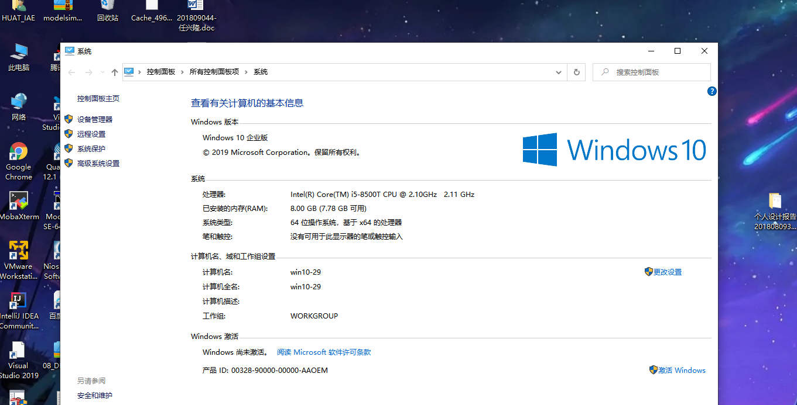
  选择系统属性，点击环境变量

   
    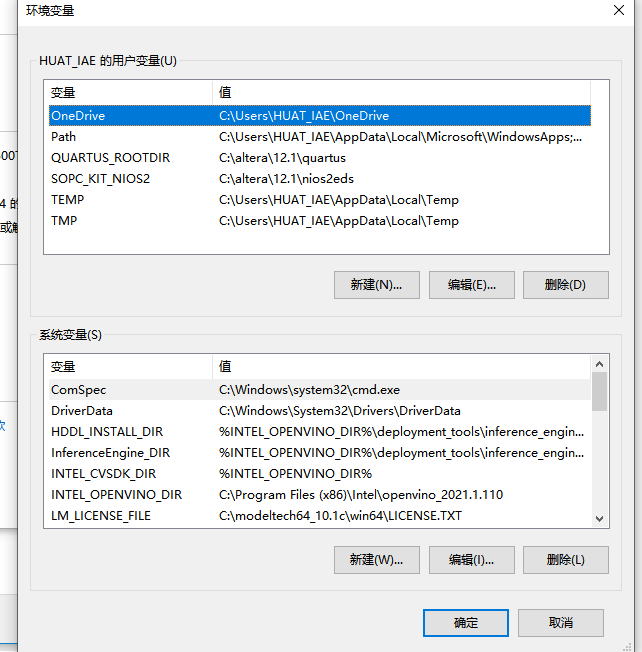

 ##   1.3VS目录包含

 <1>打开visual studio，新建window控制台项目,取个名字，我取的是我的名字张博文拼音

  
    

<2>在属性管理器中进行一次配置，就相当于进行了通用的配置过程

  
    
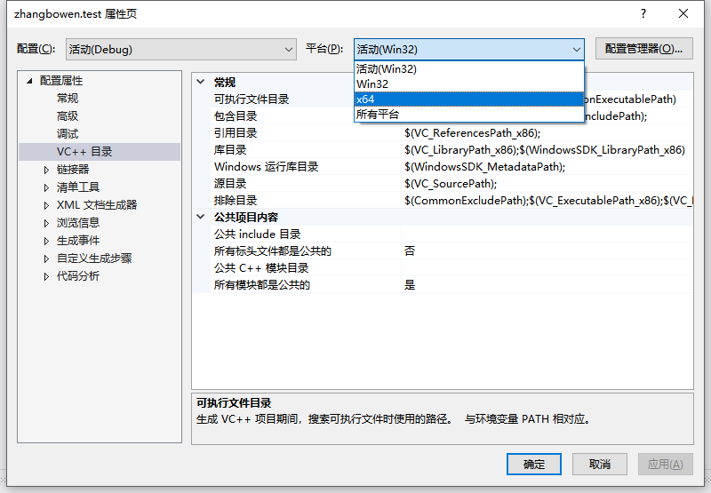
    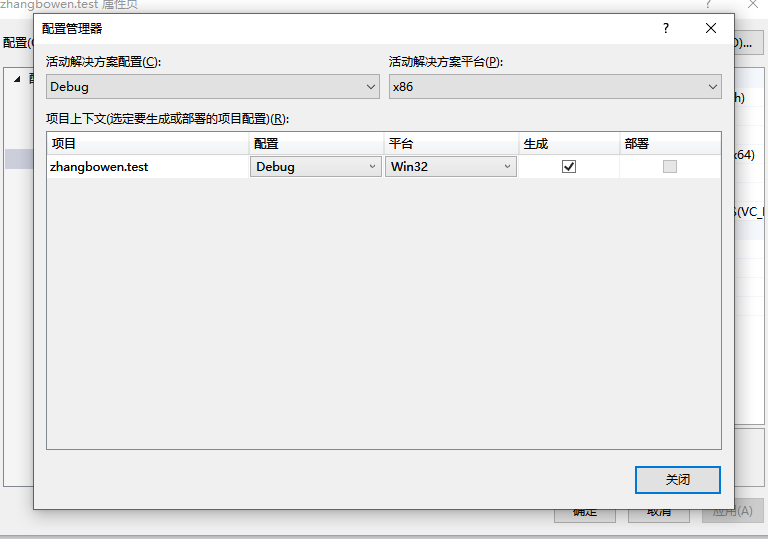
    添加上

G:\opencv\opencv\build\include

G:\opencv\opencv\build\include\opencv

G:\opencv\opencv\build\include\opencv2  这三个目录。

    
   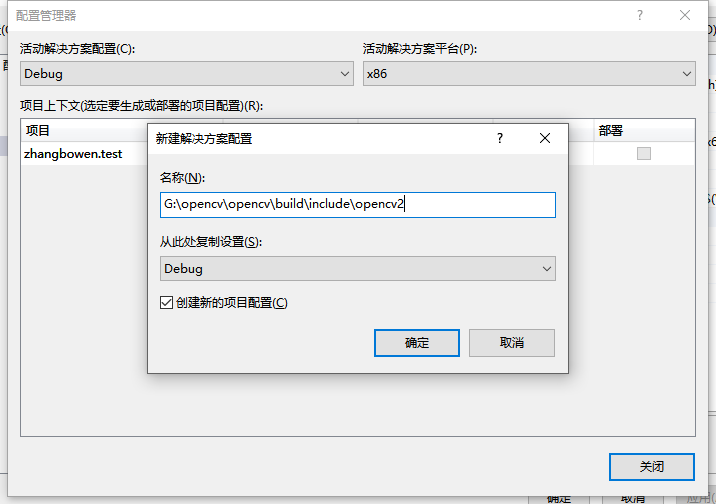

附加依赖项

依然是在“属性管理器”工作区中，双击项目->Debug|x64->Microsoft.Cpp.x64.user即可打开属性页面。【通用属性】 ->【链接器】->【输入】->【附加的依赖项】

 

## 1.4环境检测
测试环境是否配置成功

测试代码：

    //读取图片并显示
    #include "stdio.h"
    #include<iostream> 
    #include <opencv2/core/core.hpp> 
    #include <opencv2/highgui/highgui.hpp> 
    using namespace cv;
    int main()
    {
        Mat img = imread("E:\\1.bmp");
         namedWindow("测试opencv");
         imshow("测试opencv", img);
        cvWaitKey(6000);
    }

  ####  测试成功
 

# 2 目标检测——opencv cascade训练
## 2.1搭建环境，准备样本
新建一个空的文件夹training3（这个文件夹名随便起，但是要和后面的样本路径对应起来），将opencv_traincascade.exe和opencv_createsamples.exe从opencv的bin文件夹中拷贝至该文件夹中，并在training当前目录下创建两个新的文件夹pos和neg分别用来存放正样本和负样本。
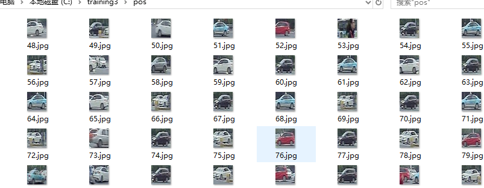

## 2.2生成样本描述文件
 在pos目录下新建一个txt文件，在txt文件中输入dir /b > pos.txt 后保存，改后缀名为.bat生成脚本文件，双击该.bat文件运行可生成一个pos.txt，在pos.txt文本中ctrl+H将所有的jpg替换成jpg 1 0 0 32 32。

 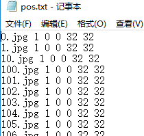

   然后就可以生成正样本vec文件了：返回到training3目录下，新建一个createsamples.txt文档中编辑
    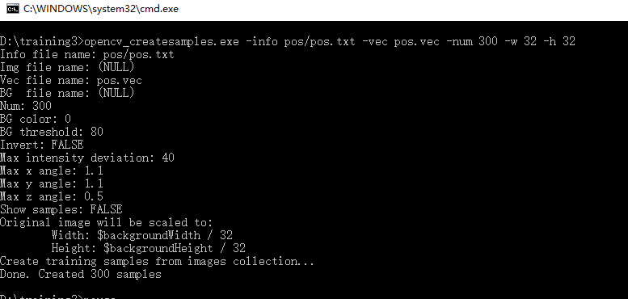

## 2.3训练分类器
双击traincascade.bat运行开始训练
    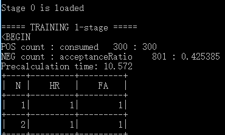

# 3车辆目标检测 
### 3.1建立新的项目
在vs中建立心得项目并运行
  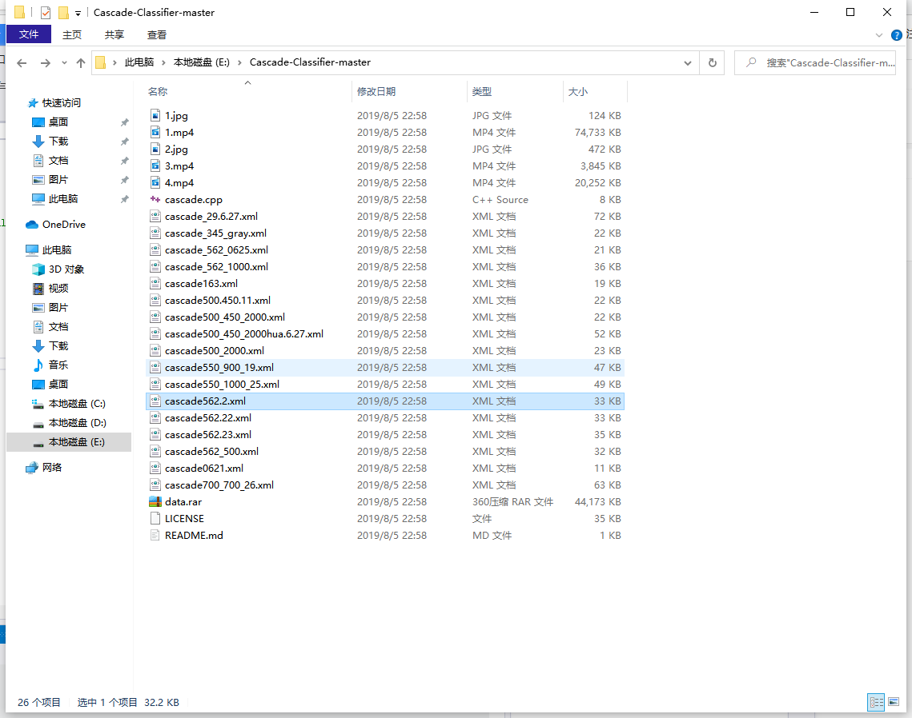
    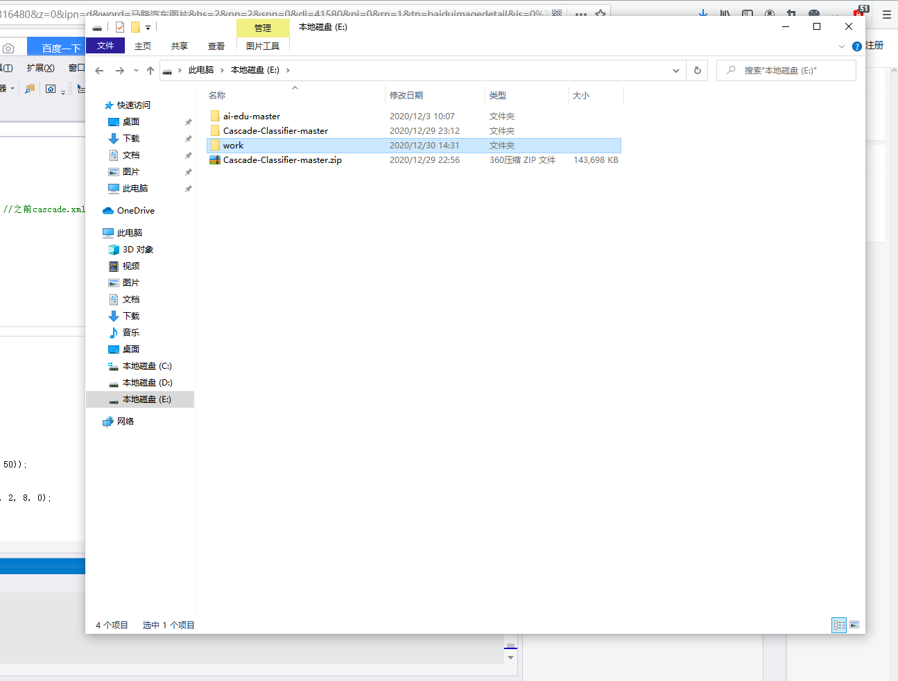

### 3.2保存文件开始运行
  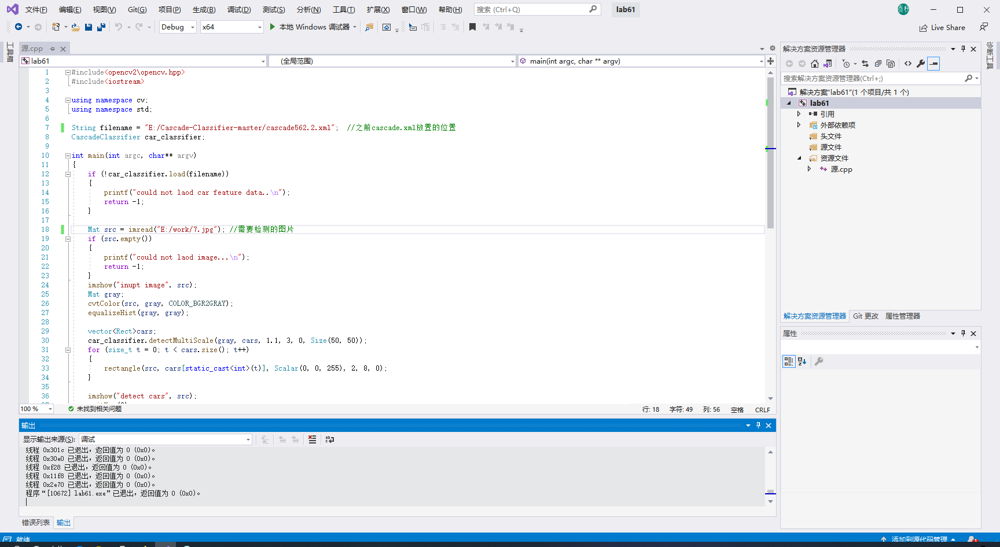

### 3.3运行结果
  

  #  换一张图片继续检测，看是否训练成熟
  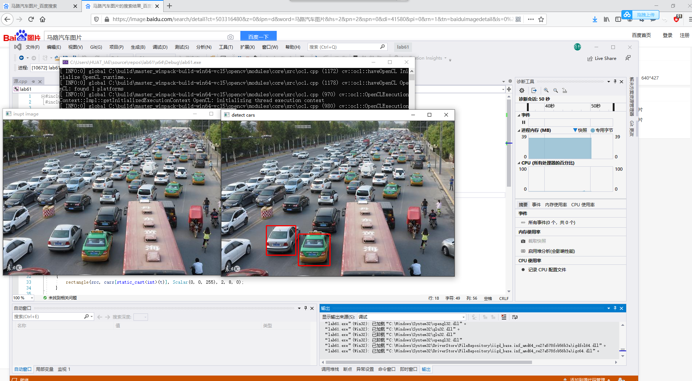

  # 总结
  
系统采用Qt框架,利用Qt中QLable显示视频监控信息,利用Open CV技术对车辆图像进行征识别,结合GIS,通过SQL Sever Data Base管理了道路、监控设备位置等空间位置信息,利用Open Gl展示了空间数据,并通过神经网络预测模型对目标的下一个途经地点进行了预测,实现了系统对监控区域的实时视频监控。测试表明,该系统能够快速高效地进行目标追踪和预测以及辅助生成围堵方案。
# 心得体会
这一次在基于opencv下对车辆进行检测的实验，给我带来了很多新奇的体验，学到了很多与深度学习相关的知识，将课上相学习的知识运用到了实际实验中，并且得到了不少的收获。
其中包括详细的掌握了一些计算机的基本操作指令以及软件vs的使用和一些简单的开发等等。
在最开始的实验中，感觉非常难以操控，但在仔细的观察学习了代码之后，通过调试数据后就能比较好的操控了，所以说做实验的过程中需要学习并明白相关的代码内容，才能更深入的理解实验。

之后的的实验给我的感觉就是，要想要完成一个较为准确的识别，需要先进行大量的图像等学习，然后再通过训练神经网络，才能够成功的完成一种操作。学习的量越大，最终呈现的效果就越好。实验中还会遇到许许多多的问题，有时候需要通过反复的实验或者另辟蹊径才能够完成任务。
总的来说，本次实验学到了很多课堂上无法直观感受到的知识，对相关的知识内容有了更深入的感想。
很感谢老师给我们安排了这样一门课题。