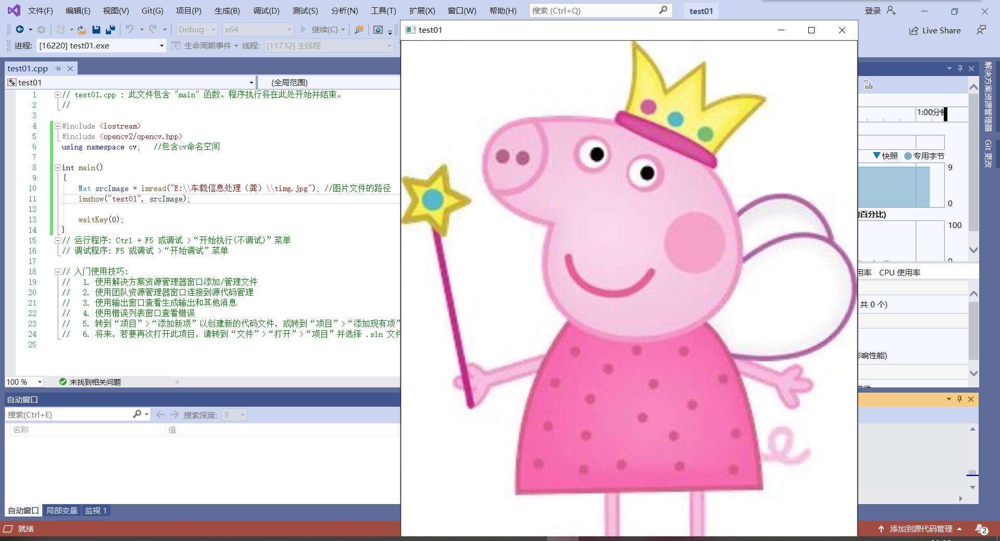
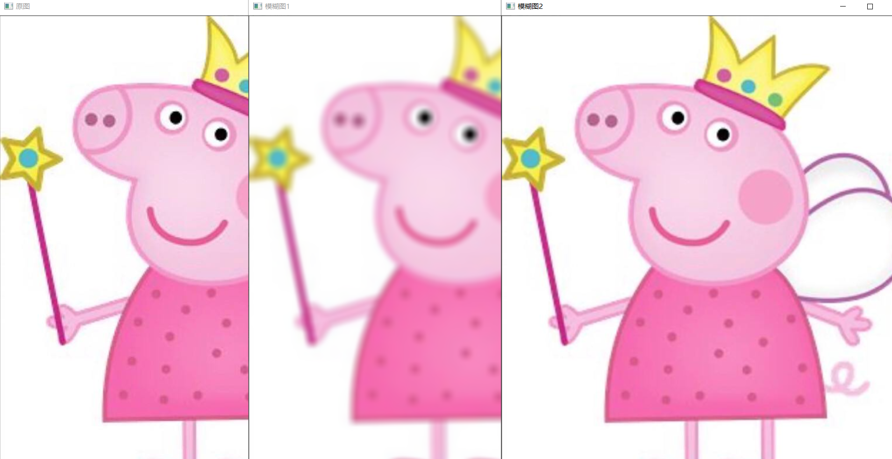
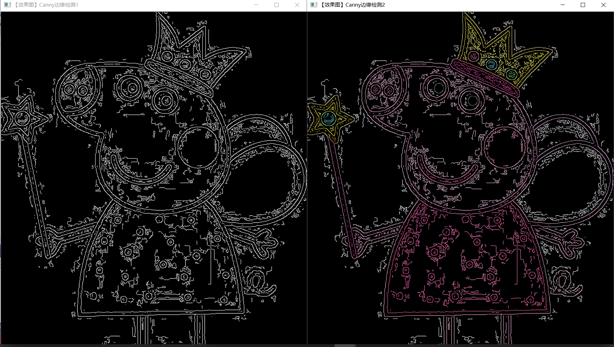
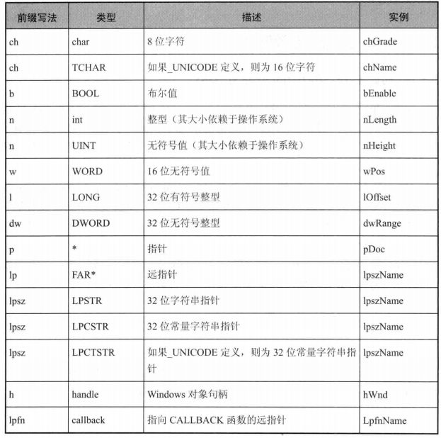
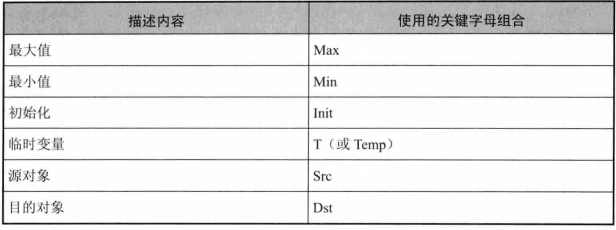
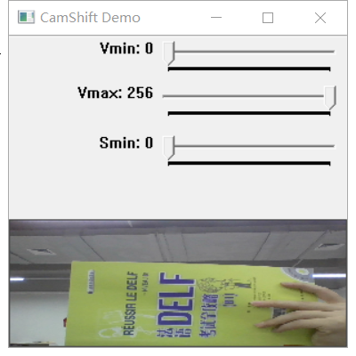
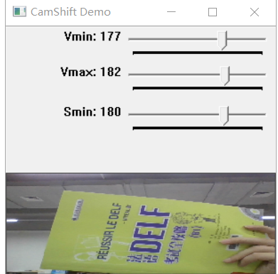

## 一、VS与opencv的配置安装
### 下载OpenCv
1. 下载安装到指定目录。
2. 配置环境变量。 

### 安装VS 2019 Community
1. 下载地址：https://visualstudio.microsoft.com/
2. 安装VS
3. 新建项目工程
4. 布署OpenCv


## 二、OpenCv上实现简单的图像处理
### 图像显示
>实验代码
``` C++
#include <iostream>
#include <opencv2/opencv.hpp>
using namespace cv;   //包含cv命名空间

int main()
{
	Mat srcImage = imread("E:\\车载信息处理（龚）\\timg.jpg"); //图片文件的路径，输入完整路径
	imshow("test01", srcImage);

	waitKey(0);
}
```
>运行结果 
### 图像腐蚀
>实验代码
``` C++
#include<opencv2\highgui\highgui.hpp> //opencv模块头文件
#include<opencv2\imgproc\imgproc.hpp> //opencv图像处理头文件
using namespace cv; //包含cv命令空间

int main() //控制台应用程序的入口函数，我们的程序从这里开始
{
    Mat srcImage = imread("E:\\车载信息处理（龚）\\timg.jpg"); //载入原图
    imshow("[原图腐蚀]", srcImage); //显示原图
    Mat element = getStructuringElement(MORPH_RECT, Size(15, 15)); //进行腐蚀操作，获取自定义核
    Mat dstImage;
    erode(srcImage, dstImage, element);//从src输入，由dst输出
    imshow("[效果图]腐蚀操作", dstImage);//显示效果图
    waitKey(0); //等待任意按键按下
    return 0;

}
```
>运行结果 

### 图像模糊
>实验代码
``` C++
#include <stdio.h>
#include<opencv2/opencv.hpp>
using namespace cv;
using namespace std;


int main()
{
	Mat Img = imread("E:\\车载信息处理（龚）\\timg.jpg"); //载入原始图
	imshow("原图", Img);//显示原始图

	Mat dstImage;
	blur(Img, dstImage, Size(15, 15));// 进行均值滤波操作
	imshow("模糊图1", dstImage);// 显示效果图

	blur(Img, dstImage, Size(2, 2));
	imshow("模糊图2", dstImage);
	waitKey(0);

	return 0;
}
```
>运行结果 

### canny边缘检测
>实验代码
``` C++
#include <opencv2/opencv.hpp>
#include <opencv2/highgui/highgui.hpp>
#include <opencv2/imgproc/imgproc.hpp>

using namespace cv;

//main()函数
//应用程序入口
int main()
{
    Mat src = imread("E:\\车载信息处理（龚）\\timg.jpg");
    Mat src1 = src.clone();

    //显示原始图
    imshow("【原始图】Canny边缘检测", src);
    //转化为灰度图，减噪，然后用canny得到的边缘作为掩码，拷贝原图到效果图，得到彩色的边缘图
    Mat dst, edge, gray;

    //创建与src同类型和大小的矩阵
    dst.create(src1.size(), src1.type());

    //将原图像转换为灰度图像
    cvtColor(src1, gray, COLOR_BGR2GRAY);

    //使用3×3内核降噪
    blur(gray, edge, Size(3, 3));

    //使用canny算子
    Canny(edge, edge, 3, 9, 3);

    imshow("【效果图】Canny边缘检测1", edge);
    //将dstImage内所有元素为0
    dst = Scalar::all(0);

    //使用Canny算子输出的边缘图，g_cannyDetectedEdges作为掩码，来将原图g_srcImage拷贝到目标图g_dstImage中
    src1.copyTo(dst, edge);
    imshow("【效果图】Canny边缘检测2", dst);
    waitKey(0);
    return 0;
}
```
>运行结果 
### 调用摄像头采集图像
> 实验代码
``` C++
#include "opencv2/opencv.hpp"
using namespace cv;

int main() {
	VideoCapture capture(0);
	Mat edges;
	while (1) {
		Mat frame;
		capture >> frame;
		cvtColor(frame, edges, COLOR_BGR2GRAY);
		blur(edges, edges, Size(7, 7));
		Canny(edges, edges, 0, 30, 3);
		imshow("被canny后的视频", edges);
		if (waitKey(30) >= 0) break;
	}
	return 0;

}
```
>运行结果 
#### ch01小结
在这个小章节中，我初步了解了OpenCv的一部分知识，大概了解了VS的使用步骤，并且通过几个实验感受到了OpenCv的魅力，激发了我去探索地兴趣。

## 三、深入了解OpenCv
### 命名规范约定
使用一套成熟地命名规则，不仅可以让我们规范行事，还可以让别人在阅读我们书写的代码时，可以更好更快地理解我们的思路，从而增强了代码的可读性，方便各程序员之间相互交流代码。

### 变量命名规范

### 关键字字母组合

### 理解argc和argv
>argc和argv中的arg指的是“参数”(例如：arguments,argument,counter和argument vector)。其中，argc为参数，用来统计运行程序时送给main函数的命令行参数的个数；而*argv[]:为字符串数组，用来存放指向字符串参数的指针数组，每一个元素指向一个参数。

### OpenCv官方例程实验
实验代码见该网址：https://www.cnblogs.com/xingkongcanghai/p/11151778.html
#### 彩色目标跟踪
程序的用法是根据鼠标框选区域的色度光谱来进行摄像头读入的视频目标跟踪，其主要采用CamShift算法。
>实验结果
 

#### 用光流法进行运动目标检测
#### 点追踪
>实验结果
  
我们在摄像头中移动物体可以看到物体上的点随着物体一起移动。

#### ch02小结
通过OpenCv的几个官方例程感受到了它强大的功能，并且复习了C语言相关的基础函数也对命名规则更加了解。

## 四、HighGUI图形用户界面初步认识
### OpenCv的命名空间
OpenCv中的C++类和函数都是定义在命名空间cv之内的，有两种方法可以访问：第一种，是在代码开头的适当位置加上usingnamespace cv;这句代码规定程序位于此命名空间之内；另外一种是在使用opencv的每一个类函数时都加入cv::命名空间。
>比如在写简单的OpenCV程序的时候，以下三句可以作为标配：
```
# include <opencv2/core/core.hpp>
# include <opencv2/highgui/highgui.hpp>
using namespace cv;
```
### Mat类简析
Mat类是用于保存图像以及其他矩阵数据的数据结构，默认情况下其尺寸为0。
当我们指定其尺寸时，比如定义一个Mat类对象，就要写cv：：Mat pic(320,640,cv::Scalar(100))。
### 关于图像的各种函数
#### 图像载入imread()函数
支持如下类型的图像载入：

#### 图像显示inshow（）函数
#### 创建窗口namedWindow()函数
#### 输出图像到文件imwrite()函数
#### ch03小结
在这一节当中，我学习到了OpenCV的高层GUI图像用户界面模块highgui中最重要的几个方面，分别是图像的载入、显示与输出图像到文件，并且了解了对应的函数以及对如何使用这些函数有了更深刻的体会。


