# 第五次作业
# 201808093
# 张博文


# 第17章 卷积神经网络原理


###  卷积核的作用

# 卷积核。
卷积网络之所以能工作，完全是卷积核的功劳。什么是卷积核呢？卷积核其实就是一个小矩阵，类似这样：

```
1.1  0.23  -0.45
0.1  -2.1   1.24
0.74 -1.32  0.01
```

这是一个3x3的卷积核，还会有1x1、5x5、7x7、9x9、11x11的卷积核。在卷积层中，我们会用输入数据与卷积核相乘，得到输出数据，就类似全连接层中的Weights一样，所以卷积核里的数值，也是通过反向传播的方法学习到的。

下面我们看看卷积核的具体作用

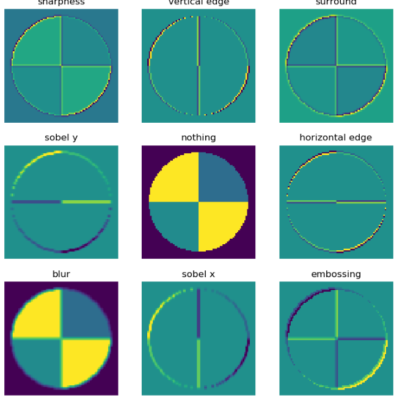

图17-6 卷积核的作用

图17-6中所示的内容，是使用9个不同的卷积核在同一张图上运算后得到的结果，而表17-1中按顺序列出了9个卷积核的数值和名称，可以一一对应到上面的9张图中。

表17-1 卷积的效果

||1|2|3|
|---|---|---|---|
|1|0,-1, 0<br>-1, 5,-1<br>0,-1, 0|0, 0, 0 <br> -1, 2,-1 <br> 0, 0, 0|1, 1, 1 <br> 1,-9, 1 <br> 1, 1, 1|
||sharpness|vertical edge|surround|
|2|-1,-2, -1 <br> 0, 0, 0<br>1, 2, 1|0, 0, 0 <br> 0, 1, 0 <br> 0, 0, 0|0,-1, 0 <br> 0, 2, 0 <br> 0,-1, 0|
||sobel y|nothing|horizontal edge|
|3|0.11,0.11,0.11 <br>0.11,0.11,0.11<br>0.11,0.11,0.11|-1, 0, 1 <br> -2, 0, 2 <br> -1, 0, 1|2, 0, 0 <br> 0,-1, 0 <br> 0, 0,-1|
||blur|sobel x|embossing|

我们先说中间那个图，就是第5个卷积核，叫做"nothing"。为什么叫nothing呢？因为这个卷积核在与原始图片计算后得到的结果，和原始图片一模一样，所以我们看到的图5就是相当于原始图片，放在中间是为了方便和其它卷积核的效果做对比。


### 卷积后续的运算

前面我们认识到了卷积核的强大能力，卷积神经网络通过反向传播而令卷积核自我学习，找到分布在图片中的不同的feature，最后形成的卷积核中的数据。但是如果想达到这种效果，只有卷积层的话是不够的，还需要激活函数、池化等操作的配合。

图17-7中的四个子图，依次展示了：

1. 原图
2. 卷积结果
3. 激活结果
4. 池化结果

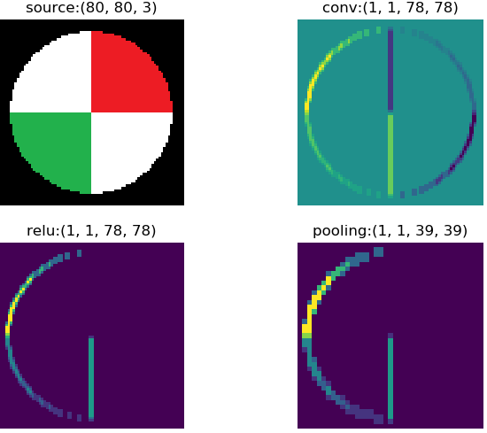

图17-7 原图经过卷积-激活-池化操作后的效果

1. 注意图一是原始图片，用cv2读取出来的图片，其顺序是反向的，即：

- 第一维是高度
- 第二维是宽度
- 第三维是彩色通道数，但是其顺序为BGR，而不是常用的RGB

1. 我们对原始图片使用了一个3x1x3x3的卷积核，因为原始图片为彩色图片，所以第一个维度是3，对应RGB三个彩色通道；我们希望只输出一张feature map，以便于说明，所以第二维是1；我们使用了3x3的卷积核，用的是sobel x算子。所以图二是卷积后的结果。

2. 图三做了一层Relu激活计算，把小于0的值都去掉了，只留下了一些边的特征。

3. 图四是图三的四分之一大小，虽然图片缩小了，但是特征都没有丢失，反而因为图像尺寸变小而变得密集，亮点的密度要比图三大而粗。

###  卷积神经网络的学习

从17.0.2节中的整体图中，可以看到在卷积-池化等一些列操作的后面，要接全连接层，这里的全连接层和我们在前面学习的深度网络的功能一模一样，都是做为分类层使用。

在最后一层的池化后面，把所有特征数据变成一个一维的全连接层，然后就和普通的深度全连接网络一样了，通过在最后一层的softmax分类函数，以及多分类交叉熵函数，对比图片的OneHot编码标签，回传误差值，从全连接层传回到池化层，通过激活函数层再回传给卷积层，对卷积核的数值进行梯度更新，实现卷积核数值的自我学习。
# 实验运行
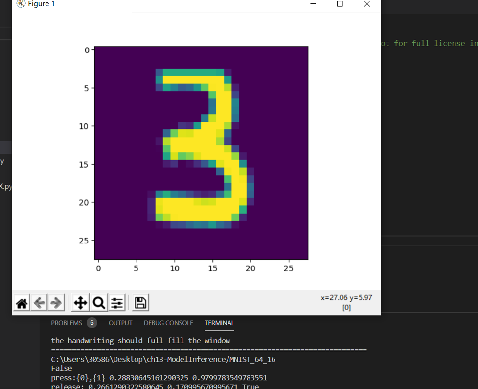
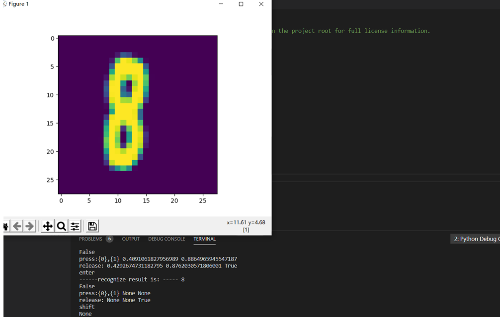
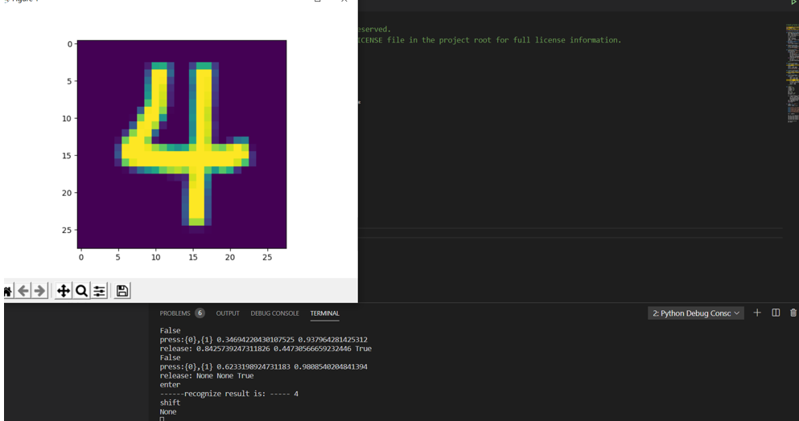
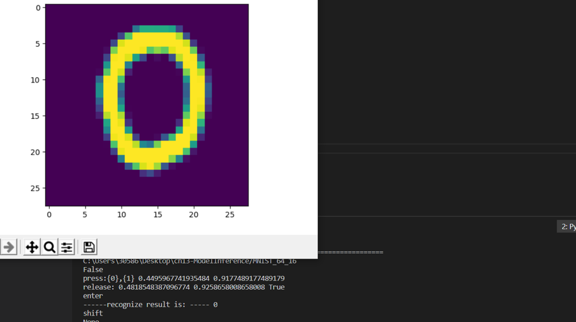


## 卷积前向计算代码实现

###  卷积核的实现

代码：

class ConvWeightsBias(WeightsBias_2_1):
    def __init__(self, output_c, input_c, filter_h, filter_w, init_method, optimizer_name, eta):
        self.FilterCount = output_c
        self.KernalCount = input_c
        self.KernalHeight = filter_h
        self.KernalWidth = filter_w
        ...

    def Initialize(self, folder, name, create_new):
        self.WBShape = (self.FilterCount, self.KernalCount, self.KernalHeight, self.KernalWidth)        
        ...


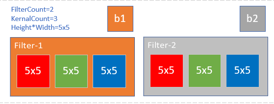

图17-19 卷积核的组成


### 卷积前向运算的实现 
```python
class ConvLayer(CLayer):
    def forward(self, x, train=True):
        self.x = x
        self.batch_size = self.x.shape[0]
        # 如果有必要的话，先对输入矩阵做padding
        if self.padding > 0:
            self.padded = np.pad(...)
        else:
            self.padded = self.x
        #end if
        self.z = conv_4d(...)
        return self.z
`   四维卷积运算：

```Python
def conv_4d(x, weights, bias, out_h, out_w, stride=1):
    batch_size = x.shape[0]
    input_channel = x.shape[1]
    output_channel = weights.shape[0]
    filter_height = weights.shape[2]
    filter_width = weights.shape[3]
    rs = np.zeros((batch_size, num_output_channel, out_h, out_w))

    for bs in range(batch_size):
        for oc in range(output_channel):
            rs[bs,oc] += bias[oc]
            for ic in range(input_channel):
                for i in range(out_h):
                    for j in range(out_w):
                        ii = i * stride
                        jj = j * stride
                        for fh in range(filter_height):
                            for fw in range(filter_width):
                                rs[bs,oc,i,j] += x[bs,ic,fh+ii,fw+jj] * weights[oc,ic,fh,fw]
```

上面的函数包含以下几重循环：

1. 批量数据循环（第一维）：`bs in batch_size`，对每个样本进行计算；
2. 输出通道循环（第二维）：`oc in output_channel`。这里先把`bias`加上了，后加也可以；
3. 输入通道循环：`ic in input_channel`;
4. 输出图像纵坐标循环：`i in out h`；
5. 输出图像横坐标循环：`j in out_w`。循环4和5完成对输出图像的每个点的遍历，在下面的子循环中计算并填充值；
6. 卷积核纵向循环（第三维）：`fh in filter_height`；
7. 卷积核横向循环（第四维）：`fw in filter_width`。循环6和7完成卷积核与输入图像的卷积计算，并保存到循环4和5指定的输出图像的点上。

我们试着运行上面的代码并循环10次，看看它的执行效率如何：

```
Time used for Python: 38.057225465774536
```

出乎我们的预料，在足足等了30多秒后，才返回结果。

通过试验发现，其运行速度非常慢，如果这样的函数在神经网络训练中被调用几十万次，其性能是非常糟糕的，这也是`Python`做为动态语言的一个缺点。

<!--Copyright © Microsoft Corporation. All rights reserved.
  适用于[License](https://github.com/Microsoft/ai-edu/blob/master/LICENSE.md)版权许可-->

## 17.3 卷积层的训练

同全连接层一样，卷积层的训练也需要从上一层回传的误差矩阵，然后计算：

1. 本层的权重矩阵的误差项
2. 本层的需要回传到下一层的误差矩阵

在下面的描述中，我们假设已经得到了从上一层回传的误差矩阵，并且已经经过了激活函数的反向传导。

### 17.3.1 计算反向传播的梯度矩阵

正向公式：

$$Z = W*A+b \tag{0}$$

其中，W是卷积核，*表示卷积（互相关）计算，A为当前层的输入项，b是偏移（未在图中画出），Z为当前层的输出项，但尚未经过激活函数处理。

我们举一个具体的例子便于分析。图17-21是正向计算过程。


图17-21 卷积正向运算

分解到每一项就是下列公式：

$$z_{11} = w_{11} \cdot a_{11} + w_{12} \cdot a_{12} + w_{21} \cdot a_{21} + w_{22} \cdot a_{22} + b \tag{1}$$
$$z_{12} = w_{11} \cdot a_{12} + w_{12} \cdot a_{13} + w_{21} \cdot a_{22} + w_{22} \cdot a_{23} + b \tag{2}$$
$$z_{21} = w_{11} \cdot a_{21} + w_{12} \cdot a_{22} + w_{21} \cdot a_{31} + w_{22} \cdot a_{32} + b \tag{3}$$
$$z_{22} = w_{11} \cdot a_{22} + w_{12} \cdot a_{23} + w_{21} \cdot a_{32} + w_{22} \cdot a_{33} + b \tag{4}$$

求损失函数$J$对$a_{11}$的梯度：

$$
\frac{\partial J}{\partial a_{11}}=\frac{\partial J}{\partial z_{11}} \frac{\partial z_{11}}{\partial a_{11}}=\delta_{z11}\cdot w_{11} \tag{5}
$$

上式中，$\delta_{z11}$是从网络后端回传到本层的$z_{11}$单元的梯度。

求$J$对$a_{12}$的梯度时，先看正向公式，发现$a_{12}$对$z_{11}$和$z_{12}$都有贡献，因此需要二者的偏导数相加：

$$
\frac{\partial J}{\partial a_{12}}=\frac{\partial J}{\partial z_{11}} \frac{\partial z_{11}}{\partial a_{12}}+\frac{\partial J}{\partial z_{12}} \frac{\partial z_{12}}{\partial a_{12}}=\delta_{z11} \cdot w_{12}+\delta_{z12} \cdot w_{11} \tag{6}
$$

最复杂的是求$a_{22}$的梯度，因为从正向公式看，所有的输出都有$a_{22}$的贡献，所以：

$$
\frac{\partial J}{\partial a_{22}}=\frac{\partial J}{\partial z_{11}} \frac{\partial z_{11}}{\partial a_{22}}+\frac{\partial J}{\partial z_{12}} \frac{\partial z_{12}}{\partial a_{22}}+\frac{\partial J}{\partial z_{21}} \frac{\partial z_{21}}{\partial a_{22}}+\frac{\partial J}{\partial z_{22}} \frac{\partial z_{22}}{\partial a_{22}} 
$$
$$
=\delta_{z11} \cdot w_{22} + \delta_{z12} \cdot w_{21} + \delta_{z21} \cdot w_{12} + \delta_{z22} \cdot w_{11} \tag{7}
$$

同理可得所有$a$的梯度。

观察公式7中的$w$的顺序，貌似是把原始的卷积核旋转了180度，再与传入误差项做卷积操作，即可得到所有元素的误差项。而公式5和公式6并不完备，是因为二者处于角落，这和卷积正向计算中的padding是相同的现象。因此，我们把传入的误差矩阵Delta-In做一个zero padding，再乘以旋转180度的卷积核，就是要传出的误差矩阵Delta-Out，如图17-22所示。


图17-22 卷积运算中的误差反向传播

最后可以统一成为一个简洁的公式：

$$\delta_{out} = \delta_{in} * W^{rot180} \tag{8}$$

这个误差矩阵可以继续回传到下一层。

- 当Weights是$3\times 3$时，$\delta_{in}$需要padding=2，即加2圈0，才能和Weights卷积后，得到正确尺寸的$\delta_{out}$
- 当Weights是$5\times 5$时，$\delta_{in}$需要padding=4，即加4圈0，才能和Weights卷积后，得到正确尺寸的$\delta_{out}$
- 以此类推：当Weights是$N\times N$时，$\delta_{in}$需要padding=N-1，即加N-1圈0

举例：

正向时stride=1：$A^{(10 \times 8)}*W^{(5 \times 5)}=Z^{(6 \times 4)}$

反向时，$\delta_z^{(6 \times 4)} + 4 padding = \delta_z^{(14 \times 12)}$

然后：$\delta_z^{(14 \times 12)} * W^{rot180(5 \times 5)}= \delta_a^{(10 \times 8)}$

### 17.3.2 步长不为1时的梯度矩阵还原

我们先观察一下stride=1和2时，卷积结果的差异如图17-23。


图17-23 步长为1和步长为2的卷积结果的比较

二者的差别就是中间那个结果图的灰色部分。如果反向传播时，传入的误差矩阵是stride=2时的2x2的形状，那么我们只需要把它补上一个十字，变成3x3的误差矩阵，就可以用步长为1的算法了。

以此类推，如果步长为3时，需要补一个双线的十字。所以，当知道当前的卷积层步长为S（S>1）时：

1. 得到从上层回传的误差矩阵形状，假设为$M \times N$
2. 初始化一个$(M \cdot S) \times (N \cdot S)$的零矩阵
3. 把传入的误差矩阵的第一行值放到零矩阵第0行的0,S,2S,3S...位置
4. 然后把误差矩阵的第二行的值放到零矩阵第S行的0,S,2S,3S...位置
5. ......

步长为2时，用实例表示就是这样：

$$
\begin{bmatrix}
  \delta_{11} & 0 & \delta_{12} & 0 & \delta_{13}\\\\
  0 & 0 & 0 & 0 & 0\\\\
  \delta_{21} & 0 & \delta_{22} & 0 & \delta_{23}\\\\
\end{bmatrix}
$$ 

步长为3时，用实例表示就是这样：

$$
\begin{bmatrix}
  \delta_{11} & 0 & 0 & \delta_{12} & 0 & 0 & \delta_{13}\\\\
  0 & 0 & 0 & 0 & 0 & 0 & 0\\\\
  0 & 0 & 0 & 0 & 0 & 0 & 0\\\\
  \delta_{21} & 0 & 0 & \delta_{22} & 0 & 0 & \delta_{23}\\\\
\end{bmatrix}
$$ 

### 17.3.3 有多个卷积核时的梯度计算

有多个卷积核也就意味着有多个输出通道。

也就是14.1中的升维卷积，如图17-24。


图17-24 升维卷积

正向公式：

$$z_{111} = w_{111} \cdot a_{11} + w_{112} \cdot a_{12} + w_{121} \cdot a_{21} + w_{122} \cdot a_{22}$$
$$z_{112} = w_{111} \cdot a_{12} + w_{112} \cdot a_{13} + w_{121} \cdot a_{22} + w_{122} \cdot a_{23}$$
$$z_{121} = w_{111} \cdot a_{21} + w_{112} \cdot a_{22} + w_{121} \cdot a_{31} + w_{122} \cdot a_{32}$$
$$z_{122} = w_{111} \cdot a_{22} + w_{112} \cdot a_{23} + w_{121} \cdot a_{32} + w_{122} \cdot a_{33}$$

$$z_{211} = w_{211} \cdot a_{11} + w_{212} \cdot a_{12} + w_{221} \cdot a_{21} + w_{222} \cdot a_{22}$$
$$z_{212} = w_{211} \cdot a_{12} + w_{212} \cdot a_{13} + w_{221} \cdot a_{22} + w_{222} \cdot a_{23}$$
$$z_{221} = w_{211} \cdot a_{21} + w_{212} \cdot a_{22} + w_{221} \cdot a_{31} + w_{222} \cdot a_{32}$$
$$z_{222} = w_{211} \cdot a_{22} + w_{212} \cdot a_{23} + w_{221} \cdot a_{32} + w_{222} \cdot a_{33}$$

求$J$对$a_{22}$的梯度：

$$
\begin{aligned}
\frac{\partial J}{\partial a_{22}}&=\frac{\partial J}{\partial Z_{1}} \frac{\partial Z_{1}}{\partial a_{22}}+\frac{\partial J}{\partial Z_{2}} \frac{\partial Z_{2}}{\partial a_{22}} \\\\
&=\frac{\partial J}{\partial z_{111}} \frac{\partial z_{111}}{\partial a_{22}}+\frac{\partial J}{\partial z_{112}} \frac{\partial z_{112}}{\partial a_{22}}+\frac{\partial J}{\partial z_{121}} \frac{\partial z_{121}}{\partial a_{22}}+\frac{\partial J}{\partial z_{122}} \frac{\partial z_{122}}{\partial a_{22}} \\\\
&+\frac{\partial J}{\partial z_{211}} \frac{\partial z_{211}}{\partial a_{22}}+\frac{\partial J}{\partial z_{212}} \frac{\partial z_{212}}{\partial a_{22}}+\frac{\partial J}{\partial z_{221}} \frac{\partial z_{221}}{\partial a_{22}}+\frac{\partial J}{\partial z_{222}} \frac{\partial z_{222}}{\partial a_{22}} \\\\
&=(\delta_{z111} \cdot w_{122} + \delta_{z112} \cdot w_{121} + \delta_{z121} \cdot w_{112} + \delta_{z122} \cdot w_{111}) \\\\
&+(\delta_{z211} \cdot w_{222} + \delta_{z212} \cdot w_{221} + \delta_{z221} \cdot w_{212} + \delta_{z222} \cdot w_{211})\\\\
&=\delta_{z1} * W_1^{rot180} + \delta_{z2} * W_2^{rot180} 
\end{aligned}
$$

因此和公式8相似，先在$\delta_{in}$外面加padding，然后和对应的旋转后的卷积核相乘，再把几个结果相加，就得到了需要前传的梯度矩阵：

$$\delta_{out} = \sum_m \delta_{in\_m} * W^{rot180}_ m \tag{9}$$

### 17.3.4 有多个输入时的梯度计算

当输入层是多个图层时，每个图层必须对应一个卷积核，如图17-25。


图17-25 多个图层的卷积必须有一一对应的卷积核

所以有前向公式：

$$
\begin{aligned}
z_{11} &= w_{111} \cdot a_{111} + w_{112} \cdot a_{112} + w_{121} \cdot a_{121} + w_{122} \cdot a_{122}
\\\\
&+ w_{211} \cdot a_{211} + w_{212} \cdot a_{212} + w_{221} \cdot a_{221} + w_{222} \cdot a_{222} 
\end{aligned}
\tag{10}
$$
$$
\begin{aligned}
z_{12} &= w_{111} \cdot a_{112} + w_{112} \cdot a_{113} + w_{121} \cdot a_{122} + w_{122} \cdot a_{123} \\\\
&+ w_{211} \cdot a_{212} + w_{212} \cdot a_{213} + w_{221} \cdot a_{222} + w_{222} \cdot a_{223} 
\end{aligned}\tag{11}$$
$$
\begin{aligned}
z_{21} &= w_{111} \cdot a_{121} + w_{112} \cdot a_{122} + w_{121} \cdot a_{131} + w_{122} \cdot a_{132} \\\\
&+ w_{211} \cdot a_{221} + w_{212} \cdot a_{222} + w_{221} \cdot a_{231} + w_{222} \cdot a_{232} 
\end{aligned}\tag{12}$$
$$
\begin{aligned}
z_{22} &= w_{111} \cdot a_{122} + w_{112} \cdot a_{123} + w_{121} \cdot a_{132} + w_{122} \cdot a_{133} \\\\
&+ w_{211} \cdot a_{222} + w_{212} \cdot a_{223} + w_{221} \cdot a_{232} + w_{222} \cdot a_{233} 
\end{aligned}\tag{13}$$

最复杂的情况，求$J$对$a_{122}$的梯度：

$$
\begin{aligned}
\frac{\partial J}{\partial a_{111}}&=\frac{\partial J}{\partial z_{11}}\frac{\partial z_{11}}{\partial a_{122}} + \frac{\partial J}{\partial z_{12}}\frac{\partial z_{12}}{\partial a_{122}} + \frac{\partial J}{\partial z_{21}}\frac{\partial z_{21}}{\partial a_{122}} + \frac{\partial J}{\partial z_{22}}\frac{\partial z_{22}}{\partial a_{122}}
\\\\
&=\delta_{z_{11}} \cdot w_{122} + \delta_{z_{12}} \cdot w_{121} + \delta_{z_{21}} \cdot w_{112} + \delta_{z_{22}} \cdot w_{111} 
\end{aligned}
$$

泛化以后得到：

$$\delta_{out1} = \delta_{in} * W_1^{rot180} \tag{14}$$

求$J$对$a_{222}$的梯度：

$$
\begin{aligned}
\frac{\partial J}{\partial a_{211}}&=\frac{\partial J}{\partial z_{11}}\frac{\partial z_{11}}{\partial a_{222}} + \frac{\partial J}{\partial z_{12}}\frac{\partial z_{12}}{\partial a_{222}} + \frac{\partial J}{\partial z_{21}}\frac{\partial z_{21}}{\partial a_{222}} + \frac{\partial J}{\partial z_{22}}\frac{\partial z_{22}}{\partial a_{222}} \\\\
&=\delta_{z_{11}} \cdot w_{222} + \delta_{z_{12}} \cdot w_{221} + \delta_{z_{21}} \cdot w_{212} + \delta_{z_{22}} \cdot w_{211} 
\end{aligned}
$$

泛化以后得到：

$$\delta_{out2} = \delta_{in} * W_2^{rot180} \tag{15}$$

### 17.3.5 权重（卷积核）梯度计算

图17-26展示了我们已经熟悉的卷积正向运算。


图17-26 卷积正向计算

要求J对w11的梯度，从正向公式可以看到，w11对所有的z都有贡献，所以：

$$
\begin{aligned}
\frac{\partial J}{\partial w_{11}} &= \frac{\partial J}{\partial z_{11}}\frac{\partial z_{11}}{\partial w_{11}} + \frac{\partial J}{\partial z_{12}}\frac{\partial z_{12}}{\partial w_{11}} + \frac{\partial J}{\partial z_{21}}\frac{\partial z_{21}}{\partial w_{11}} + \frac{\partial J}{\partial z_{22}}\frac{\partial z_{22}}{\partial w_{11}}
\\\\
&=\delta_{z11} \cdot a_{11} + \delta_{z12} \cdot a_{12} + \delta_{z21} \cdot a_{21} + \delta_{z22} \cdot a_{22} 
\end{aligned}
\tag{9}
$$

对W22也是一样的：

$$
\begin{aligned}
\frac{\partial J}{\partial w_{12}} &= \frac{\partial J}{\partial z_{11}}\frac{\partial z_{11}}{\partial w_{12}} + \frac{\partial J}{\partial z_{12}}\frac{\partial z_{12}}{\partial w_{12}} + \frac{\partial J}{\partial z_{21}}\frac{\partial z_{21}}{\partial w_{12}} + \frac{\partial J}{\partial z_{22}}\frac{\partial z_{22}}{\partial w_{12}}
\\\\
&=\delta_{z11} \cdot a_{12} + \delta_{z12} \cdot a_{13} + \delta_{z21} \cdot a_{22} + \delta_{z22} \cdot a_{23} 
\end{aligned}
\tag{10}
$$

观察公式8和公式9，其实也是一个标准的卷积（互相关）操作过程，因此，可以把这个过程看成图17-27。


图17-27 卷积核的梯度计算

总结成一个公式：

$$\delta_w = A * \delta_{in} \tag{11}$$

### 17.3.6 偏移的梯度计算

根据前向计算公式1，2，3，4，可以得到：

$$
\begin{aligned}
\frac{\partial J}{\partial b} &= \frac{\partial J}{\partial z_{11}}\frac{\partial z_{11}}{\partial b} + \frac{\partial J}{\partial z_{12}}\frac{\partial z_{12}}{\partial b} + \frac{\partial J}{\partial z_{21}}\frac{\partial z_{21}}{\partial b} + \frac{\partial J}{\partial z_{22}}\frac{\partial z_{22}}{\partial b}
\\\\
&=\delta_{z11} + \delta_{z12}  + \delta_{z21} + \delta_{z22} 
\end{aligned}
\tag{12}
$$

所以：

$$
\delta_b = \delta_{in} \tag{13}
$$

每个卷积核W可能会有多个filter，或者叫子核，但是一个卷积核只有一个偏移，无论有多少子核。

### 17.3.7 计算卷积核梯度的实例说明

下面我们会用一个简单的例子来说明卷积核的训练过程。我们先制作一张样本图片，然后使用“横边检测”算子做为卷积核对该样本进行卷积，得到对比如图17-28。

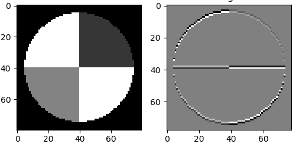

图17-28 原图和经过横边检测算子的卷积结果

左侧为原始图片（80x80的灰度图），右侧为经过3x3的卷积后的结果图片（78x78的灰度图）。由于算子是横边检测，所以只保留了原始图片中的横边。

卷积核矩阵：

$$
w=\begin{pmatrix}
  0 & -1 & 0 \\\\
  0 & 2 & 0 \\\\
  0 & -1 & 0
\end{pmatrix}
$$

现在我们转换一下问题：假设我们有一张原始图片（如左侧）和一张目标图片（如右侧），我们如何得到对应的卷积核呢？

我们在前面学习了线性拟合的解决方案，实际上这个问题是同一种性质的，只不过把直线拟合点阵的问题，变成了图像拟合图像的问题，如表17-3所示。

表17-3 直线拟合与图像拟合的比较

||样本数据|标签数据|预测数据|公式|损失函数|
|---|---|---|---|---|---|
|直线拟合|样本点x|标签值y|预测直线z|$z=x \cdot w+b$|均方差|
|图片拟合|原始图片x|目标图片y|预测图片z|$z=x * w+b$|均方差|

直线拟合中的均方差，是计算预测值与样本点之间的距离；图片拟合中的均方差，可以直接计算两张图片对应的像素点之间的差值。

为了简化问题，我们令b=0，只求卷积核w的值，则前向公式为：

$$
z = x * w
$$
$$
loss = \frac{1}{2}(z-y)^2
$$

反向求解w的梯度公式（从公式11得到）：

$$
\frac{\partial loss}{\partial w}=\frac{\partial loss}{\partial z}\frac{\partial z}{\partial w}=x * (z-y)
$$

即w的梯度为预测图片z减去目标图片y的结果，再与原始图片x做卷积，其中x为被卷积图片，z-y为卷积核。

训练部分的代码实现如下：

```Python
def train(x, w, b, y):
    output = create_zero_array(x, w)
    for i in range(10000):
        # forward
        jit_conv_2d(x, w, b, output)
        # loss
        t1 = (output - y)
        m = t1.shape[0]*t1.shape[1]
        LOSS = np.multiply(t1, t1)
        loss = np.sum(LOSS)/2/m
        print(i,loss)
        if loss < 1e-7:
            break
        # delta
        delta = output - y
        # backward
        dw = np.zeros(w.shape)
        jit_conv_2d(x, delta, b, dw)
        w = w - 0.5 * dw/m
    #end for
    return w
```

一共迭代10000次：

1. 用jit_conv_2d(x,w...)做一次前向计算
2. 计算loss值以便检测停止条件，当loss值小于1e-7时停止迭代
3. 然后计算delta值
4. 再用jit_conv_2d(x,delta)做一次反向计算，得到w的梯度
5. 最后更新卷积核w的值

运行结果：

```
......
3458 1.0063169744079507e-07
3459 1.0031151142628902e-07
3460 9.999234418532805e-08
w_true:
 [[ 0 -1  0]
 [ 0  2  0]
 [ 0 -1  0]]
w_result:
 [[-1.86879237e-03 -9.97261724e-01 -1.01212359e-03]
 [ 2.58961697e-03  1.99494606e+00  2.74435794e-03]
 [-8.67754199e-04 -9.97404263e-01 -1.87580756e-03]]
w allclose: True
y allclose: True
```

当迭代到3460次的时候，loss值小于1e-7，迭代停止。比较w_true和w_result的值，两者非常接近。用numpy.allclose()方法比较真实卷积核和训练出来的卷积核的值，结果为True。比如-1.86879237e-03，接近于0；-9.97261724e-01，接近于-1。

再比较卷积结果，当然也会非常接近，误差很小，allclose结果为True。用图示方法显示卷积结果比较如图17-29。

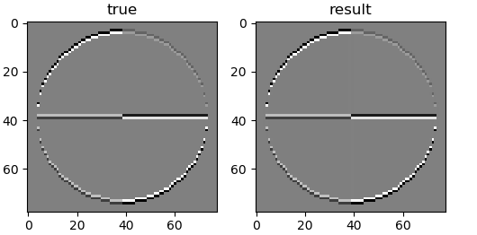

图17-29 真实值和训练值的卷积结果区别

<!--Copyright © Microsoft Corporation. All rights reserved.
  适用于[License](https://github.com/Microsoft/ai-edu/blob/master/LICENSE.md)版权许可-->

# 第18章 卷积神经网络应用

## 经典的卷积神经网络模型

卷积神经网络是现在深度学习领域中最有用的网络类型，尤其在计算机视觉领域更是一枝独秀。卷积神经网络从90年代的LeNet开始，沉寂了10年，也孵化了10年，直到2012年AlexNet开始再次崛起，后续的ZF Net、VGG、GoogLeNet、ResNet、DenseNet，网络越来越深，架构越来越复杂，解决反向传播时梯度消失的方法也越来越巧妙。下面让我们一起学习一下这些经典的网络模型。$^{[1,2]}$

###  LeNet (1998)

图18-1是卷积神经网络的鼻祖LeNet$^{[3]}$的模型结构。


图18-1 LeNet模型结构图

LeNet是卷积神经网络的开创者LeCun在1998年提出，用于解决手写数字识别的视觉任务。自那时起，卷积神经网络的最基本的架构就定下来了：卷积层、池化层、全连接层。

1. 输入为单通道32x32灰度图
2. 使用6组5x5的过滤器，每个过滤器里有一个卷积核，stride=1，得到6张28x28的特征图
3. 使用2x2的池化，stride=2，得到6张14x14的特征图
4. 使用16组5x5的过滤器，每个过滤器里有6个卷积核，对应上一层的6个特征图，得到16张10x10的特征图
5. 池化，得到16张5x5的特征图
6. 接全连接层，120个神经元
7. 接全连接层，84个神经元
8. 接全连接层，10个神经元，softmax输出

如今各大深度学习框架中所使用的LeNet都是简化改进过的LeNet-5（5表示具有5个层），和原始的LeNet有些许不同，比如把激活函数改为了现在很常用的ReLu。LeNet-5跟现有的conv->pool->ReLU的套路不同，它使用的方式是conv1->pool->conv2->pool2再接全连接层，但是不变的是，卷积层后紧接池化层的模式依旧不变。

### 18.0.2 AlexNet (2012)

AlexNet$^{[4]}$网络结构在整体上类似于LeNet，都是先卷积然后在全连接。但在细节上有很大不同。AlexNet更为复杂。AlexNet有60 million个参数和65000个神经元，五层卷积，三层全连接网络，最终的输出层是1000通道的Softmax。

AlexNet用两块GPU并行计算，大大提高了训练效率，并且在ILSVRC-2012竞赛中获得了top-5测试的15.3%的error rate，获得第二名的方法error rate是26.2%，差距非常大，足以说明这个网络在当时的影响力。

图18-2是AlexNet的模型结构。


图18-2 AlexNet模型结构图

1. 原始图片是3x224x224三通道彩色图片，分开到上下两块GPU上进行训练
2. 卷积，96核，11x11，stride=4，pad=0，输出96x55x55
3. LRN+池化，3x3，stride=2，pad=0，输出96x27x27
4. 卷积，256核，5x5，stride=1，pad=2，输出256x27x27
5. LRN+池化，3x3，stride=2，输出256x13x13
6. 卷积，384核，3x3，stride=1，pad=1，输出384x13x13
7. 卷积，384核，3x3，stride=1，pad=1，输出384x13x13
8. 卷积，256核，3x3，stride=1，pad=1，输出256x13x13
9. 池化，3x3，stride=2，输出256x6x6
10. 全连接层，4096个神经元，接Dropout和Relu
11. 全连接层，4096个神经元，接Dropout和Relu
12. 全连接层，1000个神经元做分类

AlexNet的特点：

- 比LeNet深和宽的网络
  
  使用了5层卷积和3层全连接，一共8层。特征数在最宽处达到384。

- 数据增强
  
  针对原始图片256x256的数据，做了随机剪裁，得到224x224的图片若干张。

- 使用ReLU做激活函数
- 在全连接层使用DropOut
- 使用LRN
  
  LRN的全称为Local Response Normalizatio，局部响应归一化，是想对线性输出做一个归一化，避免上下越界。发展至今，这个技术已经很少使用了。

###  ZFNet (2013)

ZFNet$^{[5]}$是2013年ImageNet分类任务的冠军，其网络结构没什么改进，只是调了调参，性能较Alex提升了不少。ZF-Net只是将AlexNet第一层卷积核由11变成7，步长由4变为2，第3，4，5卷积层转变为384，384，256。这一年的ImageNet还是比较平静的一届，其冠军ZF-Net的名堂也没其他届的经典网络架构响亮。

图18-3是ZFNet的结构示意图。


图18-3 ZFNet模型结构图

但是ZFNet首次系统化地对卷积神经网络做了可视化的研究，从而找到了AlexNet的缺点并加以改正，提高了网络的能力。总的来说，通过卷积神经网络学习后，我们学习到的特征，是具有辨别性的特征，比如要我们区分人脸和狗头，那么通过卷积神经网络学习后，背景部位的激活度基本很少，我们通过可视化就可以看到我们提取到的特征忽视了背景，而是把关键的信息给提取出来了。

图18-5所示，从Layer 1、Layer 2学习到的特征基本上是颜色、边缘等低层特征。


图18-4 前两层卷积核学到的特征

Layer 3则开始稍微变得复杂，学习到的是纹理特征，比如上面的一些网格纹理，见图18-5。


图18-5 第三层卷积核学到的特征

图18-6所示的Layer 4学习到的则是比较有区别性的特征，比如狗头；Layer 5学习到的则是完整的，具有辨别性关键特征。


图18-6 后两层卷积核学到的特征

###  VGGNet (2015)

VGG Net$^{[6]}$由牛津大学的视觉几何组（Visual Geometry Group）和 Google DeepMind公司的研究员一起研发的的深度卷积神经网络，在 ILSVRC 2014 上取得了第二名的成绩，将 Top-5错误率降到7.3%。它主要的贡献是展示出网络的深度（depth）是算法优良性能的关键部分。目前使用比较多的网络结构主要有ResNet（152-1000层），GooleNet（22层），VGGNet（19层），大多数模型都是基于这几个模型上改进，采用新的优化算法，多模型融合等。到目前为止，VGG Net 依然经常被用来提取图像特征。

其论文名称为《VERY DEEP CONVOLUTIONAL NETWORKS FOR LARGE-SCALE IMAGE RECOGNITION》，为大规模图片识别而建立的非常深的卷积网络。短短3、4年时间，现在看起来这个也不能算是“非常深”了。

图18-7为VGG16（16层的VGG）模型结构。


图18-7 VGG16模型结构图

VGG比较出名的是VGG-16和VGG-19，最常用的是VGG-16。

VGGNet的卷积层有一个特点：特征图的空间分辨率单调递减，特征图的通道数单调递增，使得输入图像在维度上流畅地转换到分类向量。用通俗的语言讲，就是特征图尺寸单调递减，特征图数量单调递增。从上面的模型图上来看，立体方块的宽和高逐渐减小，但是厚度逐渐增加。

AlexNet的通道数无此规律，VGGNet后续的GoogLeNet和Resnet均遵循此维度变化的规律。

一些其它的特点如下：

1. 选择采用3x3的卷积核是因为3x3是最小的能够捕捉像素8邻域信息的尺寸。
2. 使用1x1的卷积核目的是在不影响输入输出的维度情况下，对输入进行形变，再通过ReLU进行非线性处理，提高决策函数的非线性。
3. 2个3x3卷积堆叠等于1个5x5卷积，3个3x3堆叠等于1个7x7卷积，感受野大小不变，而采用更多层、更小的卷积核可以引入更多非线性（更多的隐藏层，从而带来更多非线性函数），提高决策函数判决力，并且带来更少参数。
4. 每个VGG网络都有3个FC层，5个池化层，1个softmax层。
5. 在FC层中间采用dropout层，防止过拟合。

虽然 VGGNet 减少了卷积层参数，但实际上其参数空间比 AlexNet 大，其中绝大多数的参数都是来自于第一个全连接层，耗费更多计算资源。在随后的 NIN 中发现将这些全连接层替换为全局平均池化，对于性能影响不大，同时显著降低了参数数量。

采用 Pre-trained 方法训练的 VGG model（主要是 D 和 E），相对其他的方法参数空间很大，所以训练一个 VGG 模型通常要花费更长的时间，所幸有公开的 Pre-trained model 让我们很方便的使用。

### 18.0.5 GoogLeNet (2014)

GoogLeNet$^{[7]}$在2014的ImageNet分类任务上击败了VGG-Nets夺得冠军，其实力肯定是非常深厚的，GoogLeNet跟AlexNet,VGG-Nets这种单纯依靠加深网络结构进而改进网络性能的思路不一样，它另辟幽径，在加深网络的同时（22层），也在网络结构上做了创新，引入Inception结构代替了单纯的卷积+激活的传统操作（这思路最早由Network in Network提出）。GoogLeNet进一步把对卷积神经网络的研究推上新的高度。

图18-8是GoogLeNet的模型结构图。


图18-8 GoogLeNet模型结构图

蓝色为卷积运算，红色为池化运算，黄色为softmax分类。


图18-9 Inception结构图

图18-9的结构就是Inception，结构里的卷积stride都是1，另外为了保持特征响应图大小一致，都用了零填充。最后每个卷积层后面都立刻接了个ReLU层。在输出前有个叫concatenate的层，直译的意思是“并置”，即把4组不同类型但大小相同的特征响应图一张张并排叠起来，形成新的特征响应图。Inception结构里主要做了两件事：1. 通过3×3的池化、以及1×1、3×3和5×5这三种不同尺度的卷积核，一共4种方式对输入的特征响应图做了特征提取。2. 为了降低计算量。同时让信息通过更少的连接传递以达到更加稀疏的特性，采用1×1卷积核来实现降维。

这里想再详细谈谈1×1卷积核的作用，它究竟是怎么实现降维的。现在运算如下：下面图1是3×3卷积核的卷积，图2是1×1卷积核的卷积过程。对于单通道输入，1×1的卷积确实不能起到降维作用，但对于多通道输入，就不同了。假设你有256个特征输入，256个特征输出，同时假设Inception层只执行3×3的卷积。这意味着总共要进行 256×256×3×3的卷积（589000次乘积累加（MAC）运算）。这可能超出了我们的计算预算，比方说，在Google服务器上花0.5毫秒运行该层。作为替代，我们决定减少需要卷积的特征的数量，比如减少到64（256/4）个。在这种情况下，我们首先进行256到64的1×1卷积，然后在所有Inception的分支上进行64次卷积，接着再使用一个64到256的1×1卷积。

- 256×64×1×1 = 16000
- 64×64×3×3 = 36000
- 64×256×1×1 = 16000

现在的计算量大约是70000(即16000+36000+16000)，相比之前的约600000，几乎减少了10倍。这就通过小卷积核实现了降维。
现在再考虑一个问题：为什么一定要用1×1卷积核，3×3不也可以吗？考虑[50,200,200]的矩阵输入，我们可以使用20个1×1的卷积核进行卷积，得到输出[20,200,200]。有人问，我用20个3×3的卷积核不是也能得到[20,200,200]的矩阵输出吗，为什么就使用1×1的卷积核？我们计算一下卷积参数就知道了，对于1×1的参数总数：20×200×200×（1×1），对于3×3的参数总数：20×200×200×（3×3），可以看出，使用1×1的参数总数仅为3×3的总数的九分之一！所以我们使用的是1×1卷积核。

GoogLeNet网络结构中有3个LOSS单元，这样的网络设计是为了帮助网络的收敛。在中间层加入辅助计算的LOSS单元，目的是计算损失时让低层的特征也有很好的区分能力，从而让网络更好地被训练。在论文中，这两个辅助LOSS单元的计算被乘以0.3，然后和最后的LOSS相加作为最终的损失函数来训练网络。

GoogLeNet还有一个闪光点值得一提，那就是将后面的全连接层全部替换为简单的全局平均pooling，在最后参数会变的更少。而在AlexNet中最后3层的全连接层参数差不多占总参数的90%，使用大网络在宽度和深度允许GoogleNet移除全连接层，但并不会影响到结果的精度，在ImageNet中实现93.3%的精度，而且要比VGG还要快。

### 18.0.6 ResNets (2015)

2015年何恺明推出的ResNet$^{[8]}$在ISLVRC和COCO上横扫所有选手，获得冠军。ResNet在网络结构上做了大创新，而不再是简单的堆积层数，ResNet在卷积神经网络的新思路，绝对是深度学习发展历程上里程碑式的事件。

图18-10是ResNets的模型结构。


图18-10 ResNets模型结构图

ResNet称为残差网络。什么是残差呢？

若将输入设为X，将某一有参网络层设为H，那么以X为输入的此层的输出将为H(X)。一般的卷积神经网络网络如Alexnet/VGG等会直接通过训练学习出参数函数H的表达，从而直接学习X -> H(X)。
而残差学习则是致力于使用多个有参网络层来学习输入、输出之间的参差即H(X) - X即学习X -> (H(X) - X) + X。其中X这一部分为直接的identity mapping，而H(X) - X则为有参网络层要学习的输入输出间残差。

图18-11为残差学习这一思想的基本表示。


图18-11 残差结构示意图

图18-12展示了两种形态的残差模块，左图是常规残差模块，有两个3×3卷积核组成，但是随着网络进一步加深，这种残差结构在实践中并不是十分有效。针对这问题，右图的“瓶颈残差模块”（bottleneck residual block）可以有更好的效果，它依次由1×1、3×3、1×1这三个卷积层堆积而成，这里的1×1的卷积能够起降维或升维的作用，从而令3×3的卷积可以在相对较低维度的输入上进行，以达到提高计算效率的目的。


图18-12 两种形态的残差模块

### 18.0.7 DenseNet (2017)

DenseNet$^{[9]}$ 是一种具有密集连接的卷积神经网络。在该网络中，任何两层之间都有直接的连接，也就是说，网络每一层的输入都是前面所有层输出的并集，而该层所学习的特征图也会被直接传给其后面所有层作为输入。下图是 DenseNet 的一个dense block示意图，一个block里面的结构如下，与ResNet中的BottleNeck基本一致：BN-ReLU-Conv(1×1)-BN-ReLU-Conv(3×3) ，而一个DenseNet则由多个这种block组成。每个DenseBlock的之间层称为transition layers，由BN−>Conv(1×1)−>averagePooling(2×2)组成。

图18-13是ResNets的模型结构。


图18-13 DenseNet模型结构图

DenseNet作为另一种拥有较深层数的卷积神经网络，具有如下优点：

1. 相比ResNet拥有更少的参数数量
2. 旁路加强了特征的重用
3. 网络更易于训练,并具有一定的正则效果
4. 缓解了gradient vanishing和model degradation的问题

何恺明先生在提出ResNet时做出了这样的假设：若某一较深的网络多出另一较浅网络的若干层有能力学习到恒等映射，那么这一较深网络训练得到的模型性能一定不会弱于该浅层网络。通俗的说就是如果对某一网络中增添一些可以学到恒等映射的层组成新的网路，那么最差的结果也是新网络中的这些层在训练后成为恒等映射而不会影响原网络的性能。同样DenseNet在提出时也做过假设：与其多次学习冗余的特征，特征复用是一种更好的特征提取方式。

<!--Copyright © Microsoft Corporation. All rights reserved.
  适用于[License](https://github.com/Microsoft/ai-edu/blob/master/LICENSE.md)版权许可-->
 解决MNIST分类问题

###  模型搭建

在12.1中，我们用一个三层的神经网络解决MNIST问题，并得到了97.49%的准确率。当时使用的模型如图18-31。


图18-31 前馈神经网络模型解决MNIST问题

这一节中，我们将学习如何使用卷积网络来解决MNIST问题。首先搭建模型如图18-32。


图18-32 卷积神经网络模型解决MNIST问题

表18-5展示了模型中各层的功能和参数。

表18-5 模型中各层的功能和参数

|Layer|参数|输入|输出|参数个数|
|---|---|---|---|---|
|卷积层|8x5x5,s=1|1x28x28|8x24x24|200+8|
|激活层|2x2,s=2, max|8x24x24|8x24x24||
|池化层|Relu|8x24x24|8x12x12||
|卷积层|16x5x5,s=1|8x12x12|16x8x8|400+16|
|激活层|Relu|16x8x8|16x8x8||
|池化层|2x2, s=2, max|16x8x8|16x4x4||
|全连接层|256x32|256|32|8192+32|
|批归一化层||32|32||
|激活层|Relu|32|32||
|全连接层|32x10|32|10|320+10|
|分类层|softmax,10|10|10|

卷积核的大小如何选取呢？大部分卷积神经网络都会用1、3、5、7的方式递增，还要注意在做池化时，应该尽量让输入的矩阵尺寸是偶数，如果不是的话，应该在上一层卷积层加padding，使得卷积的输出结果矩阵的宽和高为偶数。


###  可视化

#### 第一组的卷积可视化

下图按行显示了以下内容：

1. 卷积核数值
2. 卷积核抽象
3. 卷积结果
4. 激活结果
5. 池化结果

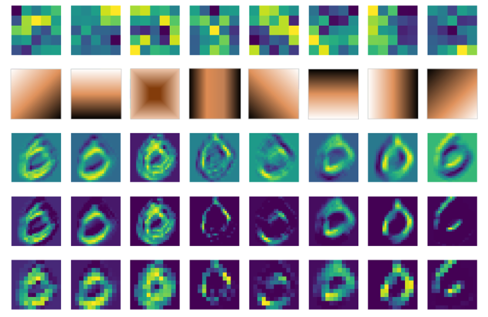
图18-34 卷积结果可视化

卷积核是5x5的，一共8个卷积核，所以第一行直接展示了卷积核的数值图形化以后的结果，但是由于色块太大，不容易看清楚其具体的模式，那么第二行的模式是如何抽象出来的呢？

因为特征是未知的，所以卷积神经网络不可能学习出类似下面的两个矩阵中左侧矩阵的整齐的数值，而很可能是如同右侧的矩阵一样具有很多噪音，但是大致轮廓还是个左上到右下的三角形，只是一些局部点上有一些值的波动。

```
2  2  1  1  0               2  0  1  1  0
2  1  1  0  0               2  1  1  2  0
1  1  0 -1 -2               0  1  0 -1 -2
1  0 -1 -2 -3               1 -1  1 -4 -3
0 -1 -2 -3 -4               0 -1 -2 -3 -2
```

如何“看”出一个大概符合某个规律的模板呢？对此，笔者的心得是：

1. 摘掉眼镜（或者眯起眼睛）看第一行的卷积核的明暗变化模式；
2. 也可以用图像处理的办法，把卷积核形成的5x5的点阵做一个模糊处理；
3. 结合第三行的卷积结果推想卷积核的行为。


 <!--Copyright © Microsoft Corporation. All rights reserved.
  适用于[License](https://github.com/Microsoft/ai-edu/blob/master/LICENSE.md)版权许可-->

## 18.5 Fashion-MNIST分类

### 18.5.1 提出问题

MNIST手写识别数据集，对卷积神经网络来说已经太简单了，于是科学家们增加了图片的复杂度，用10种物品代替了10个数字，图18-36是它们的部分样本。

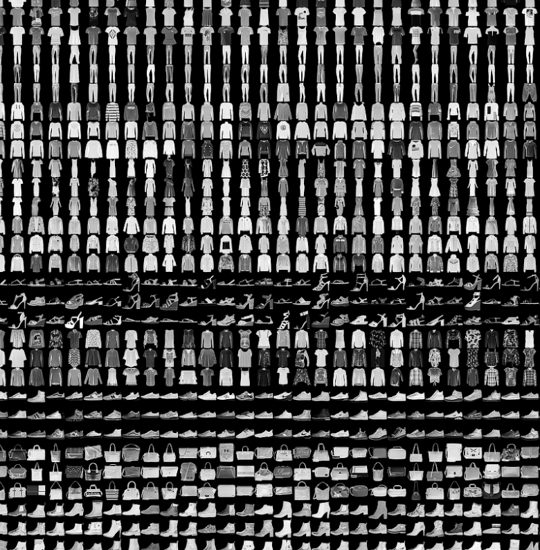

图18-36 部分样本图展示

每3行是一类样本，按样本类别（从0开始计数）分行显示：

1. T-Shirt，T恤衫（1-3行）
2. Trouser，裤子（4-6行）
3. Pullover，套头衫（7-9行）
4. Dress，连衣裙（10-12行）
5. Coat，外套（13-15行）
6. Sandal，凉鞋（16-18行）
7. Shirt，衬衫（19-21行）
8. Sneaker，运动鞋（22-24行）
9. Bag，包（25-27行）
10. Ankle Boot，短靴（28-30行）

### 18.5.2 用前馈神经网络来解决问题

#### 搭建模型

```Python
def dnn_model():
    num_output = 10
    max_epoch = 10
    batch_size = 128
    learning_rate = 0.1
    params = HyperParameters_4_2(
        learning_rate, max_epoch, batch_size,
        net_type=NetType.MultipleClassifier,
        init_method=InitialMethod.MSRA,
        optimizer_name=OptimizerName.Momentum)

    net = NeuralNet_4_2(params, "fashion_mnist_dnn")
    
    f1 = FcLayer_2_0(784, 128, params)
    net.add_layer(f1, "f1")
    bn1 = BnLayer(f1.output_size)
    net.add_layer(bn1, "bn1")
    r1 = ActivationLayer(Relu())
    net.add_layer(r1, "relu1")

    f2 = FcLayer_2_0(f1.output_size, 64, params)
    net.add_layer(f2, "f2")
    bn2 = BnLayer(f2.output_size)
    net.add_layer(bn2, "bn2")
    r2 = ActivationLayer(Relu())
    net.add_layer(r2, "relu2")
    
    f3 = FcLayer_2_0(f2.output_size, num_output, params)
    net.add_layer(f3, "f3")
    s3 = ClassificationLayer(Softmax())
    net.add_layer(s3, "s3")

    return net
```

#### 训练结果

训练10个epoch后得到如图18-37所示曲线，可以看到网络能力已经接近极限了，再训练下去会出现过拟合现象，准确度也不一定能提高。

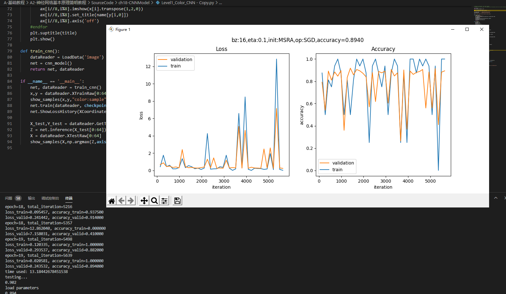

图18-37 训练过程中损失函数值和准确度的变化

图18-38是在测试集上的预测结果。
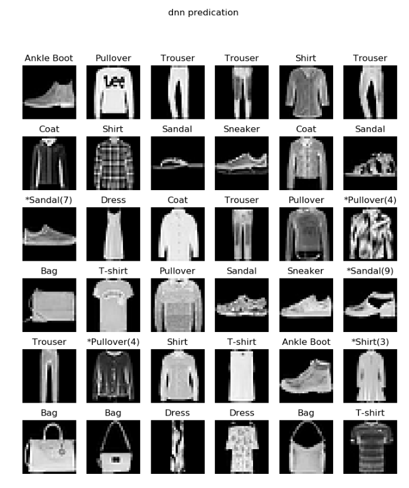

图18-38 测试结果

凡是类别名字前面带*号的，表示预测错误，比如第3行第1列，本来应该是第7类“运动鞋”，却被预测成了“凉鞋”。


<!--Copyright © Microsoft Corporation. All rights reserved.
  适用于[License](https://github.com/Microsoft/ai-edu/blob/master/LICENSE.md)版权许可-->

## 18.6 Cifar-10分类

Cifar 是加拿大政府牵头投资的一个先进科学项目研究所。Hinton、Bengio和他的学生在2004年拿到了 Cifar 投资的少量资金，建立了神经计算和自适应感知项目。这个项目结集了不少计算机科学家、生物学家、电气工程师、神经科学家、物理学家、心理学家，加速推动了 Deep Learning 的进程。从这个阵容来看，DL 已经和 ML 系的数据挖掘分的很远了。Deep Learning 强调的是自适应感知和人工智能，是计算机与神经科学交叉；Data Mining 强调的是高速、大数据、统计数学分析，是计算机和数学的交叉。

Cifar-10 是由 Hinton 的学生 Alex Krizhevsky、Ilya Sutskever 收集的一个用于普适物体识别的数据集。

### 18.6.1 提出问题

我们在前面的学习中，使用了MNIST和Fashion-MNIST两个数据集来练习卷积网络的分类，但是这两个数据集都是单通道的灰度图。虽然我们用彩色的几何图形作为例子讲解了卷积网络的基本功能，但是仍然与现实的彩色世界有差距。所以，本节我们将使用Cifar-10数据集来进一步检验一下卷积神经网络的能力。

图18-41是Cifar-10的样本数据。

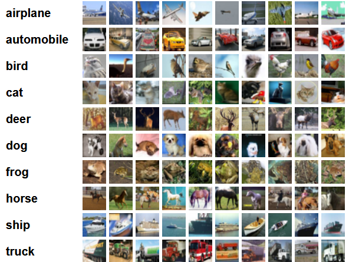
图18-41 Cifar-10样本数据

1. airplane，飞机，6000张
2. automobile，汽车，6000张
3. bird，鸟，6000张
4. cat，猫，6000张
5. deer，鹿，6000张
6. dog，狗，6000张
7. frog，蛙，6000张
8. horse，马，6000张
9. ship，船，6000张
10. truck，卡车，6000张

Cifar-10 由60000张32*32的 RGB 彩色图片构成，共10个分类。50000张训练，10000张测试。分为6个文件，5个训练数据文件，每个文件中包含10000张图片，随机打乱顺序，1个测试数据文件，也是10000张图片。这个数据集最大的特点在于将识别迁移到了普适物体，而且应用于多分类（姊妹数据集Cifar-100达到100类，ILSVRC比赛则是1000类）。

但是，面对彩色数据集，用CPU做训练所花费的时间实在是太长了，所以本节将学习如何使用GPU来训练神经网络。

### 18.6.2 环境搭建

我们将使用Keras$^{[1]}$来训练模型，因为Keras是一个在TensorFlow平台上经过抽象的工具，它的抽象思想与我们在前面学习过的各种Layer的概念完全一致，有利于读者在前面的基础上轻松地继续学习。环境搭建有很多细节，我们在这里不详细介绍，只是把基本步骤列出。

1. 安装Python 3.6（本书中所有案例在Python 3.6上开发测试）
2. 安装CUDA（没有GPU的读者请跳过）
3. 安装cuDNN（没有GPU的读者请跳过）
4. 安装TensorFlow，有GPU硬件的一定要按照GPU版，没有的只能安装CPU版
5. 安装Keras

安装好后用pip list看一下，关键的几个包是：

```
Package              Version
-------------------- ---------
Keras                2.2.5
Keras-Applications   1.0.8
Keras-Preprocessing  1.1.0
matplotlib           3.1.1
numpy                1.17.0
tensorboard          1.13.1
tensorflow-estimator 1.13.0
tensorflow-gpu       1.13.1
```

如果没有GPU，则"tensorflow-gpu"一项会是"tensorflow"。

### 18.6.3 代码实现

```Python
batch_size = 32
num_classes = 10
epochs = 25
data_augmentation = True
num_predictions = 20
save_dir = os.path.join(os.getcwd(), 'saved_models')
model_name = 'keras_cifar10_trained_model.h5'

# The data, split between train and test sets:
(x_train, y_train), (x_test, y_test) = cifar10.load_data()
print('x_train shape:', x_train.shape)
print(x_train.shape[0], 'train samples')
print(x_test.shape[0], 'test samples')

# Convert class vectors to binary class matrices.
y_train = keras.utils.to_categorical(y_train, num_classes)
y_test = keras.utils.to_categorical(y_test, num_classes)

model = Sequential()
model.add(Conv2D(32, (3, 3), padding='same',
                 input_shape=x_train.shape[1:]))
model.add(Activation('relu'))
model.add(Conv2D(32, (3, 3)))
model.add(Activation('relu'))
model.add(MaxPooling2D(pool_size=(2, 2)))
model.add(Dropout(0.25))

model.add(Conv2D(64, (3, 3), padding='same'))
model.add(Activation('relu'))
model.add(Conv2D(64, (3, 3)))
model.add(Activation('relu'))
model.add(MaxPooling2D(pool_size=(2, 2)))
model.add(Dropout(0.25))

model.add(Flatten())
model.add(Dense(512))
model.add(Activation('relu'))
model.add(Dropout(0.5))
model.add(Dense(num_classes))
model.add(Activation('softmax'))

# initiate RMSprop optimizer
opt = keras.optimizers.rmsprop(lr=0.0001, decay=1e-6)

# Let's train the model using RMSprop
model.compile(loss='categorical_crossentropy',
              optimizer=opt,
              metrics=['accuracy'])

x_train = x_train.astype('float32')
x_test = x_test.astype('float32')
x_train /= 255
x_test /= 255

if not data_augmentation:
    print('Not using data augmentation.')
    model.fit(x_train, y_train,
              batch_size=batch_size,
              epochs=epochs,
              validation_data=(x_test, y_test),
              shuffle=True)
else:
    ...
```

# 总结 

1. 先用卷积->激活->卷积->激活->池化->丢弃层，做为第一梯队，卷积核32个；
2. 然后再用卷积->激活->卷积->激活->池化->丢弃层做为第二梯队，卷积核64个；
3. Flatten和Dense相当于把池化的结果转成Nx512的全连接层，N是池化输出的尺寸，被Flatten扁平化了；
4. 再接丢弃层，避免过拟合；
5. 最后接10个神经元的全连接层加Softmax输出。


