# ch_1 邂逅OpenCV

### 1.1 OpenCV 周边概念认知

#### 1.1.1 图像 处理、计算机视觉与OpenCV

- **图像处理**( Image Processing)是用计算机对图像进行分析，以达到所需结果的技术，又称影像处理。图像处理技术一般包括图像压缩，增强和复原，匹配、描述和识别3个部分。图像处理一般指 数字图像处理( Digital Image Processing)。其中，数字图像是指用工业相机、摄像机、扫描仪等设备经过拍摄得到的一个大的二维数组。该数组的元素称为像素，其值称为灰度值。而数字图像处理是通过计算机对图像进行去除噪声、增强、复原、分割、提取特征等处理的方法和技术。

- **计算机视觉**(Computer Vision) 是一门研究如何使机器“看”的科学，具体地说，就是是指用摄影机和电脑代替人眼对目标进行识别、跟踪和测量等机器视觉，并进一做图形处理，用电脑处理使之成为更适合人眼观察或传送给仪器检测的图像的一门学科。作为一门科学学科，计算机视觉研究相关的理论和技术，试图建立能够从图像或者多维数据中获取“信息”的人工智能系统。因为感知可以看做是从感官信号中提取信息，所以计算机视觉也可以看做是研究如何使人工系统从图像或多维数据中“感知”的科学。

- **图像处理和计算机视觉的区别**
  
  1. 图像处理侧重于“处理”图像一如增强，还原，去噪，分割，等等;
  2. 而计算机视觉重点在于使用计算机( 也许是可移动式的)来模拟人的视觉，因此模拟才是计算机视觉领域的最终目标。
  3. 而OpenCV, 是一个基于开源发行的跨平台计算机视觉库，它实现了图像处理和计算机视觉方面的很多通用算法。

#### 1.1.2 《关于OpenCV这个伙计是个什么玩意这件事》

*开源计算机视觉*(OpenCV)是一个主要针对实时计算机视觉的编程函数库。 最初由英特尔开发，后来由柳树车库（Willow Garage）支持，后来由伊塞兹（Itseez）支持(后来被英特尔收购)。该库是跨平台的，根据开源BSD许可证免费使用。

就是这玩意 **“Open Source Computer Vision Library”** 。

简而言之，他就是个**库**。

#### 1.1.3 出生和长大

OpenCV项目于1999年正式启动，最初是英特尔的一项研究计划，旨在推进中央处理器密集型应用，是包括实时光线跟踪和3D显示墙在内的一系列项目的一部分。该项目的主要贡献者包括英特尔俄罗斯公司的许多优化专家，以及英特尔的性能库团队。在OpenCV的早期，项目的目标被描述为:

- 通过为基本视觉基础设施提供开放且优化的代码来推进视觉研究。不再重新发明轮子。
- 通过提供开发人员可以构建的公共基础设施来传播视觉知识，以便代码更容易阅读和转移。
- 通过免费提供可移植的、性能优化的代码来推进基于视觉的商业应用程序——许可证不要求代码本身是开放的或自由的。
- OpenCV的第一个alpha版本在2000年的IEEE计算机视觉和模式识别会议上向公众发布，2001年至2005年间发布了五个beta版本。第一个1.0版本于2006年发布。1.1版“预览版”于2008年10月发布。

OpenCV的第二次主要发布是在2009年10月。OpenCV 2包括对C++接口的主要更改，旨在更容易、更类型安全的模式、新功能以及现有功能在性能方面的更好实现(尤其是在多核系统上)。现在每六个月发布一次官方版本，开发工作现在由商业公司支持的独立俄罗斯团队完成。

2012年8月，对OpenCV的支持被一个非营利基金会OpenCV.org接管， 该基金会拥有一个开发者和用户网站。

2016年5月，英特尔签署了一项协议， 收购OpenCV的主要开发商伊塞兹。

#### 1.1.4 应用概述

OpenCV 可用于解决一下问题：

● 人机交互
● 物体识别
● 图像分区
● 人脸识别
● 动作识别
● 运动跟踪
● 机器人

### 1.2 OpenCV 基本架构分析

下面就是OpenCV的所有模块，按照宏定义的顺序依次介绍。

1. [calib3d]- Calibration (校准)和3D这两个词的组合缩写。这个模块主要是相机校准和三维重建相关的内容，包括基本的多视角几何算法、单个立体摄像头标定、物体姿态估计、立体相似性算法、3D信息的重建等。

2. [contrb]- Contributed/Experimental Stuf 的缩写。该模块包含了一些最近添加的不太稳定的可选功能，不用去多管。新增了新型人脸识别、立体匹配、人工视网膜模型等技术。

3. [core]- 核心功能模块， 包含如下内容:

● OpenCV 基本数据结构
● 动态数据结构
● 绘图函数
● 数组操作相关函数
● 辅助功能与系统函数和宏
● 与OpenGL的互操作

4. [imgproc]- lmage 和Process这两个单词的缩写组合，图像处理模块。包含如下内容:

● 线性和非线性的图像滤波
● 图像的几何变换
● 其他(Miscellaneous) 图像转换
● 直方图相关
● 结构分析和形状描述
● 运动分析和对象跟踪
● 特征检测
● 目标检测等内容

5. [ features2d]- 也就是Features2D, 即2D功能框架，包含如下内容:

● 特征检测和描述
● 特征检测器(Feature Detectors) 通用接口
● 描述符提取器(Descriptor Extractors)通用接口
● 描述符匹配器(Descriptor Matchers)通用接口
● 通用描述符(Generic Descriptor)匹配器通用接口
● 关键点绘制函数和匹配功能绘制函数
6. [flann]- Fast Library for Approximate Nearest Neighbors,高维的近似近邻快速搜索算法库，包含以下两个部分:

● 快速近似最近邻搜索
● 聚类

7. [gpu]- 运用 GPU加速的计算机视觉模块。

8. [highgui]- 高层 GUI图形用户界面，包含媒体的输入输出、视频捕捉、图像和视频的编码解码、图形交互界面的接口等内容。

9. [legacy]- 一些已经废弃的代码库，保留下来作为向下兼容，包含如下内容:

● 运动分析
● 期望最大化
● 直方图
● 平面细分(C API)
● 特征检测和描述( Feature Detection and Description)
● 描述符提取器(Descriptor Extractors)的通用接口
● 通用描述符(Generic Descriptor Matchers)的常用接口
● 匹配器

10. [ml]一Machine Learning，机器学习模块，基本上是统计模型和分类
算法，包含如下内容:
● 统计模型(Statistical Models)
● 一般贝叶斯分类器(Normal Bayes Classifier)
● K-近邻(K-Nearest Neighbors)
● 支持向量机( Support Vector Machines)
● 决策树(Decision Trees)
● 提升(Booting)
● 梯度提高树(Gradient Boosted Trees)
● 随机树(Random Trees )
● 超随机树(Extremely randomized trees )
● 期望最大化( Expectation Maximization)
● 神经网络(Neural Networks)
● MLData

11. [nonfree]- 一些具有专利的算法模块，包含特征检测和GPU相关的内容。最好不要商用。

12. [objdetect]- 目标检测模块，包含Cascade lassification (级联分类)和Latent SVM这两个部分。

13. [ocl]- OenCL-acelerated Computer Vision,运用OpenCL加速的计算机视觉组件模块。

14. [photo]- Computational Photography,包含图像修复和图像去噪两部分。

15. [stitching]- images stitching,图像拼接模块，包含如下部分: 

● 拼接流水线
● 特点寻找和匹配图像
● 估计旋转
● 自动校准
● 图片歪斜
● 接缝估测
● 曝光补偿
● 图片混合

16. [superres]- SuperResolution, 超分辨率技术的相关功能模块。

17. [ts]- OpenCV 测试相关代码，不用去管。

18. [video]- 视频分 析组件，该模块包括运动估计、背景分离、对象跟踪等视频处理相关内容。

19. [Videostab]- Video stabilization,视频稳定相关的组件。

### 1.3 OpenCV为我们带来了什么

**都项目结构改变了还不革新吗？**，要啥自行车自行车。

### 1.4 OpenCV的安装

- 上面说到OpenCV简单来说就是一个库，安装上也比较容易 — — 就是个 *”解压”* 程序。

1. install_1 

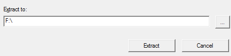

2. install_2

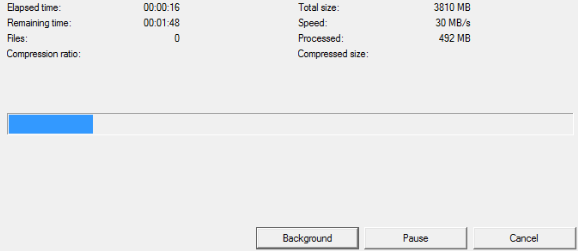

- 配置到VS

1. vs设置库

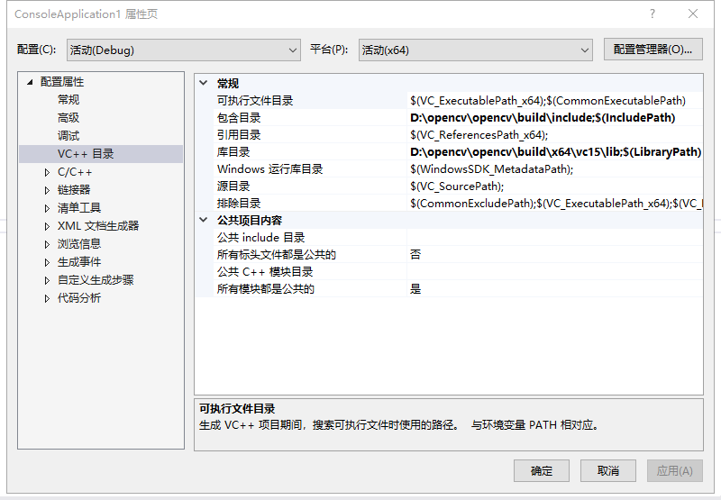

2. vs设置链接器

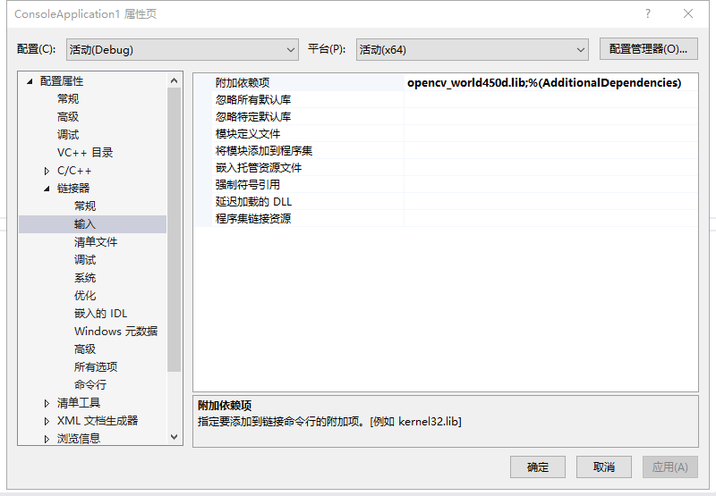

3. 设置系统环境变量路径

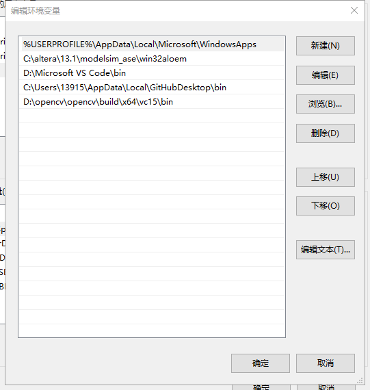

### 1.5 简单图像处理

- 废话少说，直接走程序。

1. 图片显示
  
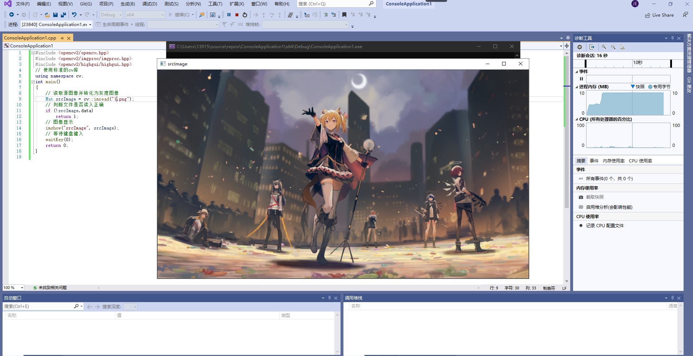
[图片来源感谢Arknights，非商用，"口令——企鹅帝国万岁!"]

2. 图像腐蚀

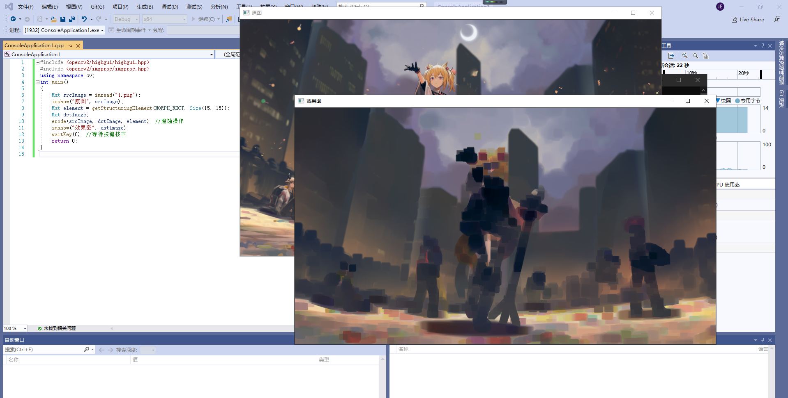
[图片来源感谢Arknights，非商用，"口令——企鹅帝国万岁!"]

3. 图像模糊

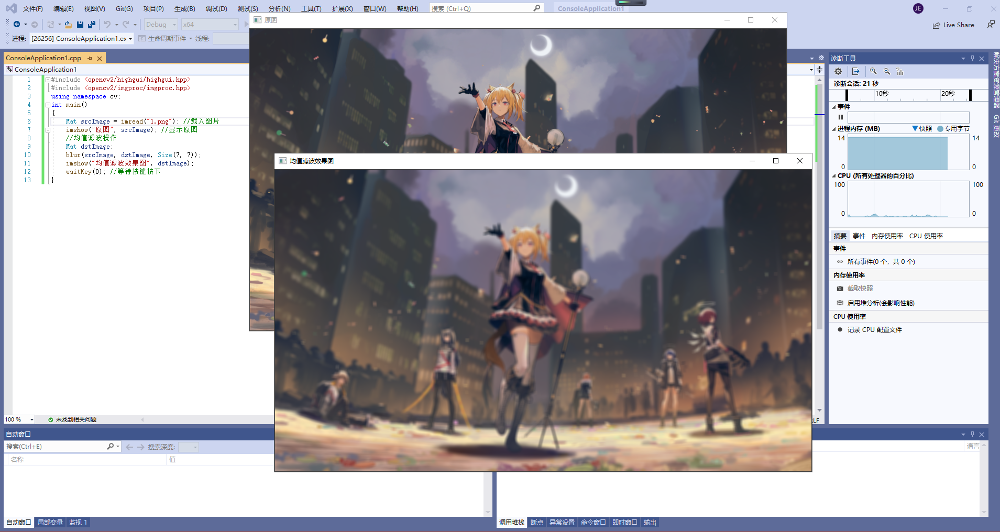
[图片来源感谢Arknights，非商用，"口令——企鹅帝国万岁!"]

4. 边缘检测

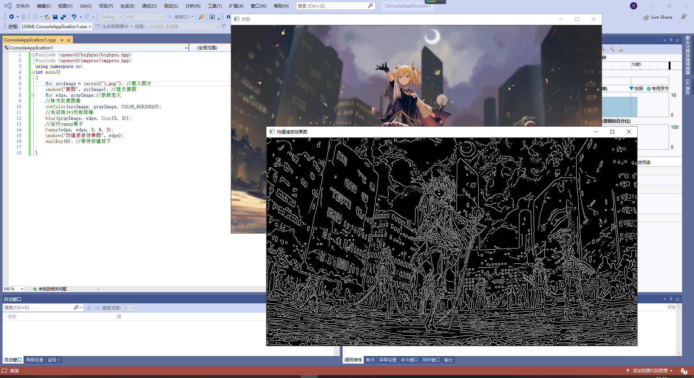
[图片来源感谢Arknights，非商用，"口令——企鹅帝国万岁!"]

### 1.6 OpenCV视频操作基础

1. 读取并播放视频

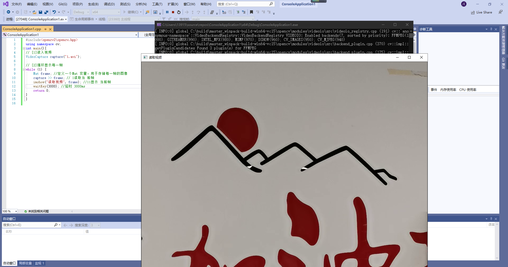

2. 图像采集

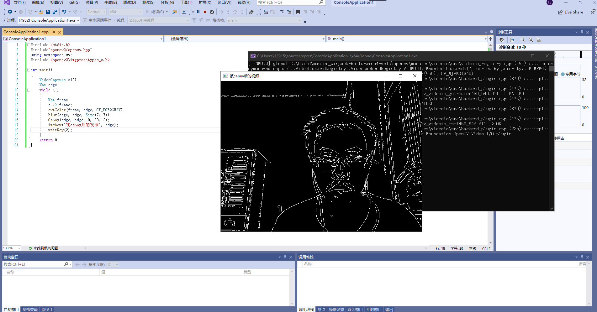

# ch_2 启程前的认知准备

### 2.1 OpenCV官方例程引导与赏析

**"懂得都懂。。"**[无内容此处略]

- 该部分可以做到：

1. 彩色目标跟踪。
   
   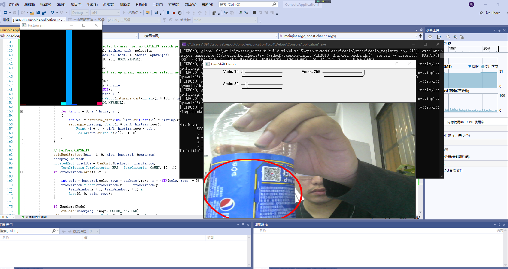

2. 光流。
3. 点追踪。

   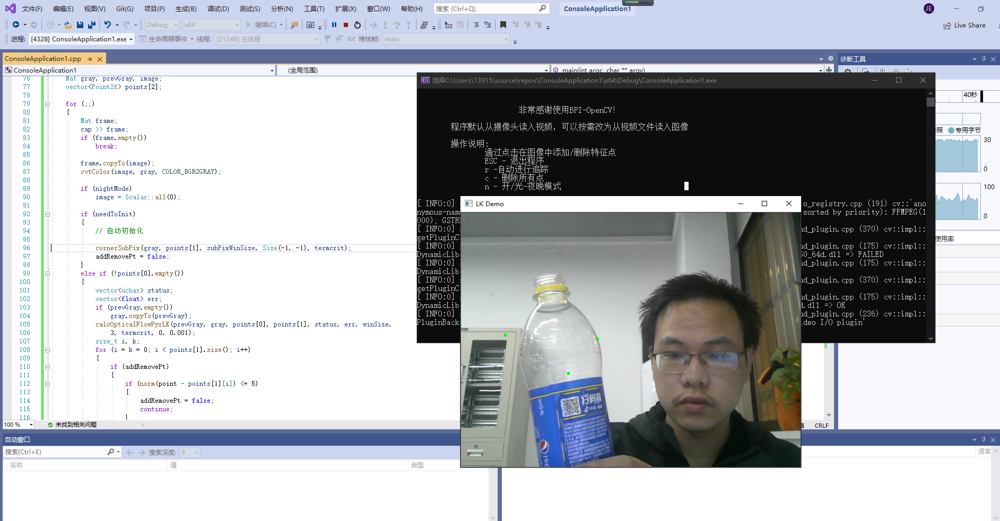
4. 人脸识别。
5. 支持向量机引导。

### 2.2 编译OpenCV源代码

- 我们已经通过vs对OpenCV进行了了运用，下面简单介绍一下CMake。

- CMake是一个跨平台的安装（编译）工具，可以用简单的语句来描述所有平台的安装(编译过程)。他能够输出各种各样的makefile或者project文件，能测试编译器所支持的C++特性,类似UNIX下的automake。只是 CMake 的组态档取名为 CMakeLists.txt。Cmake 并不直接建构出最终的软件，而是产生标准的建构档（如 Unix 的 Makefile 或 Windows Visual C++ 的 projects/workspaces），然后再依一般的建构方式使用。这使得熟悉某个集成开发环境（IDE）的开发者可以用标准的方式建构他的软件，这种可以使用各平台的原生建构系统的能力是 CMake 和 SCons 等其他类似系统的区别之处。

  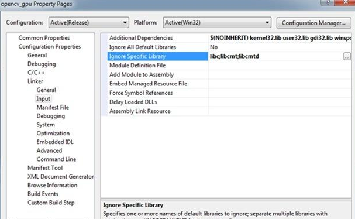

### 2.3 "你要的头文件"

- opencv.hpp 中已经包含了OpenCV各模块的头文件。

- 如高层GUI图形用户界面模块头文件“highgui.hpp"、图像处理模块头文件“imgproc.hpp"、2D 特征模块头文件“features2d.hpp"等。

- 所以，我们在编写core、objdetect. imgproc、photo、video. features2d. objdetect.calib3d、ml、 highgui、contrib 模块的应用程序时，原则上仅写上一句”#include<opencv2/opencv.hpp>”即可，这样可以精简优化代码。

### 2.4 命名规则

当然，前辈们已经帮我们制定了详细的规则。

 

### 以下为概念辨析，此处不再赘述

2.5 argc与argv参数解惑
2.6 格式输出函数printf()简析
2.7 智能显示版本

# ch_3 HighGUI图形用户界面初步

### 3.1 图像的载入、显示和输出到文件

#### 3.1.1 OpenCV 的命名空间

- OpenCV中的C++类和函数都是定义在命名空间ev之内的，有两种方法可以访问:

- 第一种，是在代码开头的适当位置加上usingnamespace ev;这句代码，规定程序位于此命名空间之内;另外-一种， 是在使用OpenCV的每一一个类和函数时，都加入ev::命名空间。不过这种情况会很繁琐，每用一个OpenCV的类或者函数，都要多敲四下键盘写出cv::。所以，推荐大家在代码开头的适当位置，加上usingnamespace cv;这句。

- 比如在写简单的OpenCV程序的时候，以下三句可以作为标配:
finclude <opencv2/core/core. hpp>
include<opencv2/highgui/highgui.hpp>
using namespace CV;

#### 3.1.2 Mat类简析
Mat类是用于保存图像以及其他矩阵数据的数据结构，默认情况下其尺寸为0。我们也可以指定其初始尺寸，比如定义一个Mat类对象，就要写ev::Mat pic (320,640,cv::Scalar( 100));

#### 3.1.3 图像的载入与显示概述
在新版本的OpenCV2中，最简单的图像载入和显示只需要两句代码，非常便捷。这两句代码分别对应了两个函数，它们分别是imread()以及imshow()。

#### 以下为函数介绍此处不再赘述
 
 3.1.4 图像的载入：imread()函数
 3.1.5 图像的显示：imshow()函数
 3.1.6 关于InputArrary类型
 3.1.7 创建窗口：namedWindows()函数
 3.1.8 输出图像到文件：imwriter()函数

#### 3.1.9 综合示例

- 直接上程序！

  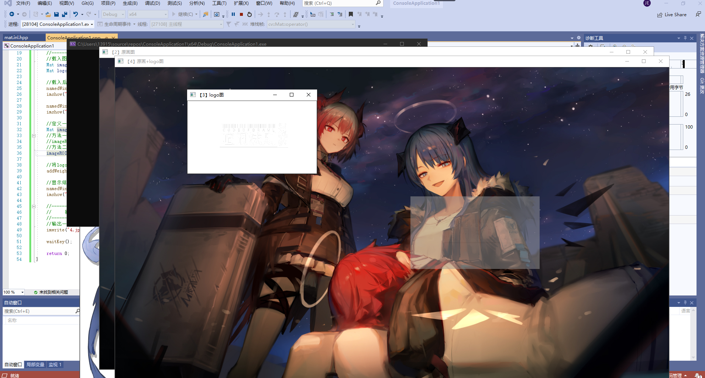

#### 3.2 滑动条的创建与使用

- 直接上程序！

  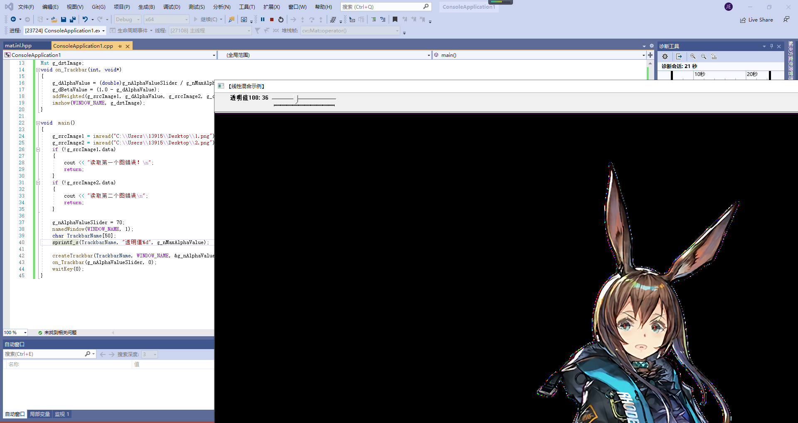

#### 3.3 鼠标操作

- 直接上程序！

  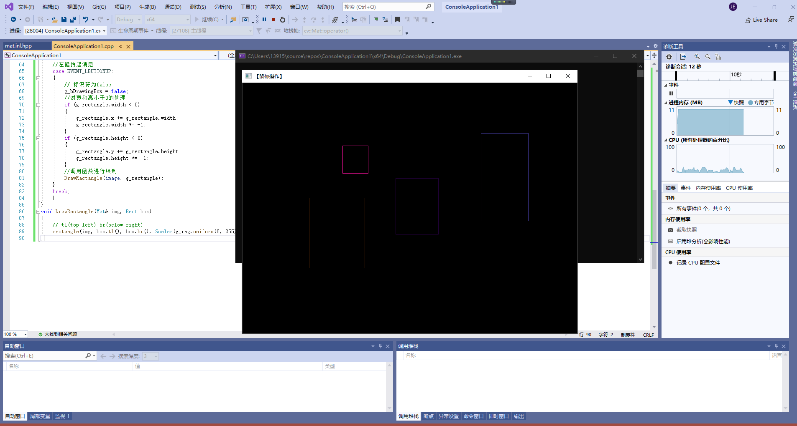

