## 1.1 对opencv的认识和其概念

### 1.1.1图像处理、 计算机视觉与OpenCV
图像处理( Image Processing)是用计算机对图像进行分析，以达到所需结果的技术，又称影像处理。图像处理技术一般包括图像压缩，增强和复原，匹配、描述和识别3个部分。图像处理一般指 数字图像处理(Digital Image Processing)。其中，数字图像是指用工业相机、摄像机、扫描仪等设备经过拍摄得到的一一个大的二维数组。该数组的元素称为像素，其值称为灰度值。而数字图像处理是通过计算机对图像进行去除噪声、增强、复原、分割、提取特征等处理的方法和技术。

#### 计算机视觉：
是一门研究如何使机器“看”的科学，具体地说，就是是指用摄影机和电脑代替人眼对目标进行识别、跟踪和测量等机器视觉，并一步做图形处理，用电脑处理使之成为更适合人眼观察或传送给仪器检测的图像的一-门学科。

#### 图像处理和计算机视觉的区别在于:
图像处理侧重于“处理”图像一如增强，还原，去噪，分割，等等;而计算机视觉重点在于使用计算机(也许是可移动式的)来模拟人的视觉，因此模拟才是计算机视觉领域的最终目标。

### 1.1.2 OpenCV是个什么“东西”
就是“开源计算机视觉库”。OpenCV是一个基于BSD许可（开源）发行的跨平台计算机视觉和机器学习软件库，可以运行在Linux、Windows、Android和Mac OS操作系统上。简单的说就是跨平台计算机和机器学习软件库。

### 1.1.3 应用概述
它被广泛应用于许多领域、产品和研究成果，
具体包括卫星地图和电子地图的拼接、扫描图像对齐、医学图像去噪(消噪或滤波)、图像中的物体分析、安全和入侵检测系统、自动监视和安全系统，以及制造业中的产品质量检测系统、摄像机标定、军事应用、无人飞行器、无人汽车和无人水下机器人。此外，还可以将视觉识别技术用在声谱图上，用OpenCV进行声音和音乐识别。
#### 涉及领域
●人机交互
●物体识别
●图像分区
●人脸识别
●动作识别
●运动跟踪
●机器人

## 1.2 opencv基本架构

### 核心功能模块
●OpenCV 基本数据结构
●动态数据结构
●绘图函数
●数组操作相关函数
●辅助功能与系统函数和宏
●与OpenGL的互操作

### 图像处理模块
●线性和非线性的图像滤波
●图像的几何变换
●其他(Miscellaneous)图像转换
●直方图相关
●结构分析和形状描述
●运动分析和对象跟踪
●特征检测
●目标检测等内容

### 2D功能框架：
●特征检测和描述
●特征检测器(Feature Detectors)通用接口
●描述符提取器(Descriptor Extractors)通用接口
●描述符匹配器(Descriptor Matchers)通用接口
●通用描述符(Generic Descriptor)匹配器通用接口
●关键点绘制函数和匹配功能绘制函数

## 1.3 opencv带来了什么

### 这个新仓库中有很多让人兴奋的功能:
包括脸部识别和文本探测，以及文本识别、新的边缘检测器、充满艺术感的图像修复、深度地图处理、新的光流和追踪算法等。

# 1.4 opencv的下载还有环境配置

### 步骤：
1.下载opencv
2.下载visual Studio
3.配置路径
配置方法如下：
●单击“项目—＞属性”，打开属性对话框：
●在“配置属性—＞VC++目录”节点下，单击“包含目录”右侧的下来按钮
●选择OpenCv目录下的include文件夹路径：A:\Program\opencv\build\include
●在“库目录”中添加lib文件夹路径：A:\Program\opencv\build\x64\vc12\lib
●在“配置属性—＞链接器—＞输入”节点下，在“附加依赖项”窗口中输入opencv_world310d.lib 

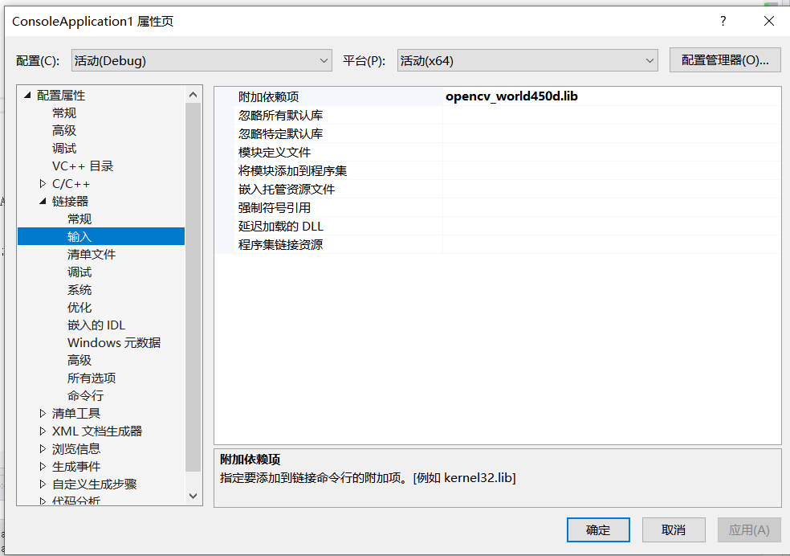
4.配置环境变量：
●将OpenCv的bin（可执行文件）目录的路径“”添加到环境变量
●需要使用64位的Debug调试器
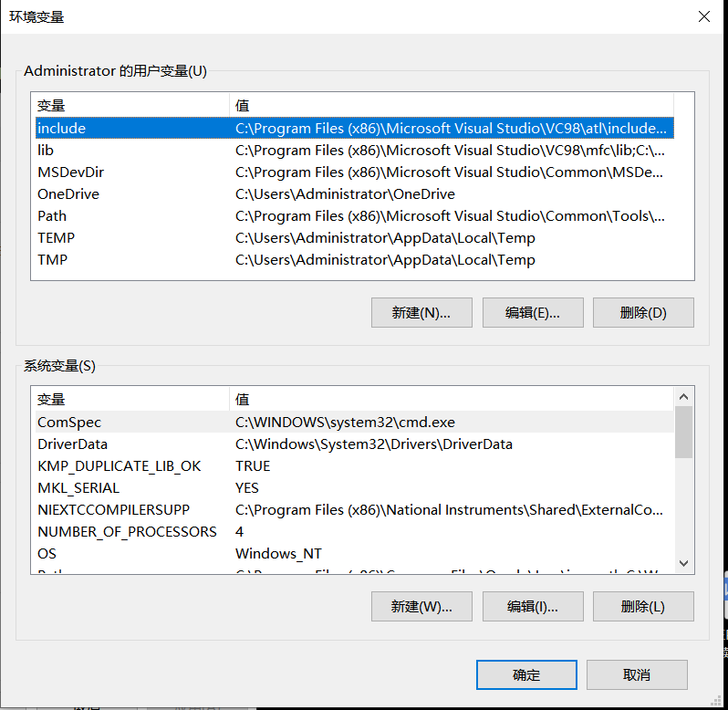

## 1.5 opencv图像处理

### 图像显示

用imread函数载入到新版本的图像存储数据结构Mat类中，然后用imshow函数显示即可。这两个函数在第3章会有详细讲解。打开Visual Studio， 新建一个控制台项目，然后新建一个cpp文件。

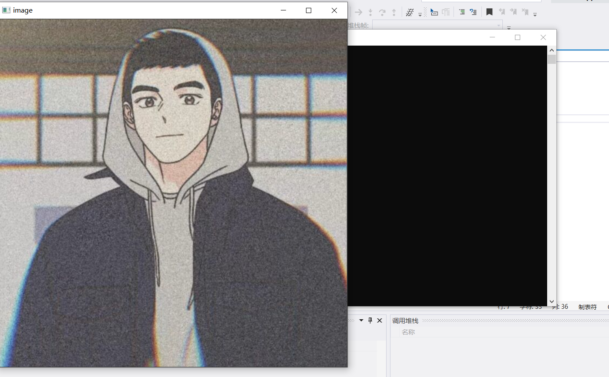

### 图像腐蚀

用图像中的暗色部分“腐蚀”掉图像中的高亮部分。图像形态学操作在后文有详细讲解，这里我们先一起了解一下:同样是新建控制台项目，新建cpp源文件，放置名为“1jpg” 的图片到工程目录下(和cpp源文件同一目录下)。

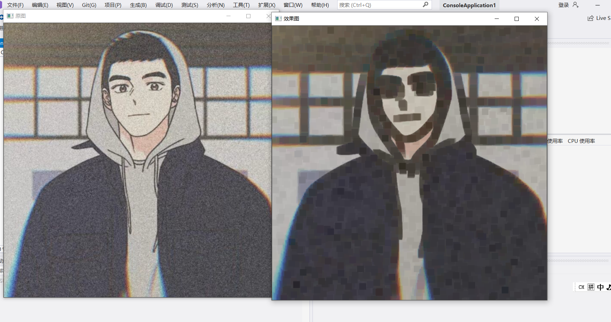

### 图像模糊

调用blur函数
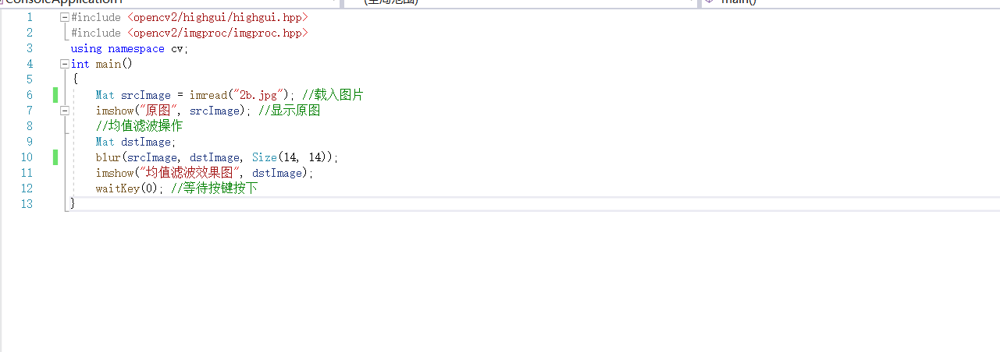
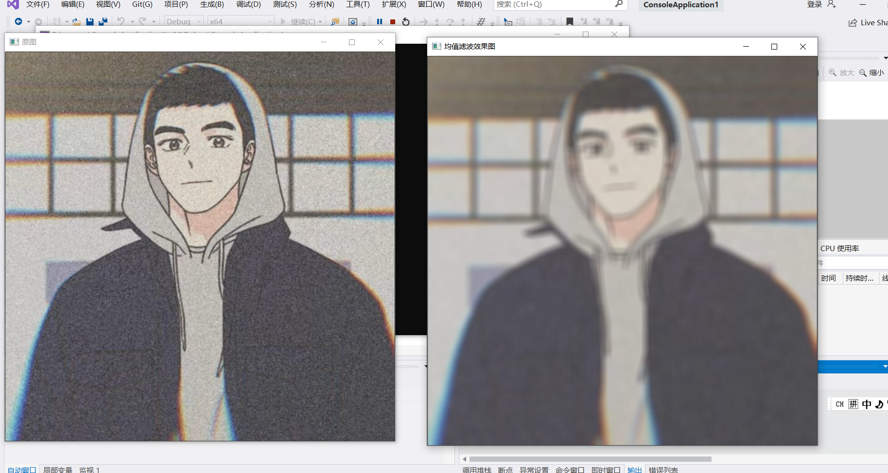

### canny边缘检测

载入图像，并将其转成灰度图，再用blur函数进行图像模糊以降噪，然后用canny函数进行边缘检测，最后进行显示。
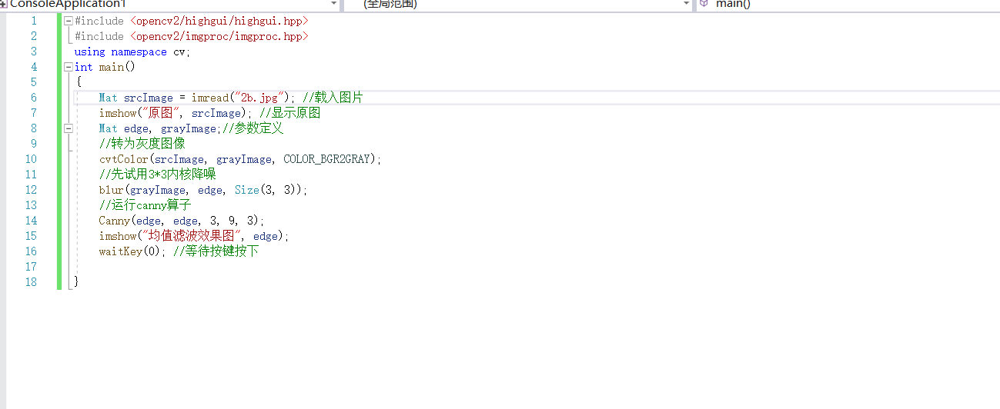
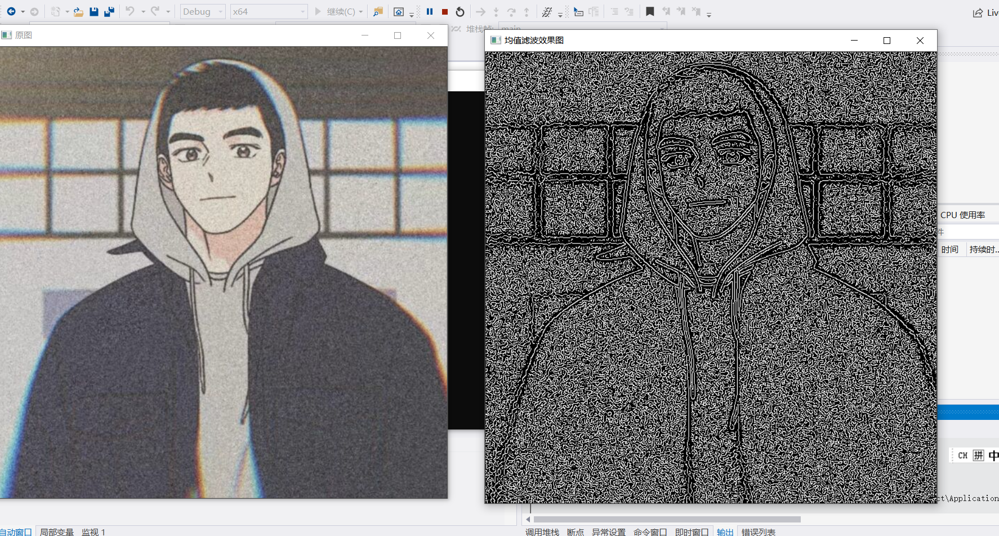

## 1.6 opencv视频基础操作

### 读取并播放视频

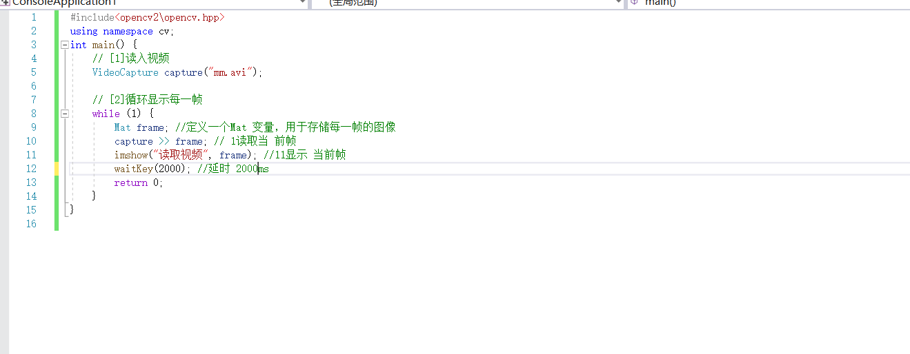
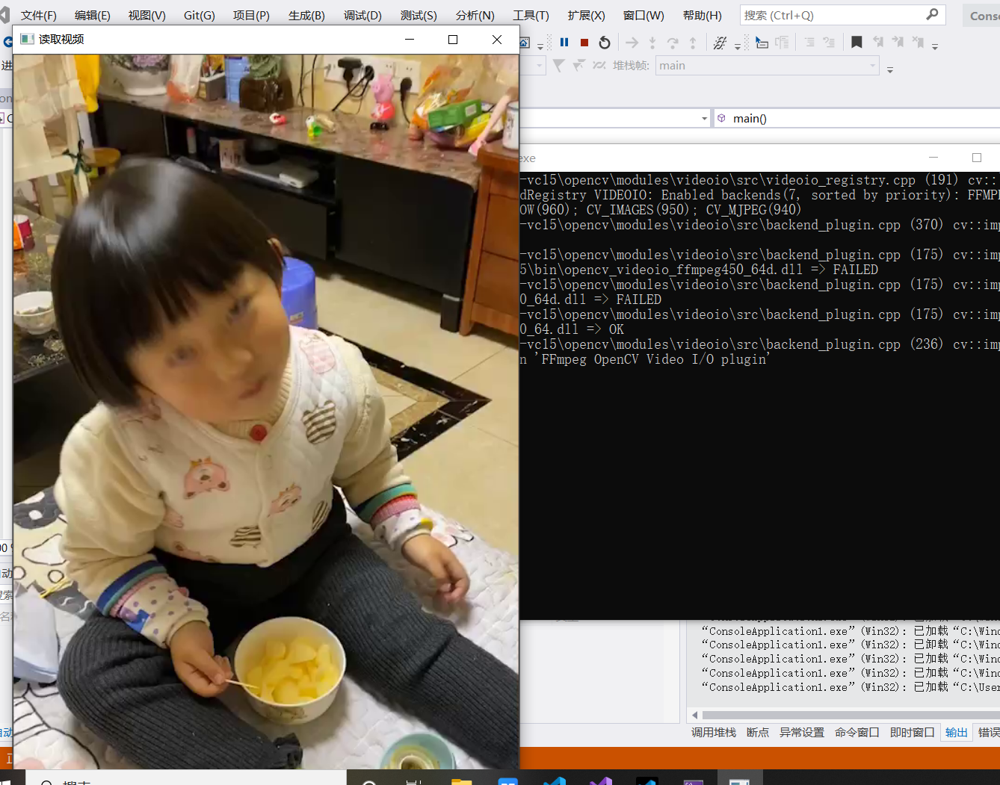

### 调用摄像头采集图像

VideoCapture是OpenCV 2.X中新增的一一个类，对应于之前C语言版本的CvCapture结构体。它提供了从摄像机或视频文件捕获视频的C++接口，作用是从视频文件或从摄像头捕获视频并显示出来。

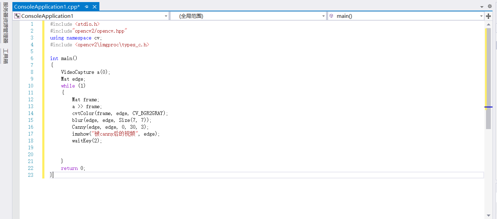

## 1.7 小结
我们熟悉了OpenCV 的周边概念，还分析了其基本架构。然后重点讲解了OpenCV的下载、安装与配置过程。配置完成后，我们带领大家正式开始领略OpenCV的魅力，接触了四个OpenCV图像处理小程序，还学习了如何使用OpenCV操作视频和调用摄像头。

## 2.1 彩色目标跟踪：Camshift

程序的用法是根据鼠标框选区域的色度光谱来进行摄像头读入的视频目标的跟踪。其主要采用CamShift 算法。

## 2.2 光流：optical flow

光流法是目前运动图像分析的重要方法，光流用来指定时变图像中模式的运动速度，因为当物体在运动时，在图像上对应点的亮度模式也在运动。这种图像亮度模式的表观运动就是光流。光流表达了图像的变化，由于它包含了目标运动的信息，因此可被观察者用来确定目标的运动情况。

## 2.3 点追踪：Ikedmo

在.\opencvlsourcesampleslcpp目录下(实际路径会因为OpenCV版本的不同略有差异)的lkdemo.epp文件中，存放着这样一个精彩的例程。程序运行后，会自动启用摄像头，这时按键盘上的“r”键来启动自动点追踪，便可以看到如图2.7所示的效果图1。而我们在摄像头中移动物体，可以看到物体上的点随着物体一同移动，富含科技感且妙趣横生。

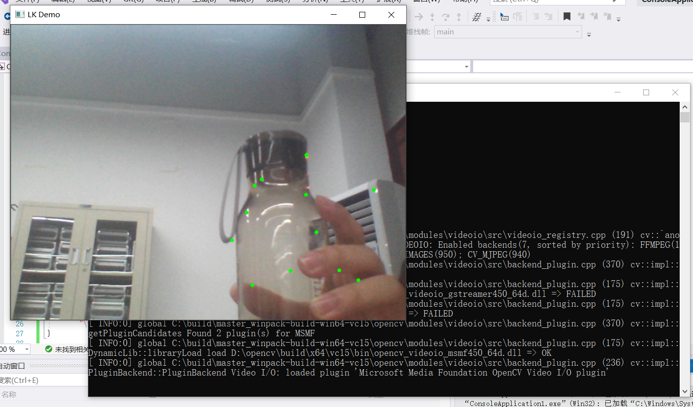

## 2.4 人脸识别

人脸识别是图像处理与OpenCV非常重要的应用之一，OpenCV 官方专门有教程和代码讲解其实现方法。此示例程序就是使用objdetect 模块检测摄像头视频流中的人脸运行程序，将自己的脸对准摄像
头，或者放置一张照片对准摄像头任其捕获，便可以发现程序准确地识别出了人脸，并用彩色的圆将脸圈出。

## 2.5 CMake

CMake是一个跨平台的安装（编译）工具，可以用简单的语句来描述所有平台的安装(编译过程)。他能够输出各种各样的makefile或者project文件，然后再依一般的建构方式使用。这使得熟悉某个集成开发环境（IDE）的开发者可以用标准的方式建构他的软件。

## 2.6 小结
这一节的实验是对上一节的升级和加深。我们对OpenCV有一个宏观的认知，还有一些命名规范的约定和相关C语言基础函数的复习。

## 3.1 图像的载入、显示和输出到文件

学习过以往版本OpenCV的读者应该都清楚,对于OpenCV1.0时代的基于C语言接口而建的图像存储格式Ipllmage*，如果在退出前忘记release 掉的话，会造成内存泄露，而且用起来十分繁琐。我们在debug程序的时候，往往很大一部分时间会去纠结手动释放内存相关的问题。虽然对于小型的程序来说，手动管理内存不是什么难题，但一旦开发的项目日益庞大，代码量达到- -定的规模，我们便会开始越来越多地纠缠于内存管理的问题，而不能把全部精力用于解决核心开发目标。因为不合适的图像存储数据结构而疲于维护日益庞大的项目，就有些舍本逐末的感觉了。自踏入2.0版本的时代以来，OpenCV采用了Mat类作为数据结构进行图像存取。这一改进使OpenCV变得和几乎零门槛入门的Matlab一样，很容易上手和用于实际开发。新版OpenCV中甚至有些函数名称都和Matlab中的-一样，比如大家所熟知imread、imwrite、imshow等函数。这对于广大图像处理和计算机视觉领域的研究者们来说，的确是一件可喜可贺的事情。而这-一小节中，我们主要来详细讲解OpenCV2、OpenCV3 入门最基本的问题，即图像的载入、显示和输出。

## 3.2 opencv的命名空间

OpenCV中的C++类和函数都是定义在命名空间cv之内的，有两种方法可以访问:第-一种，是在代码开头的适当位置加上usingnamespace cv;这句代码，规定程序位于此命名空间之内;另外一种，是在使用OpenCV的每--个类和函数时,都加入ev::命名空间。不过这种情况会很繁琐，每用一个OpenCV的类或者函数,都要多敲四下键盘写出Cx:.所以，推荐大家在代码开头的适当位置，加上usingnamespace cv;这句。

## 3.3 Mat类简析

Mat 类是一个用于保存图像数据或者矩阵数据的数据结构，可以说是一个矩阵类，在默认情况下其尺寸大小为0。当然也可以指定该对象的初始尺寸。

## 3.4 图像的载入，显示，输出
演示如何载入图像，进行简单的图像混合，显示图像，并且输出混合后的图像到jpg格式的文件中。出于注重演示效果的原因，程序中图像混合的具体细节我们放到稍后的篇幅
中再讲，现在先给大家看看混合的效果和源码。

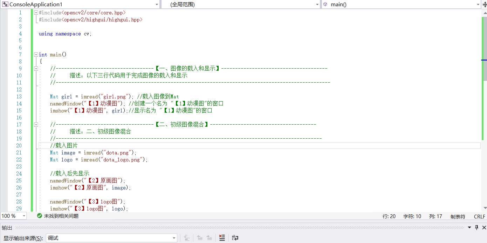
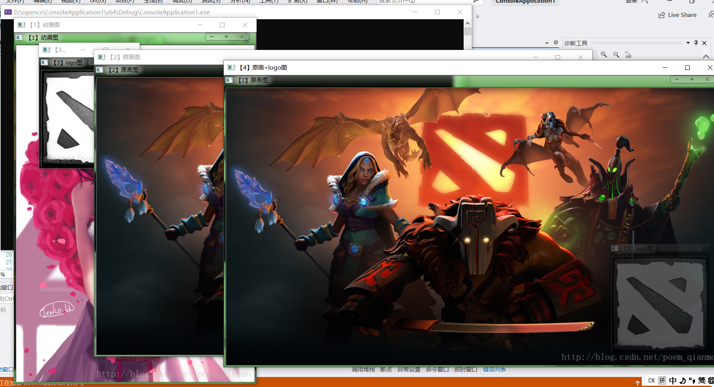

## 3.5 创建滑动条 createTrackbar（）函数

●第一个参数，const string&类型的trackbarname, 轨迹条的名字，用来代表
我们创建的轨迹条。
●第二个参数，const string&类型的winname， 窗口的名字，表示这个轨迹条
会依附到哪个窗口.上，即对应namedWindow(创建 窗口时填的某-一个窗口
名。
●第三个参数，int* 类型的value, 一个指向整型的指针，表示滑块的位置。
在创建时，滑块的初始位置就是该变量当前的值。
●第四个参数，int 类型的count， 表示滑块可以达到的最大位置的值。滑块
最小位置的值始终为0。
●第五个参数, TrackbarCallback类型的onChangel它有默认值0。这是-一个
指向回调函数的指针，每次滑块位置改变时，这个函数都会进行回调。并
且这个函数的原型必须为void XXXX(int, void*);, 其中第-一个参数是轨迹
条的位置，第二个参数是用户数据(看下面的第六个参数)。如果回调是
NULL指针，则表示没有回调函数的调用，仅第三个参数value有变化。
●第六个参数，void*类型的userdata, 也有默认值0。这个参数是用户传给回
调函数的数据，用来处理轨迹条事件。如果使用的第三个参数value实参是
全局变量的话，完全可以不去管这个userdata 参数。

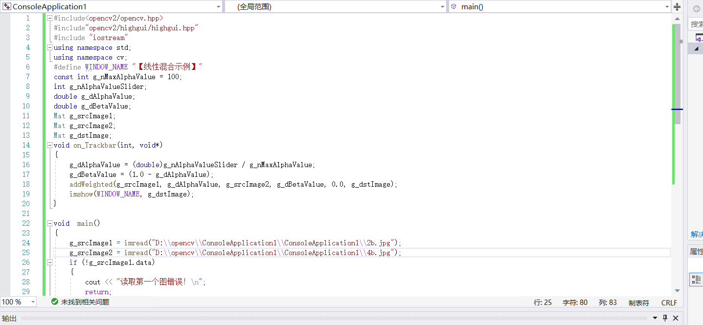

## 3.6 鼠标操作

OpenCV中的鼠标操作和滑动条的消息映射方式很类似，都是通过一一个中介函数配合一个回调函数来实现的。创建和指定滑动条回调函数的函数为createTrackbar,而指定鼠标操作消息回调函数的函数为SetMouseCallback。 

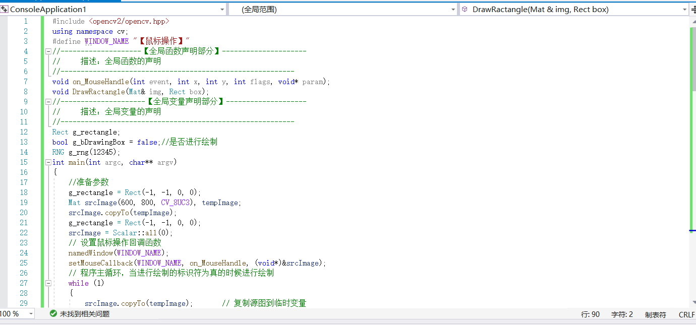
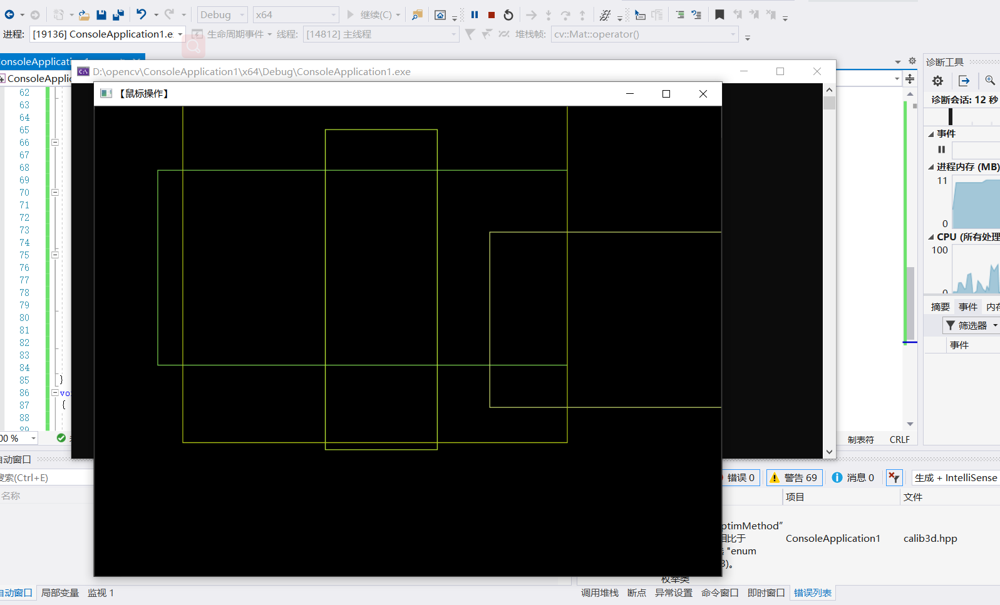

## 3.7 小结

我们在这一章学习了opencv的高层GUI图形用户界面模块highgui。
分别是
●图像的载入
●显示与输出图像到文件
●以及如何使用滑动条，如何进行鼠标操作。