# 第一次作业
## 第一章 邂逅OpenCV
## 实验部分
### 1.安装opencv
#### 1.下载好qq群里的opencv进行安装，选择4.5.0版本
#### 2.选择安装路径进行安装
#### 3.添加环境变量
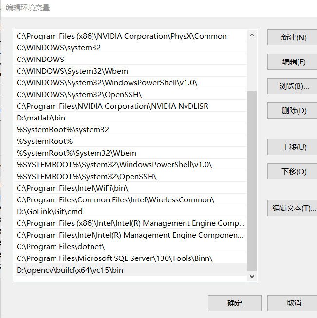
#### 4.将D:\opencv\build\x64\vc15\bin目录下的opencv_world450.dll，opencv_world450d.dll文件复制到C:\Windows\SysWOW64
---
### 2.配置Visual Studio 2019
#### 1.创建一个控制台应用并设置好路径


#### 2.创建后修改debug位数，如图

#### 3.找到Debug | X64，创建属性表，并双击
#### 4.
(1):将D:\opencv\build\include;D:\opencv\build\include\opencv2; 配置到 VC++目录下的包含目录
(2):将D:\opencv\build\x64\vc15\lib配置到VC++目录下的库目录

#### 5. 链接器–>输入–>附加依赖项 值为opencv_world450d.lib
#### 6.配置完成
---
### 3.图像显示
代码
```
#include <opencv2/opencv.hpp>  //头文件
using namespace cv;  //包含cv命名空间

void main( )
{    
	// 【1】读入一张图片，载入图像
	Mat srcImage = imread("D:\\bandzip\\2.png");
	// 【2】显示载入的图片
	imshow("【原始图】",srcImage);
	// 【3】等待任意按键按下
	waitKey(0);
}
```
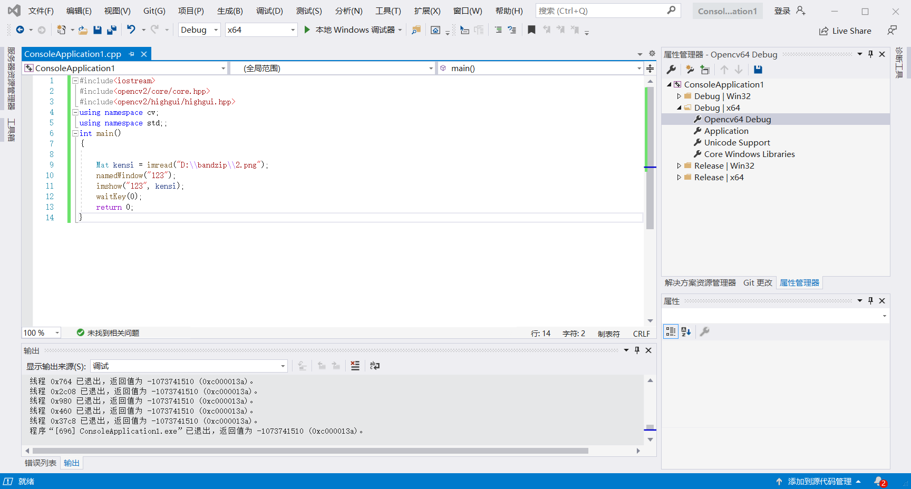
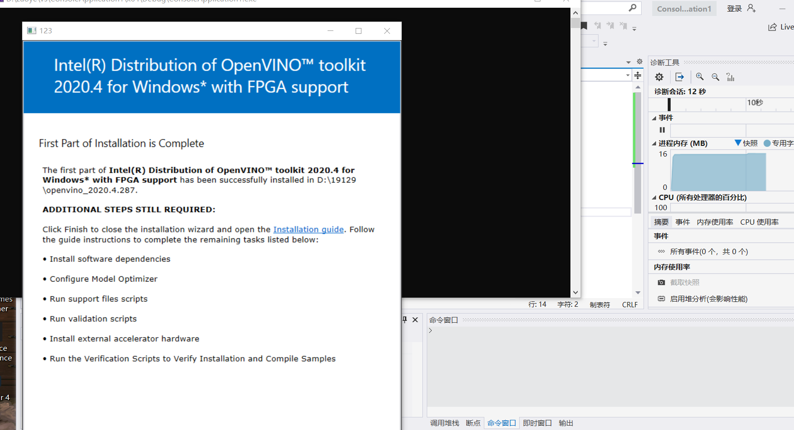
### 4.图像腐蚀
```
-----------------------------【命名空间声明部分】---------------------------------------
//		描述：包含程序所使用的命名空间
//-----------------------------------------------------------------------------------------------  
using namespace cv;

//-----------------------------------【main( )函数】--------------------------------------------
//		描述：控制台应用程序的入口函数，我们的程序从这里开始
//-----------------------------------------------------------------------------------------------
int main(   )
{
	//载入原图  
	Mat srcImage = imread("D:\\shucai\\256.jpg");
	//显示原图
	imshow("【原图】腐蚀操作", srcImage);
	//进行腐蚀操作 
	Mat element = getStructuringElement(MORPH_RECT, Size(15, 15));
	Mat dstImage;
	erode(srcImage, dstImage, element);
	//显示效果图 
	imshow("【效果图】腐蚀操作", dstImage);
	waitKey(0); 

	return 0;
}
```
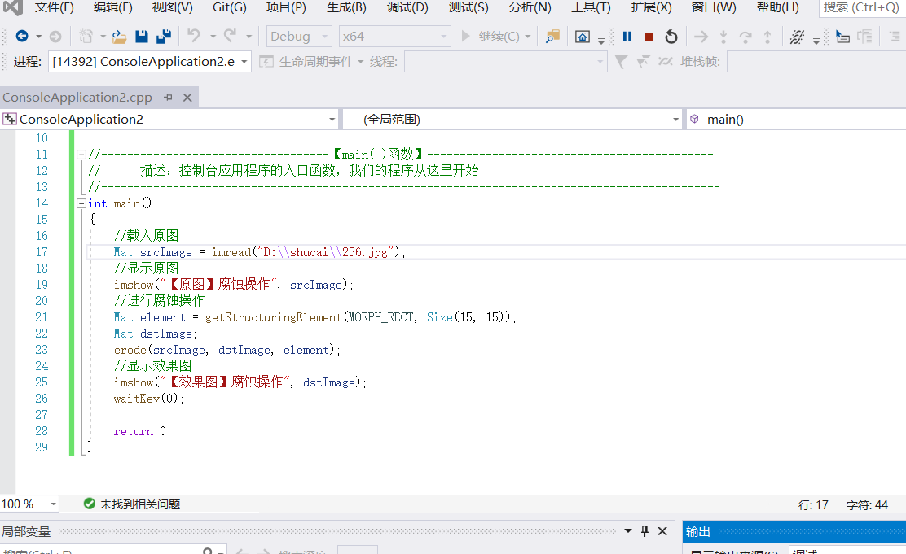
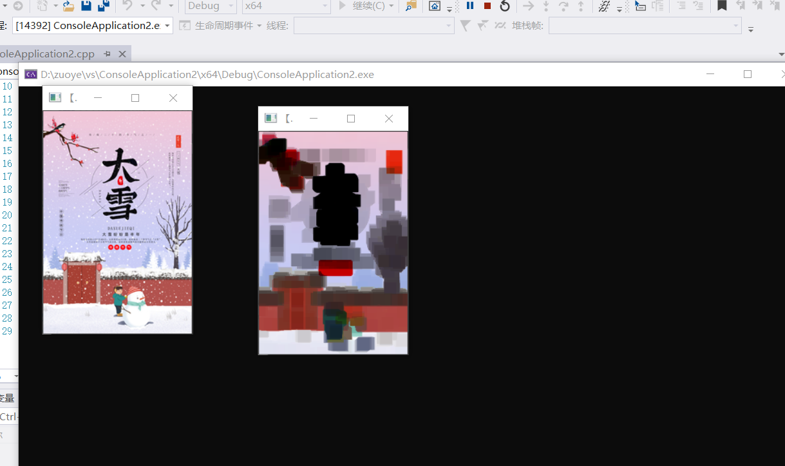
---
### 5.图像模糊
```
#include "opencv2/highgui/highgui.hpp" 
#include "opencv2/imgproc/imgproc.hpp" 
using namespace cv; 

//-----------------------------------【main( )函数】--------------------------------------------
//		描述：控制台应用程序的入口函数，我们的程序从这里开始
//-----------------------------------------------------------------------------------------------
int main( )
{ 
	//【1】载入原始图
	Mat srcImage=imread("D:\\shucai\\256.jpg"); 

	//【2】显示原始图
	imshow( "均值滤波【原图】", srcImage ); 

	//【3】进行均值滤波操作
	Mat dstImage; 
	blur( srcImage, dstImage, Size(7, 7)); 

	//【4】显示效果图
	imshow( "均值滤波【效果图】" ,dstImage ); 

	waitKey( 0 );     
}
```
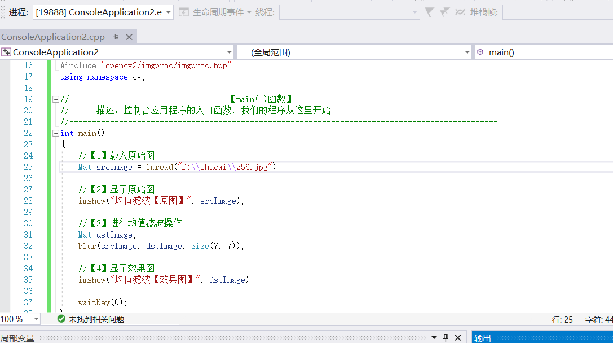
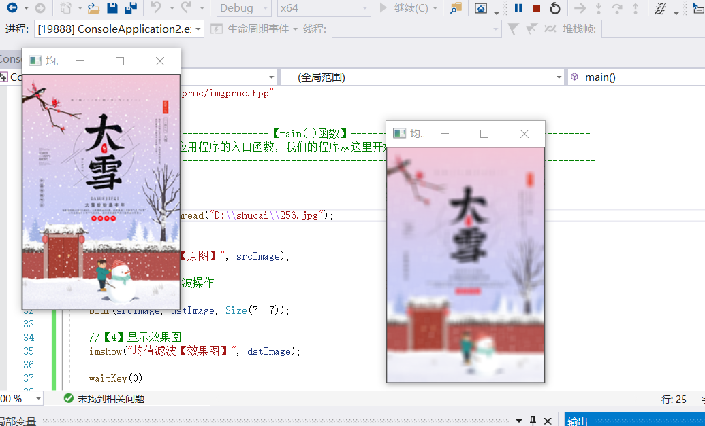
---
### 6.播放视频
```
#include <opencv2\opencv.hpp>  
using namespace cv;  

//-----------------------------------【main( )函数】--------------------------------------------
//		描述：控制台应用程序的入口函数，我们的程序从这里开始
//-------------------------------------------------------------------------------------------------
int main( )  
{  
	//【1】读入视频
	VideoCapture capture("D:\\shucai\\1.avi");

	//【2】循环显示每一帧
	while(1)  
	{  
		Mat frame;//定义一个Mat变量，用于存储每一帧的图像
		capture>>frame;  //读取当前帧
		imshow("读取视频",frame);  //显示当前帧
		waitKey(30);  //延时30ms
	}  
	return 0;     
}
```
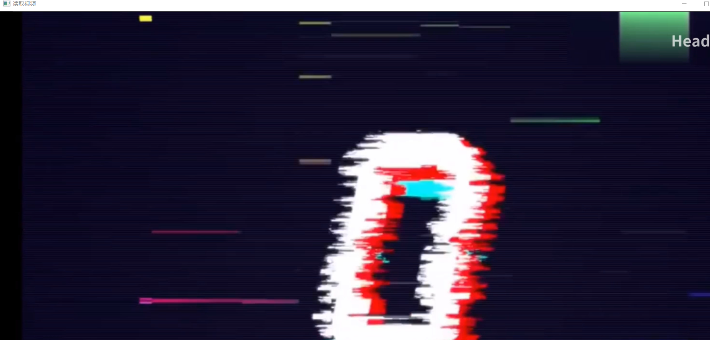

---
### 7.调用摄像头
```
#include<opencv.hpp>
using namespace cv;
int main() {
    VideoCapture capture(0);

    while (1) {
        Mat frame;
        capture >> frame;

        imshow("摄像头捕捉", frame);

        waitKey(1);
    }
}
```
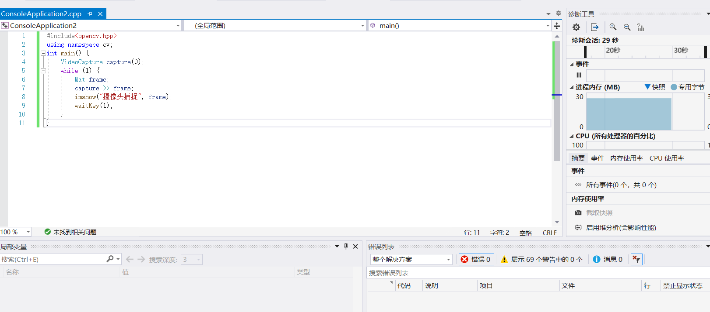
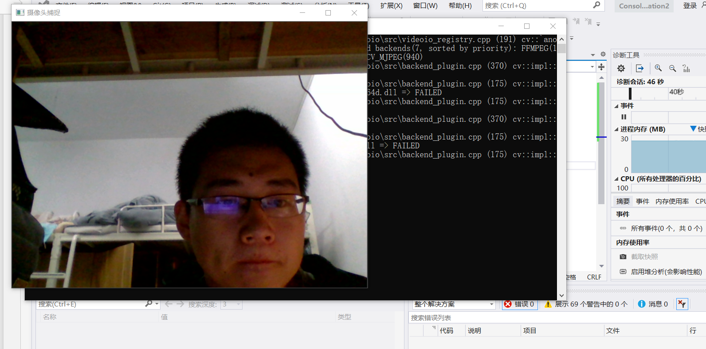
===
### 8.边缘检测
```

#include<opencv.hpp>
using namespace cv;
int main() {
    VideoCapture capture(0);
    Mat edgs;
    while (1) {
        Mat frame;
        capture >> frame;
        cvtColor(frame, edgs,COLOR_BGR2GRAY);
        blur(edgs, edgs, Size(8, 8));
        Canny(edgs, edgs, 0, 30, 3);
        imshow("摄像头捕捉", edgs);
        waitKey(1);
    }
}

```
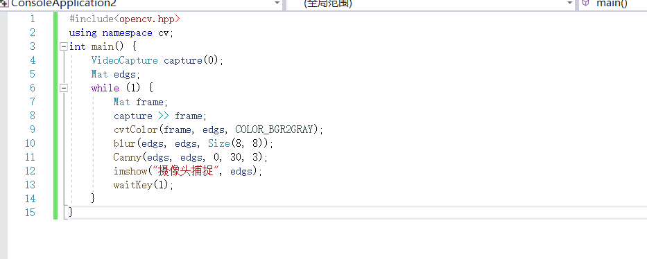
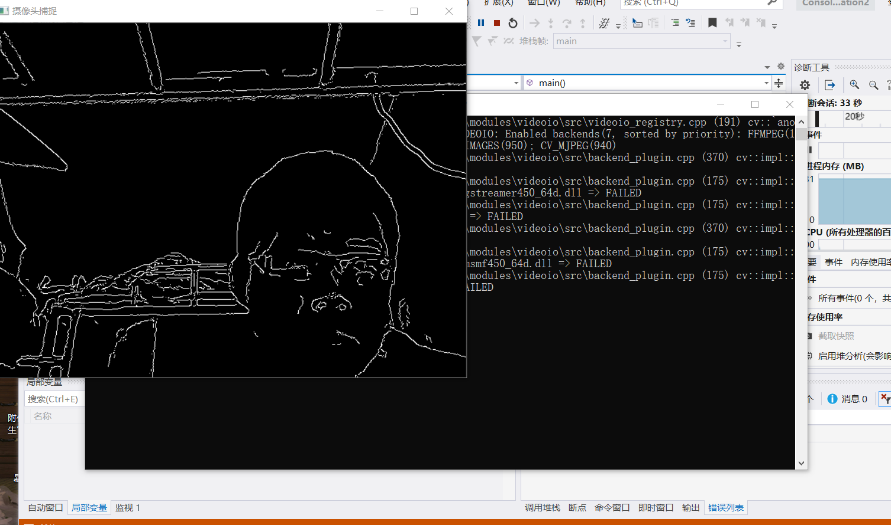

---
## 笔记部分


 1.using namespace cv;  //包含cv命名空间

2.Mat srcImage = ("1.jpg"); //载入图像

3.imshow("[原始图]"，srcImage);//显示图像

4.waitKey(0);   //等待任意按键按下

5.waitKey(6000); //等待6000ms后窗口自动关闭

6.blur(srcImage,dstImage,Size(7,7)); //均值滤波操作

7.cvtColor(srcImage, grayImage, CV_BGR2GRAY ); //将原图像转换为灰度图像

8.读入视频

  法一：VideoCapturecapture("1.avi");

  法二：VideoCapturecapture; capture.open("1.avi");

9.调用摄像头读入视频

  VideoCapture capture(0);

  ---
  ## 第二章 启程前的认知准备
  ## 实验部分
  ### 1.彩色目标跟踪
  ```

 #include "opencv2/video/tracking.hpp"
 #include "opencv2/imgproc/imgproc.hpp"
 #include "opencv2/highgui/highgui.hpp"
 #include <iostream>
 #include <ctype.h>

using namespace cv;
using namespace std;


//-----------------------------------【全局变量声明】-----------------------------------------
//		描述：声明全局变量
//
Mat image;
bool backprojMode = false;
bool selectObject = false;
int trackObject = 0;
bool showHist = true;
Point origin;
Rect selection;
int vmin = 10, vmax = 256, smin = 30;


//--------------------------------【onMouse( )回调函数】------------------------------------
//		描述：鼠标操作回调
//-------------------------------------------------------------------------------------------------
static void onMouse( int event, int x, int y, int, void* )
{
	if( selectObject )
	{
		selection.x = MIN(x, origin.x);
		selection.y = MIN(y, origin.y);
		selection.width = std::abs(x - origin.x);
		selection.height = std::abs(y - origin.y);

		selection &= Rect(0, 0, image.cols, image.rows);
	}

	switch( event )
	{
	//此句代码的OpenCV2版为：
	//case CV_EVENT_LBUTTONDOWN:
	//此句代码的OpenCV3版为：
	case EVENT_LBUTTONDOWN:
		origin = Point(x,y);
		selection = Rect(x,y,0,0);
		selectObject = true;
		break;
	//此句代码的OpenCV2版为：
	//case CV_EVENT_LBUTTONUP:
	//此句代码的OpenCV3版为：
	case EVENT_LBUTTONUP:
		selectObject = false;
		if( selection.width > 0 && selection.height > 0 )
			trackObject = -1;
		break;
	}
}

//--------------------------------【help( )函数】----------------------------------------------
//		描述：输出帮助信息
//-------------------------------------------------------------------------------------------------
static void ShowHelpText()
{
	cout <<"\n\n\t\t\t非常感谢购买《OpenCV3编程入门》一书！\n"
		<<"\n\n\t\t\t此为本书OpenCV3版的第8个配套示例程序\n"
		<<	"\n\n\t\t\t   当前使用的OpenCV版本为：" << CV_VERSION 
		<<"\n\n  ----------------------------------------------------------------------------" ;

	cout << "\n\n\t此Demo显示了基于均值漂移的追踪（tracking）技术\n"
		"\t请用鼠标框选一个有颜色的物体，对它进行追踪操作\n";

	cout << "\n\n\t操作说明： \n"
		"\t\t用鼠标框选对象来初始化跟踪\n"
		"\t\tESC - 退出程序\n"
		"\t\tc - 停止追踪\n"
		"\t\tb - 开/关-投影视图\n"
		"\t\th - 显示/隐藏-对象直方图\n"
		"\t\tp - 暂停视频\n";
}

const char* keys =
{
	"{1|  | 0 | camera number}"
};


//-----------------------------------【main( )函数】--------------------------------------------
//		描述：控制台应用程序的入口函数，我们的程序从这里开始
//-------------------------------------------------------------------------------------------------
int main( int argc, const char** argv )
{
	ShowHelpText();

	VideoCapture cap;
	Rect trackWindow;
	int hsize = 16;
	float hranges[] = {0,180};
	const float* phranges = hranges;

	cap.open(0);

	if( !cap.isOpened() )
	{
		cout << "不能初始化摄像头\n";
	}

	namedWindow( "Histogram", 0 );
	namedWindow( "CamShift Demo", 0 );
	setMouseCallback( "CamShift Demo", onMouse, 0 );
	createTrackbar( "Vmin", "CamShift Demo", &vmin, 256, 0 );
	createTrackbar( "Vmax", "CamShift Demo", &vmax, 256, 0 );
	createTrackbar( "Smin", "CamShift Demo", &smin, 256, 0 );

	Mat frame, hsv, hue, mask, hist, histimg = Mat::zeros(200, 320, CV_8UC3), backproj;
	bool paused = false;

	for(;;)
	{
		if( !paused )
		{
			cap >> frame;
			if( frame.empty() )
				break;
		}

		frame.copyTo(image);

		if( !paused )
		{
			cvtColor(image, hsv, COLOR_BGR2HSV);

			if( trackObject )
			{
				int _vmin = vmin, _vmax = vmax;

				inRange(hsv, Scalar(0, smin, MIN(_vmin,_vmax)),
					Scalar(180, 256, MAX(_vmin, _vmax)), mask);
				int ch[] = {0, 0};
				hue.create(hsv.size(), hsv.depth());
				mixChannels(&hsv, 1, &hue, 1, ch, 1);

				if( trackObject < 0 )
				{
					Mat roi(hue, selection), maskroi(mask, selection);
					calcHist(&roi, 1, 0, maskroi, hist, 1, &hsize, &phranges);
					//此句代码的OpenCV3版为：
					normalize(hist, hist, 0, 255, NORM_MINMAX);
					//此句代码的OpenCV2版为：
					//normalize(hist, hist, 0, 255, CV_MINMAX);

					trackWindow = selection;
					trackObject = 1;

					histimg = Scalar::all(0);
					int binW = histimg.cols / hsize;
					Mat buf(1, hsize, CV_8UC3);
					for( int i = 0; i < hsize; i++ )
						buf.at<Vec3b>(i) = Vec3b(saturate_cast<uchar>(i*180./hsize), 255, 255);

					//此句代码的OpenCV3版为：
					cvtColor(buf, buf, COLOR_HSV2BGR);
					//此句代码的OpenCV2版为：
					//cvtColor(buf, buf, CV_HSV2BGR);

					for( int i = 0; i < hsize; i++ )
					{
						int val = saturate_cast<int>(hist.at<float>(i)*histimg.rows/255);
						rectangle( histimg, Point(i*binW,histimg.rows),
							Point((i+1)*binW,histimg.rows - val),
							Scalar(buf.at<Vec3b>(i)), -1, 8 );
					}
				}

				calcBackProject(&hue, 1, 0, hist, backproj, &phranges);
				backproj &= mask;
				RotatedRect trackBox = CamShift(backproj, trackWindow,

				//此句代码的OpenCV3版为：
				TermCriteria( TermCriteria::EPS | TermCriteria::COUNT, 10, 1 ));
				//此句代码的OpenCV2版为：
				//TermCriteria( CV_TERMCRIT_EPS | CV_TERMCRIT_ITER, 10, 1 ));

				if( trackWindow.area() <= 1 )
				{
					int cols = backproj.cols, rows = backproj.rows, r = (MIN(cols, rows) + 5)/6;
					trackWindow = Rect(trackWindow.x - r, trackWindow.y - r,
						trackWindow.x + r, trackWindow.y + r) &
						Rect(0, 0, cols, rows);
				}

				if( backprojMode )
					cvtColor( backproj, image, COLOR_GRAY2BGR );

				//此句代码的OpenCV3版为：
				ellipse( image, trackBox, Scalar(0,0,255), 3, LINE_AA );
				

			}
		}
		else if( trackObject < 0 )
			paused = false;

		if( selectObject && selection.width > 0 && selection.height > 0 )
		{
			Mat roi(image, selection);
			bitwise_not(roi, roi);
		}

		imshow( "CamShift Demo", image );
		imshow( "Histogram", histimg );

		char c = (char)waitKey(10);
		if( c == 27 )
			break;
		switch(c)
		{
		case 'b':
			backprojMode = !backprojMode;
			break;
		case 'c':
			trackObject = 0;
			histimg = Scalar::all(0);
			break;
		case 'h':
			showHist = !showHist;
			if( !showHist )
				destroyWindow( "Histogram" );
			else
				namedWindow( "Histogram", 1 );
			break;
		case 'p':
			paused = !paused;
			break;
		default:
			;
		}
	}

	return 0;
}


  ```
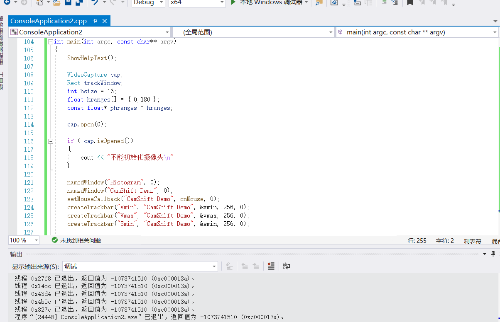
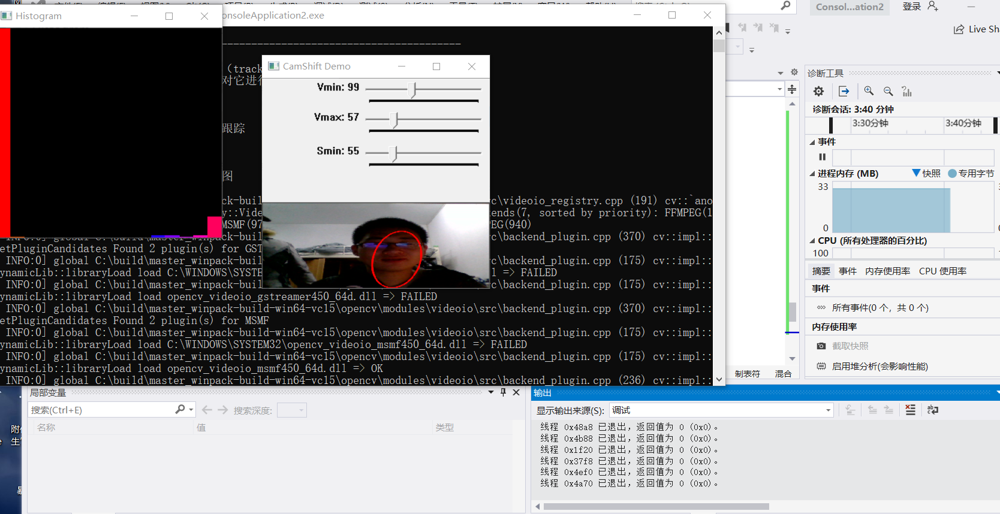

---
### 2.光流
```

#include <opencv2/video/video.hpp>
#include <opencv2/highgui/highgui.hpp>
#include <opencv2/imgproc/imgproc.hpp>
#include <opencv2/core/core.hpp>
#include <iostream>
#include <cstdio>

using namespace std;
using namespace cv;


//-----------------------------------【全局函数声明】-----------------------------------------
//		描述：声明全局函数
//-------------------------------------------------------------------------------------------------
void tracking(Mat &frame, Mat &output);
bool addNewPoints();
bool acceptTrackedPoint(int i);

//-----------------------------------【全局变量声明】-----------------------------------------
//		描述：声明全局变量
//-------------------------------------------------------------------------------------------------
string window_name = "optical flow tracking";
Mat gray;	// 当前图片
Mat gray_prev;	// 预测图片
vector<Point2f> points[2];	// point0为特征点的原来位置，point1为特征点的新位置
vector<Point2f> initial;	// 初始化跟踪点的位置
vector<Point2f> features;	// 检测的特征
int maxCount = 500;	// 检测的最大特征数
double qLevel = 0.01;	// 特征检测的等级
double minDist = 10.0;	// 两特征点之间的最小距离
vector<uchar> status;	// 跟踪特征的状态，特征的流发现为1，否则为0
vector<float> err;


//--------------------------------【help( )函数】----------------------------------------------
//		描述：输出帮助信息
//-------------------------------------------------------------------------------------------------
static void help()
{
	//输出欢迎信息和OpenCV版本
	cout <<"\n\n\t\t\t非常感谢购买《OpenCV3编程入门》一书！\n"
		<<"\n\n\t\t\t此为本书OpenCV3版的第9个配套示例程序\n"
		<<	"\n\n\t\t\t   当前使用的OpenCV版本为：" << CV_VERSION 
		<<"\n\n  ----------------------------------------------------------------------------" ;
}


//-----------------------------------【main( )函数】--------------------------------------------
//		描述：控制台应用程序的入口函数，我们的程序从这里开始
//-------------------------------------------------------------------------------------------------
int main()
{

	Mat frame;
	Mat result;

	VideoCapture capture("1.avi");

	help();
	if(capture.isOpened())	// 摄像头读取文件开关
	{
		while(true)
		{
			capture >> frame;

			if(!frame.empty())
			{ 
				tracking(frame, result);
			}
			else
			{ 
				printf(" --(!) No captured frame -- Break!");
				break;
			}

			int c = waitKey(50);
			if( (char)c == 27 )
			{
				break; 
			} 
		}
	}
	return 0;
}

//-------------------------------------------------------------------------------------------------
// function: tracking
// brief: 跟踪
// parameter: frame	输入的视频帧
//			  output 有跟踪结果的视频帧
// return: void
//-------------------------------------------------------------------------------------------------
void tracking(Mat &frame, Mat &output)
{

	//此句代码的OpenCV3版为：
	cvtColor(frame, gray, COLOR_BGR2GRAY);
	//此句代码的OpenCV2版为：
	//cvtColor(frame, gray, CV_BGR2GRAY);

	frame.copyTo(output);

	// 添加特征点
	if (addNewPoints())
	{
		goodFeaturesToTrack(gray, features, maxCount, qLevel, minDist);
		points[0].insert(points[0].end(), features.begin(), features.end());
		initial.insert(initial.end(), features.begin(), features.end());
	}

	if (gray_prev.empty())
	{
		gray.copyTo(gray_prev);
	}
	// l-k光流法运动估计
	calcOpticalFlowPyrLK(gray_prev, gray, points[0], points[1], status, err);
	// 去掉一些不好的特征点
	int k = 0;
	for (size_t i=0; i<points[1].size(); i++)
	{
		if (acceptTrackedPoint(i))
		{
			initial[k] = initial[i];
			points[1][k++] = points[1][i];
		}
	}
	points[1].resize(k);
	initial.resize(k);
	// 显示特征点和运动轨迹
	for (size_t i=0; i<points[1].size(); i++)
	{
		line(output, initial[i], points[1][i], Scalar(0, 0, 255));
		circle(output, points[1][i], 3, Scalar(0, 255, 0), -1);
	}

	// 把当前跟踪结果作为下一此参考
	swap(points[1], points[0]);
	swap(gray_prev, gray);

	imshow(window_name, output);
}

//-------------------------------------------------------------------------------------------------
// function: addNewPoints
// brief: 检测新点是否应该被添加
// parameter:
// return: 是否被添加标志
//-------------------------------------------------------------------------------------------------
bool addNewPoints()
{
	return points[0].size() <= 10;
}

//-------------------------------------------------------------------------------------------------
// function: acceptTrackedPoint
// brief: 决定哪些跟踪点被接受
// parameter:
// return:
//-------------------------------------------------------------------------------------------------
bool acceptTrackedPoint(int i)
{
	return status[i] && ((abs(points[0][i].x - points[1][i].x) + abs(points[0][i].y - points[1][i].y)) > 2);
}


```


---
### 3.点追踪
```


#include "opencv2/video/tracking.hpp"
#include "opencv2/imgproc/imgproc.hpp"
#include "opencv2/highgui/highgui.hpp"

#include <iostream>
#include <ctype.h>

using namespace cv;
using namespace std;


//--------------------------------【help( )函数】----------------------------------------------
//		描述：输出帮助信息
//-------------------------------------------------------------------------------------------------
static void help()
{
	//输出欢迎信息和OpenCV版本
	cout <<"\n\n\t\t\t非常感谢购买《OpenCV3编程入门》一书！\n"
		<<"\n\n\t\t\t此为本书OpenCV3版的第10个配套示例程序\n"
		<<	"\n\n\t\t\t   当前使用的OpenCV版本为：" << CV_VERSION 
		<<"\n\n  ----------------------------------------------------------------------------" ;
	cout	<< "\n\n\t该Demo演示了 Lukas-Kanade基于光流的lkdemo\n";
	cout << "\n\t程序默认从摄像头读入视频，可以按需改为从视频文件读入图像\n";
	cout << "\n\t操作说明: \n"
		"\t\t通过点击在图像中添加/删除特征点\n" 
		"\t\tESC - 退出程序\n"
		"\t\tr -自动进行追踪\n"
		"\t\tc - 删除所有点\n"
		"\t\tn - 开/光-夜晚模式\n"<< endl;
}

Point2f point;
bool addRemovePt = false;

//--------------------------------【onMouse( )回调函数】------------------------------------
//		描述：鼠标操作回调
//-------------------------------------------------------------------------------------------------
static void onMouse( int event, int x, int y, int /*flags*/, void* /*param*/ )
{
	//此句代码的OpenCV2版为：
	//if( event == CV_EVENT_LBUTTONDOWN )
	//此句代码的OpenCV3版为：
	if( event == EVENT_LBUTTONDOWN )
	{
		point = Point2f((float)x, (float)y);
		addRemovePt = true;
	}
}

//-----------------------------------【main( )函数】--------------------------------------------
//		描述：控制台应用程序的入口函数，我们的程序从这里开始
//-------------------------------------------------------------------------------------------------
int main( int argc, char** argv )
{
	help();

	VideoCapture cap;

	//此句代码的OpenCV2版为：
	//TermCriteria termcrit(CV_TERMCRIT_ITER|CV_TERMCRIT_EPS, 20, 0.03);
	//此句代码的OpenCV3版为：
	TermCriteria termcrit(TermCriteria::MAX_ITER|TermCriteria::EPS, 20, 0.03);
	Size subPixWinSize(10,10), winSize(31,31);

	const int MAX_COUNT = 500;
	bool needToInit = false;
	bool nightMode = false;


	cap.open(0);

	if( !cap.isOpened() )
	{
		cout << "Could not initialize capturing...\n";
		return 0;
	}

	namedWindow( "LK Demo", 1 );
	setMouseCallback( "LK Demo", onMouse, 0 );

	Mat gray, prevGray, image;
	vector<Point2f> points[2];

	for(;;)
	{
		Mat frame;
		cap >> frame;
		if( frame.empty() )
			break;

		frame.copyTo(image);
		cvtColor(image, gray, COLOR_BGR2GRAY);

		if( nightMode )
			image = Scalar::all(0);

		if( needToInit )
		{
			// 自动初始化
			goodFeaturesToTrack(gray, points[1], MAX_COUNT, 0.01, 10, Mat(), 3, 0, 0.04);
			cornerSubPix(gray, points[1], subPixWinSize, Size(-1,-1), termcrit);
			addRemovePt = false;
		}
		else if( !points[0].empty() )
		{
			vector<uchar> status;
			vector<float> err;
			if(prevGray.empty())
				gray.copyTo(prevGray);
			calcOpticalFlowPyrLK(prevGray, gray, points[0], points[1], status, err, winSize,
				3, termcrit, 0, 0.001);
			size_t i, k;
			for( i = k = 0; i < points[1].size(); i++ )
			{
				if( addRemovePt )
				{
					if( norm(point - points[1][i]) <= 5 )
					{
						addRemovePt = false;
						continue;
					}
				}

				if( !status[i] )
					continue;

				points[1][k++] = points[1][i];
				circle( image, points[1][i], 3, Scalar(0,255,0), -1, 8);
			}
			points[1].resize(k);
		}

		if( addRemovePt && points[1].size() < (size_t)MAX_COUNT )
		{
			vector<Point2f> tmp;
			tmp.push_back(point);

			//此句代码的OpenCV2版为：
			//cornerSubPix( gray, tmp, winSize, cvSize(-1,-1), termcrit);
			//此句代码的OpenCV3版为：
			cornerSubPix( gray, tmp, winSize, Size(-1,-1), termcrit);
			points[1].push_back(tmp[0]);
			addRemovePt = false;
		}

		needToInit = false;
		imshow("LK Demo", image);

		char c = (char)waitKey(10);
		if( c == 27 )
			break;
		switch( c )
		{
		case 'r':
			needToInit = true;
			break;
		case 'c':
			points[0].clear();
			points[1].clear();
			break;
		case 'n':
			nightMode = !nightMode;
			break;
		}

		std::swap(points[1], points[0]);
		cv::swap(prevGray, gray);
	}

	return 0;
}


```


---
### 4.人脸识别
```

#include "opencv2/objdetect/objdetect.hpp"
#include "opencv2/highgui/highgui.hpp"
#include "opencv2/imgproc/imgproc.hpp"

#include <iostream>
#include <stdio.h>

using namespace std;
using namespace cv;


void detectAndDisplay( Mat frame );

//--------------------------------【全局变量声明】----------------------------------------------
//		描述：声明全局变量
//-------------------------------------------------------------------------------------------------
//注意，需要把"haarcascade_frontalface_alt.xml"和"haarcascade_eye_tree_eyeglasses.xml"这两个文件复制到工程路径下
String face_cascade_name = "haarcascade_frontalface_alt.xml";
String eyes_cascade_name = "haarcascade_eye_tree_eyeglasses.xml";
CascadeClassifier face_cascade;
CascadeClassifier eyes_cascade;
string window_name = "Capture - Face detection";
RNG rng(12345);


//--------------------------------【help( )函数】----------------------------------------------
//		描述：输出帮助信息
//-------------------------------------------------------------------------------------------------
static void ShowHelpText()
{
	//输出欢迎信息和OpenCV版本
	cout <<"\n\n\t\t\t非常感谢购买《OpenCV3编程入门》一书！\n"
		<<"\n\n\t\t\t此为本书OpenCV3版的第11个配套示例程序\n"
		<<	"\n\n\t\t\t   当前使用的OpenCV版本为：" << CV_VERSION 
		<<"\n\n  ----------------------------------------------------------------------------" ;
}


//-----------------------------------【main( )函数】--------------------------------------------
//		描述：控制台应用程序的入口函数，我们的程序从这里开始
//-------------------------------------------------------------------------------------------------
int main( void )
{
  VideoCapture capture;
  Mat frame;


  //-- 1. 加载级联（cascades）
  if( !face_cascade.load( face_cascade_name ) ){ printf("--(!)Error loading\n"); return -1; };
  if( !eyes_cascade.load( eyes_cascade_name ) ){ printf("--(!)Error loading\n"); return -1; };

  //-- 2. 读取视频
  capture.open(0);
  ShowHelpText();
  if( capture.isOpened() )
  {
    for(;;)
    {
      capture >> frame;

      //-- 3. 对当前帧使用分类器（Apply the classifier to the frame）
      if( !frame.empty() )
       { detectAndDisplay( frame ); }
      else
       { printf(" --(!) No captured frame -- Break!"); break; }

      int c = waitKey(10);
      if( (char)c == 'c' ) { break; }

    }
  }
  return 0;
}


void detectAndDisplay( Mat frame )
{
   std::vector<Rect> faces;
   Mat frame_gray;

   cvtColor( frame, frame_gray, COLOR_BGR2GRAY );
   equalizeHist( frame_gray, frame_gray );

   //-- 人脸检测
   //此句代码的OpenCV2版为：
  //face_cascade.detectMultiScale( frame_gray, faces, 1.1, 2, 0|CV_HAAR_SCALE_IMAGE, Size(30, 30) );
   //此句代码的OpenCV3版为：
   face_cascade.detectMultiScale( frame_gray, faces, 1.1, 2, 0|CASCADE_SCALE_IMAGE, Size(30, 30) );


   for( size_t i = 0; i < faces.size(); i++ )
    {
      Point center( faces[i].x + faces[i].width/2, faces[i].y + faces[i].height/2 );
      ellipse( frame, center, Size( faces[i].width/2, faces[i].height/2), 0, 0, 360, Scalar( 255, 0, 255 ), 2, 8, 0 );

      Mat faceROI = frame_gray( faces[i] );
      std::vector<Rect> eyes;

      //-- 在脸中检测眼睛
	  //此句代码的OpenCV2版为：
     // eyes_cascade.detectMultiScale( faceROI, eyes, 1.1, 2, 0 |CV_HAAR_SCALE_IMAGE, Size(30, 30) );
	  //此句代码的OpenCV3版为：
	  eyes_cascade.detectMultiScale( faceROI, eyes, 1.1, 2, 0|CASCADE_SCALE_IMAGE, Size(30, 30) );

      for( size_t j = 0; j < eyes.size(); j++ )
       {
         Point eye_center( faces[i].x + eyes[j].x + eyes[j].width/2, faces[i].y + eyes[j].y + eyes[j].height/2 );
         int radius = cvRound( (eyes[j].width + eyes[j].height)*0.25 );
         circle( frame, eye_center, radius, Scalar( 255, 0, 0 ), 3, 8, 0 );
       }
    }
   //-- 显示最终效果图
   imshow( window_name, frame );
}

```


## 笔记部分
2.1.1彩色目标跟踪：Camshift
（Continuously Adaptive Mean-SHIFT 连续自适应的MeanShift算法）
程序用法：根据鼠标框选区域的色度光谱进行摄像头读入的视频目标跟踪
官方例程：…\OpenCV3.4.1\opencv\sources\samples\cpp\camshiftdemo.cpp

2.1.2光流：optical flow
运动图像分析，光流用来制定时变图像中模式的运动速度，当物品在运动时，在图像上对应点的亮度模式也在运动
官方例程：…\OpenCV3.4.1\opencv\sources\samples\cpp\tvl1_optical_flow.cpp

2.1.3 点追踪：lkdemo
自动启用摄像头，按键盘“r”键启动自动点追踪
官方例程：…\OpenCV3.4.1\opencv\sources\samples\cpp\lkdemo.cpp

2.1.4 人脸识别：objectDetection
使用objdetect模块检测摄像头视频流中的人脸
官方例程：…\OpenCV3.4.1\opencv\sources\samples\cpp\tutorial_code\objectDetection\

2.1.5 支持向量机引导
opencv机器学习模块中
官方例程1.使用CvSVM::train函数训练一个SVM分类器
官方例程2.讲解在训练数据线性不可分时，如何定义支持向量机的最优化问题

2.2 编译OpenCV源代码
CMake开源软件（crossplatform make）：跨平台安装（编译）工具，可以通过简单的语句来描述所有平台的安装。
Cmake官网：http://www/cmake.org

2.3 “opencv.hpp”头文件
Opencv.hpp中已经包含OpenCV各模块的头文件，如“highgui.hpp”、“imgproc.hpp”、“features2d.hpp”等

2.4 命名规范约定
1.命名约定
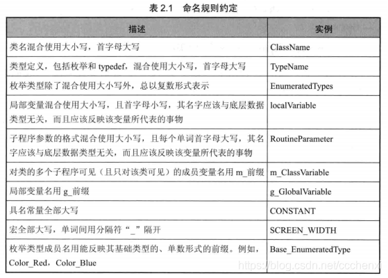
2.匈牙利命名法：变量名=属性+类型+对象描述
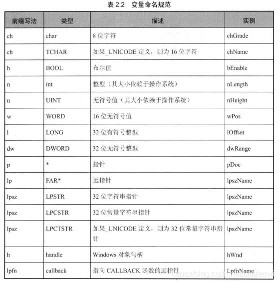
3.关键字字母组合
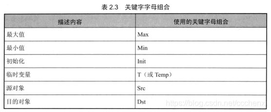

2.5 argc 与 argv 参数
1.argc和agrv两个参数

一般在用命令行编译程序时有用，带形参的main函数，如main(int argc,char *argv[ ],char **env) 是UNIX、Linux、Mac OS操作系统中C/C++的main函数的标准写法。

arg（arguments）：参数
agrc（argument counter）：整数，用来统计运行程序时送给main函数的命令行参数的个数
argv（argument vertor）：*argv[ ],字符串数组，用来存放指向字符串参数的指针数组，每一个元素指向一个参数。各成员含义：
argv[0]指向程序运行的全路径名
argv[1]指向在DOS命令行中执行程序名后的第一个字符串
argv[argc]为NULL

2.Visual Studio中main函数的几种写法

（1）返回值为整型带参 ,函数体内可以使用或不使用argc和argv

int main(int argc,char** argv){…}

（2）返回值为整型不带参,函数体内使用argc或argv,需要在【项目属性】->【配置属性】->【调试】->【命令参数】中指定参数值”1.jpg”，否则会报错

int main(int argc,char** argv){ Mat srcImage=imread(argv[1],1); … }

（3）返回值为void且不带参

int main(){…}

---

## 第三章 HighGUI图像用户界面初步
## 实验部分
### 1.利用imwrite生成透明png图像
```
#include <vector>
#include <stdio.h>
#include<opencv2/opencv.hpp>
using namespace cv;
using namespace std;


//--------------------------------【createAlphaMat( )函数】--------------------------------
//		描述：创建带alpha通道的Mat
//-------------------------------------------------------------------------------------------------
void createAlphaMat(Mat& mat)
{
	for (int i = 0; i < mat.rows; ++i) {
		for (int j = 0; j < mat.cols; ++j) {
			Vec4b& rgba = mat.at<Vec4b>(i, j);
			rgba[0] = UCHAR_MAX;
			rgba[1] = saturate_cast<uchar>((float(mat.cols - j)) / ((float)mat.cols) * UCHAR_MAX);
			rgba[2] = saturate_cast<uchar>((float(mat.rows - i)) / ((float)mat.rows) * UCHAR_MAX);
			rgba[3] = saturate_cast<uchar>(0.5 * (rgba[1] + rgba[2]));
		}
	}
}


//-----------------------------------【ShowHelpText( )函数】----------------------------------
//          描述：输出一些帮助信息
//----------------------------------------------------------------------------------------------
void ShowHelpText()
{
	//输出欢迎信息和OpenCV版本
	printf("\n\n\t\t\t非常感谢购买《OpenCV3编程入门》一书！\n");
	printf("\n\n\t\t\t此为本书OpenCV3版的第15个配套示例程序\n");
	printf("\n\n\t\t\t   当前使用的OpenCV版本为：" CV_VERSION);
	printf("\n\n  ----------------------------------------------------------------------------\n");
}


int main()
{
	//创建带alpha通道的Mat
	Mat mat(480, 640, CV_8UC4);
	createAlphaMat(mat);

	ShowHelpText();

	vector<int>compression_params;
	//此句代码的OpenCV2版为：
	//compression_params.push_back(CV_IMWRITE_PNG_COMPRESSION);
	//此句代码的OpenCV3版为：
	compression_params.push_back(IMWRITE_PNG_COMPRESSION);
	compression_params.push_back(9);

	//显示图片
	try {
		imwrite("透明Alpha值图.png", mat, compression_params);
		imshow("生成的png图", mat);
		fprintf(stdout, "PNG图片文件的alpha数据保存完毕~\n可以在工程目录下查看由imwrite函数生成的图片\n");
		waitKey(0);
	}
	catch (runtime_error& ex) {
		fprintf(stderr, "图像转换成PNG格式发生错误：%s\n", ex.what());
		return 1;
	}

	return 0;
}
```


---
### 2.为程序界面添加滑动条

```


#include <opencv2/opencv.hpp>
#include <opencv2/highgui/highgui.hpp>
using namespace cv;

//-----------------------------------【宏定义部分】-------------------------------------------- 
//  描述：定义一些辅助宏 
//------------------------------------------------------------------------------------------------ 
#define WINDOW_NAME "【滑动条的创建&线性混合示例】"        //为窗口标题定义的宏 


//-----------------------------------【全局变量声明部分】--------------------------------------
//		描述：全局变量声明
//-----------------------------------------------------------------------------------------------
const int g_nMaxAlphaValue = 100;//Alpha值的最大值
int g_nAlphaValueSlider;//滑动条对应的变量
double g_dAlphaValue;
double g_dBetaValue;

//声明存储图像的变量
Mat g_srcImage1;
Mat g_srcImage2;
Mat g_dstImage;


//-----------------------------------【on_Trackbar( )函数】--------------------------------
//		描述：响应滑动条的回调函数
//------------------------------------------------------------------------------------------
void on_Trackbar( int, void* )
{
	//求出当前alpha值相对于最大值的比例
	g_dAlphaValue = (double) g_nAlphaValueSlider/g_nMaxAlphaValue ;
	//则beta值为1减去alpha值
	g_dBetaValue = ( 1.0 - g_dAlphaValue );

	//根据alpha和beta值进行线性混合
	addWeighted( g_srcImage1, g_dAlphaValue, g_srcImage2, g_dBetaValue, 0.0, g_dstImage);

	//显示效果图
	imshow( WINDOW_NAME, g_dstImage );
}


//-----------------------------【ShowHelpText( )函数】--------------------------------------
//		描述：输出帮助信息
//-------------------------------------------------------------------------------------------------
//-----------------------------------【ShowHelpText( )函数】----------------------------------
//		描述：输出一些帮助信息
//----------------------------------------------------------------------------------------------
void ShowHelpText()
{
	//输出欢迎信息和OpenCV版本
	printf("\n\n\t\t\t非常感谢购买《OpenCV3编程入门》一书！\n");
	printf("\n\n\t\t\t此为本书OpenCV3版的第17个配套示例程序\n");
	printf("\n\n\t\t\t   当前使用的OpenCV版本为：" CV_VERSION );
	printf("\n\n  ----------------------------------------------------------------------------\n");
}


//--------------------------------------【main( )函数】-----------------------------------------
//		描述：控制台应用程序的入口函数，我们的程序从这里开始执行
//-----------------------------------------------------------------------------------------------
int main( int argc, char** argv )
{

	//显示帮助信息
	ShowHelpText();

	//加载图像 (两图像的尺寸需相同)
	g_srcImage1 = imread("1.jpg");
	g_srcImage2 = imread("2.jpg");
	if( !g_srcImage1.data ) { printf("读取第一幅图片错误，请确定目录下是否有imread函数指定图片存在~！ \n"); return -1; }
	if( !g_srcImage2.data ) { printf("读取第二幅图片错误，请确定目录下是否有imread函数指定图片存在~！\n"); return -1; }

	//设置滑动条初值为70
	g_nAlphaValueSlider = 70;

	//创建窗体
	namedWindow(WINDOW_NAME, 1);

	//在创建的窗体中创建一个滑动条控件
	char TrackbarName[50];
	sprintf( TrackbarName, "透明值 %d", g_nMaxAlphaValue );

	createTrackbar( TrackbarName, WINDOW_NAME, &g_nAlphaValueSlider, g_nMaxAlphaValue, on_Trackbar );

	//结果在回调函数中显示
	on_Trackbar( g_nAlphaValueSlider, 0 );

	//按任意键退出
	waitKey(0);

	return 0;
}

```
### 3.鼠标操作
```
---------------------------------------------------------
#include <opencv2/opencv.hpp>
using namespace cv;

//-----------------------------------【宏定义部分】--------------------------------------------
//  描述：定义一些辅助宏 
//------------------------------------------------------------------------------------------------ 
#define WINDOW_NAME "【程序窗口】"        //为窗口标题定义的宏 


//-----------------------------------【全局函数声明部分】------------------------------------
//		描述：全局函数的声明
//------------------------------------------------------------------------------------------------
void on_MouseHandle(int event, int x, int y, int flags, void* param);
void DrawRectangle( cv::Mat& img, cv::Rect box );
void ShowHelpText( );

//-----------------------------------【全局变量声明部分】-----------------------------------
//		描述：全局变量的声明
//-----------------------------------------------------------------------------------------------
Rect g_rectangle;
bool g_bDrawingBox = false;//是否进行绘制
RNG g_rng(12345);


//-----------------------------------【main( )函数】--------------------------------------------
//		描述：控制台应用程序的入口函数，我们的程序从这里开始执行
//-------------------------------------------------------------------------------------------------
int main( int argc, char** argv ) 
{
	//【0】改变console字体颜色
	system("color 9F"); 

	//【0】显示欢迎和帮助文字
	ShowHelpText();

	//【1】准备参数
	g_rectangle = Rect(-1,-1,0,0);
	Mat srcImage(600, 800,CV_8UC3), tempImage;
	srcImage.copyTo(tempImage);
	g_rectangle = Rect(-1,-1,0,0);
	srcImage = Scalar::all(0);

	//【2】设置鼠标操作回调函数
	namedWindow( WINDOW_NAME );
	setMouseCallback(WINDOW_NAME,on_MouseHandle,(void*)&srcImage);

	//【3】程序主循环，当进行绘制的标识符为真时，进行绘制
	while(1)
	{
		srcImage.copyTo(tempImage);//拷贝源图到临时变量
		if( g_bDrawingBox ) DrawRectangle( tempImage, g_rectangle );//当进行绘制的标识符为真，则进行绘制
		imshow( WINDOW_NAME, tempImage );
		if( waitKey( 10 ) == 27 ) break;//按下ESC键，程序退出
	}
	return 0;
}


//--------------------------------【on_MouseHandle( )函数】-----------------------------
//		描述：鼠标回调函数，根据不同的鼠标事件进行不同的操作
//-----------------------------------------------------------------------------------------------
void on_MouseHandle(int event, int x, int y, int flags, void* param)
{

	Mat& image = *(cv::Mat*) param;
	switch( event)
	{
		//鼠标移动消息
	case EVENT_MOUSEMOVE: 
		{
			if( g_bDrawingBox )//如果是否进行绘制的标识符为真，则记录下长和宽到RECT型变量中
			{
				g_rectangle.width = x-g_rectangle.x;
				g_rectangle.height = y-g_rectangle.y;
			}
		}
		break;

		//左键按下消息
	case EVENT_LBUTTONDOWN: 
		{
			g_bDrawingBox = true;
			g_rectangle =Rect( x, y, 0, 0 );//记录起始点
		}
		break;

		//左键抬起消息
	case EVENT_LBUTTONUP: 
		{
			g_bDrawingBox = false;//置标识符为false
			//对宽和高小于0的处理
			if( g_rectangle.width < 0 )
			{
				g_rectangle.x += g_rectangle.width;
				g_rectangle.width *= -1;
			}

			if( g_rectangle.height < 0 ) 
			{
				g_rectangle.y += g_rectangle.height;
				g_rectangle.height *= -1;
			}
			//调用函数进行绘制
			DrawRectangle( image, g_rectangle );
		}
		break;

	}
}


//-----------------------------------【DrawRectangle( )函数】------------------------------
//		描述：自定义的矩形绘制函数
//-----------------------------------------------------------------------------------------------
void DrawRectangle( cv::Mat& img, cv::Rect box )
{
	cv::rectangle(img,box.tl(),box.br(),cv::Scalar(g_rng.uniform(0, 255), g_rng.uniform(0,255), g_rng.uniform(0,255)));//随机颜色
}


//-----------------------------------【ShowHelpText( )函数】-----------------------------
//          描述：输出一些帮助信息
//----------------------------------------------------------------------------------------------
void ShowHelpText()
{
	//输出欢迎信息和OpenCV版本
	printf("\n\n\t\t\t非常感谢购买《OpenCV3编程入门》一书！\n");
	printf("\n\n\t\t\t此为本书OpenCV3版的第18个配套示例程序\n");
	printf("\n\n\t\t\t   当前使用的OpenCV版本为：" CV_VERSION );
	printf("\n\n  ----------------------------------------------------------------------------\n");
	//输出一些帮助信息
	printf("\n\n\n\t欢迎来到【鼠标交互演示】示例程序\n"); 
	printf("\n\n\t请在窗口中点击鼠标左键并拖动以绘制矩形\n");

}

```


## 笔记部分
1.OpenCV中的C++类和函数都是定义在命名空间cv之内的，所以在代码开头  的位置加上using namespacecv; 这句代码。

2.Mat类是用于保存图像以及其他矩阵数据的数据结构，默认尺寸为0

3 . 图像的载入：Matimread(const string& filename, int flags=1)；第一个参数conststring& filename指的是载入图片的路径名；第二个参数int flags是载入标识符，指定一个夹在图像的类型，默认为1，flags>0返回3通道彩色图像，flags=0返回灰度图像，flags<0返回Alpha通道的加载图像。

4.图像的显示：imshow(conststring& winname, InputArray mat);第一个参数指的是要显示窗口标识名称；第二个参数填要显示的图像。

5 . 创建窗口namedWindow

namedWindow(cosnt string& winname, int flags=WINDOW_AUTOSIZE);

第一个参数填写被用作窗口标识符的窗口名称；第二个参数窗口的标识，可以填如下几种值：WINDOW_NORMAL用户可以改变窗口的大小，WINDOW_AUTOSIZE设置这个值（为默认值），窗口大小会自动调整以适应所显示的图像，且用户没法手动改变窗口大小。

6 . 输出图像到文件imwrite()函数

imwrite(cosntstring& filename, InputArray img, const vector<int>&parms=vecror<int>() );
第一个参数，填需要的写入的文件名，要带上后缀，如“123.jpg”;第二个参数，一般填一个Mat类型的图像数据；第三个参数，表示特定格式保存的参数编码，默认值vecror<int>()

7.创建滑动条：creatTrackbar()函数

creatTrackbar( conststring& trackbarname, conststring& winname, int* value, intcount, TrackbarCallback onChange=0, void* userdata=0)

第一个参数，trackbarname,轨迹条的名字；

第二个参数，winname,窗口的名字，表示轨迹条依附到的窗口；

第三个参数，value,指向整形的指针，表示滑块的位置，创建时滑块的初始位置就是该变量当前的值；

第四个参数，count,表示滑块可以达到的最大位置的值；

第五个参数，onChange,指向回调函数的指针，滑块位置改变，这个函数都进行回调，且这个函数的原型必须为voidXXXX(int, void*)，第一个参数是轨迹条的位置，第二个参数是用户数据。若回调是NULL指针，则表示没有回调函数的作用，仅第三个参数value有变化；

第六个参数，userdata，默认值0。

