# opencv的下载安装与配置
## 1.去Visual Studio的官网下载Visual Studio 2019 
https://visualstudio.microsoft.com/zh-hans/vs/

 ### 1.1 安装vs2019
 双击下载程序，会显示这个界面，单击“继续”，等待安装程序完成安装。
 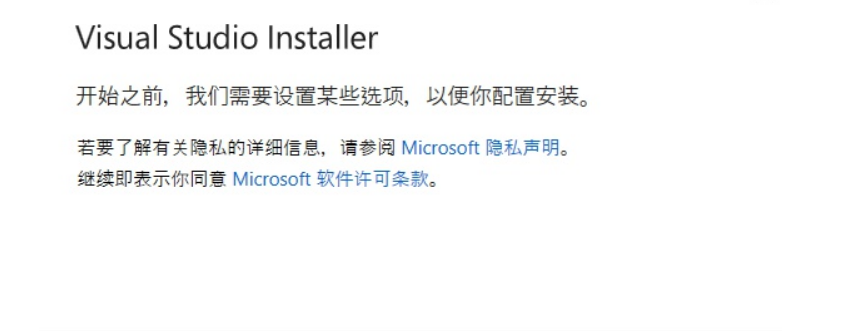
 
 ### 1.2选择工作负载
 勾选使用C++的桌面开发和Visual Studio扩展开发
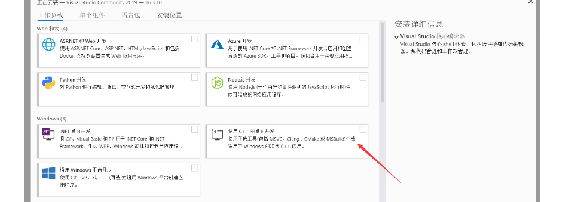
### 1.3 选择语言包（默认中文简体，无特殊需要可以不更改）。
### 1.4 选择安装位置（默认C盘），更改安装位置后，单击右下角安装。
### 1.5 等待安装完成
 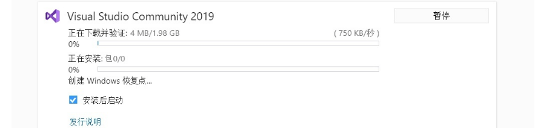
 ## 2.下载安装，配置opencv
一、1.下载安装OpenCV4.5.0
2.双击安装包进行安装
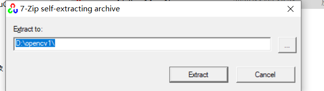
安装完打开文件夹是这样的
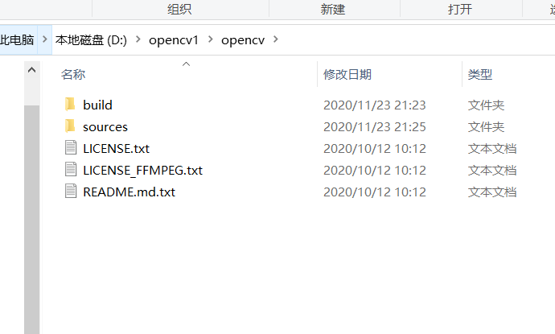

二、配置环境变量

把OpenCV文件夹放好地方后，依次选择计算机—>属性—>高级系统设置—>系统变量，找到Path变量，选中并点击编辑，然后新建把你的OpenCV执行文件的路径填进去，然后一路点确定，这样环境变量就配置完了。重启电脑完成环境变量配置！！！
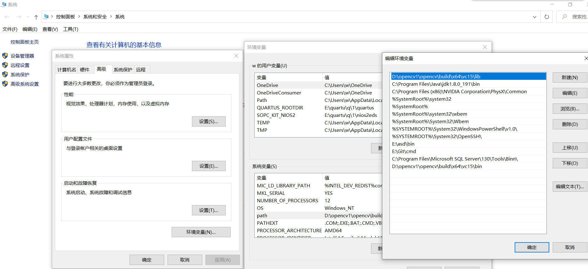

三、配置VS2019

1、新建空项目

2、添加包含目录和库目录
（1）打开属性表

（2）VC++目录—>包含目录—>库目录
包含目录中添加：

D:\OpenCV4.5\opencv\build\include
D:\OpenCV4.5\opencv\build\include\opencv2

库目录中添加：

D:\OpenCV4.5\opencv\build\x64\vc15\lib
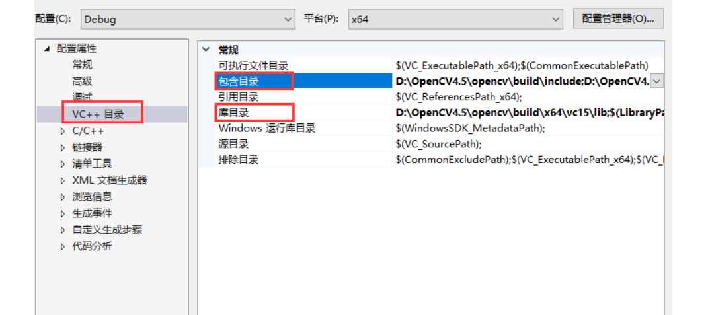
3、添加附加依赖项
依次选择项目—>属性—>链接器—>输入—>附加依赖项—>编辑
附加依赖项中添加（库文件名）：

opencv_world450d.lib

### 图像显示
1.测试代码

#include <iostream>  
#include <opencv2/highgui/highgui.hpp>  

using namespace cv;

int main()
{
	// 读入一张图片（游戏原画）  

	Mat img = imread("qq.png");
	// 创建一个名为 唯美原画"窗口  
	namedWindow("唯美原画");
	// 在窗口中显示唯美原画  
	imshow("唯美原画", img);
	waitKey();//若无此语句，则不能正常显示图像
	return 0;

}

2.测试结果

### 图像腐蚀
1.代码

#include <opencv2/opencv.hpp>

using namespace std;
using namespace cv;//包含cv命名空间
int main()
{

    Mat src_img = imread("qq.png");//imread()函数载入图像
    //从文件中读入图像，注意图像路径最好不要用相对路径，因为CLion生成的exe不在当前目录下。
    if (src_img.empty())
    {
        fprintf(stderr, "Can not load image\n");//如果读入图像失败，返回错误信息
        return -1;
    }
    //显示图像
    imshow("origin image and erode operation", src_img);//imshow()函数显示图像
    Mat ele = getStructuringElement(MORPH_RECT, Size(15, 15));//getStructuringElement返回值定义内核矩阵
    Mat des_img;
    erode(src_img, des_img, ele);//erode函数直接进行腐蚀操作
    imshow("after erode operation", des_img);
    waitKey();//此函数等待按键，按键盘任意键就返回
    return 0;
}

2.测试结果

### 图像模糊
1.代码

#include "opencv2/highgui/highgui.hpp" 
#include "opencv2/imgproc/imgproc.hpp" 
using namespace cv;

int main()
{
    
    Mat srcImage = imread("qq.png");
    imshow("均值滤波【原图】", srcImage);
    Mat dstImage;
    blur(srcImage, dstImage, Size(7, 7));
    imshow("均值滤波【效果图】", dstImage);
    waitKey(0);
}

2.测试结果

### canny边缘检测
1.代码

#include <opencv2/opencv.hpp>
#include <opencv2/highgui/highgui.hpp>
#include <opencv2/imgproc/imgproc.hpp>

using namespace cv;

//main()函数
//应用程序入口
int main()
{
    Mat src = imread("qq.png");
    Mat src1 = src.clone();

    //显示原始图
    imshow("【原始图】Canny边缘检测", src);
    //转化为灰度图，减噪，然后用canny得到的边缘作为掩码，拷贝原图到效果图，得到彩色的边缘图
    Mat dst, edge, gray;

    //创建与src同类型和大小的矩阵
    dst.create(src1.size(), src1.type());

    //将原图像转换为灰度图像
    cvtColor(src1, gray, COLOR_BGR2GRAY);

    //使用3×3内核降噪
    blur(gray, edge, Size(3, 3));

    //使用canny算子
    Canny(edge, edge, 3, 9, 3);

    imshow("【效果图】Canny边缘检测1", edge);
    //将dstImage内所有元素为0
    dst = Scalar::all(0);

    //使用Canny算子输出的边缘图，g_cannyDetectedEdges作为掩码，来将原图g_srcImage拷贝到目标图g_dstImage中
    src1.copyTo(dst, edge);
    imshow("【效果图】Canny边缘检测2", dst);
    waitKey(0);
    return 0;

}

2.测试结果
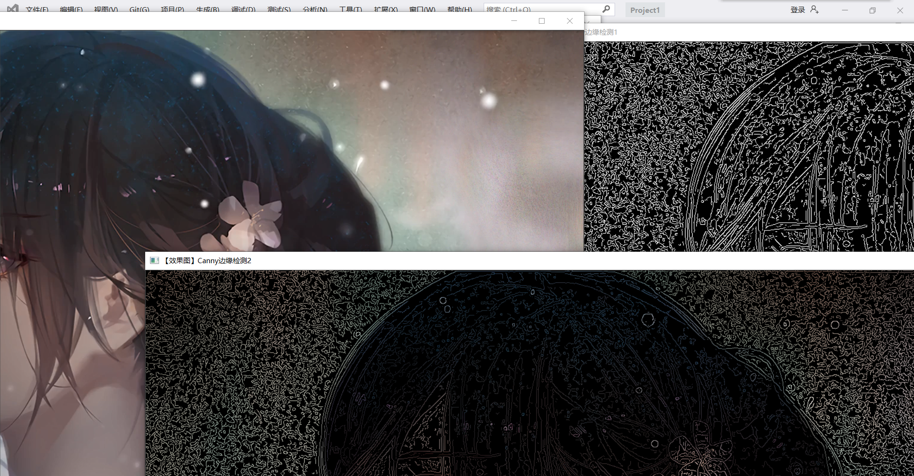

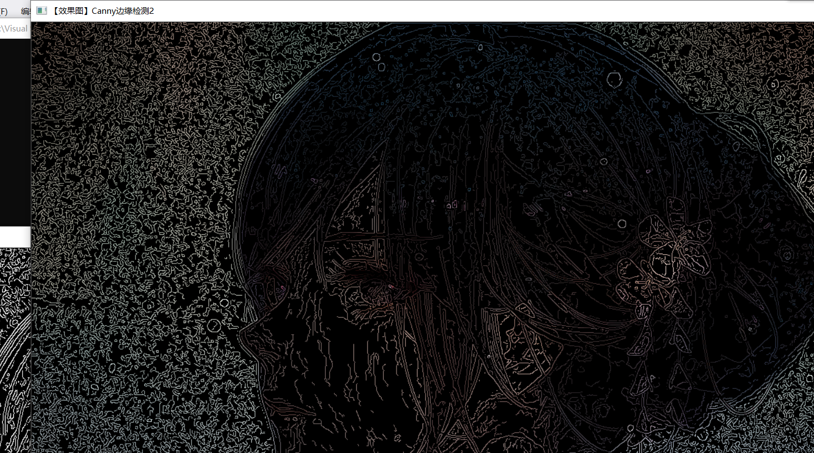
### 读取并播放视频
1.代码

#include <opencv2\opencv.hpp> 

using namespace cv;

int main()
{

	VideoCapture capture("2.avi");
	while (1)
	{
		Mat frame;
		capture >> frame;
		imshow("视频", frame);
		waitKey(30);//若无此语句，则不能正常显示图像
	}
	return 0;

}

2.测试结果
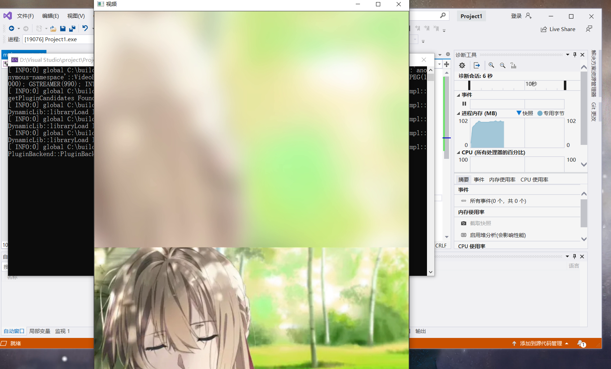
### 调用摄像头采集图像
1.代码

#include <opencv2\opencv.hpp> 

using namespace cv;

int main()
{

	VideoCapture capture(0);
	while (1)
	{
		Mat frame;
		capture >> frame;
		imshow("视频", frame);
		waitKey(30);//若无此语句，则不能正常显示图像
	}
	return 0;

}

2.测试结果

### 视频边缘检测
1.代码

#include<opencv2/opencv.hpp>
#include<iostream>
using namespace cv;
using namespace std;

int main()
{
    //读视频
    VideoCapture capture("2.avi");
    //循环显示每一帧
    int n = 0;
    while (n < 10000000000)
    {
        n++;

        Mat frame;
        //读入每一帧图像
        capture >> frame;

        imshow("原视频", frame);
        //将原视频转换为灰度图像
        Mat edge;
        cvtColor(frame, edge, COLOR_BGR2GRAY);//RGB彩图转为灰度图

        //使用3x3内核来降噪（2x3+1 = 7）
        blur(edge, edge, Size(7, 7));//进行模糊降噪

        //进行Canny边缘检测
        Canny(edge, edge, 0, 30, 3);
        imshow("被Canny边缘检测后的视频", edge);//显示处理后的当前帧
        waitKey(30);
        cout << "边缘检测第" << n << "帧画面..." << endl;
    }
    return 0;

}

2.测试结果
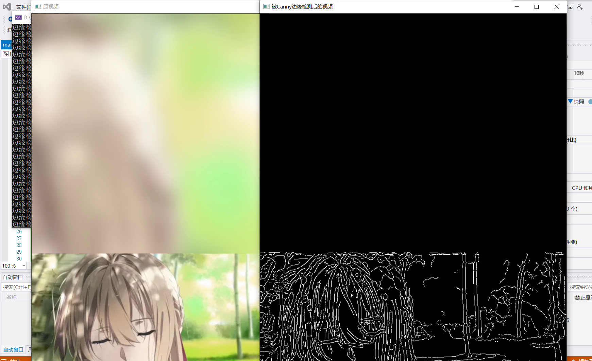
### 图像的载入与显示（原图与logo)
1.代码
#include <opencv2/core/core.hpp>
#include <opencv2/highgui/highgui.hpp>
using namespace cv;

int main()
{
	Mat 1 = imread("1.jpg"); //载入 图像到Mat
	namedWindow("[1]动漫图"); //创建一个名为 ”[1]动漫图"的窗口
	imshow("[1]动漫图",1);//显示名为"[1]动漫图"的窗口

	//载入图片
	Mat image= imread("qq.png"); 
	Mat logo= imread("3.png");
	//载入后先显示
	namedWindow(" [2] 原画图"); imshow(" [2] 原画图", image);
	namedWindow(" [3] logo 图"); imshow("[3] logo 图", logo);

	//定义一个Mat类型，用于存放，图像的ROI
	Mat imageROI;
	//方法一
	imageROI = image(Rect(800, 350, logo.cols, logo.rows)); 
	//方法二
	// imageROI =
image(Range(350, 350 + logo.rows), Range(800, 800 + logo.cols));

	// 将logo加到原图上
    addWeighted(imageROI, 0.5, logo, 0.3, 0., imageROI);

	//显示结果
	namedWindow(" [4] 原画+logo 图"); imshow("[4] 原画+logo 图", image);

	//输出一张jpg图片到工程目录下
	imwrite("由imwrite生成的图片.jpg", image);

	waitKey(); 
	
	return 0;
}

2.测试结果

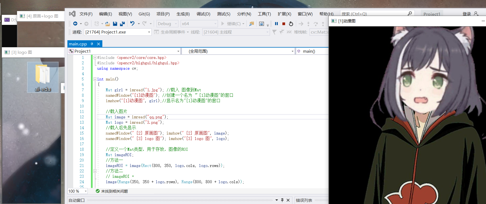
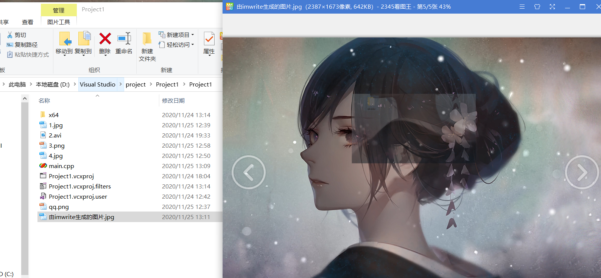
### 生成透明图片
1.代码

#include <vector>
#include <stdio.h>
#include<opencv2/opencv.hpp>
using namespace cv;
using namespace std;

//--------------------------------【createAlphaMat( )函数】--------------------------------
// 描述：创建带alpha通道的Mat
//-------------------------------------------------------------------------------------------------
void createAlphaMat(Mat& mat)
{
	for (int i = 0; i < mat.rows; ++i) {
		for (int j = 0; j < mat.cols; ++j) {
			Vec4b& rgba = mat.at<Vec4b>(i, j);
			rgba[0] = UCHAR_MAX;
			rgba[1] = saturate_cast<uchar>((float(mat.cols - j)) / ((float)mat.cols) * UCHAR_MAX);
			rgba[2] = saturate_cast<uchar>((float(mat.rows - i)) / ((float)mat.rows) * UCHAR_MAX);
			rgba[3] = saturate_cast<uchar>(0.5 * (rgba[1] + rgba[2]));
		}
	}
}

//-----------------------------------【ShowHelpText( )函数】----------------------------------
//          描述：输出一些帮助信息
//----------------------------------------------------------------------------------------------
void ShowHelpText()
{
	//输出欢迎信息和OpenCV版本
	printf("\n\n\t\t\t非常感谢购买《OpenCV3编程入门》一书！\n");
	printf("\n\n\t\t\t此为本书OpenCV3版的第15个配套示例程序\n");
	printf("\n\n\t\t\t   当前使用的OpenCV版本为：" CV_VERSION);
	printf("\n\n  ----------------------------------------------------------------------------\n");
}

int main()
{
	//创建带alpha通道的Mat
	Mat mat(480, 640, CV_8UC4);
	createAlphaMat(mat);

	ShowHelpText();

	vector<int>compression_params;
	//此句代码的OpenCV2版为：
	//compression_params.push_back(CV_IMWRITE_PNG_COMPRESSION);
	//此句代码的OpenCV3版为：
	compression_params.push_back(IMWRITE_PNG_COMPRESSION);
	compression_params.push_back(9);

	//显示图片
	try {
		imwrite("透明Alpha值图.png", mat, compression_params);
		imshow("生成的png图", mat);
		fprintf(stdout, "PNG图片文件的alpha数据保存完毕~\n可以在工程目录下查看由imwrite函数生成的图片\n");
		waitKey(0);
	}
	catch (runtime_error& ex) {
		fprintf(stderr, "图像转换成PNG格式发生错误：%s\n", ex.what());
		return 1;
	}

	return 0;
}

2.测试结果

### 滑动条的创建与使用
1.代码
#include <opencv2/opencv.hpp>
#include "opencv2/highgui/highgui.hpp"
using namespace cv;

#define WINDOW_NAME “【混合示例】”

const int g_nMaxAlphaValue = 100; //AIpha 值的最大值
int g_nAlphaValueSlider;//滑动条对应的变量
double g_dAlphaValue;
double g_dBetaValue;

//声明存储图像的变量
Mat g_srcImage1;
Mat g_srcImage2;
Mat g_dstImage;

void on_Trackbar(int, void*)
{
	//求出当前alpha值相对于最大值的比例
	g_dAlphaValue = (double) g_nAlphaValueSlider/g_nMaxAlphaValue ;
	//则beta值为1减去alpha值
	g_dBetaValue = (1.0 - g_dAlphaValue);

	//根据alpha和beta值进行线性混合
	addWeighted(g_srcImage1, g_dAlphaValue, g_srcImage2, g_dBetaValue, 0.0, g_dstImage);

	//显示效果图
	imshow( WINDOW_NAME, g_dstImage );
}

int main(int argc, char** argv)
{
	//加载图像(两图像的尺寸需相同)
	g_srcImage1 = imread("1.jpg");
	g_srcImage2 = imread("qq.png");
	if (!g_srcImage1.data) {
		printf("读取第一幅图片错误，请确定目录下是否有imread函数指定图片存在~! \n");
		return -1;
	}
	if (!g_srcImage2.data) {
		printf("读取第二幅图片错误，请确定目录下是否有imread函数指定图片存在~! \n");
		return -1;
	}

	//设置滑动条初值为70
	g_nAlphaValueSlider = 70;

	//创建窗体
	namedWindow(WINDOW_NAME, 1);

	//在创建的窗体中创建一个滑动条控件
	char TrackbarName[50];
	sprintf(TrackbarName, "透明值 &d", g_nMaxAlphaValue);

	createTrackbar(TrackbarName, WINDOW_NAME, &g_nAlphaValueSlider, g_nMaxAlphaValue, on_Trackbar );

	//结果在回调函数中显示
	on_Trackbar(g_nAlphaValueSlider, 0);

	//按任意键退出
	waitKey(0);

	return 0;
}

2.测试结果

### 鼠标操作
1.代码

#include <opencv2/opencv.hpp>
using namespace cv;
#define WINDOW_NAME "[ 程序窗口 ] " //为窗口标题定义的宏

void on_MouseHandle(int event, int x, int y, int flags, void* param);
void DrawRectangle(cv::Mat& img, cv::Rect box);
void ShowHelpText();

Rect g_rectangle;
bool g_bDrawingBox = false;//是否进行绘制
RNG g_rng(12345);

int main(int argc, char** argv)
{
	// [1]准备参数
	g_rectangle = Rect(-1, -1, 0, 0);
	Mat srcImage(600, 800, CV_8UC3), tempImage;
	srcImage.copyTo(tempImage);
	g_rectangle = Rect(-1, -1, 0, 0);
	srcImage = Scalar::all(0);

	// [2]设置鼠标操作回调函数
	namedWindow(WINDOW_NAME);
	setMouseCallback(WINDOW_NAME, on_MouseHandle, (void*)&srcImage);

	// [3]程序主循环，当进行绘制的标识符为真时，进行绘制
	while (1)
	{
		srcImage.copyTo(tempImage);//复制源图到临时变量
		if (g_bDrawingBox) DrawRectangle(tempImage, g_rectangle);//当进行绘制的标识符为真，则进行绘制
		imshow(WINDOW_NAME, tempImage);
		if (waitKey(10) == 27) break;//按下 ESC键，程序退出
	}
	return 0;
}

void on_MouseHandle(int event, int x, int y, int flags, void* param)
{
	Mat&image = *(cv::Mat*) param; 
	switch ( event) 
	{
		//鼠标移动消息.
		case EVENT_MOUSEMOVE :
		{
			if (g_bDrawingBox) //如果是否进行绘制的标识符为真，则记录下长和宽到RECT型变量中
			{
				g_rectangle.width = x-g_rectangle.x;
				g_rectangle.height = y - g_rectangle.y;
			}
		}
		break;

		//左键按下消息
		case EVENT_LBUTTONDOWN :
		{
			g_bDrawingBox = true;
			g_rectangle = Rect(x, y, 0, 0);//记录起始点
		}
			break;

		//左键拾起消息
		case EVENT_LBUTTONUP:
		{
			g_bDrawingBox = false;//置标识符为 false
			//对宽和高小于0的处理
			if (g_rectangle.width < 0)
			{
				g_rectangle.x += g_rectangle.width;
				g_rectangle.width *= -1;
			}

			if (g_rectangle.height < 0)
			{
				g_rectangle.y += g_rectangle.height;
				g_rectangle.height *= -1;
			}
			//调用函数进行绘制
			DrawRectangle(image, g_rectangle);
		}
		break;
	}
}

void DrawRectangle(cv::Mat& img, cv::Rect box)
{
	rectangle(img, box.tl(), box.br(), Scalar(g_rng.uniform(0, 255), g_rng.uniform(0, 255), g_rng.uniform(0, 255)));//随机颜色
}

2.测试结果

