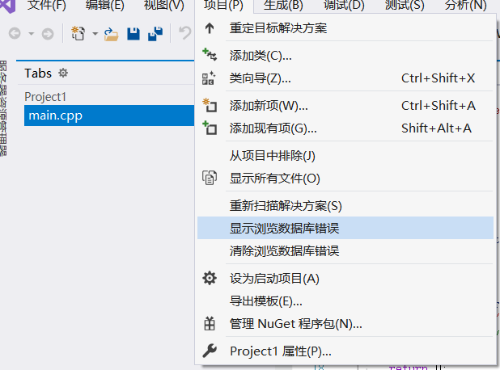

## 软件安装
# 一、官网下载下载网址：https://visualstudio.microsoft.com/zh-hans/
# 二、选择安装1.点击刚刚下载的程序包，选择继续。进入等待安装界面

2.程序安装完毕会进入这个页面

3.工作负载

4.单个组件、语言包没有做选择。安装位置可以按照默认位置也可以更改。

5.接下来就是漫长的下载与安装。

# 三、激活产品
下载完毕，重启电脑，启动VS2019

# 四、OpenCv的下载安装
首先，给出OpenCv的官方下载地址：OpenCv下载。
下载完成后，得到一个大约300M左右的exe文件：

双击进行开始安装，输入安装位置，单击Extract按钮：

安装过程实质上就是一个解压缩的过程：

安装完成后存在两个目录：build和source。Build目录下主要存放了相关的库文件，也就是OpenCv的主体部分。Source目录下主要存放了一些帮助文档和官方提供的资源：

# 五、配置路径
1、配置VS路径　　单击“项目—＞属性”，打开属性对话框：

在“配置属性—＞VC++目录”节点下，单击“包含目录”右侧的下来按钮，选择OpenCv目录下的include文件夹路径：
F:\opencv\build\include
同理，在“库目录”中添加lib文件夹路径：F:\opencv\build\x64\vc15\lib

接下来在“配置属性—＞链接器—＞输入”节点下，在“附加依赖项”窗口中输入以下OpenCV库文件名称：
opencv_world420d.lib 

2、配置环境变量
　　Windows系统的环境变量几乎是所有编程软件必须折腾的地方，因为编译器在启动时都会通过环境变量来自动读取搜索路径。这里需要将OpenCv的bin（可执行文件）目录的路径“”添加到环境变量中：

3.单击工具栏“win32”对应的下拉菜单，选择配置管理器，在弹出的窗口中单击“Win32”下拉按钮，选择“新建”，新建平台选择X64，单击确定，关闭设置对话框，此时我们已经创建了一个64位的Debug调试器，接下来在调试器栏选择这个64位调试器即可：

## 实验
# 实验一 图像显示
代码：
#include <iostream> 

#include <opencv2/core/core.hpp> 

#include <opencv2/highgui/highgui.hpp>  

using namespace cv;

int main()
{
	// 读入一张图片（游戏原画）  

	Mat img = imread("1.jpg");

    // 创建一个名为 唯美原画"窗口  
	namedWindow("唯美原画");

	// 在窗口中显示唯美原画  
	imshow("唯美原画", img);
	waitKey(0);//若无此语句，则不能正常显示图像
	return 0;
}
结果：

# 实验二 播放视频
代码：
#include <opencv2\opencv.hpp> 

using namespace cv;

int main()
{
	VideoCapture capture("2.avi");

	while (1)

	{
		Mat frame;

		capture >> frame;

		imshow("视频", frame);

		waitKey(30);//若无此语句，则不能正常显示图像
	}
	return 0;
}

结果：

# 实验三 调用摄像头
代码：
#include <opencv2\opencv.hpp> 

using namespace cv;

int main()

{
	VideoCapture capture(0);

	while (1)

	{
		Mat frame;
		capture >> frame;
		imshow("视频", frame);
		waitKey(30);//若无此语句，则不能正常显示图像
	}
	return 0;
}
结果：

# 实验四 图像腐蚀
代码：
//图像腐蚀
#include <opencv2/highgui/highgui.hpp>
#include <opencv2/imgproc/imgproc.hpp>
using namespace cv;

int main()
{
	//载入原图
	Mat srcImage = imread("1.jpg");
	//显示原图
	imshow("【原图】腐蚀操作", srcImage);
	//进行腐蚀操作
	Mat element = getStructuringElement(MORPH_RECT, Size(15, 15));
	Mat dstImage;
	erode(srcImage, dstImage, element);
	//显示效果图
	imshow("【效果图】腐蚀操作", dstImage);
	waitKey(0);

	return 0;
}
结果：

# 实验五 图像模糊
代码：
//图像模糊
#include "opencv2/highgui/highgui.hpp"
#include "opencv2/imgproc/imgproc.hpp"
using namespace cv;

int main()
{
	// [1]载入原始图
	Mat srcImage = imread("1.jpg");

	// [2]显示原始图
	imshow("均值滤波[原图] ", srcImage);

	// [3]进行均值滤波操作
	Mat dstImage;
	blur( srcImage, dstImage, Size(7, 7));

	// [4]显示效果图
	imshow( "均值滤波[效果图]",dstImage );

	waitKey(0);
}
结果：

# 实验六 图像canny边缘测试
代码：
#include <opencv2/opencv.hpp>
#include <opencv2/highgui/highgui.hpp>
#include <opencv2/imgproc/imgproc.hpp>

using namespace cv;

//main()函数
//应用程序入口
int main()
{
    Mat src = imread("1.jpg");
    Mat src1 = src.clone();

    //显示原始图
    imshow("【原始图】Canny边缘检测", src);
    //转化为灰度图，减噪，然后用canny得到的边缘作为掩码，拷贝原图到效果图，得到彩色的边缘图
    Mat dst, edge, gray;

    //创建与src同类型和大小的矩阵
    dst.create(src1.size(), src1.type());

    //将原图像转换为灰度图像
    cvtColor(src1, gray, COLOR_BGR2GRAY);

    //使用3×3内核降噪
    blur(gray, edge, Size(3, 3));

    //使用canny算子
    Canny(edge, edge, 3, 9, 3);

    imshow("【效果图】Canny边缘检测1", edge);
    //将dstImage内所有元素为0
    dst = Scalar::all(0);

    //使用Canny算子输出的边缘图，g_cannyDetectedEdges作为掩码，来将原图g_srcImage拷贝到目标图g_dstImage中
    src1.copyTo(dst, edge);
    imshow("【效果图】Canny边缘检测2", dst);
    waitKey(0);
    return 0;

}
结果：

# 实验七 视频canny边缘测试
代码：
#include<opencv2/opencv.hpp>
#include<iostream>
using namespace cv;
using namespace std;

int main()
{
    //读视频
    VideoCapture capture("2.avi");
    //循环显示每一帧
    int n = 0;
    while (n < 10000000000)
    {
        n++;

        Mat frame;
        //读入每一帧图像
        capture >> frame;

        imshow("原视频", frame);
        //将原视频转换为灰度图像
        Mat edge;
        cvtColor(frame, edge, COLOR_BGR2GRAY);//RGB彩图转为灰度图

        //使用3x3内核来降噪（2x3+1 = 7）
        blur(edge, edge, Size(7, 7));//进行模糊降噪

        //进行Canny边缘检测
        Canny(edge, edge, 0, 30, 3);
        imshow("被Canny边缘检测后的视频", edge);//显示处理后的当前帧
        waitKey(30);
        cout << "边缘检测第" << n << "帧画面..." << endl;
    }
    return 0;

}
结果：

# 实验八 生成png透明图
代码：
#include <vector>
#include <stdio.h>
#include<opencv2/opencv.hpp>
using namespace cv;
using namespace std;

//--------------------------------【createAlphaMat( )函数】--------------------------------
// 描述：创建带alpha通道的Mat
//-------------------------------------------------------------------------------------------------
void createAlphaMat(Mat& mat)
{
	for (int i = 0; i < mat.rows; ++i) {
		for (int j = 0; j < mat.cols; ++j) {
			Vec4b& rgba = mat.at<Vec4b>(i, j);
			rgba[0] = UCHAR_MAX;
			rgba[1] = saturate_cast<uchar>((float(mat.cols - j)) / ((float)mat.cols) * UCHAR_MAX);
			rgba[2] = saturate_cast<uchar>((float(mat.rows - i)) / ((float)mat.rows) * UCHAR_MAX);
			rgba[3] = saturate_cast<uchar>(0.5 * (rgba[1] + rgba[2]));
		}
	}
}

//-----------------------------------【ShowHelpText( )函数】----------------------------------
//          描述：输出一些帮助信息
//----------------------------------------------------------------------------------------------
void ShowHelpText()
{
	//输出欢迎信息和OpenCV版本
	printf("\n\n\t\t\t非常感谢购买《OpenCV3编程入门》一书！\n");
	printf("\n\n\t\t\t此为本书OpenCV3版的第15个配套示例程序\n");
	printf("\n\n\t\t\t   当前使用的OpenCV版本为：" CV_VERSION);
	printf("\n\n  ----------------------------------------------------------------------------\n");
}

int main()
{
	//创建带alpha通道的Mat
	Mat mat(480, 640, CV_8UC4);
	createAlphaMat(mat);

	ShowHelpText();

	vector<int>compression_params;
	//此句代码的OpenCV2版为：
	//compression_params.push_back(CV_IMWRITE_PNG_COMPRESSION);
	//此句代码的OpenCV3版为：
	compression_params.push_back(IMWRITE_PNG_COMPRESSION);
	compression_params.push_back(9);

	//显示图片
	try {
		imwrite("透明Alpha值图.png", mat, compression_params);
		imshow("生成的png图", mat);
		fprintf(stdout, "PNG图片文件的alpha数据保存完毕~\n可以在工程目录下查看由imwrite函数生成的图片\n");
		waitKey(0);
	}
	catch (runtime_error& ex) {
		fprintf(stderr, "图像转换成PNG格式发生错误：%s\n", ex.what());
		return 1;
	}

	return 0;
}
结果：

# 实验九 图像的载入，显示与输出
代码：//图像混合
#include <opencv2/core/core.hpp>
#include <opencv2/highgui/highgui.hpp>
using namespace cv;

int main()
{
	Mat girl = imread("1.jpg"); //载入 图像到Mat
	namedWindow("[1]动漫图"); //创建一个名为 ”[1]动漫图"的窗口
	imshow("[1]动漫图", girl);//显示名为"[1]动漫图"的窗口

	//载入图片
	Mat image = imread("2.jpg");
	Mat logo = imread("3.png");
	//载入后先显示
	namedWindow(" [2] 原画图"); imshow(" [2] 原画图", image);
	namedWindow(" [3] logo 图"); imshow("[3] logo 图", logo);

	//定义一个Mat类型，用于存放，图像的ROI
	Mat imageROI;
	//方法一
	imageROI = image(Rect(800, 350, logo.cols, logo.rows));
	//方法二
	// imageROI =
	image(Range(350, 350 + logo.rows), Range(800, 800 + logo.cols));

	// 将logo加到原图上
	addWeighted(imageROI, 0.5, logo, 0.3, 0., imageROI);

	//显示结果
	namedWindow(" [4] 原画+logo 图"); imshow("[4] 原画+logo 图", image);

	//输出一张jpg图片到工程目录下
	imwrite("由imwrite生成的图片.jpg", image);

	waitKey();

	return 0;
}

结果：

# 实验十 为程序界面添加滑动条
代码：
#include <opencv2/opencv.hpp>
#include <opencv2/highgui/highgui.hpp>
using namespace cv;
#define WINDOW_NAME "【线性混合实例】"
//-------------------------【全局变量声明部分】-----------------------
//     描述：全局变量声明
//-----------------------------------------------------------------
const int g_nMaxAlphaValue = 100; // Alpha值的最大值
int g_nAlphaValueSlider;                 // 滑动条对应的变量
double g_dAlphaValue;
double g_dBetaValue;
//存储图像的变量
Mat g_srcImage1;
Mat g_srcImage2;
Mat g_dstImage;
//----------------------------------【on_Trackbar()函数】-----------------------------
//     描述：响应滑动条的回调函数
//-----------------------------------------------------------------------------------
void on_Trackbar(int, void*)
{
	//求出当前alpha值相对于最大值的比例
	g_dAlphaValue = (double)g_nAlphaValueSlider / g_nMaxAlphaValue;
	//则beta值为1减去alpha值
	g_dBetaValue = (1.0 - g_dAlphaValue);
	//根据alpha和beta的值进行线性混合
	addWeighted(g_srcImage1, g_dAlphaValue, g_srcImage2, g_dBetaValue, 0.0, g_dstImage);
	//显示效果图
	imshow(WINDOW_NAME, g_dstImage);
}
//--------------------------------【main()函数】--------------------
//     描述：控制台应用程序的入口函数
//-----------------------------------------------------------------
int main(int argc, char** argv)
{
	//加载图像 (两图像的尺寸需相同)
	g_srcImage1 = imread("1.jpg");
	g_srcImage2 = imread("2.jpg");
	if (!g_srcImage1.data)
	{
		printf("读取第一幅图片错误，请确定目录下是否由imread函数指定图片存在~！\n");
		return -1;
	}
	if (!g_srcImage2.data)
	{
		printf("读取第一幅图片错误，请确定目录下是否由imread函数指定图片存在~！\n");
		return -1;
	}
	// 设置滑动条的初值为70
	g_nAlphaValueSlider = 70;

	//创建窗体
	namedWindow(WINDOW_NAME, 1);
	//在创建的窗体中创建一个滑动条控件
	char TrackbarName[50];
	sprintf_s(TrackbarName, "透明度 %d", g_nMaxAlphaValue);
	createTrackbar(TrackbarName, WINDOW_NAME, &g_nAlphaValueSlider, g_nMaxAlphaValue, on_Trackbar);
	//结果在回调函数中显示
	on_Trackbar(g_nAlphaValueSlider, 0);
	waitKey(0);
	return 0;
}
结果：

# 实验十一 鼠标操作
代码：
#include <opencv2/opencv.hpp>
using namespace cv;
#define WINDOW_NAME "[ 程序窗口 ] " //为窗口标题定义的宏

void on_MouseHandle(int event, int x, int y, int flags, void* param);
void DrawRectangle(cv::Mat& img, cv::Rect box);
void ShowHelpText();

Rect g_rectangle;
bool g_bDrawingBox = false;//是否进行绘制
RNG g_rng(12345);

int main(int argc, char** argv)
{
	// [1]准备参数
	g_rectangle = Rect(-1, -1, 0, 0);
	Mat srcImage(600, 800, CV_8UC3), tempImage;
	srcImage.copyTo(tempImage);
	g_rectangle = Rect(-1, -1, 0, 0);
	srcImage = Scalar::all(0);

	// [2]设置鼠标操作回调函数
	namedWindow(WINDOW_NAME);
	setMouseCallback(WINDOW_NAME, on_MouseHandle, (void*)&srcImage);

	// [3]程序主循环，当进行绘制的标识符为真时，进行绘制
	while (1)
	{
		srcImage.copyTo(tempImage);//复制源图到临时变量
		if (g_bDrawingBox) DrawRectangle(tempImage, g_rectangle);//当进行绘制的标识符为真，则进行绘制
		imshow(WINDOW_NAME, tempImage);
		if (waitKey(10) == 27) break;//按下 ESC键，程序退出
	}
	return 0;
}

void on_MouseHandle(int event, int x, int y, int flags, void* param)
{
	Mat& image = *(cv::Mat*) param;
	switch (event)
	{
		//鼠标移动消息.
	case EVENT_MOUSEMOVE:
	{
		if (g_bDrawingBox) //如果是否进行绘制的标识符为真，则记录下长和宽到RECT型变量中
		{
			g_rectangle.width = x - g_rectangle.x;
			g_rectangle.height = y - g_rectangle.y;
		}
	}
	break;

	//左键按下消息
	case EVENT_LBUTTONDOWN:
	{
		g_bDrawingBox = true;
		g_rectangle = Rect(x, y, 0, 0);//记录起始点
	}
	break;

	//左键拾起消息
	case EVENT_LBUTTONUP:
	{
		g_bDrawingBox = false;//置标识符为 false
		//对宽和高小于0的处理
		if (g_rectangle.width < 0)
		{
			g_rectangle.x += g_rectangle.width;
			g_rectangle.width *= -1;
		}

		if (g_rectangle.height < 0)
		{
			g_rectangle.y += g_rectangle.height;
			g_rectangle.height *= -1;
		}
		//调用函数进行绘制
		DrawRectangle(image, g_rectangle);
	}
	break;
	}
}

void DrawRectangle(cv::Mat& img, cv::Rect box)
{
	rectangle(img, box.tl(), box.br(), Scalar(g_rng.uniform(0, 255), g_rng.uniform(0, 255), g_rng.uniform(0, 255)));//随机颜色
}
结果：