# ch_1

## opencv安装

1.在官网下载opencv并安装

2.打开系统属性
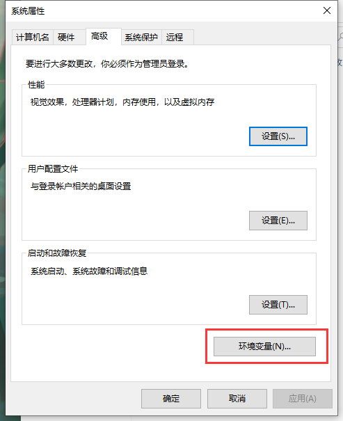

3.在系统变量中添加图中两个目录
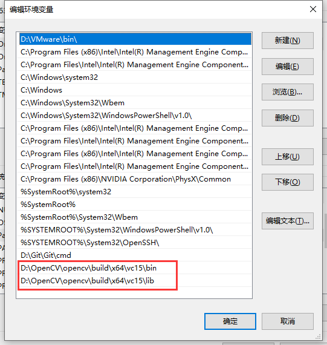

## Visual Studio 2019安装

1.官网下载Visual Studio 2019

2.安装Visual Studio 2019时选择C++

3.打开Visual Studio 2019创建C++空项目

4.配置环境
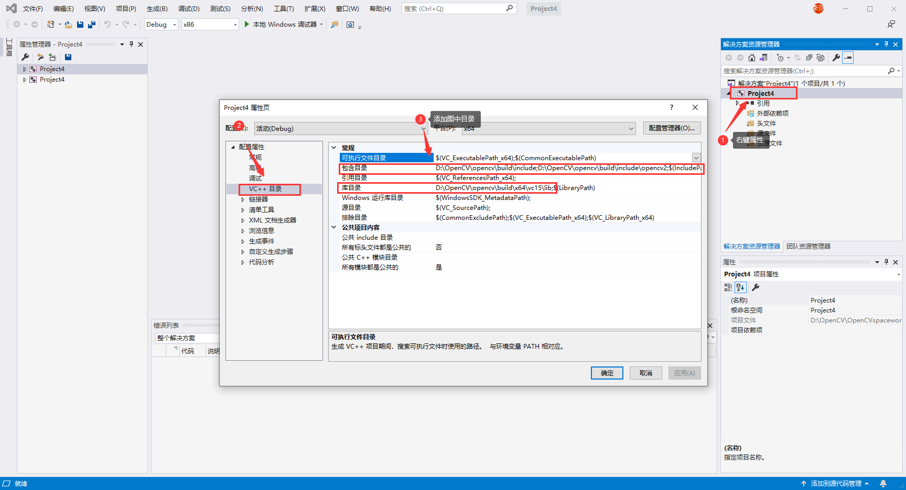

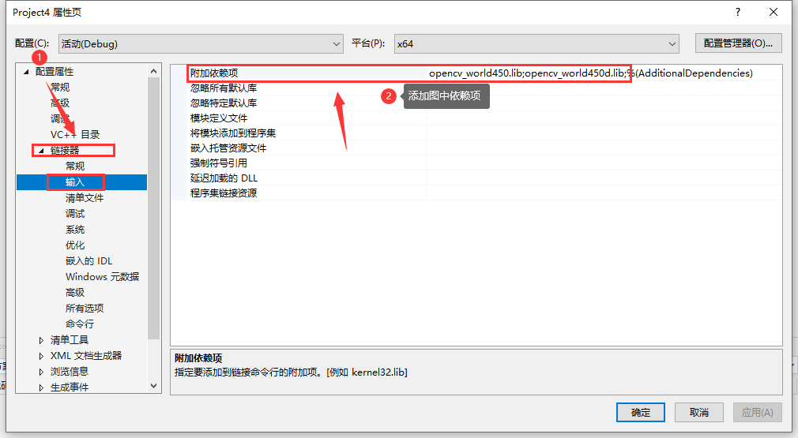

## 程序

1.图像显示
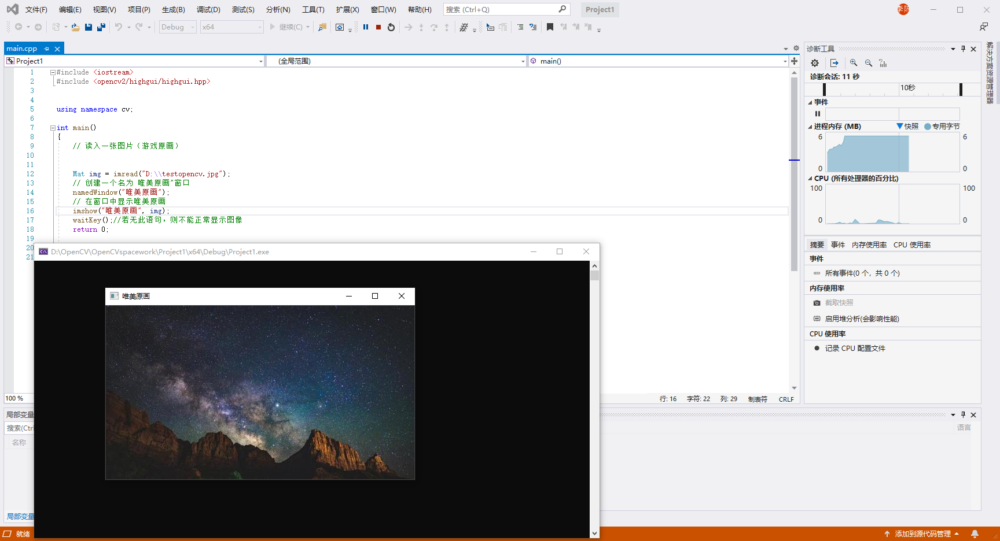

2.图像腐蚀
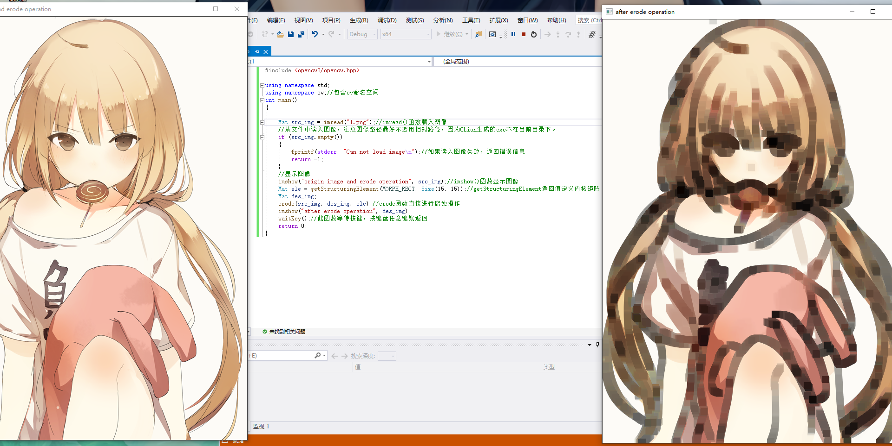

3.图像模糊

4.canny边缘检测
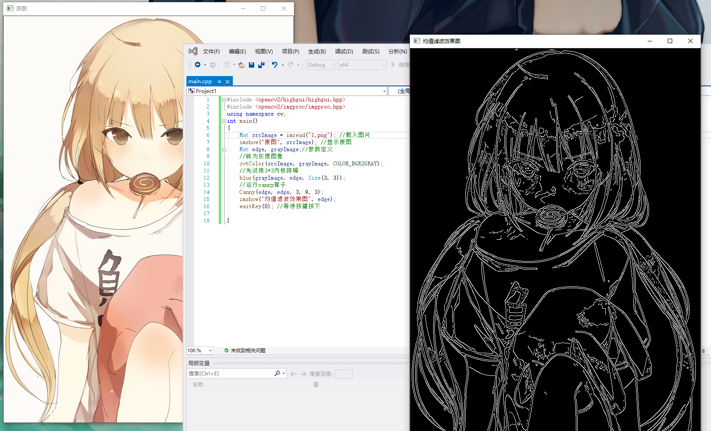

5.读取并播放视频

6.调用摄像头采集图像
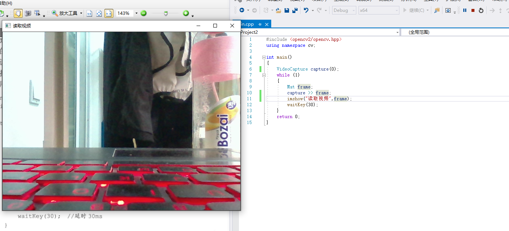

7.被canny后的视频
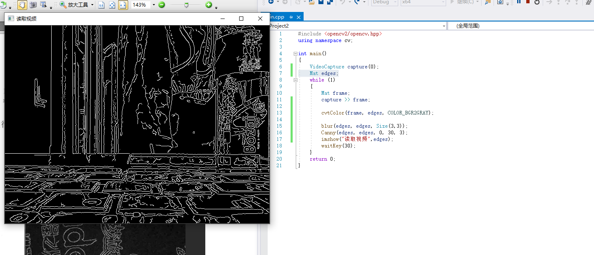

# ch_2

## 2.1 彩色目标跟踪：Camshift

程序的用法是根据鼠标框选区域的色度光谱来进行摄像头读入的视频目标的跟踪。其主要采用CamShift 算法。

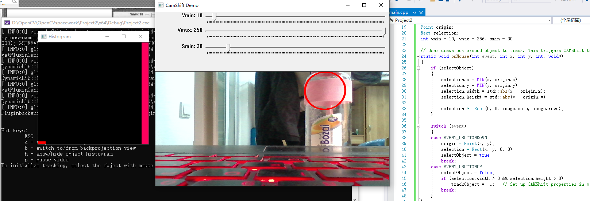

## 2.2 光流：optical flow

光流法是目前运动图像分析的重要方法，光流用来指定时变图像中模式的运动速度，因为当物体在运动时，在图像上对应点的亮度模式也在运动。这种图像亮度模式的表观运动就是光流。光流表达了图像的变化，由于它包含了目标运动的信息，因此可被观察者用来确定目标的运动情况。

## 2.3 点追踪：Ikedmo

在.\opencvlsourcesampleslcpp目录下(实际路径会因为OpenCV版本的不同略有差异)的lkdemo.epp文件中，存放着这样一个精彩的例程。程序运行后，会自动启用摄像头，这时按键盘上的“r”键来启动自动点追踪，便可以看到如图2.7所示的效果图1。而我们在摄像头中移动物体，可以看到物体上的点随着物体一同移动，富含科技感且妙趣横生。

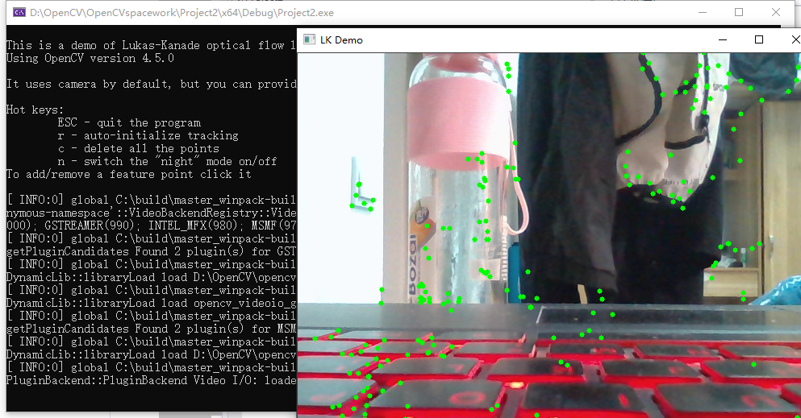

## 2.4 人脸识别

人脸识别是图像处理与OpenCV非常重要的应用之一，OpenCV 官方专门有教程和代码讲解其实现方法。此示例程序就是使用objdetect 模块检测摄像头视频流中的人脸运行程序，将自己的脸对准摄像
头，或者放置一张照片对准摄像头任其捕获，便可以发现程序准确地识别出了人脸，并用彩色的圆将脸圈出。

## 2.5 CMake

CMake是一个跨平台的安装（编译）工具，可以用简单的语句来描述所有平台的安装(编译过程)。他能够输出各种各样的makefile或者project文件，然后再依一般的建构方式使用。这使得熟悉某个集成开发环境（IDE）的开发者可以用标准的方式建构他的软件。

# ch_3

## 3.1.1 OpenCV 的命名空间

- OpenCV中的C++类和函数都是定义在命名空间ev之内的，有两种方法可以访问:

- 第一种，是在代码开头的适当位置加上usingnamespace ev;这句代码，规定程序位于此命名空间之内;另外-一种， 是在使用OpenCV的每一一个类和函数时，都加入ev::命名空间。不过这种情况会很繁琐，每用一个OpenCV的类或者函数，都要多敲四下键盘写出cv::。所以，推荐大家在代码开头的适当位置，加上usingnamespace cv;这句。

- 比如在写简单的OpenCV程序的时候，以下三句可以作为标配:
finclude <opencv2/core/core. hpp>

include<opencv2/highgui/highgui.hpp>

using namespace CV;

## 3.1.2 Mat类简析
Mat类是用于保存图像以及其他矩阵数据的数据结构，默认情况下其尺寸为0。我们也可以指定其初始尺寸，比如定义一个Mat类对象，就要写ev::Mat pic (320,640,cv::Scalar( 100));

## 3.1.3 图像的载入与显示概述
在新版本的OpenCV2中，最简单的图像载入和显示只需要两句代码，非常便捷。这两句代码分别对应了两个函数，它们分别是imread()以及imshow()。

## 3.1.9 综合示例

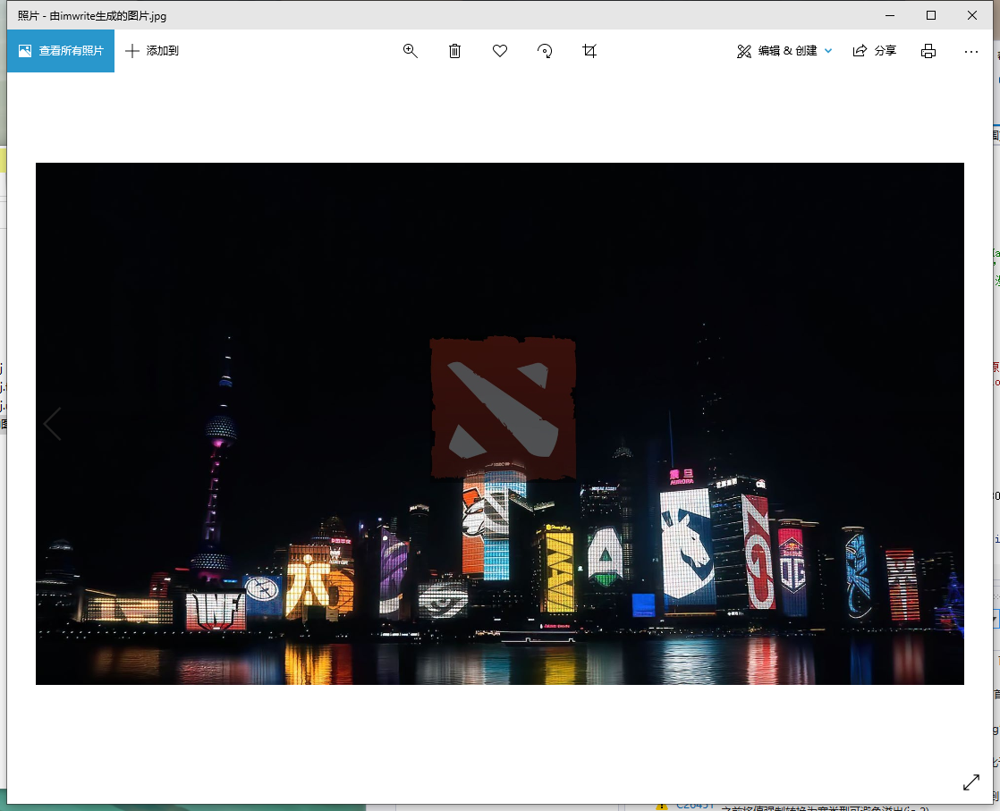

## 3.2 滑动条的创建与使用

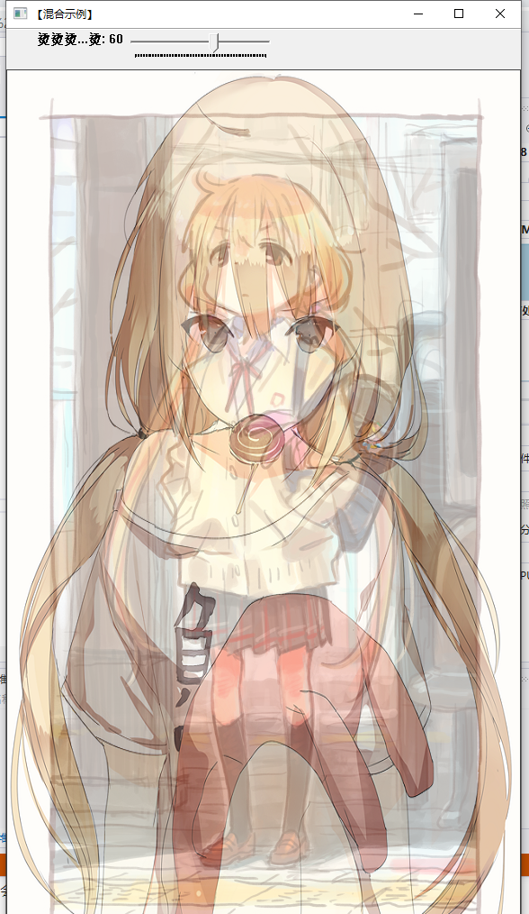

## 3.3 鼠标操作

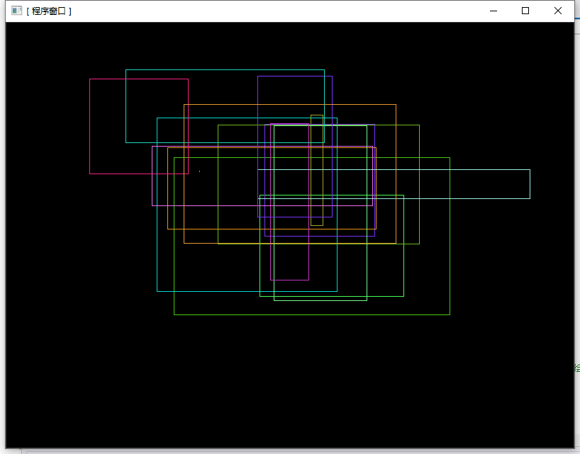