# 第一次作业

作业要求
学习OpenCV第一章到第三章的内容：主要记录笔记，特别是对理论的掌握和理解；

主体内容上要求包含：

（1）软件安装，

（2）代码测试、分析和理解（可以在源代码中用“//”注释的方式来展示分析和理解过程），

（3）结果分析和总结，

（4）代码修改

要求图文并茂，图片应尽量与书本有所区别；


# OpenStack 软件安装

## 1、安装Visual Studio 2019 Community 


## 2、安装OpenCV 4.5.0版本

从老师群里发的opencv-4.5.0软件直接安装。
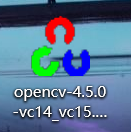

## 3、配置OpenCV环境变量

在我的电脑上右键“属性”，点击“高级系统环境”。


在用户变量中，点击Path变量并编辑，添加dll所在路径。


## 4、在vs 2019中新建项目


然后右键ConsoleApplication2这个Project，选择最后一个属性。


①工程包含（include）目录的配置：打开属性目录后选择【VC++目录】→【包含目录】，在其中添加以下三个目录。如下：
D:\QQdata\opencv\build\include
D:\QQdata\opencv\build\include\opencv
D:\QQdata\opencv\build\include\opencv2


②工程库（lib）目录的配置：在属性中选择另一个库目录，点击编辑，添加lib的路径。


③链接库的配置
同样打开【属性】→【链接器】→【输入】→【附加的依赖项】依次添加文件后缀为.lib的文件的路径。


## 代码测试

### 第一个程序：图像显示

在ConsoleApplication1.cpp中添加以下代码：

```C++
#include <iostream>
#include <opencv2/opencv.hpp>

using namespace cv;

int main()
{
    Mat img = imread("C:\\Users\\ASUS\\Desktop\\PS\\07.jpg");

	imshow("test01", img);

	waitKey(0);
}
```

并编译执行,得到：

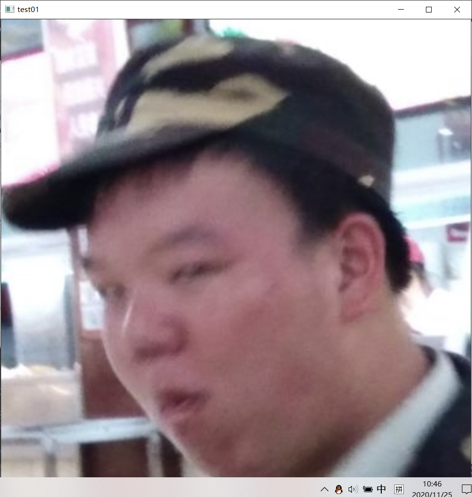

### 第二个程序：图像腐蚀

``` C++

#include <opencv2/imgproc/imgproc.hpp>
#include <opencv2/highgui/highgui.hpp>
#include <opencv2/opencv.hpp>
using namespace cv;

int main(void)
{
	
	Mat  img = imread("C:\\Users\\ASUS\\Desktop\\PS\\07.jpg");

	imshow("test01", img);
	Mat ele = getStructuringElement(MORPH_RECT, Size(15, 15));
	Mat dsImage;
	erode(img, dsImage, ele);
	imshow("trw", dsImage);


	waitKey(0);
	
  return 0;
```

并编译执行,得到：

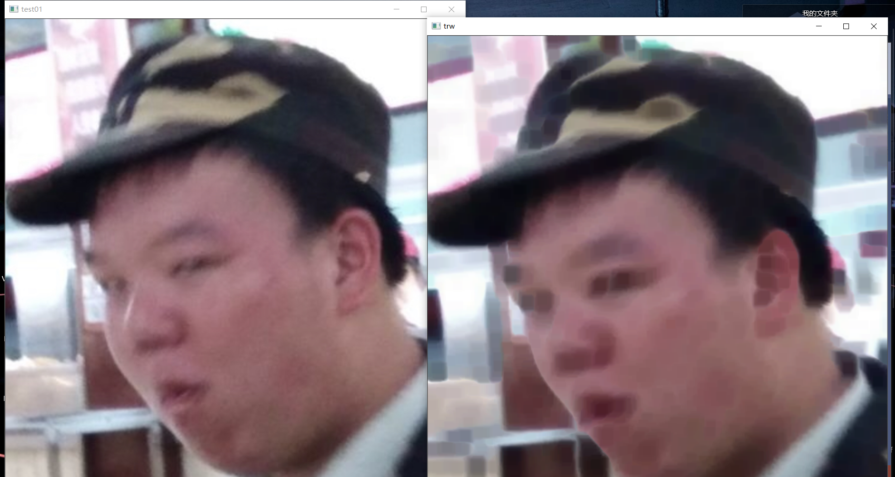


### 第三个程序：图像模糊

``` C++
#include <iostream> 
#include <opencv2/highgui/highgui.hpp> 
#include <opencv2/imgproc/imgproc.hpp>
using namespace cv;

int main()
{
	// 读入一张图片
	Mat srclmage = imread("C:\\Users\\ASUS\\Desktop\\PS\\07.jpg");

	// 创建一个名为原画
	namedWindow("原画");
	// 在窗口中显示原画 
	imshow("原画", srclmage);
	Mat dstImage;
	blur(srclmage, dstImage, Size(7, 7));
	imshow("均值滤波效果图", dstImage);
	waitKey();//若无此语句，则不能正常显示图像
	return 0;
}

```

并编译执行,得到：

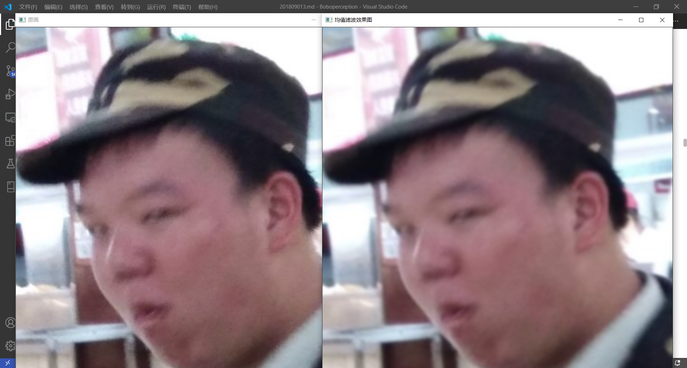

### 第四个程序：canny边缘检测

``` C++
#include <iostream> 
#include <opencv2/highgui/highgui.hpp> 
#include <opencv2/imgproc/imgproc.hpp>


using namespace cv;

int main()
{
	// 读入一张图片


	Mat srclmage = imread("C:\\Users\\ASUS\\Desktop\\PS\\07.jpg");

	// 创建一个名为原画窗口 
	namedWindow("原画");
	// 在窗口中显示原画 
	imshow("原画", srclmage);
	Mat edge, grayImage;//参数定义
	//转为灰度图像
	cvtColor(srclmage, grayImage, COLOR_BGR2GRAY);
	//先试用3*3内核降噪
	blur(grayImage, edge, Size(3, 3));
	//运行canny算子
	Canny(edge, edge, 3, 9, 3);
	imshow("均值滤波效果图", edge);
	waitKey();//若无此语句，则不能正常显示图像
	return 0;


}
```

并编译执行,得到：

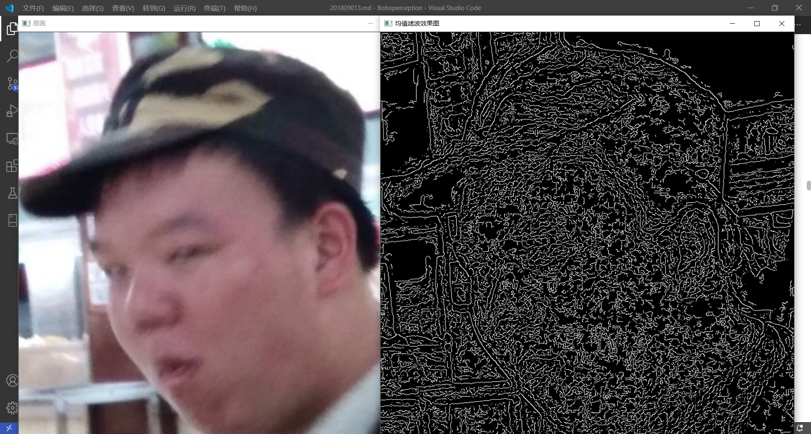

### 读取并播放视频

``` C++
#include "opencv2/opencv.hpp"
using namespace cv;

int main() {
	VideoCapture capture("C:\\Users\\ASUS\\source\\repos\\ConsoleApplication1\\ConsoleApplication1\\1.mp4");
	while (1) {
		Mat frame;
		capture >> frame;
		imshow("读取视频", frame);
		if (waitKey(30) >= 0) break;
	}
	return 0;

```

并编译执行,得到：


### 调用摄像头采集头像

``` C++
#include <iostream>
#include <stdio.h>
#include <opencv2/opencv.hpp>
#include <opencv2/imgproc/imgproc.hpp>
#include <opencv2/highgui/highgui.hpp>
#include <opencv2/opencv.hpp>
using namespace cv;

int main(void)
{

	VideoCapture cature(0);
	Mat edgs;

	while (1) {
		Mat frame;
		cature >> frame;//读取帧
		imshow("aa", frame);
		waitKey(30);
	}
}

```
并编译执行,得到：

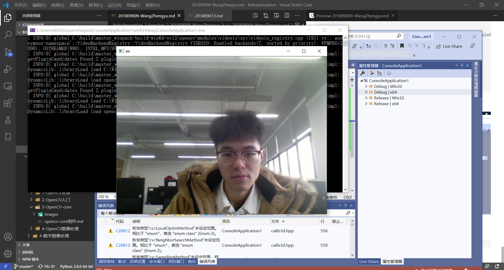


``` C++
#include <iostream>
#include <stdio.h>
#include <opencv2/opencv.hpp>
#include <opencv2/imgproc/imgproc.hpp>
#include <opencv2/highgui/highgui.hpp>
#include <opencv2/opencv.hpp>
using namespace cv;

int main(void)
{

	VideoCapture cature(0);
	Mat edgs;

	while (1) {
		Mat frame;
		cature >> frame;//读取帧
		imshow("aa", frame);
		waitKey(30);
	}

	/*
	while (1) {
		Mat frame;
		cature >> frame;
		cvtColor(frame, edgs, COLOR_BGR2GRAY);//灰度图

		blur(edgs, edgs, Size(7, 7));//模糊处理主要是降噪
		Canny(edgs, edgs, 0, 30, 3);//边沿化
		imshow("tt", edgs);
		if (waitKey(30) >= 0)
			break;
	}
	*/
}
```

并编译执行,得到：

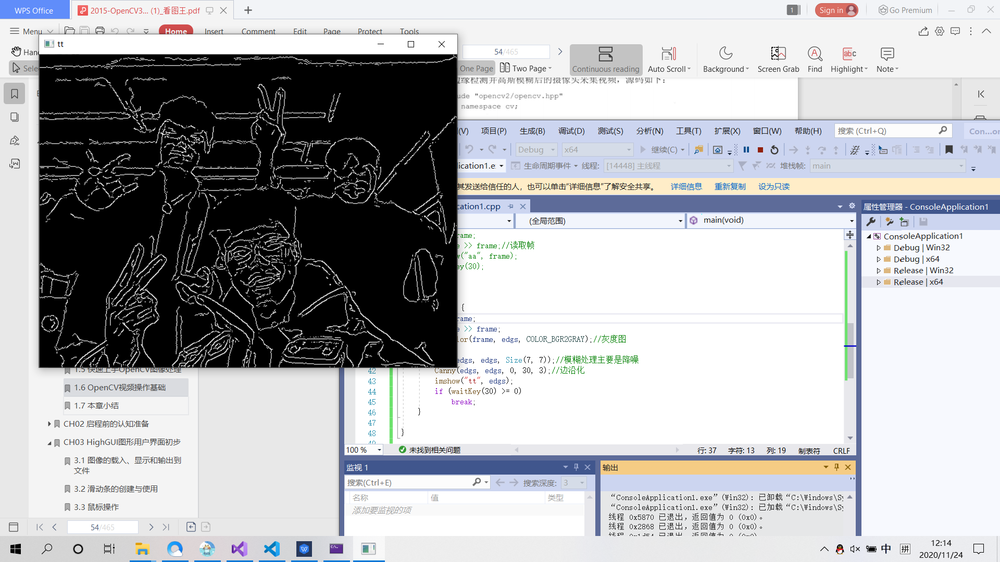


### 彩色目标跟踪：Camshift

定义：根据鼠标框选区域的色度光谱来进行摄像头读入的视频目标的跟踪

```C++
#include "opencv2/core/utility.hpp"
#include "opencv2/video/tracking.hpp"
#include "opencv2/imgproc.hpp"
#include "opencv2/videoio.hpp"
#include "opencv2/highgui.hpp"

#include <iostream>
#include <ctype.h>

using namespace cv;
using namespace std;

Mat image;

bool backprojMode = false;
bool selectObject = false;
int trackObject = 0;
bool showHist = true;
Point origin;
Rect selection;
int vmin = 10, vmax = 256, smin = 30;

// User draws box around object to track. This triggers CAMShift to start tracking
static void onMouse( int event, int x, int y, int, void* )
{
    if( selectObject )
    {
        selection.x = MIN(x, origin.x);
        selection.y = MIN(y, origin.y);
        selection.width = std::abs(x - origin.x);
        selection.height = std::abs(y - origin.y);

        selection &= Rect(0, 0, image.cols, image.rows);
    }

    switch( event )
    {
    case EVENT_LBUTTONDOWN:
        origin = Point(x,y);
        selection = Rect(x,y,0,0);
        selectObject = true;
        break;
    case EVENT_LBUTTONUP:
        selectObject = false;
        if( selection.width > 0 && selection.height > 0 )
            trackObject = -1;   // Set up CAMShift properties in main() loop
        break;
    }
}

string hot_keys =
    "\n\nHot keys: \n"
    "\tESC - quit the program\n"
    "\tc - stop the tracking\n"
    "\tb - switch to/from backprojection view\n"
    "\th - show/hide object histogram\n"
    "\tp - pause video\n"
    "To initialize tracking, select the object with mouse\n";

static void help(const char** argv)
{
    cout << "\nThis is a demo that shows mean-shift based tracking\n"
            "You select a color objects such as your face and it tracks it.\n"
            "This reads from video camera (0 by default, or the camera number the user enters\n"
            "Usage: \n\t";
    cout << argv[0] << " [camera number]\n";
    cout << hot_keys;
}

const char* keys =
{
    "{help h | | show help message}{@camera_number| 0 | camera number}"
};

int main( int argc, const char** argv )
{
    VideoCapture cap;
    Rect trackWindow;
    int hsize = 16;
    float hranges[] = {0,180};
    const float* phranges = hranges;
    CommandLineParser parser(argc, argv, keys);
    if (parser.has("help"))
    {
        help(argv);
        return 0;
    }
    int camNum = parser.get<int>(0);
    cap.open(camNum);

    if( !cap.isOpened() )
    {
        help(argv);
        cout << "***Could not initialize capturing...***\n";
        cout << "Current parameter's value: \n";
        parser.printMessage();
        return -1;
    }
    cout << hot_keys;
    namedWindow( "Histogram", 0 );
    namedWindow( "CamShift Demo", 0 );
    setMouseCallback( "CamShift Demo", onMouse, 0 );
    createTrackbar( "Vmin", "CamShift Demo", &vmin, 256, 0 );
    createTrackbar( "Vmax", "CamShift Demo", &vmax, 256, 0 );
    createTrackbar( "Smin", "CamShift Demo", &smin, 256, 0 );

    Mat frame, hsv, hue, mask, hist, histimg = Mat::zeros(200, 320, CV_8UC3), backproj;
    bool paused = false;

    for(;;)
    {
        if( !paused )
        {
            cap >> frame;
            if( frame.empty() )
                break;
        }

        frame.copyTo(image);

        if( !paused )
        {
            cvtColor(image, hsv, COLOR_BGR2HSV);

            if( trackObject )
            {
                int _vmin = vmin, _vmax = vmax;

                inRange(hsv, Scalar(0, smin, MIN(_vmin,_vmax)),
                        Scalar(180, 256, MAX(_vmin, _vmax)), mask);
                int ch[] = {0, 0};
                hue.create(hsv.size(), hsv.depth());
                mixChannels(&hsv, 1, &hue, 1, ch, 1);

                if( trackObject < 0 )
                {
                    // Object has been selected by user, set up CAMShift search properties once
                    Mat roi(hue, selection), maskroi(mask, selection);
                    calcHist(&roi, 1, 0, maskroi, hist, 1, &hsize, &phranges);
                    normalize(hist, hist, 0, 255, NORM_MINMAX);

                    trackWindow = selection;
                    trackObject = 1; // Don't set up again, unless user selects new ROI

                    histimg = Scalar::all(0);
                    int binW = histimg.cols / hsize;
                    Mat buf(1, hsize, CV_8UC3);
                    for( int i = 0; i < hsize; i++ )
                        buf.at<Vec3b>(i) = Vec3b(saturate_cast<uchar>(i*180./hsize), 255, 255);
                    cvtColor(buf, buf, COLOR_HSV2BGR);

                    for( int i = 0; i < hsize; i++ )
                    {
                        int val = saturate_cast<int>(hist.at<float>(i)*histimg.rows/255);
                        rectangle( histimg, Point(i*binW,histimg.rows),
                                   Point((i+1)*binW,histimg.rows - val),
                                   Scalar(buf.at<Vec3b>(i)), -1, 8 );
                    }
                }

                // Perform CAMShift
                calcBackProject(&hue, 1, 0, hist, backproj, &phranges);
                backproj &= mask;
                RotatedRect trackBox = CamShift(backproj, trackWindow,
                                    TermCriteria( TermCriteria::EPS | TermCriteria::COUNT, 10, 1 ));
                if( trackWindow.area() <= 1 )
                {
                    int cols = backproj.cols, rows = backproj.rows, r = (MIN(cols, rows) + 5)/6;
                    trackWindow = Rect(trackWindow.x - r, trackWindow.y - r,
                                       trackWindow.x + r, trackWindow.y + r) &
                                  Rect(0, 0, cols, rows);
                }

                if( backprojMode )
                    cvtColor( backproj, image, COLOR_GRAY2BGR );
                ellipse( image, trackBox, Scalar(0,0,255), 3, LINE_AA );
            }
        }
        else if( trackObject < 0 )
            paused = false;

        if( selectObject && selection.width > 0 && selection.height > 0 )
        {
            Mat roi(image, selection);
            bitwise_not(roi, roi);
        }

        imshow( "CamShift Demo", image );
        imshow( "Histogram", histimg );

        char c = (char)waitKey(10);
        if( c == 27 )
            break;
        switch(c)
        {
        case 'b':
            backprojMode = !backprojMode;
            break;
        case 'c':
            trackObject = 0;
            histimg = Scalar::all(0);
            break;
        case 'h':
            showHist = !showHist;
            if( !showHist )
                destroyWindow( "Histogram" );
            else
                namedWindow( "Histogram", 1 );
            break;
        case 'p':
            paused = !paused;
            break;
        default:
            ;
        }
    }

    return 0;
}

```

并编译执行,得到：


### 点追踪:lkdemo

```C++
#include "opencv2/video/tracking.hpp"
#include "opencv2/imgproc.hpp"
#include "opencv2/videoio.hpp"
#include "opencv2/highgui.hpp"

#include <iostream>
#include <ctype.h>

using namespace cv;
using namespace std;

static void help()
{
    // print a welcome message, and the OpenCV version
    cout << "\nThis is a demo of Lukas-Kanade optical flow lkdemo(),\n"
            "Using OpenCV version " << CV_VERSION << endl;
    cout << "\nIt uses camera by default, but you can provide a path to video as an argument.\n";
    cout << "\nHot keys: \n"
            "\tESC - quit the program\n"
            "\tr - auto-initialize tracking\n"
            "\tc - delete all the points\n"
            "\tn - switch the \"night\" mode on/off\n"
            "To add/remove a feature point click it\n" << endl;
}

Point2f point;
bool addRemovePt = false;

static void onMouse( int event, int x, int y, int /*flags*/, void* /*param*/ )
{
    if( event == EVENT_LBUTTONDOWN )
    {
        point = Point2f((float)x, (float)y);
        addRemovePt = true;
    }
}

int main( int argc, char** argv )
{
    VideoCapture cap;
    TermCriteria termcrit(TermCriteria::COUNT|TermCriteria::EPS,20,0.03);
    Size subPixWinSize(10,10), winSize(31,31);

    const int MAX_COUNT = 500;
    bool needToInit = false;
    bool nightMode = false;

    help();
    cv::CommandLineParser parser(argc, argv, "{@input|0|}");
    string input = parser.get<string>("@input");

    if( input.size() == 1 && isdigit(input[0]) )
        cap.open(input[0] - '0');
    else
        cap.open(input);

    if( !cap.isOpened() )
    {
        cout << "Could not initialize capturing...\n";
        return 0;
    }

    namedWindow( "LK Demo", 1 );
    setMouseCallback( "LK Demo", onMouse, 0 );

    Mat gray, prevGray, image, frame;
    vector<Point2f> points[2];

    for(;;)
    {
        cap >> frame;
        if( frame.empty() )
            break;

        frame.copyTo(image);
        cvtColor(image, gray, COLOR_BGR2GRAY);

        if( nightMode )
            image = Scalar::all(0);

        if( needToInit )
        {
            // automatic initialization
            goodFeaturesToTrack(gray, points[1], MAX_COUNT, 0.01, 10, Mat(), 3, 3, 0, 0.04);
            cornerSubPix(gray, points[1], subPixWinSize, Size(-1,-1), termcrit);
            addRemovePt = false;
        }
        else if( !points[0].empty() )
        {
            vector<uchar> status;
            vector<float> err;
            if(prevGray.empty())
                gray.copyTo(prevGray);
            calcOpticalFlowPyrLK(prevGray, gray, points[0], points[1], status, err, winSize,
                                 3, termcrit, 0, 0.001);
            size_t i, k;
            for( i = k = 0; i < points[1].size(); i++ )
            {
                if( addRemovePt )
                {
                    if( norm(point - points[1][i]) <= 5 )
                    {
                        addRemovePt = false;
                        continue;
                    }
                }

                if( !status[i] )
                    continue;

                points[1][k++] = points[1][i];
                circle( image, points[1][i], 3, Scalar(0,255,0), -1, 8);
            }
            points[1].resize(k);
        }

        if( addRemovePt && points[1].size() < (size_t)MAX_COUNT )
        {
            vector<Point2f> tmp;
            tmp.push_back(point);
            cornerSubPix( gray, tmp, winSize, Size(-1,-1), termcrit);
            points[1].push_back(tmp[0]);
            addRemovePt = false;
        }

        needToInit = false;
        imshow("LK Demo", image);

        char c = (char)waitKey(10);
        if( c == 27 )
            break;
        switch( c )
        {
        case 'r':
            needToInit = true;
            break;
        case 'c':
            points[0].clear();
            points[1].clear();
            break;
        case 'n':
            nightMode = !nightMode;
            break;
        }

        std::swap(points[1], points[0]);
        cv::swap(prevGray, gray);
    }

    return 0;
}

```

并编译执行,得到：
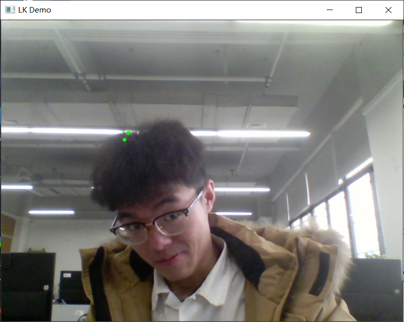


### 人脸识别:objectDetection

将"…\opencv\sources\data\haarcascades"路径下的"harcascade_eye_tree_eyeglasses.xml"和"haarcascade frontalface alt.xml"文件复制到和源文件同一目录中

运行"...opencv\sources\samples\cpp\tutorial_code\objectDetection"路径下的objectDetection.cpp文件


并编译执行,得到：
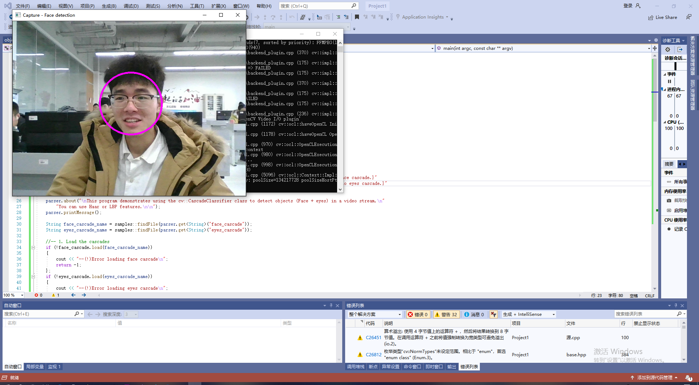

### 综合示例程序：图像的载入显示和输出

``` C++
#include<opencv2/core/core.hpp>  
#include<opencv2/highgui/highgui.hpp>  

using namespace cv;


int main()
{
	//-----------------------------------【一、图像的载入和显示】--------------------------------------  
	//     描述：以下三行代码用于完成图像的载入和显示  
	//--------------------------------------------------------------------------------------------------  

	Mat girl = imread("07.jpg"); //载入图像到Mat  
	namedWindow("程序员图"); //创建一个名为 "【1】动漫图"的窗口   
	imshow("程序员图", girl);//显示名为 "【1】动漫图"的窗口   

	//-----------------------------------【二、初级图像混合】--------------------------------------  
	//     描述：二、初级图像混合  
	//-----------------------------------------------------------------------------------------------  
	//载入图片  
	Mat image = imread("timg.jpg");
	Mat logo = imread("timg2.jpg");

	//载入后先显示  
	namedWindow("【2】原画图");
	imshow("【2】原画图", image);

	namedWindow("【3】logo图");
	imshow("【3】logo图", logo);

	//定义一个Mat类型，用于存放，图像的ROI  
	Mat imageROI;
	//方法一  
	//imageROI = image(Rect(800, 350, logo.cols, logo.rows));
	//方法二  
	imageROI = image(Range(350, 350 + logo.rows), Range(800, 800 + logo.cols));

	//将logo加到原图上  
	addWeighted(imageROI, 0.5, logo, 0.3, 0., imageROI);

	//显示结果  
	namedWindow("【4】原画+logo图");
	imshow("【4】原画+logo图", image);

	//-----------------------------------【三、图像的输出】--------------------------------------  
	//     描述：将一个Mat图像输出到图像文件  
	//-----------------------------------------------------------------------------------------------  
	//输出一张jpg图片到工程目录下  
	imwrite("复合图片.png", image);

	waitKey();

	return 0;
}
```

测试结果如下：
显示图片


要复合的图片
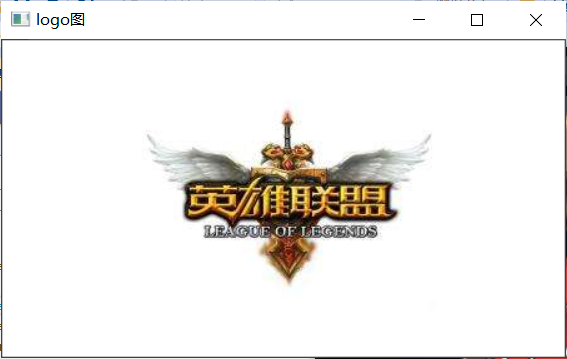

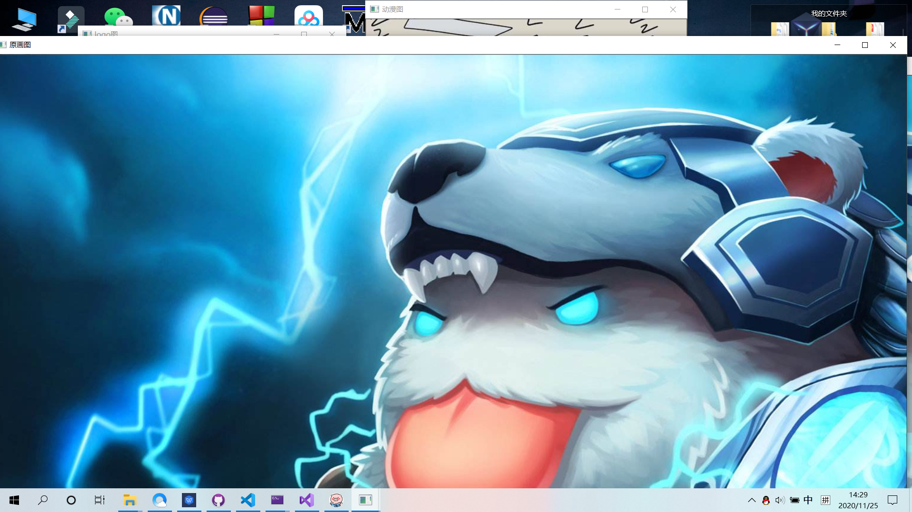

复合后的图片

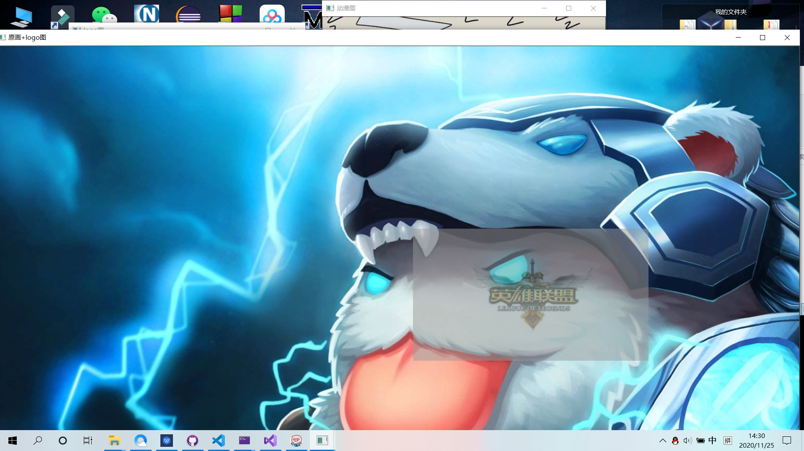

### 滑动条的创建和使用

定义：用于动态调节参数的一种工具，依附窗口而存在

#### 创建滑动条：createTrackerbar（）函数

```C++
#include <opencv2/opencv.hpp>
#include "opencv2/highgui/highgui.hpp"
using namespace cv;
#define WINDOW_NAME "[线性混合实例]"
const int g_nMaxAlphaValue = 100;
int g_nAlphaValueSlider;
double g_dBetaValue;
double g_dAlphaValue;
Mat g_srcImage1;
Mat g_srcImage2;
Mat g_dstImage;
void on_Trackbar(int, void*)
{
    g_dAlphaValue = (double)g_nAlphaValueSlider / g_nMaxAlphaValue;
    g_dBetaValue = (1.0 - g_dAlphaValue);
    /*
    addWeighted这个函数的原型如下所示，可以看出这个函数最小需要6个参数。
    1、 第1个参数，输入图片1，
    2、第2个参数，图片1的融合比例
    3、第3个参数，输入图片2
    4、第4个参数，图片2的融合比例
    5、第5个参数，偏差
    6、第6个参数，输出图片
    */
    addWeighted(g_srcImage1, g_dAlphaValue, g_srcImage2, g_dBetaValue, 0.0, g_dstImage);
    imshow(WINDOW_NAME, g_dstImage);

}
int main()
{
    //加载图像 (两图像的尺寸需相同)
    g_srcImage1 = imread("C:\\Users\\HUAT_IAE\\source\\repos\\opencv\\opencv\\1.jpg");
    g_srcImage2 = imread("C:\\Users\\HUAT_IAE\\source\\repos\\opencv\\opencv\\1.1.jpg");
    if (!g_srcImage1.data)
    {
        printf("C:\\Users\\HUAT_IAE\\source\\repos\\opencv\\opencv\\1.jpg....unsucessful");
        return -1;
    }
    if (!g_srcImage2.data)
    {
        printf("C:\\Users\\HUAT_IAE\\source\\repos\\opencv\\opencv\\1.1.jpg....unsucessful");
        return -1;
    }
    //设置滑动条初值为70
    g_nAlphaValueSlider = 70;
    //创建窗体
    namedWindow(WINDOW_NAME, 1);
    char TrackbarName[50];
    //sprintf突然发现炒鸡好用啊啊，以前竟然没发现
    sprintf_s(TrackbarName, "透明度 %d", g_nMaxAlphaValue);
    //在创建的窗体中创建一个滑动条控件
    createTrackbar(TrackbarName, WINDOW_NAME, &g_nAlphaValueSlider, g_nMaxAlphaValue, on_Trackbar);
    //结果在回调函数中显示
    on_Trackbar(g_nAlphaValueSlider, 0);
    //按任意键退出
    waitKey(0);
    return 0;
}
```

代码运行截图:
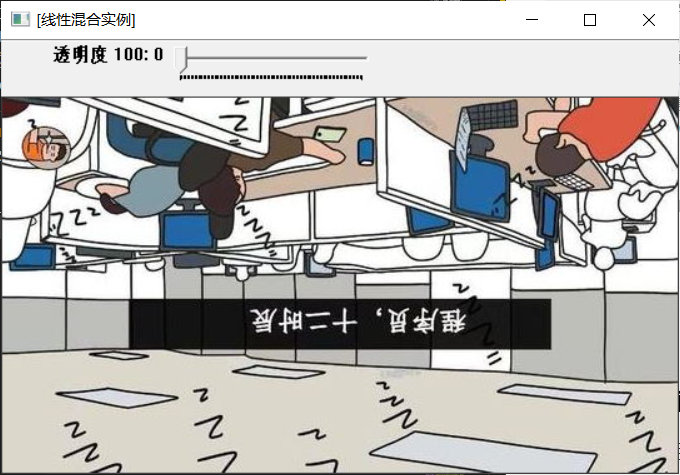
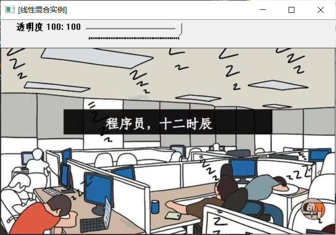
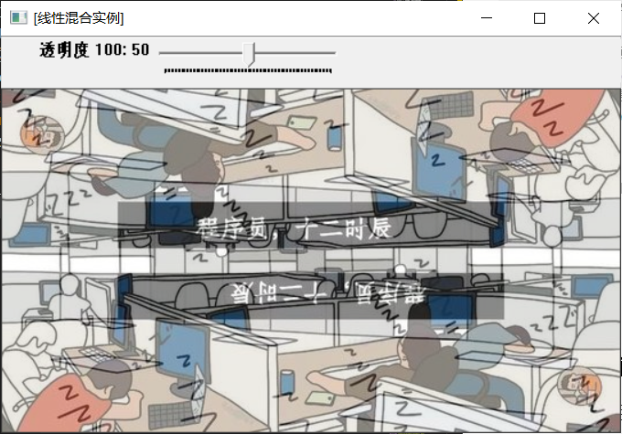

#### 获取当前轨迹条的位置：getTrackbarPos（）函数
下面这个函数用于获取当前轨迹条的位置并返回。
C++: int getTrackbarPos(conststrings trackbarname，conststring& winname) ;

- 第一个参数，const string&类型的 trackbarname，表示轨迹条的名字。

- 第二个参数，const string&类型的winname，表示轨迹条的父窗口的名称。

### 鼠标操作
OpenCV 中的鼠标操作和滑动条的消息映射方式很类似，都是通过一个中介函数配合一个回调函数来实现的。创建和指定滑动条回调函数的函数为createTrackbar，而指定鼠标操作消息回调函数的函数为SetMouseCallback
原型：C++ : void setMouseCallback(conststring& winname，MouseCallback onMouse,void* userdata=0 )

第一个参数：窗口的名字
第二个参数：指定窗口里每次鼠标发生时被调用的函数指针
第三个参数：用户传递到回调的参数，默认值为0

示例程序如下

```C++
#include <opencv2/opencv.hpp>
using namespace cv;
#define WINDOW_NAME "【鼠标操作】"
//--------------------【全局函数声明部分】---------------------
//     描述：全局函数的声明
//----------------------------------------------------------
void on_MouseHandle(int event, int x, int y, int flags, void* param);
void DrawRactangle(Mat& img, Rect box);
//---------------------【全局变量声明部分】--------------------
//     描述：全局变量的声明
//----------------------------------------------------------
Rect g_rectangle;
bool g_bDrawingBox = false;//是否进行绘制
RNG g_rng(12345);
int main(int argc, char** argv)
{
	//准备参数
	g_rectangle = Rect(-1, -1, 0, 0);
	Mat srcImage(600, 800, CV_8UC3), tempImage;
	srcImage.copyTo(tempImage);
	g_rectangle = Rect(-1, -1, 0, 0);
	srcImage = Scalar::all(0);
	// 设置鼠标操作回调函数
	namedWindow(WINDOW_NAME);
	setMouseCallback(WINDOW_NAME, on_MouseHandle, (void*)&srcImage);
	// 程序主循环，当进行绘制的标识符为真的时候进行绘制
	while (1)
	{
		srcImage.copyTo(tempImage);       // 复制源图到临时变量
		if (g_bDrawingBox)
		{
			DrawRactangle(tempImage, g_rectangle);   //进行绘制
		}
		imshow(WINDOW_NAME, tempImage);
		if (waitKey(10) == 27)            // 按下ESC键，程序退出
			break;
	}
	return 0;
}
//------------------------【on_MouseHandle(函数)】------------
//     描述：鼠标回调函数，根据不同的鼠标事件进行不同的操作
//-----------------------------------------------------------
void on_MouseHandle(int event, int x, int y, int flags, void* param)
{
	Mat& image = *(Mat*)param;
	switch (event)
	{
	case EVENT_MOUSEMOVE:
	{
		if (g_bDrawingBox)   //如果是否进行绘制的标识符为真，则记录下长和宽到RECT型变量中
		{
			g_rectangle.width = x - g_rectangle.x;
			g_rectangle.height = y - g_rectangle.y;
		}
	}
	break;
	// 左键按下消息
	case EVENT_LBUTTONDOWN:
	{
		g_bDrawingBox = true;
		g_rectangle = Rect(x, y, 0, 0);   //记录起点
	}
	break;
	//左键抬起消息
	case EVENT_LBUTTONUP:
	{
		// 标识符为false
		g_bDrawingBox = false;
		//对宽和高小于0的处理
		if (g_rectangle.width < 0)
		{
			g_rectangle.x += g_rectangle.width;
			g_rectangle.width *= -1;
		}
		if (g_rectangle.height < 0)
		{
			g_rectangle.y += g_rectangle.height;
			g_rectangle.height *= -1;
		}
		//调用函数进行绘制
		DrawRactangle(image, g_rectangle);
	}
	break;
	}
}
void DrawRactangle(Mat& img, Rect box)
{
	// tl(top left) br(below right)
	rectangle(img, box.tl(), box.br(), Scalar(g_rng.uniform(0, 255), g_rng.uniform(0, 255), g_rng.uniform(0, 255)));
}
```

运行结果如下：
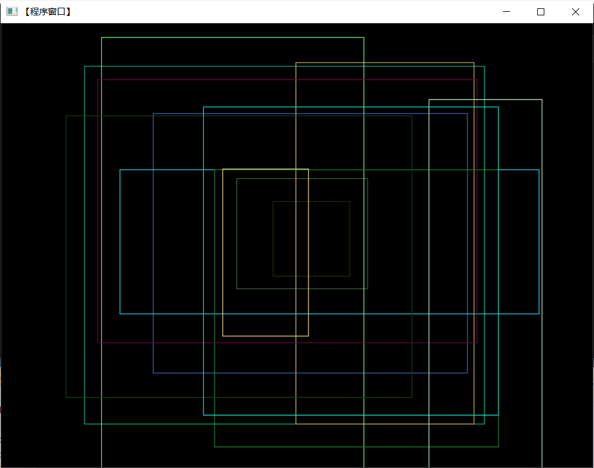

### 总结

从本次学习中，我学习到了：

1. VSCODE的安装

2. OPENCV的安装，

3. OPENCV的代码测试、分析和理解
  3.1 第一个程序：图像显示

  3.2第二个程序：图像腐蚀

  3.3第三个程序：图像模糊

  3.4第四个程序：canny边缘检测

  3.5读取并播放视频

  3.6调用摄像头采集头像

  3.7彩色目标跟踪：Camshift

  3.8点追踪:lkdemo

  3.9人脸识别:objectDetection

  3.10综合示例程序：图像的载入显示和输出

  3.11创建滑动条：createTrackerbar（）函数

  3.12鼠标操作

4. 结果分析和总结

### 心得
在本次学习中，OPENCV有了熟练的运用，理解了Opencv的运行框架，而且对Opencv的程序有了深刻的分析和理解。
在本次学习中，也暴露了一些问题，比如在图片路径配置的时候一直出问题，后面在图片相融合的时候需要两张图片像素大小完全相同，安装配置的时候需要把本地的和VSCODE上的环境变量配置不理解配置的作用，和每一步配置的关联性是什么，不过现在都完全理解了，这是一次非常有意思的实验~

