### OpenCV图像采集
#### OpenCV的认识
OpenCV是一个用于图像处理、分析、机器视觉方面的开源函数库. 

      无论你是做科学研究，还是商业应用，opencv都可以作为你理想的工具库，因为，对于这两者，它完全是免费的。 
该库采用C及C++语言编写，可以在windows, linux, mac OSX系统上面运行。该库的所有代码都经过优化，计算效率很高，因为，它更专注于设计成为一种用于实时系统的开源库。opencv采用C语言进行优化，而且，在多核机器上面，其运行速度会更快。它的一个目标是提供友好的机器视觉接口函数，从而使得复杂的机器视觉产品可以加速面世。该库包含了横跨工业产品检测、医学图像处理、安防、用户界面、摄像头标定、三维成像、机器视觉等领域的超过500个接口函数。 
 对于预处理，一般就是去除或者降低噪声，光照归一化，亮度归一化，模糊化，锐化，膨胀，腐蚀、开闭等这些操作（详见，冈萨雷斯，《数字图像处理》一书）。而对于这些操作，OpenCV分别(又提到这个词了)提供了相应API函数。而光照的预处理，OpenCV提供了一个直方图均衡化的API，后续可能会提供一些gammar矫正之类的函数。
OpenCV不过是一个工具而已。或者，你可以将它理解为幼儿园小朋友过家家玩的积木，而OpenCV中的函数，则可以理解为一个一个的积木块，利用所有或者部分积木块，你可以快速的搭建起来具体的计算机视觉方面的应用（比如，字符识别，车牌识别，遗留物检测）。

#### 环境配置
1、设置环境变量

我的电脑-高级系统设置-环境变量-系统变量-Path

新建并添加库路径：D:\opencv3.1.0\opencv\build\x64\vc12\bin\（注意最后的\）

Ps：vc12对应vs13，vc13对于vs14，vc14对应vs15

2、新建一个c++ Win32控制台应用程序，选择Debug-X64，没有的话新建

打开项目的属性管理器（视图-其他窗口-属性管理器），右键Debug|x64选择属性，打开属性页

3、需要添加三处内容，VC++目录里的包含目录、库目录，链接器-输入里的附加依赖项

      3.1、包含目录：

               D:\opencv3.1.0\opencv\build\include（可以只添加这一个目录，这样在程序引用头文件时写为：#include <opencv2\opencv.hpp>）

               D:\opencv3.1.0\opencv\build\include\opencv（也可以直接添加次级目录，写为#include <opencv.hpp>）

               D:\opencv3.1.0\opencv\build\include\opencv2（也可以直接添加次级目录，写为#include <opencv.hpp>）

      3.2、库目录：

              D:\opencv3.1.0\opencv\build\x64\vc12\lib

      3.3、附加依赖项：

              opencv_world310d.lib

              opencv_world310.lib

              带d的对应Debug，不带d的对应Release

4、环境配置OK
#### 图像显示
代码：
 #include<opencv2\opencv.hpp>
using namespace cv;
int main()
{
    Mat picture = imread("2.png");
    //图片必须添加到工程目下
    //也就是和test.cpp文件放在一个文件夹下！！！
    imshow("测试程序", picture);
    waitKey(20150901);
}
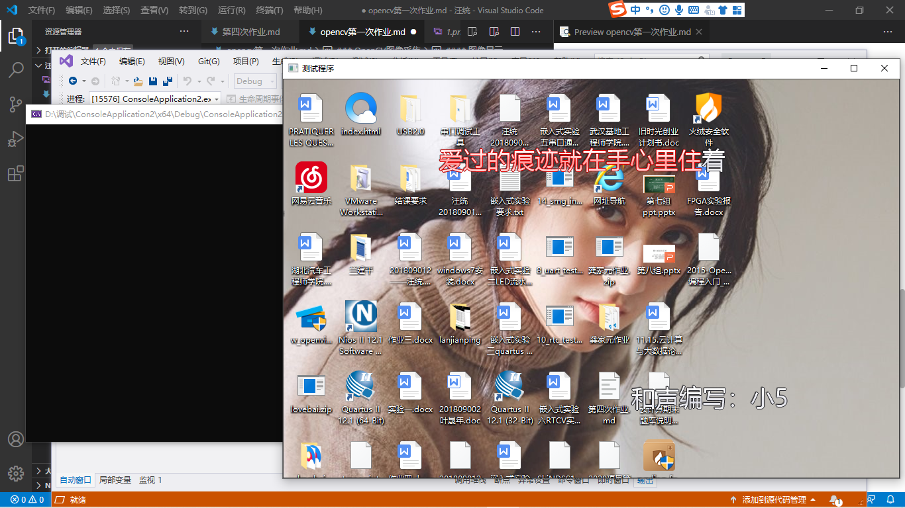
#### 图像腐蚀
代码：
 #include <opencv2/highgui/highgui.hpp>
 #include <opencv2/imgproc/imgproc.hpp>
using namespace cv;
int main()
{
	Mat srcImage = imread("2.png");
	imshow("原图", srcImage);
	Mat element = getStructuringElement(MORPH_RECT, Size(15, 15));
	Mat dstImage;
	erode(srcImage, dstImage, element); //腐蚀操作
	imshow("效果图", dstImage);
	waitKey(0); //等待按键按下
	return 0;
}
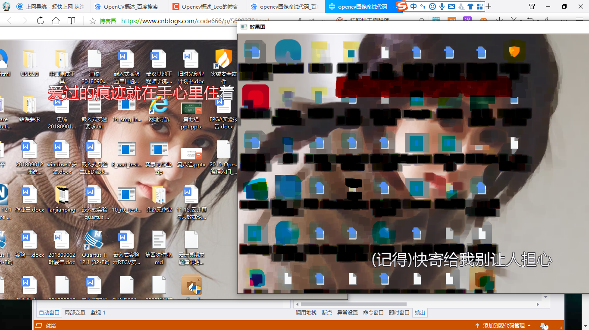
#### 图像模糊
代码：
 #include <opencv2/highgui/highgui.hpp>
 #include <opencv2/imgproc/imgproc.hpp>
using namespace cv;
int main()
{
	Mat srcImage = imread("2.png"); //载入图片
	imshow("原图", srcImage); //显示原图
	//均值滤波操作
	Mat dstImage;
	blur(srcImage, dstImage, Size(7, 7));
	imshow("均值滤波效果图", dstImage);
	waitKey(0); //等待按键按下
}
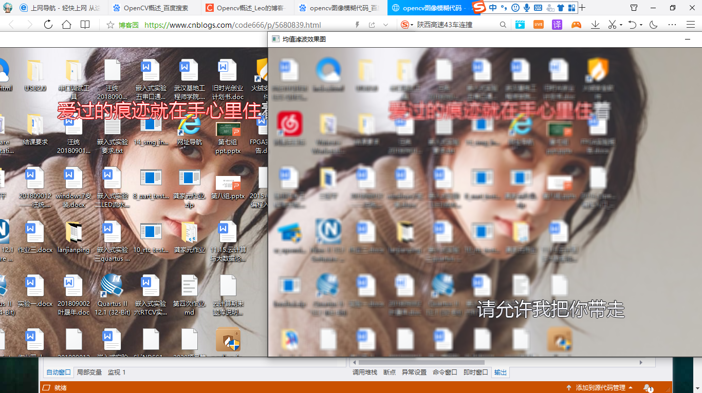
#### canny边缘检测
代码：
 #include <opencv2/highgui/highgui.hpp>
 #include <opencv2/imgproc/imgproc.hpp>
using namespace cv;
int main()
{
	Mat srcImage = imread("2.png"); //载入图片
	imshow("原图", srcImage); //显示原图
	Mat edge, grayImage;//参数定义
	//转为灰度图像
	cvtColor(srcImage, grayImage, COLOR_BGR2GRAY);
	//先试用3*3内核降噪
	blur(grayImage, edge, Size(3, 3));
	//运行canny算子
	Canny(edge, edge, 3, 9, 3);
	imshow("均值滤波效果图", edge);
	waitKey(0); //等待按键按下

}
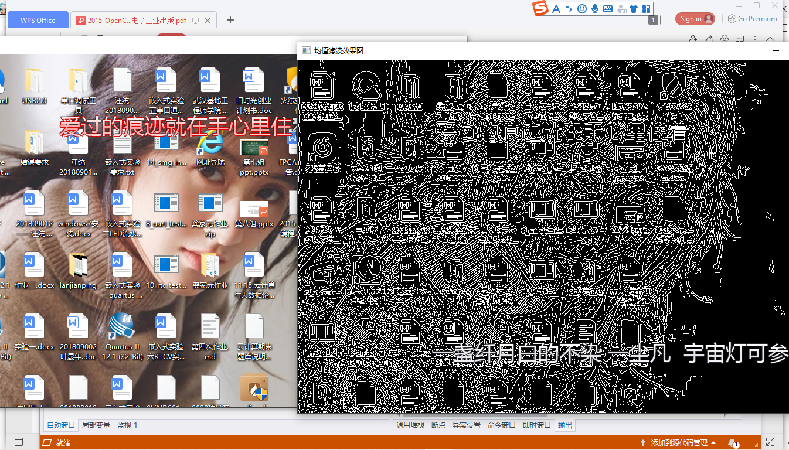
#### 视频读取播放
代码：
 #include <opencv2/opencv.hpp>
//#include <opencv2/highgui/highgui.hpp>
//#include <opencv2/imgproc/imgproc.hpp>
using namespace cv;
int main()
{
	VideoCapture capture("1.mp4"); //读入视频，实例化的同时再初始化
	//2循环显示每一帧
	while (1)
	{
		Mat frame; //定义一个Mat变量，用于存储每一帧的图像
		capture >> frame; //读取当前帧
		//若视频播放完成，退出循环
		if (frame.empty())
		{
			break;
		}
		imshow("读取视频", frame); //显示当前帧
		waitKey(30); //延时30MS
	}
	return 0;

}
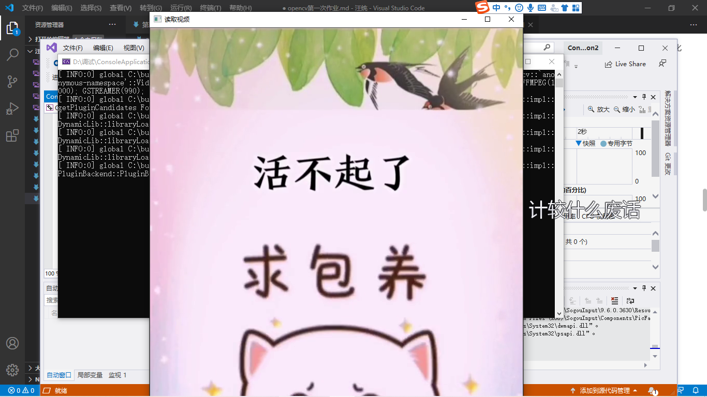
#### 调用摄像头采集图像
代码：
 #include <stdio.h>
 #include"opencv2/opencv.hpp"  
using namespace cv;
 #include <opencv2\imgproc\types_c.h>

int main()
{
    VideoCapture a(0);
    Mat edge;
    while (1)
    {
        Mat frame;
        a >> frame;
        cvtColor(frame, edge, CV_BGR2GRAY);
        blur(edge, edge, Size(7, 7));
        Canny(edge, edge, 0, 30, 3);
        imshow("被canny后的视频", edge);
        waitKey(2);

    }
    return 0;
}

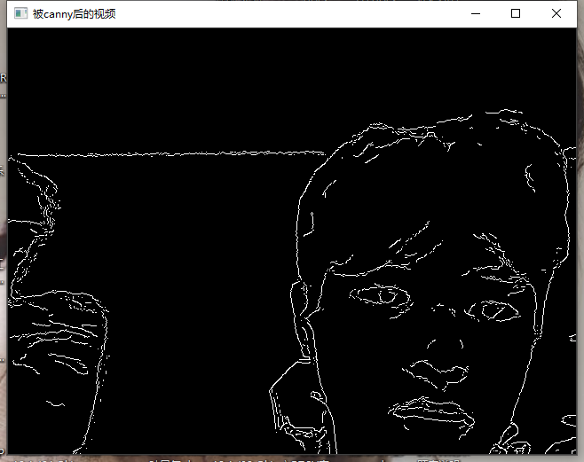

#### camshift
- CamShift算法的全称是"Continuously Adaptive Mean-SHIFT"，即：连续自适应的MeanShift算法。其基本思想是对视频序列的所有图像帧都作MeanShift运算，并将上一帧的结果（即搜索窗口的中心位置和窗口大小）作为下一帧MeanShift算法的搜索窗口的初始值，如此迭代下去。简单点说，meanShift是针对单张图片寻找最优迭代结果，而camShift则是针对视频序列来处理，并对该序列中的每一帧图片都调用meanShift来寻找最优迭代结果。正是由于camShift针对一个视频序列进行处理，从而保证其可以不断调整窗口的大小，如此一来，当目标的大小发生变化的时候，该算法就可以自适应地调整目标区域继续跟踪。
- 在OpenCV自带的camShift的例子当中，是通过计算目标在HSV空间下的H分量直方图，通过直方图反向投影得到目标像素的概率分布，然后通过调用OpenCV的CAMSHIFT算法，自动跟踪并调整目标窗口的中心位置与大小。该算法对于简单背景下的单目标跟踪效果较好，但如果被跟踪目标与背景颜色或周围其它目标颜色比较接近，则跟踪效果较差。另外，由于采用颜色特征，所以它对被跟踪目标的形状变化有一定的抵抗能力。
- camshift将meanshift算法扩展到连续图像序列，就是camshift算法。它将视频的所有帧做meanshift运算，并将上一帧的结果，即搜索窗的大小和中心，作为下一帧meanshift算法搜索窗的初始值。如此迭代下去，就可以实现对目标的跟踪。
算法过程为：
(1).初始化搜索窗
(2).计算搜索窗的颜色概率分布（反向投影）
(3).运行meanshift算法，获得搜索窗新的大小和位置。
(4).在下一帧视频图像中用(3)中的值重新初始化搜索窗的大小和位置，再跳转到(2)继续进行。

camshift能有效解决目标变形和遮挡的问题，对系统资源要求不高，时间复杂度低，在简单背景下能够取得良好的跟踪效果。但当背景较为复杂，或者有许多与目标颜色相似像素干扰的情况下，会导致跟踪失败。因为它单纯的考虑颜色直方图，忽略了目标的空间分布特性，所以这种情况下需加入对跟踪目标的预测算法。
#### 光流

光流：是目前运动图像分析的重要方法，由Gibso于1950年首先提出。光流用来指定时变图像中模式的运动速度，因为当物体在运动时，在图像上对应点的亮度模式也在运动。这种图像亮度模式的表观运动就是光流。
#### 点追踪
把感兴趣区域的中心点当作特征点去追踪，就可以啦。这样跟踪方便，画图也很方便。所以在学习过程中，真的应该多和身边人交流，这样会学的更轻松，更有效果。
代码：
 #include "opencv2/video/tracking.hpp"
 #include "opencv2/imgproc/imgproc.hpp"
 #include "opencv2/highgui/highgui.hpp"

 #include <iostream>
 #include <ctype.h>

using namespace cv;
using namespace std;

//--------------------------------【help( )函数】----------------------------------------------
//                描述：输出帮助信息
//-------------------------------------------------------------------------------------------------
static void help()
{
    //输出欢迎信息和OpenCV版本
    cout << "\n\n\t\t\t非常感谢使用BPI-OpenCV！\n";
        cout << "\n\t程序默认从摄像头读入视频，可以按需改为从视频文件读入图像\n";
    cout << "\n\t操作说明: \n"
        "\t\t通过点击在图像中添加/删除特征点\n"
        "\t\tESC - 退出程序\n"
        "\t\tr -自动进行追踪\n"
        "\t\tc - 删除所有点\n"
        "\t\tn - 开/光-夜晚模式\n" << endl;
}

Point2f point;
bool addRemovePt = false;

//--------------------------------【onMouse( )回调函数】------------------------------------
//                描述：鼠标操作回调
//-------------------------------------------------------------------------------------------------
static void onMouse(int event, int x, int y, int /*flags*/, void* /*param*/)
{
  
        //此句代码的OpenCV3版为：
        if( event == EVENT_LBUTTONDOWN )
    {
        point = Point2f((float)x, (float)y);
        addRemovePt = true;
    }
}

//-----------------------------------【main( )函数】--------------------------------------------
//                描述：控制台应用程序的入口函数
//-------------------------------------------------------------------------------------------------
int main(int argc, char** argv)
{
    help();

    VideoCapture cap;

  
    //此句代码的OpenCV3版为：
    TermCriteria termcrit(TermCriteria::MAX_ITER|TermCriteria::EPS, 20, 0.03);
    Size subPixWinSize(10, 10), winSize(31, 31);

    const int MAX_COUNT = 500;
    bool needToInit = false;
    bool nightMode = false;

    cap.open(0);

    if (!cap.isOpened())
    {
        cout << "Could not initialize capturing...\n";
        return 0;
    }

    namedWindow("LK Demo", 1);
    setMouseCallback("LK Demo", onMouse, 0);

    Mat gray, prevGray, image;
    vector<Point2f> points[2];

    for (;;)
    {
        Mat frame;
        cap >> frame;
        if (frame.empty())
            break;

        frame.copyTo(image);
        cvtColor(image, gray, COLOR_BGR2GRAY);

        if (nightMode)
            image = Scalar::all(0);

        if (needToInit)
        {
            // 自动初始化
            
            cornerSubPix(gray, points[1], subPixWinSize, Size(-1, -1), termcrit);
            addRemovePt = false;
        }
        else if (!points[0].empty())
        {
            vector<uchar> status;
            vector<float> err;
            if (prevGray.empty())
                gray.copyTo(prevGray);
            calcOpticalFlowPyrLK(prevGray, gray, points[0], points[1], status, err, winSize,
                3, termcrit, 0, 0.001);
            size_t i, k;
            for (i = k = 0; i < points[1].size(); i++)
            {
                if (addRemovePt)
                {
                    if (norm(point - points[1][i]) <= 5)
                    {
                        addRemovePt = false;
                        continue;
                    }
                }

                if (!status[i])
                    continue;

                points[1][k++] = points[1][i];
                circle(image, points[1][i], 3, Scalar(0, 255, 0), -1, 8);
            }
            points[1].resize(k);
        }

        if (addRemovePt && points[1].size() < (size_t)MAX_COUNT)
        {
            vector<Point2f> tmp;
            tmp.push_back(point);

            //此句代码的OpenCV3版为：
            cornerSubPix( gray, tmp, winSize, Size(-1,-1), termcrit);
            points[1].push_back(tmp[0]);
            addRemovePt = false;
        }

        needToInit = false;
        imshow("LK Demo", image);

        char c = (char)waitKey(10);
        if (c == 27)
            break;
        switch (c)
        {
        case 'r':
            needToInit = true;
            break;
        case 'c':
            points[0].clear();
            points[1].clear();
            break;
        case 'n':
            nightMode = !nightMode;
            break;
        }

        std::swap(points[1], points[0]);
        cv::swap(prevGray, gray);
    }

    return 0;
}
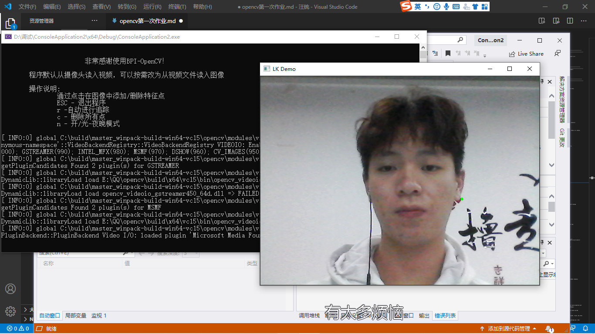
#### 人脸识别
代码：
 #include <opencv2/core/utility.hpp>
 #include "opencv2/video/tracking.hpp"
 #include "opencv2/imgproc.hpp"
 #include "opencv2/videoio.hpp"
 #include "opencv2/highgui.hpp"
 
 #include <iostream>
 #include <ctype.h>
 
using namespace cv;
using namespace std;
 
Mat image;
 
bool backprojMode = false;
bool selectObject = false;
int trackObject = 0;
bool showHist = true;
Point origin;
Rect selection;
int vmin = 10, vmax = 256, smin = 30;
 
// User draws box around object to track. This triggers CAMShift to start tracking
static void onMouse(int event, int x, int y, int, void*)
{
	if (selectObject)
	{
		selection.x = MIN(x, origin.x);
		selection.y = MIN(y, origin.y);
		selection.width = std::abs(x - origin.x);
		selection.height = std::abs(y - origin.y);
 
		selection &= Rect(0, 0, image.cols, image.rows);
	}
 
	switch (event)
	{
	case EVENT_LBUTTONDOWN:
		origin = Point(x, y);
		selection = Rect(x, y, 0, 0);
		selectObject = true;
		break;
	case EVENT_LBUTTONUP:
		selectObject = false;
		if (selection.width > 0 && selection.height > 0)
			trackObject = -1;   // Set up CAMShift properties in main() loop
		break;
	}
}
 
string hot_keys =
"\n\nHot keys: \n"
"\tESC - quit the program\n"
"\tc - stop the tracking\n"
"\tb - switch to/from backprojection view\n"
"\th - show/hide object histogram\n"
"\tp - pause video\n"
"To initialize tracking, select the object with mouse\n";
 
static void help()
{
	cout << "\nThis is a demo that shows mean-shift based tracking\n"
		"You select a color objects such as your face and it tracks it.\n"
		"This reads from video camera (0 by default, or the camera number the user enters\n"
		"Usage: \n"
		"   ./camshiftdemo [camera number]\n";
	cout << hot_keys;
}
 
const char* keys =
{
	"{help h | | show help message}{@camera_number| 0 | camera number}"
};
 
int main(int argc, const char** argv)                                                                                                                                         
{
	VideoCapture cap;
	Rect trackWindow;
	int hsize = 16;
	float hranges[] = { 0,180 };
	const float* phranges = hranges;
	CommandLineParser parser(argc, argv, keys);
	if (parser.has("help"))
	{
		help();
		return 0;
	}
	int camNum = parser.get<int>(0);
	cap.open(camNum);
 
	if (!cap.isOpened())
	{
		help();
		cout << "***Could not initialize capturing...***\n";
		cout << "Current parameter's value: \n";
		parser.printMessage();
		return -1;
	}
	cout << hot_keys;
	namedWindow("Histogram", 0);
	namedWindow("CamShift Demo", 0);
	setMouseCallback("CamShift Demo", onMouse, 0);
	createTrackbar("Vmin", "CamShift Demo", &vmin, 256, 0);
	createTrackbar("Vmax", "CamShift Demo", &vmax, 256, 0);
	createTrackbar("Smin", "CamShift Demo", &smin, 256, 0);
 
	Mat frame, hsv, hue, mask, hist, histimg = Mat::zeros(200, 320, CV_8UC3), backproj;
	bool paused = false;
 
	for (;;)
	{
		if (!paused)
		{
			cap >> frame;
			if (frame.empty())
				break;
		}
 
		frame.copyTo(image);
 
		if (!paused)
		{
			cvtColor(image, hsv, COLOR_BGR2HSV);
 
			if (trackObject)
			{
				int _vmin = vmin, _vmax = vmax;
 
				inRange(hsv, Scalar(0, smin, MIN(_vmin, _vmax)),
					Scalar(180, 256, MAX(_vmin, _vmax)), mask);
				int ch[] = { 0, 0 };
				hue.create(hsv.size(), hsv.depth());
				mixChannels(&hsv, 1, &hue, 1, ch, 1);
 
				if (trackObject < 0)
				{
					// Object has been selected by user, set up CAMShift search properties once
					Mat roi(hue, selection), maskroi(mask, selection);
					calcHist(&roi, 1, 0, maskroi, hist, 1, &hsize, &phranges);
					normalize(hist, hist, 0, 255, NORM_MINMAX);
 
					trackWindow = selection;
					trackObject = 1; // Don't set up again, unless user selects new ROI
 
					histimg = Scalar::all(0);
					int binW = histimg.cols / hsize;
					Mat buf(1, hsize, CV_8UC3);
					for (int i = 0; i < hsize; i++)
						buf.at<Vec3b>(i) = Vec3b(saturate_cast<uchar>(i*180. / hsize), 255, 255);
					cvtColor(buf, buf, COLOR_HSV2BGR);
 
					for (int i = 0; i < hsize; i++)
					{
						int val = saturate_cast<int>(hist.at<float>(i)*histimg.rows / 255);
						rectangle(histimg, Point(i*binW, histimg.rows),
							Point((i + 1)*binW, histimg.rows - val),
							Scalar(buf.at<Vec3b>(i)), -1, 8);
					}
				}
 
				// Perform CAMShift
				calcBackProject(&hue, 1, 0, hist, backproj, &phranges);
				backproj &= mask;
				RotatedRect trackBox = CamShift(backproj, trackWindow,
					TermCriteria(TermCriteria::EPS | TermCriteria::COUNT, 10, 1));
				if (trackWindow.area() <= 1)
				{
					int cols = backproj.cols, rows = backproj.rows, r = (MIN(cols, rows) + 5) / 6;
					trackWindow = Rect(trackWindow.x - r, trackWindow.y - r,
						trackWindow.x + r, trackWindow.y + r) &
						Rect(0, 0, cols, rows);
				}
 
				if (backprojMode)
					cvtColor(backproj, image, COLOR_GRAY2BGR);
				ellipse(image, trackBox, Scalar(0, 0, 255), 3, LINE_AA);
			}
		}
		else if (trackObject < 0)
			paused = false;
 
		if (selectObject && selection.width > 0 && selection.height > 0)
		{
			Mat roi(image, selection);
			bitwise_not(roi, roi);
		}
 
		imshow("CamShift Demo", image);
		imshow("Histogram", histimg);
 
		char c = (char)waitKey(10);
		if (c == 27)
			break;
		switch (c)
		{
		case 'b':
			backprojMode = !backprojMode;
			break;
		case 'c':
			trackObject = 0;
			histimg = Scalar::all(0);
			break;
		case 'h':
			showHist = !showHist;
			if (!showHist)
				destroyWindow("Histogram");
			else
				namedWindow("Histogram", 1);
			break;
		case 'p':
			paused = !paused;
			break;
		default:
			;
		}
	}
 
	return 0;
}
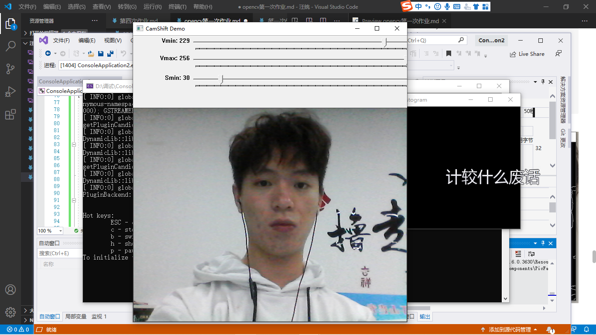
#### 使用CMake生成OpenCV源代码工程的解决方案
- 第一步 运行cmake-gui
- 第二步 指定OpenCV的安装路径到 E：\QQ
- 第三步 指定解决方案的存放路径
- 第四步 第一次Configure。看见进度条读到尽头，出现Configuring done字样，第一次配置就完成了
- 第五步 第二次Configure
- 第六步 单击Generate，成功生成项目

argc、argv和env是在main（）函数之前被赋值的。其实，main（）函数严格意义上并不是真正的程序入口点函数，往往入口点还与操作系统有关。而在Windows的控制台应用程序中，将main（）函数作为程序入口点，并且很少使用argc、argv等命令行参数。
#### visual studio中main函数的几种写法说明
1.返回值为整型带参的main函数
2.返回值为整型不带参的main函数
3.返回值为void且不带参的main函数

- int argc表示命令行字串的个数
- char *argv[]表示命令行参数的字符串

#### 鼠标操作
在OpenCV中鼠标有4种类型的操作，分别是：按下（Down），放开（Up），移动(Move)，双击（DoubleClick），鼠标在窗口中操作的时候会发生其中一个或几个操作。

而这些操作都是由OpenCV内部定义的回调函数：

void (*CvMouseCallback )(int event, int x, int y, int flags, void* param)完成的。

1、event：其中event表示事件，回调过程中发生的是鼠标按下或放开、移动等操作。

2、x,y：表示鼠标此刻的在窗口中的位置信息。

3、flags：表示拖拽、组合键等标志，与event搭配使用

4、param：表示传入或传出的数据

只要将操作方法定义成CvMouseCallback即可实现任何形式的鼠标操作

 ||---|Event的可选项及含义|---|
|宏|值|功能|
|CV_EVENT_MOUSEMOVE|0|滑动|
|CV_EVENT_LBUTTONDOWN|1|左键点击|
|CV_EVENT_RBUTTONDOWN|2|右键点击|
|CV_EVENT_MBUTTONDOWN|3|中键点击|
|CV_EVENT_LBUTTONUP|4|左键放开|
|CV_EVENT_RBUTTONUP|5|右键放开|
|CV_EVENT_MBUTTONUP|6|中键放开|
|CV_EVENT_LBUTTONDBLCLK|7|左键双击|
|CV_EVENT_RBUTTONDBLCLK|8|右键双击|
|CV_EVENT_MBUTTONDBLCL|9中键双击|
 
Flags的可选项及含义
宏/值/功能
CV_EVENT_FLAG_LBUTTON/1/左键拖曳
CV_EVENT_FLAG_RBUTTON/2/右键拖曳
CV_EVENT_FLAG_MBUTTON /4/中键拖曳
CV_EVENT_FLAG_CTRLKEY /8~15/Ctrl不放事件
CV_EVENT_FLAG_SHIFTKEY/16~31/Shift不放事件
CV_EVENT_FLAG_ALTKEY/32~39/Alt不放事件

然后使用cvSetMouseCallback()进入鼠标操作的入口方法进行回调,但需要传入一个handler,也就是事件驱动的子程序名称,Handler必须是CvMouseCallback函数指针类型.

cvSetMouseCallback("窗口名称",自行定义子程序名称,自行定义子程序的传入传出参数);
代码：
#include <opencv2/opencv.hpp>
using namespace cv;
#define WINDOW_NAME "【鼠标操作】"
//--------------------【全局函数声明部分】---------------------
//     描述：全局函数的声明
//----------------------------------------------------------
void on_MouseHandle(int event, int x, int y, int flags, void * param);
void DrawRactangle(Mat & img, Rect box);
//---------------------【全局变量声明部分】--------------------
//     描述：全局变量的声明
//----------------------------------------------------------
Rect g_rectangle;
bool g_bDrawingBox = false;//是否进行绘制
RNG g_rng(12345);
int main(int argc, char ** argv)
{
	//准备参数
	g_rectangle = Rect(-1, -1, 0, 0);
	Mat srcImage(600, 800, CV_8UC3), tempImage;
	srcImage.copyTo(tempImage);
	g_rectangle = Rect(-1, -1, 0, 0);
	srcImage = Scalar::all(0);
	// 设置鼠标操作回调函数
	namedWindow(WINDOW_NAME);
	setMouseCallback(WINDOW_NAME, on_MouseHandle, (void *)&srcImage);
	// 程序主循环，当进行绘制的标识符为真的时候进行绘制
	while (1)
	{
		srcImage.copyTo(tempImage);       // 复制源图到临时变量
		if (g_bDrawingBox)
		{
			DrawRactangle(tempImage, g_rectangle);   //进行绘制
		}
		imshow(WINDOW_NAME, tempImage);
		if (waitKey(10) == 27)            // 按下ESC键，程序退出
			break;
	}
	return 0;
}
//------------------------【on_MouseHandle(函数)】------------
//     描述：鼠标回调函数，根据不同的鼠标事件进行不同的操作
//-----------------------------------------------------------
void on_MouseHandle(int event, int x, int y, int flags, void * param)
{
	Mat & image = *(Mat*)param;
	switch (event)
	{
	case EVENT_MOUSEMOVE:
	{
		if (g_bDrawingBox)   //如果是否进行绘制的标识符为真，则记录下长和宽到RECT型变量中
		{
			g_rectangle.width = x - g_rectangle.x;
			g_rectangle.height = y - g_rectangle.y;
		}
	}
	break;
	// 左键按下消息
	case EVENT_LBUTTONDOWN:
	{
		g_bDrawingBox = true;
		g_rectangle = Rect(x, y, 0, 0);   //记录起点
	}
	break;
	//左键抬起消息
	case EVENT_LBUTTONUP:
	{
		// 标识符为false
		g_bDrawingBox = false;
		//对宽和高小于0的处理
		if (g_rectangle.width < 0)
		{
			g_rectangle.x += g_rectangle.width;
			g_rectangle.width *= -1;
		}
		if (g_rectangle.height < 0)
		{
			g_rectangle.y += g_rectangle.height;
			g_rectangle.height *= -1;
		}
		//调用函数进行绘制
		DrawRactangle(image, g_rectangle);
	}
	break;
	}
}
void DrawRactangle(Mat & img, Rect box)
{
	// tl(top left) br(below right)
	rectangle(img, box.tl(), box.br(), Scalar(g_rng.uniform(0, 255), g_rng.uniform(0, 255), g_rng.uniform(0, 255)));
}
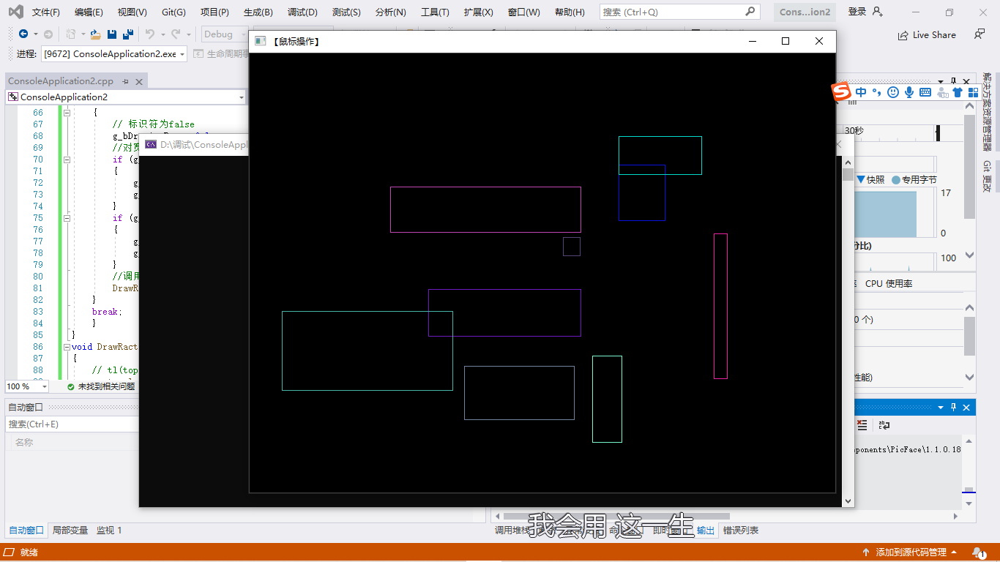
#### 滑动条的创建与使用
- 对于opencv中创建滑动条的个人理解：通过调用创建滑动条的函数并对回调函数进行初始化，即可以进行调用，滑动条相当于一个可操作性的变量控制，可以通过改变滑动条的位置去实时的改变对应变量的值。
- 创建滑动条后，图片的显示窗口中便会出现一个滑动条，可以通过滑动条来改变滑动条对应变量的数字，然后通过程序根据变量的改变而做出相应的调整，或对图片进行切换，或对图片进行相关的处理
- 当前的程序是当数字为零时显示茶杯1的图像，当数字为一时显示茶杯2的图像
- 创建滑动条函数共有5个参数，第1个参数是滑动条的名称，第2个参数是创建滑动条的图片窗口，第3个窗参数是滑动条对应的变量，第4个参数是滑动条的最大值，第5个参数则是回调函数的名称
- 在对滑动条进行操作时，每一次的操作都会调用一次回调函数，所以当需要根据滑动条的改变做出相应的操作时，需要在回调函数中填写相应的操作代码

完整的程序代码如下

#include <opencv2/opencv.hpp>
#include <iostream>

using namespace cv;
using namespace std;
Mat src, src1;
int i = 0;//滑动条初始值
int maxnum = 1;//滑动条最大值
void text(int, void*);//声明回调函数

int main()
{
    src = imread("girl.jpg");
    src1 = imread("dota.jpg");

    //新建一个窗口
    namedWindow("测试窗口", WINDOW_NORMAL);
    //WINDOW_AUTOSIZE，WINDOW_NORMAL ，WINDOW_OPENGL
    //创建滑动条
    //注意：i是变量，滑动条擦改变后i改变。
    createTrackbar("数字：", "测试窗口", &i, maxnum, text);

    //text(0, 0);

    waitKey(0);
    return 0;
}
//回调函数
void text(int, void*)
{
    if (i == 1)
    {
        imshow("测试窗口", src);
    }
    else
    {
        imshow("测试窗口", src1);
    }
    /*printf("数字i的值为:");
    printf("%d\n", i);*/
    cout << "数字i的值为:" << i << endl;
}
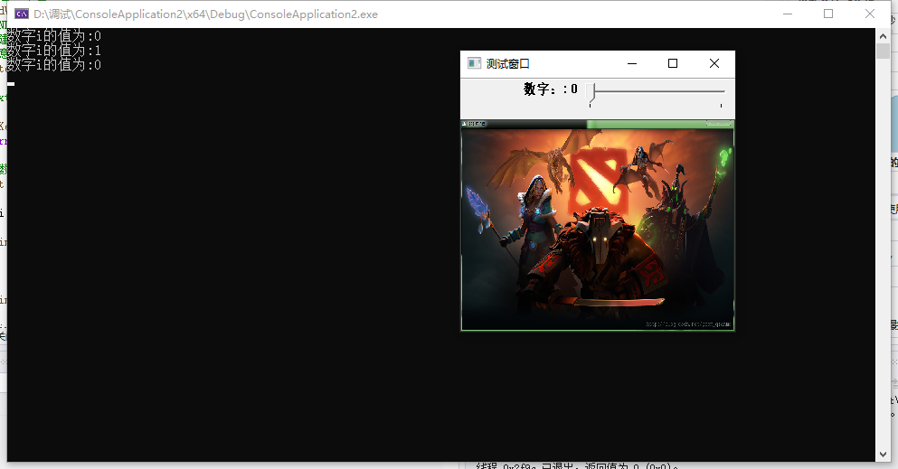
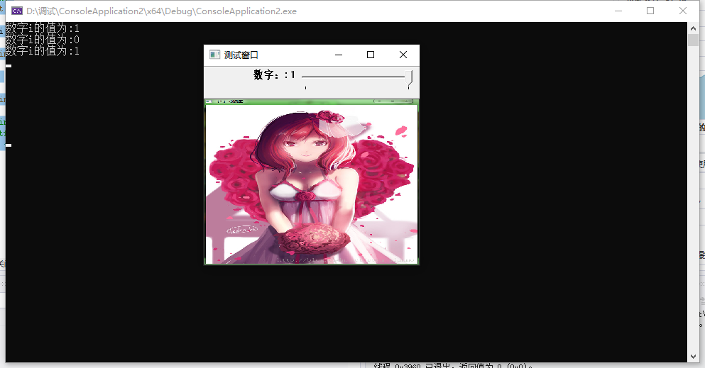
#### 载入、输出、显示
代码：
#include<opencv2/core/core.hpp>  
#include<opencv2/highgui/highgui.hpp>  

using namespace cv;

int main()
{
	//-----------------------------------【一、图像的载入和显示】--------------------------------------  
	//     描述：以下三行代码用于完成图像的载入和显示  
	//--------------------------------------------------------------------------------------------------  

	Mat girl = imread("girl.jpg"); //载入图像到Mat  
	namedWindow("【1】动漫图"); //创建一个名为 "【1】动漫图"的窗口   
	imshow("【1】动漫图", girl);//显示名为 "【1】动漫图"的窗口   

	//-----------------------------------【二、初级图像混合】--------------------------------------  
	//     描述：二、初级图像混合  
	//-----------------------------------------------------------------------------------------------  
	//载入图片  
	Mat image = imread("dota.jpg");
	Mat logo = imread("dota_logo.jpg");

	//载入后先显示  
	namedWindow("【2】原画图");
	imshow("【2】原画图", image);

	namedWindow("【3】logo图");
	imshow("【3】logo图", logo);

	//定义一个Mat类型，用于存放，图像的ROI  
	Mat imageROI;
	//方法一  
	//imageROI = image(Rect(800, 350, logo.cols, logo.rows));
	//方法二  
	imageROI=image(Range(350,350+logo.rows),Range(800,800+logo.cols));  

	//将logo加到原图上  
	addWeighted(imageROI, 0.5, logo, 0.3, 0., imageROI);

	//显示结果  
	namedWindow("【4】原画+logo图");
	imshow("【4】原画+logo图", image);

	//-----------------------------------【三、图像的输出】--------------------------------------  
	//     描述：将一个Mat图像输出到图像文件  
	//-----------------------------------------------------------------------------------------------  
	//输出一张jpg图片到工程目录下  
	imwrite("我喜欢打dota2 by浅墨.jpg", image);

	waitKey();

	return 0;
}
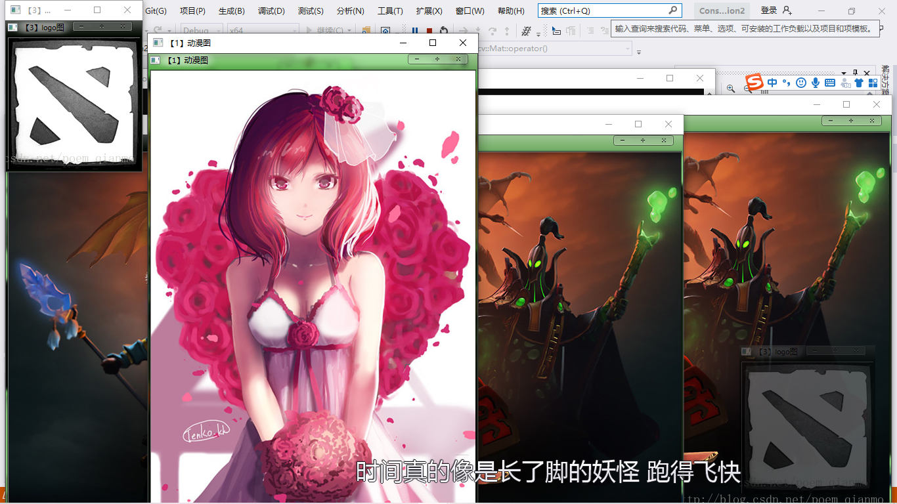
