# opencv第一章到第三章的学习笔记

## CH01

### 1.1opencv周边概念认识

####  图像处理、计算机视觉与Opencv 
##### a.什么是图像处理？

- 图像处理(Image Processing)：是用计算机对图像进行分析，以达到所需结果的技术，又称影像处理。
- 图像处理技术：一般包括图像压缩，增强和复原，匹配、描述和识别
- 图像处理一般指数字图像处理(Digital Image Processing )。其中，数字图像是指用工业相机、摄像机、扫描仪等设备经过拍摄得到的一个大的二维数组。该数组的元素称为像素，其值称为灰度值。而数字图像处理是通过计算机对图像进行去除噪声、增强、复原、分割、提取特征等处理的方法和技术。

##### b.什么是计算机视觉（Computer Vision）？

- 是指用摄影机和电脑代替人眼对目标进行识别、跟踪和测量等机器视觉，并进一步做图形处理，用电脑处理使之成为更适合人眼观察或传送给仪器检测的图像的一门学科。

##### c.二者之间的区别

- 图像处理侧重于处理图像，如增强、还原、去噪、分割等

- 计算机视觉重点在于使用计算机来模拟人的视觉，因此这个的终极目标是模拟

##### d.什么是opencv？

- 一个基于开眼发行的跨平台计算机视觉库，可以运行在Linux、Windows、Mac Os.Android、 iOS、Maemo、FreeBSD、OpenBSD等操作系统上。由一系列C函数和C++的类构成，轻量且高效。还支持使用C#、Ch.Ruby等编程语言，同时提供了对Python、Ruby,MATLAB等语言的接口，实现了图像处理和计算机视觉方面的很多通用算法。

##### e.opencv的应用方面

- 人机交互
- 物体识别
- 图像分区
- 人脸识别
- 动作识别
- 运动跟踪
- 机器人

### 1.2opencv基本架构分析
#### opencv所有模块介绍

(1)【calib3d】———Calibration(校准）和3D这两个词的组合缩写。这个模块主要是相机校准和三维重建相关的内容，包括基本的多视角几何算法、单个立体摄像头标定、物体姿态估计、立体相似性算法、3D信息的重建等。
(2)【contrib】—Contributed/Experimental Stuf的缩写。该模块包含了一些最近添加的不太稳定的可选功能，不用去多管。新增了新型人脸识别、立体匹配、人工视网膜模型等技术。
(3)【core】——核心功能模块，包含如下内容:
- opencv基本数据结构
- 动态数据结构
- 绘图函数
- 数组操作相关函数
- 辅助功能与系统函数和宏
- 与OpenGL的互操作
(4)【imgproc 】———Image和l Process这两个单词的缩写组合，图像处理模块。包含如下内容:
- 线性和非线性的图像滤波
- 图像的几何变换
- 其他（Miscellaneous）图像转换
- 直方图相关
- 结构分析和形状描述
- 运动分析和对象跟踪
- 特征检测
- 目标检测等内容
(5)【features2d】——也就是Features2D，即2D功能框架，包含如下内容:
- 特征检测和描述
- 特征检测器(Feature Detectors）通用接口
- 描述符提取器(Descriptor Extractors）通用接口
- 描述符匹配器(Descriptor Matchers）通用接口
- 通用描述符(Generic Descriptor）匹配器通用接口
- 关键点绘制函数和匹配功能绘制函数
(6)【flann】———Fast Library for Approximate Nearest Neighbors，高维的近似近邻快速搜索算法库，包含以下两个部分:
- 快速近似最近邻搜索
- 聚类
( 7) 【gpu】——运用GPU加速的计算机视觉模块。
(8)【highgui】——高层GUI图形用户界面，包含媒体的输入输出、视频捕捉、图像和视频的编码解码、图形交互界面的接口等内容。
( 9)【 legacy 】——一些已经废弃的代码库，保留下来作为向下兼容，包含如下内容:
- 运动分析
- 期望最大化
- 直方图
- 平面细分(CAPI)
- 特征检测和描述(Feature Dctection and Description)
- 描述符提取器( Descriptor Extractors）的通用接口
- 通用描述符(Generic Descriptor Matchers）的常用接口

- 匹配器
(10)【ml】———Machine Learning，机器学习模块，基本上是统计模型和分类算法，包含如下内容:
- 统计模型(Statistical Models)
- 一般贝叶斯分类器（Normal Bayes Classifier)
- K-近邻(K-Nearest Neighbors)
- 支持向量机( Support Vector Machines)决策树( Decision Trees)
- 提升(Boosting)
- 梯度提高树(Gradient Boosted Trees)
- 随机树(Random Trees)
- 超随机树(Extremely randomized trees)
- 期望最大化(Expectation Maximization)
- 神经网络( Neural Networks)
-  MLData
(11)【nonfree】——一些具有专利的算法模块，包含特征检测和GPU相关的内容。最好不要商用。
(12)【objdetect】——目标检测模块，包含Cascade Classification(级联分类)和Latent SVM这两个部分。
(13)【ocl】—OpenCL-accelerated Computer Vision，运用OpenCL加速的计算机视觉组件模块。
(14)【photo】——Computational Photography，包含图像修复和图像去噪两部分
(15)【stitching】———images stitching，图像拼接模块，包含如下部分:
- 拼接流水线
- 特点寻找和匹配图像
- 估计旋转
- 自动校准
- 图片歪斜
- 接缝估测
- 曝光补偿
- 图片混合
(16)【 superres】- SuperResolution，超分辨率技术的相关功能模块。
(17)【ts】—openCv测试相关代码
(18)【video】——视频分析组件，该模块包括运动估计、背景分离、对象跟踪等视频处理相关内容。
(19)【Videostab】———Video stabilization，视频稳定相关的组件

### 1.3 opencv的下载、安装和配置
#### 1.3.1下载安装
下载后在文件夹里可以看到下图

然后进行解压缩，我在d盘创建了opencv文件夹，如下图
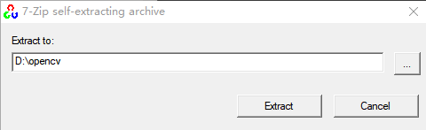
#### 1.3.2配置
##### a.系统环境配置
安装完后则进行环境变量配置，右键计算机，然后点开高级系统设置，将安装文件下的bin文件添加到系统变量Path中，如下图所示：我为了保险v14和v15都添加了
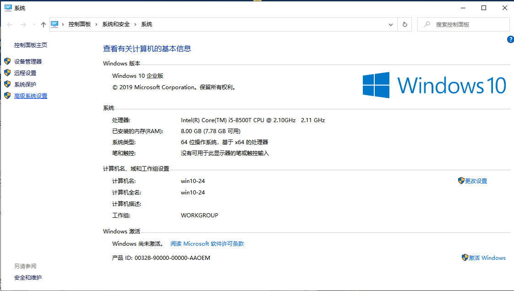
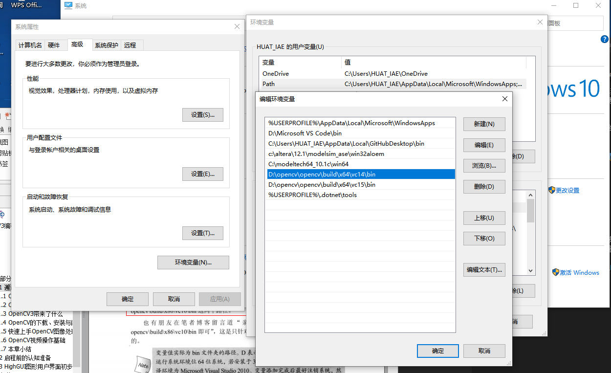
##### b.vs中项目的配置
打开vs2019,选择创建新项目，选择空文件，填写项目名称和存放路径（这里以video为例）如下图所示
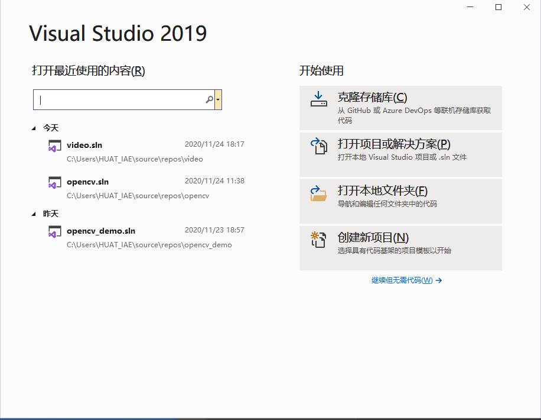
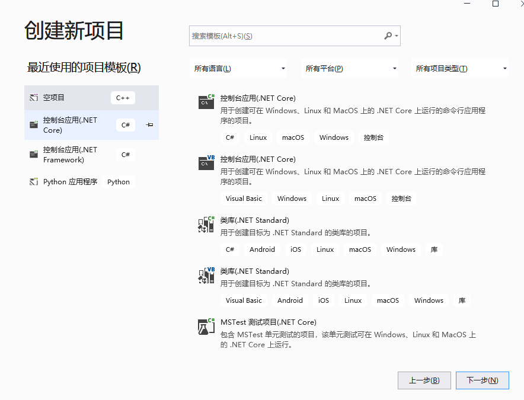
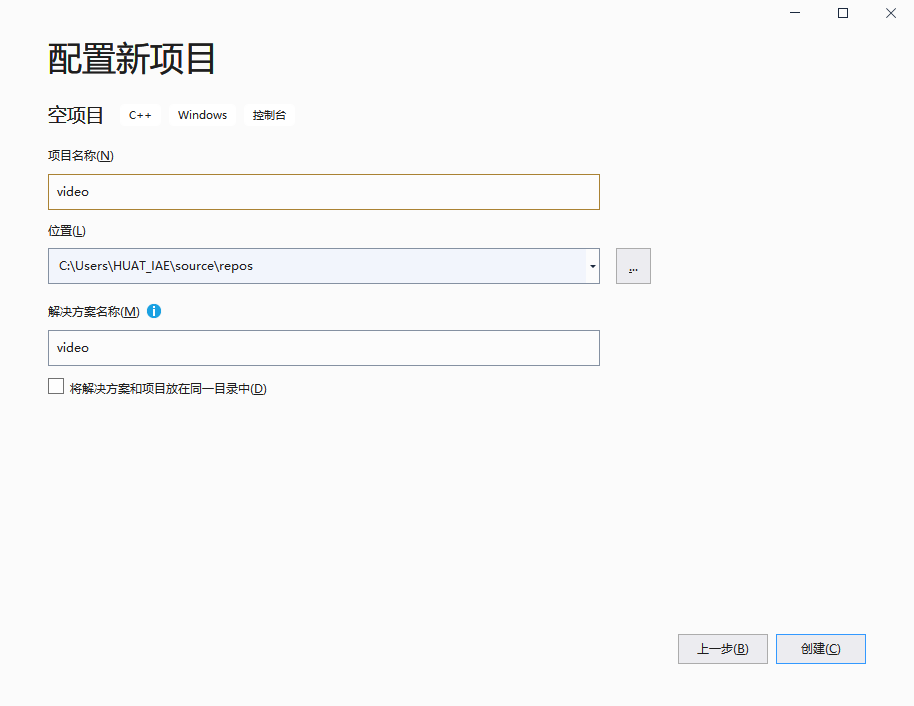
之后右键video的源文件点击添加新建项，生成代码区，如下图所示：
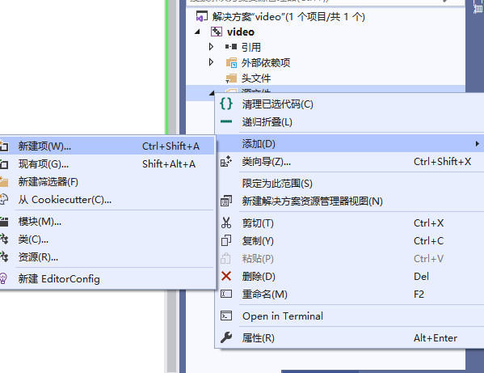
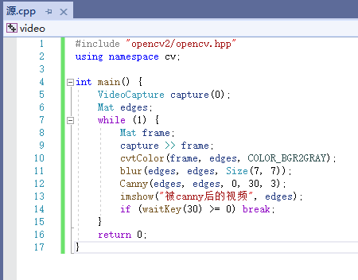
再进行库的配置，右键video，打开属性进行配置包含目录、库目录和链接器的输入，如下图所示
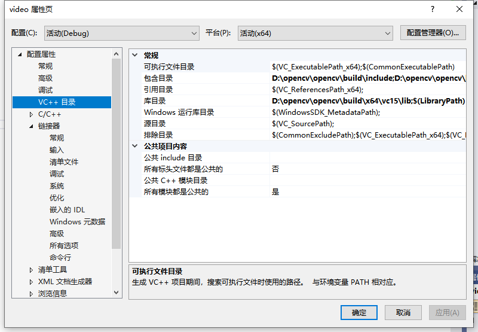
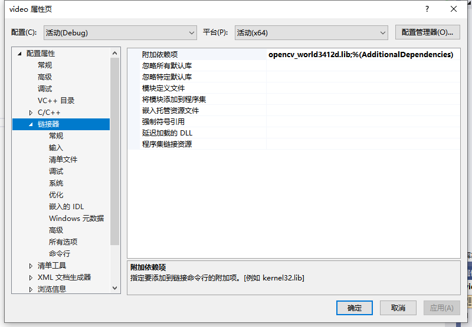

### 1.4 opencv图像处理
#### 1.4.1图像显示
``` c++
#include <iostream> 
#include <opencv2/highgui/highgui.hpp> 


using namespace cv;

int main()
{
	// 读入一张图片（游戏原画） ?


	Mat img = imread("C:\\Users\\HUAT_IAE\\source\\repos\\opencv\\opencv\\qq.jpg");
	// 创建一个名为 唯美原画"窗口 ?
	namedWindow("唯美原画");
	// 在窗口中显示唯美原画 ?
	imshow("唯美原画", img);
	waitKey();//若无此语句，则不能正常显示图像
	return 0;


}
```
测试结果如下图所示：
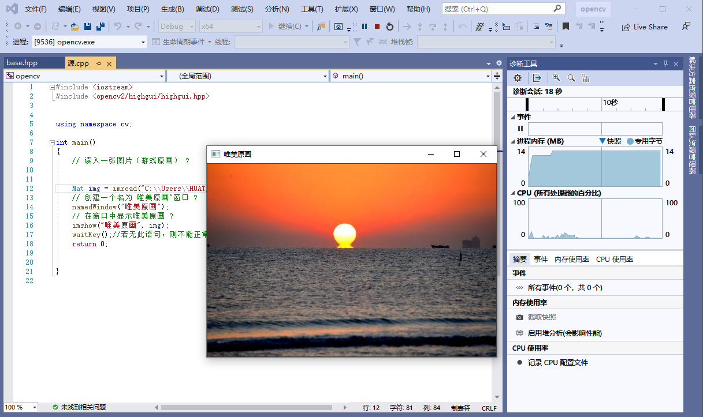
#### 1.4.2图像腐蚀
```c++
#include <iostream> 
#include <opencv2/highgui/highgui.hpp> 
#include <opencv2/imgproc/imgproc.hpp>


using namespace cv;

int main()
{
	// 读入一张图片（游戏原画） ?


	Mat srclmage = imread("C:\\Users\\HUAT_IAE\\source\\repos\\opencv\\opencv\\qq.jpg");

	// 创建一个名为 唯美原画"窗口 ?
	namedWindow("唯美原画");
	// 在窗口中显示唯美原画 ?
	imshow("唯美原画", srclmage);
	Mat element = getStructuringElement(MORPH_RECT, Size(15, 15));
	Mat dstImage;
	erode(srclmage, dstImage, element); //腐蚀操作
	imshow("效果图", dstImage);
	waitKey();//若无此语句，则不能正常显示图像
	return 0;


}
```
测试结果如下图所示：
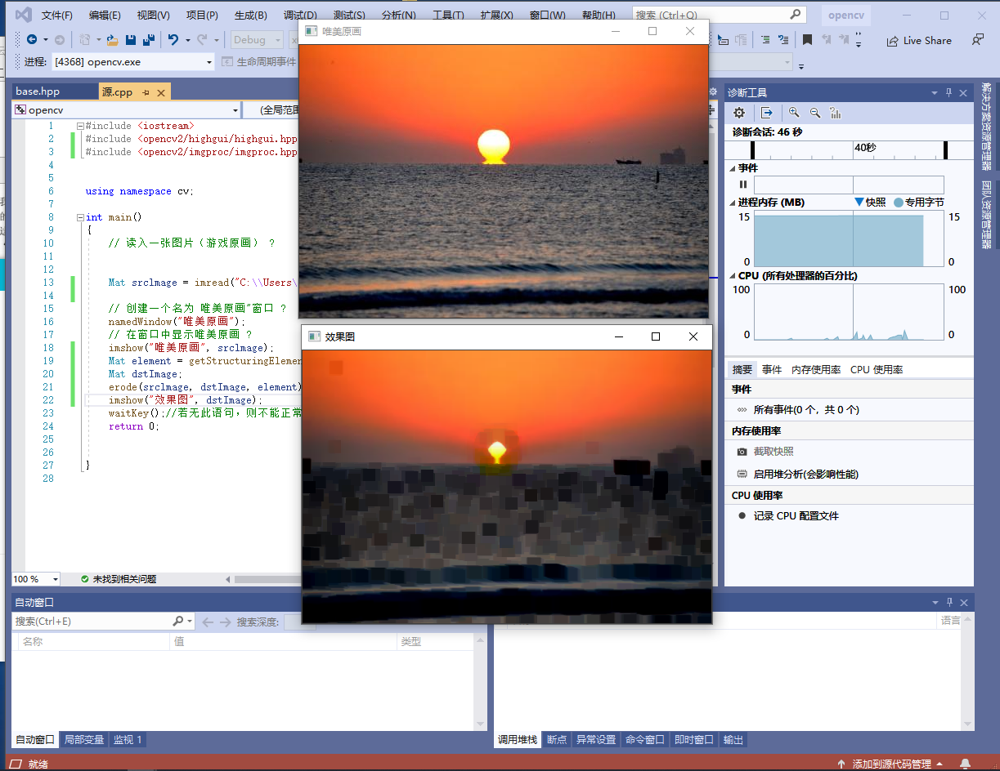
#### 1.4.3图像模糊
代码如下：
```c++
#include <iostream> 
#include <opencv2/highgui/highgui.hpp> 
#include <opencv2/imgproc/imgproc.hpp>


using namespace cv;

int main()
{
	// 读入一张图片（游戏原画） ?


	Mat srclmage = imread("C:\\Users\\HUAT_IAE\\source\\repos\\opencv\\opencv\\qq.jpg");

	// 创建一个名为 唯美原画"窗口 ?
	namedWindow("唯美原画");
	// 在窗口中显示唯美原画 ?
	imshow("唯美原画", srclmage);
	Mat dstImage;
	blur(srclmage, dstImage, Size(7, 7));
	imshow("均值滤波效果图", dstImage);
	waitKey();//若无此语句，则不能正常显示图像
	return 0;


}
```
测试结果如下图所示：
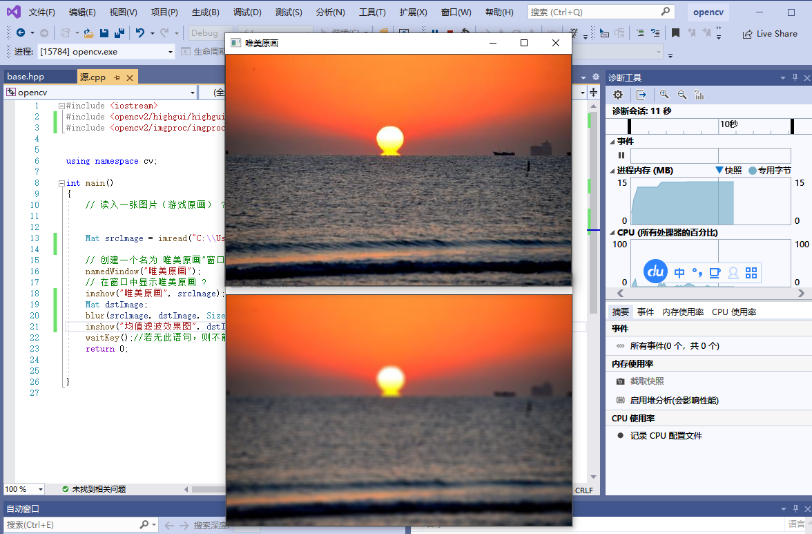

#### 1.4.4 canny的边缘检测
代码如下
```c++
#include <iostream> 
#include <opencv2/highgui/highgui.hpp> 
#include <opencv2/imgproc/imgproc.hpp>


using namespace cv;

int main()
{
	// 读入一张图片（游戏原画） ?


	Mat srclmage = imread("C:\\Users\\HUAT_IAE\\source\\repos\\opencv\\opencv\\qq.jpg");

	// 创建一个名为 唯美原画"窗口 ?
	namedWindow("唯美原画");
	// 在窗口中显示唯美原画 ?
	imshow("唯美原画", srclmage);
	Mat edge, grayImage;//参数定义
	//转为灰度图像
	cvtColor(srclmage, grayImage, COLOR_BGR2GRAY);
	//先试用3*3内核降噪
	blur(grayImage, edge, Size(3, 3));
	//运行canny算子
	Canny(edge, edge, 3, 9, 3);
	imshow("均值滤波效果图", edge);
	waitKey();//若无此语句，则不能正常显示图像
	return 0;


}
```
测试结果如下图所示：
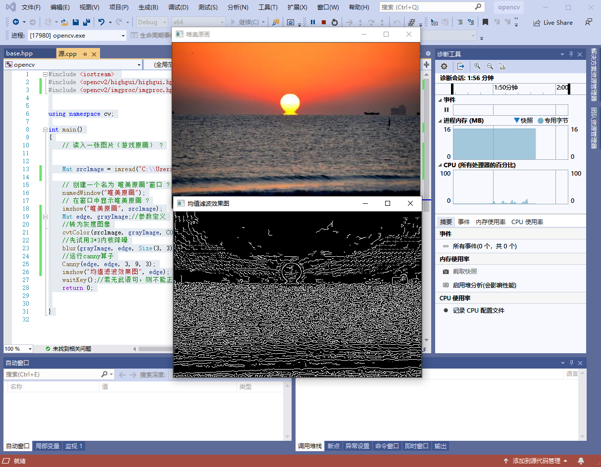

### 1.5 opencv视频处理

#### 1.5.1读取播放视频
代码如下：
```c++
#include "opencv2/opencv.hpp"
using namespace cv;

int main() {
	VideoCapture capture("C:\\Users\\HUAT_IAE\\source\\repos\\video\\video\\VID_20201124_214006.mp4");
	while (1) {
		Mat frame;
		capture >> frame;
		imshow("读取视频", frame);
		if (waitKey(30) >= 0) break;
	}
	return 0;
}
```
测试结果如下图所示：
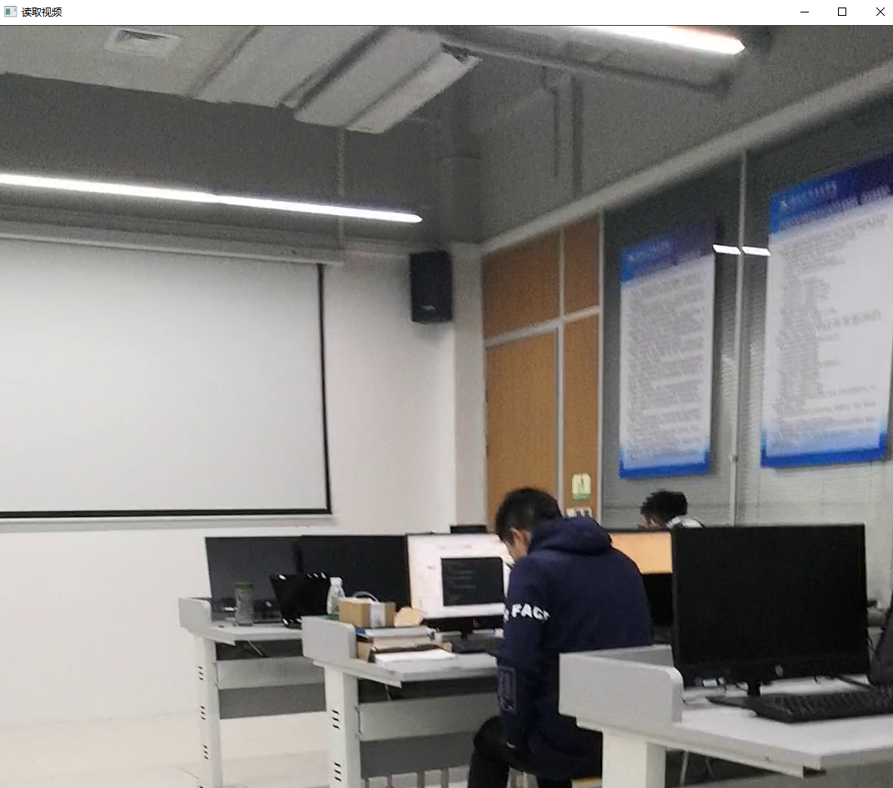

#### 1.5.2调用摄像头采集视频

原视频代码如下
```c++
#include "opencv2/opencv.hpp"
using namespace cv;

int main() {
	VideoCapture capture(0);
	while (1) {
		Mat frame;
		capture >> frame;
		imshow("读取视频", frame);
		if (waitKey(30) >= 0) break;
	}
	return 0;
}
```
测试结果如下图：
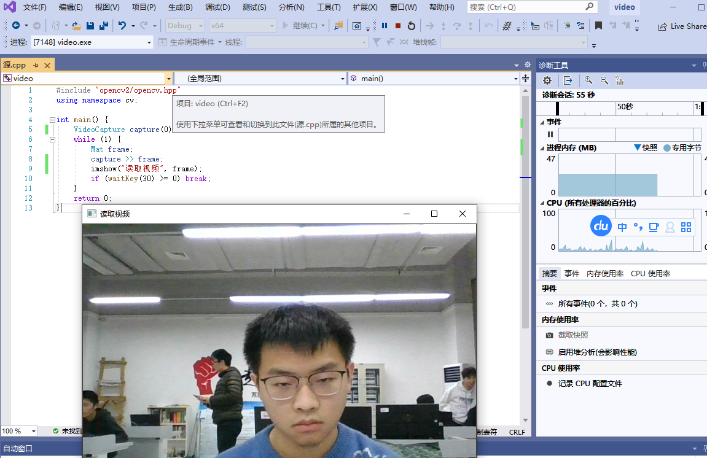

canny边缘检测代码如下：
```c++
#include "opencv2/opencv.hpp"
using namespace cv;

int main() {
	VideoCapture capture(0);
	Mat edges;
	while (1) {
		Mat frame;
		capture >> frame;
		cvtColor(frame, edges, COLOR_BGR2GRAY);
		blur(edges, edges, Size(7, 7));
		Canny(edges, edges, 0, 30, 3);
		imshow("被canny后的视频", edges);
		if (waitKey(30) >= 0) break;
	}
	return 0;
}
```
测试结果如下图所示：
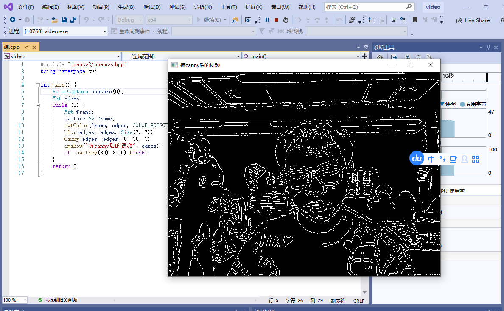

### 1.6本章小结
通过对本章的学习，对opencv的相关定义有了些许认知，学会了如何使用opencv对图像和视频进行操作，受益匪浅

## CH02

### 2.1彩色目标追踪：Camshift
 定义：根据鼠标框选区域的色度光谱来进行摄像头读入的视频目标的跟踪
 由于代码较为复杂这里不进行过多的赘述
### 2.2光流：optical flow
定义：光流用来指定时变图像中模式的运动速度，因为当物体在运动时，在图像上对应点的亮度模式也在运动。这种图像亮度模式的表观运动（ apparentmotion）就是光流。光流表达了图像的变化，由于它包含了目标运动的信息，因此可被观察者用来确定目标的运动情况。此处也没有深入了解

### 2.3“opencv.hpp”头文件认知

```#include<opencv2/opencv.hpp>```包括core.objdetect 、 imgproc、photo 、 video . features2d .objdetect,calib3d、ml、highgui、contrib等模块
### 2.4命名的规范约定
如下图所示：
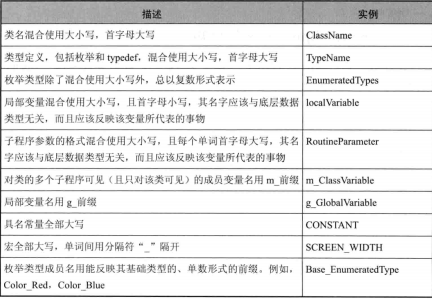
匈牙利命名法如下图所示：
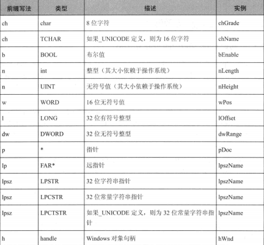

### 2.5argc和argv
- 定义：argc和l argc中的 arg 指的是“参数”(例如:arguments，argument counter 和argument vector)。其中，argc为整数，用来统计运行程序时送给main函数的命令行参数的个数;而* argv[ ]:为字符串数组，用来存放指向字符串参数的指针数组，每一个元素指向一个参数。
- 含义：
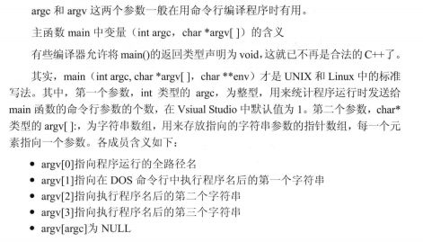

### 2.6 main函数的几种写法
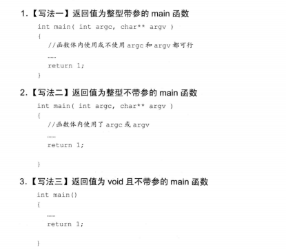

### 2.7格式输出函数printf简单分析
定义：printf函数是我们经常会用到的格式输出函数，其关键字最末一个字母f即为“格式”( format）之意。其功能是按用户指定的格式，把指定的数据显示到窗口中。printf函数调用的一般形式如下:
int printf(const char*format, ...);即;
int printf(”格式控制字符串”，输出表列];
下图表为用法
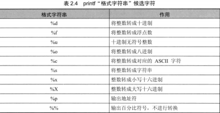
特殊规定字符
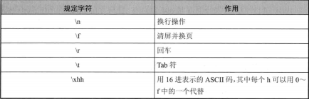

### 2.8本章小结
本章对opencv有了宏观的认识，了解有关命名规范和相关语言的知识，获益良多。

## CH03

### 3.1图像的载入，显示和输出到文件

#### 3.1.1opencv的命名空间
可以用以下三句作为标配

#include <opencv2>/core/core.hpp>
#include <opencv2/highui/highgui.cpp>
using namespace cv;
#### 3.1.2 Mat类解析 
定义：用于保存图像和其他矩阵数据的数据结构，默认尺寸为0
本节需要Mat代码 Mat srcImage=imread（“dota.jpg”）;
#### 3.1.3图像的载入和显示概述
对应了两个函数，分别是imread（）和imshow（）
#### 3.1.4图像的载入：imread（）函数
原型：Mat imread（const string&filename，intflage=1）;
(1)第一个参数，const string&类型的 filename，填我们需要载入的图片路径名。在 Windows 操作系统下，OpenCV的 imread函数支持如下类型的图像载入。
- Windows位图:*.bmp, *.dib
- JPEG文件:*.jpeg, *.-jpg,*.jpeJPEG2000文件:*.jp2
- PNG图片: *.png
- 便携文件格式:*.pbm,* .pgm, *.ppm
- Sun rasters光栅文件:*.sr, *.ras
- TIFF文件: *.tiff,*.tif
(2）第二个参数，int类型的flags，为载入标识，它指定一个加载图像的颜色类型。可以看到它自带默认值1，所以有时候这个参数在调用时可以忽略。在看了下面的讲解之后，我们就会发现，如果在调用时忽略这个参数，就表示载入三通道的彩色图像。这个参数可以在 OpenCV中标识图像格式的枚举体中取值。通过转到定义，我们可以在higui_c.h中发现这个枚举的定义是这样的:

- cv_LOAD_IMAGE_UNCHANGED——等价取值为-1，这个标识在新版本中已被废置，忽略。
- cV_LOAD_IMAGE_GRAYSCALE——等价取值为0，如果取这个标识的话，始终将图像转换成灰度再返回。
- cv_LOAD_IMAGE_COLOR——等价取值为1，如果取这个标识，总是转换图像到彩色再返回。
- cV_LOAD_IMAGE_ANYDEPTH———等价取值为2，如果取这个标识，且载入的图像的深度为16位或者32位，就返回对应深度的图像，否则，就转换为8位图像再返回。
需要说明的是,如果输入有冲突的标志,将采用较小的数字值。比如CV_LOAD_IMAGE_COLOR | CV_LOAD_IMAGE_ANYCOLOR将载入三通道图。而如果想要载入最真实无损的源图像，可以选择CV_LOAD_IMAGE_ANYDEPTH |cV_LOAD_IMAGE_ANYCOLOR。
#### 3.1.5 图像的显示： imshow（）函数
imshow()函数用于在指定的窗口显示图像
原型：void imshow（const string&winname，InputArray mat）;
第一个参数：填需要显示的窗口标识。
第二个参数：填需要显示的图像
imshow函数用于在指定的窗口中显示图像。如果窗口是用cv_WINDOw_AUTOSIZE（默认值）标志创建的，那么显示图像原始大小。否则，将图像进行缩放以适合窗口。而 imshow函数缩放图像，取决于图像的深度，具体如下。

- 如果载入的图像是8位无符号类型(8-bit unsigned),就显示图像本来的样子。
- 如果图像是16位无符号类型(16-bit unsigned)或32位整型(32-bit integer),便用像素值除以256。也就是说，值的范围是[0,255 x 256]映射到[0,255]。
- 如果图像是32位浮点型（32-bit floating-point)，像素值便要乘以255。也就是说，该值的范围是[0,1]映射到[0,255]。

#### 3.1.6关于InputArray类型
简单地当做Mat类型
#### 3.1.7创建窗口：nameWindow（）函数
namedWindow函数用于创建一个窗口。若是简单地进行图片显示，可以略去namedWindow 函数的调用，即先调用imread 读入图片，然后用 imshow直接指定出窗口名进行显示即可。但需要在显示窗口之前就用到窗口名时，比如我们后面会马上讲到滑动条的使用，要指定滑动条依附到某个窗口上，就需要namedWindow函数先创建出窗口，显式地规定窗口名称了。
#### 3.1.8 输出图像到文件: imwrite()函数
在OpenCV中，输出图像到文件一般采用imwrite函数，它的声明如下。
bool imwrite lconst stringh filename,InputArray img, const vector<int>& params=vector<int>4 ) :
(1）第一个参数，const string&类型的filename，填需要写入的文件名。注意要带上后缀，如“123-jpg”。
(2）第二个参数，InputArray类型的 img，一般填一个Mat类型的图像数据。(3）第三个参数，const vector<int>&类型的params，表示为特定格式保存的参数编码。它有默认值vector<int>()，所以一般情况下不需要填写。而如果要填写的话，有下面这些需要了解的地方:
- 对于JPEG格式的图片，这个参数表示从0到100 的图片质量(cv_IMWRITE_JPEG_QUALITY)，默认值是95。
- 对于PNG格式的图片，这个参数表示压缩级别（CV_IMWRITE_PNG_COMPRESSION）从0到9。较高的值意味着更小的尺寸和更长的压缩时间，默认值是3。
- 对于PPM，PGM，或PBM格式的图片，这个参数表示一个二进制格式标志(CV_IMWRITE_PXM_BINARY)，取值为0或1，默认值是1。
imwrite函数用于将图像保存到指定的文件。图像格式是基于文件扩展名的，可保存的扩展名和 imread中可以读取的图像扩展名一致。


#### 3.1.9综合示例程序：图像的载入显示和输出
代码如下：
```
#include<opencv2/core/core.hpp>  
#include<opencv2/highgui/highgui.hpp>  

using namespace cv;


int main()
{
	//-----------------------------------【一、图像的载入和显示】--------------------------------------  
	//     描述：以下三行代码用于完成图像的载入和显示  
	//--------------------------------------------------------------------------------------------------  

	Mat girl = imread("girl.png"); //载入图像到Mat  
	namedWindow("【1】动漫图"); //创建一个名为 "【1】动漫图"的窗口   
	imshow("【1】动漫图", girl);//显示名为 "【1】动漫图"的窗口   

	//-----------------------------------【二、初级图像混合】--------------------------------------  
	//     描述：二、初级图像混合  
	//-----------------------------------------------------------------------------------------------  
	//载入图片  
	Mat image = imread("dota.png");
	Mat logo = imread("dota_logo.png");

	//载入后先显示  
	namedWindow("【2】原画图");
	imshow("【2】原画图", image);

	namedWindow("【3】logo图");
	imshow("【3】logo图", logo);

	//定义一个Mat类型，用于存放，图像的ROI  
	Mat imageROI;
	//方法一  
	//imageROI = image(Rect(800, 350, logo.cols, logo.rows));
	//方法二  
	imageROI=image(Range(350,350+logo.rows),Range(800,800+logo.cols));  

	//将logo加到原图上  
	addWeighted(imageROI, 0.5, logo, 0.3, 0., imageROI);

	//显示结果  
	namedWindow("【4】原画+logo图");
	imshow("【4】原画+logo图", image);

	//-----------------------------------【三、图像的输出】--------------------------------------  
	//     描述：将一个Mat图像输出到图像文件  
	//-----------------------------------------------------------------------------------------------  
	//输出一张jpg图片到工程目录下  
	imwrite("复合图片.png", image);

	waitKey();

	return 0;
}
```
测试结果如下：
显示图片
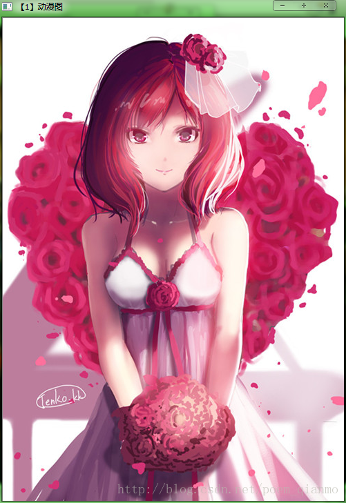
要复合的图片
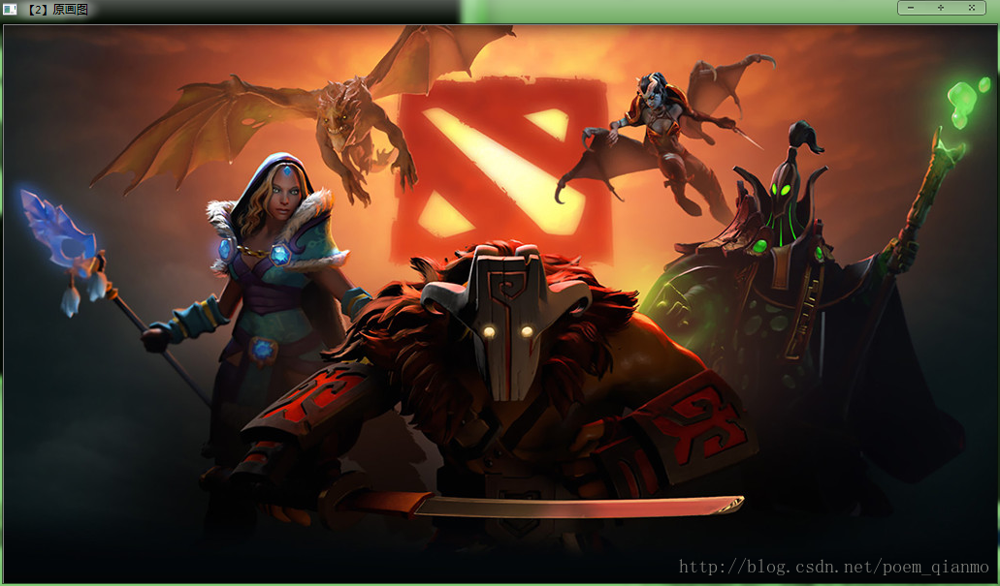
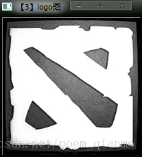
复合后的图片

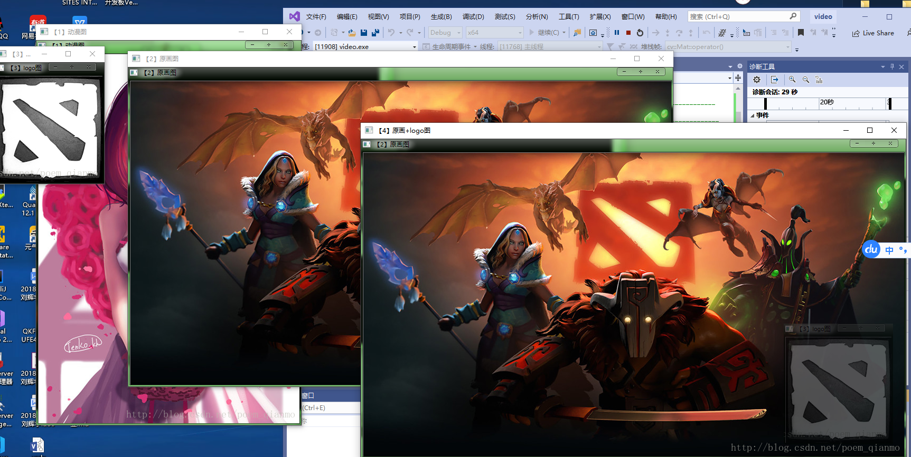

### 3.2滑动条的创建和使用
定义：用于动态调节参数的一种工具，依附窗口而存在

#### 3.2.1创建滑动条：createTrackerbar（）函数
实例程序如下：
```
#include <opencv2/opencv.hpp>
#include "opencv2/highgui/highgui.hpp"
using namespace cv;
#define WINDOW_NAME "[线性混合实例]"
const int g_nMaxAlphaValue = 100;
int g_nAlphaValueSlider;
double g_dBetaValue;
double g_dAlphaValue;
Mat g_srcImage1;
Mat g_srcImage2;
Mat g_dstImage;
void on_Trackbar(int, void*)
{
    g_dAlphaValue = (double)g_nAlphaValueSlider / g_nMaxAlphaValue;
    g_dBetaValue = (1.0 - g_dAlphaValue);
    /*
    addWeighted这个函数的原型如下所示，可以看出这个函数最小需要6个参数。
    1、 第1个参数，输入图片1，
    2、第2个参数，图片1的融合比例
    3、第3个参数，输入图片2
    4、第4个参数，图片2的融合比例
    5、第5个参数，偏差
    6、第6个参数，输出图片
    */
    addWeighted(g_srcImage1, g_dAlphaValue, g_srcImage2, g_dBetaValue, 0.0, g_dstImage);
    imshow(WINDOW_NAME, g_dstImage);

}
int main()
{
    //加载图像 (两图像的尺寸需相同)
    g_srcImage1 = imread("C:\\Users\\HUAT_IAE\\source\\repos\\opencv\\opencv\\1.jpg");
    g_srcImage2 = imread("C:\\Users\\HUAT_IAE\\source\\repos\\opencv\\opencv\\1.1.jpg");
    if (!g_srcImage1.data)
    {
        printf("C:\\Users\\HUAT_IAE\\source\\repos\\opencv\\opencv\\1.jpg....unsucessful");
        return -1;
    }
    if (!g_srcImage2.data)
    {
        printf("C:\\Users\\HUAT_IAE\\source\\repos\\opencv\\opencv\\1.1.jpg....unsucessful");
        return -1;
    }
    //设置滑动条初值为70
    g_nAlphaValueSlider = 70;
    //创建窗体
    namedWindow(WINDOW_NAME, 1);
    char TrackbarName[50];
    //sprintf突然发现炒鸡好用啊啊，以前竟然没发现
    sprintf_s(TrackbarName, "透明度 %d", g_nMaxAlphaValue);
    //在创建的窗体中创建一个滑动条控件
    createTrackbar(TrackbarName, WINDOW_NAME, &g_nAlphaValueSlider, g_nMaxAlphaValue, on_Trackbar);
    //结果在回调函数中显示
    on_Trackbar(g_nAlphaValueSlider, 0);
    //按任意键退出
    waitKey(0);
    return 0;
}
```
代码运行截图:
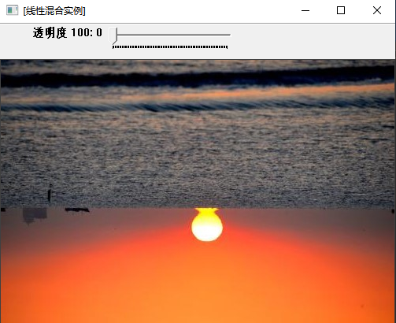
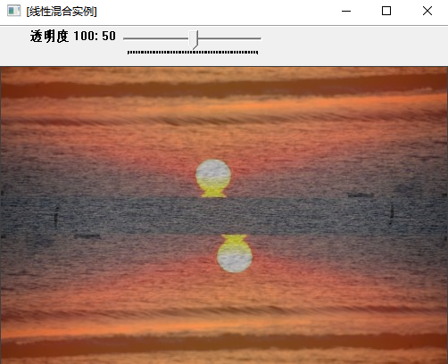
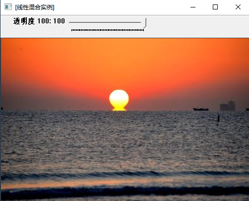

#### 3.2.2获取当前轨迹条的位置：getTrackbarPos（）函数
下面这个函数用于获取当前轨迹条的位置并返回。
C++: int getTrackbarPos(conststrings trackbarname，conststring& winname) ;

- 第一个参数，const string&类型的 trackbarname，表示轨迹条的名字。

- 第二个参数，const string&类型的winname，表示轨迹条的父窗口的名称。

### 3.3鼠标操作
OpenCV 中的鼠标操作和滑动条的消息映射方式很类似，都是通过一个中介函数配合一个回调函数来实现的。创建和指定滑动条回调函数的函数为createTrackbar，而指定鼠标操作消息回调函数的函数为SetMouseCallback
原型：C++ : void setMouseCallback(conststring& winname，MouseCallback onMouse,void* userdata=0 )

第一个参数：窗口的名字
第二个参数：指定窗口里每次鼠标发生时被调用的函数指针
第三个参数：用户传递到回调的参数，默认值为0

示例程序如下
```
#include <opencv2/opencv.hpp>
using namespace cv;
#define WINDOW_NAME "【鼠标操作】"
//--------------------【全局函数声明部分】---------------------
//     描述：全局函数的声明
//----------------------------------------------------------
void on_MouseHandle(int event, int x, int y, int flags, void* param);
void DrawRactangle(Mat& img, Rect box);
//---------------------【全局变量声明部分】--------------------
//     描述：全局变量的声明
//----------------------------------------------------------
Rect g_rectangle;
bool g_bDrawingBox = false;//是否进行绘制
RNG g_rng(12345);
int main(int argc, char** argv)
{
	//准备参数
	g_rectangle = Rect(-1, -1, 0, 0);
	Mat srcImage(600, 800, CV_8UC3), tempImage;
	srcImage.copyTo(tempImage);
	g_rectangle = Rect(-1, -1, 0, 0);
	srcImage = Scalar::all(0);
	// 设置鼠标操作回调函数
	namedWindow(WINDOW_NAME);
	setMouseCallback(WINDOW_NAME, on_MouseHandle, (void*)&srcImage);
	// 程序主循环，当进行绘制的标识符为真的时候进行绘制
	while (1)
	{
		srcImage.copyTo(tempImage);       // 复制源图到临时变量
		if (g_bDrawingBox)
		{
			DrawRactangle(tempImage, g_rectangle);   //进行绘制
		}
		imshow(WINDOW_NAME, tempImage);
		if (waitKey(10) == 27)            // 按下ESC键，程序退出
			break;
	}
	return 0;
}
//------------------------【on_MouseHandle(函数)】------------
//     描述：鼠标回调函数，根据不同的鼠标事件进行不同的操作
//-----------------------------------------------------------
void on_MouseHandle(int event, int x, int y, int flags, void* param)
{
	Mat& image = *(Mat*)param;
	switch (event)
	{
	case EVENT_MOUSEMOVE:
	{
		if (g_bDrawingBox)   //如果是否进行绘制的标识符为真，则记录下长和宽到RECT型变量中
		{
			g_rectangle.width = x - g_rectangle.x;
			g_rectangle.height = y - g_rectangle.y;
		}
	}
	break;
	// 左键按下消息
	case EVENT_LBUTTONDOWN:
	{
		g_bDrawingBox = true;
		g_rectangle = Rect(x, y, 0, 0);   //记录起点
	}
	break;
	//左键抬起消息
	case EVENT_LBUTTONUP:
	{
		// 标识符为false
		g_bDrawingBox = false;
		//对宽和高小于0的处理
		if (g_rectangle.width < 0)
		{
			g_rectangle.x += g_rectangle.width;
			g_rectangle.width *= -1;
		}
		if (g_rectangle.height < 0)
		{
			g_rectangle.y += g_rectangle.height;
			g_rectangle.height *= -1;
		}
		//调用函数进行绘制
		DrawRactangle(image, g_rectangle);
	}
	break;
	}
}
void DrawRactangle(Mat& img, Rect box)
{
	// tl(top left) br(below right)
	rectangle(img, box.tl(), box.br(), Scalar(g_rng.uniform(0, 255), g_rng.uniform(0, 255), g_rng.uniform(0, 255)));
}
```

运行结果如下：
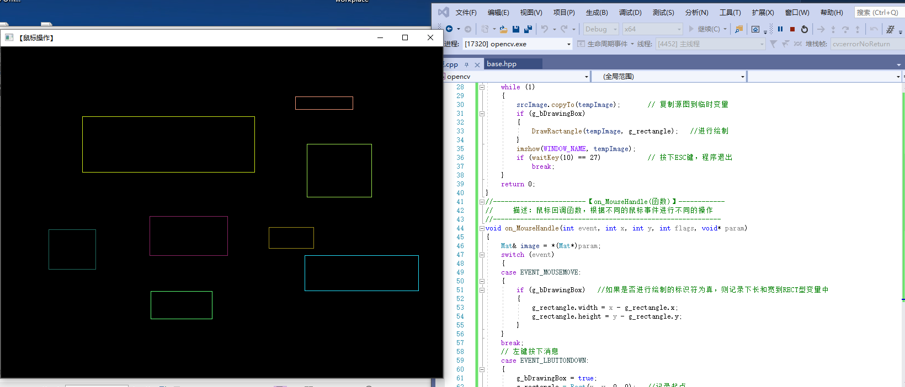

### 3.4本章小结
本章学习了opencv的图形用户界面模块highgui中重要的几个方面，如图像的载入，显示与输出图像到文件，以及滑动条和鼠标操作，代码逐渐复杂，学起来也有点力不从心


