# CH01_03

## 第一部分 软件安装

### 安装 Visual Studio 2019 Community

软件的下载地址为：https://visualstudio.microsoft.com/zh-hans/downloads/

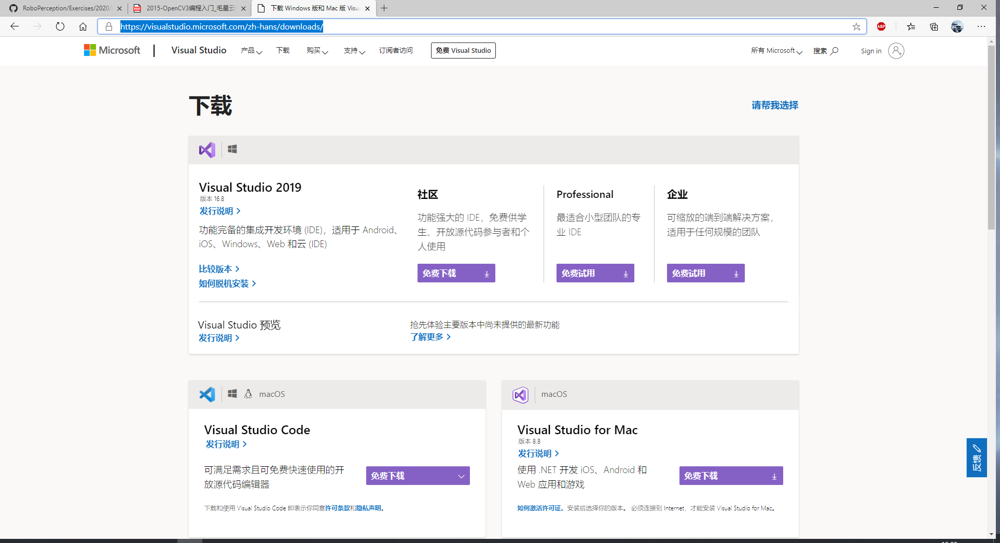

安装完成以后会打开 Visual Studio Installer

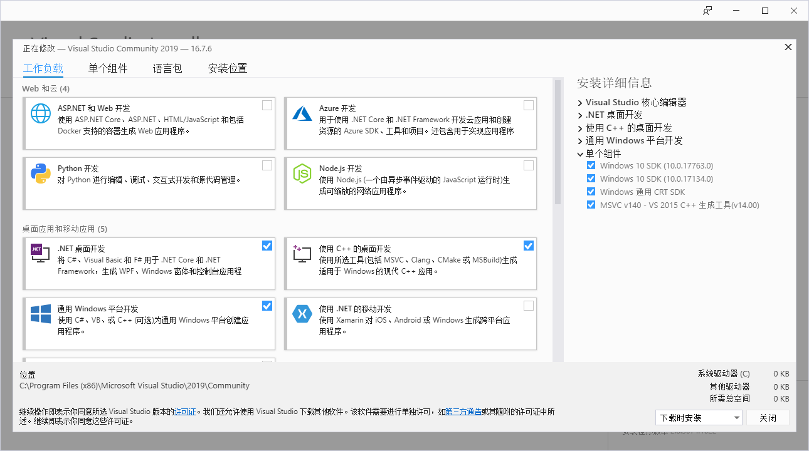

P.S. 此处需要选择桌面开发，否则后面可能会出错。

### 安装OpenCV 

此处笔者使用的是OpenCV 3.4版本，其他版本同样适用。

OpenCV官方网站的网址是：https://www.opencv.org

下载后直接安装到我们需要的路径中，软件要求路径中没有中文。

完成后可以看见的目录如下：

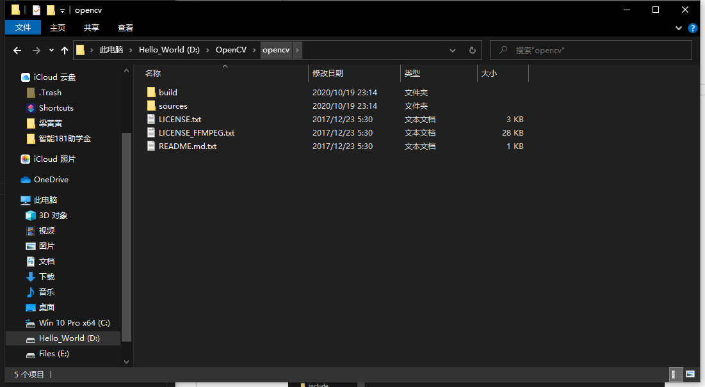

### 配置环境变量

按照下图中的顺序，在我的电脑上点击右键选择属性并打开高级系统设置-环境变量

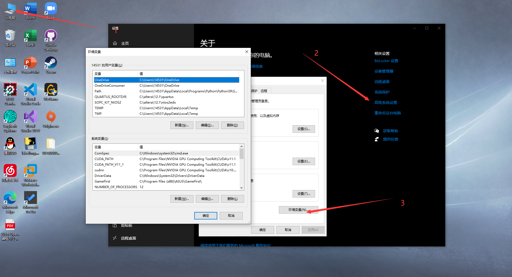

然后将我们安装的OpenCV中的Dll文件的路径添加到环境变量中。

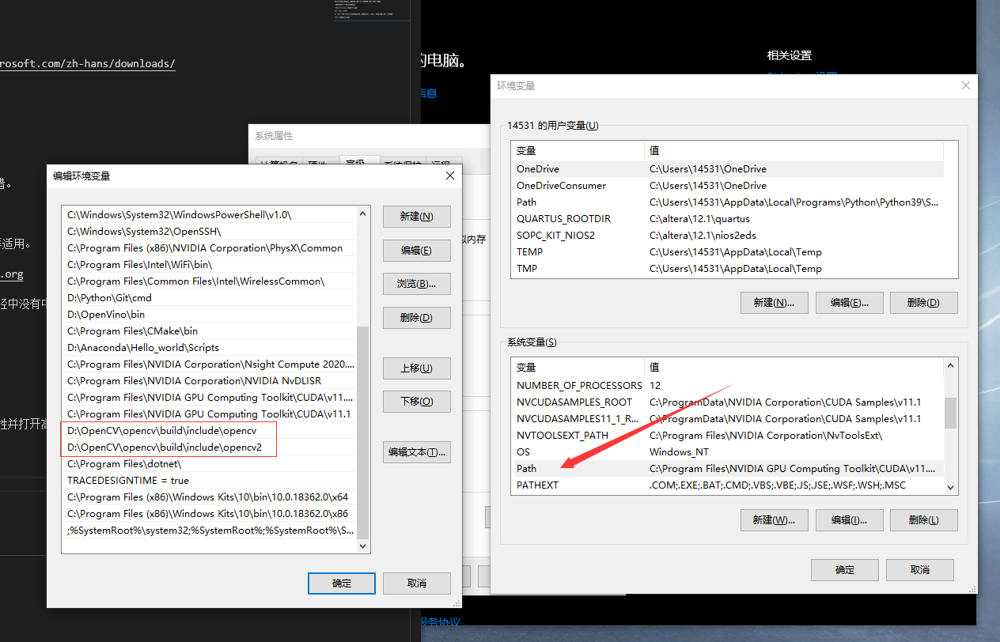

确定后重启电脑，使环境变量生效。

### 配置项目环境

在VS中，我们的每一个项目，都需要我们单独为其配置环境，否则软件会一直报错。

我们打开 VS 2019 并新建一个Windows桌面向导项目

 

 在后面的选择中，我们需要选择项目的路径然后会弹出窗口让我们选择：

 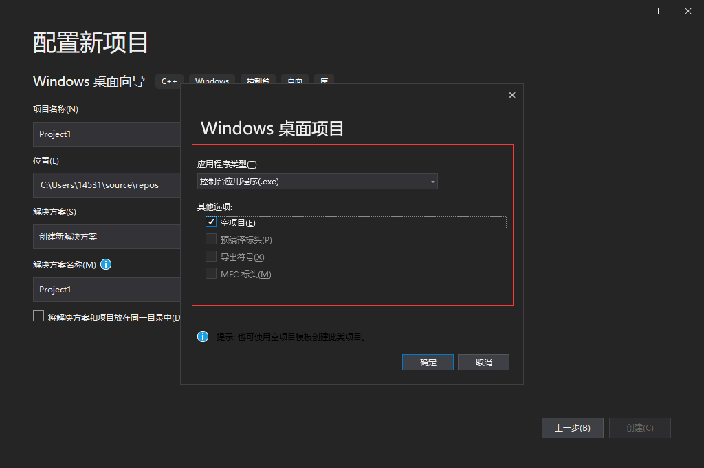

 项目创建完成后，我们打开项目：

 右键选择源文件，然后依次选择添加->新建项 然后点击创建，并如图创建文件：

 

 代码如下：

 
```
#include <stdio.h>
#include"opencv2/opencv.hpp"  
using namespace cv;


int main()
{
    
    VideoCapture a(0);
    Mat edge;
    while (1)
    {
        Mat frame;
        a >> frame;
        cvtColor(frame, edge, CV_BGR2GRAY);
        blur(edge, edge, Size(7, 7));
        Canny(edge, edge, 0, 30, 3);
        imshow("被canny后的视频", edge);
        waitKey(2);


    }
    return 0;
}
```
然后我们依次选择菜单栏中的项目->属性：

 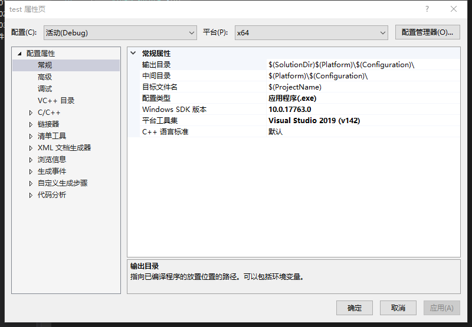

 我们需要注意的是我们第一件事是选择最上方的配置是：Debug 和 x64

 然后我们如图添加路径：

 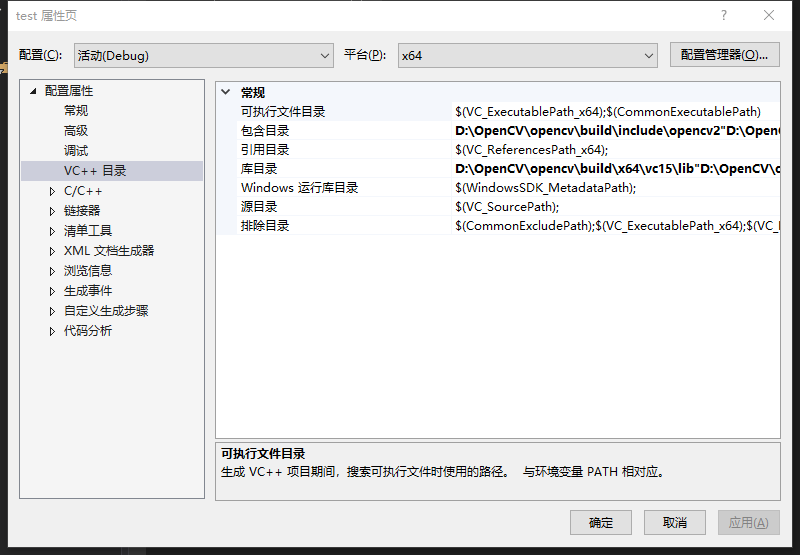
 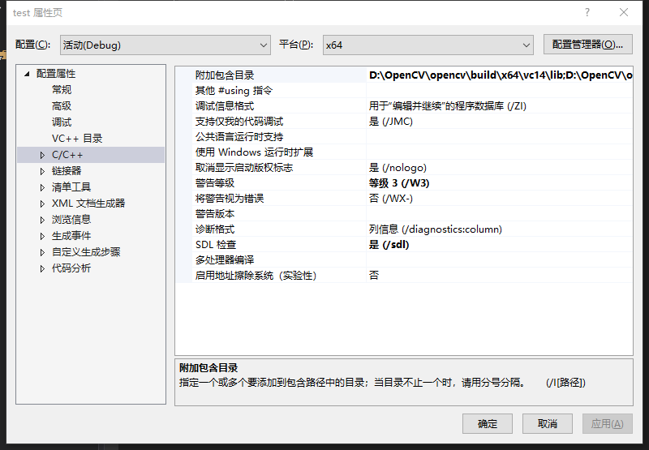
 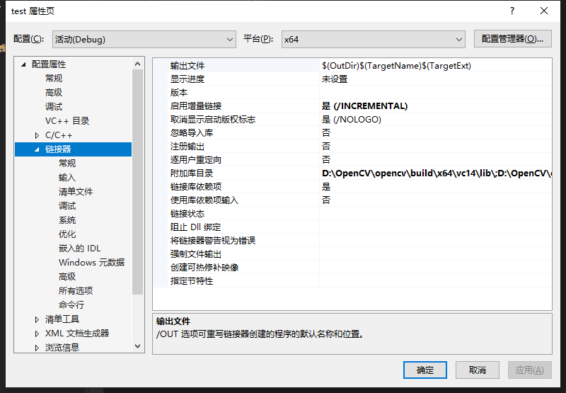
 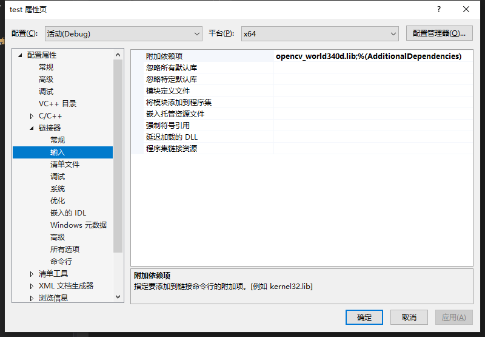

 路径添加完成后，可以看到代码不会再报错，此时可以运行我们的代码，结果如下：

  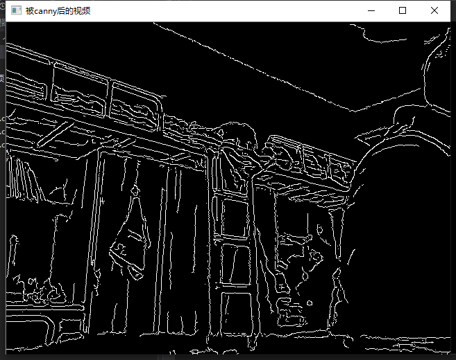

  此时说明我们的OpenCV已经安装完成。

  ## 代码测试分析和理解

```
#include <stdio.h>
#include"opencv2/opencv.hpp"  
using namespace cv;


int main()
{
    
    VideoCapture a(0);//载入摄像头
    Mat edge;
    Mat srcImage = imread("C:/Users/14531/Desktop/201809023_Neil/images/6.png");//载入图片

    imshow("原始图", srcImage);//显示图片

    Mat element = getStructuringElement(MORPH_RECT, Size(15, 15));
    Mat dstImage;
    erode(srcImage, dstImage, element);//进行腐蚀操作
  
    imshow("腐蚀操作", dstImage);

    Mat dstImage2;
    blur(srcImage, dstImage2, Size(7, 7));//均值滤波操作

    imshow("均值滤波", dstImage2);

    Mat dstImage3,edge1,grayImage;

    dstImage3.create(srcImage.size(), srcImage.type());

    cvtColor(srcImage, grayImage, COLOR_BGR2GRAY);
    blur(grayImage, edge1, Size(3, 3));
    Canny(edge1, edge1, 3, 9, 3);//使用Canny边缘检测
    imshow("Canny边缘检测", edge1);


    while (1)
    {
        Mat frame;
        a >> frame;
        cvtColor(frame, edge, CV_BGR2GRAY);
        blur(edge, edge, Size(7, 7));
        Canny(edge, edge, 0, 30, 3);
        imshow("被canny后的视频", edge);
        waitKey(2);
    }
    return 0;
}

```
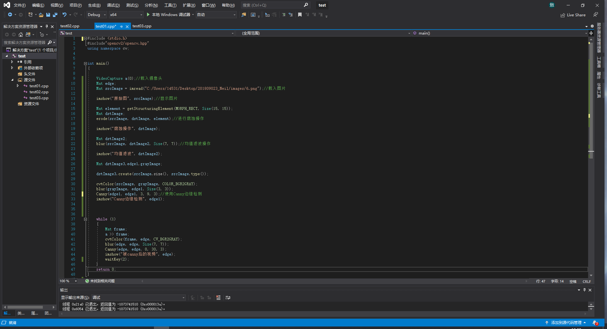
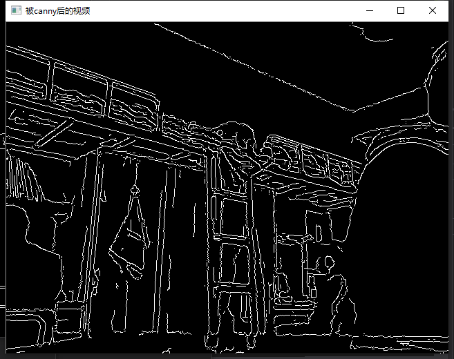
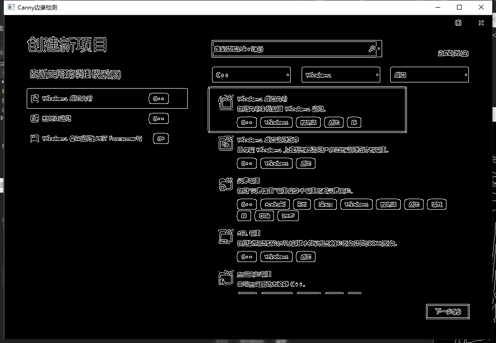
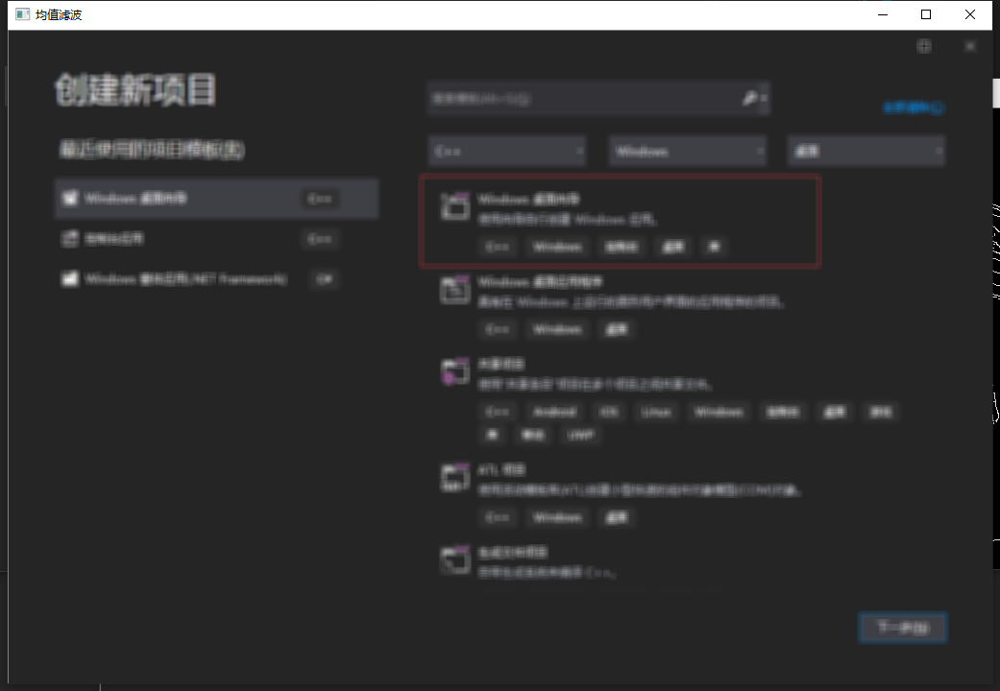
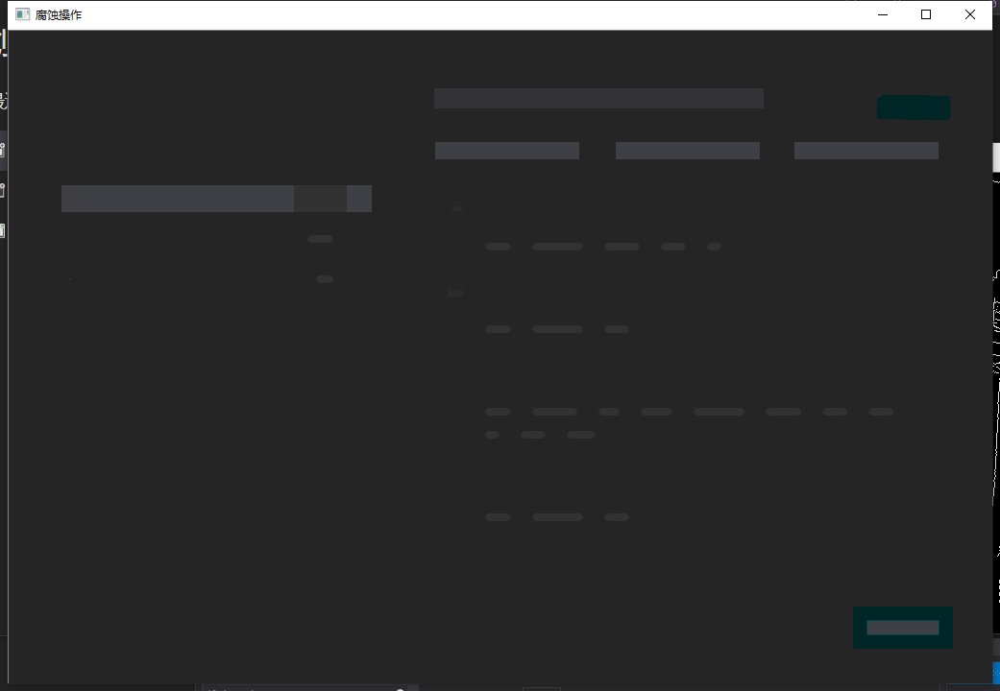


```
#include<opencv2/opencv.hpp>
#include<vector>
using namespace cv;
using namespace std;

void createAlphaMat(Mat& mat) {
	for (int i = 0; i < mat.rows; i++) {
		for (int j = 0; j < mat.cols; j++) {
			Vec4b& rgba = mat.at<Vec4b>(i, j);
			rgba[0] = UCHAR_MAX;
			rgba[1] = saturate_cast<uchar>((float(mat.cols - j)) / ((float)mat.cols) * UCHAR_MAX);
			rgba[2] = saturate_cast<uchar>((float(mat.cols - i)) / ((float)mat.rows) * UCHAR_MAX);
			rgba[3] = saturate_cast<uchar>(0.5 * (rgba[1] + rgba[2]));
		}
	}
}

int main() {
	//创建带Alpha通道的Mat
	Mat mat(480, 640, CV_8UC4);
	createAlphaMat(mat);

	vector<int>compression_params;
	//opencv3
	compression_params.push_back(IMWRITE_PNG_COMPRESSION);
	compression_params.push_back(9);

	try {
		imwrite("透明Alpha值图.png", mat, compression_params);
		imshow("生成的PNG图", mat);
		fprintf(stdout, "PNG图片文件的alpha数据保存完毕~\n可以在工程目录下查看由imwrite函数生成的图片\n");
		waitKey(0);
	}
	catch (runtime_error& ex) {
		fprintf(stderr, "图像转换成PNG格式发生错误：%s\n", ex.what());
		return 1;
	}
	return 0;
}
```


```
#include <opencv2/imgproc.hpp>
#include <opencv2/highgui.hpp>
#include <vector>
using namespace std;

using namespace cv;

int main()
{
	Mat img = imread("1.jpg", IMREAD_ANYDEPTH | IMREAD_ANYCOLOR);//载入最真实的图像

	namedWindow("Display", WINDOW_FULLSCREEN);

	imshow("Display", img);

	vector<int> compression_params;
	compression_params.push_back(IMWRITE_PNG_COMPRESSION);  //选择png
	compression_params.push_back(9); //在这个填入你要的图片质量

	imwrite("‪E:/vs2019/test/Project1/Project1/1.jpg", img, compression_params);

	waitKey(0);

	return 0;
}

```


```
#include <opencv2/core/core.hpp>
#include <opencv2/highgui/highgui.hpp>
using namespace cv;

int main()
{
	Mat girl = imread("2.jpg"); //载入 图像到Mat
	namedWindow("[1]动漫图"); //创建一个名为 ”[1]动漫图"的窗口
	imshow("[1]动漫图", girl);//显示名为"[1]动漫图"的窗口

	//载入图片
	Mat image = imread("1.jpg");
	Mat logo = imread("3.jpg");
	//载入后先显示
	namedWindow(" [2] 原画图"); imshow(" [2] 原画图", image);
	namedWindow(" [3] logo 图"); imshow("[3] logo 图", logo);

	//定义一个Mat类型，用于存放，图像的ROI
	Mat imageROI;
	//方法一
	imageROI = image(Rect(800, 350, logo.cols, logo.rows));
	//方法二
	// imageROI =
	image(Range(350, 350 + logo.rows), Range(800, 800 + logo.cols));

	// 将logo加到原图上
	addWeighted(imageROI, 0.5, logo, 0.3, 0., imageROI);

	//显示结果
	namedWindow(" [4] 原画+logo 图"); imshow("[4] 原画+logo 图", image);

	//输出一张jpg图片到工程目录下
	imwrite("由imwrite生成的图片.jpg", image);

	waitKey();

	return 0;
}
```

```
#include<opencv2/opencv.hpp>
#include<opencv2/highgui/highgui.hpp>

using namespace cv;

Mat src;
Mat dst;


//createTrackbar的回调函数
void myMedianBlur(int ksize, void* p);

int main()
{
	int kmin = 0;
	int kmax = 50;
	src = imread("1.jpg");
	if (!src.data)
	{
		perror("load failed:");
		exit(0);
	}
	imshow("src", src);

	namedWindow("中值滤波去除椒盐噪声");

	//需要注意这里，没有这行运行之后不是马上显示中值滤波结果，而是需要拖到滑动条才行
	//这也切实体现了createTrackbar函数去调用回调函数的机制
	myMedianBlur(kmin, NULL);

	createTrackbar("参数", "中值滤波去除椒盐噪声", &kmin, kmax, myMedianBlur);

	waitKey(0);
	return 0;
}
void myMedianBlur(int ksize, void* p)
{
	medianBlur(src, dst, ksize * 2 + 1);
	imshow("中值滤波去除椒盐噪声", dst);
}
```


```
#include <opencv2/opencv.hpp>
using namespace cv;
#define WINDOW_NAME "【鼠标操作】"
//--------------------【全局函数声明部分】---------------------
//     描述：全局函数的声明
//----------------------------------------------------------
void on_MouseHandle(int event, int x, int y, int flags, void* param);
void DrawRactangle(Mat& img, Rect box);
//---------------------【全局变量声明部分】--------------------
//     描述：全局变量的声明
//----------------------------------------------------------
Rect g_rectangle;
bool g_bDrawingBox = false;//是否进行绘制
RNG g_rng(12345);
int main(int argc, char** argv)
{
	//准备参数
	g_rectangle = Rect(-1, -1, 0, 0);
	Mat srcImage(600, 800, CV_8UC3), tempImage;
	srcImage.copyTo(tempImage);
	g_rectangle = Rect(-1, -1, 0, 0);
	srcImage = Scalar::all(0);
	// 设置鼠标操作回调函数
	namedWindow(WINDOW_NAME);
	setMouseCallback(WINDOW_NAME, on_MouseHandle, (void*)&srcImage);
	// 程序主循环，当进行绘制的标识符为真的时候进行绘制
	while (1)
	{
		srcImage.copyTo(tempImage);       // 复制源图到临时变量
		if (g_bDrawingBox)
		{
			DrawRactangle(tempImage, g_rectangle);   //进行绘制
		}
		imshow(WINDOW_NAME, tempImage);
		if (waitKey(10) == 27)            // 按下ESC键，程序退出
			break;
	}
	return 0;
}
//------------------------【on_MouseHandle(函数)】------------
//     描述：鼠标回调函数，根据不同的鼠标事件进行不同的操作
//-----------------------------------------------------------
void on_MouseHandle(int event, int x, int y, int flags, void* param)
{
	Mat& image = *(Mat*)param;
	switch (event)
	{
	case EVENT_MOUSEMOVE:
	{
		if (g_bDrawingBox)   //如果是否进行绘制的标识符为真，则记录下长和宽到RECT型变量中
		{
			g_rectangle.width = x - g_rectangle.x;
			g_rectangle.height = y - g_rectangle.y;
		}
	}
	break;
	// 左键按下消息
	case EVENT_LBUTTONDOWN:
	{
		g_bDrawingBox = true;
		g_rectangle = Rect(x, y, 0, 0);   //记录起点
	}
	break;
	//左键抬起消息
	case EVENT_LBUTTONUP:
	{
		// 标识符为false
		g_bDrawingBox = false;
		//对宽和高小于0的处理
		if (g_rectangle.width < 0)
		{
			g_rectangle.x += g_rectangle.width;
			g_rectangle.width *= -1;
		}
		if (g_rectangle.height < 0)
		{
			g_rectangle.y += g_rectangle.height;
			g_rectangle.height *= -1;
		}
		//调用函数进行绘制
		DrawRactangle(image, g_rectangle);
	}
	break;
	}
}
void DrawRactangle(Mat& img, Rect box)
{
	// tl(top left) br(below right)
	rectangle(img, box.tl(), box.br(), Scalar(g_rng.uniform(0, 255), g_rng.uniform(0, 255), g_rng.uniform(0, 255)));
}
```
