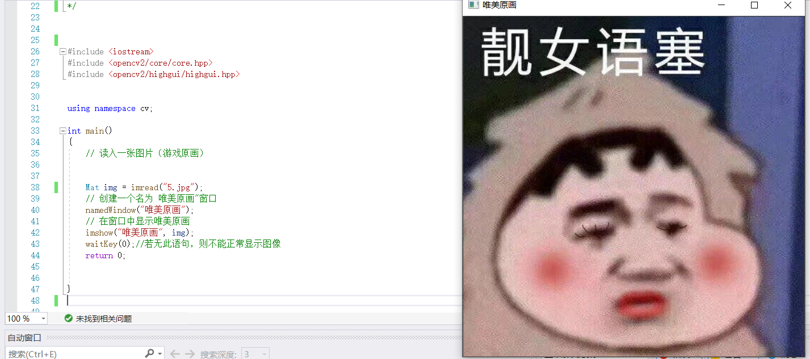
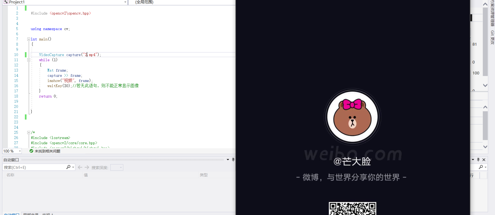
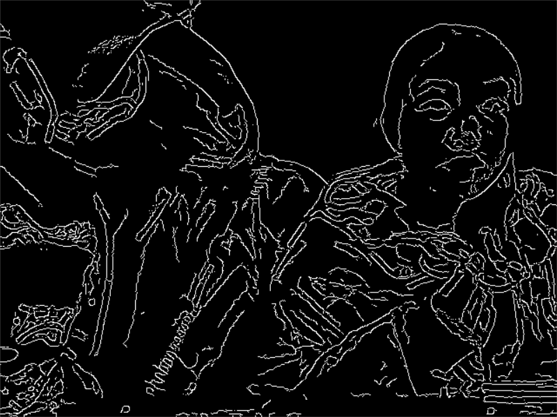
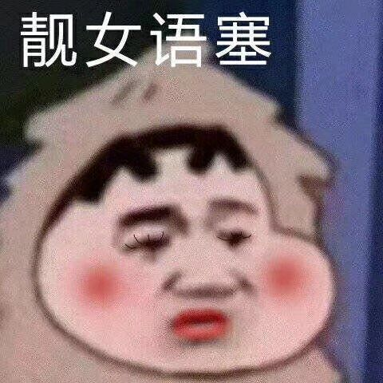
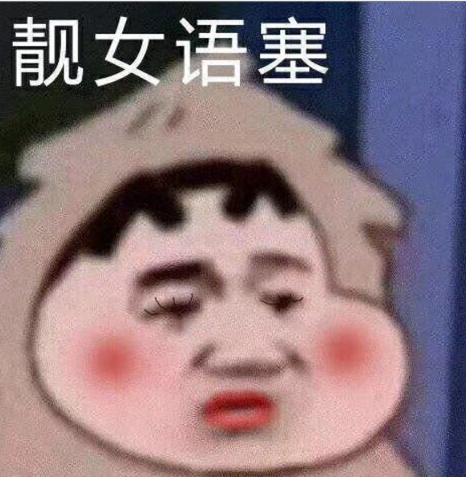
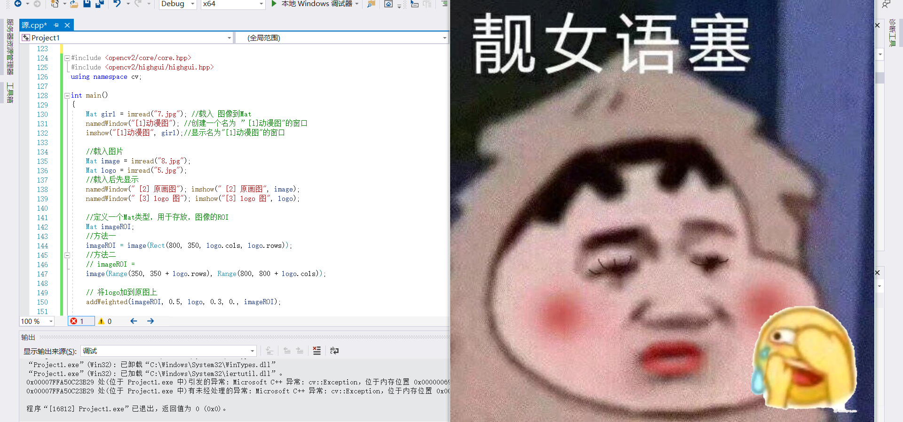
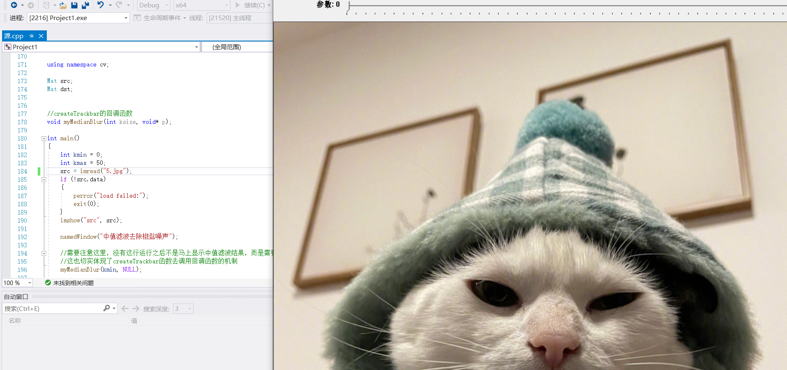
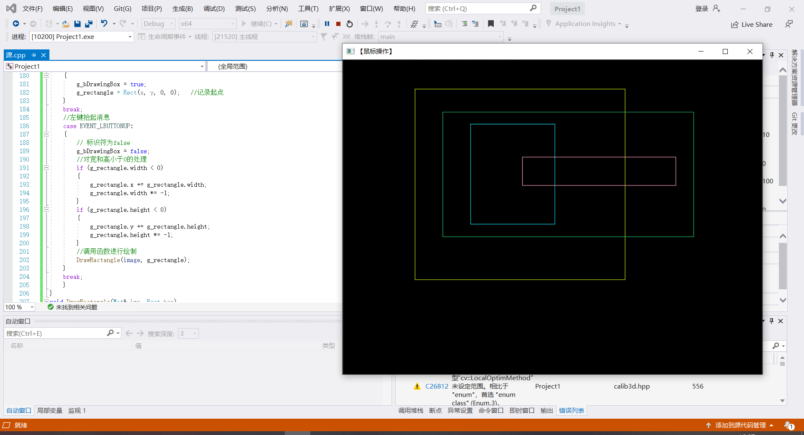
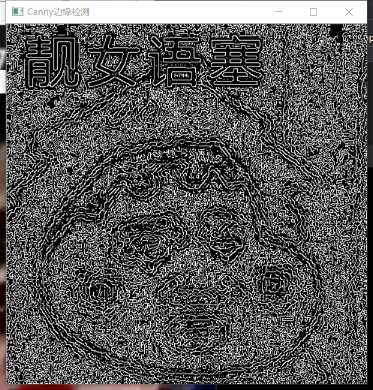
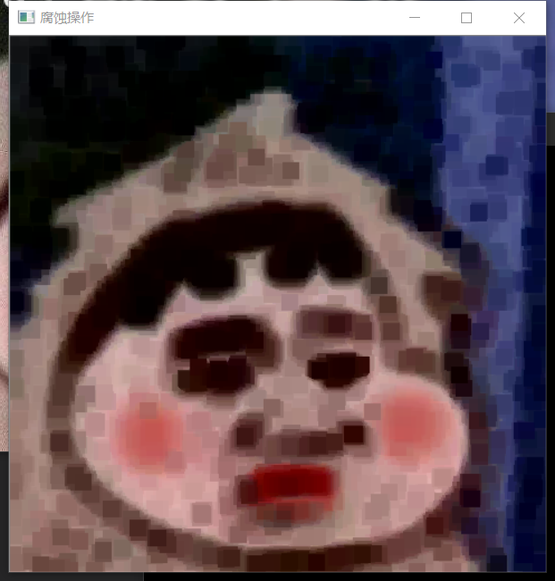

# 第一次作业 #
## 郭小凡 201809027 ##

# 搭建Visual Studio 2019 #
$环境配置流程$
1. 下载并安装VS2019，安装位置固定c盘。
2. 在“我的电脑”点击右键选择“属性”，选择“高级系统环境”。
3. 在用户变量中，点击Path变量并编辑，添加dll所在路径。
4. 确定后，重启以使得环境变量生效。
5. 下载OpenCV。
6. 配置环境：
在 Visual Studio 2019 中新建项目
选择路径“File->New->Project”，依次选择Language为C++，Platform为Windows，Project type为desktop,选择Windows Desktop Wizard，并选择Next,点击Create,并下弹出的对话框中选择，Application type 为Console, 选择Empty Project,点击OK，在Source files里面右键，添加New item:

## 1.1 图片显示 ##

$源代码$
```
#include  <iostream>
#include  <opencv2/core/core.hpp>
#include  <opencv2/highgui/highgui.hpp>  

using namespace cv;

int main()
{
	// 读入一张图片
	Mat img = imread("1.jpg");   // 创建一个窗口  
	namedWindow("唯美原画");   // 在窗口中显示图片
	imshow("唯美原画", img);
	waitKey(0);   //若无此语句，则不能正常显示图像
	return 0;
}
```

$实验步骤$
1. 添加源文件project1.cpp
2. 右键project1这个Project,选择Properties
3. 选择VC++ Directories，在Include Directories中
4. 添加C:\Programs\OpenCV\opencv411\build\include和C:\Programs\OpenCV\opencv411\build\include\opencv2 目录
5. 在Library Directories中添加C:\Programs\OpenCV\opencv411\build\x64\vc15\lib
6. 在Linker->Input目录下，选择Additional Dependencies并添加opencv_world450d.lib静态库
7. 点击确认并确定退出


### 实验结果 ###
图片显示：



## 1.2 视频播放 ##
实验环境同实验一。

$源代码$
```
#include <opencv2\opencv.hpp> 

using namespace cv;

int main()
{

	VideoCapture capture("1.mp4");
	while (1)
	{
		Mat frame;
		capture >> frame;
		imshow("视频", frame);
		waitKey(30);//若无此语句，则不能正常显示图像
	}
	return 0;

}
```
### 实验结果 ###
视频显示：


# 1.3 调用摄像头采集图像 #
实验环境同实验一。

$源代码$
```
#include <stdio.h>
#include <opencv2\imgproc\types_c.h>
#include"opencv2/opencv.hpp"  
using namespace cv;

int main()
{
	VideoCapture a(0);
	Mat edge;
	while (1)
	{
		Mat frame;
		a >> frame;
		cvtColor(frame, edge, CV_BGR2GRAY);
		blur(edge, edge, Size(7, 7));
		Canny(edge, edge, 0, 30, 3);
		imshow("被canny后的视频", edge);
		waitKey(2);

	}
	return 0;
}
```

## 实验结果 ##
摄像头调用边缘化自拍：



# 1.4 在OpenCV中生成png格式图片 #

$源代码$
```
#include<opencv2/opencv.hpp>
#include<vector>
using namespace cv;
using namespace std;

void createAlphaMat(Mat& mat) {
	for (int i = 0; i < mat.rows; i++) {
		for (int j = 0; j < mat.cols; j++) {
			Vec4b& rgba = mat.at<Vec4b>(i, j);
			rgba[0] = UCHAR_MAX;
			rgba[1] = saturate_cast<uchar>((float(mat.cols - j)) / ((float)mat.cols) * UCHAR_MAX);
			rgba[2] = saturate_cast<uchar>((float(mat.cols - i)) / ((float)mat.rows) * UCHAR_MAX);
			rgba[3] = saturate_cast<uchar>(0.5 * (rgba[1] + rgba[2]));
		}
	}
}

int main() {  //创建带Alpha通道的Mat
	Mat mat(480, 640, CV_8UC4);
	createAlphaMat(mat);

	vector<int>compression_params;  //opencv3
	compression_params.push_back(IMWRITE_PNG_COMPRESSION);
	compression_params.push_back(9);

	try {
		imwrite("透明Alpha值图.png", mat, compression_params);
		imshow("生成的PNG图", mat);
		fprintf(stdout, "PNG图片文件的alpha数据保存完毕~\n可以在工程目录下查看由imwrite函数生成的图片\n");
		waitKey(0);
	}
	catch (runtime_error& ex) {
		fprintf(stderr, "图像转换成PNG格式发生错误：%s\n", ex.what());
		return 1;
	}
	return 0;
}
```
## 实验结果 ##
源jpg格式图片：



png格式图片：




# 1.5 图像的载入、显示、与输出 #

$源代码$
```
#include <opencv2/imgproc.hpp>
#include <opencv2/highgui.hpp>
#include <vector>
using namespace std;

using namespace cv;

int main()
{
	Mat img = imread("1.jpg", IMREAD_ANYDEPTH | IMREAD_ANYCOLOR);//载入最真实的图像

	namedWindow("Display", WINDOW_FULLSCREEN);

	imshow("Display", img);

	vector<int> compression_params;
	compression_params.push_back(IMWRITE_PNG_COMPRESSION);  //选择png
	compression_params.push_back(9); //在这个填入你要的图片质量

	imwrite("‪E:/vs2019/test/Project1/Project1/1.jpg", img, compression_params);

	waitKey(0);

	return 0;
}

```

## 实验结果 ##


# 1.6 图像的载入、显示、混合和输出 #

$源代码$
```
#include <opencv2/core/core.hpp>
#include <opencv2/highgui/highgui.hpp>
using namespace cv;

int main()
{
	Mat girl = imread("2.jpg"); //载入 图像到Mat
	namedWindow("[1]动漫图"); //创建一个名为 ”[1]动漫图"的窗口
	imshow("[1]动漫图", girl);//显示名为"[1]动漫图"的窗口

	//载入图片
	Mat image = imread("1.jpg");
	Mat logo = imread("3.jpg");
	//载入后先显示
	namedWindow(" [2] 原画图"); imshow(" [2] 原画图", image);
	namedWindow(" [3] logo 图"); imshow("[3] logo 图", logo);

	//定义一个Mat类型，用于存放，图像的ROI
	Mat imageROI;
	//方法一
	imageROI = image(Rect(800, 350, logo.cols, logo.rows));
	//方法二
	// imageROI =
	image(Range(350, 350 + logo.rows), Range(800, 800 + logo.cols));

	// 将logo加到原图上
	addWeighted(imageROI, 0.5, logo, 0.3, 0., imageROI);

	//显示结果
	namedWindow(" [4] 原画+logo 图"); imshow("[4] 原画+logo 图", image);

	//输出一张jpg图片到工程目录下
	imwrite("由imwrite生成的图片.jpg", image);

	waitKey();

	return 0;
}

```


## 实验结果 ##

待合成照片1：


待合成照片2：


合成照片结果：




# 1.7 createTrackbar()函数 #

$源代码$
```
#include<opencv2/opencv.hpp>
#include<opencv2/highgui/highgui.hpp>

using namespace cv;

Mat src;
Mat dst;

//createTrackbar的回调函数
void myMedianBlur(int ksize, void* p);

int main()
{
	int kmin = 0;
	int kmax = 50;
	src = imread("1.jpg");
	if (!src.data)
	{
		perror("load failed:");
		exit(0);
	}
	imshow("src", src);

	namedWindow("中值滤波去除椒盐噪声");

	//需要注意这里，没有这行运行之后不是马上显示中值滤波结果，而是需要拖到滑动条才行
	//这也切实体现了createTrackbar函数去调用回调函数的机制
	myMedianBlur(kmin, NULL);

	createTrackbar("参数", "中值滤波去除椒盐噪声", &kmin, kmax, myMedianBlur);

	waitKey(0);
	return 0;
}
void myMedianBlur(int ksize, void* p)
{
	medianBlur(src, dst, ksize * 2 + 1);
	imshow("中值滤波去除椒盐噪声", dst);
}
```


## 结果 ##
  


# 1.8 鼠标操作

$源代码$
```
#include <opencv2/opencv.hpp>
using namespace cv;
#define WINDOW_NAME "【鼠标操作】"
//--------------------【全局函数声明部分】---------------------
//     描述：全局函数的声明
//----------------------------------------------------------
void on_MouseHandle(int event, int x, int y, int flags, void* param);
void DrawRactangle(Mat& img, Rect box);
//---------------------【全局变量声明部分】--------------------
//     描述：全局变量的声明
//----------------------------------------------------------
Rect g_rectangle;
bool g_bDrawingBox = false;//是否进行绘制
RNG g_rng(12345);
int main(int argc, char** argv)
{
	//准备参数
	g_rectangle = Rect(-1, -1, 0, 0);
	Mat srcImage(600, 800, CV_8UC3), tempImage;
	srcImage.copyTo(tempImage);
	g_rectangle = Rect(-1, -1, 0, 0);
	srcImage = Scalar::all(0);
	// 设置鼠标操作回调函数
	namedWindow(WINDOW_NAME);
	setMouseCallback(WINDOW_NAME, on_MouseHandle, (void*)&srcImage);
	// 程序主循环，当进行绘制的标识符为真的时候进行绘制
	while (1)
	{
		srcImage.copyTo(tempImage);       // 复制源图到临时变量
		if (g_bDrawingBox)
		{
			DrawRactangle(tempImage, g_rectangle);   //进行绘制
		}
		imshow(WINDOW_NAME, tempImage);
		if (waitKey(10) == 27)            // 按下ESC键，程序退出
			break;
	}
	return 0;
}
//------------------------【on_MouseHandle(函数)】------------
//     描述：鼠标回调函数，根据不同的鼠标事件进行不同的操作
//-----------------------------------------------------------
void on_MouseHandle(int event, int x, int y, int flags, void* param)
{
	Mat& image = *(Mat*)param;
	switch (event)
	{
	case EVENT_MOUSEMOVE:
	{
		if (g_bDrawingBox)   //如果是否进行绘制的标识符为真，则记录下长和宽到RECT型变量中
		{
			g_rectangle.width = x - g_rectangle.x;
			g_rectangle.height = y - g_rectangle.y;
		}
	}
	break;
	// 左键按下消息
	case EVENT_LBUTTONDOWN:
	{
		g_bDrawingBox = true;
		g_rectangle = Rect(x, y, 0, 0);   //记录起点
	}
	break;
	//左键抬起消息
	case EVENT_LBUTTONUP:
	{
		// 标识符为false
		g_bDrawingBox = false;
		//对宽和高小于0的处理
		if (g_rectangle.width < 0)
		{
			g_rectangle.x += g_rectangle.width;
			g_rectangle.width *= -1;
		}
		if (g_rectangle.height < 0)
		{
			g_rectangle.y += g_rectangle.height;
			g_rectangle.height *= -1;
		}
		//调用函数进行绘制
		DrawRactangle(image, g_rectangle);
	}
	break;
	}
}
void DrawRactangle(Mat& img, Rect box)
{
	// tl(top left) br(below right)
	rectangle(img, box.tl(), box.br(), Scalar(g_rng.uniform(0, 255), g_rng.uniform(0, 255), g_rng.uniform(0, 255)));
}
```


## 实验结果 ##



# 1.9 图像模糊 #

$源代码$
```
#include "opencv2/highgui/highgui.hpp"
#include "opencv2/imgproc/imgproc.hpp"
using namespace cv;

int main()
{
	// [1]载入原始图
	Mat srcImage = imread("1.jpg");

	// [2]显示原始图
	imshow("均值滤波[原图] ", srcImage);

	// [3]进行均值滤波操作
	Mat dstImage;
	blur(srcImage, dstImage, Size(7, 7));

	// [4]显示效果图
	imshow("均值滤波[效果图]", dstImage);

	waitKey(0);
}
```

## 实验结果 ##

原图：


边缘检测结果：



均值滤波结果：


# 1.10 图像腐蚀 #

$源代码$
```
#include <opencv2/highgui/highgui.hpp>
#include <opencv2/imgproc/imgproc.hpp>
using namespace cv;

int main()
{
	//载入原图
	Mat srcImage = imread("2.jpg");
	//显示原图
	imshow("【原图】腐蚀操作", srcImage);
	//进行腐蚀操作
	Mat element = getStructuringElement(MORPH_RECT, Size(15, 15));
	Mat dstImage;
	erode(srcImage, dstImage, element);
	//显示效果图
	imshow("【效果图】腐蚀操作", dstImage);
	waitKey(0);

	return 0;
}
```


## 实验结果 ##

腐蚀操作结果：


