#              第一章到第三章的学习笔记  
##第一章
### 1.1 计算机视觉
  计算机视觉是一门研究如何使机器“看”的科学，更进一步的说，就是是指用摄影机和电脑代替人眼对目标进行识别、跟踪和测量等机器视觉，并进一步做图形处理，使电脑处理成为更适合人眼观察或传送给仪器检测的图像。作为一个科学学科，计算机视觉研究相关的理论和技术，试图建立能够从图像或者多维数据中获取‘信息’的人工智能系统。这里所 指的信息指Shannon定义的，可以用来帮助做一个“决定”的信息。因为感知可以看作是从感官信号中提 取信息，所以计算机视觉也可以看作是研究如何使人工系统从图像或多维数据中“感知”的科学。

计算机视觉是使用计算机及相关设备对生物视觉的一种模拟。它的主要任务就是通过对采集的图片或视频进行处理以获得相应场景的三维信息，就像人类和许多其他类生物每天所做的那样。
计算机视觉是一门关于如何运用照相机和计算机来获取我们所需的，被拍摄对象的数据与信息的学问。形象地说，就是给计算机安装上眼睛（照相机）和大脑（算法），让计算机能够感知环境。我们中国人的成语"眼见为实"和西方人常说的"One picture is worth ten thousand words"表达了视觉对人类的重要性。不难想象，具有视觉的机器的应用前景能有多么地宽广。
计算机视觉既是工程领域，也是科学领域中的一个富有挑战性重要研究领域。计算机视觉是一门综合性的学科，它已经吸引了来自各个学科的研究者参加到对它的研究之中。其中包括计算机科学和工程、信号处理、物理学、应用数学和统计学，神经生理学和认知科学等。

###1.2 opencv
OpenCV是一个基于BSD许可（开源）发行的跨平台计算机视觉和机器学习软件库，可以运行在Linux、Windows、Android和Mac OS操作系统上。 [1]  它轻量级而且高效——由一系列 C 函数和少量 C++ 类构成，同时提供了Python、Ruby、MATLAB等语言的接口，实现了图像处理和计算机视觉方面的很多通用算法。
OpenCV用C++语言编写，它具有C ++，Python，Java和MATLAB接口，并支持Windows，Linux，Android和Mac OS，OpenCV主要倾向于实时视觉应用，并在可用时利用MMX和SSE指令， 如今也提供对于C#、Ch、Ruby，GO的支持。

为什么有OpenCV
计算机视觉市场巨大而且持续增长，且这方面没有标准API，如今的计算机视觉软件大概有以下三种：
1、研究代码（慢，不稳定，独立并与其他库不兼容）
2、耗费很高的商业化工具（比如Halcon, MATLAB+Simulink）
3、依赖硬件的一些特别的解决方案（比如视频监控，制造控制系统，医疗设备）这是如今的现状，而标准的API将简化计算机视觉程序和解决方案的开发，OpenCV致力于成为这样的标准API。
OpenCV致力于真实世界的实时应用，通过优化的C代码的编写对其执行速度带来了可观的提升，并且可以通过购买Intel的IPP高性能多媒体函数库（Integrated Performance Primitives）得到更快的处理速度。右图为OpenCV与当前其他主流视觉函数库的性能比较。

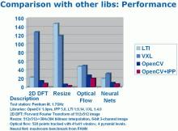
OpenCV与其它视觉函数库性能对比

###1.3 opencv的下载安装

####1.3.1 下载安装OpenCV4.5.0
1 进入opencv官网

2 点击Release进入Release界面，选择Windows版本
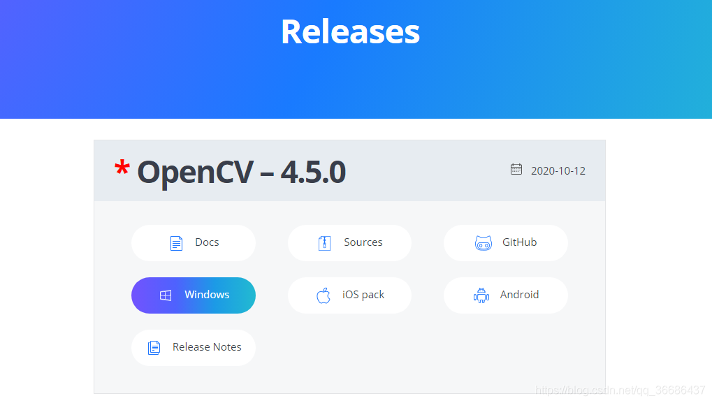

3 读秒完成即可开始下载
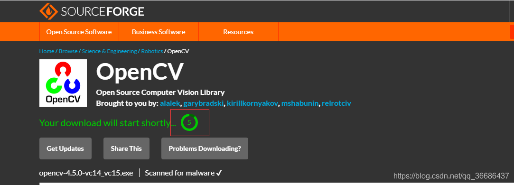

4 双击安装包进行安装
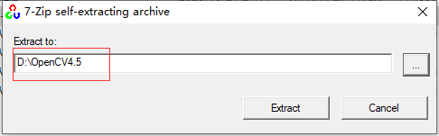

5 安装完打开文件夹是这样的
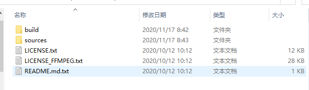

####1.3.2 配置环境变量
把OpenCV文件夹放好地方后，依次选择计算机—>属性—>高级系统设置—>系统变量，找到Path变量，选中并点击编辑，然后新建把你的OpenCV执行文件的路径填进去，然后一路点确定，这样环境变量就配置完了。
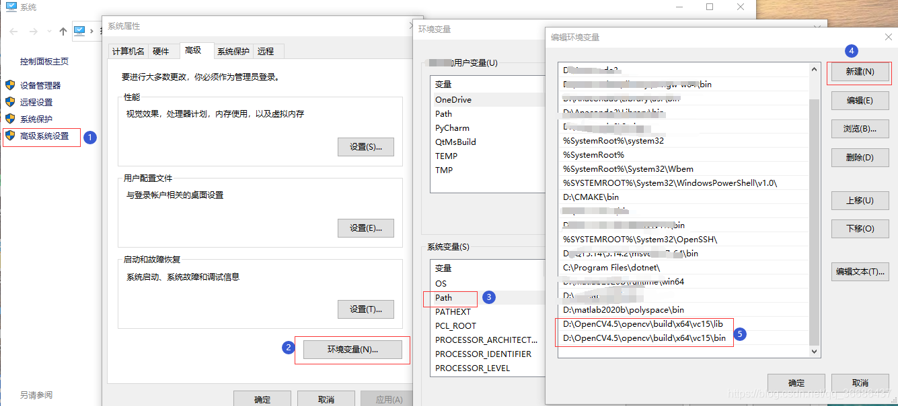

OpenCV执行文件的路径这样找：
找到你解压好的OpenCV文件夹，依次选择build—>x64—>vc15—>bin，
然后是这样的
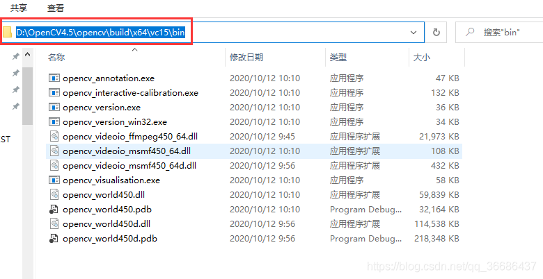

重启电脑完成环境变量配置

####1.3.3 配置VS2019

1、新建空项目，并确保版本模式一致
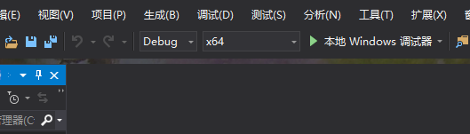

2、添加包含目录和库目录
（1）打开属性表
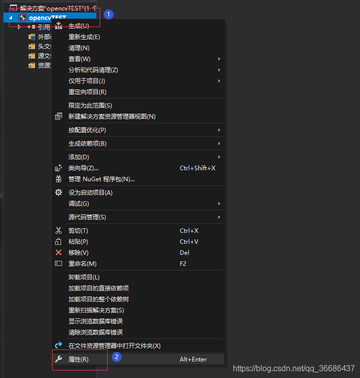

（2）VC++目录—>包含目录—>库目录
包含目录中添加：
D:\OpenCV4.5\opencv\build\include
D:\OpenCV4.5\opencv\build\include\opencv2

库目录中添加：
D:\OpenCV4.5\opencv\build\x64\vc15\lib

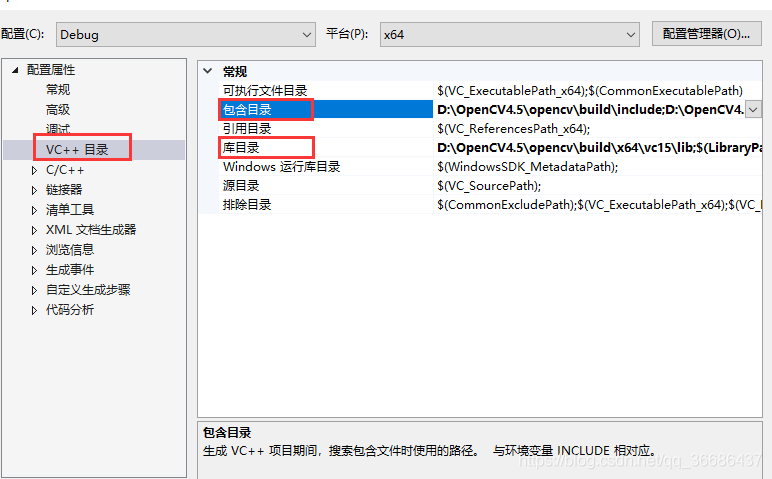

3、添加附加依赖项
依次选择项目—>属性—>链接器—>输入—>附加依赖项—>编辑
附加依赖项中添加（库文件名）：
opencv_world450d.lib

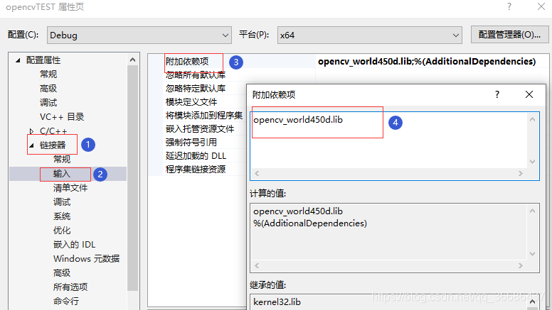

库文件这样找：

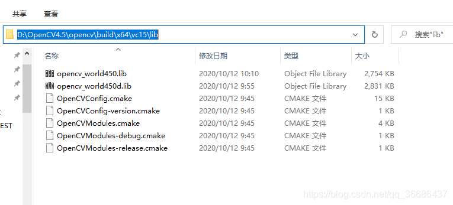

####1.3.4测试代码
#include<opencv2\opencv.hpp>
using namespace cv;
int main()
{
    Mat picture = imread("qq.jpg");
    //图片必须添加到工程目下
    //也就是和test.cpp文件放在一个文件夹下！！！
    imshow("测试程序", picture);
    waitKey(20191117);
}

####1.3.5测试结果

###1.4 opencv图像处理

####1.4.1 图像显示
在OpenCV 中，图像显示过程非常简单，只需用imread 函数载入到新版本的图像存储数据结构Mat类中，然后用imshow函数显示即可。打开Visual Studio，新建一个控制台项目，然后新建一个cpp文件，在其中添加如下代码:
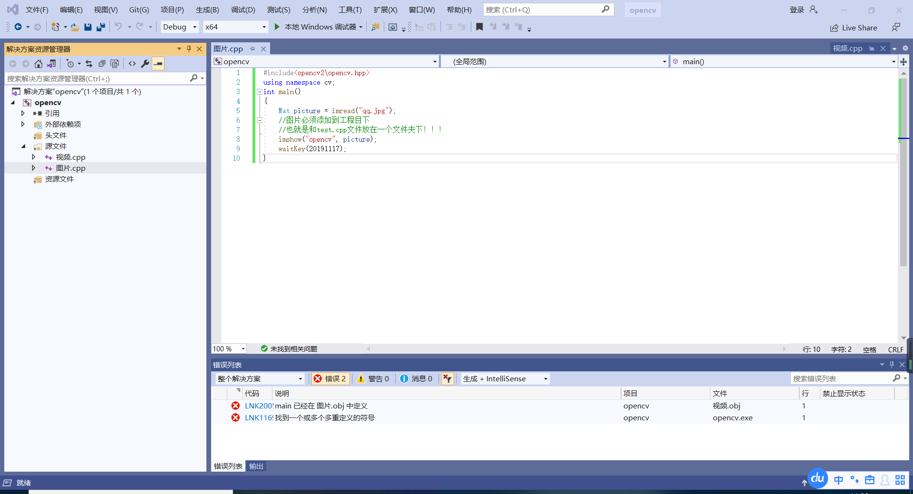
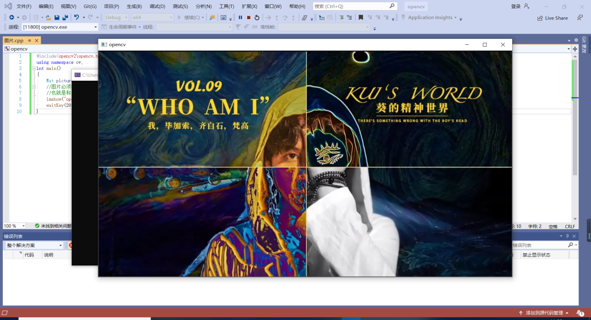

####1.4.2 图像腐蚀
程序首先依然是载入和显示一幅图像，然后定义一个Mat类型的变量来获得getStructuringElement 函数的返回值，而 getStructuringElement函数的返回值为指定形状和尺寸的结构元素（内核矩阵)。参数准备完毕，接着便可以调用erode 函数进行图像腐蚀操作，最后调用imshow函数进行显示，用waitKey函数等待按键按下，以便能让窗口一直显示。
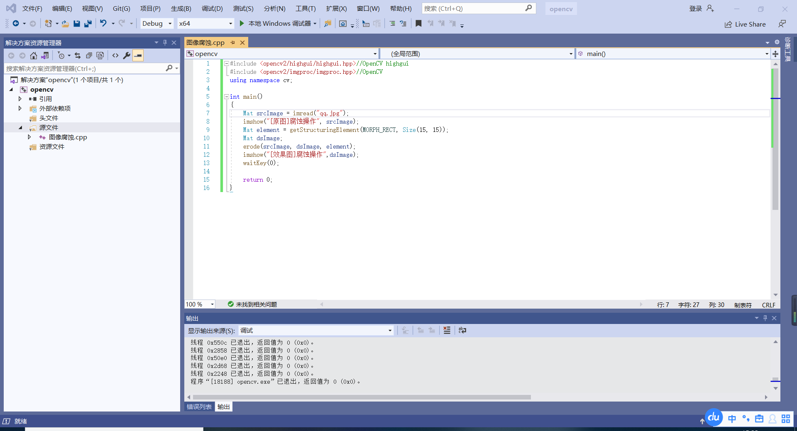
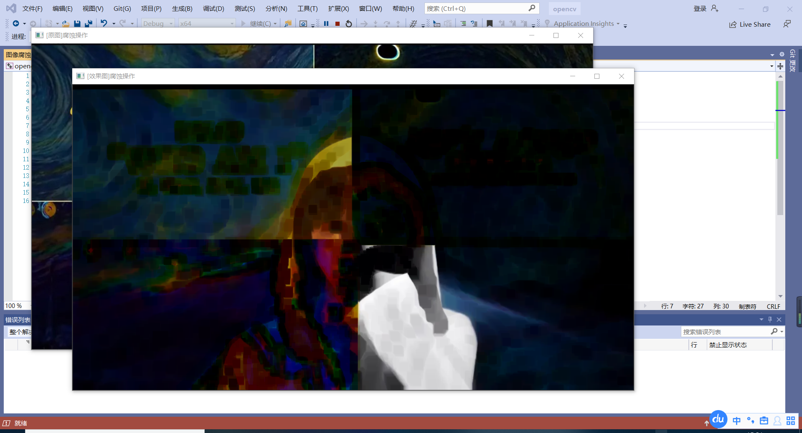

#### 1.4.3 图片模糊
载入并显示原始图后，调用一次 blur函数，最后显示效果图。原始图和效果图分别如图所示。
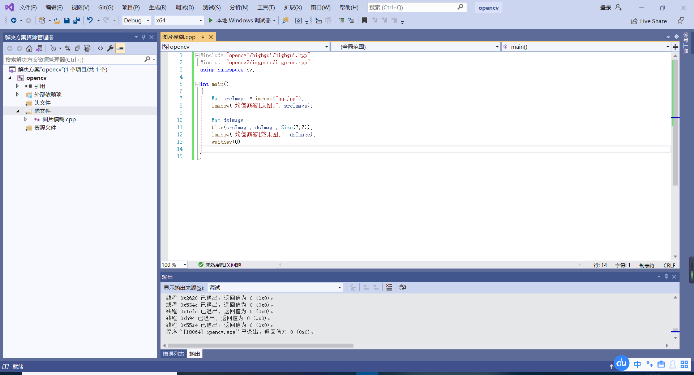

#### 1.4.4 Canny边缘检测
用OpenCV进行canny边缘检测。载入图像，并将其转成灰度图，再用blur函数进行图像模糊以降噪，然后用canny函数进行边缘检测，最后进行显示。
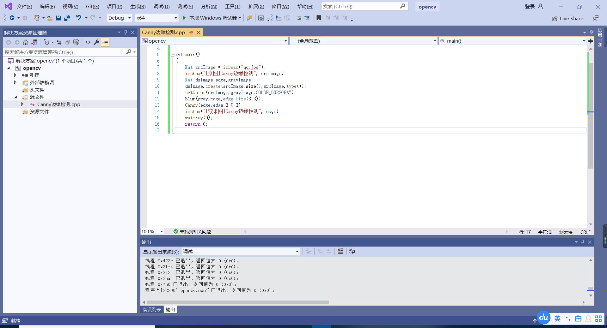
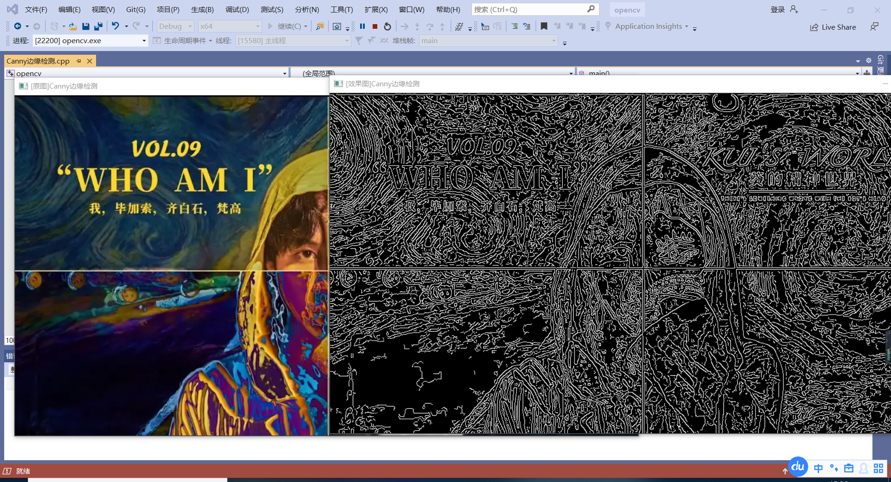

####1.4.5 视频
通过对VideoCapture类的分析，可以发现利用它读入视频的方法一般有如下两种。首先定义了一个Mat变量，用于存储每一帧的图像，接着读取当前帧到Mat变量中，然后调用imshow显示当前的这一帧图像，并用waitKey延时30毫秒，开始下一次循环。

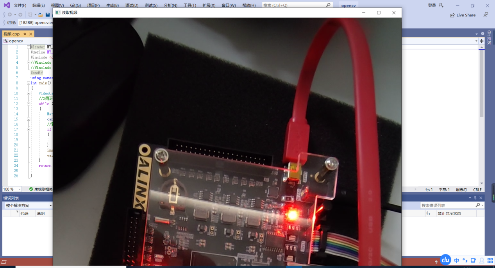

#### 1.4.6 摄像头
读入视频之后，循环将每一帧显示出来代码，可以发现，利用VideoCapture类调用摄像头采集视频和从文件中读入视频的区别仅仅是在 VideoCapture类对象初始化时指定的内容的区别，即，是指定文件名如“1.avi”，还是填一个0表示调用摄像头而已。
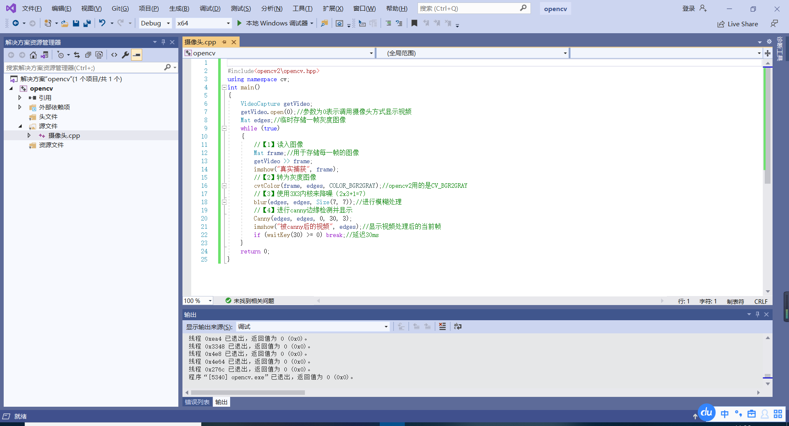
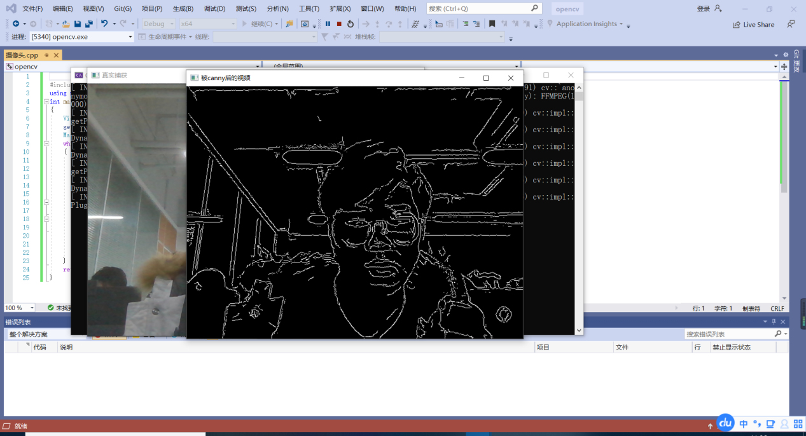

### 1.5 小结

通过本章的学习，我已经对OpenCV有了一些初步的认知。本章中，我不仅介绍了OpenCV的周边概念，还分析了其基本架构。然后重点讲解了OpenCV 的下载、安装与配置过程。配置完成后，我还领略OpenCV的魅力，接触了四个OpenCV图像处理小程序。最后，我还学习了如何使用OpenCV操作视频和调用摄像头。

## 第二章

### 2.1 彩色目标追踪
彩色目标跟踪，程序的用法是根据鼠标框选区域的色度光谱来进行摄像头买八的恍HET”是对MeanShift算法的改进，被称为连续“Continuously Adapuveaa打开木书配套的第8个示例程序(耿有龙在自适应的 MeanShitt 界z4下我,名为 camshiftdemo.cpp的文件，自行修以lopencvlsources\samplesiCpp 曰水TF木的不同略有差异)，编译并运行，用鼠标部分代码。实际路径会因为OpenCV版本的不同略有差异)，编译并运行，用鼠标在窗口中框选要跟踪的区域，便可以得到如图所示运行截图。
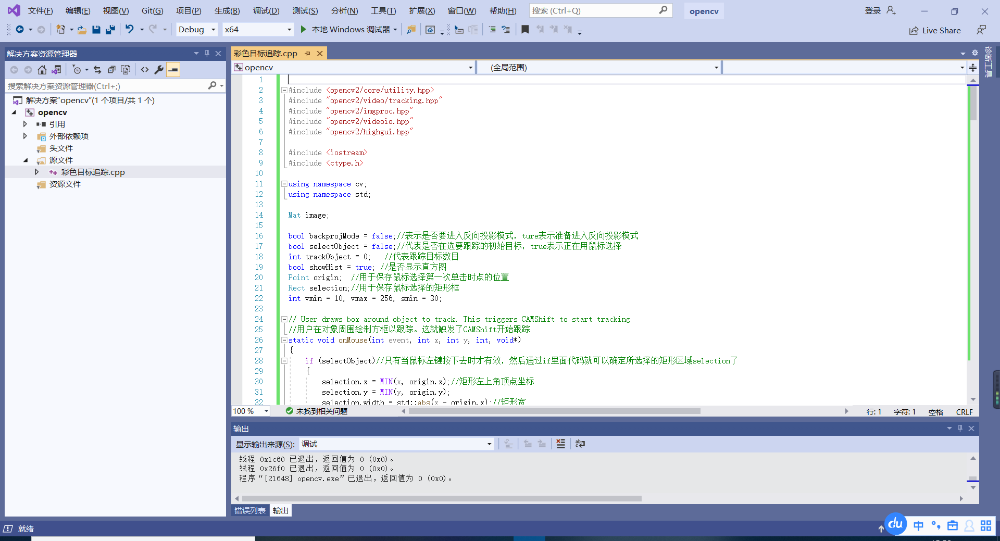
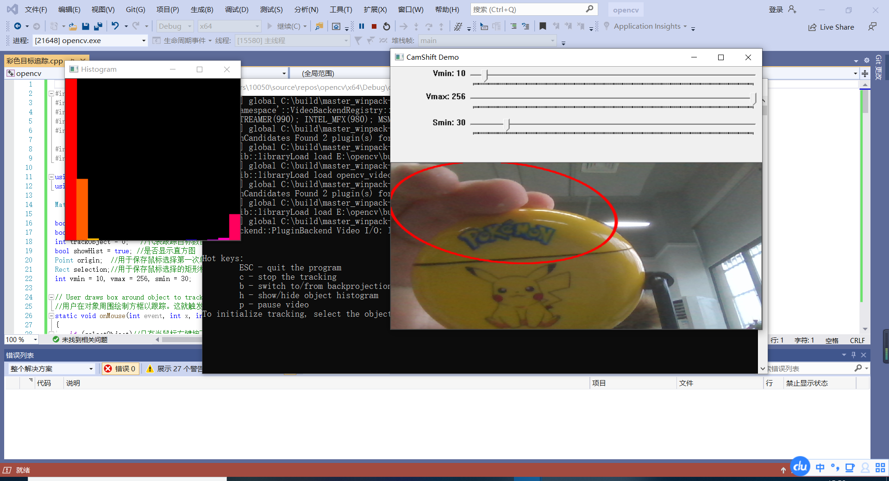

### 2.2  点追踪
程序运行后，会自动启用摄像头，这时按键盘上的“r”键来启动自动点追踪，便可以看到如图所示的效果图。而我们在摄像头中移动物体，可以看到物体上的点随着物体一同移动（如图所示)，富含科技感且妙趣横生。
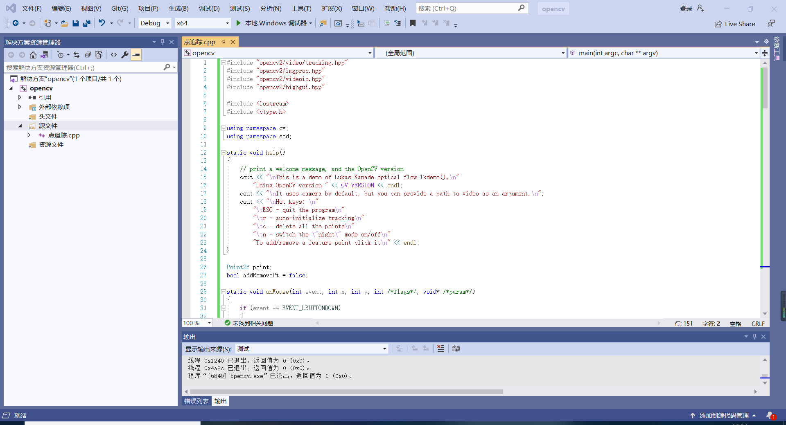
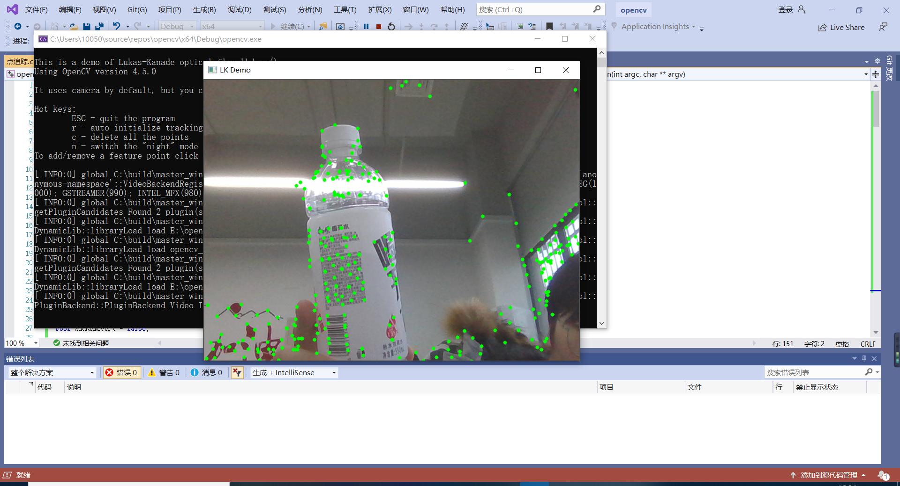

### 2.3 人脸识别
运行程序，将自己的脸对准摄像头，或者放置一张照片对准摄像头任其捕获，便可以发现程序准确地识别出了人脸，并用彩色的圆将脸圈出。如图所示。
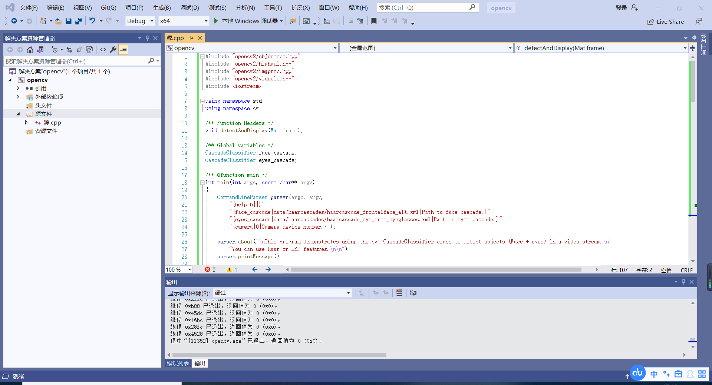
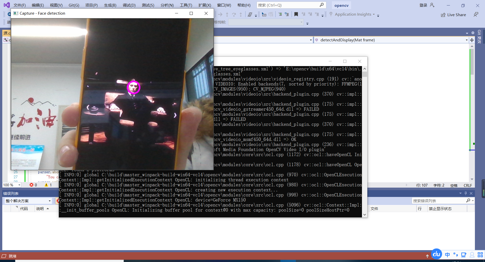

### 2.4 小结
在本章中，我学习了很多非常实用的知识，使我可以对OpenCV有一个宏观的认知，也给我提供了一些脱离书本依靠官方文档自学的思路，比如对OpenCV官方例程的引导与赏析，和如何编译OpenCV总计四十四万多行的源代码。此外，还有一些命名规范的约定和相关C语言基础函数的复习。

## 第三章

### 3.1 图像的载入，显示和输出到文件
演示如何载入图像，进行简单的图像混合，显示图像，并且输出混合后的图像到jpg格式的文件中。出于注重演示效果的原因，现在先看看混合的效果和源码。以下就是本节的综合示例程序，经过详细注释的代码非常简单明了。
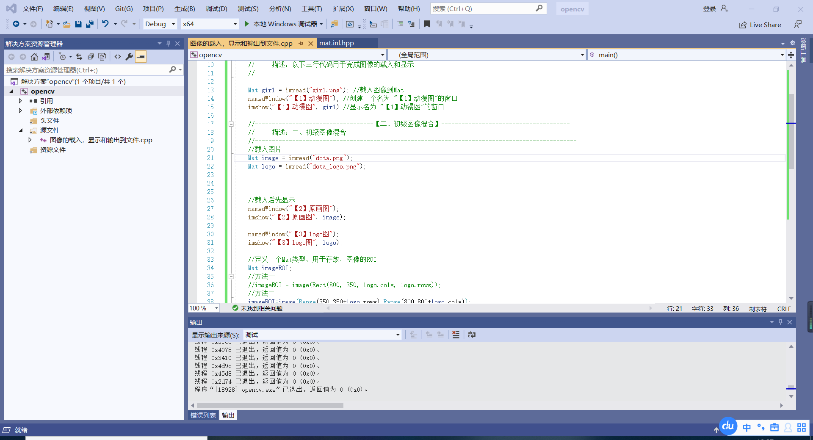

### 3.2  滑动条的创建与使用
第一个参数，const string&类型的 trackbarname，轨迹条的名字，用来代表我们创建的轨迹条。

第二个参数，const string&类型的 winname，窗口的名字，表示这个轨迹条会依附到哪个窗口上，即对应namedWindow()创建窗口时填的某一个窗口名。

第三个参数，int*类型的value，一个指向整型的指针，表示滑块的位置。在创建时，滑块的初始位置就是该变量当前的值。

第四个参数，int类型的count，表示滑块可以达到的最大位置的值。滑块最小位置的值始终为0。

第五个参数，TrackbarCallback类型的onChange它有默认值0。这是一个指向回调函数的指针，每次滑块位置改变时，这个函数都会进行回调。并且这个函数的原型必须为void XXXX(int，void*);，其中第一个参数是轨迹条的位置，第二个参数是用户数据（看下面的第六个参数)。如果回调是NULL指针，则表示没有回调函数的调用，仅第三个参数value有变化。

第六个参数，void*类型的userdata，也有默认值0。这个参数是用户传给回调函数的数据，用来处理轨迹条事件。如果使用的第三个参数value实参是全局变量的话，完全可以不去管这个userdata参数。

createTrackbar函数为我们创建了一个具有特定名称和范围的轨迹条
(Trackbar，或首优定们坎化(第五个参数)，在轨迹条位置改变的时候米调用力且要指定回调函数onChange（第五个参数)，在轨迹条位置改变的时候来调用这个回调函数，并且，创建的轨迹条显示在指定的 winname(第二个参数）所代表的窗口上。
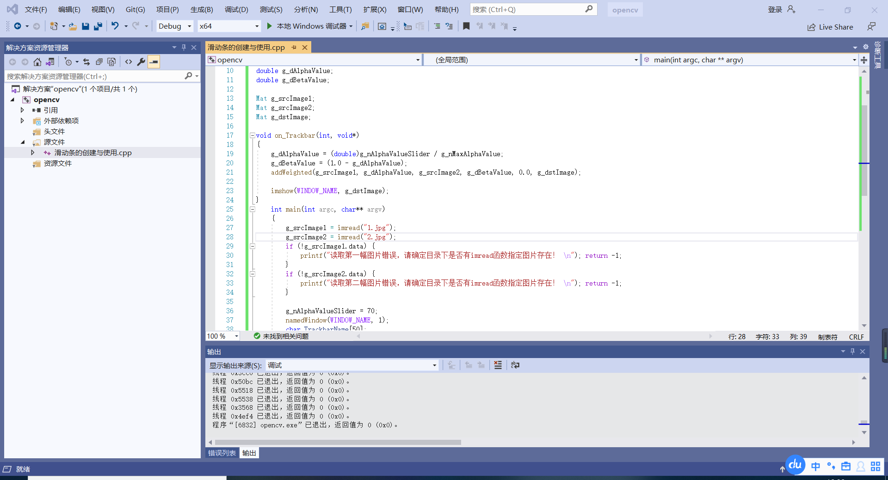
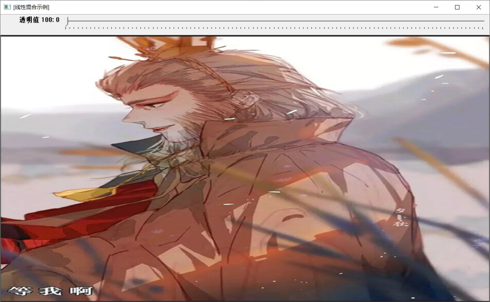

### 3.3 鼠标操作
OpenCV 中的鼠标操作和滑动条的消息映射方式很类似，都是通过一个中介函数配合一个回调函数来实现的。创建和指定滑动条回调函数的函数为createTrackbar，而指定鼠标操作消息回调函数的函数为SetMouseCallback。

第一个参数，const string&类型的 winname，窗口的名字。

第二个参数，MouseCallback类型的 onMouse，指定窗口里每次鼠标时间发生的时候，被调用的函数指针。这个函数的原型的大概形式为void Foo(intevent, int x, int y, int flags, void* param)。其中event是 EVENT_+变量之一，x和y是鼠标指针在图像坐标系（需要注意，不是窗口坐标系）中的坐标值，flags是 EVENT_FLAG的组合，param是用户定义的传递到SetMouseCallback函数调用的参数。如 EVENT_MOUSEMOVE为鼠标移动消息、EVENT_LBUTTONDOWN为鼠标左键按下消息等。

第三个参数，void*类型的userdata，用户定义的传递到回调函数的参数，有默认值0。

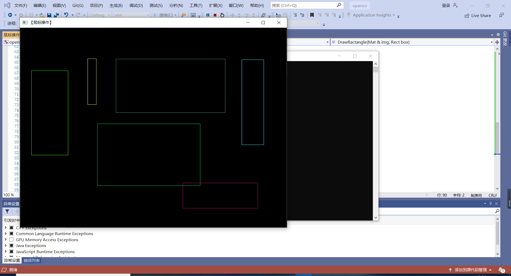

### 3.4 小结
本章中，我学习了OpenCV的高层GUI图形用户界面模块highgui中最重要的几个方面，分别是图像的载入、显示与输出图像到文件，以及如何使用滑动条如何进行鼠标操作。
