## 第一章
### 邂逅OpenCV

软件安装，你需要安装<font color=red>Visual studio</font>和<font color=red>Open Cv</font> Visual Studio 需要安装C++，Opencv我安装的是版本是4.5，具体的环境配置可以参考[CSDN](https://blog.csdn.net/weixin_40647819/article/details/79938325?ops_request_misc=%257B%2522request%255Fid%2522%253A%2522160621597119724836710585%2522%252C%2522scm%2522%253A%252220140713.130102334..%2522%257D&request_id=160621597119724836710585&biz_id=0&utm_medium=distribute.pc_search_result.none-task-blog-2~all~top_click~default-1-79938325.first_rank_ecpm_v3_pc_rank_v2&utm_term=OpenCV%E7%8E%AF%E5%A2%83%E9%85%8D%E7%BD%AE&spm=1018.2118.3001.4449）)
注意哦！！32位系统选择x86 64位系统选择x86

#### OpenCV概述
它有三种周边概念
图像处理（Image Processing):对图像处理达到所需结果的技术
计算机视觉（Computer Vision):是一门研究如何使机器“看”的科学
OpenCV（Open Source Computer Vision Library） 基于开源发行的计算机视觉库，提供了很多的算法

它可以解决
·人机交互
·物体识别
·图像分区
·人脸识别
·动作识别
·运动跟踪
·机器人

##### 载入图片
```C++
#include <opencv2/opencv.hpp>
using namespace cv;

int main()
{
    Mat img=imread("1.jpg");//读入一张图片
    imshow("【载入的图片】",img);//播放图片
    waitKey(6000);//6000毫秒后关闭窗口
}
```

在Windows中你需要进行调整，在图片的路径下应该放绝对路径

##### 图像腐蚀

```C++
#include<opencv2/highgui/highgui.hpp>
#include<opencv2/imgproc/imgproc.hpp>

using namespace cv;

int main() {
	Mat srcImage = imread("1.jpg");//读取图片
	Mat element = getStructuringElement(MORPH_RECT, Size(15,15));//创建一个内核矩阵
	Mat dstImage;
	erode(srcImage, dstImage, element);//进行腐蚀操作
	imshow("腐蚀操作", dstImage);
	waitKey(0);//按下任意键推出
	return 0;
}
```
原图像

腐蚀过后,
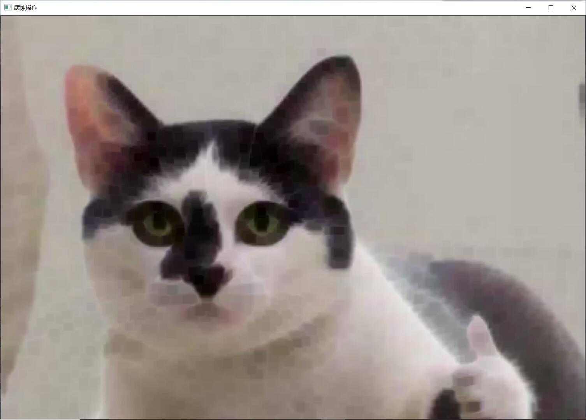

##### 均值滤波
```C++
#include<opencv2/highgui/highgui.hpp>
#include<opencv2/imgproc/imgproc.hpp>

using namespace cv;

int main() {
	Mat srcImage = imread("D:\\2020\\AI\\人工智能\\1.jpg");//读取图片
	Mat dstImage;
	blur(srcImage, dstImage, Size(7, 7));//进行滤波操作
	imshow("均值滤波", dstImage);
	waitKey(0);//按下任意键推出
```
滤波过后,
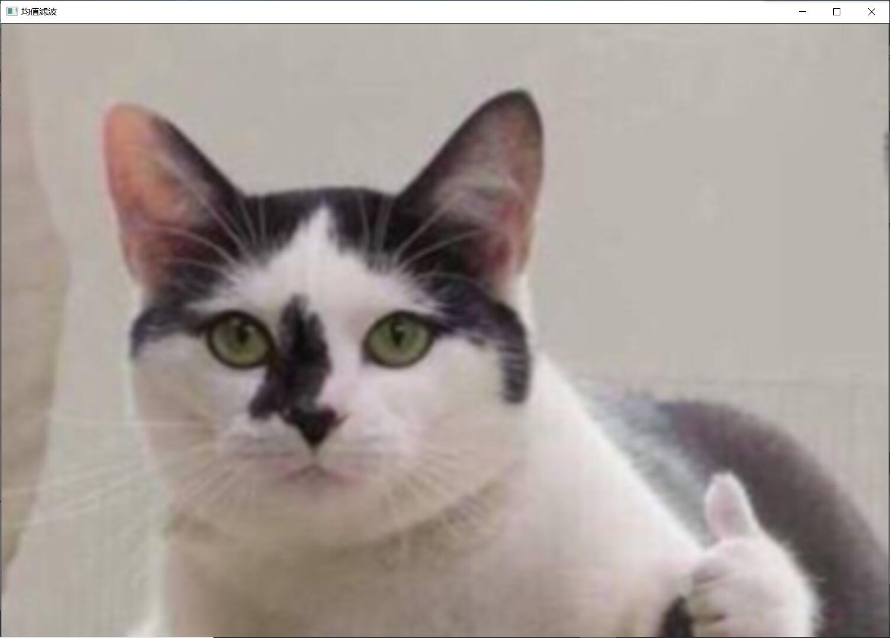

第一章剩余的内容有
canny边缘检测，此处省略

##### 读取并播放视频
原视频
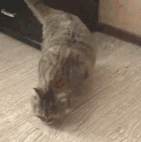
```C++
#include<opencv2/opencv.hpp>

using namespace cv;

int main() {
	VideoCapture capture("1.gif");//读取图片
	while (1) 
	{
		Mat frame;//定义一个Mat变量用来存储每一帧的图像
		capture >> frame;//读取当前帧
		imshow("读取视频", frame);//显示当前帧
		waitKey(30);//延时30ms
	}
	return 0;
```
运行之后
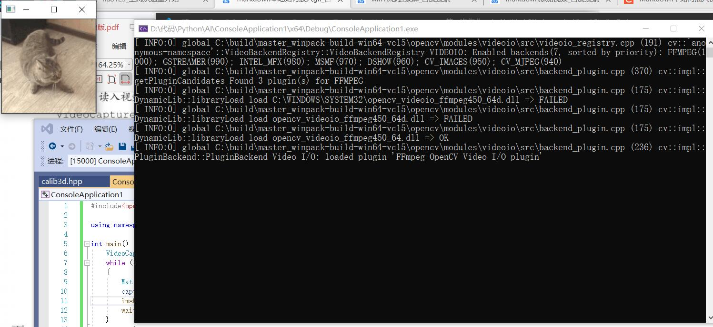
与原图相比他的速度非常的快

###### 调用摄像头采集头像
```C++
#include "opencv2/opencv.hpp"
using namespace cv;

int main() {
	VideoCapture capture(0);//0表示从摄像头中采集数据
	Mat edges;
	while (1) {
		Mat frame;
		capture >> frame;
		cvtColor(frame, edges, COLOR_BGR2GRAY);//将图像转换为灰度图像
		blur(edges, edges, Size(7, 7));//使用3x3内核来降噪
		Canny(edges, edges, 0, 30, 3);//使用canny边缘显示
		imshow("被canny后的视频", edges);
		if (waitKey(30) >= 0) break;//延时30S
	}
	return 0;
}
```	
图像如下
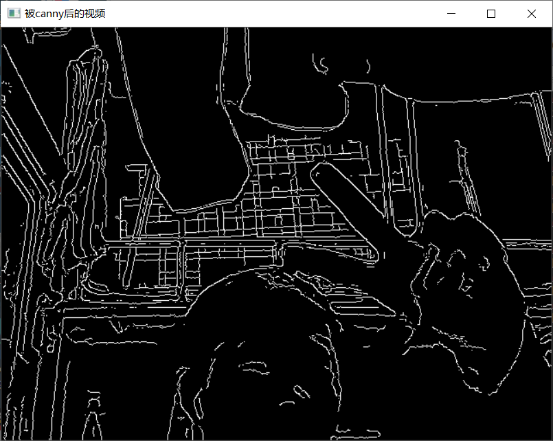

彩色跟踪目标
```C++
#include "opencv2/core/utility.hpp"
#include "opencv2/video/tracking.hpp"
#include "opencv2/imgproc.hpp"
#include "opencv2/videoio.hpp"
#include "opencv2/highgui.hpp"

#include <iostream>
#include <ctype.h>

using namespace cv;
using namespace std;

Mat image;

bool backprojMode = false;
bool selectObject = false;
int trackObject = 0;
bool showHist = true;
Point origin;
Rect selection;
int vmin = 10, vmax = 256, smin = 30;

// User draws box around object to track. This triggers CAMShift to start tracking
static void onMouse(int event, int x, int y, int, void*)
{
    if (selectObject)
    {
        selection.x = MIN(x, origin.x);
        selection.y = MIN(y, origin.y);
        selection.width = std::abs(x - origin.x);
        selection.height = std::abs(y - origin.y);

        selection &= Rect(0, 0, image.cols, image.rows);
    }

    switch (event)
    {
    case EVENT_LBUTTONDOWN:
        origin = Point(x, y);
        selection = Rect(x, y, 0, 0);
        selectObject = true;
        break;
    case EVENT_LBUTTONUP:
        selectObject = false;
        if (selection.width > 0 && selection.height > 0)
            trackObject = -1;   // Set up CAMShift properties in main() loop
        break;
    }
}

string hot_keys =
"\n\nHot keys: \n"
"\tESC - quit the program\n"
"\tc - stop the tracking\n"
"\tb - switch to/from backprojection view\n"
"\th - show/hide object histogram\n"
"\tp - pause video\n"
"To initialize tracking, select the object with mouse\n";

static void help(const char** argv)
{
    cout << "\nThis is a demo that shows mean-shift based tracking\n"
        "You select a color objects such as your face and it tracks it.\n"
        "This reads from video camera (0 by default, or the camera number the user enters\n"
        "Usage: \n\t";
    cout << argv[0] << " [camera number]\n";
    cout << hot_keys;
}

const char* keys =
{
    "{help h | | show help message}{@camera_number| 0 | camera number}"
};

int main(int argc, const char** argv)
{
    VideoCapture cap;
    Rect trackWindow;
    int hsize = 16;
    float hranges[] = { 0,180 };
    const float* phranges = hranges;
    CommandLineParser parser(argc, argv, keys);
    if (parser.has("help"))
    {
        help(argv);
        return 0;
    }
    int camNum = parser.get<int>(0);
    cap.open(camNum);

    if (!cap.isOpened())
    {
        help(argv);
        cout << "***Could not initialize capturing...***\n";
        cout << "Current parameter's value: \n";
        parser.printMessage();
        return -1;
    }
    cout << hot_keys;
    namedWindow("Histogram", 0);
    namedWindow("CamShift Demo", 0);
    setMouseCallback("CamShift Demo", onMouse, 0);
    createTrackbar("Vmin", "CamShift Demo", &vmin, 256, 0);
    createTrackbar("Vmax", "CamShift Demo", &vmax, 256, 0);
    createTrackbar("Smin", "CamShift Demo", &smin, 256, 0);

    Mat frame, hsv, hue, mask, hist, histimg = Mat::zeros(200, 320, CV_8UC3), backproj;
    bool paused = false;

    for (;;)
    {
        if (!paused)
        {
            cap >> frame;
            if (frame.empty())
                break;
        }

        frame.copyTo(image);

        if (!paused)
        {
            cvtColor(image, hsv, COLOR_BGR2HSV);

            if (trackObject)
            {
                int _vmin = vmin, _vmax = vmax;

                inRange(hsv, Scalar(0, smin, MIN(_vmin, _vmax)),
                    Scalar(180, 256, MAX(_vmin, _vmax)), mask);
                int ch[] = { 0, 0 };
                hue.create(hsv.size(), hsv.depth());
                mixChannels(&hsv, 1, &hue, 1, ch, 1);

                if (trackObject < 0)
                {
                    // Object has been selected by user, set up CAMShift search properties once
                    Mat roi(hue, selection), maskroi(mask, selection);
                    calcHist(&roi, 1, 0, maskroi, hist, 1, &hsize, &phranges);
                    normalize(hist, hist, 0, 255, NORM_MINMAX);

                    trackWindow = selection;
                    trackObject = 1; // Don't set up again, unless user selects new ROI

                    histimg = Scalar::all(0);
                    int binW = histimg.cols / hsize;
                    Mat buf(1, hsize, CV_8UC3);
                    for (int i = 0; i < hsize; i++)
                        buf.at<Vec3b>(i) = Vec3b(saturate_cast<uchar>(i * 180. / hsize), 255, 255);
                    cvtColor(buf, buf, COLOR_HSV2BGR);

                    for (int i = 0; i < hsize; i++)
                    {
                        int val = saturate_cast<int>(hist.at<float>(i) * histimg.rows / 255);
                        rectangle(histimg, Point(i * binW, histimg.rows),
                            Point((i + 1) * binW, histimg.rows - val),
                            Scalar(buf.at<Vec3b>(i)), -1, 8);
                    }
                }

                // Perform CAMShift
                calcBackProject(&hue, 1, 0, hist, backproj, &phranges);
                backproj &= mask;
                RotatedRect trackBox = CamShift(backproj, trackWindow,
                    TermCriteria(TermCriteria::EPS | TermCriteria::COUNT, 10, 1));
                if (trackWindow.area() <= 1)
                {
                    int cols = backproj.cols, rows = backproj.rows, r = (MIN(cols, rows) + 5) / 6;
                    trackWindow = Rect(trackWindow.x - r, trackWindow.y - r,
                        trackWindow.x + r, trackWindow.y + r) &
                        Rect(0, 0, cols, rows);
                }

                if (backprojMode)
                    cvtColor(backproj, image, COLOR_GRAY2BGR);
                ellipse(image, trackBox, Scalar(0, 0, 255), 3, LINE_AA);
            }
        }
        else if (trackObject < 0)
            paused = false;

        if (selectObject && selection.width > 0 && selection.height > 0)
        {
            Mat roi(image, selection);
            bitwise_not(roi, roi);
        }

        imshow("CamShift Demo", image);
        imshow("Histogram", histimg);

        char c = (char)waitKey(10);
        if (c == 27)
            break;
        switch (c)
        {
        case 'b':
            backprojMode = !backprojMode;
            break;
        case 'c':
            trackObject = 0;
            histimg = Scalar::all(0);
            break;
        case 'h':
            showHist = !showHist;
            if (!showHist)
                destroyWindow("Histogram");
            else
                namedWindow("Histogram", 1);
            break;
        case 'p':
            paused = !paused;
            break;
        default:
            ;
        }
    }

    return 0;
}
```
图像显示如图所示
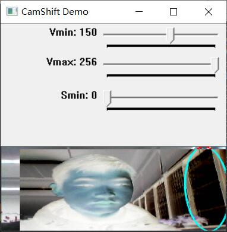
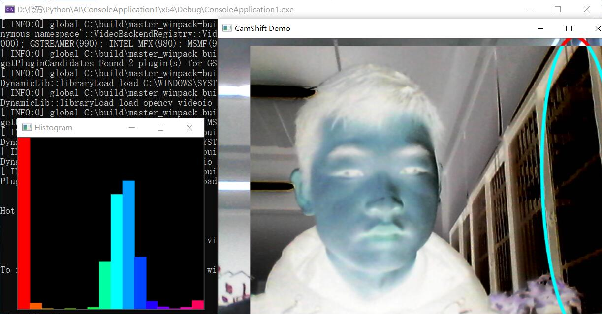

在C++中命名的要求如下
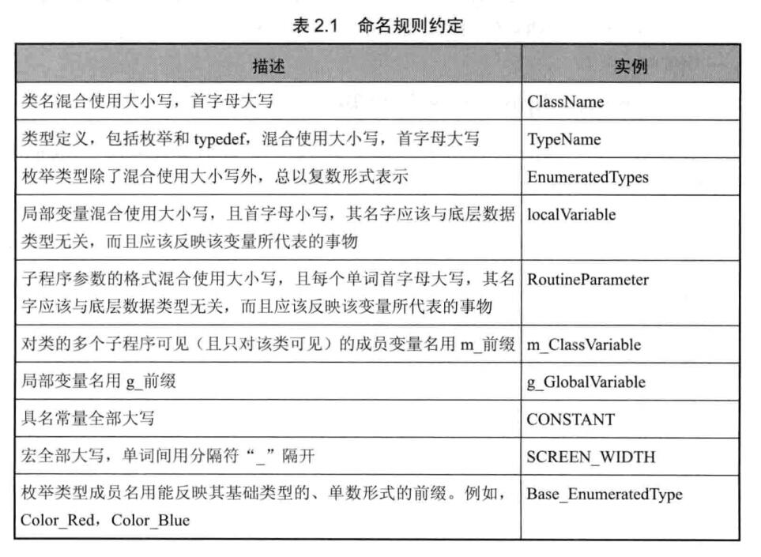
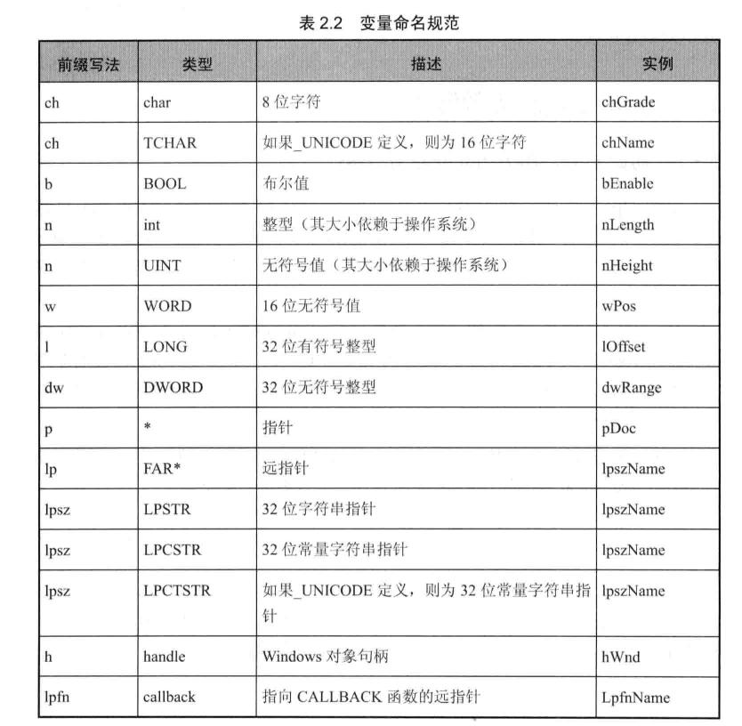
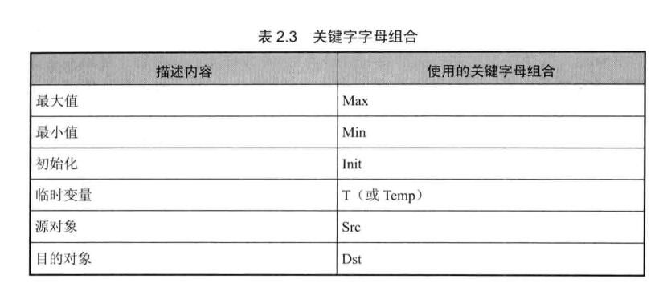

#### OpenCVd的命名空间
再写OpenCV的简单程序，以下三句可以作为标配
```C++
# include <opencv/core/core.hpp>
# include <opencv/highgui/highgui.hpp>
using namespace cv;
```
Mat类用于保存图像以及其他矩阵数据的数据结构
Mat scrImage = Imread("dota.jpg")
Windows位图：*.bmp，*.dib
JPEG文件：*.jpeg,*.jpg,*.jpe
JPEG2000文件：*.jp2
PNG图片：*.png
便携文件个格式：*.pbm,*.pgm,*.ppm
Sun rasters光栅文件：*.sr,*.ras
TIFF文件：*.tiff,*.tif

```C++
#include<opencv2/opencv.hpp>
#include<vector>

using namespace cv;
using namespace std;

void createAlphaMat(Mat& mat)//设计图像方法
{
	for (size_t i = 0; i < mat.rows; i++)
	{
		for (size_t j = 0; j < mat.cols; j++)
		{
			Vec4b& rgba = mat.at<Vec4b>(i, j);
			rgba[0] = UCHAR_MAX;
			rgba[1] = saturate_cast<uchar>((float(mat.cols - j))) / ((float(mat.cols) *UCHAR_MAX));
			rgba[2] = saturate_cast<uchar>((float(mat.rows - i))) / ((float(mat.rows) *UCHAR_MAX));
			rgba[3] = saturate_cast<uchar>(0.5 * (rgba[1] + rgba[2]));
		}
	}
}

int main()
{
	Mat mat(480, 640, CV_8UC4);
	createAlphaMat(mat);
	vector<int>compression_params;//创建一个矢量
	compression_params.push_back(IMWRITE_PNG_COMPRESSION);
	compression_params.push_back(9);

	try
	{
		imwrite("透明Alpha值图.png", mat, compression_params);
		imshow("生成的PNG图", mat);
		fprintf(stdout, "PNG图片文件的alpha数据保存完毕");
		waitKey(0);
	}
	catch (runtime_error& ex)
	{
		fprintf(stderr, "图像转换成PNG格式发生错误");
		return 1;
	}
	return 0;
}
```
代码分析再上图可以显示
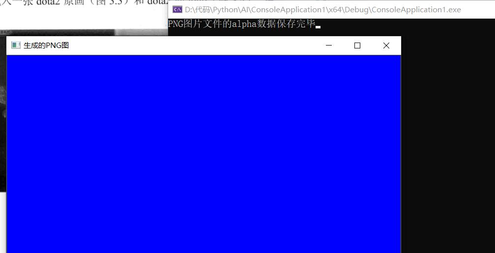
#include<opencv2/core/core.hpp>
#include<opencv2/highgui/highgui.hpp>
```C++
using namespace cv;

int main()
{
	Mat girl = imread("D:\\学习APP\\新建文件夹\\3.jpg");//载入图像
	namedWindow("动漫图");//创建一个名为动漫图的窗口
	imshow("动漫图", girl);//展示动漫图


	//载入图片
	Mat image = imread("D:\\学习APP\\新建文件夹\\1.jpg");
	Mat logo = imread("D:\\学习APP\\新建文件夹\\2.jpg");
	//载入后先显示
	namedWindow("原画图");
	imshow("原画图", image);

	namedWindow("logo图");
	imshow("logo图", logo);

	//用于存放图像的ROI
	Mat imageROI;
	imageROI = image(Rect(800, 350, logo.cols, logo.rows));//方法一
	imageROI = image(Range(350, 350+logo.rows), Range(800, 800+logo.cols));//方法二

	addWeighted(imageROI, 0.5, logo, 0.3, 0., imageROI);//将logo加到原图上

	namedWindow("原画+logo图");
	imshow("原画+logo图", image);

	waitKey();
	return 0;
}
```
显示如图所示
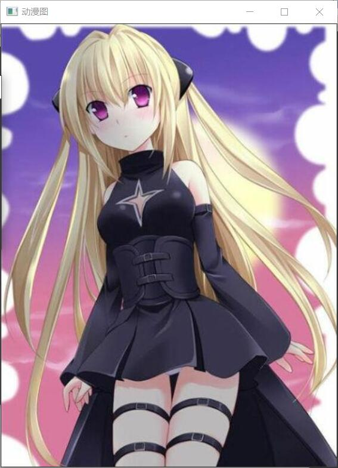
 整合之后
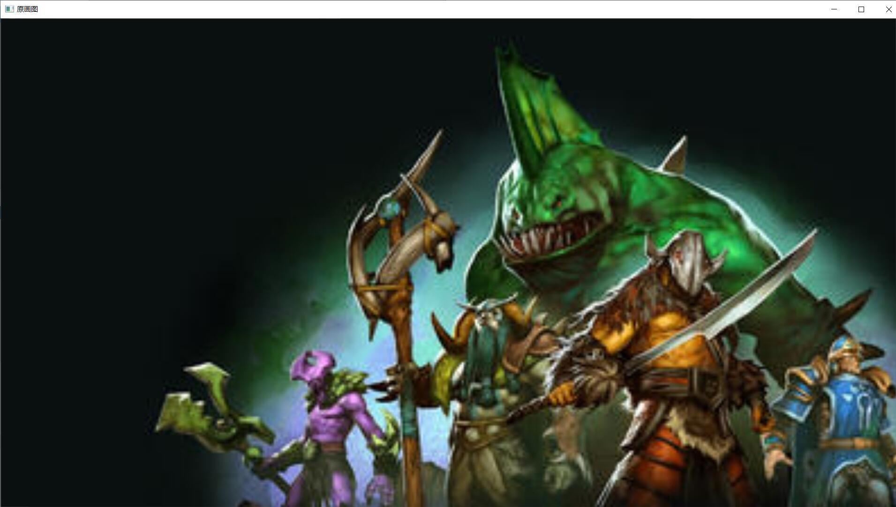
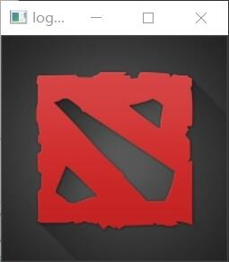

滑动图
```C++
#include <opencv2/opencv.hpp>
#include "opencv2/highgui/highgui.hpp"
#pragma warning(disable : 4996)
using namespace cv;

#define WINDOW_NAME "[线性混合示例]"//窗口定义的宏


//以下为全局变量
const int g_nMaxAlphaValue = 100;
int g_nAlphaValueSlider;
double g_dAlphaValue;
double g_dBetaValue;

//声明存储图像
Mat g_srcImage1;
Mat g_srcImage2;
Mat g_dstImage;


//响应滑动条的回调函数
void on_Trackbar(int, void*)
{
	g_dAlphaValue = (double)g_nAlphaValueSlider / g_nMaxAlphaValue;
	g_dBetaValue = (1.0 - g_dAlphaValue);
	addWeighted(g_srcImage1, g_dAlphaValue, g_srcImage2, g_dBetaValue, 0.0, g_dstImage);
	imshow(WINDOW_NAME, g_dstImage);
}

//主函数，实现滑动条
int main(int argc, char** argv)
{
	g_srcImage1 = imread("D:\\学习APP\\新建文件夹\\4.jpg");
	g_srcImage2 = imread("D:\\学习APP\\新建文件夹\\5.jpg");
	if (!g_srcImage1.data) {
		printf("读取第一幅图片错误，请确定目录下是否有imread函数指定图片存在！ \n"); return -1;
	}
	if (!g_srcImage2.data) {
		printf("读取第二幅图片错误，请确定目录下是否有imread函数指定图片存在！ \n"); return -1;
	}

	g_nAlphaValueSlider = 70;
	namedWindow(WINDOW_NAME, 1);
	char TrackbarName[50];
	sprintf(TrackbarName, "透明值 %d", g_nMaxAlphaValue);

	createTrackbar(TrackbarName, WINDOW_NAME, &g_nAlphaValueSlider, g_nMaxAlphaValue, on_Trackbar);

	on_Trackbar(g_nAlphaValueSlider, 0);

	waitKey(0);

	return 0;
}
```

鼠标操作
```C++
#include <opencv2/opencv.hpp>
using namespace cv;

#define WINDOW_NAME "【程序窗口】"
void on_MouseHandle(int event, int x, int y, int flags, void* param);
void DrawRectangle(cv::Mat& img, cv::Rect box);
void ShowHelpText();
//全局变量
Rect g_rectangle;
bool g_bDrawingBox = false;
RNG g_rng(12345);


int main(int argc, char** argv) {
	
	//准备参数
	g_rectangle = Rect(-1, -1, 0, 0);
	Mat srcImage(600, 800, CV_8UC3), tempImage;
	srcImage.copyTo(tempImage);
	g_rectangle = Rect(-1, -1, 0, 0);
	srcImage = Scalar::all(0);
	//设置鼠标操作回调函数
	namedWindow(WINDOW_NAME);
	setMouseCallback(WINDOW_NAME, on_MouseHandle, (void*)&srcImage);
	//程序主循环
	while (1) {
		srcImage.copyTo(tempImage);
		if (g_bDrawingBox) DrawRectangle(tempImage, g_rectangle);
		imshow(WINDOW_NAME, tempImage);
		if (waitKey(10) == 27) break;
	}
	return 0;
}

void  on_MouseHandle(int event, int x, int y, int flags, void* param)
{
	Mat& image = *(cv::Mat*)param;
	//鼠标移动消息
	switch (event) {
	case EVENT_MOUSEMOVE:
	{
		if (g_bDrawingBox)
		{
			g_rectangle.width = x - g_rectangle.x;
			g_rectangle.height = y - g_rectangle.y;
		}
	}
	break;

	//按下左键
	case EVENT_LBUTTONDOWN:
	{
		g_bDrawingBox = true;
		g_rectangle = Rect(x, y, 0, 0);
	}
	break;
	//左键抬起
	case EVENT_LBUTTONUP:
	{
		g_bDrawingBox = false;
		if (g_rectangle.width < 0) {
			g_rectangle.x += g_rectangle.width;
			g_rectangle.width *= -1;
		}
		if (g_rectangle.height < 0) {
			g_rectangle.y += g_rectangle.height;
			g_rectangle.height *= -1;
		}
		DrawRectangle(image, g_rectangle);
	}
	break;
	}
}

//自定义的矩形绘制函数
void DrawRectangle(cv::Mat& img, cv::Rect box)
{
	rectangle(img, box.tl(), box.br(), Scalar(g_rng.uniform(0, 255), g_rng.uniform(0, 255), g_rng.uniform(0, 255)));//随机颜色
}
```

图像如图所示
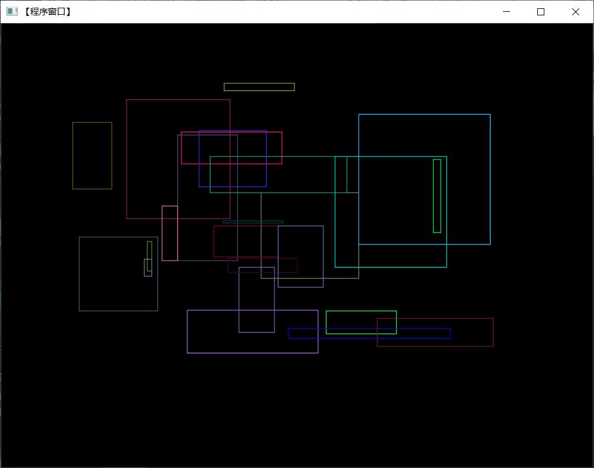