# OpenCV

## OpenCV 概述
openCV的全称是Open Source Computer Vision Library，直译就是“开源计算机视觉库”。取代表开源的单词“Open”、"Computer”的首字母“C”以及“Vision”的首字母“V”，组合命名为“OpenCv”。

OpenCV于1999年由Intel建立，如今由Willow Garage提供支持。它是一个基于开源发行的跨平台计算机视觉库，可以运行在Linux、Windows、Mac OS、Android、iOS、Maemo、FreeBSD、OpenBSD等操作系统上。OpenCV由一系列C函数和C++类构成，轻量且高效。强大的OpenCV除了用C/C++语言进行开发和使用之外,还支持使用C#、Ch、Ruby等编程语言,同时提供了对Python、Ruby、MATLAB等语言的接口，实现了图像处理和计算机视觉方面的很多通用算法。

OpenCV的设计目标是执行速度尽量快，主要关注实时应用。它采用优化的C/C++代码编写，能够充分利用多核处理器的优势，其主要目标是构建一个简单易用的计算机视觉框架，以帮助开发人员更便捷地设计更复杂的计算机视觉相关应用程序。

OpenCV由一系列C函数和C++类构成，拥有包括500多个C函数的跨平台的中高层API。它不依赖于其他的外部库——但如果有需要，也可以使用某些外部库。OpenCV覆盖了计算机视觉的许多应用领域，如工厂产品检测、医学成像、信息安全、用户界面、摄像机标定、立体视觉和机器人等。因为计算机视觉和机器学习密切相关，所以OpenCV还提供MLL (Machine Learning Library)机器学习库。该机器学习库主要用于统计方面的模式识别和聚类(clustering)。MLL除了用在视觉相关的任务中，还可以方便地应用于其他机器学习场合。

OpenCV提供的视觉处理算法非常丰富。由于它部分以高效的C语言编写，加上其开源的特性，处理得当，不需要添加新的外部支持也可以完整地编译链接生成执行程序，所以很多研究者用它来做算法的移植。OpenCV 的代码经过适当改写可以正常地运行在 DSP系统和单片机系统中，这种移植在高等院校中经常作为相关专业本科生的毕业设计或者研究生、博士生的课题选题。OpenCV可用于解决如下领域的问题:
### 人机交互 物体识别 图像分区 人脸识别 动作识别 运动跟踪 机器人
OpenCV用C++语言编写，它的主要接口也是C++语言，但是依然保留了大量的C语言接口。该库也有大量的Python、Java and MATLAB/OCTAVE（版本2.5）的接口。这些语言的API接口函数可以通过在线文档获得。如今也提供对于C#、Ch、Ruby、GO的支持。
　　简单理解OpenCV就是一个库，是一个SDK，一个开发包，解压后直接用就可以。
## OpenCV安装
  
配置OpenCV开发环境

1、添加环境变量：
OpenCV下载地址：http://opencv.org/ 或者直接搜OpenCV下载，找到对应的版本下载，是压缩包，解压，看到以下两个文件夹：
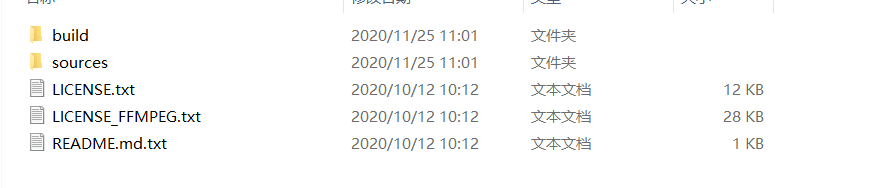

 电脑左上角找到“我的电脑”，点击鼠标右键，依次选择“属性”、“高级系统设置”、“环境变量”、“Path”。
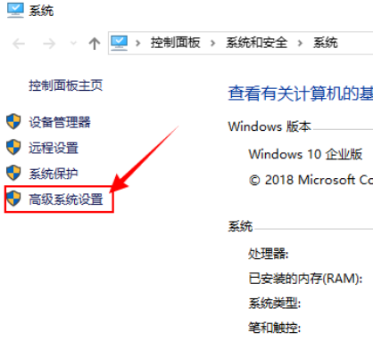
 

 双击“Path”进入到“编辑环境变量”页面，通过新建或者浏览的方式将opencv的“bin文件夹路径”添加到环境变量中，看看自己的电脑是64位还是32位，如果不知道vc14还是vc15可以看下面的VS版本和OpenCV中vc的对应关系表。
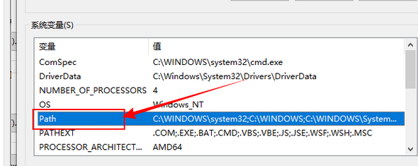

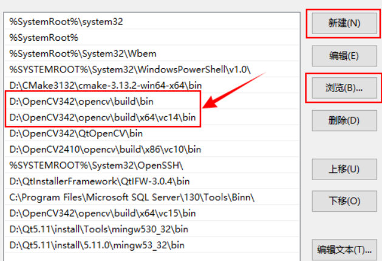

 注意：添加完环境变量之后最好重启一下电脑，使环境变量生效，不重启的话有可能会出现环境变量未生效这种情况。如果环境变量未生效，那么就找不到OpenCV的dll文件，会报计算机丢失xxx.dll。
    VS版本和OpenCV中vc的对应关系 VS2003	VC7
    VS2005	VC8
    VS2008	VC9
    VS2010	VC10
    VS2012	VC11
    VS2013	VC12
    VS2015	VC14
    VS2017	VC15

     

     

2、添加OpenCV包含目录和库目录：

    打开Visual Studio，新建一个C++项目，在Visual Studio左上角菜单栏，依次选择“视图”、“其他窗口”、“属性管理器”。找到自己对应的Debug和Release模式，比如说我目前想使用x64的Debug，我就选择第二项下的“Microsoft.Cpp.x64.user”。

    右键选择“属性”，进入“Microsoft.Cpp.x64.user的属性页”，依次选择“通用属性”、“VC++目录”，开始添加“包含目录”、“库目录”。 
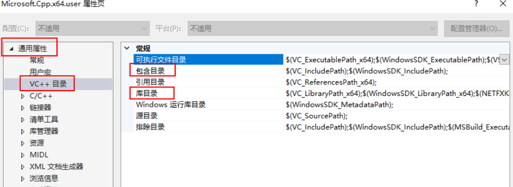
    选择“包含目录”，进入“包含目录”页面，添加OpenCV包含目录路径：

        D:\OpenCV342\opencv\build\include
        D:\OpenCV342\opencv\build\include\opencv
        D:\OpenCV342\opencv\build\include\opencv2
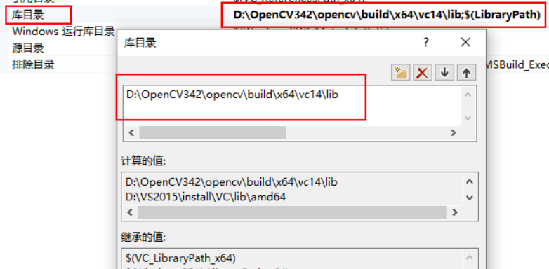
 

    选择“库目录”，进入“库目录”页面，添加库目录（lib文件夹）路径：

    D:\OpenCV342\opencv\build\x64\vc14\lib

3、添加附加依赖项

    添加附加依赖项就是添加所有的lib文件路径，这些lib文件都是在前面那个库目录里面保存的。由于OpenCV2和OpenCV3之间的不同，相应的附加依赖项也就不同。

    依次选择“链接器”、“输入”、“附加依赖项”，进入“附加依赖项”页面，开始添加lib文件路径。

    注意有两种lib文件，一种带d的是Debug模式，不带d的是Release模式，OpenCV版本不同，前面的序号也不同，需要做相应的修改，两种模式的lib最好不要放一起，否则有可能会导致其中一个模式出问题，Debug模式下使用namewindow函数创建窗口，运行代码会出现两幅图片。

    OpenCV3：

        opencv_world342.lib
        opencv_world342d.lib

    OpenCV2413的Debug版：

        opencv_contrib2413d.lib
        opencv_core2413d.lib
        opencv_features2d2413d.lib
        opencv_flann2413d.lib
        opencv_gpu2413d.lib
        opencv_highgui2413d.lib
        opencv_imgproc2413d.lib
        opencv_legacy2413d.lib
        opencv_ml2413d.lib
        opencv_nonfree2413d.lib
        opencv_objdetect2413d.lib
        opencv_ocl2413d.lib
        opencv_photo2413d.lib
        opencv_stitching2413d.lib
        opencv_superres2413d.lib
        opencv_ts2413d.lib
        opencv_video2413d.lib
        opencv_videostab2413d.lib

     OpenCV2413的Release版：

        opencv_contrib2413.lib
        opencv_core2413.lib
        opencv_features2d2413.lib
        opencv_flann2413.lib
        opencv_gpu2413.lib
        opencv_highgui2413.lib
        opencv_imgproc2413.lib
        opencv_legacy2413.lib
        opencv_ml2413.lib
        opencv_nonfree2413.lib
        opencv_objdetect2413.lib
        opencv_ocl2413.lib
        opencv_photo2413.lib
        opencv_stitching2413.lib
        opencv_superres2413.lib
        opencv_ts2413.lib
        opencv_video2413.lib
        opencv_videostab2413.lib
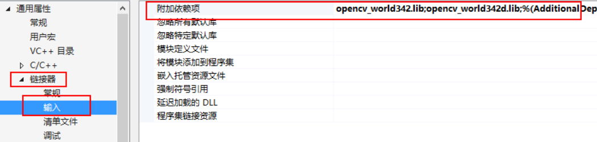
    到此，OpenCV就算是配置完了。

 
## 图像处理
图像显示
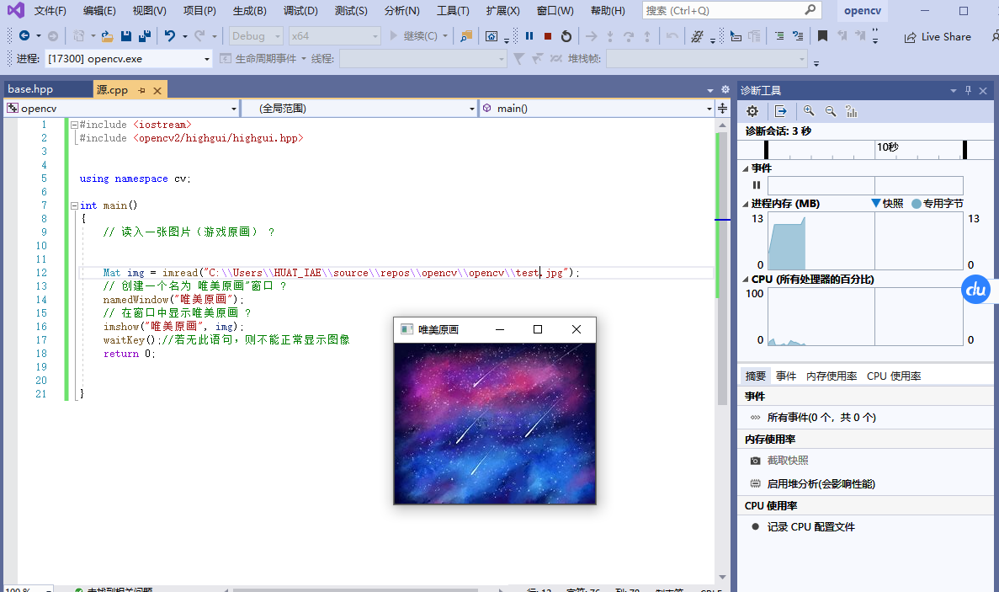
模糊处理
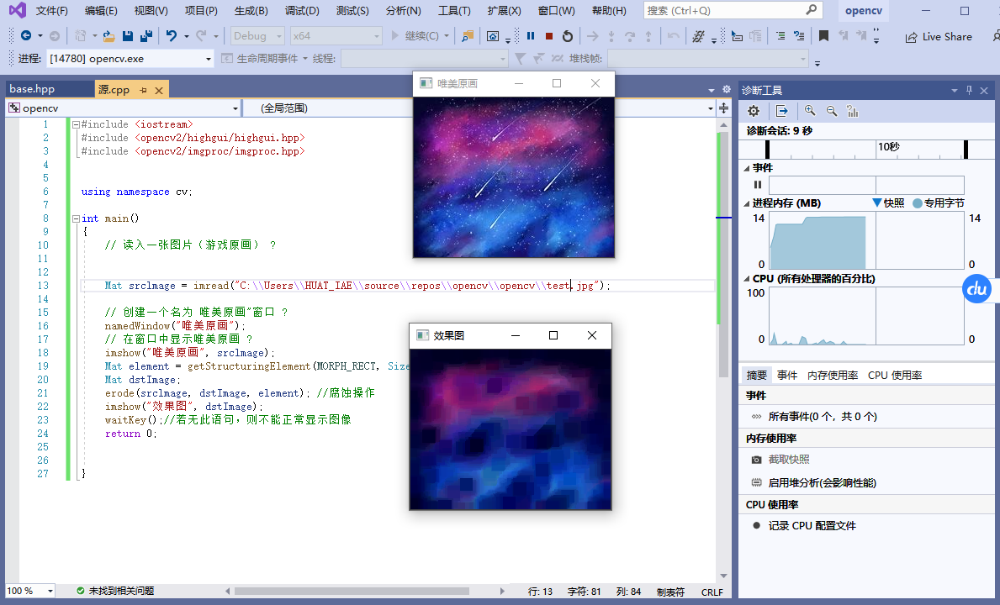
腐蚀
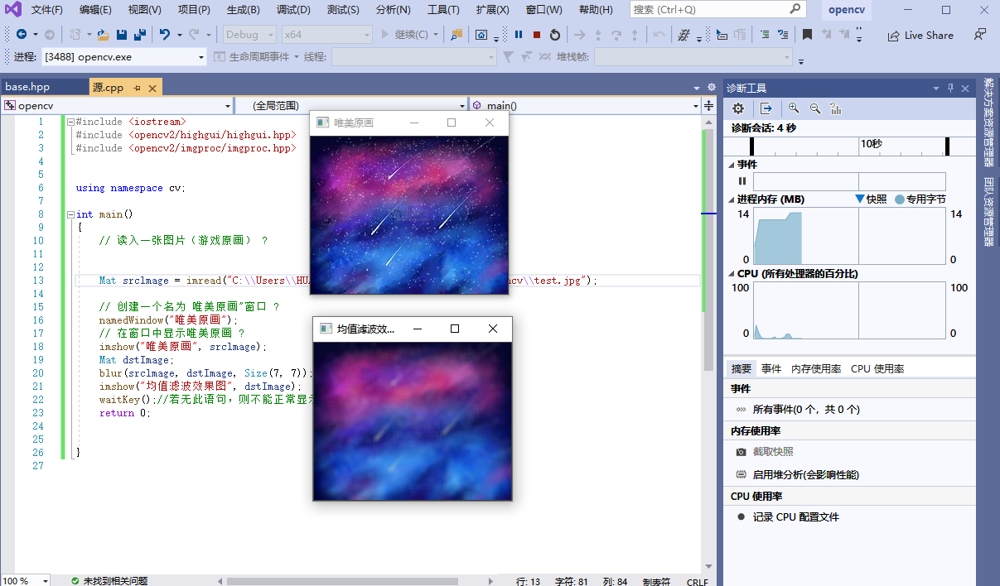
调用摄像头
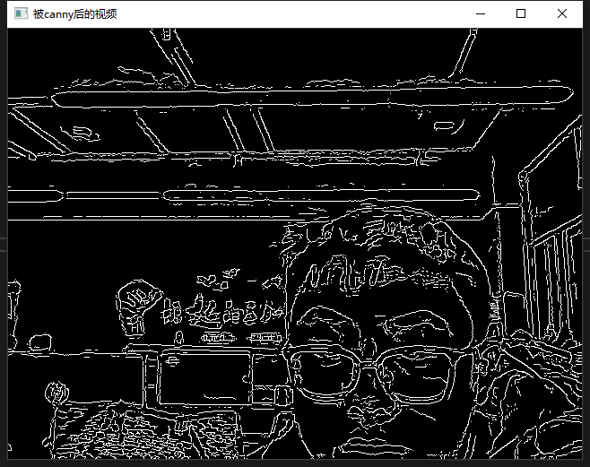
边缘检测
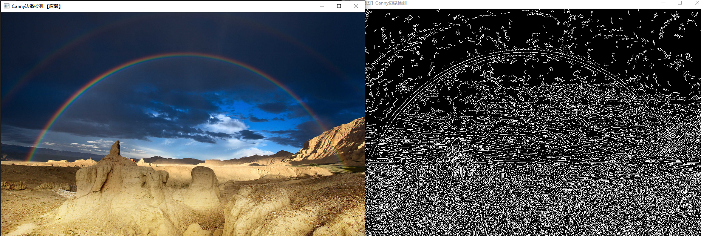
视频检测
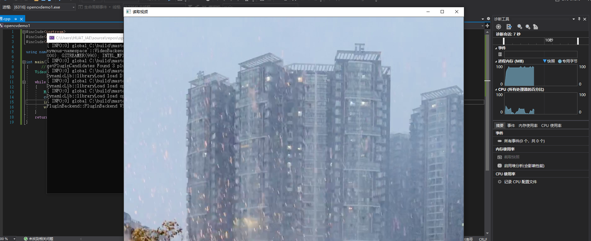


## OpenCV 启程

想要在 Windows 平台下生成 OpenCV 的解决方案，需要一个名为 CMake 的开源软件。
  CMake是一个跨平台的安装（编译）工具，可以用简单的语句来描述所有平台的安装(编译过程)。他能够输出各种各样的makefile或者project文件，能测试编译器所支持的C++特性,类似UNIX下的automake。只是 CMake 的组态档取名为 CMakeLists.txt。Cmake 并不直接建构出最终的软件，而是产生标准的建构档（如 Unix 的 Makefile 或 Windows Visual C++ 的 projects/workspaces），然后再依一般的建构方式使用。这使得熟悉某个集成开发环境（IDE）的开发者可以用标准的方式建构他的软件，这种可以使用各平台的原生建构系统的能力是 CMake 和 SCons 等其他类似系统的区别之处。

下载安装CMake

  在官网：https://cmake.org/ 上下载，进入下载页面，选择对应版本，在安装的时候记得勾选添加桌面图标和自动添加PATH路径。
选择对应版本
安装完成后点击桌面图标打开：
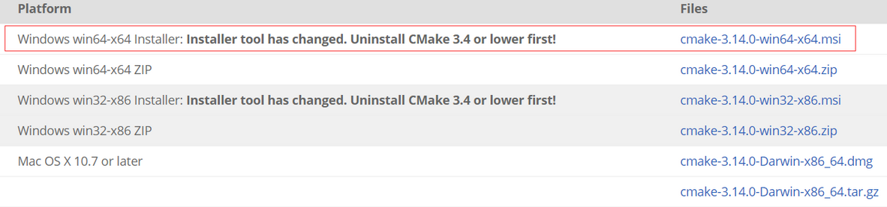

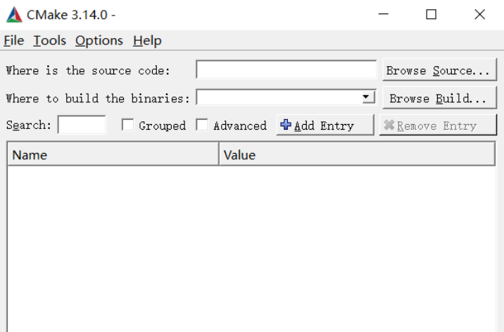
2.使用 CMake 生成 OpenCVd 源代码工程的解决方案

 1)第一步：运行 cmake-gui
 2）指定 OpenCV的安装路径选择安装OpenCV的文件目录下sources文件夹。在这里插入图片描述

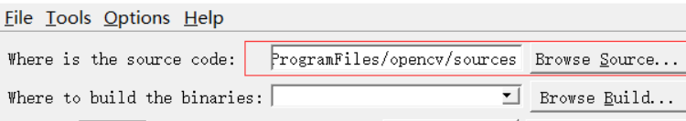
 3）指定解决方案的存放路径在这里插入图片描述

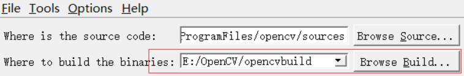
 4）第一次 Configure路径都设置好后，点击 Confugure 按键，进行第一次配置过程。在这里插入图片描述

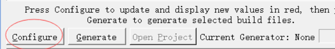
选择完后点击 finish, 开始 CMake 的第一次源码配置过程
看到 Config done 字样，第一次的源码配置就完成了
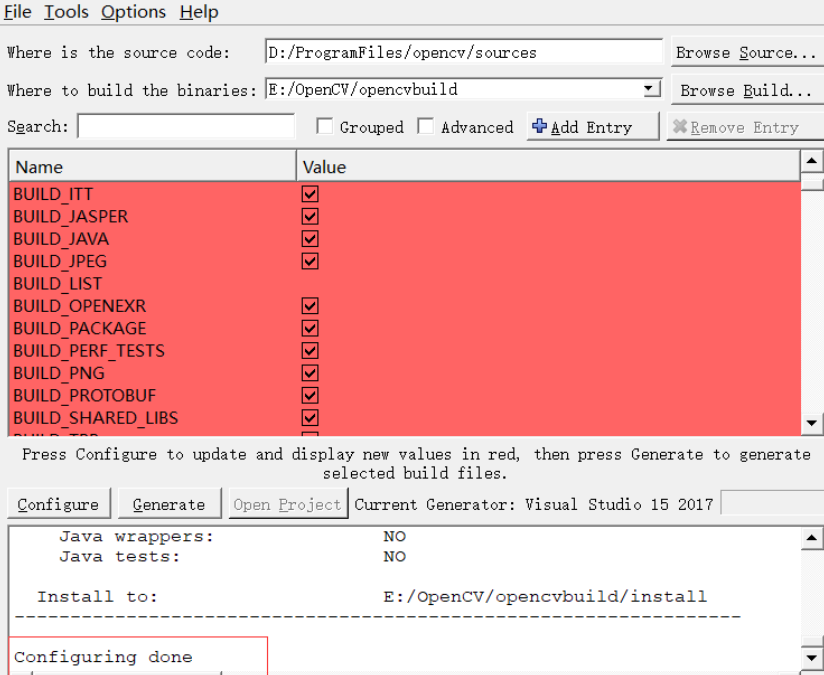
5）第二次 Configure
第一次配置之后还需第二次配置，于是再次单击 Configure 按键。

  6）单击 Generate 按钮，成功生成项目

出现 Generate done ，说明项目成功生成，接下来去之前指定的路径下寻找解决方案了。
3.编译OpenCV源码

  打开刚刚生成的 OpenCV.sln 解决方案，可以看到一个工程，之后按下 F5 或使用其他操作来启动调试。
  编译了好几分钟，编译完成后会得到如图所示的警告，原因是 OpenCV 的源代码工程将 ALL_BUILD 这个项目设为了启动项，编译成功后，就会默认运行它，而 ALL_BUILD 是一个项目生成周边的杂项，不是 exe 文件，本身不可以运行，因此会弹出自动提示框。
  若想让此报错的对话框不显示，指定一个另外的启动项即可：在解决方案资源管理器里，对需要设为启动项的那个项目右击，在弹出的菜单项中点击 “设为启动项（j）”进行设定。

  编译 OpenCV ，其实就是得到一些二进制的生成文件，如 dll、lib 和 exe。因为是在 debug 下编译的，所以在工程目录 bin\debug 下会生成 OpenCV 对应版本的依赖库，可以供以后调用此次编译的 OpenCV 时使用。

---

---
内容

- 1.安装Visual Studio 2019 Community
- 2.安装 openCV
- 3.配置opencv的环境变量
- 4.图片显示、图片腐蚀、blur图片模糊处理、canny边缘检测
- 5.读取视频并canny处理，调用摄像头并canny处理

---


## 彩色目标跟踪---Camshift

```cpp
#include "opencv2/core/utility.hpp"
#include "opencv2/video/tracking.hpp"
#include "opencv2/imgproc.hpp"
#include "opencv2/videoio.hpp"
#include "opencv2/highgui.hpp"

#include <iostream>
#include <ctype.h>

using namespace cv;
using namespace std;

Mat image;

bool backprojMode = false;
bool selectObject = false;
int trackObject = 0;
bool showHist = true;
Point origin;
Rect selection;
int vmin = 10, vmax = 256, smin = 30;

// User draws box around object to track. This triggers CAMShift to start tracking
static void onMouse(int event, int x, int y, int, void*)
{
    if (selectObject)
    {
        selection.x = MIN(x, origin.x);
        selection.y = MIN(y, origin.y);
        selection.width = std::abs(x - origin.x);
        selection.height = std::abs(y - origin.y);

        selection &= Rect(0, 0, image.cols, image.rows);
    }

    switch (event)
    {
    case EVENT_LBUTTONDOWN:
        origin = Point(x, y);
        selection = Rect(x, y, 0, 0);
        selectObject = true;
        break;
    case EVENT_LBUTTONUP:
        selectObject = false;
        if (selection.width > 0 && selection.height > 0)
            trackObject = -1;   // Set up CAMShift properties in main() loop
        break;
    }
}

string hot_keys =
"\n\nHot keys: \n"
"\tESC - quit the program\n"
"\tc - stop the tracking\n"
"\tb - switch to/from backprojection view\n"
"\th - show/hide object histogram\n"
"\tp - pause video\n"
"To initialize tracking, select the object with mouse\n";

static void help(const char** argv)
{
    cout << "\nThis is a demo that shows mean-shift based tracking\n"
        "You select a color objects such as your face and it tracks it.\n"
        "This reads from video camera (0 by default, or the camera number the user enters\n"
        "Usage: \n\t";
    cout << argv[0] << " [camera number]\n";
    cout << hot_keys;
}

const char* keys =
{
    "{help h | | show help message}{@camera_number| 0 | camera number}"
};

int main(int argc, const char** argv)
{
    VideoCapture cap;
    Rect trackWindow;
    int hsize = 16;
    float hranges[] = { 0,180 };
    const float* phranges = hranges;
    CommandLineParser parser(argc, argv, keys);
    if (parser.has("help"))
    {
        help(argv);
        return 0;
    }
    int camNum = parser.get<int>(0);
    cap.open(camNum);

    if (!cap.isOpened())
    {
        help(argv);
        cout << "***Could not initialize capturing...***\n";
        cout << "Current parameter's value: \n";
        parser.printMessage();
        return -1;
    }
    cout << hot_keys;
    namedWindow("Histogram", 0);
    namedWindow("CamShift Demo", 0);
    setMouseCallback("CamShift Demo", onMouse, 0);
    createTrackbar("Vmin", "CamShift Demo", &vmin, 256, 0);
    createTrackbar("Vmax", "CamShift Demo", &vmax, 256, 0);
    createTrackbar("Smin", "CamShift Demo", &smin, 256, 0);

    Mat frame, hsv, hue, mask, hist, histimg = Mat::zeros(200, 320, CV_8UC3), backproj;
    bool paused = false;

    for (;;)
    {
        if (!paused)
        {
            cap >> frame;
            if (frame.empty())
                break;
        }

        frame.copyTo(image);

        if (!paused)
        {
            cvtColor(image, hsv, COLOR_BGR2HSV);

            if (trackObject)
            {
                int _vmin = vmin, _vmax = vmax;

                inRange(hsv, Scalar(0, smin, MIN(_vmin, _vmax)),
                    Scalar(180, 256, MAX(_vmin, _vmax)), mask);
                int ch[] = { 0, 0 };
                hue.create(hsv.size(), hsv.depth());
                mixChannels(&hsv, 1, &hue, 1, ch, 1);

                if (trackObject < 0)
                {
                    // Object has been selected by user, set up CAMShift search properties once
                    Mat roi(hue, selection), maskroi(mask, selection);
                    calcHist(&roi, 1, 0, maskroi, hist, 1, &hsize, &phranges);
                    normalize(hist, hist, 0, 255, NORM_MINMAX);

                    trackWindow = selection;
                    trackObject = 1; // Don't set up again, unless user selects new ROI

                    histimg = Scalar::all(0);
                    int binW = histimg.cols / hsize;
                    Mat buf(1, hsize, CV_8UC3);
                    for (int i = 0; i < hsize; i++)
                        buf.at<Vec3b>(i) = Vec3b(saturate_cast<uchar>(i * 180. / hsize), 255, 255);
                    cvtColor(buf, buf, COLOR_HSV2BGR);

                    for (int i = 0; i < hsize; i++)
                    {
                        int val = saturate_cast<int>(hist.at<float>(i) * histimg.rows / 255);
                        rectangle(histimg, Point(i * binW, histimg.rows),
                            Point((i + 1) * binW, histimg.rows - val),
                            Scalar(buf.at<Vec3b>(i)), -1, 8);
                    }
                }

                // Perform CAMShift
                calcBackProject(&hue, 1, 0, hist, backproj, &phranges);
                backproj &= mask;
                RotatedRect trackBox = CamShift(backproj, trackWindow,
                    TermCriteria(TermCriteria::EPS | TermCriteria::COUNT, 10, 1));
                if (trackWindow.area() <= 1)
                {
                    int cols = backproj.cols, rows = backproj.rows, r = (MIN(cols, rows) + 5) / 6;
                    trackWindow = Rect(trackWindow.x - r, trackWindow.y - r,
                        trackWindow.x + r, trackWindow.y + r) &
                        Rect(0, 0, cols, rows);
                }

                if (backprojMode)
                    cvtColor(backproj, image, COLOR_GRAY2BGR);
                ellipse(image, trackBox, Scalar(0, 0, 255), 3, LINE_AA);
            }
        }
        else if (trackObject < 0)
            paused = false;

        if (selectObject && selection.width > 0 && selection.height > 0)
        {
            Mat roi(image, selection);
            bitwise_not(roi, roi);
        }

        imshow("CamShift Demo", image);
        imshow("Histogram", histimg);

        char c = (char)waitKey(10);
        if (c == 27)
            break;
        switch (c)
        {
        case 'b':
            backprojMode = !backprojMode;
            break;
        case 'c':
            trackObject = 0;
            histimg = Scalar::all(0);
            break;
        case 'h':
            showHist = !showHist;
            if (!showHist)
                destroyWindow("Histogram");
            else
                namedWindow("Histogram", 1);
            break;
        case 'p':
            paused = !paused;
            break;
        default:
            ;
        }
    }

    return 0;
}
```


##  点追踪---lkdemo

运行opencv\sources\samples\cpp下的lkdemo.cpp文件，会自动调用摄像头，按下r,会启动自动点追踪，可以看到点会随着人像的移动而移动

代码：
```cpp
#include "opencv2/video/tracking.hpp"
#include "opencv2/imgproc.hpp"
#include "opencv2/videoio.hpp"
#include "opencv2/highgui.hpp"

#include <iostream>
#include <ctype.h>

using namespace cv;
using namespace std;

static void help()
{
    // print a welcome message, and the OpenCV version
    cout << "\nThis is a demo of Lukas-Kanade optical flow lkdemo(),\n"
        "Using OpenCV version " << CV_VERSION << endl;
    cout << "\nIt uses camera by default, but you can provide a path to video as an argument.\n";
    cout << "\nHot keys: \n"
        "\tESC - quit the program\n"
        "\tr - auto-initialize tracking\n"
        "\tc - delete all the points\n"
        "\tn - switch the \"night\" mode on/off\n"
        "To add/remove a feature point click it\n" << endl;
}

Point2f point;
bool addRemovePt = false;

static void onMouse(int event, int x, int y, int /*flags*/, void* /*param*/)
{
    if (event == EVENT_LBUTTONDOWN)
    {
        point = Point2f((float)x, (float)y);
        addRemovePt = true;
    }
}

int main(int argc, char** argv)
{
    VideoCapture cap;
    TermCriteria termcrit(TermCriteria::COUNT | TermCriteria::EPS, 20, 0.03);
    Size subPixWinSize(10, 10), winSize(31, 31);

    const int MAX_COUNT = 500;
    bool needToInit = false;
    bool nightMode = false;

    help();
    cv::CommandLineParser parser(argc, argv, "{@input|0|}");
    string input = parser.get<string>("@input");

    if (input.size() == 1 && isdigit(input[0]))
        cap.open(input[0] - '0');
    else
        cap.open(input);

    if (!cap.isOpened())
    {
        cout << "Could not initialize capturing...\n";
        return 0;
    }

    namedWindow("LK Demo", 1);
    setMouseCallback("LK Demo", onMouse, 0);

    Mat gray, prevGray, image, frame;
    vector<Point2f> points[2];

    for (;;)
    {
        cap >> frame;
        if (frame.empty())
            break;

        frame.copyTo(image);
        cvtColor(image, gray, COLOR_BGR2GRAY);

        if (nightMode)
            image = Scalar::all(0);

        if (needToInit)
        {
            // automatic initialization
            goodFeaturesToTrack(gray, points[1], MAX_COUNT, 0.01, 10, Mat(), 3, 3, 0, 0.04);
            cornerSubPix(gray, points[1], subPixWinSize, Size(-1, -1), termcrit);
            addRemovePt = false;
        }
        else if (!points[0].empty())
        {
            vector<uchar> status;
            vector<float> err;
            if (prevGray.empty())
                gray.copyTo(prevGray);
            calcOpticalFlowPyrLK(prevGray, gray, points[0], points[1], status, err, winSize,
                3, termcrit, 0, 0.001);
            size_t i, k;
            for (i = k = 0; i < points[1].size(); i++)
            {
                if (addRemovePt)
                {
                    if (norm(point - points[1][i]) <= 5)
                    {
                        addRemovePt = false;
                        continue;
                    }
                }

                if (!status[i])
                    continue;

                points[1][k++] = points[1][i];
                circle(image, points[1][i], 3, Scalar(0, 255, 0), -1, 8);
            }
            points[1].resize(k);
        }

        if (addRemovePt && points[1].size() < (size_t)MAX_COUNT)
        {
            vector<Point2f> tmp;
            tmp.push_back(point);
            cornerSubPix(gray, tmp, winSize, Size(-1, -1), termcrit);
            points[1].push_back(tmp[0]);
            addRemovePt = false;
        }

        needToInit = false;
        imshow("LK Demo", image);

        char c = (char)waitKey(10);
        if (c == 27)
            break;
        switch (c)
        {
        case 'r':
            needToInit = true;
            break;
        case 'c':
            points[0].clear();
            points[1].clear();
            break;
        case 'n':
            nightMode = !nightMode;
            break;
        }

        std::swap(points[1], points[0]);
        cv::swap(prevGray, gray);
    }

    return 0;
}
```
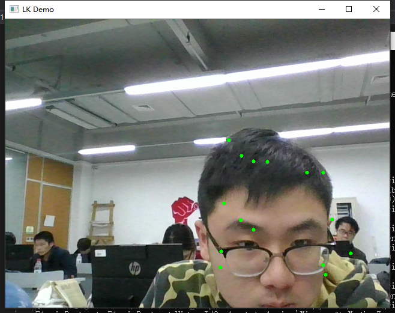

## 图像的载入、显示和输出

##  鼠标操作

OpenCV 中的鼠标操作和滑动条的消息映射方式很类似，都是通过一个中介函数配合一个回调函数来实现的。创建和指定滑动条回调函数的函数为createTrackbar，而指定鼠标操作消息回调函数的函数为SetMouseCallback.
SetMouseCallback 函数的作用是为指定的窗口设置鼠标回调函数，原型如下。
```cpp
C++: void setMouseCallback(conststring6winname,MouseCallback onMouse, void* userdata=0 )
```
● 第一个参数，const string&类型的 winname，窗口的名字。
● 第二个参数，MouseCallback 类型的 onMouse，指定窗口里每次鼠标时间发生的时候，被调用的函数指针。这个函数的原型的大概形式为void Foo（int event，intx，inty，itflags，void*param）。其中event 是EVENT_+变量之一，x和y是鼠标指针在图像坐标系（需要注意，不是窗口坐标系）中的坐标值，flags 是 EVENT_FLAG 的组合，param 是用户定义的传递到SetMouseCallback函数调用的参数。如EVENT_MOUSEMOVE为鼠标移动消息、EVENT_LBUTTONDOWN为鼠标左键按下消息等。

```cpp
#include<iostream>
#include <opencv2/opencv.hpp>

using namespace cv;
//为窗口标题定义的宏
#define WINDOW_NAME "【程序窗口】"
void on_MouseHandle(int event, int x, int y, int flags, void* param);
void DrawRectangle(cv::Mat& img, cv::Rect box);
Rect g_rectangle;
bool g_bDrawingBox = false;//是否进行绘制RNG g_rng(12345);
RNG g_rng(12345);
//【1】准备参数
int main(int argc, char** argv) {
	g_rectangle = Rect(-1, -1, 0, 0);
	Mat srcImage(600, 800, CV_8UC3), tempImage;
	srcImage.copyTo(tempImage);
	g_rectangle = Rect(-1, -1, 0, 0);
	srcImage = Scalar::all(0);

	namedWindow(WINDOW_NAME);
	setMouseCallback(WINDOW_NAME, on_MouseHandle, (void*)&srcImage);

	//【3】程序主循环，当进行绘制的标识符为真时，进行绘制
	while (1){
	srcImage.copyTo(tempImage);//复制源图到临时变量
	if (g_bDrawingBox)DrawRectangle(tempImage, g_rectangle);//当进行绘制的标识符为真，则进行绘制
	imshow(WINDOW_NAME, tempImage);
	if(waitKey(10) == 27)
		break;//按下 ESC键，程序退出return 0;
}
return 0;
}
void on_MouseHandle(int event, int x, int y, int flags, void* param) {
	Mat& image = *(cv::Mat*) param;
	switch (event) {
		//鼠标移动消息
	case EVENT_MOUSEMOVE: {
		if(g_bDrawingBox )//如果是否进行绘制的标识符为真，则记录下长和宽到 RECT 型变量中
		{
			g_rectangle.width = x - g_rectangle.x;
			g_rectangle.height = y - g_rectangle.y;
		}
	}
						break;// 左键按下消息
	case EVENT_LBUTTONDOWN:
	{
		g_bDrawingBox = true;
		g_rectangle = Rect(x,y,0,0);//记录起始点)
	}
	break;
	//左键抬起消息
	case EVENT_LBUTTONUP: {
		g_bDrawingBox = false;//置标识符为false //对宽和高小于 0的处理
		if (g_rectangle.width < 0) {
			g_rectangle.x += g_rectangle.width;
			g_rectangle.width *= -1;
		}
		if (g_rectangle.height < 0) {
			g_rectangle.y += g_rectangle.height;
			g_rectangle.height *= -1;
		}
		//调用函数进行绘制
		DrawRectangle(image, g_rectangle);
	}
						break;
	}
}
	
void DrawRectangle(cv::Mat& img, cv::Rect box)
{
	rectangle(img, box.tl(), box.br(), Scalar(g_rng.uniform(0, 255),
		g_rng.uniform(0,255),g_rng.uniform(0,255)));//随机颜色

}
```

效果图：

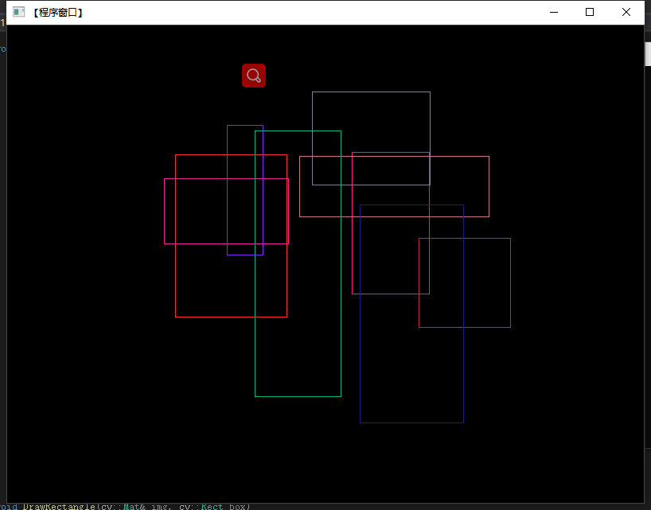