## OpenCV安装
1- 安装
2- 添加环境变量
3- 添加属性表在属性中的VC++里设置包含目录和库目录和依赖关系
4-重启运行测试代码
## 代码测试
### 原图显示
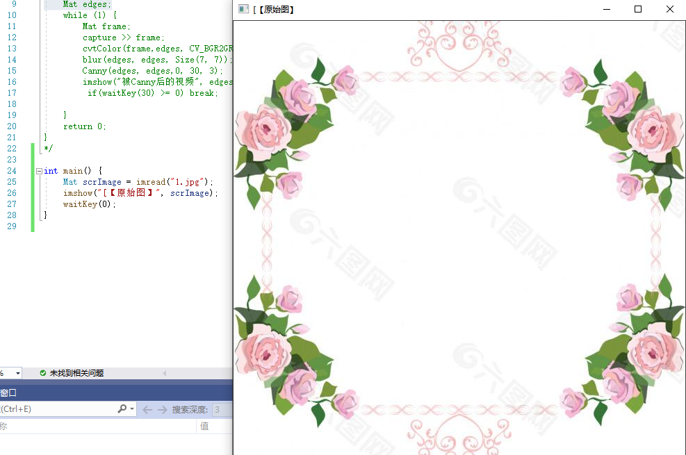

代码分析：Mat类图像储存数据结构 imshow()z载入图片,imshow()显示图片，waitKey(),等待按键按下。

### 腐蚀操作
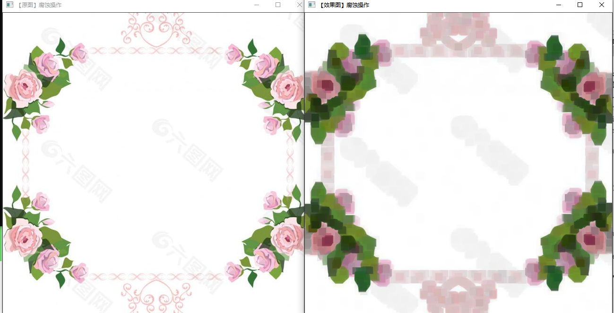
 
 代码分析：getStructuringElement(MORPH_RECT,Size(height,width))返回指定形状和尺寸的结构元素(内核矩阵) erode()腐蚀操作：函数可以对输入图像用特定结构元素进行腐蚀操作，该结构元素确定腐蚀操作过程中的邻域的形状，各点像素值将被替换为对应邻域上的最小值

 ### 图片均值（均值滤波）

 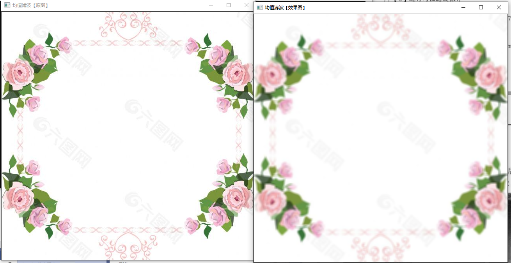

代码分析：blur(InputArray,dstOuputArray,size(height,width))blur的作用是对输入的图像src进行均值滤波后用dst输出

### 读取播放视频并Canny边缘检测
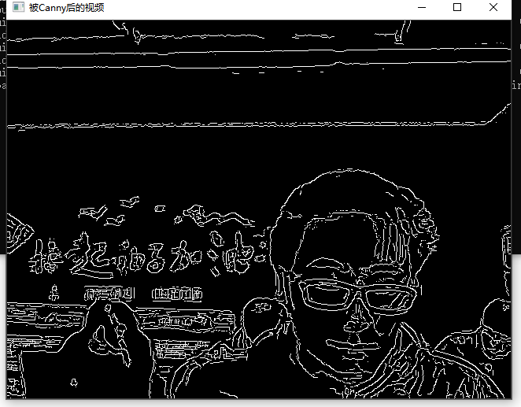

代码分析：VideoCapture capture(0)从摄像头读入视频
cvtColor(frame,edges,CV_BGR2GRAY)转化BGR彩色图为灰度图。
Canny 边缘检测：图像的边缘检测的原理是检测出图像中所有灰度值变化较大的点，而且这些点连接起来就构成了若干线条，这些线条就可以称为图像的边缘

### 彩色目标跟踪
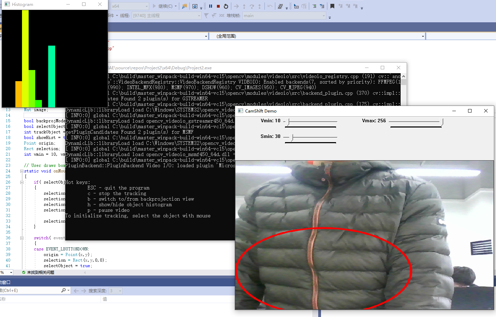

### 点追踪

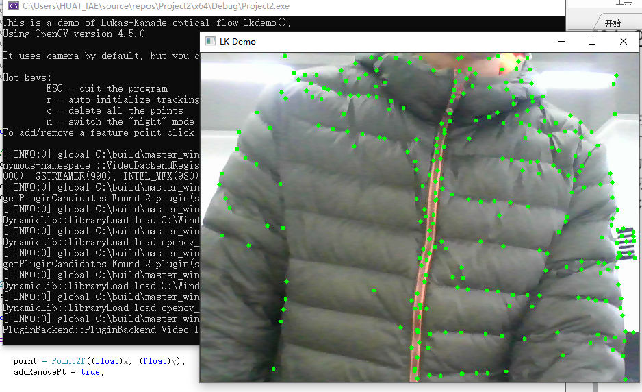

### 人脸识别
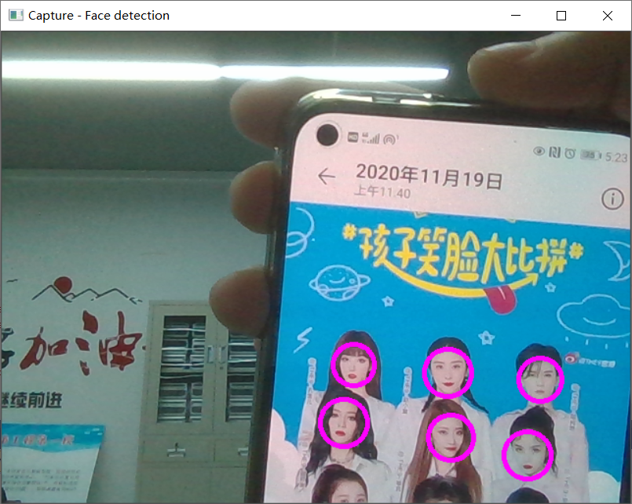

### 图像载入和输出，显示

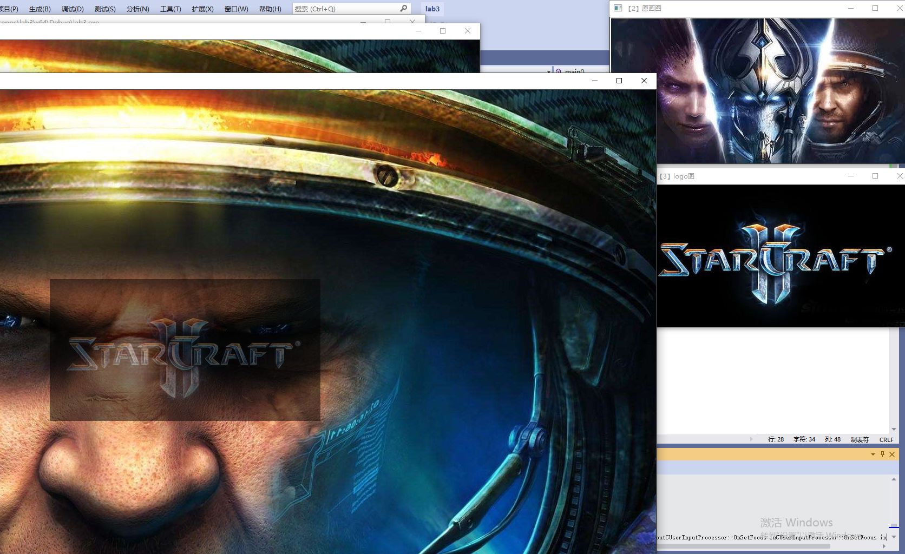
通过imwrite()生成的图片
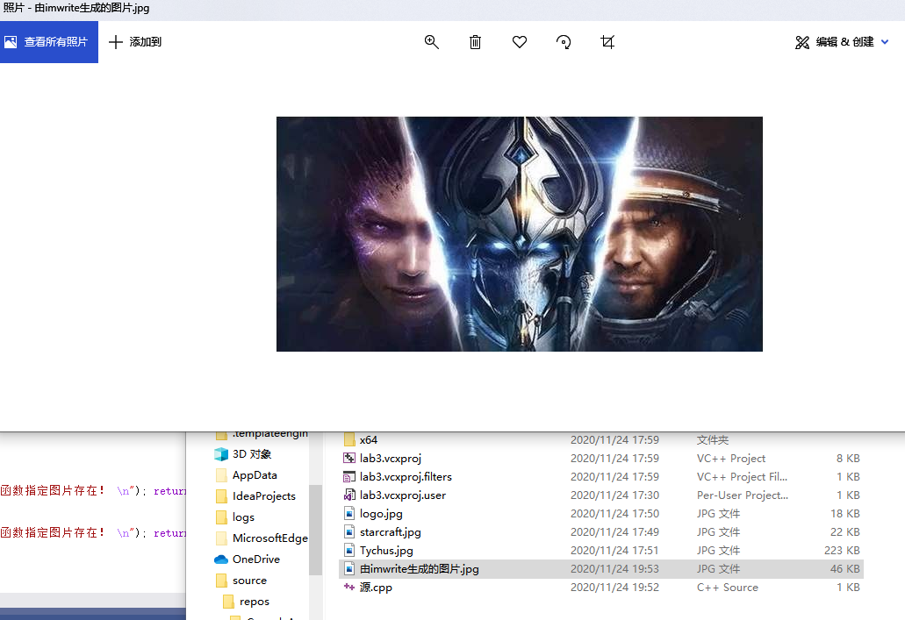

代码分析：Rect(800,350,logo.cols,logo.rows):Rect数据结构经常是在OpenCV中被用来表示为一个矩形尺寸，其成员包括x,y, width,height，其中x和y分别表示矩形框的左上角的起始点坐标，width和height分别表示宽和高，返回一个size().

nameWindow(string name，int flag)创建一个窗口

addWeighted(原数组,数组元素权重,第二个原数组,第二个数组元素权重,gamma参数，输出图片)

### 轨迹条的创建和使用
透明度44%
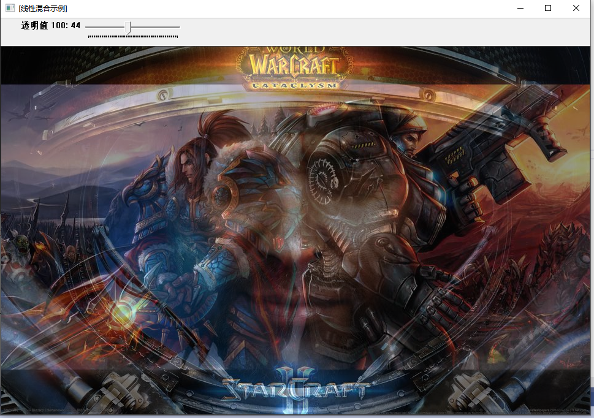
透明度64%
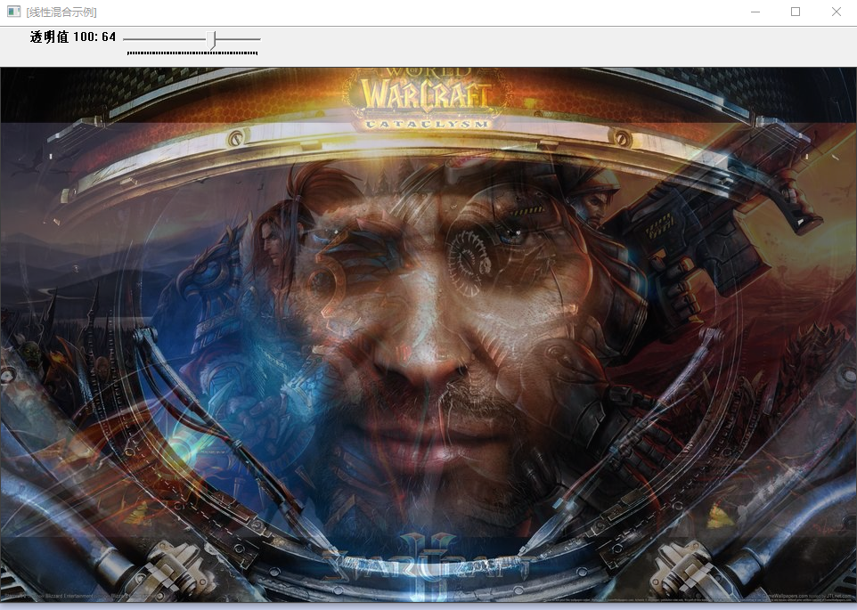

代码分析：createTrackbar(轨道条名字，依附窗口名，指向滑块的位置，最大滑块位置，回调函数指针（这里指向轨道条事件），用户传回数据（用来处理轨道条事件）)

### 鼠标操作（画矩形）

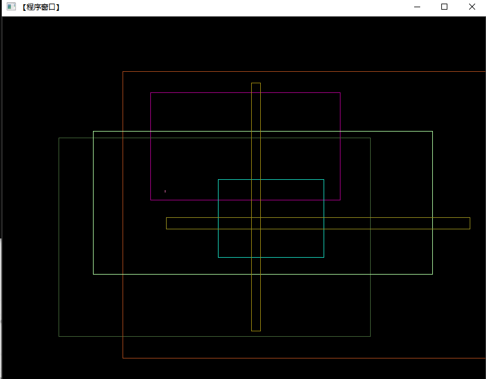

代码分析：setMouseCallBack（winname，鼠标调用时调用指针）

总结：学习了Mat类的简单应用和配置OpenCV及其函数简答应用，了解了回调函数。