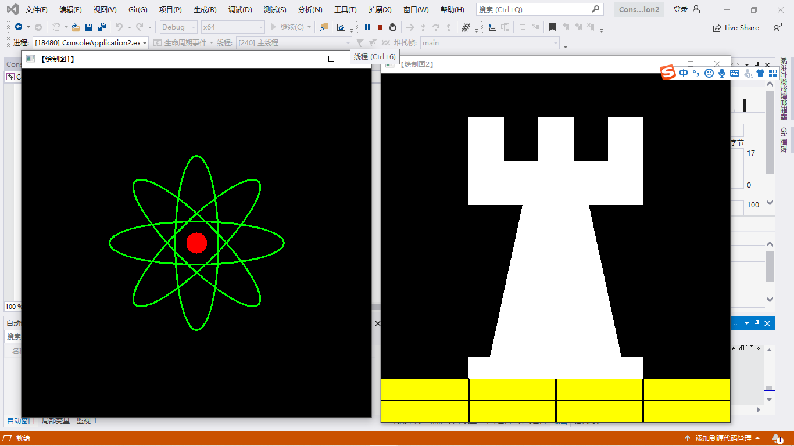
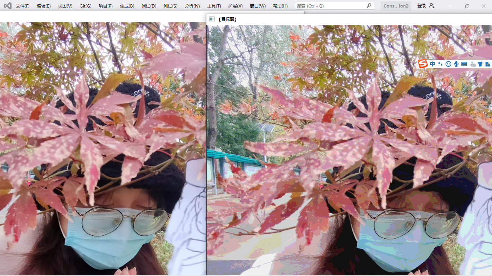
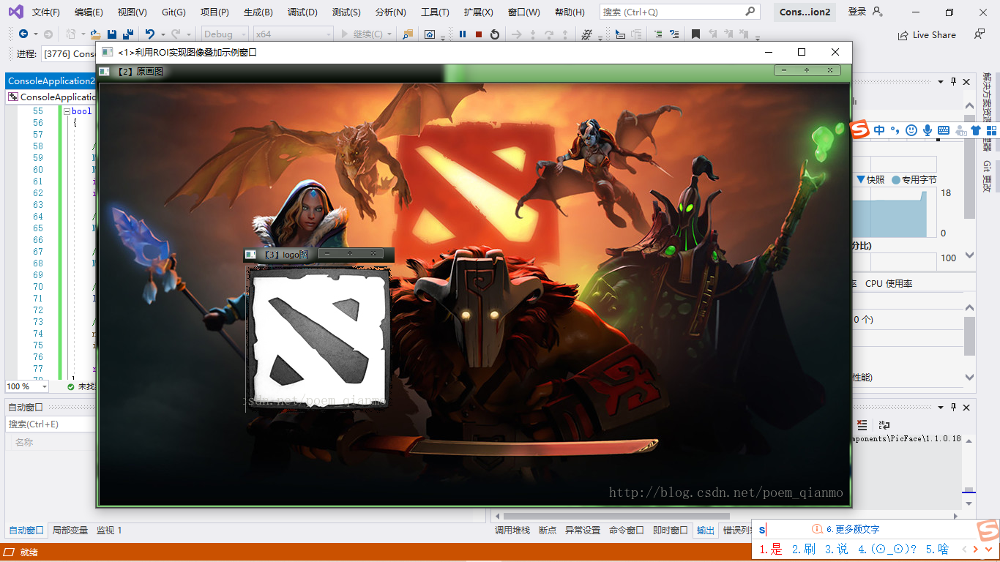

#### 对mat的认知
Mat是一个容器类，支持C++中一般容器对元素的操作，同时作为一种矩阵数据存储类，由两个数据部分构成：1、矩阵头：包含矩阵尺寸、存储方式、存储地址等信息；2、指向存储所有像素值的矩阵的指针。矩阵头的尺寸是常数，但尺寸本身的尺寸会因图像的不同而不同。
通常创建和传递矩阵时会造成很大开销，在进行较大矩阵复制时，OpenCV引入了计数机制，让每个Mat对象都有自己的信息头，但共享同一个矩阵，者通过让矩阵指针指向同一地址实现，所以拷贝构造函数只复制信息头和矩阵指针，而不复制矩阵，避免了大量的空间时间开销。
然而某些时候你还是会复制矩阵本身，（不只是信息头和矩阵指针），这时可以使用函数clone()和copyTo()函数。

构造Mat矩阵时：

- 使用赋值运算符和拷贝构造函数只复制信息头，改变任何一个矩阵都会影响到其他矩阵。
- 使用函数Clone()和copyTo()来复制一幅图像的矩阵，新创建的矩阵和原矩阵相互独立，改变其中一个矩阵不会影响到其他矩阵。

#### 像素值的存储方法
存储像素值需要指定颜色空间和数据类型。
- 颜色空间是指针对一个给定的颜色，如何组合颜色元素以对其编码。最简单的颜色空间要属灰度级空间， 只处理黑色和白色， 对它们进行组合便可以产生不同程度的灰色。
#### 显示创建mat对象的七种方法
- 使用mat（）构造函数。
- 在C/C++中通过构造函数进行初始化。
- 为已存在的Ipllmage指针创建信息头
- 利用Create（）函数
- 采用Matlab式的初始化方式
- 对小矩阵使用逗号分隔式初始化函数
- 为已存在的对象创建信息头
#### OpenCV中的格式化输出方法
- OpenCV默认风格
- Python风格
- 逗号分隔风格（Comma separated values，CSV）
- numpy风格
- C语言风格
#### 输出其他常用数据结构
- 定义和输出二维点
- 定义和输出三维点
- 定义和输出基于Mat的std::vector
- 定义和输出std::vector点
#### 基础图像容器Mat类的使用
代码：
 #include "opencv2/core/core.hpp"
 #include "opencv2/highgui/highgui.hpp"
 #include <iostream>
using namespace std;
using namespace cv;

//-----------------------------【ShowHelpText( )函数】--------------------------------------
//		描述：输出帮助信息
//-------------------------------------------------------------------------------------------------
static void ShowHelpText()
{
	//输出欢迎信息和OpenCV版本
	printf("\n\n\t\t\t非常感谢购买《OpenCV3编程入门》一书！\n");
	printf("\n\n\t\t\t此为本书OpenCV3版的第19个配套示例程序\n");
	printf("\n\n\t\t\t   当前使用的OpenCV版本为：" CV_VERSION);
	printf("\n\n  ----------------------------------------------------------------------------\n");

	//输出一些帮助信息
	printf("\n\n\n\t欢迎来到【基本图像容器-Mat类】示例程序~\n\n");
	printf("\n\n\t程序说明：\n\n\t此示例程序用于演示Mat类的格式化输出功能，输出风格可为：");
	printf("\n\n\n\t【1】OpenCV默认风格");
	printf("\n\n\t【2】Python风格");
	printf("\n\n\t【3】逗号分隔风格");
	printf("\n\n\t【4】Numpy风格");
	printf("\n\n\t【5】C语言风格\n\n");
	printf("\n  --------------------------------------------------------------------------\n");

}

//--------------------------------------【main( )函数】-----------------------------------------
//          描述：控制台应用程序的入口函数，我们的程序从这里开始执行
//-----------------------------------------------------------------------------------------------
int main(int, char**)
{
	//改变控制台的前景色和背景色
	system("color 8F");

	//显示帮助文字
	ShowHelpText();

	Mat I = Mat::eye(4, 4, CV_64F);
	I.at<double>(1, 1) = CV_PI;
	cout << "\nI = " << I << ";\n" << endl;

	Mat r = Mat(10, 3, CV_8UC3);
	randu(r, Scalar::all(0), Scalar::all(255));

	//此段代码的OpenCV2版为：
	//cout << "r (OpenCV默认风格) = " << r << ";" << endl << endl;
	//cout << "r (Python风格) = " << format(r,"python") << ";" << endl << endl;
	//cout << "r (Numpy风格) = " << format(r,"numpy") << ";" << endl << endl;
	//cout << "r (逗号分隔风格) = " << format(r,"csv") << ";" << endl<< endl;
	//cout << "r (C语言风格) = " << format(r,"C") << ";" << endl << endl;
	//此段代码的OpenCV3版为：
	cout << "r (OpenCV默认风格) = " << r << ";" << endl << endl;
	cout << "r (Python风格) = " << format(r, Formatter::FMT_PYTHON) << ";" << endl << endl;
	cout << "r (Numpy风格) = " << format(r, Formatter::FMT_NUMPY) << ";" << endl << endl;
	cout << "r (逗号分隔风格) = " << format(r, Formatter::FMT_CSV) << ";" << endl << endl;
	cout << "r (C语言风格) = " << format(r, Formatter::FMT_C) << ";" << endl << endl;

	Point2f p(6, 2);
	cout << "【2维点】p = " << p << ";\n" << endl;

	Point3f p3f(8, 2, 0);
	cout << "【3维点】p3f = " << p3f << ";\n" << endl;

	vector<float> v;
	v.push_back(3);
	v.push_back(5);
	v.push_back(7);

	cout << "【基于Mat的vector】shortvec = " << Mat(v) << ";\n" << endl;

	vector<Point2f> points(20);
	for (size_t i = 0; i < points.size(); ++i)
		points[i] = Point2f((float)(i * 5), (float)(i % 7));

	cout << "【二维点向量】points = " << points << ";";

	getchar();//按任意键退出

	return 0;

}

#### 基本图形绘制
代码
 #include <opencv2/core/core.hpp>
 #include <opencv2/highgui/highgui.hpp>
using namespace cv;

 #include <opencv2/imgproc/imgproc.hpp>

 #define WINDOW_NAME1 "【绘制图1】"        //为窗口标题定义的宏 
 #define WINDOW_NAME2 "【绘制图2】"        //为窗口标题定义的宏 
 #define WINDOW_NAME3 "【绘制图3】"        //为窗口标题定义的宏 
 #define WINDOW_WIDTH 600//定义窗口大小的宏

// 椭圆
void DrawEllipse(Mat img, double angle)
{
    int thickness = 2;
    int lineType = 8;

    // 
    ellipse(
        img,
        Point(WINDOW_WIDTH / 2, WINDOW_WIDTH / 2),
        Size(WINDOW_WIDTH / 4, WINDOW_WIDTH / 16),
        angle,
        0,
        360,
        Scalar(0, 255, 0),
        thickness,
        lineType);
}

// 圆
void DrawFilledCircle(Mat img, Point center)
{
    int thickness = -1;
    int lineType = 8;

    circle(
        img,
        center,
        WINDOW_WIDTH / 32,
        Scalar(0, 0, 255),
        thickness,
        lineType);
}

// 多边形
void DrawPolygon(Mat img)
{
    int lineType = 8;

    //创建一些点
    Point rookPoints[1][20];
    rookPoints[0][0] = Point(WINDOW_WIDTH / 4, 7 * WINDOW_WIDTH / 8);
    rookPoints[0][1] = Point(3 * WINDOW_WIDTH / 4, 7 * WINDOW_WIDTH / 8);
    rookPoints[0][2] = Point(3 * WINDOW_WIDTH / 4, 13 * WINDOW_WIDTH / 16);
    rookPoints[0][3] = Point(11 * WINDOW_WIDTH / 16, 13 * WINDOW_WIDTH / 16);
    rookPoints[0][4] = Point(19 * WINDOW_WIDTH / 32, 3 * WINDOW_WIDTH / 8);
    rookPoints[0][5] = Point(3 * WINDOW_WIDTH / 4, 3 * WINDOW_WIDTH / 8);
    rookPoints[0][6] = Point(3 * WINDOW_WIDTH / 4, WINDOW_WIDTH / 8);
    rookPoints[0][7] = Point(26 * WINDOW_WIDTH / 40, WINDOW_WIDTH / 8);
    rookPoints[0][8] = Point(26 * WINDOW_WIDTH / 40, WINDOW_WIDTH / 4);
    rookPoints[0][9] = Point(22 * WINDOW_WIDTH / 40, WINDOW_WIDTH / 4);
    rookPoints[0][10] = Point(22 * WINDOW_WIDTH / 40, WINDOW_WIDTH / 8);
    rookPoints[0][11] = Point(18 * WINDOW_WIDTH / 40, WINDOW_WIDTH / 8);
    rookPoints[0][12] = Point(18 * WINDOW_WIDTH / 40, WINDOW_WIDTH / 4);
    rookPoints[0][13] = Point(14 * WINDOW_WIDTH / 40, WINDOW_WIDTH / 4);
    rookPoints[0][14] = Point(14 * WINDOW_WIDTH / 40, WINDOW_WIDTH / 8);
    rookPoints[0][15] = Point(WINDOW_WIDTH / 4, WINDOW_WIDTH / 8);
    rookPoints[0][16] = Point(WINDOW_WIDTH / 4, 3 * WINDOW_WIDTH / 8);
    rookPoints[0][17] = Point(13 * WINDOW_WIDTH / 32, 3 * WINDOW_WIDTH / 8);
    rookPoints[0][18] = Point(5 * WINDOW_WIDTH / 16, 13 * WINDOW_WIDTH / 16);
    rookPoints[0][19] = Point(WINDOW_WIDTH / 4, 13 * WINDOW_WIDTH / 16);

    const Point* ppt[1] = { rookPoints[0] };
    int npt[] = { 20 };

    fillPoly(img,
        ppt,
        npt,
        1,
        Scalar(255, 255, 255),
        lineType);
}

// 线
void DrawLine(Mat img, Point start, Point end)
{
    int lineType = 8;
    int thickness = 2;
    line(img,
        start,
        end,
        Scalar(0, 0, 0),
        thickness,
        lineType);
}

int main(void)
{

    // 创建空白的Mat图像
    Mat atomImage = Mat::zeros(WINDOW_WIDTH, WINDOW_WIDTH, CV_8UC3);
    Mat rookImage = Mat::zeros(WINDOW_WIDTH, WINDOW_WIDTH, CV_8UC3);

    //【1.1】先绘制出椭圆
    DrawEllipse(atomImage, 90);
    DrawEllipse(atomImage, 0);
    DrawEllipse(atomImage, 45);
    DrawEllipse(atomImage, -45);

    //【1.2】再绘制圆心
    DrawFilledCircle(atomImage, Point(WINDOW_WIDTH / 2, WINDOW_WIDTH / 2));

    imshow(WINDOW_NAME1, atomImage);
    moveWindow( WINDOW_NAME1, 0, 200 );

    // ----------------------------<2>绘制组合图-----------------------------
    //【2.1】多边形
    DrawPolygon(rookImage);

    // 【2.2】绘制底部矩形
    rectangle(rookImage,
        Point(0, 7 * WINDOW_WIDTH / 8),
        Point(WINDOW_WIDTH, WINDOW_WIDTH),
        Scalar(0, 255, 255),
        -1,
        8);

    // 【2.3】绘制底部线段
    DrawLine(rookImage, Point(0, 15 * WINDOW_WIDTH / 16), Point(WINDOW_WIDTH, 15 * WINDOW_WIDTH / 16));
    DrawLine(rookImage, Point(WINDOW_WIDTH / 4, 7 * WINDOW_WIDTH / 8), Point(WINDOW_WIDTH / 4, WINDOW_WIDTH));
    DrawLine(rookImage, Point(WINDOW_WIDTH / 2, 7 * WINDOW_WIDTH / 8), Point(WINDOW_WIDTH / 2, WINDOW_WIDTH));
    DrawLine(rookImage, Point(3 * WINDOW_WIDTH / 4, 7 * WINDOW_WIDTH / 8), Point(3 * WINDOW_WIDTH / 4, WINDOW_WIDTH));

    // ---------------------------<3>显示绘制出的图像------------------------
    imshow(WINDOW_NAME2, rookImage);
    moveWindow( WINDOW_NAME2, WINDOW_WIDTH, 200 );

//    imshow(WINDOW_NAME3, rookImage + atomImage);

    waitKey(0);
    return(0);
}

#### 图像在内存之间的存储方式
- 灰度图像

- 多通道：矩阵的类会包含多个子阵：比如RGB[注意opencv中子列的通道顺序是反过来的是BGR而不是RGB]
- 如果内存足够大，可以实现连续存储，因此，图像中的各行就能一行一行的连接起来，形成一个长行。连续存储有助于提升扫描速度，可以用isContinuous()判断是不是连续存储
#### 颜色空间的缩减
- 压缩颜色空间的思路是：对于比较大的图像，我们首先做一个类似的table，里面存储计算好的新的压缩图像可能要取的值，等到需要取值的时候，只要对table进行查找操作就可以了，无需再计算。
- 访问像素的方法有：用指针访问像素元素，用迭代器访问元素与动态地址计算
简单的颜色空间缩减算法由两步组成：
（1）遍历图像矩阵的每一个像素。
（2）对像素应用公式
#### 访问图像中像素的三类方法
- 用指针访问像素
  - 用指针访问像素的方法利用的是C语言中的操作符[]。这种方法最快，但是略有点抽象
  代码：
  #include "opencv2/core/core.hpp"
 #include "opencv2/highgui/highgui.hpp"
using namespace cv;
void colorReduce(Mat& inputImage, Mat& outputImage, int div)
{
	outputImage = inputImage.clone();  //复制实参到临时变量
	int row = outputImage.rows;        //行数
	int col = outputImage.cols * outputImage.channels(); //列数×通道数=每一行元素的个数

	//双重循环，遍历所有的像素值
	for (int i = 0; i < row; i++)  //行循环
	{
		uchar* data = outputImage.ptr<uchar>(i); //获取第i+1行的首地址
		for (int j = 0; j < col; j++) //列循环
		{
			data[j] = data[j] / div * div + div / 2;
		}
	}
}
void main()
{
	Mat srcImage = imread("1.jpg");
	imshow("【原始图像】", srcImage);

	Mat dstImage;
	dstImage.create(srcImage.rows, srcImage.cols, srcImage.type());

	colorReduce(srcImage, dstImage, 32);

	imshow("【目标图】", dstImage);

	waitKey(0);
}

- 用迭代器操作像素
  - 这种方法与STL库的用法类似，相比用指针直接访问可能出现越界问题，迭代器绝对是非常安全的方法（以下代码以3通道彩色图像为例）
  主代码：
  void colorReduce(Mat& inputImage,Mat& outputImage,int div)
{
	outputImage = inputImage.clone();  //复制实参到临时变量

	//获取迭代器
	Mat_<Vec3b>::iterator it = outputImage.begin<Vec3b>(); //初始位置的迭代器
	Mat_<Vec3b>::iterator itend = outputImage.end<Vec3b>();     //终止位置的迭代器

	//存取彩色图像像素
	for (;it!=itend;++it)
	{
		(*it)[0] = (*it)[0]/div*div +div/2;
		(*it)[1] = (*it)[1]/div*div +div/2;
		(*it)[2] = (*it)[2]/div*div +div/2;
	}
}

- 动态地址计算
   - 这种方法简洁明了，但是这种方法访问的速度最慢
   主代码：
   void colorReduce(Mat& inputImage,Mat& outputImage,int div)
{
	outputImage = inputImage.clone();  //复制实参到临时变量
	int row = outputImage.rows;        //行数
	int col = outputImage.cols;        //列数

	//存取彩色图像像素
	for (int i = 0;i < row; i++)  //行循环
	{
		for (int j = 0;j < row;j++)
		{
			outputImage.at<Vec3b>(i,j)[0] = outputImage.at<Vec3b>(i,j)[0]/div*div + div/2; //蓝色通道
			outputImage.at<Vec3b>(i,j)[1] = outputImage.at<Vec3b>(i,j)[1]/div*div + div/2; //绿色通道
			outputImage.at<Vec3b>(i,j)[2] = outputImage.at<Vec3b>(i,j)[2]/div*div + div/2; //红色通道
		}
	}
}

#### 遍历图像像素的14种方法

#### 初级图像混合
代码：
 #include <opencv2/core/core.hpp>
 #include <opencv2/highgui/highgui.hpp>
 #include <iostream>

using namespace cv;
using namespace std;

//-----------------------------------【全局函数声明部分】--------------------------------------
//	描述：全局函数声明
//-----------------------------------------------------------------------------------------------
bool  ROI_AddImage();
bool  LinearBlending();
bool  ROI_LinearBlending();
void   ShowHelpText();

//-----------------------------------【main( )函数】--------------------------------------------
//	描述：控制台应用程序的入口函数，我们的程序从这里开始
//-----------------------------------------------------------------------------------------------
int main()
{
	system("color 6F");

	ShowHelpText();

	if (ROI_AddImage() && LinearBlending() && ROI_LinearBlending())
	{
		cout << endl << "\n运行成功，得出了需要的图像";
	}

	waitKey(0);
	return 0;
}

//-----------------------------------【ShowHelpText( )函数】----------------------------------
//		 描述：输出一些帮助信息
//----------------------------------------------------------------------------------------------
void ShowHelpText()
{
	//输出欢迎信息和OpenCV版本
	printf("\n\n\t\t\t非常感谢购买《OpenCV3编程入门》一书！\n");
	printf("\n\n\t\t\t此为本书OpenCV3版的第25个配套示例程序\n");
	printf("\n\n\t\t\t   当前使用的OpenCV版本为：" CV_VERSION);
	printf("\n\n  ----------------------------------------------------------------------------\n");
}

//----------------------------------【ROI_AddImage( )函数】----------------------------------
// 函数名：ROI_AddImage（）
//	描述：利用感兴趣区域ROI实现图像叠加
//----------------------------------------------------------------------------------------------
bool  ROI_AddImage()
{

	// 【1】读入图像
	Mat srcImage1 = imread("dota_pa.jpg");
	Mat logoImage = imread("dota_logo.jpg");
	if (!srcImage1.data) { printf("读取srcImage1错误~！ \n"); return false; }
	if (!logoImage.data) { printf("读取logoImage错误~！ \n"); return false; }

	// 【2】定义一个Mat类型并给其设定ROI区域
	Mat imageROI = srcImage1(Rect(200, 250, logoImage.cols, logoImage.rows));

	// 【3】加载掩模（必须是灰度图）
	Mat mask = imread("dota_logo.jpg", 0);

	//【4】将掩膜拷贝到ROI
	logoImage.copyTo(imageROI, mask);

	// 【5】显示结果
	namedWindow("<1>利用ROI实现图像叠加示例窗口");
	imshow("<1>利用ROI实现图像叠加示例窗口", srcImage1);

	return true;
}

//---------------------------------【LinearBlending（）函数】-------------------------------------
// 函数名：LinearBlending（）
// 描述：利用cv::addWeighted（）函数实现图像线性混合
//--------------------------------------------------------------------------------------------
bool  LinearBlending()
{
	//【0】定义一些局部变量
	double alphaValue = 0.5;
	double betaValue;
	Mat srcImage2, srcImage3, dstImage;

	// 【1】读取图像 ( 两幅图片需为同样的类型和尺寸 )
	srcImage2 = imread("mogu.jpg");
	srcImage3 = imread("rain.jpg");

	if (!srcImage2.data) { printf("读取srcImage2错误！ \n"); return false; }
	if (!srcImage3.data) { printf("读取srcImage3错误！ \n"); return false; }

	// 【2】进行图像混合加权操作
	betaValue = (1.0 - alphaValue);
	addWeighted(srcImage2, alphaValue, srcImage3, betaValue, 0.0, dstImage);

	// 【3】显示原图窗口
	imshow("<2>线性混合示例窗口【原图】", srcImage2);
	imshow("<3>线性混合示例窗口【效果图】", dstImage);

	return true;

}

//---------------------------------【ROI_LinearBlending（）】-------------------------------------
// 函数名：ROI_LinearBlending（）
// 描述：线性混合实现函数,指定区域线性图像混合.利用cv::addWeighted（）函数结合定义
//			  感兴趣区域ROI，实现自定义区域的线性混合
//--------------------------------------------------------------------------------------------
bool  ROI_LinearBlending()
{

	//【1】读取图像
	Mat srcImage4 = imread("dota_pa.jpg", 1);
	Mat logoImage = imread("dota_logo.jpg");

	if (!srcImage4.data) { printf("读取srcImage4错误~！ \n"); return false; }
	if (!logoImage.data) { printf("读取logoImage错误~！ \n"); return false; }

	//【2】定义一个Mat类型并给其设定ROI区域
	Mat imageROI;
	//方法一
	imageROI = srcImage4(Rect(200, 250, logoImage.cols, logoImage.rows));
	//方法二
	//imageROI= srcImage4(Range(250,250+logoImage.rows),Range(200,200+logoImage.cols));

	//【3】将logo加到原图上
	addWeighted(imageROI, 0.5, logoImage, 0.3, 0., imageROI);

	//【4】显示结果
	imshow("<4>区域线性图像混合示例窗口", srcImage4);

	return true;
}

#### 多通道图像混合
代码：
 #include <opencv2/core/core.hpp>
 #include <opencv2/highgui/highgui.hpp>
 #include <iostream>

using namespace cv;
using namespace std;

bool  MultiChannelBlending()
{
    //【0】定义相关变量
    Mat srcImage;
    Mat logoImage;
    vector<Mat> channels;
    Mat  imageBlueChannel;

    
    // 【1】读入图片
    logoImage= imread("dota_logo.jpg",0);
    srcImage= imread("dota_jugg.jpg");

    if( !logoImage.data ) { printf("Oh，no，读取logoImage错误~！ \n"); return false; }
    if( !srcImage.data ) { printf("Oh，no，读取srcImage错误~！ \n"); return false; }

    //【2】把一个3通道图像转换成3个单通道图像
    split(srcImage, channels);//分离色彩通道

    //【3】将原图的蓝色通道引用返回给imageBlueChannel，注意是引用，相当于两者等价，修改其中一个另一个跟着变
    imageBlueChannel = channels.at(0);
    //【4】将原图的蓝色通道的（500,250）坐标处右下方的一块区域和logo图进行加权操作，将得到的混合结果存到imageBlueChannel中
    addWeighted(
                imageBlueChannel(Rect(500, 250, logoImage.cols, logoImage.rows)),
                1.0,
                logoImage,
                0.5,
                0,
                imageBlueChannel(Rect(500, 250, logoImage.cols, logoImage.rows)));

    //【5】将三个单通道重新合并成一个三通道
    merge(channels, srcImage);

    //【6】显示效果图
    namedWindow(" <1>游戏原画+logo蓝色通道");
    imshow(" <1>游戏原画+logo蓝色通道",srcImage);

    //【0】定义相关变量
    Mat  imageGreenChannel;

    //【1】重新读入图片
    logoImage= imread("dota_logo.jpg",0);
    srcImage= imread("dota_jugg.jpg");

    if( !logoImage.data ) { printf("读取logoImage错误~！ \n"); return false; }
    if( !srcImage.data ) { printf("读取srcImage错误~！ \n"); return false; }

    //【2】将一个三通道图像转换成三个单通道图像
    split(srcImage,channels);//分离色彩通道

    //【3】将原图的绿色通道的引用返回给imageBlueChannel，注意是引用，相当于两者等价，修改其中一个另一个跟着变
    imageGreenChannel= channels.at(1);
    //【4】将原图的绿色通道的（500,250）坐标处右下方的一块区域和logo图进行加权操作，将得到的混合结果存到imageGreenChannel中
    addWeighted(imageGreenChannel(Rect(500,250,logoImage.cols,logoImage.rows)),1.0,
        logoImage,0.5,0.,imageGreenChannel(Rect(500,250,logoImage.cols,logoImage.rows)));

    //【5】将三个独立的单通道重新合并成一个三通道
    merge(channels,srcImage);

    //【6】显示效果图
    namedWindow("<2>游戏原画+logo绿色通道");
    imshow("<2>游戏原画+logo绿色通道",srcImage);

    
    //【0】定义相关变量
    Mat  imageRedChannel;

    //【1】重新读入图片
    logoImage= imread("dota_logo.jpg",0);
    srcImage= imread("dota_jugg.jpg");

    if( !logoImage.data ) { printf("Oh，no，读取logoImage错误~！ \n"); return false; }
    if( !srcImage.data ) { printf("Oh，no，读取srcImage错误~！ \n"); return false; }

    //【2】将一个三通道图像转换成三个单通道图像
    split(srcImage,channels);//分离色彩通道

    //【3】将原图的红色通道引用返回给imageBlueChannel，注意是引用，相当于两者等价，修改其中一个另一个跟着变
    imageRedChannel= channels.at(2);
    //【4】将原图的红色通道的（500,250）坐标处右下方的一块区域和logo图进行加权操作，将得到的混合结果存到imageRedChannel中
    addWeighted(imageRedChannel(Rect(500,250,logoImage.cols,logoImage.rows)),1.0,
        logoImage,0.5,0.,imageRedChannel(Rect(500,250,logoImage.cols,logoImage.rows)));

    //【5】将三个独立的单通道重新合并成一个三通道
    merge(channels,srcImage);

    //【6】显示效果图
    namedWindow("<3>游戏原画+logo红色通道 ");
    imshow("<3>游戏原画+logo红色通道 ",srcImage);

    return true;
}

int main(   )
{

    if(MultiChannelBlending( ))
    {
        cout<<endl<<"\n运行成功，得出了需要的图像~! ";
    }

    waitKey(0);
    return 0;
}

#### 图像对比度、亮值调整
代码：
#include <opencv2/core/core.hpp>
#include<opencv2/highgui/highgui.hpp>
#include"opencv2/imgproc/imgproc.hpp"
#include <iostream>

using namespace cv;

static void ContrastAndBright(int, void*);

int g_nContrastValue; //对比度值
int g_nBrightValue;  //亮度值
Mat g_srcImage, g_dstImage;
//-----------------------------------【main( )函数】--------------------------------------------
//     描述：控制台应用程序的入口函数，我们的程序从这里开始
//-----------------------------------------------------------------------------------------------
int main()
{
    //改变控制台前景色和背景色
    system("color5F");

    //读入用户提供的图像
    g_srcImage = imread("1.jpg");
    if (!g_srcImage.data) { printf("读取图片失败！\n"); return false; }
    g_dstImage = Mat::zeros(g_srcImage.size(), g_srcImage.type());

    //设定对比度和亮度的初值
    g_nContrastValue = 80;
    g_nBrightValue = 80;

    //创建窗口
    namedWindow("结果", 1);

    //创建轨迹条
    createTrackbar("对比度：", "结果", &g_nContrastValue, 300, ContrastAndBright);
    createTrackbar("亮   度：", "结果", &g_nBrightValue, 200, ContrastAndBright);

    //调用回调函数
    ContrastAndBright(g_nContrastValue, 0);
    ContrastAndBright(g_nBrightValue, 0);

    //按下“q”键时，程序退出
    while (char(waitKey(1)) != 'q') {}
    return 0;
}

//-----------------------------【ContrastAndBright( )函数】------------------------------------
//     描述：改变图像对比度和亮度值的回调函数
//-----------------------------------------------------------------------------------------------
static void ContrastAndBright(int, void*)
{

    //创建窗口
    namedWindow("原图", 1);

    //三个for循环，执行运算 g_dstImage(i,j) =a*g_srcImage(i,j) + b
    for (int y = 0; y < g_srcImage.rows; y++)
    {
        for (int x = 0; x < g_srcImage.cols; x++)
        {
            for (int c = 0; c < 3; c++)
            {
                g_dstImage.at<Vec3b>(y, x)[c] = saturate_cast<uchar>((g_nContrastValue * 0.01) * (g_srcImage.at<Vec3b>(y, x)[c]) + g_nBrightValue);
            }
        }
    }

    //显示图像
    imshow("原图", g_srcImage);
    imshow("结果", g_dstImage);
}

#### 离散傅里叶变换

#include <opencv2/core/core.hpp>
#include <opencv2/highgui/highgui.hpp>
#include <opencv2/imgproc/imgproc.hpp>
#include <iostream>
using namespace std;
using namespace cv;

int main()
{
    //读入原始图像
    Mat srcImage = imread("1.jpg", 0);
    imshow("srcImage", srcImage);

    /****将图像扩大到合适尺寸********/
    int m = getOptimalDFTSize(srcImage.rows);
    int n = getOptimalDFTSize(srcImage.cols);
    Mat padded;
    copyMakeBorder(srcImage, padded, 0, m - srcImage.rows, 0, n - srcImage.cols, BORDER_CONSTANT,
        Scalar::all(0));

    /******为傅里叶变换的结果（实部和虚部)分配存储空间******/
    Mat planes[] = { Mat_<float>(padded),Mat::zeros(padded.size(),CV_32F) };
    Mat complexI;
    merge(planes, 2, complexI);

    /********进行傅里叶变换*********/
    dft(complexI, complexI);

    /*********将复数转化为幅值***********/
    split(complexI, planes);
    magnitude(planes[0], planes[1], planes[0]);
    Mat magnitudeImage = planes[0];

    /**********进行对数尺度**********/
    magnitudeImage += Scalar::all(1);
    log(magnitudeImage, magnitudeImage);

    /*******剪切和重分布幅度图象限 ******/
    magnitudeImage = magnitudeImage(Rect(0, 0, magnitudeImage.cols & -2, magnitudeImage.rows & -2));
    int cx = magnitudeImage.cols / 2;
    int cy = magnitudeImage.rows / 2;
    Mat q0(magnitudeImage, Rect(0, 0, cx, cy));
    Mat q1(magnitudeImage, Rect(cx, 0, cx, cy));
    Mat q2(magnitudeImage, Rect(0, cy, cx, cy));
    Mat q3(magnitudeImage, Rect(cx, cy, cx, cy));
    Mat tmp;
    q0.copyTo(tmp);//交换象限（左上与右下交换）
    q3.copyTo(q0);
    tmp.copyTo(q3);

    q1.copyTo(tmp);//交换象限（右上与左下交换）
    q2.copyTo(q1);
    tmp.copyTo(q2);

    /********归一化********/
    normalize(magnitudeImage, magnitudeImage, 0, 1, NORM_MINMAX);

    /******显示效果图******/
    imshow("magnitudeImage", magnitudeImage);

    waitKey(0);
    return 0;
}

