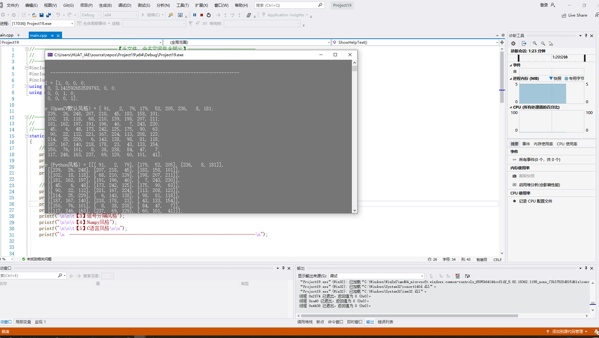
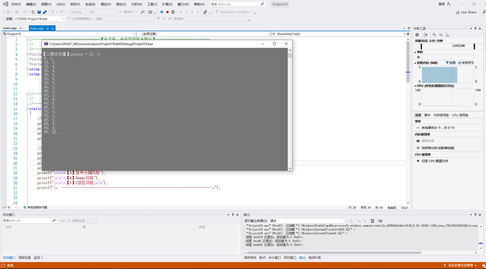
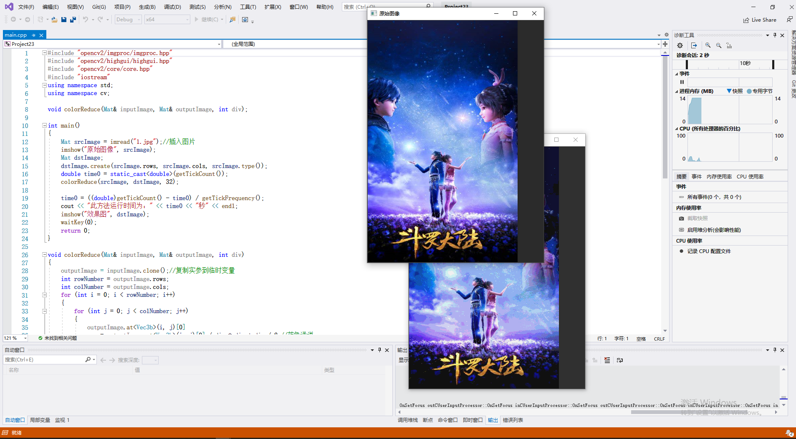
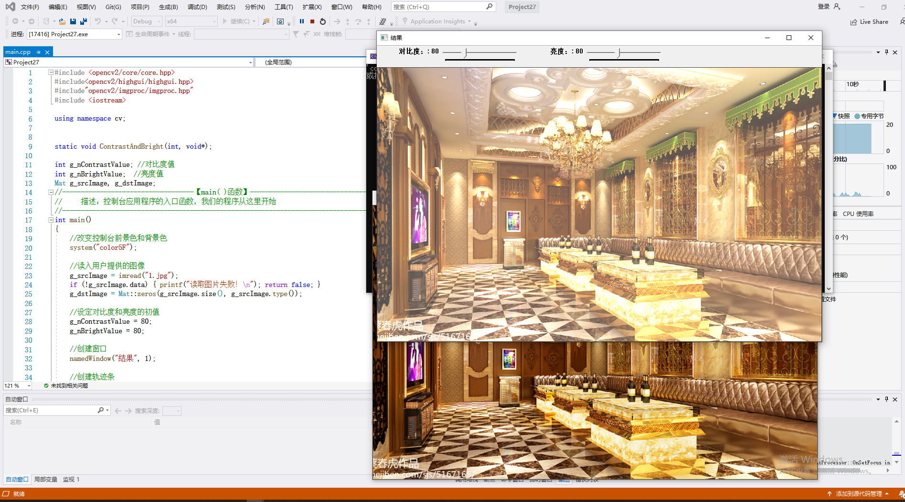
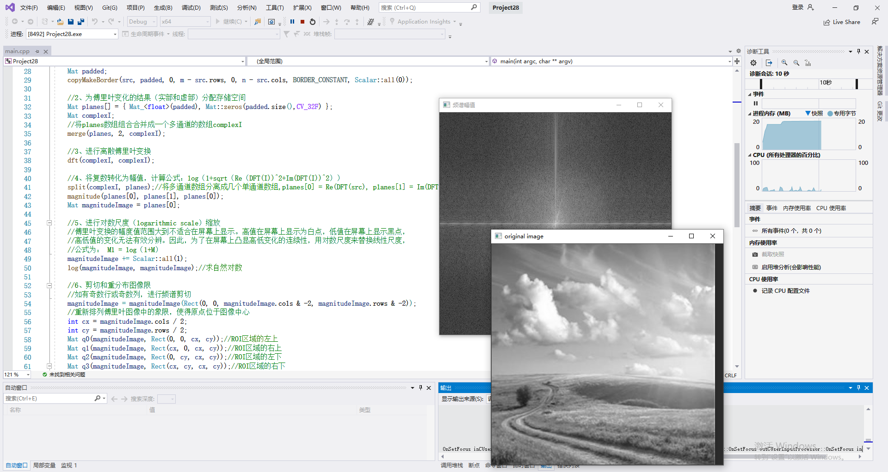
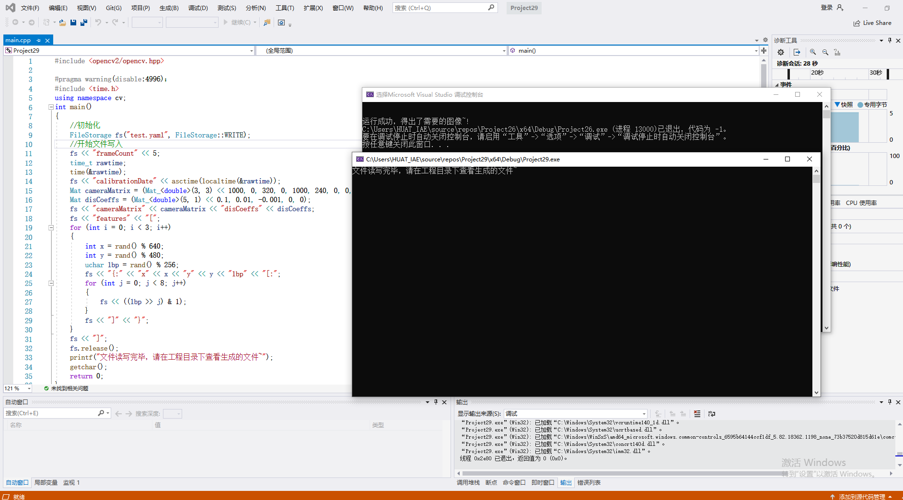
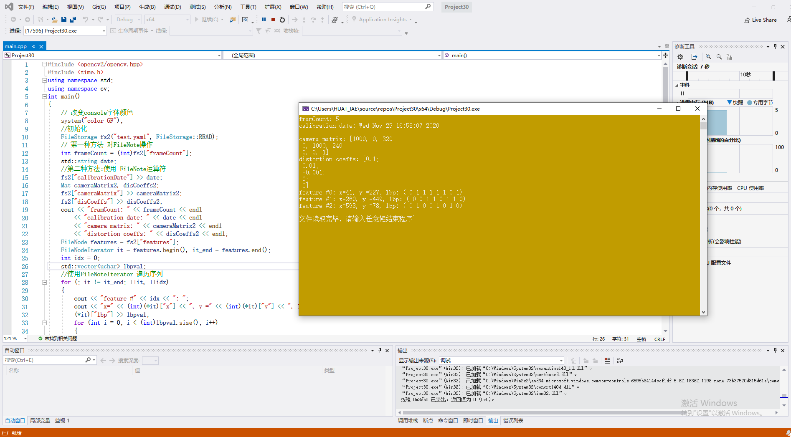

# 第二次作业
# 张博文 201808093
# 基础图像容器Mat

数字图像存储概述
我们可以通过各种各样的方法从现实世界获取到数字图像，如借助相机、扫描仪、计算机摄像头或磁共振成像等。通常由显示屏上看到的都是真实而漂亮的图像，但是这些图像在转化到我们的数字设备中时，记录的却是图像中的每个点的数值。

# Mat结构的使用
关于Mat类，首先我们要知道的是:

(1）不必再手动为其开辟空间。

(2）不必再在不需要时立即将空间释放。

现在改变F或者G就不会影响Mat信息头所指向的矩阵。

本小节可总结为如下4个要点：

1.OpenCV函数中输出图像的内存分配是自动完成的(如果不特别指定的话)

2.使用OpenCV的C++接口时不需要考虑内存释放问题。

3.赋值运算符和拷贝构造函数(构造函数)只复制信息
头

4.使用函数clone(或者copyTo()来复制一幅图像的矩阵。
# 像素值的存储方法
RGB是最常见的，这是因为人眼采用相似的工作机制，它也被显示设备所采用

HSV和HLS把颜色分解成色调、饱和度和亮度/明度。这是描述颜色更自然的方式，比如可以通过抛弃最后一个元素，使算法对输入图像的光照条件不敏感

YCrCb在JPEG图像格式中广泛使用

CIE L*a*b*是一种在感知上均匀的颜色空间，它适合用来度量两个颜色之间的距离
# 显式创建Mat对象的七种方法
1.【方法一】使用Mat()构造函数

2.【方法二】在C\C++中通过构造函数进行初始化

3.【方法三】为已存在的lpllmage指针创建信息头

4.【方法四】利用Create()函数

5.【方法五】采用Matlab式的初始化方式

6.【方法六】对小矩阵使用逗号分隔式初始化函数

7.【方法七】为已存在的对象创建新信息头

# OpenCV中的格式化输出方法

# 输出其他常用数据结构

# 常用数据结构和函数
DrawEllipse()函数的写法

运行结果

# 本章小结
本章我们主要学习了经常会遇到的各种数据结构，主要是基础图像容器 Mat的用法。

#   第五章
# core 红件进阶

# 操作图像中像素的方法一:用指针访问像素

# 操作图像中像素的方法二:用迭代器操作像素

# 操作图像中像素的方法三:动态地址计算

# 遍历图像中像素的14种方法

# 初级图像混合

# 多通道图像混合

# 图像对比度、亮度值调整

# 离散傅里叶变换

# XML和YAML文件的写入

# XML和YAML文件的读取

# 本章小结
本节中，我们学习了core模块的一些进阶知识点——操作图像中的像素、图像混合、分离颜色通道、调节图像的对比度和亮度、进行离散傅里叶变换，以及输入输出XML和 YAML文件。
