# ch_4 OpenCV数据结构与基本绘图

 ### 4.1 数字图像存储概述

 #### 4.1.1 数字图像存储概述

 - 矩阵是图像再数码设备中的表现形式。

 - OpenCV作为一个计算机的视觉库，主要工作是处理和操作并进一步了解这些形式和信息。

 #### 4.1.2 Mat结构的使用
 
  关于Mat类，首先我们要知道的是：

  1. 不必再手动为其开辟空间。
  2. 不必再在不需要时立即将空间释放。

  - 总而言之，Mat是一个类，由两个数据部分组成:矩阵头(包含矩阵尺寸、存储方法、存储地址等信息)和一个指向存储所有像素值的矩阵(根据所选存储方法的不同，矩阵可以是不同的维数)的指针。矩阵头的尺寸是常数值，但矩阵本身的尺寸会依图像的不同而不同，通常比矩阵头的尺寸大数个数量级。因此,当在程序中传递图像并创建副本时，大的开销是由矩阵造成的，而不是信息头。OpenCV是一个图像处理库， 囊括了大量的图像处理函数，为了解决问题通常要使用库中的多个函数，因此在函数中传递图像是常有的事。同时不要忘了我们正在讨论的是计算量很大的图像处理算法，因此，除非万不得已，不应该进行大图像的复制，因为这会降低程序的运行速度。为了解决此问题，OpenCV 使用了引用计数机制。其思路是让每个Mat对象有自己的信息头，但共享同一个矩阵。这通过让矩阵指针指向同一地址而实现。而拷贝构造函数则只复制信息头和矩阵指针，而不复制矩阵。

  **4个要点**：
 
 - OpenCV函数中输出图像的内存分配是自动完成的(如果不特别指定的话)。
 - 使用OpenCV的C++接口时不需要考虑内存释放问题。
 - 赋值运算符和拷贝构造函数( 构造函数)只复制信息头。
 - 使用函数clone(或者copyTo0来复制- -幅图像的矩阵。

 #### 4.1.3 像素值的存储方法

 本节我们将讲解如何存储像素值。存储像素值需要指定额色空间和数据类型。其中，颜色空间是指针对一个给定的颜色，如何组合颜色元素以对其编码。最简单的颜色空间要属灰度级空间，只处理黑色和白色，对它们进行组合便可以产生不同程度的灰色。
 
 对于彩色方式则有更多种类的颜色空间，但不论哪种方式都是把颜色分成三个或者四个基元素，通过组合基元素可以产生所有的颜色。RGB颜色空间是最常用的一种颜色空间，这归功于它也是人眼内部构成颜色的方式。它的基色是红色、绿色和蓝色，有时为了表示透明颜色也会加入第四个元素alpha (A)。

 常见的颜色系统一般有以下4种：

 - RGB
 - HSV & HLS
 - YCrCb
 - CIE L* a* b 

 #### 4.1.4 显示创建Mat对象的七种方法
 1. 使用Mat()构造函数。
 2. 在CIC++中通过构造函数进行初始化。
 3. 为已存在的Ipllmage指针创建信息头。
 4. 利用Create()函数。
 5. 采用Matlab式的初始化方式。
 6. 对小矩阵使用逗号分隔式初始化函数。
 7. 为已存在的对象创建新信息头。
   
 #### 4.1.5 OpenCV中的格式化输出方法
 - [风格一] OpenCV默认风格
 - [风格二] Python风格
 - [风格三] 逗号分隔风格(Comma separated values，CSV)
 - [风格四] Numpy风格
 - [风格五] C语言风格

 #### 4.1.6 输出其他常用数据结构
 1. 定义和输出二维点
 2. 定义和输出三维点
 3. 定义和输出基于Mat的std::vector
 4. 定义和输出std:vector点
   
 #### 4.1.7 示例程序：基础图象容器Mat类的使用

 - 测试效果
 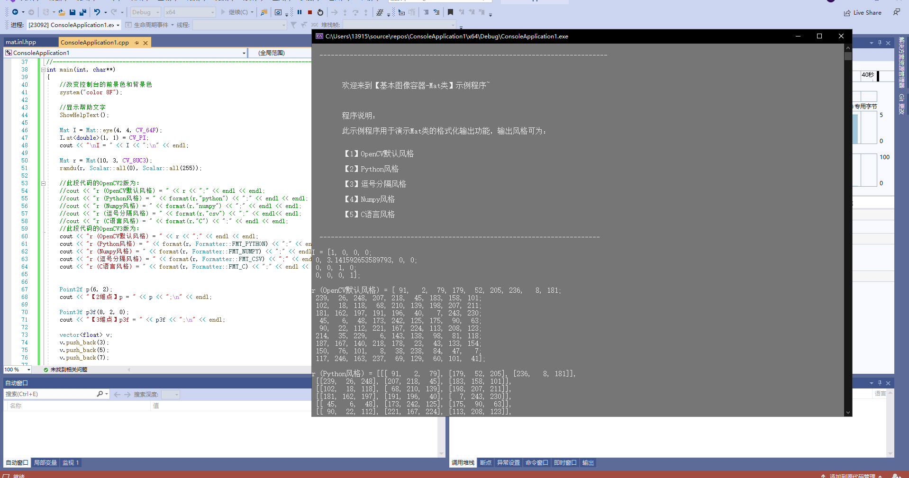

 ### 4.2 常用数据结构和函数

 #### 下面是几种基础函数的介绍，本处不再做赘述：
 4.2.1 点的表示: Point 类
 4.2.2 颜色的表示: Scalar 类
 4.2.3 尺寸的表示: Size 类
 4.2.4 矩形的表示: Rect 类
 4.2.5 颜色空间转换: cvtColor() 函数

 #### 4.2.6 其他常用的知识点
 - 本小节我们列举一下OpenCV的Core模块中其他常用的知识点，如下：
 - Matx 是个轻量级的Mat,必须在使用前规定好大小，比如一一个2*3的float型的Matx，可以声明为Matx23f。
 - Vec是Matx的-一个派生类，是-一个--维的Matx,跟vector很相似。在OpenCV源码中有如下定义。
   
   template<typename_ TP, int n> class Vec : public Matx<_ Tp, n, 1> {...};
   
   typedef Vec<uchar, 2> Vec2b;

 - Range 类其实就是为了使OpenCV的使用更像MATLAB而产生的。比如Rang::all()其实就是MATLAB里的符号。而Range(a, b)其实就是MATLAB中的a: b,注意这里的a和b都应为整型。
 - OpenCV 中防止内存溢出的函数有alignPtr. alignSize、 alocate 、deallocate、fastMalloc、fastFree 等。
 - <math.h> 里的一-些函数使用起来很方便，有计算向量角度的函数fastAtan2、计算立方根的函数cubeRoot、向上取整函数cvCeil、向下取整函数cevFloor、四舍五入函数cvRound等。还有一-些类似MATLAB里面的函数,比如cvIsInf判断自变量是否无穷大，cvlsNaN 判断自变量是否不是一一个数。
 - 显示文字相关的函数有getTextSize. cvInitFont、 putText.
 - 作图相关的函数有circle、clipPLine、 elise. llipse2Poly、, line. rectangle、polylines、类LineIterator.
 - 填充相关的函数有fllConvexPoly、fllPoly。
 - OpenCV中RNG()函数的作用为初始化随机数状态的生成器。

 ### 4.3 基本图形的绘制

 涉及到的绘制函数如下：
 - 用于绘制直线的line 函数。
 - 用于绘制椭圆的llipse 函数。
 - 用于绘制矩形的rectangle函数。
 - 用于绘制圆的circle函数。
 - 用于绘制填充的多边形的fillPoly 函数。

 #### 下面是几种基础函数写法的介绍，本处不再做赘述：
 4.3.1 DrawEllipse()函数的写法
 4.3.2 DrawFilledCircle()函数的写法
 4.3.3 DrawPolygon()函数的写法
 4.3.4 DrawLine()函数的写法

 #### 4.3.5 main函数的写法
 
 - 测试效果
 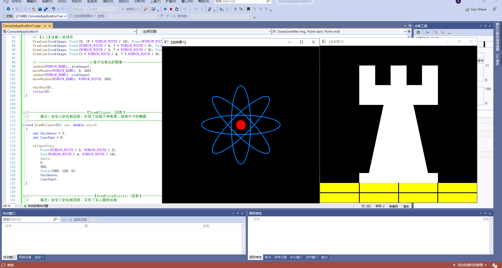

# ch_5 core组件进阶

 ### 5.1 访问图 - 测试效果
 
 #### 5.1.1 图像在内存之中的存储方式

 - OpenCV中子列的通道顺序是反过来的——BGR而不是RGB。

 - 也就是说：只要内存足够大，可实现连续存储。

 #### 5.1.2 颜色空间缩减

 - 颜色空间缩减在很多应用中可以大大缩减运算复杂度。颜色空间缩减的做法是：将现有颜色空间值除以某个输入值，以获得较少的颜色数。

 #### 5.1.3 LUT函数：Look up table操作

 该操作用于批量进行图像元素查找、扫描与操作图像。其使用方法如下:

 - //首先我们建立一个mat型用于查表
 - Mat lookUpTable(1， 256， CV_ 8U) ;
 - uchar* p = lookUpTable.data;
 - for(inti=0;i<256;++i)
 - p[i] = table[i];
 - //然后我们调用函数(I是输入J是输出):
 - for(inti=0;i<times;++i)
 - LUT(I，1ookUpTable，J) ;

 #### 5.1.4 计时函数
 
 - 常用的两个简便的计时函数：
   
 1. getTickCount()函数返回CPU自某个事件(如启动电脑)以来走过的时钟周期数
 2. getTickFrequeney()函 数返回CPU一秒钟所走的时钟周期数。这样，我们就能轻松地以秒为单位对某运算计时。

 #### 5.1.5 访问图像中像素的三种方法

 - OpenCV中提供三种访问每个像素的方法：
  - 指针访问：C操作符[]。
  - 迭代器iterator。
  - 动态地址计算。
 
 以下是实机演示：

 1. 用指针访问像素
   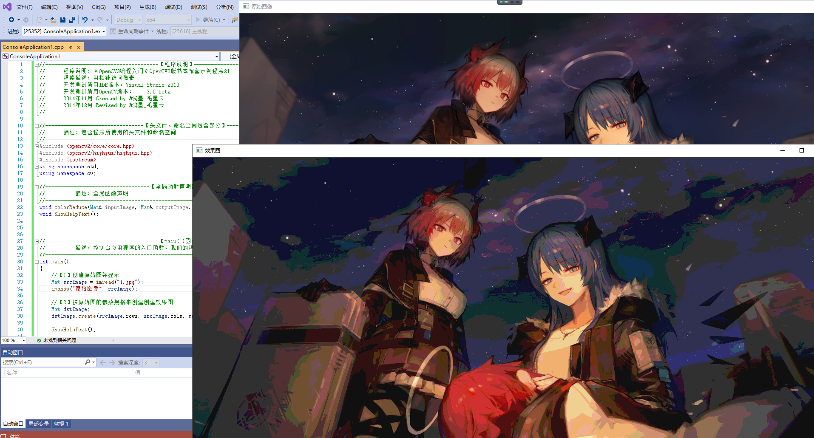
 
 2. 用迭代器操作像素
   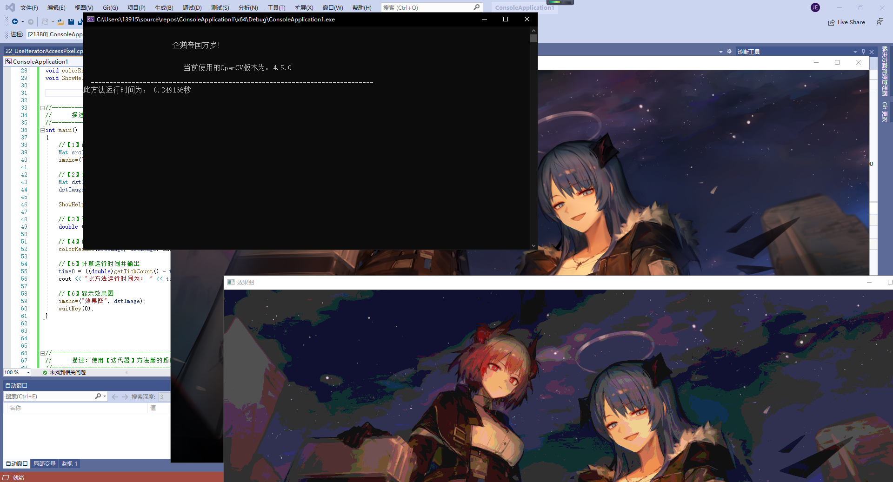 

 3. 动态地址计算
   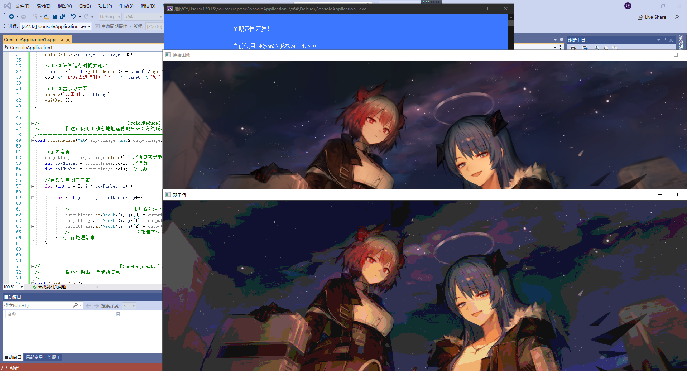 

 #### 5.1.6 示例程序
 
  - 遍历图像像素的14种方法，在此不做讨论。

 ### 5.2 ROI区域图像叠加和图像混合

 #### 5.2.1 感兴趣区域：ROI

 - ROI用来专注或者简化工作过程。即在图像种选择的一个图像区域，这个区域是图像分析所关注的重点。
 - 而且使用ROI指定想读入的目标，可以减少处理时间，增加精度。 
  
 #### 5.2.2 线性混合操作
 
 - 线性混合操作是一种典型的二元像素操作（奈何本人数学学艺不精），他的理论公式如下：
    
  
 #### 5.2.3 计算数组加权和: addWeighted() 函数

 可以用于具体实现线性混合操作：

 ***void(InputArray src1,double alpha,InputArrary src2,double beta,double gamma,outputArray dst,int dtype=-1);***

 - 参数1：InputArray类型的src1，表示要加权的第一个数组，常常填一个Mat。
 - 参数2：double类型的alpha，表示第一个数组的权重。
 - 参数3：InputArray类型的src2，表示第二个数组，需要和第一个数组有相同的尺寸和通道数。
 - 参数4：double类型的beta，表示第二个数组的权重。
 - 参数5：double类型的gamma，一个加到权重总和上的标量值。
 - 参数6：outputArray类型的dst，输出数组，和输入的两个数组有一样的尺寸和通道数。
 - 参数7：int类型的dtype，输出阵列的可选深度，有默认值-1，当两个输入数组具有相同的深度时，这个参数设置为-1。
  
 ***dst=src1[I]alpha+src[I]beta +gamma;***

 -  其中I是多维数组元素的索引值。

 #### 5.2.4 初级图像混合
 
 - 测试效果
 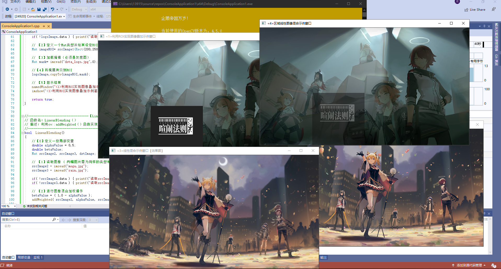
 
 ### 5.3 分离颜色通道、多通道图像混合

 #### 5.3.1 通道分离: split()函數
 - split()函数：用于将一个多通道数组分离成几个单通道数组，这里的array按语境翻译为数组或阵列。

    这个split()函数的C++版本有两个原型，分别是：

    1. C++: void split(const Mat& src, Mat* mvbegin);

    2. C++:void split(InputArray m, OutputArrayOfArrays mv);

    变量介绍如下：

        第一个参数：src或者m填我们需要进行分离的多通道数组。

        第二个参数：mv填输出数组  或者输出的vector容器。
 
 #### 5.3.2 通道合并: merge(函数)

  - merge()函数：split()函数的逆向操作——将多个数组合并成一个多通道数组，将给定的这些孤立的单通道数组合并成一个多通道数组，从而创建一个由多个单通道阵列组成的多通道阵列。

    原型：
    1. C++: void merge(const Mat* mv, size_tcount, OutputArray dst);

    2. C++: void merge(InputArrayofArrays mv,OutputArray dst);

    变量介绍如下：

        第一个参数：mv，填需要被合并的输入矩阵 或 vector容器的阵列；

        第二个参数：count，当mv为一空白C数组时，代表输入矩阵的个数，显然必须大于1；

        第三个参数：dst，即输出矩阵，和mv[0]具有相同的尺寸和深度，并且通道的数量是矩阵阵列中通道的总数。

 #### 5.3.3示例程序: 多通道图像混合

 - 测试效果
 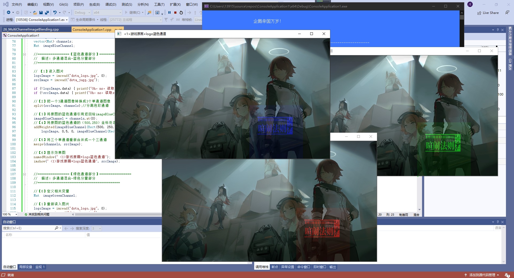

 ### 5.4 图像对比度、亮度值调整

 #### 5.4.1 理论依据

  - 算子：一般的图像处理算子都是一个函数，他接受一个或多个输入图像，并产生输出图像。
  - 点操作：( pointoperators)。点操作有一一个特点:仅仅根据输入像素值(有时可加上某些全局信息或参数)，来计算相应的输出像素值。这类算子包括亮度(brightness)和对比(contrast) 调整、颜色校正((colorcorrection)和变换(transformations)。

 #### 5.4.2 访问图片中的像素

 - 对GBR图像进行运算，每个像素有三个值(G、B、R)，所以我们必须分别访问它们(OpenCV中的图像存储模式为GBR)。

 #### 5.4.3 示例程序:图像对比度、亮度值调整
 
 - 测试效果
 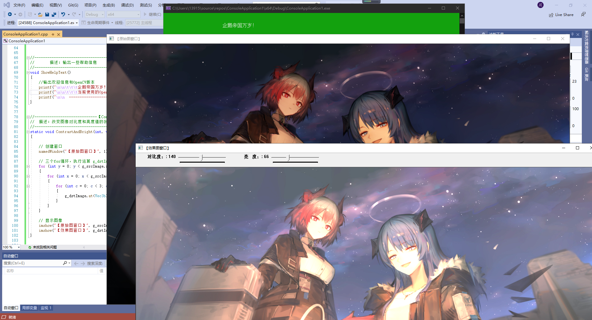

 ### 5.5 离散傅里叶变换

 #### 5.5.1 离散傅里叶变换的原理

 - 离散傅里叶变换（DFT），是傅里叶变换在时域和频域上都呈现离散的形式，将时域信号的采样变换为在离散时间傅里叶变换（DTFT）频域的采样。在形式上，变换两端（时域和频域上）的序列是有限长的，而实际上这两组序列都应当被认为是离散周期信号的主值序列。即使对有限长的离散信号作DFT，也应当将其看作经过周期延拓成为周期信号再作变换。在实际应用中通常采用快速傅里叶变换以高效计算DFT。

 #### 以下为所用函数介绍，本处不再赘述：
   
     5.5.2 dft()函数详解
     5.5.3 返回DFT最优尺寸大小: getOptimalDFTSize()函数
     5.5.4 扩充图像边界: copyMakeBorder()函数
     5.5.5 计算二二维矢量的幅值: magnitude()函数
     5.5.6 计算自然对数: log()函数
     5.5.7 矩阵归- -化: normalize()函数
 
 #### 5.5.8 示例程序:离散傅里叶变换

 - 测试效果
 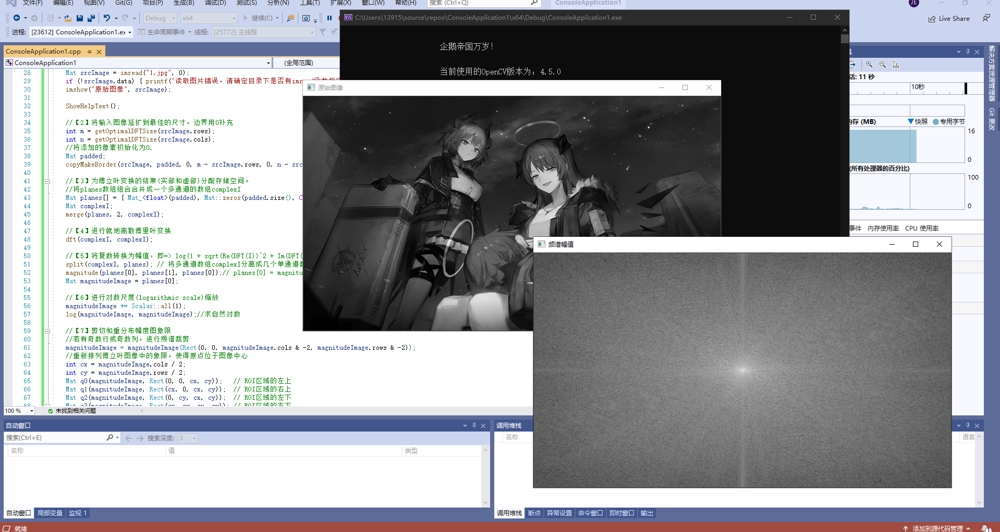

 ### 5.6 输入输出XML和YAML文件
 
 #### 5.6.1 XML和YAML文件简介

 - XML:
     
       可扩展标记语言，标准通用标记语言的子集，简称XML。是一种用于标记电子文件使其具有结构性的标记语言。在电子计算机中，标记指计算机所能理解的信息符号，通过此种标记，计算机之间可以处理包含各种的信息比如文章等。它可以用来标记数据、定义数据类型，是一种允许用户对自己的标记语言进行定义的源语言。 它非常适合万维网传输，提供统一的方法来描述和交换独立于应用程序或供应商的结构化数据。是Internet环境中跨平台的、依赖于内容的技术，也是当今处理分布式结构信息的有效工具。早在1998年，W3C就发布了XML1.0规范，使用它来简化Internet的文档信息传输。

 - YAML:
    
       YAML是一个可读性高，用来表达数据序列化的格式。YAML参考了其他多种语言，包括：C语言、Python、Perl，并从XML、电子邮件的数据格式（RFC 2822）中获得灵感。Clark Evans在2001年首次发表了这种语言，另外Ingy döt Net与Oren Ben-Kiki也是这语言的共同设计者。当前已经有数种编程语言或脚本语言支持（或者说解析）这种语言。

 #### 5.6.2 FileStorage类操作文件的使用引导
 
 - 我们一般使用如下过程来写入或者读取数据到XML或YAML文件中:
        
        1. 实例化一个FileStorage类的对象，用默认带参数的构造函数完成初始化，或者用FileStorage::open()成员函数辅助初始化。
        
        2.使用流操作符<<进行文件写入操作，或者>>进行文件读取操作，类似C++中的文件输入输出流。
        
        3. 使用FileStorage:releaseQ)函数析构掉FileStorage类对象，同时关闭文件。
   
 #### 5.6.3 示例程序: XML和YAML文件的写人

 - 测试效果
 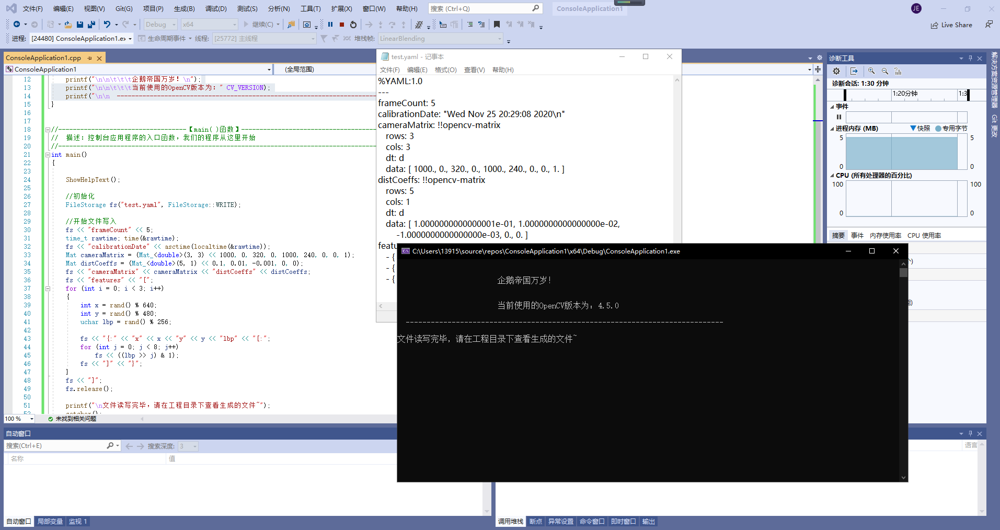

 #### 5.6.4 示例程序: XML和YAML文件的读取

  - 测试效果
 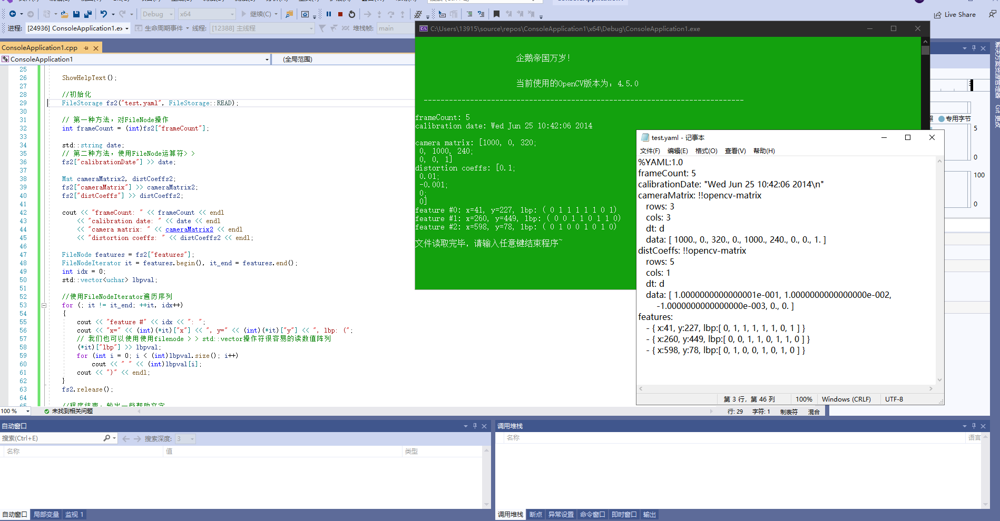

