## 4.1 基础图象容器 Mat

### 什么是“数字图像存储”

概念：我们可以通过各种各样的方法从现实世界获取到数字图像，通常由显示屏上看到的都是真实而漂亮的图像，但是这些图像在转化到我们的数字设备中时，记录的却是图像中的每个点的数值。

### Mat结构的使用

曾经：对于C语言接口来说，往往会出现一些问题。而且使用不方便。我们往往需要花很多时间浪费在手动释放内存上面。对于小型程序来说手动维护问题不大，但是对于大型程序（代码几千行的）来说，我们的维护就会变得很困难。随着C++的出现，这些问题迎刃而解。但C++接口唯一-的不足是: 当前许多嵌入式开发系统只支持C语言。所以，当开发目标不是仅能使用C语言作为开发语言时，便没有必要使用旧的C语言接口了。

关于Mat类：
(1)不必再手动为其开辟空间。.
(2)不必再在不需要时立即将空间释放。
也就是说我们每次使用的内存要正好够我们完成任务。

总而言之，Mat是一个类，由两个数据部分组成:矩阵头(包含矩阵尺寸、存储方法、存储地址等信息)和一个指向存储所有像素值的矩阵(根据所选存储方法的不同，矩阵可以是不同的维数)的指针。矩阵头的尺寸是常数值，但矩阵本身的尺寸会依图像的不同而不同，通常比矩阵头的尺寸大数个数量级。因此，当在程序中传递图像并创建副本时，大的开销是由矩阵造成的，而不是信息头。OpenCV是--个图像处理库，囊括了大量的图像处理函数，为了解决问题通常要使用库中的多个函数，因此在函数中传递图像是常有的事。同时不要忘了我们正在讨论的是计算量很大的图像处理算法，因此，除非万不得已，不应该进行大图像的复制，因为这会降低程序的运行速度。为了解决此问题，OpenCV使用了引用计数机制。其思路是让每个Mat对象有自己的信息头，但共享同一个矩阵。这通过让矩阵指针指向同- 一地址而实现。而拷贝构造函数则只复制信息头和矩阵指针，而不复制矩阵。

### 像素值的存储方法

存储像素值需要指定颜色空间和数据类型。其中，颜色空间是指针对一个给定的颜色，如何组合颜色元素以对其编码。最简单的颜色空间要属灰度级空间，只处理黑色和白色，对它们进行组合便可以产生不同程度的灰色。对于彩色方式则有更多种类的颜色空间，但不论哪种方式都是把颜色分成三个或者四个基元素，通过组合基元素可以产生所有的颜色。RGB颜色空间是最常用的一种颜色空间，这归功于它也是人眼内部构成颜色的方式。它的基色是红色、绿色和蓝色，有时为了表示透明颜色也会加入第四个元素alpha (A)。 

颜色系统有很多，它们各有优势
●RGB是最常见的，这是因为人眼采用相似的工作机制，它也被显示设备所采用
●HSV和HLS把颜色分解成色调、饱和度和亮度/明度。这是描述颜色更自然的方式，比如可以通过抛弃最后-个元素，使算法对输入图像的光照条件不敏感
●YCrCb在JPEG图像格式中广泛使用
●CIEL*a*b*是一种在感知上均匀的颜色空间，它适合用来度量两个颜色之间的距离

### 显示创建Mat对象的七种方法

#### 使用Mat（）构造函数

对于二维多通道图像，首先要定义其尺寸，即行数和列数。然后，需要指定存储元素的数据类型以及每个矩阵点的通道数。

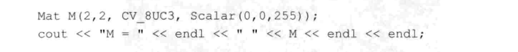

#### 在C\C++中通过构造函数进行初始化

这种方法为在C(C++中通过构造函数进行初始化，

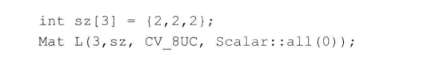

#### 为已存在的Ipllmage 指针创建信息头

是为已存在的Ipllmage指针创建信息头。

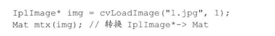

#### 利用Create()函数
利用Mat类中的Create()成员函数进行Mat类的初始化操作。

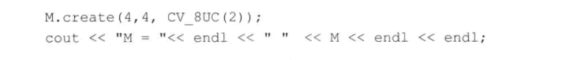

需要注意的是，此创建方法不能为矩阵设初值，只是在改变尺寸时重新为矩阵数据开辟内存而已。

#### 采用Matlab式的初始化方式

采用Matlab形式的初始化方式: zeros(), ones()， eyes（）。

#### 对小矩阵使用逗号分隔式初始化函数

方法六为对小矩阵使用逗号分隔式初始化函数。

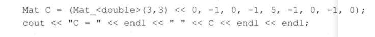

#### 为已存在的对象创建新信息头

使用成员函数clone()或者copyTo（）为一个已存在的Mat对象创建一个新的信息头。

### opencv中的格式化输出方法

#### 我们一共分为五种风格：
●opencv默认风格
●python风格
●逗号分隔风格
●Numpy风格
●C语言风格

### 输出其他常用数据结构

●定义和输出二维点
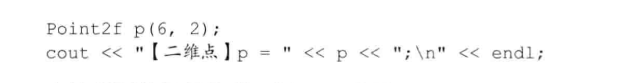
●定义和输出三维点
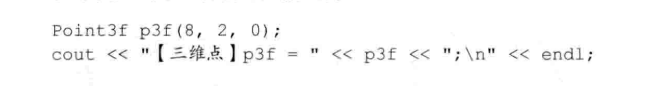
●定义和输出基于Mat的std:vector

●定义和输出std::vector点

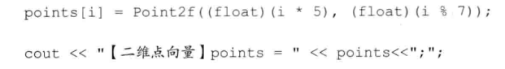

### 实验 基础图象容器Mat类的使用

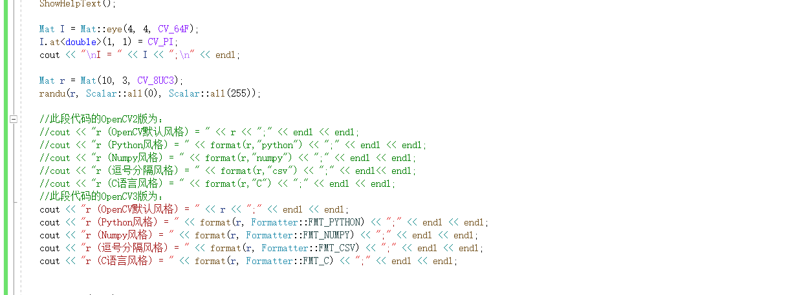

## 4.2 常用数据结构和函数

### 点的表示：Point类

Point类数据结构表示了二维坐标系下的点,即由其图像坐标x和y指定的2D点。

### 颜色的表示：Scalar类

Scalar(表示具有4个元素的数组，在OpenCV中被大量用于传递像素值,如RGB颜色值。而RGB颜色值为三个参数，其实对于Scalar函数来说，如果用不到第四个参数，则不需要写出来;若只写三个参数，OpenCV 会认为我们就想表示三个参数。

### 尺寸的表示：Size类

其中，Size_ 是个模板类， 在这里Size_ _<int>表示其类体内部的模板所代表的类型为int。那这两句代码的意思，就是首先给已知的数据类型Size_ .<int>起 个新名字，叫Size2i。然后又给已知的数据类型Size2i起个新名字，叫Size。所以，连起来就是，Size_ <int>、 Size2i、 Size 这三个类型名等价。

### 矩形的表示：Rect类

Rect类的成员变量有x、y、width、height,分别为左上角点的坐标和矩形的宽和高。常用的成员函数有: Size()返回值为Size; area()返 回矩形的面积;contains(Point)判断点是否在矩形内; inside(Rect)函 数判断矩形是否在该矩形内;tl0)返回左上角点坐标; br()返回右下角点坐标。值得注意的是，如果想求两个矩形的交集和并集。

### 颜色空间转换：cvtColor（）函数

cvtColor()函数是OpenCV里的颜色空间转换函数，可以实现RGB颜色向HSV、HSI等颜色空间的转换，也可以转换为灰度图像。

### 一些其余知识点：

●Matx是个轻量级的Mat,必须在使用前规定好大小，比如一个2*3的float型的Matx，可以声明为Matx23f.
●Vec是Matx的-一个派生类,是-一个一维的Matx,跟vector很相似。
●Range类其实就是为了使OpenCV的使用更像MATLAB而产生的。比如Range::al()其实就是MATLAB里的符号。而Range(a, b)其实就是MATLAB中的a:b，注意这里的a和b都应为整型。
●OpenCV 中防止内存溢出的函数有alignPtr、 alignSize、 allocate 、deallocate、fastMalloc、fastFree 等。
●<math.h>里的一些函数使用起来很方便,有计算向量角度的函数fastAtan2、计算立方根的函数cubeRoot、向上取整函数cvCeil、向下取整函数cvFloor、四舍五入函数cvRound等。还有一-些类似MATLAB里面的函数,比如cvIsInf判断自变量是否无穷大，cvIsNaN 判断自变量是否不是一个数。
●显示文字相关的函数有getTextSize、 cvInitFont、 putText。
●作图相关的函数有circle、 clipLine、 ellipse、 ellipse2Poly、 line、 rectangle、polylines、类LineIterator。
●填充相关的函数有fillConvexPoly、fillPoly。
●OpenCV 中RNG()函数的作用为初始化随机数状态的生成器。

## 基本图形绘制实验

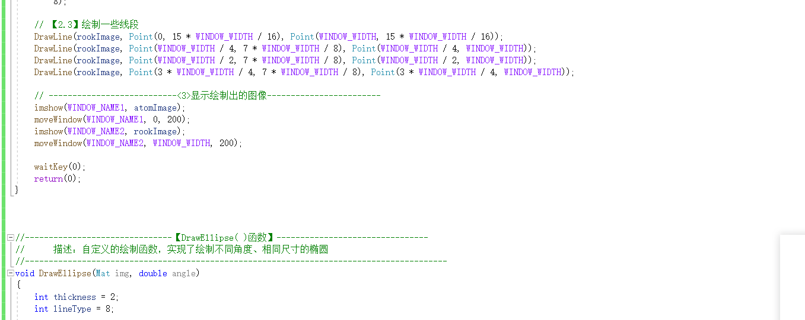

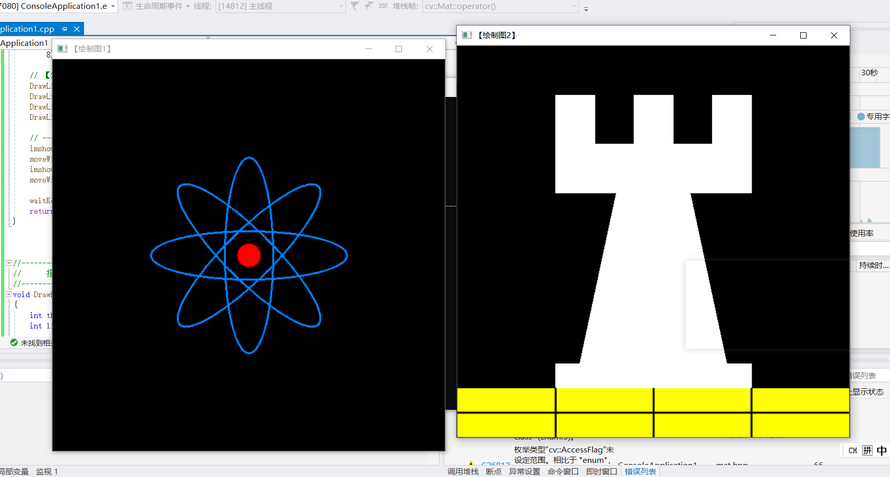

## 小结：

我们主要学习了Mat的几种用法。以及如何使用Mat（）。Mat的每个对象具有其自己的头，但可能他们通过让他们矩阵指针指向同一地址的两个实例之间共享该矩阵。此外，拷贝运算符将只能复制矩阵头部，也还将复制指针到大型矩阵，但不是矩阵本身。

## 访问图像中的像素

### 图像在内存中的存储方式

OpenCV 中子列的通道顺序是反过来的一-BGR 而不是RGB。很多情况下，因为内存足够大，可实现连续存储，因此，图像中的各行就能一-行一行地连接起来，形成一一个长行。连续存储有助于提升图像扫描速度，我们可以使用isContinuous()来判断矩阵是否是连续存储的。

### 颜色空间缩减

颜色空间缩减便可以派上用场了，它在很多应用中可以大大降低运算复杂度。颜色空间缩减的做法是:将现有颜色空间值除以某个输入值，以获得较少的颜色数。也就是“做减法”，比如颜色值0到9可取为新值0，10到19可取为10。

### LUT 函数: Look up table操作

提到的Look up table 操作，OpenCV 官方文档中强烈推荐我们使用一个原型为operationsOnArrays:LUT0)<lut>的函数来进行。它用于批量进行图像元素查找、扫描与操作图像。

### 计时函数

接下来提出问题如何计时。
可以利用这两个简便的计时函数一getTickCount（）和getTickFrequency()。
●getTickCount()函数返回CPU自某个事件(如启动电脑)以来走过的时钟周期数.
●getTickFrequency()函数返回CPU一秒钟所走的时钟周期数。

### 访问图像中像素的三类方法

●用指针访问像素

●用迭代器操作像素

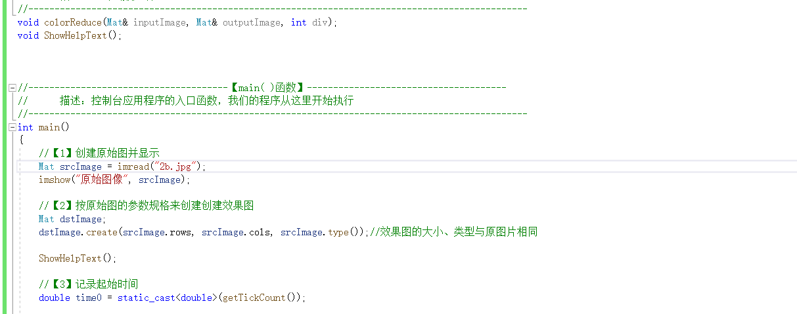

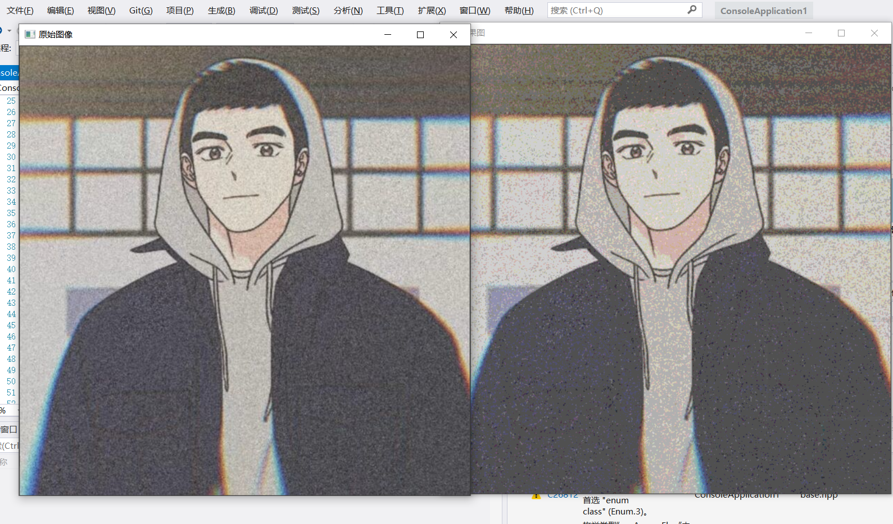

●动态地址计算

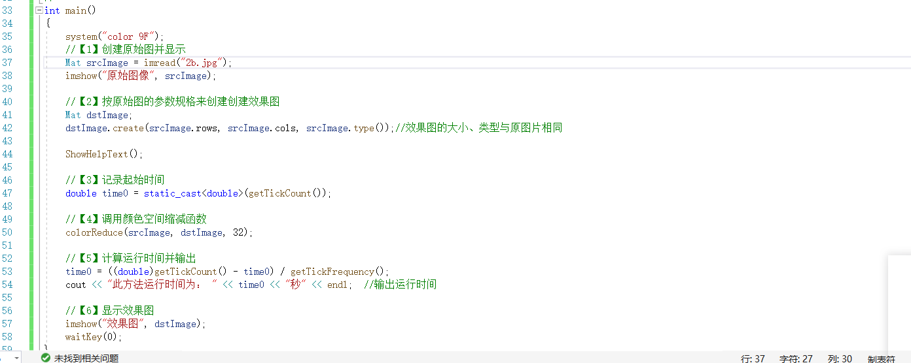

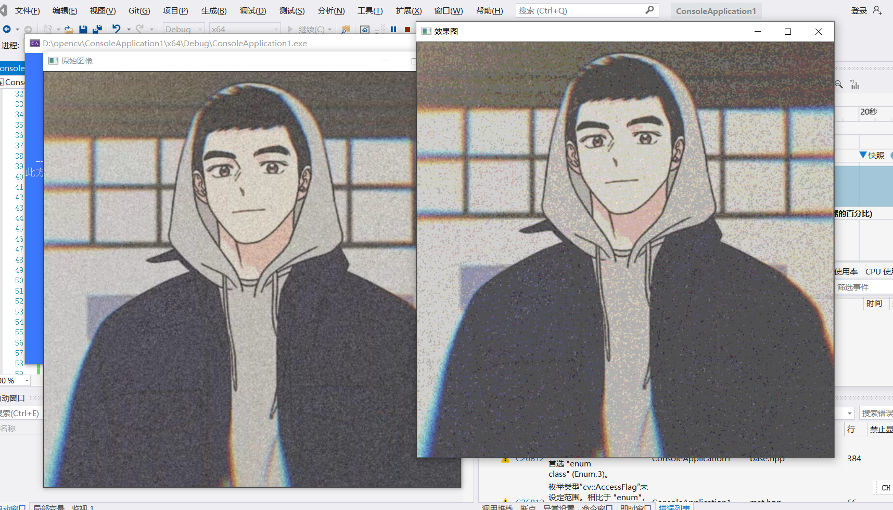

## 感兴趣区域：ROI

定义ROI区域有两种方法:
1.使用表示矩形区域的Rect。它指定矩形的左上角坐标(构造函数的前两个参数)和矩形的长宽(构造函数的后两个参数)以定义一个矩形区域。
2.定义ROI的方式是指定感兴趣行或列的范围( Range)。Range 是指从起始索引到终止索引(不包括终止索引)的- -连段连续序列。cRange 可以用来定义Range。

## 线性混合操作

线性混合操作是一种典型的二元(两个输入)的像素操作，它的理论公式如下:
g(x)=(1- a)fa(x)+ afs(x)
我们通过在范围0到1之间改变alpha值，来对两幅图像( f0(x)和fl(x))或两段视频(同样为(f0(x)和 fl(x))产生时间上的画面叠化(cross-dissolve) 效果，就像幻灯片放映和电影制作中的那样，也就是在幻灯片翻页时设置的前后页缓慢过渡叠加效果，以及电影情节过渡时经常出现的画面叠加效果。

## 计算数组加权和: addWeighted)函数

●第一个参数，InputArray类型的srcl， 表示需要加权的第一一个数组，常常填一个Mat;
●第二个参数，double类型的alpha, 表示第一 个数组的权重;
●第三个参数，InputArray 类型的src2， 表示第二个数组，它需要和第一一个数组拥有相同的尺寸和通道数;
●第四个参数，double 类型的beta， 表示第二个数组的权重值:
●第五个参数，double类型的gamma,，一个加到权重总和.上的标量值。其含义通过接下来列出的式子自然会理解;
●第六个参数，OutputArray 类型的dst， 输出的数组，它和输入的两个数组拥有相同的尺寸和通道数;
●第七个参数，int类型的dtype, 输出阵列的可选深度，有默认值-1。当两个输入数组具有相同的深度时，这个参数设置为-1 (默认值)，即等同于src l.depth（）。

## 初级图像混合实验

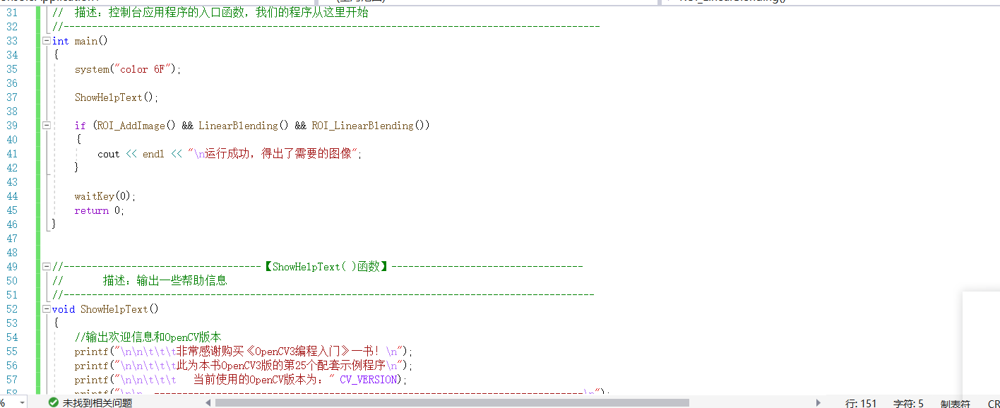

## 分离颜色通道，多通道图像混合

而为了更好地观察一些图像材料的特征,有时需要对RGB三个颜色通道的分量进行分别显示和调整。通过OpenCV的split和merge方法可以很方便地达到目的。

### 通道分离: split()函数

这个split函数的C++版本有两个原型，分别是: 
●C++: void split(const Mat& src, Mat*mvbegin);
●C++: void split(InputArray m,OutputArrayOfArrays mv);
变量介绍如下:
●第一个参数，InputArray类型的m或者const Mat&类型的sre, 填我们需要进行分离的多通道数组。
●第二个参数，OutputArrayOfArrays类型的mv,填函数的输出数组或者输出的vector容器。

### 通道合并: merge（）函数

merge(函数是split()函数的逆向操作一将多个数组合并成一个多通道的数组。它通过组合一些给 定的单通道数组，将这些孤立的单通道数组合并成一个多通道的数组，从而创建出一个由多个单通道阵列组成的多通道阵列。它有两个基于C++的函数原型如下。
●C++: void merge(const Mat* mv, size_ tcount, OutputArray dst)
●C++: void merge(InputArrayOfArrays mv,OutputArray dst)
变量介绍如下：
●第一个参数，1mV。.。填需要被合并的输入矩阵或vector容器的阵列，这个mv参数中所有的矩阵必须有着一样的尺 寸和深度。
●第二个参数，count。当mv为一个空白的C数组时，代表输入矩阵的个数，这个参数显然必须大于1。
●第三个参数，dst。 即输出矩阵，和mv[0]拥有一 样的尺寸和深度，并且通道的数量是矩阵阵列中的通道的总数。

## 多通道图像混合实验

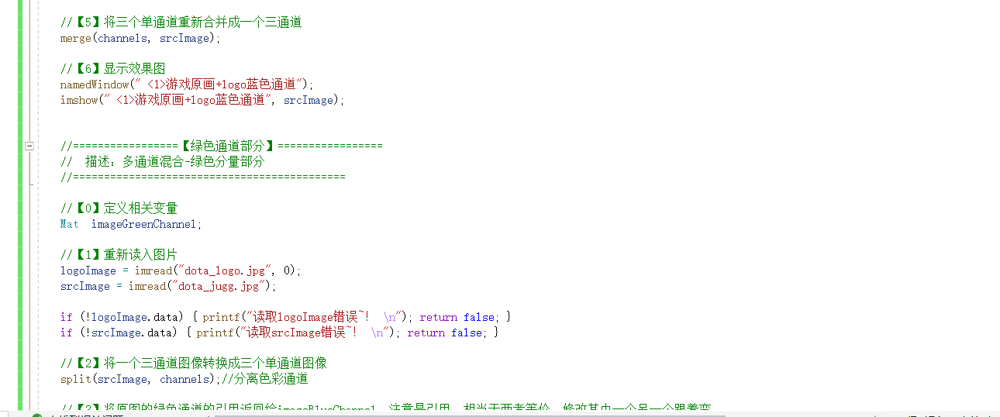

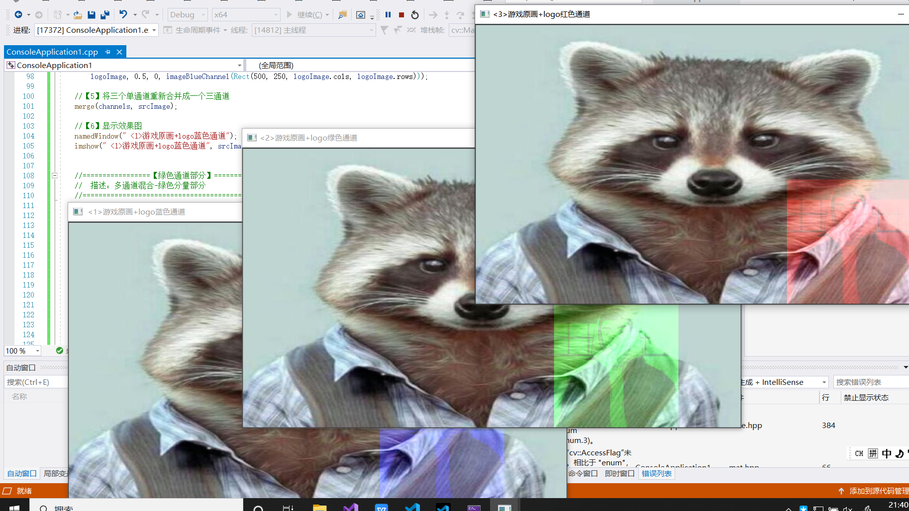

## 图像对比度，亮度值调整

### 访问图片中的像素

分三个方面
●为了访问图像的每- - 个像素，使用这样的语法: image.at<Vec3b>(y,x)[c].其中，y是像素所在的行，x是像素所在的列，c是R、G、B (对应0、1、2)其中之一。
●因为运算结果可能会超出像素取值范围(溢出)，还可能是非整数( 如果是浮点数的话)，所以要用saturate_ cast 对结果进行转换，以确保它为有效值。
●这里的a也就是对比度，- -般为了观察的效果，它的取值为0.0到3.0的浮点值，但是轨迹条--般取值都会取整数，因此在这里我们可以将其代表对比度值的nContrastValue参数设为0到300之间的整型,在最后的式子中乘以一个0.01，这样就完成了轨迹条中300个不同取值的变化。这就是为什么在式子中，会有saturate_ cast <uchar>((g_ nContrastValue*0.01 )*(image.at<Vec3b>(y,x)[c])+g_ nBrightValue)中的 g. _nContrastValue*0.01.

## 图像对比度，亮度值调整实验

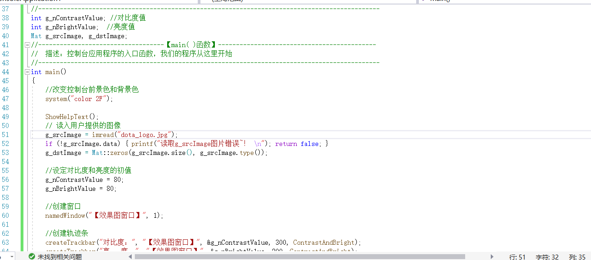

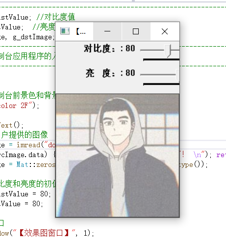

## 离散傅里叶变换

离散傅里叶变换，是指傅里叶变换在时域和频域上都呈现离散的形式，将时域信号的采样变换为在离散时间傅里叶变换(DTFT)频域的采样。在形式上，变换两端(时域和频域上)的序列是有限长的，而实际上这两组序列都应当被认为是离散周期信号的主值序列。即使对有限长的离散信号做DFT，也应当对其经过周期延拓成为周期信号再进行变换。在实际应用中，通常采用快速傅里叶变换来高效计算DFT。

### dft()函数详解

dft函数的作用是对一维或二维浮点数数组进行正向或反向离散傅里叶变换。
●第一个参数，InputArray 类型的srC。输入矩阵，可以为实数或者虚数。
●第二个参数，OutputArray 类型的dst。 函数调用后的运算结果存在这里，其尺寸和类型取决于标识符，也就是第三个参数flags。
●第三个参数，int 类型的flags。 转换的标识符，有默认值0。
●第四个参数，int类型的nonzeroRows， 有默认值0。当此参数设为非零时(最好是取值为想要处理的那一行的值， 比如C.rows)，函数会假设只有输入矩阵的第一个非零行包含非零元素(没有设置DFT_ INVERSE标识符),或只有输出矩阵的第-一个非零行包含非零元素(设置了DFT_ INVERSE 标识符)。这样的话，函数就可对其他行进行更高效的处理，以节省时间开销。这项技术尤其是在采用DFT计算矩阵卷积时非常有效。

### 返回DFT最优尺寸大小: getOptimalDFTSize（）函数
getOptimalDFTSize函数返回给定向量尺寸的傅里叶最优尺寸大小。为了提高离散傅里叶变换的运行速度，需要扩充图像，而具体扩充多少，就由这个函数来计算得到。C++: int getoptimalDFTSize (int vecsize)此函数的唯一一个 参数为int类型的vecsize,向量尺寸,即图片的rows. cols。

### 扩充图像边界: copyMakeBorder()函数
●第一个参数，InputArray类型的src， 输入图像，即源图像，填Mat类的对象即可。
●第二个参数，OutputArray 类型的dst, 函数调用后的运算结果存在这里，即这个参数用于存放函数调用后的输出结果，需和源图片有一样的尺寸和类型，且size应该为Size (src.cols+left+right, src.rows+ top+ bottom)。
●接下来的4个参数分别为int类型的top、bottom、 left、 right, 分别表示在源图像的四个方向上扩充多少像素，例如top=2, bottom=2, left=2， right=2就意味着在源图像的上下左右各扩充两个像素宽度的边界。
●第七个参数，borderType 类型的，边界类型，常见取值为BORDER_ _CONSTANT，可参考borderInterpolate()得到更多的细节。
●第八个参数，const Scalar&类型的value，有默认值Scalar(，可以理解为默认值为0。当borderType取值为BORDER_ _CONSTANT 时，这个参数表示边界值。

### 计算二 维矢量的幅值: magnitude（）函数

●第一个参数，InputArray类型的x, 表示矢量的浮点型X坐标值，也就是实部。
●第一个参数，InputArray类型的y,表示矢量的浮点型Y坐标值，也就是虚部。
●第三次参数，OutputArray 类型的magnitude, 输出的幅值，它和第一 -个参数x有着同样的尺寸和类型。

### 计算自然对数: log（）函数

log()函数的功能是计算每个数组元素绝对值的自然对数。
第一个参数为输入图像，第二个参数为得到的对数值。

### 矩阵归一化: normalize（）函数

●第一个参数，InputArray类型的src。 输入图像，即源图像，填Mat类的对象即可。
●第二个参数，OutputArray类型的dst。 函数调用后的运算结果存在这里，和源图片有一样的尺寸和类型。
●第三个参数，double类型的alpha。 归一-化后的最大值，有默认值1。
●第四个参数，double类型的beta。 归- -化后的最大值，有默认值0。
●第五个参数, int类型的norm_ type。归一化类型，有NORM_ INF、NORM_ L1、NORM_ L2和NORM_ MINMAX等参数可选，有默认值NORM_ L2。
●第六个参数, int类型的dtype, 有默认值-1。当此参数取负值时，输出矩阵和src有同样的类型，否则，它和src有同样的通道数，且此时图像深度为CV_ _MAT_ DEPTH (dtype)。 .
●第七个参数, InputArray类型的mask,可选的操作掩膜,有默认值noArray()。

## 离散傅里叶变换实验

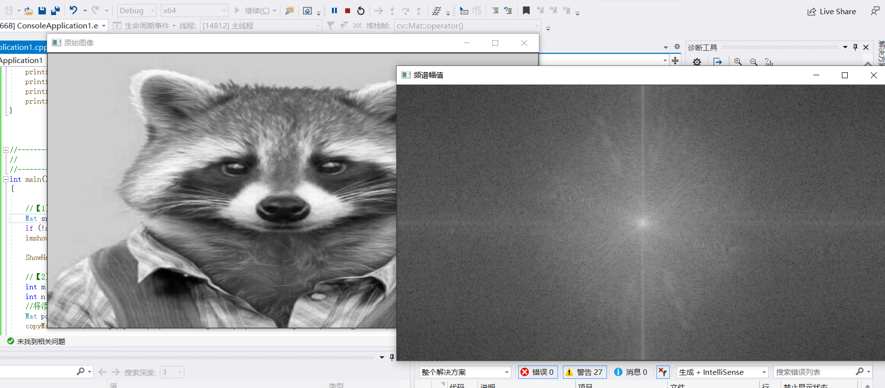

## 输入输出XML和YAML文件

### XML和YAML文件简介

所谓XML，翻译成中文为“可扩展标识语言”。首先，XML是一种元标记语言。所谓“元标记”，就是开发者可以根据自身需要定义自己的标记，比如可以定义标记<book>、<name>。 任何满足XML命名规则的名称都可以标记，这就向不同的应用程序打开了的大门。此外，XML是一种语义/结构化语言，它描述了文档的结构和语义。YAML是“YAML Ain't a Markup Language" (译为“YAML不是一种置标语
言”)的递回缩写。在开发的这种语言时，但为了强调这种语言以数据为中心，而不是以置标语言为重点，而用返璞词进行重新命名。YAML是一一个可读性高，用来表达资料序列的格式。

### FileStorage类操作文件的使用引导

● XML、YAML文件的打开
● 进行文件读写操作
● vector ( arrays) 和maps的输入和输出
●文件关闭

## XML和YAML文件的写人

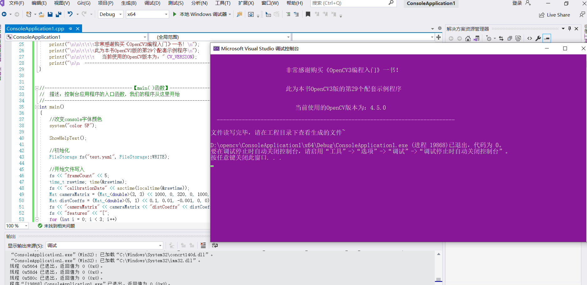

## XML和YAML文件的读取

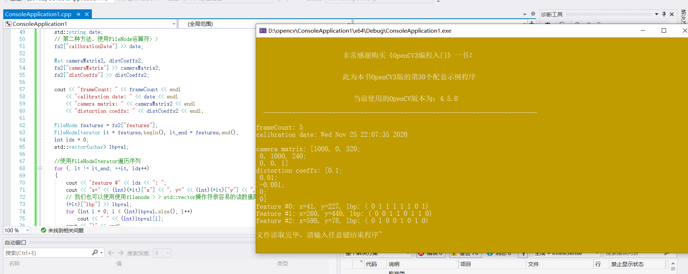

## 小结

我们了解了core 模块的一些进阶知识点一操作图像中的像素、图像混合、分离颜色通道、调节图像的对比度和亮度、进行离散傅里叶变换，以及输入输出XML和YAML文件。以及做了一些实验。

