# 第二次作业
## 第四章 数据结构与基本绘图
### 实验部分
#### 1.基础图像容器mat
```
#include "opencv2/core/core.hpp"
#include "opencv2/highgui/highgui.hpp"
#include <iostream>
using namespace std;
using namespace cv;


//-----------------------------【ShowHelpText( )函数】--------------------------------------
//		描述：输出帮助信息
//-------------------------------------------------------------------------------------------------
static void ShowHelpText()
{
	//输出欢迎信息和OpenCV版本
	printf("\n\n\t\t\t   当前使用的OpenCV版本为：" CV_VERSION);
	printf("\n\n  ----------------------------------------------------------------------------\n");

	//输出一些帮助信息
	printf("\n\n\n\t欢迎来到【基本图像容器-Mat类】示例程序~\n\n");
	printf("\n\n\t程序说明：\n\n\t此示例程序用于演示Mat类的格式化输出功能，输出风格可为：");
	printf("\n\n\n\t【1】OpenCV默认风格");
	printf("\n\n\t【2】Python风格");
	printf("\n\n\t【3】逗号分隔风格");
	printf("\n\n\t【4】Numpy风格");
	printf("\n\n\t【5】C语言风格\n\n");
	printf("\n  --------------------------------------------------------------------------\n");


}


//--------------------------------------【main( )函数】-----------------------------------------
//          描述：控制台应用程序的入口函数，我们的程序从这里开始执行
//-----------------------------------------------------------------------------------------------
int main(int, char**)
{
	//改变控制台的前景色和背景色
	system("color 8F");

	//显示帮助文字
	ShowHelpText();

	Mat I = Mat::eye(4, 4, CV_64F);
	I.at<double>(1, 1) = CV_PI;
	cout << "\nI = " << I << ";\n" << endl;

	Mat r = Mat(10, 3, CV_8UC3);
	randu(r, Scalar::all(0), Scalar::all(255));

	
	cout << "r (OpenCV默认风格) = " << r << ";" << endl << endl;
	cout << "r (Python风格) = " << format(r, Formatter::FMT_PYTHON) << ";" << endl << endl;
	cout << "r (Numpy风格) = " << format(r, Formatter::FMT_NUMPY) << ";" << endl << endl;
	cout << "r (逗号分隔风格) = " << format(r, Formatter::FMT_CSV) << ";" << endl << endl;
	cout << "r (C语言风格) = " << format(r, Formatter::FMT_C) << ";" << endl << endl;


	Point2f p(6, 2);
	cout << "【2维点】p = " << p << ";\n" << endl;

	Point3f p3f(8, 2, 0);
	cout << "【3维点】p3f = " << p3f << ";\n" << endl;

	vector<float> v;
	v.push_back(3);
	v.push_back(5);
	v.push_back(7);

	cout << "【基于Mat的vector】shortvec = " << Mat(v) << ";\n" << endl;

	vector<Point2f> points(20);
	for (size_t i = 0; i < points.size(); ++i)
		points[i] = Point2f((float)(i * 5), (float)(i % 7));

	cout << "【二维点向量】points = " << points << ";";

	getchar();//按任意键退出

	return 0;


}

```


#### 2.用OpenCV进行基本绘图
```

#include <opencv2/core/core.hpp>
#include <opencv2/highgui/highgui.hpp>
using namespace cv;

//此程序对于OpenCV3版需要额外包含头文件：
#include <opencv2/imgproc/imgproc.hpp>


//-----------------------------------【宏定义部分】-------------------------------------------- 
//		描述：定义一些辅助宏 
//------------------------------------------------------------------------------------------------ 
#define WINDOW_NAME1 "【绘制图1】"        //为窗口标题定义的宏 
#define WINDOW_NAME2 "【绘制图2】"        //为窗口标题定义的宏 
#define WINDOW_WIDTH 600//定义窗口大小的宏


//--------------------------------【全局函数声明部分】-------------------------------------
//		描述：全局函数声明
//-----------------------------------------------------------------------------------------------
void DrawEllipse(Mat img, double angle);//绘制椭圆
void DrawFilledCircle(Mat img, Point center);//绘制圆
void DrawPolygon(Mat img);//绘制多边形
void DrawLine(Mat img, Point start, Point end);//绘制线段


//-----------------------------------【ShowHelpText( )函数】----------------------------------
//          描述：输出一些帮助信息
//----------------------------------------------------------------------------------------------
void ShowHelpText()
{
	//输出欢迎信息和OpenCV版本
	printf("\n\n\t\t\t   当前使用的OpenCV版本为：" CV_VERSION);
	printf("\n\n  ----------------------------------------------------------------------------\n");
}


//---------------------------------------【main( )函数】--------------------------------------
//		描述：控制台应用程序的入口函数，我们的程序从这里开始执行
//-----------------------------------------------------------------------------------------------
int main(void)
{

	// 创建空白的Mat图像
	Mat atomImage = Mat::zeros(WINDOW_WIDTH, WINDOW_WIDTH, CV_8UC3);
	Mat rookImage = Mat::zeros(WINDOW_WIDTH, WINDOW_WIDTH, CV_8UC3);

	ShowHelpText();
	// ---------------------<1>绘制化学中的原子示例图------------------------

	//【1.1】先绘制出椭圆
	DrawEllipse(atomImage, 45);
	DrawEllipse(atomImage, 0);
	DrawEllipse(atomImage, 45);
	DrawEllipse(atomImage, -45);

	//【1.2】再绘制圆心
	DrawFilledCircle(atomImage, Point(WINDOW_WIDTH / 2, WINDOW_WIDTH / 2));

	// ----------------------------<2>绘制组合图-----------------------------
	//【2.1】先绘制出椭圆
	DrawPolygon(rookImage);

	// 【2.2】绘制矩形
	rectangle(rookImage,
		Point(0, 7 * WINDOW_WIDTH / 8),
		Point(WINDOW_WIDTH, WINDOW_WIDTH),
		Scalar(0, 255, 255),
		-1,
		8);

	// 【2.3】绘制一些线段
	DrawLine(rookImage, Point(0, 15 * WINDOW_WIDTH / 16), Point(WINDOW_WIDTH, 15 * WINDOW_WIDTH / 16));
	DrawLine(rookImage, Point(WINDOW_WIDTH / 4, 7 * WINDOW_WIDTH / 8), Point(WINDOW_WIDTH / 4, WINDOW_WIDTH));
	DrawLine(rookImage, Point(WINDOW_WIDTH / 2, 7 * WINDOW_WIDTH / 8), Point(WINDOW_WIDTH / 2, WINDOW_WIDTH));
	DrawLine(rookImage, Point(3 * WINDOW_WIDTH / 4, 7 * WINDOW_WIDTH / 8), Point(3 * WINDOW_WIDTH / 4, WINDOW_WIDTH));

	// ---------------------------<3>显示绘制出的图像------------------------
	imshow(WINDOW_NAME1, atomImage);
	moveWindow(WINDOW_NAME1, 0, 200);
	imshow(WINDOW_NAME2, rookImage);
	moveWindow(WINDOW_NAME2, WINDOW_WIDTH, 200);

	waitKey(0);
	return(0);
}


//-------------------------------【DrawEllipse( )函数】--------------------------------
//		描述：自定义的绘制函数，实现了绘制不同角度、相同尺寸的椭圆
//-----------------------------------------------------------------------------------------
void DrawEllipse(Mat img, double angle)
{
	int thickness = 2;
	int lineType = 8;

	ellipse(img,
		Point(WINDOW_WIDTH / 2, WINDOW_WIDTH / 2),
		Size(WINDOW_WIDTH / 4, WINDOW_WIDTH / 16),
		angle,
		0,
		360,
		Scalar(255, 129, 0),
		thickness,
		lineType);
}


//-----------------------------------【DrawFilledCircle( )函数】---------------------------
//		描述：自定义的绘制函数，实现了实心圆的绘制
//-----------------------------------------------------------------------------------------
void DrawFilledCircle(Mat img, Point center)
{
	int thickness = -1;
	int lineType = 8;

	circle(img,
		center,
		WINDOW_WIDTH / 32,
		Scalar(0, 0, 255),
		thickness,
		lineType);
}


//-----------------------------------【DrawPolygon( )函数】--------------------------
//		描述：自定义的绘制函数，实现了凹多边形的绘制
//--------------------------------------------------------------------------------------
void DrawPolygon(Mat img)
{
	int lineType = 8;

	//创建一些点
	Point rookPoints[1][20];
	rookPoints[0][0] = Point(WINDOW_WIDTH / 4, 7 * WINDOW_WIDTH / 8);
	rookPoints[0][1] = Point(3 * WINDOW_WIDTH / 4, 7 * WINDOW_WIDTH / 8);
	rookPoints[0][2] = Point(3 * WINDOW_WIDTH / 4, 13 * WINDOW_WIDTH / 16);
	rookPoints[0][3] = Point(11 * WINDOW_WIDTH / 16, 13 * WINDOW_WIDTH / 16);
	rookPoints[0][4] = Point(19 * WINDOW_WIDTH / 32, 3 * WINDOW_WIDTH / 8);
	rookPoints[0][5] = Point(3 * WINDOW_WIDTH / 4, 3 * WINDOW_WIDTH / 8);
	rookPoints[0][6] = Point(3 * WINDOW_WIDTH / 4, WINDOW_WIDTH / 8);
	rookPoints[0][7] = Point(26 * WINDOW_WIDTH / 40, WINDOW_WIDTH / 8);
	rookPoints[0][8] = Point(26 * WINDOW_WIDTH / 40, WINDOW_WIDTH / 4);
	rookPoints[0][9] = Point(22 * WINDOW_WIDTH / 40, WINDOW_WIDTH / 4);
	rookPoints[0][10] = Point(22 * WINDOW_WIDTH / 40, WINDOW_WIDTH / 8);
	rookPoints[0][11] = Point(18 * WINDOW_WIDTH / 40, WINDOW_WIDTH / 8);
	rookPoints[0][12] = Point(18 * WINDOW_WIDTH / 40, WINDOW_WIDTH / 4);
	rookPoints[0][13] = Point(14 * WINDOW_WIDTH / 40, WINDOW_WIDTH / 4);
	rookPoints[0][14] = Point(14 * WINDOW_WIDTH / 40, WINDOW_WIDTH / 8);
	rookPoints[0][15] = Point(WINDOW_WIDTH / 4, WINDOW_WIDTH / 8);
	rookPoints[0][16] = Point(WINDOW_WIDTH / 4, 3 * WINDOW_WIDTH / 8);
	rookPoints[0][17] = Point(13 * WINDOW_WIDTH / 32, 3 * WINDOW_WIDTH / 8);
	rookPoints[0][18] = Point(5 * WINDOW_WIDTH / 16, 13 * WINDOW_WIDTH / 16);
	rookPoints[0][19] = Point(WINDOW_WIDTH / 4, 13 * WINDOW_WIDTH / 16);

	const Point* ppt[1] = { rookPoints[0] };
	int npt[] = { 20 };

	fillPoly(img,
		ppt,
		npt,
		1,
		Scalar(255, 255, 255),
		lineType);
}


//-----------------------------------【DrawLine( )函数】--------------------------
//		描述：自定义的绘制函数，实现了线的绘制
//---------------------------------------------------------------------------------
void DrawLine(Mat img, Point start, Point end)
{
	int thickness = 2;
	int lineType = 8;
	line(img,
		start,
		end,
		Scalar(0, 0, 0),
		thickness,
		lineType);
}
```


### 笔记部分
1.使用函数clone()或者copyTo() 来复制一幅图像的矩阵

Mat F= A.clone();       Mat G; A.copyTo(G)

2. 矩形的表示：Rect类

Rect类的成员有x,y,width,height，分别为左上角点的坐标和矩形的宽、高。

contains(Point)判断点是否在矩形内；

inside(Rect)判断矩形是否在该矩形内；

tl()返回左上角点坐标； br()返回右下角点坐标

3.颜色空间转换：cvtColor()函数

cvtColor(InputArraysrc, OutputArray dst, int code, int dstCn=0)

第一个参数，输入图像；

第二个参数，输出图像；

第三个参数，颜色空间转换的标识符；

第四个参数，目标图像的通道数，若为0，则表示其取源图像的通道数。

4 . 创建空白的Mat图像

MatatomImage=Mat::zeros( 长, 宽, CV_8UC3 );

5.OpenCV默认的图片通道存储顺序是BGR，即蓝绿红，而不是RGB

6 . Mat结构的使用
Mat是一个类，由两个数据部分组成：矩阵头（包含矩阵尺寸、存储方法、存储地址等信息）和一个指向存储所有像素值的矩阵的指针。矩阵头的尺寸是常数值，但是矩阵的本身的尺寸会依据图像的不同而不同，通常比矩阵头的尺寸大数个数量级。因此在程序创建副本时，大的开销是由矩阵造成的，而不是信息头。Opencv是一个图像处理库，囊括了大量的图像处理函数，为了解决问题通常要使用库中的多个函数，因此在函数中传递图像是常有的事。除非万不得已，不应该进行大图像的复制，因为这会降低程序的运行速度。
显示创建Mat对象的七种方法：
（1） 使用Mat()构造函数
Mat M(2,2,CV_8UC3,Scalar(0,0,255));
Cout<<”M=”<<endl<<” ”<<M<<endl<<endl;,
对于二维多通道图像，首先要定义其尺寸，即行数和列数。然后，需要指定存储元素的数据类型以及每个矩阵点的通道数。为此，依据下面的规则有多种定义：
CV_[位数][带符号与否][类型前缀]C[通道数]
比如CV_8UC3表示使用8位的unsigned char型，每个像素由三个元素组成三通道。而预先定义的通道数可以多达四通道
（2） 在C\C++中通过构造函数进行初始化
Int sz[3] = {2,2,2};
Mat L(3,sz,CV_8UC,Scalar::all(0));
（3） 为已经存在的IplImage指针创建信息头
IplImage* img = cvLoadImage(“1.jpg”,1);
Mat mtx(img);
（4） 利用Create()函数
M．create(4,4,CV_8UC(2));
需要注意的是，此创建方法不能为矩阵设定初始值，只是在改变尺寸时重新为矩阵数据开辟内存而已。
（5） 采用Matlab的初始化方式
采用Matlab形式的初始化方式：zero(),ones(),eyes()。
Mat E = Mat::eye(4,4,CV_64F);
Mat O= Mat::ones(2,2,CV_32F);
Mat Z = Mat::zeros(3,3,CV_8UC1);
（6） 对小矩阵使用逗号分隔式初始化函数
Mat C=(Mat_(3,3)<<0,-1,0,-1,5,-1,0,-1,0);
（7） 位已经存在的对象创建新的信息头
Mat RowClone=C.row(1).clone();
7 . 常用数据结构和函数
（1） 点的表示方法
Point类数据结构表示了二维坐标系下的点，即由其图像坐标x和y指定的2D点。用法如下：
Point point;
point.x=10;
point.y=8;
或者
Point.point=Point(10,8);
另外，在OpenCV中有如下的定义：
typedef Point_ Point2i;
typedef Point_ Point2f;
typedef Point2i Point;
所以，Point_,Point2i,Point互相等价，Point_,Point2f互相等价。
（2） 颜色的表示方法
Scalar()表示具有4个元素的数组，在OPENCV中被大量用于传递像素值，如RGB颜色值。而RGB颜色值为三个参数，其实对于Scalar函数来说，如果用不到第四个参数，则不用写出来；若只写三个参数，OPENCV会认为我们就想表示三个参数。
如果给出以下颜色参数表达式：Scalar(a,b,c)
那么定义的RGB颜色值：红色分量为c，绿色分量为b，蓝色分量为a。
（3） 尺寸的表示方法
可以用XXX.width和XXX.height来分别表示其宽度和高度
下面给出一个示例，
Size(5,5);//构造出的Size宽度和高度都为5，即XXX.width和XXX.height都为5
（4） 矩形的表示方法
Rect类的成员变量有x、y、width、height，分别为左上角点的坐标和矩形的宽和高。常用的成员函数有：
Size()返回值为Size; area()返回矩形的面积; contains（Point）判断点是否在矩形内; inside(Rect)函数判断矩形是否在该矩形内; tl()返回左上角点的坐标; br()返回右下角点的坐标。值得注意的是，如果想求两个矩形的交集和并集，可以用如下格式：
Rect rect = rect1 & rect2;
Rect rect = rect1 | rect2;
（5） 颜色空间转换：cvtColor()函数
cvtColor()函数是Opencv里的颜色空间转换函数，可以实现RGB颜色向HSV、HIS等颜色空间的转换，也可以转换为灰度图像。
Void cvtColor(InputArray src,OutputArray dst,int code, int dstCn=0)
第一个参数为输入图像，第二个参数为输出图像，第三个参数为颜色空间转换的标识符，第四个参数为目标图像的通道数，若该参数是0，表示目标图像取原图像的通道数。下面是一个调用示例：
//此句代码的OpenCV2版为：
cvtColor(srcImage,dstImage,CV_GRAY2BGR);//转换原始图为灰度图
//此句代码的OpenCV3版为：
cvtColor(srcImage,dstImage,COLOR_GRAY2BGR);//转换原始图为灰度图

8 . 基本图形的绘制
涉及函数如下：
~用于绘制直线的line函数
~用于绘制椭圆的ellipse函数
~用于绘制矩形的rectangle函数
~用于绘制圆的circle函数
~用于绘制多边形的fillPoly函数

## 第五章 core组件进阶
### 实验部分
#### 1.用指针访问像素
```

#include <opencv2/core/core.hpp>  
#include <opencv2/highgui/highgui.hpp>  
#include <iostream>  
using namespace std;  
using namespace cv;  

//-----------------------------------【全局函数声明部分】-----------------------------------
//          描述：全局函数声明
//-----------------------------------------------------------------------------------------------
void colorReduce(Mat& inputImage, Mat& outputImage, int div);  
void ShowHelpText();


//--------------------------------------【main( )函数】---------------------------------------
//          描述：控制台应用程序的入口函数，我们的程序从这里开始执行
//-----------------------------------------------------------------------------------------------
int main( )  
{  
	//【1】创建原始图并显示
	Mat srcImage = imread("1.jpg");  
	imshow("原始图像",srcImage);  

	//【2】按原始图的参数规格来创建创建效果图
	Mat dstImage;
	dstImage.create(srcImage.rows,srcImage.cols,srcImage.type());//效果图的大小、类型与原图片相同 

	ShowHelpText();

	//【3】记录起始时间
	double time0 = static_cast<double>(getTickCount());  

	//【4】调用颜色空间缩减函数
	colorReduce(srcImage,dstImage,32);  

	//【5】计算运行时间并输出
	time0 = ((double)getTickCount() - time0)/getTickFrequency();
	cout<<"\t此方法运行时间为： "<<time0<<"秒"<<endl;  //输出运行时间

	//【6】显示效果图
	imshow("效果图",dstImage);  
	waitKey(0);  
}  


//---------------------------------【colorReduce( )函数】---------------------------------
//          描述：使用【指针访问：C操作符[ ]】方法版的颜色空间缩减函数
//----------------------------------------------------------------------------------------------
void colorReduce(Mat& inputImage, Mat& outputImage, int div)  
{  
	//参数准备
	outputImage = inputImage.clone();  //拷贝实参到临时变量
	int rowNumber = outputImage.rows;  //行数
	int colNumber = outputImage.cols*outputImage.channels();  //列数 x 通道数=每一行元素的个数

	//双重循环，遍历所有的像素值
	for(int i = 0;i < rowNumber;i++)  //行循环
	{  
		uchar* data = outputImage.ptr<uchar>(i);  //获取第i行的首地址
		for(int j = 0;j < colNumber;j++)   //列循环
		{  	
			// ---------【开始处理每个像素】-------------     
			data[j] = data[j]/div*div + div/2;  
			// ----------【处理结束】---------------------
		}  //行处理结束
	}  
}  


//-----------------------------------【ShowHelpText( )函数】----------------------------------
//          描述：输出一些帮助信息
//----------------------------------------------------------------------------------------------
void ShowHelpText()
{
	//输出欢迎信息和OpenCV版本
	printf("\n\n\t\t\t非常感谢购买《OpenCV3编程入门》一书！\n");
	printf("\n\n\t\t\t此为本书OpenCV3版的第21个配套示例程序\n");
	printf("\n\n\t\t\t   当前使用的OpenCV版本为：" CV_VERSION );
	printf("\n\n  ----------------------------------------------------------------------------\n");
}

```


#### 2.用迭代器访问像素
```

#include <opencv2/core/core.hpp>  
#include <opencv2/highgui/highgui.hpp>  
#include <iostream>  
using namespace std;
using namespace cv;


//-----------------------------------【全局函数声明部分】-----------------------------------
//		描述：全局函数声明
//-----------------------------------------------------------------------------------------------
void colorReduce(Mat& inputImage, Mat& outputImage, int div);
void ShowHelpText();


//--------------------------------------【main( )函数】--------------------------------------
//		描述：控制台应用程序的入口函数，我们的程序从这里开始执行
//-----------------------------------------------------------------------------------------------
int main()
{
	//【1】创建原始图并显示
	Mat srcImage = imread("1.jpg");
	imshow("原始图像", srcImage);

	//【2】按原始图的参数规格来创建创建效果图
	Mat dstImage;
	dstImage.create(srcImage.rows, srcImage.cols, srcImage.type());//效果图的大小、类型与原图片相同 

	ShowHelpText();

	//【3】记录起始时间
	double time0 = static_cast<double>(getTickCount());

	//【4】调用颜色空间缩减函数
	colorReduce(srcImage, dstImage, 32);

	//【5】计算运行时间并输出
	time0 = ((double)getTickCount() - time0) / getTickFrequency();
	cout << "此方法运行时间为： " << time0 << "秒" << endl;  //输出运行时间

	//【6】显示效果图
	imshow("效果图", dstImage);
	waitKey(0);
}


//-------------------------------------【colorReduce( )函数】-----------------------------
//		描述：使用【迭代器】方法版的颜色空间缩减函数
//----------------------------------------------------------------------------------------------
void colorReduce(Mat& inputImage, Mat& outputImage, int div)
{
	//参数准备
	outputImage = inputImage.clone();  //拷贝实参到临时变量
	//获取迭代器
	Mat_<Vec3b>::iterator it = outputImage.begin<Vec3b>();  //初始位置的迭代器
	Mat_<Vec3b>::iterator itend = outputImage.end<Vec3b>();  //终止位置的迭代器

	//存取彩色图像像素
	for (; it != itend; ++it)
	{
		// ------------------------【开始处理每个像素】--------------------
		(*it)[0] = (*it)[0] / div * div + div / 2;
		(*it)[1] = (*it)[1] / div * div + div / 2;
		(*it)[2] = (*it)[2] / div * div + div / 2;
		// ------------------------【处理结束】----------------------------
	}
}


//-----------------------------------【ShowHelpText( )函数】----------------------------------
//          描述：输出一些帮助信息
//----------------------------------------------------------------------------------------------
void ShowHelpText()
{
	//输出欢迎信息和OpenCV版本
	
	printf("\n\n\t\t\t   当前使用的OpenCV版本为：" CV_VERSION);
	printf("\n\n  ----------------------------------------------------------------------------\n");
}


```


#### 3.用动态地址计算配合at访问像素
```

#include <opencv2/core/core.hpp>  
#include <opencv2/highgui/highgui.hpp>  
#include <iostream>  
using namespace std;
using namespace cv;

//-----------------------------------【全局函数声明部分】-----------------------------------
//          描述：全局函数声明
//-----------------------------------------------------------------------------------------------
void colorReduce(Mat& inputImage, Mat& outputImage, int div);
void ShowHelpText();


//--------------------------------------【main( )函数】---------------------------------------
//          描述：控制台应用程序的入口函数，我们的程序从这里开始执行
//-----------------------------------------------------------------------------------------------
int main()
{
	system("color 9F");
	//【1】创建原始图并显示
	Mat srcImage = imread("1.jpg");
	imshow("原始图像", srcImage);

	//【2】按原始图的参数规格来创建创建效果图
	Mat dstImage;
	dstImage.create(srcImage.rows, srcImage.cols, srcImage.type());//效果图的大小、类型与原图片相同 

	ShowHelpText();

	//【3】记录起始时间
	double time0 = static_cast<double>(getTickCount());

	//【4】调用颜色空间缩减函数
	colorReduce(srcImage, dstImage, 32);

	//【5】计算运行时间并输出
	time0 = ((double)getTickCount() - time0) / getTickFrequency();
	cout << "此方法运行时间为： " << time0 << "秒" << endl;  //输出运行时间

	//【6】显示效果图
	imshow("效果图", dstImage);
	waitKey(0);
}


//----------------------------------【colorReduce( )函数】-------------------------------
//          描述：使用【动态地址运算配合at】方法版本的颜色空间缩减函数
//----------------------------------------------------------------------------------------------
void colorReduce(Mat& inputImage, Mat& outputImage, int div)
{
	//参数准备
	outputImage = inputImage.clone();  //拷贝实参到临时变量
	int rowNumber = outputImage.rows;  //行数
	int colNumber = outputImage.cols;  //列数

	//存取彩色图像像素
	for (int i = 0; i < rowNumber; i++)
	{
		for (int j = 0; j < colNumber; j++)
		{
			// ------------------------【开始处理每个像素】--------------------
			outputImage.at<Vec3b>(i, j)[0] = outputImage.at<Vec3b>(i, j)[0] / div * div + div / 2;  //蓝色通道
			outputImage.at<Vec3b>(i, j)[1] = outputImage.at<Vec3b>(i, j)[1] / div * div + div / 2;  //绿色通道
			outputImage.at<Vec3b>(i, j)[2] = outputImage.at<Vec3b>(i, j)[2] / div * div + div / 2;  //红是通道
			// -------------------------【处理结束】----------------------------
		}  // 行处理结束     
	}
}


//-------------------------------【ShowHelpText( )函数】--------------------------------
//          描述：输出一些帮助信息
//----------------------------------------------------------------------------------------------
void ShowHelpText()
{
	
	printf("\n\n\t\t\t   当前使用的OpenCV版本为：" CV_VERSION);
	printf("\n\n  ----------------------------------------------------------------------------\n");
}


```


#### 4.初级图像混合
```
#include <opencv2/core/core.hpp>
#include <opencv2/highgui/highgui.hpp>
#include <iostream>
 
using namespace cv;
using namespace std;
 
 
//-----------------------------------【全局函数声明部分】--------------------------------------
//	描述：全局函数声明
//-----------------------------------------------------------------------------------------------
bool  ROI_AddImage();
bool  LinearBlending();
bool  ROI_LinearBlending();
void   ShowHelpText();
 
//-----------------------------------【main( )函数】--------------------------------------------
//	描述：控制台应用程序的入口函数，我们的程序从这里开始
//-----------------------------------------------------------------------------------------------
int main(   )
{
	system("color 6F");
 
	ShowHelpText();
 
	if(ROI_AddImage( )&& LinearBlending( )&&ROI_LinearBlending( ))
	{
		cout<<endl<<"\n运行成功，得出了需要的图像~! ";
	}
 
	waitKey(0);
	return 0;
}
 
 
//-----------------------------------【ShowHelpText( )函数】----------------------------------
//		 描述：输出一些帮助信息
//----------------------------------------------------------------------------------------------
void ShowHelpText()
{
	//输出欢迎信息和OpenCV版本
	printf("\n\n\t\t\t非常感谢购买《OpenCV3编程入门》一书！\n");
	printf("\n\n\t\t\t此为本书OpenCV2版的第25个配套示例程序\n");
	printf("\n\n\t\t\t   当前使用的OpenCV版本为：" CV_VERSION );
	printf("\n\n  ----------------------------------------------------------------------------\n");
}
 
 
 
 
//----------------------------------【ROI_AddImage( )函数】----------------------------------
// 函数名：ROI_AddImage（）
//	描述：利用感兴趣区域ROI实现图像叠加
//----------------------------------------------------------------------------------------------
bool  ROI_AddImage()
{
 
	// 【1】读入图像
	Mat srcImage1= imread("dota_pa.jpg");
	Mat logoImage= imread("dota_logo.jpg");
	if( !srcImage1.data ) { printf("读取srcImage1错误~！ \n"); return false; }
	if( !logoImage.data ) { printf("读取logoImage错误~！ \n"); return false; }
 
	// 【2】定义一个Mat类型并给其设定ROI区域
	Mat imageROI= srcImage1(Rect(200,250,logoImage.cols,logoImage.rows));
 
	// 【3】加载掩模（必须是灰度图）
	Mat mask= imread("dota_logo.jpg",0);
 
	//【4】将掩膜拷贝到ROI
	logoImage.copyTo(imageROI,mask);
 
	// 【5】显示结果
	namedWindow("<1>利用ROI实现图像叠加示例窗口");
	imshow("<1>利用ROI实现图像叠加示例窗口",srcImage1);
 
	return true;
}
 
 
//---------------------------------【LinearBlending（）函数】-------------------------------------
// 函数名：LinearBlending（）
// 描述：利用cv::addWeighted（）函数实现图像线性混合
//--------------------------------------------------------------------------------------------
bool  LinearBlending()
{
	//【0】定义一些局部变量
	double alphaValue = 0.5; 
	double betaValue;
	Mat srcImage2, srcImage3, dstImage;
 
	// 【1】读取图像 ( 两幅图片需为同样的类型和尺寸 )
	srcImage2 = imread("mogu.jpg");
	srcImage3 = imread("rain.jpg");
 
	if( !srcImage2.data ) { printf("读取srcImage2错误！ \n"); return false; }
	if( !srcImage3.data ) { printf("读取srcImage3错误！ \n"); return false; }
 
	// 【2】进行图像混合加权操作
	betaValue = ( 1.0 - alphaValue );
	addWeighted( srcImage2, alphaValue, srcImage3, betaValue, 0.0, dstImage);
 
	// 【3】显示原图窗口
	imshow( "<2>线性混合示例窗口【原图】", srcImage2 );
	imshow( "<3>线性混合示例窗口【效果图】", dstImage );
 
	return true;
 
}
 
//---------------------------------【ROI_LinearBlending（）】-------------------------------------
// 函数名：ROI_LinearBlending（）
// 描述：线性混合实现函数,指定区域线性图像混合.利用cv::addWeighted（）函数结合定义
//			  感兴趣区域ROI，实现自定义区域的线性混合
//--------------------------------------------------------------------------------------------
bool  ROI_LinearBlending()
{
 
	//【1】读取图像
	Mat srcImage4= imread("dota_pa.jpg",1);
	Mat logoImage= imread("dota_logo.jpg");
 
	if( !srcImage4.data ) { printf("读取srcImage4错误~！ \n"); return false; }
	if( !logoImage.data ) { printf("读取logoImage错误~！ \n"); return false; }
 
	//【2】定义一个Mat类型并给其设定ROI区域
	Mat imageROI;
	//方法一
	imageROI= srcImage4(Rect(200,250,logoImage.cols,logoImage.rows));
	//方法二
	//imageROI= srcImage4(Range(250,250+logoImage.rows),Range(200,200+logoImage.cols));
 
	//【3】将logo加到原图上
	addWeighted(imageROI,0.5,logoImage,0.3,0.,imageROI);
 
	//【4】显示结果
	imshow("<4>区域线性图像混合示例窗口",srcImage4);
 
	return true;
}
```

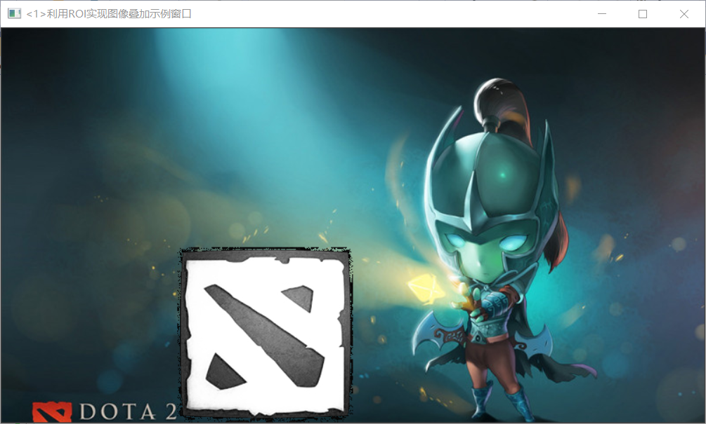

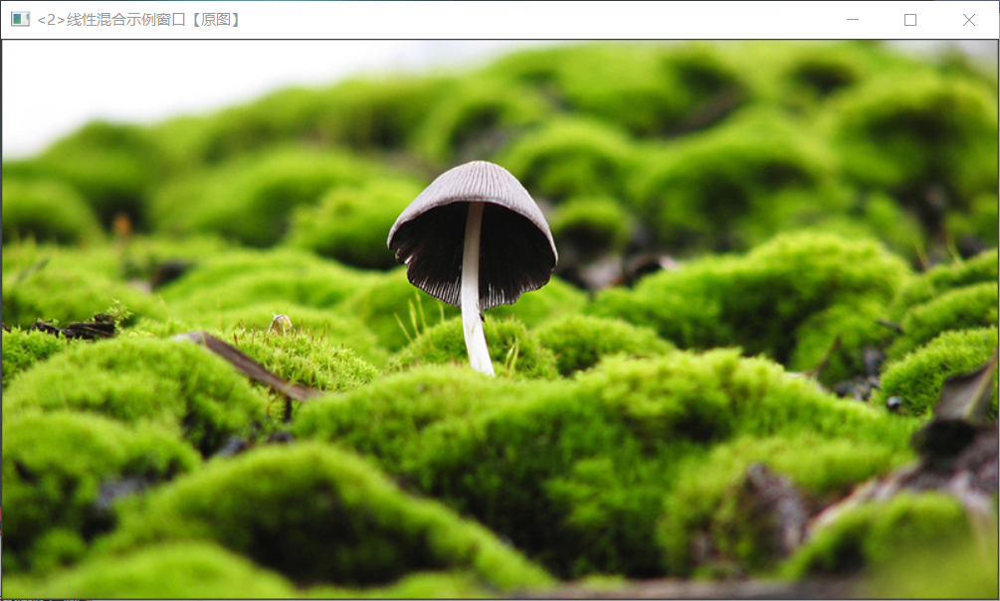
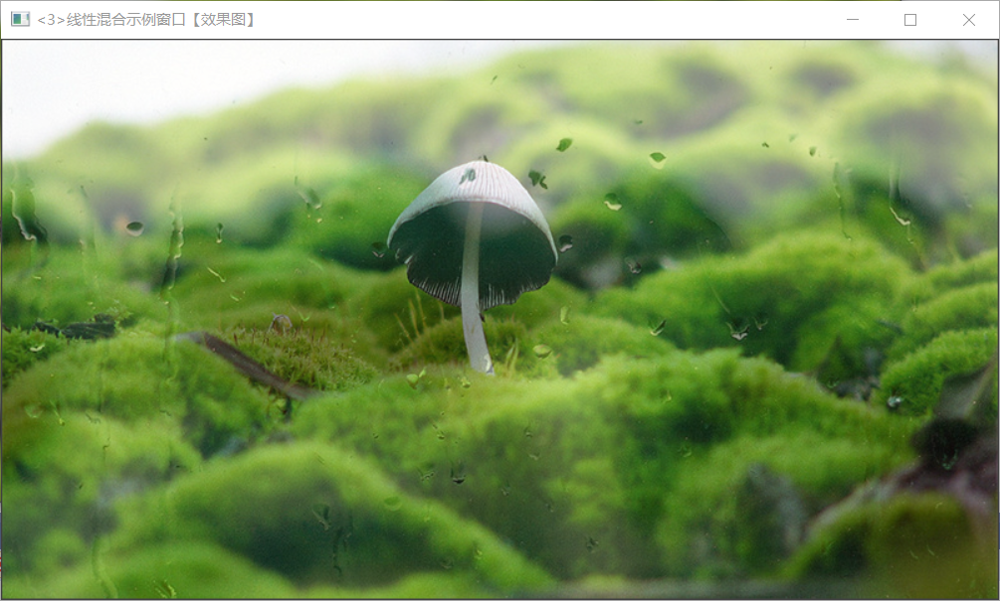
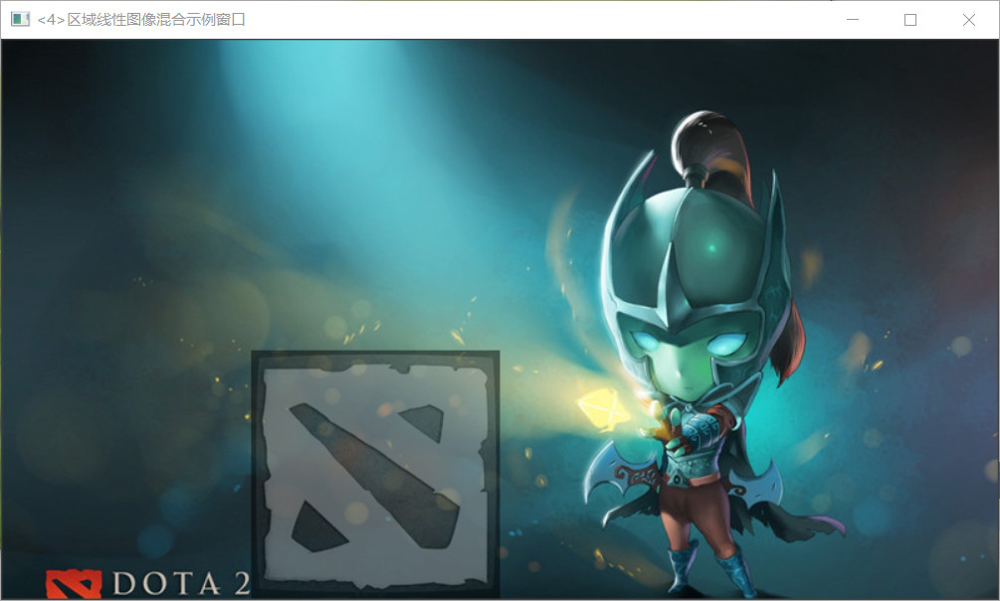

#### 5.多通道图像混合
```

                                                                                    
#include <opencv2/core/core.hpp>
#include <opencv2/highgui/highgui.hpp>
#include <iostream>

//-----------------------------------【命名空间声明部分】---------------------------------------
//	描述：包含程序所使用的命名空间
//-------------------------------------------------------------------------------------------------   
using namespace cv;
using namespace std;


//-----------------------------------【全局函数声明部分】--------------------------------------
//	描述：全局函数声明
//-----------------------------------------------------------------------------------------------
bool  MultiChannelBlending();
void ShowHelpText();


//-----------------------------------【main( )函数】------------------------------------------
//	描述：控制台应用程序的入口函数，我们的程序从这里开始
//-----------------------------------------------------------------------------------------------
int main(   )
{
	system("color 9F");

	ShowHelpText( );

	if(MultiChannelBlending( ))
	{
		cout<<endl<<"\n运行成功，得出了需要的图像~! ";
	}

	waitKey(0);
	return 0;
}


//-----------------------------------【ShowHelpText( )函数】----------------------------------
//		 描述：输出一些帮助信息
//----------------------------------------------------------------------------------------------
void ShowHelpText()
{
	//输出欢迎信息和OpenCV版本
	printf("\n\n\t\t\t非常感谢购买《OpenCV3编程入门》一书！\n");
	printf("\n\n\t\t\t此为本书OpenCV3版的第26个配套示例程序\n");
	printf("\n\n\t\t\t   当前使用的OpenCV版本为：" CV_VERSION );
	printf("\n\n  ----------------------------------------------------------------------------\n");
}


//-----------------------------【MultiChannelBlending( )函数】--------------------------------
//	描述：多通道混合的实现函数
//-----------------------------------------------------------------------------------------------
bool  MultiChannelBlending()
{
	//【0】定义相关变量
	Mat srcImage;
	Mat logoImage;
	vector<Mat> channels;
	Mat  imageBlueChannel;

	//=================【蓝色通道部分】=================
	//	描述：多通道混合-蓝色分量部分
	//============================================

	// 【1】读入图片
	logoImage= imread("dota_logo.jpg",0);
	srcImage= imread("dota_jugg.jpg");

	if( !logoImage.data ) { printf("Oh，no，读取logoImage错误~！ \n"); return false; }
	if( !srcImage.data ) { printf("Oh，no，读取srcImage错误~！ \n"); return false; }

	//【2】把一个3通道图像转换成3个单通道图像
	split(srcImage,channels);//分离色彩通道

	//【3】将原图的蓝色通道引用返回给imageBlueChannel，注意是引用，相当于两者等价，修改其中一个另一个跟着变
	imageBlueChannel= channels.at(0);
	//【4】将原图的蓝色通道的（500,250）坐标处右下方的一块区域和logo图进行加权操作，将得到的混合结果存到imageBlueChannel中
	addWeighted(imageBlueChannel(Rect(500,250,logoImage.cols,logoImage.rows)),1.0,
		logoImage,0.5,0,imageBlueChannel(Rect(500,250,logoImage.cols,logoImage.rows)));

	//【5】将三个单通道重新合并成一个三通道
	merge(channels,srcImage);

	//【6】显示效果图
	namedWindow(" <1>游戏原画+logo蓝色通道");
	imshow(" <1>游戏原画+logo蓝色通道",srcImage);


	//=================【绿色通道部分】=================
	//	描述：多通道混合-绿色分量部分
	//============================================

	//【0】定义相关变量
	Mat  imageGreenChannel;

	//【1】重新读入图片
	logoImage= imread("dota_logo.jpg",0);
	srcImage= imread("dota_jugg.jpg");

	if( !logoImage.data ) { printf("读取logoImage错误~！ \n"); return false; }
	if( !srcImage.data ) { printf("读取srcImage错误~！ \n"); return false; }

	//【2】将一个三通道图像转换成三个单通道图像
	split(srcImage,channels);//分离色彩通道

	//【3】将原图的绿色通道的引用返回给imageBlueChannel，注意是引用，相当于两者等价，修改其中一个另一个跟着变
	imageGreenChannel= channels.at(1);
	//【4】将原图的绿色通道的（500,250）坐标处右下方的一块区域和logo图进行加权操作，将得到的混合结果存到imageGreenChannel中
	addWeighted(imageGreenChannel(Rect(500,250,logoImage.cols,logoImage.rows)),1.0,
		logoImage,0.5,0.,imageGreenChannel(Rect(500,250,logoImage.cols,logoImage.rows)));

	//【5】将三个独立的单通道重新合并成一个三通道
	merge(channels,srcImage);

	//【6】显示效果图
	namedWindow("<2>游戏原画+logo绿色通道");
	imshow("<2>游戏原画+logo绿色通道",srcImage);


	//=================【红色通道部分】=================
	//	描述：多通道混合-红色分量部分
	//============================================

	//【0】定义相关变量
	Mat  imageRedChannel;

	//【1】重新读入图片
	logoImage= imread("dota_logo.jpg",0);
	srcImage= imread("dota_jugg.jpg");

	if( !logoImage.data ) { printf("Oh，no，读取logoImage错误~！ \n"); return false; }
	if( !srcImage.data ) { printf("Oh，no，读取srcImage错误~！ \n"); return false; }

	//【2】将一个三通道图像转换成三个单通道图像
	split(srcImage,channels);//分离色彩通道

	//【3】将原图的红色通道引用返回给imageBlueChannel，注意是引用，相当于两者等价，修改其中一个另一个跟着变
	imageRedChannel= channels.at(2);
	//【4】将原图的红色通道的（500,250）坐标处右下方的一块区域和logo图进行加权操作，将得到的混合结果存到imageRedChannel中
	addWeighted(imageRedChannel(Rect(500,250,logoImage.cols,logoImage.rows)),1.0,
		logoImage,0.5,0.,imageRedChannel(Rect(500,250,logoImage.cols,logoImage.rows)));

	//【5】将三个独立的单通道重新合并成一个三通道
	merge(channels,srcImage);

	//【6】显示效果图
	namedWindow("<3>游戏原画+logo红色通道 ");
	imshow("<3>游戏原画+logo红色通道 ",srcImage);

	return true;
}


```
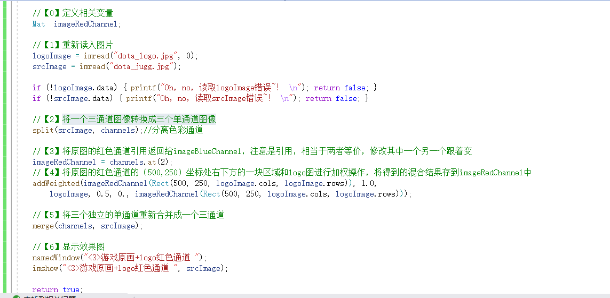
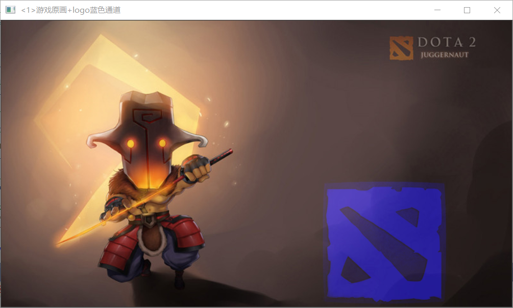
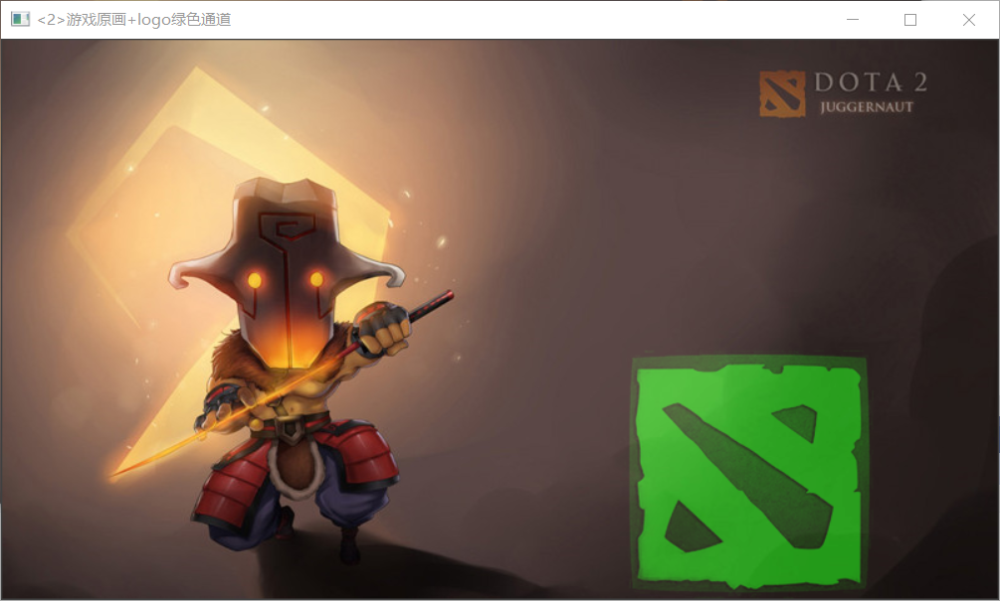
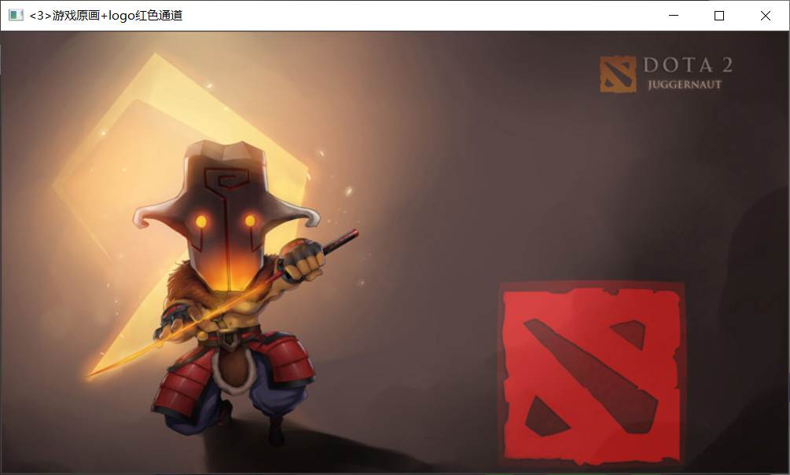


#### 6.图像对比度，亮度调整
```


#include <opencv2/core/core.hpp>
#include <opencv2/highgui/highgui.hpp>
#include "opencv2/imgproc/imgproc.hpp"
#include <iostream>

//-----------------------------------【命名空间声明部分】---------------------------------------
//	描述：包含程序所使用的命名空间
//-----------------------------------------------------------------------------------------------   
using namespace std;
using namespace cv;


//-----------------------------------【全局函数声明部分】--------------------------------------
//	描述：全局函数声明
//-----------------------------------------------------------------------------------------------
static void ContrastAndBright(int, void *);
void   ShowHelpText();

//-----------------------------------【全局变量声明部分】--------------------------------------
//	描述：全局变量声明
//-----------------------------------------------------------------------------------------------
int g_nContrastValue; //对比度值
int g_nBrightValue;  //亮度值
Mat g_srcImage,g_dstImage;
//-----------------------------------【main( )函数】--------------------------------------------
//	描述：控制台应用程序的入口函数，我们的程序从这里开始
//-----------------------------------------------------------------------------------------------
int main(   )
{
	//改变控制台前景色和背景色
	system("color 2F");  

	ShowHelpText();
	// 读入用户提供的图像
	g_srcImage = imread( "1.jpg");
	if( !g_srcImage.data ) { printf("读取g_srcImage图片错误~！ \n"); return false; }
	g_dstImage = Mat::zeros( g_srcImage.size(), g_srcImage.type() );

	//设定对比度和亮度的初值
	g_nContrastValue=80;
	g_nBrightValue=80;

	//创建窗口
	namedWindow("【效果图窗口】", 1);

	//创建轨迹条
	createTrackbar("对比度：", "【效果图窗口】",&g_nContrastValue, 300,ContrastAndBright );
	createTrackbar("亮   度：", "【效果图窗口】",&g_nBrightValue, 200,ContrastAndBright );

	//调用回调函数
	ContrastAndBright(g_nContrastValue,0);
	ContrastAndBright(g_nBrightValue,0);

	//输出一些帮助信息
	cout<<endl<<"\t运行成功，请调整滚动条观察图像效果\n\n"
		<<"\t按下“q”键时，程序退出\n";

	//按下“q”键时，程序退出
	while(char(waitKey(1)) != 'q') {}
	return 0;
}


//-----------------------------------【ShowHelpText( )函数】----------------------------------
//		 描述：输出一些帮助信息
//----------------------------------------------------------------------------------------------
void ShowHelpText()
{
	//输出欢迎信息和OpenCV版本
	printf("\n\n\t\t\t非常感谢购买《OpenCV3编程入门》一书！\n");
	printf("\n\n\t\t\t此为本书OpenCV3版的第27个配套示例程序\n");
	printf("\n\n\t\t\t   当前使用的OpenCV版本为：" CV_VERSION );
	printf("\n\n  ----------------------------------------------------------------------------\n");
}


//-----------------------------【ContrastAndBright( )函数】------------------------------------
//	描述：改变图像对比度和亮度值的回调函数
//-----------------------------------------------------------------------------------------------
static void ContrastAndBright(int, void *)
{

	// 创建窗口
	namedWindow("【原始图窗口】", 1);

	// 三个for循环，执行运算 g_dstImage(i,j) = a*g_srcImage(i,j) + b
	for( int y = 0; y < g_srcImage.rows; y++ )
	{
		for( int x = 0; x < g_srcImage.cols; x++ )
		{
			for( int c = 0; c < 3; c++ )
			{
				g_dstImage.at<Vec3b>(y,x)[c] = saturate_cast<uchar>( (g_nContrastValue*0.01)*( g_srcImage.at<Vec3b>(y,x)[c] ) + g_nBrightValue );
			}
		}
	}

	// 显示图像
	imshow("【原始图窗口】", g_srcImage);
	imshow("【效果图窗口】", g_dstImage);
}


```
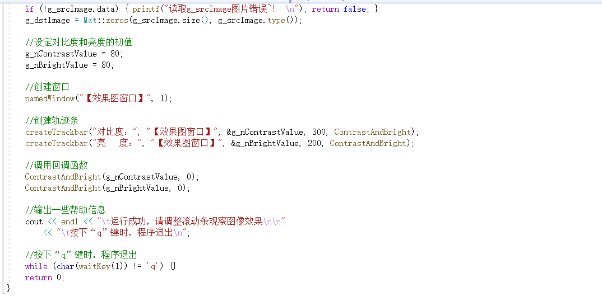
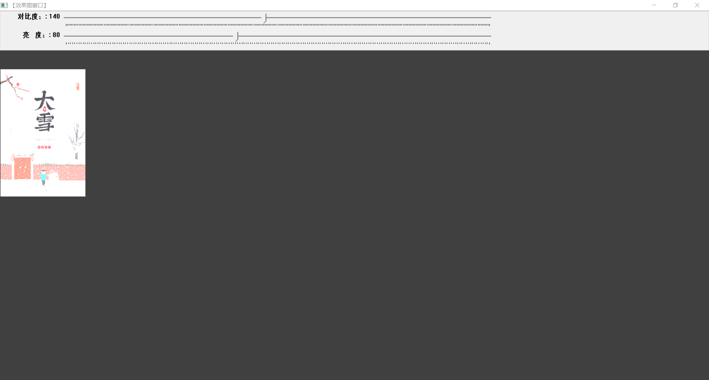

#### 7.离傅里叶变换
```

#include "opencv2/core/core.hpp"
#include "opencv2/imgproc/imgproc.hpp"
#include "opencv2/highgui/highgui.hpp"
#include <iostream>
using namespace cv;


//-----------------------------------【ShowHelpText( )函数】----------------------------------
//		 描述：输出一些帮助信息
//----------------------------------------------------------------------------------------------
void ShowHelpText()
{
	//输出欢迎信息和OpenCV版本
	printf("\n\n\t\t\t非常感谢购买《OpenCV3编程入门》一书！\n");
	printf("\n\n\t\t\t此为本书OpenCV3版的第28个配套示例程序\n");
	printf("\n\n\t\t\t   当前使用的OpenCV版本为：" CV_VERSION );
	printf("\n\n  ----------------------------------------------------------------------------\n");
}


//--------------------------------------【main( )函数】-----------------------------------------
//          描述：控制台应用程序的入口函数，我们的程序从这里开始执行
//-------------------------------------------------------------------------------------------------
int main( )
{

	//【1】以灰度模式读取原始图像并显示
	Mat srcImage = imread("1.jpg", 0);
	if(!srcImage.data ) { printf("读取图片错误，请确定目录下是否有imread函数指定图片存在~！ \n"); return false; } 
	imshow("原始图像" , srcImage);   

	ShowHelpText();

	//【2】将输入图像延扩到最佳的尺寸，边界用0补充
	int m = getOptimalDFTSize( srcImage.rows );
	int n = getOptimalDFTSize( srcImage.cols ); 
	//将添加的像素初始化为0.
	Mat padded;  
	copyMakeBorder(srcImage, padded, 0, m - srcImage.rows, 0, n - srcImage.cols, BORDER_CONSTANT, Scalar::all(0));

	//【3】为傅立叶变换的结果(实部和虚部)分配存储空间。
	//将planes数组组合合并成一个多通道的数组complexI
	Mat planes[] = {Mat_<float>(padded), Mat::zeros(padded.size(), CV_32F)};
	Mat complexI;
	merge(planes, 2, complexI);         

	//【4】进行就地离散傅里叶变换
	dft(complexI, complexI);           

	//【5】将复数转换为幅值，即=> log(1 + sqrt(Re(DFT(I))^2 + Im(DFT(I))^2))
	split(complexI, planes); // 将多通道数组complexI分离成几个单通道数组，planes[0] = Re(DFT(I), planes[1] = Im(DFT(I))
	magnitude(planes[0], planes[1], planes[0]);// planes[0] = magnitude  
	Mat magnitudeImage = planes[0];

	//【6】进行对数尺度(logarithmic scale)缩放
	magnitudeImage += Scalar::all(1);
	log(magnitudeImage, magnitudeImage);//求自然对数

	//【7】剪切和重分布幅度图象限
	//若有奇数行或奇数列，进行频谱裁剪      
	magnitudeImage = magnitudeImage(Rect(0, 0, magnitudeImage.cols & -2, magnitudeImage.rows & -2));
	//重新排列傅立叶图像中的象限，使得原点位于图像中心  
	int cx = magnitudeImage.cols/2;
	int cy = magnitudeImage.rows/2;
	Mat q0(magnitudeImage, Rect(0, 0, cx, cy));   // ROI区域的左上
	Mat q1(magnitudeImage, Rect(cx, 0, cx, cy));  // ROI区域的右上
	Mat q2(magnitudeImage, Rect(0, cy, cx, cy));  // ROI区域的左下
	Mat q3(magnitudeImage, Rect(cx, cy, cx, cy)); // ROI区域的右下
	//交换象限（左上与右下进行交换）
	Mat tmp;                           
	q0.copyTo(tmp);
	q3.copyTo(q0);
	tmp.copyTo(q3);
	//交换象限（右上与左下进行交换）
	q1.copyTo(tmp);                 
	q2.copyTo(q1);
	tmp.copyTo(q2);

	//【8】归一化，用0到1之间的浮点值将矩阵变换为可视的图像格式
	//此句代码的OpenCV2版为：
	//normalize(magnitudeImage, magnitudeImage, 0, 1, CV_MINMAX); 
	//此句代码的OpenCV3版为:
	normalize(magnitudeImage, magnitudeImage, 0, 1, NORM_MINMAX); 

	//【9】显示效果图
	imshow("频谱幅值", magnitudeImage);    
	waitKey();

	return 0;
}

```

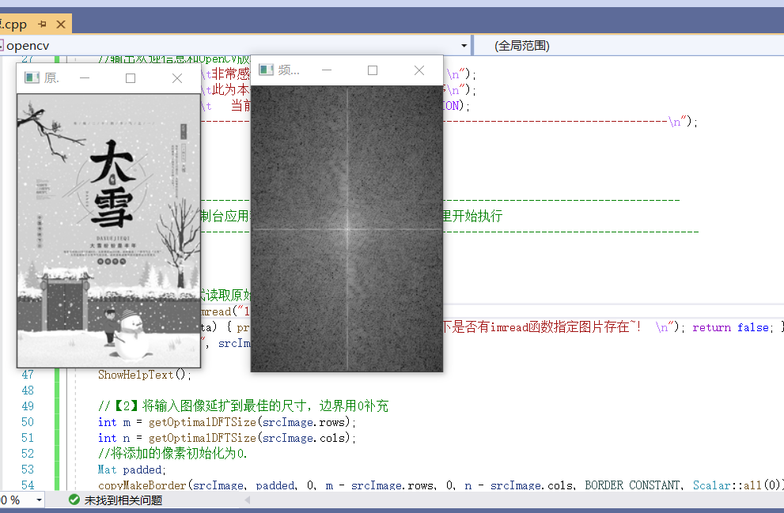
### 笔记部分
1. 按原始图的参数规格来创建创建效果图

MatsrcImage = imread("1.jpg");

Mat dstImage;

dstImage.create(srcImage.rows,srcImage.cols,srcImage.type());//效果图的大小、类型与原图片相同

2.计时函数 getTickCount()和getTickFrequency()

//记录起始时间

doubletime0 = static_cast<double>(getTickCount()); 

//计算运行时间并输出

time0= ((double)getTickCount() - time0)/getTickFrequency();

cout<<"\t此方法运行时间为："<<time0<<"秒"<<endl;  //输出运行时间

3.Mat类的公有成员变量cols和rows给出了图像的宽和高

srcImage.rows

srcImage.cols

4.Mat类的成员函数channels()用于返回图像的通道数；

灰度图的通道数为1，彩色图的通道数为3.

5. Mat类提供ptr函数得到图像任意行的首地址

uchar*data = outputImage.ptr<uchar>(i); //获取第i行的首地址

6.访问图像中的像素P100-114

7. 感兴趣区域（ROI，regionof interest）

两种方法定义ROI：

第一种，用表示矩形区域的Rect，它指定矩形的左上角坐标和矩形的长宽

MatimageROI;

imageROI=image(Rect(500,250,logo.cols,logo.rows));

第二种，指定感兴趣行或者列的范围（Range）,Range是指从起始索引到终止索引（不包括终止索引）的一连段连续序列。

imageROI=image(Range(250,250+logoImage.rows),Range(200,200+logoImage.cols))

8. MatimageROI=image(Rect(500,250,logo.cols,logo.rows));

Matmask=imread("logo.jpg",0);//加载掩膜，必须为灰度图

logoImage.copyTo(imageROI,mask);//将掩膜复制到ROI

 

9. 计算数组加权和：addWeighted()函数 （图像线性混合）

voidaddWeighted(InputArray src1, double alpha, InputArray src2, double beta, doublegamma, OutputArray dst, int dtype=-1);

第一个参数，src1,表示要加权的第一个数组；

第二个参数，alpha，表示第一个数组的权重；

第三个参数，src2,第二个数组，需要和第一个数组有相同的尺寸和通道数；

第四个参数，beta,第二个数组的权重；

第五个参数，gamma,一个加到权重和上的标量值；

第六个参数，dst,输出的数组，和输入的两个数组有相同的尺寸和通道数；

第七个参数，dtype,输出阵列的可选深度，默认值-1.

数学公式表达：

dst =src1[I]*alpha + src2[I]*beta + gamma;

10. 通道分离：split()函数

将一个多通道数组分离成几个单通道数组

voidsplit(const Mat&src, Mat*mvbegin);

或者 voidsplit(InputArray m, OutputArrayOfArrays mv);

第一个参数，m或者src，填需要进行分离的多通道数组；

第二个参数，mv，填输出数组或者输出的vector容器

eg.

vector<Mat>channels;

MatimageBlueChannel;

MatimageGreenChannel;

MatimageRedChannel;

srcImage4=imread("dota.jpg");

split(srcImage4,channels);//分离彩色通道，将3通道图像转成3个单通道图像；

imageBlueChannel=channels.at(0);

imageGreenChannel=channels.at(1);

imageRedChannel=channels.at(2);

11. 通道合并：merge()函数，是split()函数的逆向操作

将多个数组合并成一个多通道的数组

voidmerge(InputArrayOfArrays mv,OuoputArray dst);

eg.接着上面

merge(channels,mergeImage);

 

12. 创建0矩阵的图像

g_srcImage= imread( "1.jpg");

g_dstImage= Mat::zeros( g_srcImage.size(), g_srcImage.type() );

13. 一般的图像处理算子都是一个函数，它接受一个或多个输入图像，并产生输出图像

14.g(i,j)=a*f(i,j)+b;

a称为增益（gain），对比度

b称为偏置（bias），亮度

15. 访问图像的每一个像素，使用这样的语法image.at<Vec3b>(y,x)[c]

y是像素所在的行，x是像素坐在的列，c是B,G,R(对应0，1，2)其中之一；

eg.
```
// 三个for循环，执行运算 g_dstImage(i,j) = a*g_srcImage(i,j)+ b

         for(inty = 0; y < g_srcImage.rows; y++ )

         {
                   for(intx = 0; x < g_srcImage.cols; x++ )

                   {
                            for(intc = 0; c < 3; c++ )

                            {
                                     g_dstImage.at<Vec3b>(y,x)[c] = saturate_cast<uchar>((g_nContrastValue*0.01)*( g_srcImage.at<Vec3b>(y,x)[c]) + g_nBrightValue );

                            }

                   }

         }
```

★运算结果可能会超出像素取值范围（溢出），还可能是非整数（如果是浮点数的话），所以用saturate_cast对结果进行转换，确保它为有效值。

16. //输出一些帮助信息

         cout<<endl<<"\t运行成功，请调整滚动条观察图像效果\n\n"

                   <<"\t按下“q”键时，程序退出\n";

         //按下“q”键时，程序退出

         while(char(waitKey(1))!= 'q') {}


17. Mat srcImage = imread("1.jpg",0); //【1】以灰度模式读取原始图像并显示

18. 离散傅立叶变换DFT  P135

19.getOptimalDFTSize 返回给定向量尺寸的傅立叶最优尺寸大小

20.copyMakeBorder 扩充图像边界

21.magnitude 计算二维矢量的幅值

22.log 计算每个数组元素绝对值的自然对数

23.normalize 进行矩阵归一化