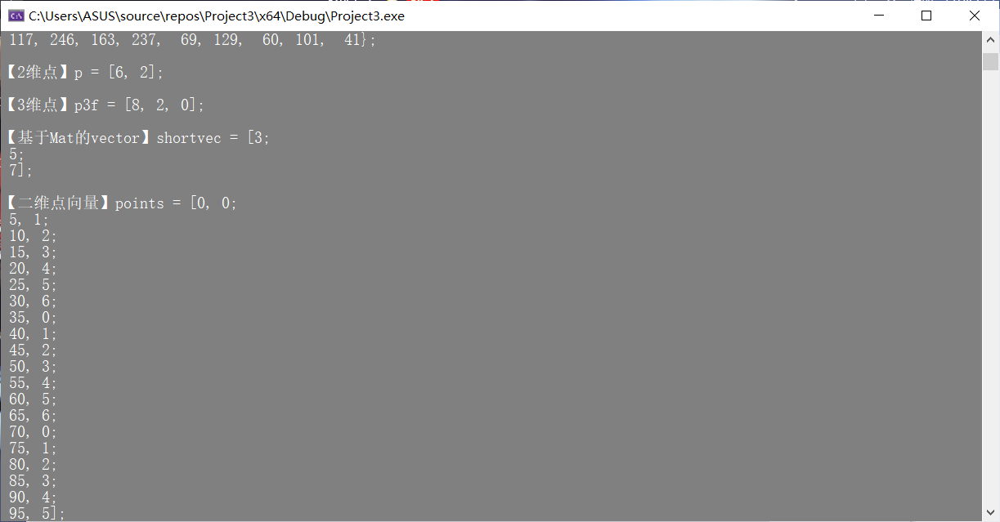
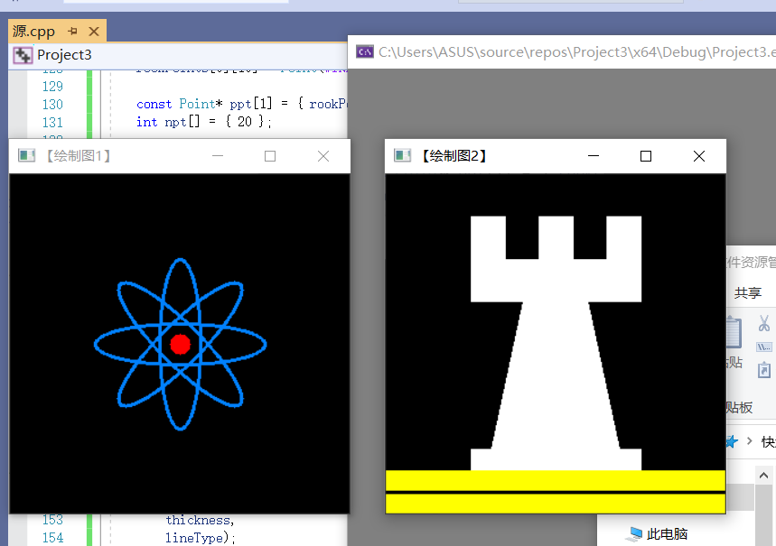
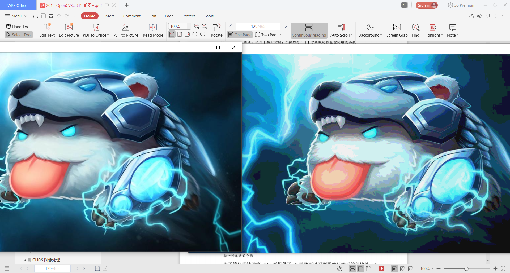
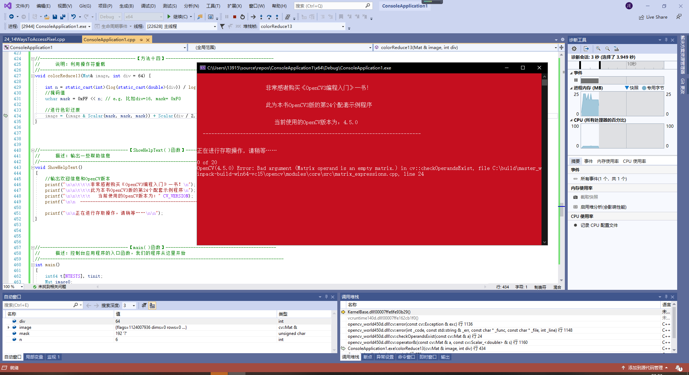
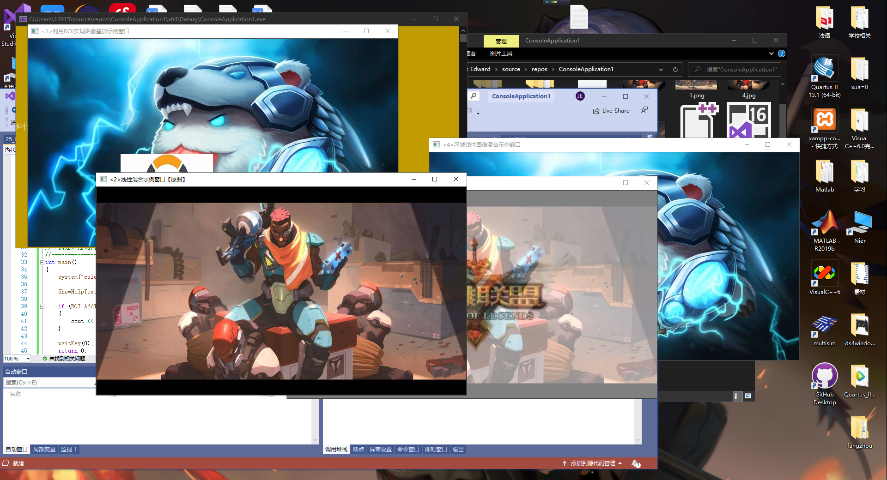
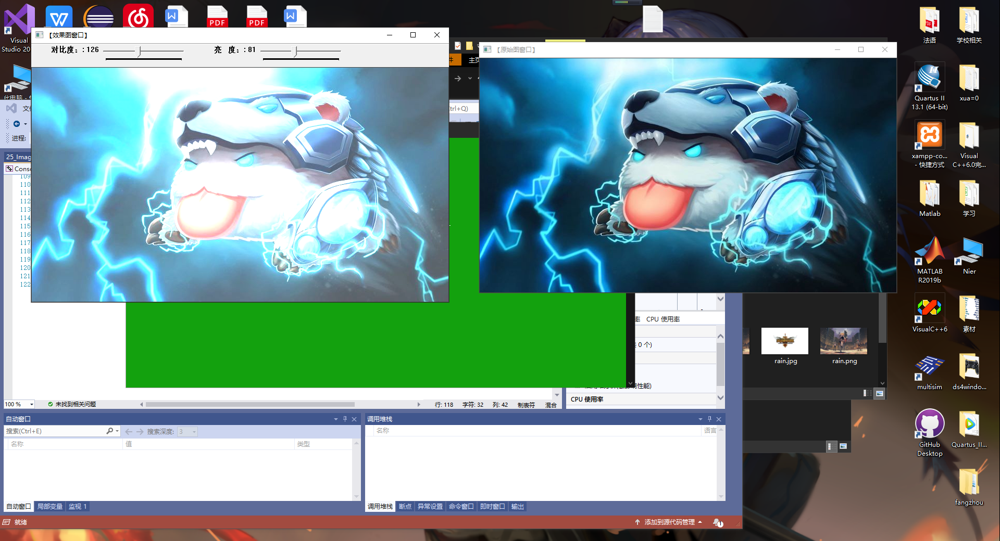
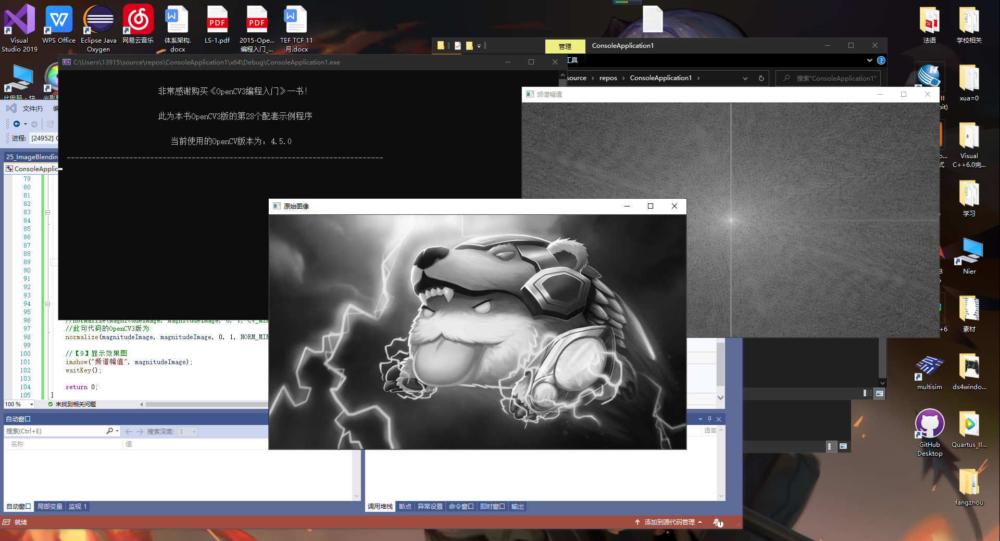
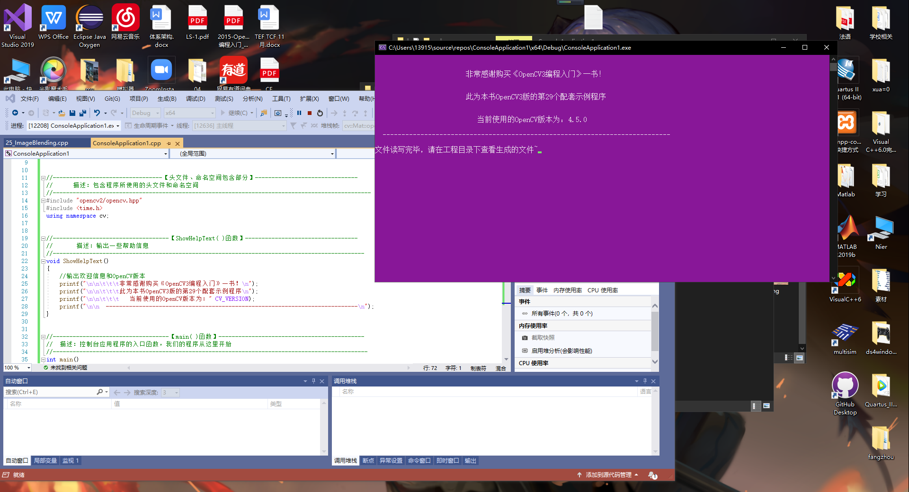
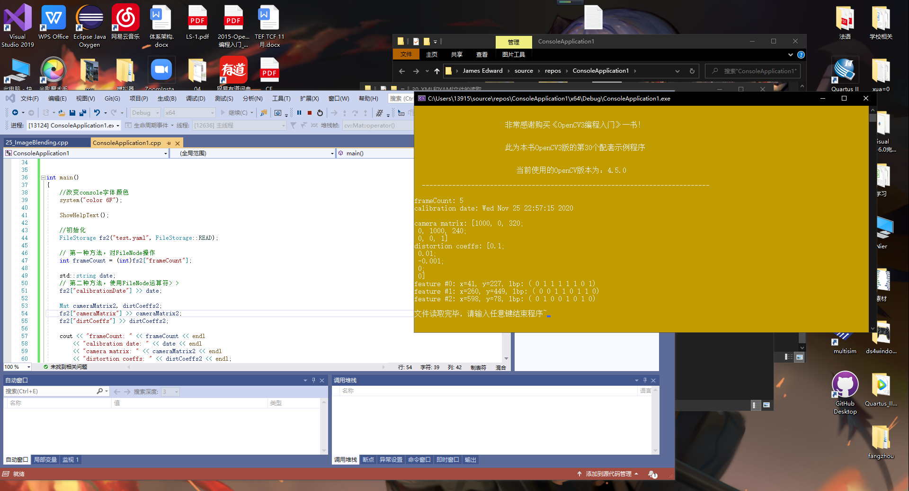

# 第二次作业 CH04-05

## 作业要求

1. 学习OpenCV第4章到第5章的内容：主要记录笔记，特别是对代码和理论的掌握和理解；
2. 主体内容上要求包含：

   （1）软件安装，
   
   （2）代码测试、分析和理解（可以在源代码中用“//”注释的方式来展示分析和理解过程），
   
   （3）结果分析和总结，
   
   （4）代码修改
   
3. 要求图文并茂，图片应尽量与书本有所区别；
4. 完成时间：下一次课程上课前，替其他同学提交的判定无效，所有人成绩为0。

### 基础图像容器Mat类的使用

代码如下：

``` C++
//---------------------------------【头文件、命名空间包含部分】---------------------------
//          描述：包含程序所使用的头文件和命名空间
//-----------------------------------------------------------------------------------------------
#include "opencv2/core/core.hpp"
#include "opencv2/highgui/highgui.hpp"
#include <iostream>
using namespace std;
using namespace cv;


//-----------------------------【ShowHelpText( )函数】--------------------------------------
//		描述：输出帮助信息
//-------------------------------------------------------------------------------------------------
static void ShowHelpText()
{
	//输出欢迎信息和OpenCV版本
	printf("\n\n\t\t\t非常感谢购买《OpenCV3编程入门》一书！\n");
	printf("\n\n\t\t\t此为本书OpenCV3版的第19个配套示例程序\n");
	printf("\n\n\t\t\t   当前使用的OpenCV版本为：" CV_VERSION);
	printf("\n\n  ----------------------------------------------------------------------------\n");

	//输出一些帮助信息
	printf("\n\n\n\t欢迎来到【基本图像容器-Mat类】示例程序~\n\n");
	printf("\n\n\t程序说明：\n\n\t此示例程序用于演示Mat类的格式化输出功能，输出风格可为：");
	printf("\n\n\n\t【1】OpenCV默认风格");
	printf("\n\n\t【2】Python风格");
	printf("\n\n\t【3】逗号分隔风格");
	printf("\n\n\t【4】Numpy风格");
	printf("\n\n\t【5】C语言风格\n\n");
	printf("\n  --------------------------------------------------------------------------\n");


}


//--------------------------------------【main( )函数】-----------------------------------------
//          描述：控制台应用程序的入口函数，我们的程序从这里开始执行
//-----------------------------------------------------------------------------------------------
int main(int, char**)
{
	//改变控制台的前景色和背景色
	system("color 8F");

	//显示帮助文字
	ShowHelpText();

	Mat I = Mat::eye(4, 4, CV_64F);
	I.at<double>(1, 1) = CV_PI;
	cout << "\nI = " << I << ";\n" << endl;

	Mat r = Mat(10, 3, CV_8UC3);
	randu(r, Scalar::all(0), Scalar::all(255));

	//此段代码的OpenCV2版为：
	//cout << "r (OpenCV默认风格) = " << r << ";" << endl << endl;
	//cout << "r (Python风格) = " << format(r,"python") << ";" << endl << endl;
	//cout << "r (Numpy风格) = " << format(r,"numpy") << ";" << endl << endl;
	//cout << "r (逗号分隔风格) = " << format(r,"csv") << ";" << endl<< endl;
	//cout << "r (C语言风格) = " << format(r,"C") << ";" << endl << endl;
	//此段代码的OpenCV3版为：
	cout << "r (OpenCV默认风格) = " << r << ";" << endl << endl;
	cout << "r (Python风格) = " << format(r, Formatter::FMT_PYTHON) << ";" << endl << endl;
	cout << "r (Numpy风格) = " << format(r, Formatter::FMT_NUMPY) << ";" << endl << endl;
	cout << "r (逗号分隔风格) = " << format(r, Formatter::FMT_CSV) << ";" << endl << endl;
	cout << "r (C语言风格) = " << format(r, Formatter::FMT_C) << ";" << endl << endl;


	Point2f p(6, 2);
	cout << "【2维点】p = " << p << ";\n" << endl;

	Point3f p3f(8, 2, 0);
	cout << "【3维点】p3f = " << p3f << ";\n" << endl;

	vector<float> v;
	v.push_back(3);
	v.push_back(5);
	v.push_back(7);

	cout << "【基于Mat的vector】shortvec = " << Mat(v) << ";\n" << endl;

	vector<Point2f> points(20);
	for (size_t i = 0; i < points.size(); ++i)
		points[i] = Point2f((float)(i * 5), (float)(i % 7));

	cout << "【二维点向量】points = " << points << ";";

	getchar();//按任意键退出

	return 0;


}
```

运行结果如下：



### opencv基础图像绘制


基本图像绘制涉及到的绘制函数如下：

- 用于绘制直线的line函数
- 用于绘制椭圆的ellipse函数
- 用于绘制矩形的rectangle函数
- 用于绘制圆的circle函数
- 用于绘制填充的多变形的fillPoly函数


``` C++
#include <opencv2/core/core.hpp>
#include <opencv2/highgui/highgui.hpp>
#include <opencv2/imgproc/imgproc.hpp>
using namespace cv;


#define WINDOW_NAME1 "【绘制图1】"        //为窗口标题定义的宏 
#define WINDOW_NAME2 "【绘制图2】"        //为窗口标题定义的宏 
#define WINDOW_WIDTH 300//定义窗口大小的宏

void DrawEllipse(Mat img, double angle);//绘制椭圆
void DrawFilledCircle(Mat img, Point center);//绘制圆
void DrawPolygon(Mat img);//绘制多边形
void DrawLine(Mat img, Point start, Point end);//绘制线段

int main(void)
{

    // 创建空白的Mat图像
    Mat atomImage = Mat::zeros(WINDOW_WIDTH, WINDOW_WIDTH, CV_8UC3);
    Mat rookImage = Mat::zeros(WINDOW_WIDTH, WINDOW_WIDTH, CV_8UC3);

    // ---------------------<1>绘制化学中的原子示例图------------------------

    //【1.1】先绘制出椭圆
    DrawEllipse(atomImage, 90);
    DrawEllipse(atomImage, 0);
    DrawEllipse(atomImage, 45);
    DrawEllipse(atomImage, -45);

    //【1.2】再绘制圆心
    DrawFilledCircle(atomImage, Point(WINDOW_WIDTH / 2, WINDOW_WIDTH / 2));

    // ----------------------------<2>绘制组合图-----------------------------
    //【2.1】先绘制出椭圆
    DrawPolygon(rookImage);

    // 【2.2】绘制矩形
    rectangle(rookImage,
        Point(0, 7 * WINDOW_WIDTH / 8),
        Point(WINDOW_WIDTH, WINDOW_WIDTH),
        Scalar(0, 255, 255),
        -1,
        8);

    // 【2.3】绘制线段
    DrawLine(rookImage, Point(0, 15 * WINDOW_WIDTH / 16), Point(WINDOW_WIDTH, 15 * WINDOW_WIDTH / 16));

    // ---------------------------<3>显示绘制出的图像------------------------
    imshow(WINDOW_NAME1, atomImage);
    moveWindow(WINDOW_NAME1, 0, 200);
    imshow(WINDOW_NAME2, rookImage);
    moveWindow(WINDOW_NAME2, WINDOW_WIDTH, 200);

    waitKey(0);
    return(0);
}


//-------------------------------【DrawEllipse( )函数】--------------------------------
//		描述：自定义的绘制函数，实现了绘制不同角度、相同尺寸的椭圆
//-----------------------------------------------------------------------------------------
void DrawEllipse(Mat img, double angle)
{
    int thickness = 2;
    int lineType = 8;


    ellipse(img,
        Point(WINDOW_WIDTH / 2, WINDOW_WIDTH / 2), // 椭圆中心点
        Size(WINDOW_WIDTH / 4, WINDOW_WIDTH / 16), //大小
        angle,                                   // 旋转角度 angle
        0,
        360,                                     // 扩展弧度[0, 360]
        Scalar(255, 129, 0),                   // 颜色：蓝色
        thickness,                               // 线宽
        lineType);                              // 线型
}


//-----------------------------------【DrawFilledCircle( )函数】---------------------------
//		描述：自定义的绘制函数，实现了实心圆的绘制
//-----------------------------------------------------------------------------------------
void DrawFilledCircle(Mat img, Point center)
{
    int thickness = -1;
    int lineType = 8;

    circle(img,
        center,                                      // 圆心
        WINDOW_WIDTH / 32,                             // 半径
        Scalar(0, 0, 255),                         // 颜色：红色
        thickness,                                   // 线宽-1，因此是实心圆
        lineType);
}


//-----------------------------------【DrawPolygon( )函数】--------------------------
//		描述：自定义的绘制函数，实现了凹多边形的绘制
//--------------------------------------------------------------------------------------
void DrawPolygon(Mat img)
{
    int lineType = 8;

    //创建一些点
    Point rookPoints[1][20];
    rookPoints[0][0] = Point(WINDOW_WIDTH / 4, 7 * WINDOW_WIDTH / 8);
    rookPoints[0][1] = Point(3 * WINDOW_WIDTH / 4, 7 * WINDOW_WIDTH / 8);
    rookPoints[0][2] = Point(3 * WINDOW_WIDTH / 4, 13 * WINDOW_WIDTH / 16);
    rookPoints[0][3] = Point(11 * WINDOW_WIDTH / 16, 13 * WINDOW_WIDTH / 16);
    rookPoints[0][4] = Point(19 * WINDOW_WIDTH / 32, 3 * WINDOW_WIDTH / 8);
    rookPoints[0][5] = Point(3 * WINDOW_WIDTH / 4, 3 * WINDOW_WIDTH / 8);
    rookPoints[0][6] = Point(3 * WINDOW_WIDTH / 4, WINDOW_WIDTH / 8);
    rookPoints[0][7] = Point(26 * WINDOW_WIDTH / 40, WINDOW_WIDTH / 8);
    rookPoints[0][8] = Point(26 * WINDOW_WIDTH / 40, WINDOW_WIDTH / 4);
    rookPoints[0][9] = Point(22 * WINDOW_WIDTH / 40, WINDOW_WIDTH / 4);
    rookPoints[0][10] = Point(22 * WINDOW_WIDTH / 40, WINDOW_WIDTH / 8);
    rookPoints[0][11] = Point(18 * WINDOW_WIDTH / 40, WINDOW_WIDTH / 8);
    rookPoints[0][12] = Point(18 * WINDOW_WIDTH / 40, WINDOW_WIDTH / 4);
    rookPoints[0][13] = Point(14 * WINDOW_WIDTH / 40, WINDOW_WIDTH / 4);
    rookPoints[0][14] = Point(14 * WINDOW_WIDTH / 40, WINDOW_WIDTH / 8);
    rookPoints[0][15] = Point(WINDOW_WIDTH / 4, WINDOW_WIDTH / 8);
    rookPoints[0][16] = Point(WINDOW_WIDTH / 4, 3 * WINDOW_WIDTH / 8);
    rookPoints[0][17] = Point(13 * WINDOW_WIDTH / 32, 3 * WINDOW_WIDTH / 8);
    rookPoints[0][18] = Point(5 * WINDOW_WIDTH / 16, 13 * WINDOW_WIDTH / 16);
    rookPoints[0][19] = Point(WINDOW_WIDTH / 4, 13 * WINDOW_WIDTH / 16);

    const Point* ppt[1] = { rookPoints[0] };
    int npt[] = { 20 };

    fillPoly(img,
        ppt,                          // 多边形的顶点集
        npt,                          // 多边形顶点数目
        1,
        Scalar(255, 255, 255),      // 颜色：白色
        lineType);
}


//-----------------------------------【DrawLine( )函数】--------------------------
//		描述：自定义的绘制函数，实现了线的绘制
//---------------------------------------------------------------------------------
void DrawLine(Mat img, Point start, Point end)
{
    int thickness = 2;
    int lineType = 8;
    line(img,
        start,
        end,
        Scalar(0, 0, 0),
        thickness,
        lineType);
}
```


``` C++
Mat srcImage = Mat(7, 15, CV_8UC1,Scalar::all(0));
	cout << "srcImage = " << endl << srcImage << endl;
	namedWindow("原图",WINDOW_NORMAL);
	imshow("原图", srcImage);
 
	for (int i = 0; i < srcImage.rows; i++)
	{
		for (int j = 0; j < srcImage.cols; j++)
		{
			if (i==1 || i==5)
			{
				if ((j >= 1 && j <= 4) || (j >= 10 && j <= 13))
				{
					srcImage.ptr<uchar>(i)[j] = 255;
				}
			}
			else if (i == 2 || i== 3 || i==4)
			{
				if (j>=1 && j<=13)
				{
					srcImage.ptr<uchar>(i)[j] = 255;
				}
			}
		}
	}
 
	cout << "srcImage = " << endl << srcImage << endl;
	namedWindow("修改图", WINDOW_NORMAL);
	imshow("修改图", srcImage);

```


### 访问图像中的像素

1. 用Mat.data获取到的指针类型默认为uchar*型的，而与矩阵中元素的数据类型无关。使用时要注意指针类型的转化。

2. 灰度图Mat矩阵中的元素多数是uchar(CV_8UC1)型的，有时需要访问其中的单个元素(像素值)并用"cout<<"输出。需要注意的是，用"cout<<"输出char/uchar型数据时，输出的并不是数字数据，而是数字对应的ASCII码字符，若对应的字符不可打印，则显示输出为空。若要求输出数字数据，可使用类型强制转换后输出(如：cout<<(int)num<<endl;)。

3. Mat的各行数据在内存中都是连续存储的，但行与行之间的地址不一定连续。因此需要用哪行的数据，就最好先获得对应行的首地址(uchar* p = image.ptr<uchar>(i),获取第i行首地址)。

4. 用imshow()显示Mat矩阵存储的图像信息时，若元素的数据类型是uchar(CV_8UC1)的，就默认有256(2的8次方)个灰度级；若元素的数据类型是用int(CV_32SC1)的，就默认有2147483647 (2的32次方)个灰度级。普通灰度图的灰度值都在0-255之间，在CV_8UC1下能够正常显示。要是将其数据类型转化为CV_32SC1的，0-255的灰度值在2147483647的尺度下就显得范围过窄且无限靠近于0，用imshow()显示时显示窗口就会一片黑暗。

- 颜色空间缩减：将现有颜色空间值除以某个输入值，以获得较少的颜色数。

- 访问图像中像素的三类方法：

  1.指针访问：C操作符[];

  2.迭代器 iterator;

  3.动态地址计算

#### 方法一：用指针访问像素

``` C++
#include <opencv2/core/core.hpp>
#include <opencv2/highgui/highgui.hpp>
#include <iostream>
using namespace std;
using namespace cv;
//---------------【全局函数声明部分】---------------
// 描述：全局函数声明 
//-----------------------------------------------
void colorReduce(Mat& inputImage, Mat& outputImage, int div);
//----------------【main()函数】----------------------
// 描述：控制台应用程序的入口函数，我们的程序从这里开始
//---------------------------------------------------
int main()
{
	// 创建原始图并显示
	Mat srcImage = imread("timg.jpg");
	imshow("原始图像", srcImage);
	// 按原始图的参数规格来创建效果图
	Mat dstImage;
	dstImage.create(srcImage.rows, srcImage.cols, srcImage.type());
	// 记录起始时间
	double time0 = static_cast<double>(getTickCount());
	// 调用颜色空间缩减函数
	colorReduce(srcImage, dstImage, 32);
	//计算运行时间并输出
	time0 = ((double)getTickCount() - time0) / getTickFrequency();
	cout << "此方法运行时间为: " << time0 << "秒" << endl;
	//显示效果图
	imshow("效果图", dstImage);
	waitKey(0);
	return 0;
}
//方法1_用指针访问像素
void colorReduce(Mat& inputImage, Mat& outputImage, int div)
{
	outputImage = inputImage.clone(); //复制实参到临时变量
	int rowNumber = outputImage.rows;
	int colNumber = outputImage.cols * outputImage.channels(); // 列数 × 通道 = 每一行元素的个数  （每行的像素值）
	for (int i = 0; i < rowNumber; i++)
	{
		uchar* data = outputImage.ptr<uchar>(i); //获取第i行的首地址
		for (int j = 0; j < colNumber; j++)
		{
			data[j] = data[j] / div * div + div / 2;

			//*data++=*data/div*div+div/2; 与上式等价，用指针运算
		}
	}
}
```

#### 方法二_用迭代器操作像素

``` C++
void colorReduce(Mat & inputImage, Mat & outputImage, int div)
{
outputImage = inputImage.clone(); //复制实参到临时变量
Mat_<Vec3b>::iterator it = outputImage.begin<Vec3b>(); // 初始位置的迭代器
Mat_<Vec3b>::iterator itend = outputImage.end<Vec3b>(); //z终止位置的迭代器
//存取彩色图像像素
for (; it != itend; ++it)
{
(*it)[0] = (*it)[0] / div*div + div / 2;
(*it)[1] = (*it)[1] / div*div + div / 2;
(*it)[2] = (*it)[2] / div*div + div / 2;
}
}
```

#### 方法三_动态地址计算

```C++
void colorReduce(Mat & inputImage, Mat & outputImage, int div)
{
outputImage = inputImage.clone(); //复制实参到临时变量
int rowNumber = outputImage.rows; //列数
int colNumber = outputImage.cols; //行数
for (int i = 0; i < rowNumber; i++)
{
for (int j = 0; j < colNumber; j++)
{
outputImage.at<Vec3b>(i, j)[0] = outputImage.at<Vec3b>(i, j)[0] / div*div + div / 2;
outputImage.at<Vec3b>(i, j)[1] = outputImage.at<Vec3b>(i, j)[1] / div*div + div / 2;
outputImage.at<Vec3b>(i, j)[2] = outputImage.at<Vec3b>(i, j)[2] / div*div + div / 2;
}
}
}
```



#### 遍历图像中像素的14种方法

```C++
//--------------------------------------【程序说明】-------------------------------------------
//		程序说明：《OpenCV3编程入门》OpenCV2版书本配套示例程序24
//		程序描述：来自一本国外OpenCV2书籍的示例-遍历图像像素的14种方法
//		测试所用IDE版本：Visual Studio 2010
//		开发测试所用OpenCV版本：	3.0 beta
//		2014年12月 Revised by @浅墨_毛星云
//------------------------------------------------------------------------------------------------


/*------------------------------------------------------------------------------------------*\
   This file contains material supporting chapter 2 of the cookbook:  
   Computer Vision Programming using the OpenCV Library. 
   by Robert Laganiere, Packt Publishing, 2011.

   This program is free software; permission is hereby granted to use, copy, modify, 
   and distribute this source code, or portions thereof, for any purpose, without fee, 
   subject to the restriction that the copyright notice may not be removed 
   or altered from any source or altered source distribution. 
   The software is released on an as-is basis and without any warranties of any kind. 
   In particular, the software is not guaranteed to be fault-tolerant or free from failure. 
   The author disclaims all warranties with regard to this software, any use, 
   and any consequent failure, is purely the responsibility of the user.
 
   Copyright (C) 2010-2011 Robert Laganiere, www.laganiere.name
\*------------------------------------------------------------------------------------------*/


//---------------------------------【头文件、命名空间包含部分】-----------------------------
//		描述：包含程序所使用的头文件和命名空间
//-------------------------------------------------------------------------------------------------
#include <iostream>
#include <opencv2/core/core.hpp>
#include <opencv2/highgui/highgui.hpp>
using namespace cv;
using namespace std;


//---------------------------------【宏定义部分】---------------------------------------------
//		描述：包含程序所使用宏定义
//-------------------------------------------------------------------------------------------------
#define NTESTS 14
#define NITERATIONS 20


//----------------------------------------- 【方法一】-------------------------------------------
//		说明：利用.ptr 和 []
//-------------------------------------------------------------------------------------------------
void colorReduce0(Mat &image, int div=64) {

	  int nl= image.rows; //行数
	  int nc= image.cols * image.channels(); //每行元素的总元素数量
              
      for (int j=0; j<nl; j++) 
	  {

		  uchar* data= image.ptr<uchar>(j);

          for (int i=0; i<nc; i++) 
		  {
 
            //-------------开始处理每个像素-------------------
                 
                  data[i]= data[i]/div*div + div/2;
 
            //-------------结束像素处理------------------------
 
            } //单行处理结束                  
      }
}

//-----------------------------------【方法二】-------------------------------------------------
//		说明：利用 .ptr 和 * ++ 
//-------------------------------------------------------------------------------------------------
void colorReduce1(Mat &image, int div=64) {

	  int nl= image.rows; //行数
	  int nc= image.cols * image.channels(); //每行元素的总元素数量
              
      for (int j=0; j<nl; j++) 
	  {

		  uchar* data= image.ptr<uchar>(j);

          for (int i=0; i<nc; i++) 
		  {
 
            //-------------开始处理每个像素-------------------
                 
				 *data++= *data/div*div + div/2;
 
            //-------------结束像素处理------------------------
 
            } //单行处理结束              
      }
}

//-----------------------------------------【方法三】-------------------------------------------
//		说明：利用.ptr 和 * ++ 以及模操作
//-------------------------------------------------------------------------------------------------
void colorReduce2(Mat &image, int div=64) {

	  int nl= image.rows; //行数
	  int nc= image.cols * image.channels(); //每行元素的总元素数量
              
      for (int j=0; j<nl; j++) 
	  {

		  uchar* data= image.ptr<uchar>(j);

          for (int i=0; i<nc; i++) 
		  {
 
            //-------------开始处理每个像素-------------------
       
			      int v= *data;
                  *data++= v - v%div + div/2;
 
            //-------------结束像素处理------------------------
 
            } //单行处理结束                   
      }
}

//----------------------------------------【方法四】---------------------------------------------
//		说明：利用.ptr 和 * ++ 以及位操作
//----------------------------------------------------------------------------------------------------
void colorReduce3(Mat &image, int div=64) {

	  int nl= image.rows; //行数
	  int nc= image.cols * image.channels(); //每行元素的总元素数量
	  int n= static_cast<int>(log(static_cast<double>(div))/log(2.0));
	  //掩码值
	  uchar mask= 0xFF<<n; // e.g. 对于 div=16, mask= 0xF0
              
      for (int j=0; j<nl; j++) {

		  uchar* data= image.ptr<uchar>(j);

          for (int i=0; i<nc; i++) {
 
            //------------开始处理每个像素-------------------
                 
            *data++= *data&mask + div/2;
 
            //-------------结束像素处理------------------------
            }  //单行处理结束            
      }
}


//----------------------------------------【方法五】----------------------------------------------
//		说明：利用指针算术运算
//---------------------------------------------------------------------------------------------------
void colorReduce4(Mat &image, int div=64) {

	  int nl= image.rows; //行数
	  int nc= image.cols * image.channels(); //每行元素的总元素数量
	  int n= static_cast<int>(log(static_cast<double>(div))/log(2.0));
	  int step= image.step; //有效宽度
	  //掩码值
	  uchar mask= 0xFF<<n; // e.g. 对于 div=16, mask= 0xF0
              
      //获取指向图像缓冲区的指针
	  uchar *data= image.data;

      for (int j=0; j<nl; j++)
	  {

          for (int i=0; i<nc; i++) 
		  {
 
            //-------------开始处理每个像素-------------------
                 
            *(data+i)= *data&mask + div/2;
 
            //-------------结束像素处理------------------------
 
            } //单行处理结束              

            data+= step;  // next line
      }
}

//---------------------------------------【方法六】----------------------------------------------
//		说明：利用 .ptr 和 * ++以及位运算、image.cols * image.channels()
//-------------------------------------------------------------------------------------------------
void colorReduce5(Mat &image, int div=64) {

	  int nl= image.rows; //行数
	  int n= static_cast<int>(log(static_cast<double>(div))/log(2.0));
	  //掩码值
	  uchar mask= 0xFF<<n; // e.g. 例如div=16, mask= 0xF0
              
      for (int j=0; j<nl; j++) 
	  {

		  uchar* data= image.ptr<uchar>(j);

          for (int i=0; i<image.cols * image.channels(); i++) 
		  {
 
            //-------------开始处理每个像素-------------------
                 
            *data++= *data&mask + div/2;
 
            //-------------结束像素处理------------------------
 
            } //单行处理结束            
      }
}

// -------------------------------------【方法七】----------------------------------------------
//		说明：利用.ptr 和 * ++ 以及位运算(continuous)
//-------------------------------------------------------------------------------------------------
void colorReduce6(Mat &image, int div=64) {

	  int nl= image.rows; //行数
	  int nc= image.cols * image.channels(); //每行元素的总元素数量

	  if (image.isContinuous())  
	  {
		  //无填充像素
		  nc= nc*nl; 
		  nl= 1;  // 为一维数列
	   }

	  int n= static_cast<int>(log(static_cast<double>(div))/log(2.0));
	  //掩码值
	  uchar mask= 0xFF<<n; // e.g. 比如div=16, mask= 0xF0
              
      for (int j=0; j<nl; j++) {

		  uchar* data= image.ptr<uchar>(j);

          for (int i=0; i<nc; i++) {
 
            //-------------开始处理每个像素-------------------
                 
            *data++= *data&mask + div/2;
 
            //-------------结束像素处理------------------------
 
            } //单行处理结束                   
      }
}

//------------------------------------【方法八】------------------------------------------------
//		说明：利用 .ptr 和 * ++ 以及位运算 (continuous+channels)
//-------------------------------------------------------------------------------------------------
void colorReduce7(Mat &image, int div=64) {

	  int nl= image.rows; //行数
	  int nc= image.cols ; //列数

	  if (image.isContinuous())  
	  {
		  //无填充像素
		  nc= nc*nl; 
		  nl= 1;  // 为一维数组
	   }

	  int n= static_cast<int>(log(static_cast<double>(div))/log(2.0));
	  //掩码值
	  uchar mask= 0xFF<<n; // e.g. 比如div=16, mask= 0xF0
              
      for (int j=0; j<nl; j++) {

		  uchar* data= image.ptr<uchar>(j);

          for (int i=0; i<nc; i++) {
 
            //-------------开始处理每个像素-------------------
                 
            *data++= *data&mask + div/2;
            *data++= *data&mask + div/2;
            *data++= *data&mask + div/2;
 
            //-------------结束像素处理------------------------
 
            } //单行处理结束                    
      }
}


// -----------------------------------【方法九】 ------------------------------------------------
//		说明：利用Mat_ iterator
//-------------------------------------------------------------------------------------------------
void colorReduce8(Mat &image, int div=64) {

	  //获取迭代器
	  Mat_<Vec3b>::iterator it= image.begin<Vec3b>();
	  Mat_<Vec3b>::iterator itend= image.end<Vec3b>();

	  for ( ; it!= itend; ++it) {
        
		//-------------开始处理每个像素-------------------

        (*it)[0]= (*it)[0]/div*div + div/2;
        (*it)[1]= (*it)[1]/div*div + div/2;
        (*it)[2]= (*it)[2]/div*div + div/2;

        //-------------结束像素处理------------------------
	  }//单行处理结束  
}

//-------------------------------------【方法十】-----------------------------------------------
//		说明：利用Mat_ iterator以及位运算
//-------------------------------------------------------------------------------------------------
void colorReduce9(Mat &image, int div=64) {

	  // div必须是2的幂
	  int n= static_cast<int>(log(static_cast<double>(div))/log(2.0));
	  //掩码值
	  uchar mask= 0xFF<<n; // e.g. 比如 div=16, mask= 0xF0

	  // 获取迭代器
	  Mat_<Vec3b>::iterator it= image.begin<Vec3b>();
	  Mat_<Vec3b>::iterator itend= image.end<Vec3b>();

	  //扫描所有元素
	  for ( ; it!= itend; ++it) 
	  {
        
		//-------------开始处理每个像素-------------------

        (*it)[0]= (*it)[0]&mask + div/2;
        (*it)[1]= (*it)[1]&mask + div/2;
        (*it)[2]= (*it)[2]&mask + div/2;

        //-------------结束像素处理------------------------
	  }//单行处理结束  
}

//------------------------------------【方法十一】---------------------------------------------
//		说明：利用Mat Iterator_
//-------------------------------------------------------------------------------------------------
void colorReduce10(Mat &image, int div=64) {

	  //获取迭代器
	  Mat_<Vec3b> cimage= image;
	  Mat_<Vec3b>::iterator it=cimage.begin();
	  Mat_<Vec3b>::iterator itend=cimage.end();

	  for ( ; it!= itend; it++) { 
        
		//-------------开始处理每个像素-------------------

        (*it)[0]= (*it)[0]/div*div + div/2;
        (*it)[1]= (*it)[1]/div*div + div/2;
        (*it)[2]= (*it)[2]/div*div + div/2;

        //-------------结束像素处理------------------------
	  }
}

//--------------------------------------【方法十二】--------------------------------------------
//		说明：利用动态地址计算配合at
//-------------------------------------------------------------------------------------------------
void colorReduce11(Mat &image, int div=64) {

	  int nl= image.rows; //行数
	  int nc= image.cols; //列数
              
      for (int j=0; j<nl; j++) 
	  {
          for (int i=0; i<nc; i++) 
		  {
 
            //-------------开始处理每个像素-------------------
                 
                  image.at<Vec3b>(j,i)[0]=	 image.at<Vec3b>(j,i)[0]/div*div + div/2;
                  image.at<Vec3b>(j,i)[1]=	 image.at<Vec3b>(j,i)[1]/div*div + div/2;
                  image.at<Vec3b>(j,i)[2]=	 image.at<Vec3b>(j,i)[2]/div*div + div/2;
 
            //-------------结束像素处理------------------------
 
            } //单行处理结束                 
      }
}

//----------------------------------【方法十三】----------------------------------------------- 
//		说明：利用图像的输入与输出
//-------------------------------------------------------------------------------------------------
void colorReduce12(const Mat &image, //输入图像
                 Mat &result,      // 输出图像
                 int div=64) {

	  int nl= image.rows; //行数
	  int nc= image.cols ; //列数

	  //准备好初始化后的Mat给输出图像
	  result.create(image.rows,image.cols,image.type());

	  //创建无像素填充的图像
	  nc= nc*nl; 
	  nl= 1;  //单维数组

	  int n= static_cast<int>(log(static_cast<double>(div))/log(2.0));
	  //掩码值
	  uchar mask= 0xFF<<n; // e.g.比如div=16, mask= 0xF0
              
      for (int j=0; j<nl; j++) {

		  uchar* data= result.ptr<uchar>(j);
		  const uchar* idata= image.ptr<uchar>(j);

          for (int i=0; i<nc; i++) {
 
            //-------------开始处理每个像素-------------------
                 
            *data++= (*idata++)&mask + div/2;
            *data++= (*idata++)&mask + div/2;
            *data++= (*idata++)&mask + div/2;
 
            //-------------结束像素处理------------------------
 
          } //单行处理结束                   
      }
}

//--------------------------------------【方法十四】------------------------------------------- 
//		说明：利用操作符重载
//-------------------------------------------------------------------------------------------------
void colorReduce13(Mat &image, int div=64) {
	
	  int n= static_cast<int>(log(static_cast<double>(div))/log(2.0));
	  //掩码值
	  uchar mask= 0xFF<<n; // e.g. 比如div=16, mask= 0xF0

	  //进行色彩还原
	  image=(image&Scalar(mask,mask,mask))+Scalar(div/2,div/2,div/2);
}


//-----------------------------------【ShowHelpText( )函数】-----------------------------
//		描述：输出一些帮助信息
//----------------------------------------------------------------------------------------------
void ShowHelpText()
{
	//输出欢迎信息和OpenCV版本
	printf("\n\n\t\t\t非常感谢购买《OpenCV3编程入门》一书！\n");
	printf("\n\n\t\t\t此为本书OpenCV3版的第24个配套示例程序\n");
	printf("\n\n\t\t\t   当前使用的OpenCV版本为：" CV_VERSION );
	printf("\n\n  ----------------------------------------------------------------------------\n");

	printf("\n\n正在进行存取操作，请稍等……\n\n");
}


//-----------------------------------【main( )函数】--------------------------------------------
//		描述：控制台应用程序的入口函数，我们的程序从这里开始
//-------------------------------------------------------------------------------------------------
int main( )
{
	int64 t[NTESTS],tinit;
	Mat image0;
	Mat image1;
	Mat image2;

	system("color 4F");

	ShowHelpText();

	image0= imread("1.png");
	if (!image0.data)
		return 0; 

	//时间值设为0
	for (int i=0; i<NTESTS; i++)
		t[i]= 0;


	// 多次重复测试
	int n=NITERATIONS;
	for (int k=0; k<n; k++)
	{
		cout << k << " of " << n << endl; 

		image1= imread("1.png");
		//【方法一】利用.ptr 和 []
	    tinit= getTickCount();
		colorReduce0(image1);
		t[0]+= getTickCount()-tinit;

		//【方法二】利用 .ptr 和 * ++ 
		image1= imread("1.png");
	    tinit= getTickCount();
		colorReduce1(image1);
		t[1]+= getTickCount()-tinit;

		//【方法三】利用.ptr 和 * ++ 以及模操作
		image1= imread("1.png");
	    tinit= getTickCount();
		colorReduce2(image1);
		t[2]+= getTickCount()-tinit;

		//【方法四】 利用.ptr 和 * ++ 以及位操作
		image1= imread("1.png");
	    tinit= getTickCount();
		colorReduce3(image1);
		t[3]+= getTickCount()-tinit;

		//【方法五】 利用指针的算术运算
		image1= imread("1.png");
	    tinit= getTickCount();
		colorReduce4(image1);
		t[4]+= getTickCount()-tinit;

		//【方法六】利用 .ptr 和 * ++以及位运算、image.cols * image.channels()
		image1= imread("1.png");
	    tinit= getTickCount();
		colorReduce5(image1);
		t[5]+= getTickCount()-tinit;

		//【方法七】利用.ptr 和 * ++ 以及位运算(continuous)
		image1= imread("1.png");
	    tinit= getTickCount();
		colorReduce6(image1);
		t[6]+= getTickCount()-tinit;

		//【方法八】利用 .ptr 和 * ++ 以及位运算 (continuous+channels)
		image1= imread("1.png");
	    tinit= getTickCount();
		colorReduce7(image1);
		t[7]+= getTickCount()-tinit;

		//【方法九】 利用Mat_ iterator
		image1= imread("1.png");
	    tinit= getTickCount();
		colorReduce8(image1);
		t[8]+= getTickCount()-tinit;

		//【方法十】 利用Mat_ iterator以及位运算
		image1= imread("1.png");
	    tinit= getTickCount();
		colorReduce9(image1);
		t[9]+= getTickCount()-tinit;

		//【方法十一】利用Mat Iterator_
		image1= imread("1.png");
	    tinit= getTickCount();
		colorReduce10(image1);
		t[10]+= getTickCount()-tinit;

		//【方法十二】 利用动态地址计算配合at
		image1= imread("1.png");
	    tinit= getTickCount();
		colorReduce11(image1);
		t[11]+= getTickCount()-tinit;

		//【方法十三】 利用图像的输入与输出
		image1= imread("1.png");
	    tinit= getTickCount();
		Mat result;
		colorReduce12(image1, result);
		t[12]+= getTickCount()-tinit;
		image2= result;
		
		//【方法十四】 利用操作符重载
		image1= imread("1.png");
	    tinit= getTickCount();
		colorReduce13(image1);
		t[13]+= getTickCount()-tinit;

		//------------------------------
	}
	 //输出图像   
	imshow("原始图像",image0);
	imshow("结果",image2);
	imshow("图像结果",image1);

	// 输出平均执行时间
	cout << endl << "-------------------------------------------" << endl << endl;
	cout << "\n【方法一】利用.ptr 和 []的方法所用时间为 " << 1000.*t[0]/getTickFrequency()/n << "ms" << endl;
	cout << "\n【方法二】利用 .ptr 和 * ++ 的方法所用时间为" << 1000.*t[1]/getTickFrequency()/n << "ms" << endl;
	cout << "\n【方法三】利用.ptr 和 * ++ 以及模操作的方法所用时间为" << 1000.*t[2]/getTickFrequency()/n << "ms" << endl;
	cout << "\n【方法四】利用.ptr 和 * ++ 以及位操作的方法所用时间为" << 1000.*t[3]/getTickFrequency()/n << "ms" << endl;
	cout << "\n【方法五】利用指针算术运算的方法所用时间为" << 1000.*t[4]/getTickFrequency()/n << "ms" << endl;
	cout << "\n【方法六】利用 .ptr 和 * ++以及位运算、channels()的方法所用时间为" << 1000.*t[5]/getTickFrequency()/n << "ms" << endl;
	cout << "\n【方法七】利用.ptr 和 * ++ 以及位运算(continuous)的方法所用时间为" << 1000.*t[6]/getTickFrequency()/n << "ms" << endl;
	cout << "\n【方法八】利用 .ptr 和 * ++ 以及位运算 (continuous+channels)的方法所用时间为" << 1000.*t[7]/getTickFrequency()/n << "ms" << endl;
	cout << "\n【方法九】利用Mat_ iterator 的方法所用时间为" << 1000.*t[8]/getTickFrequency()/n << "ms" << endl;
	cout << "\n【方法十】利用Mat_ iterator以及位运算的方法所用时间为" << 1000.*t[9]/getTickFrequency()/n << "ms" << endl;
	cout << "\n【方法十一】利用Mat Iterator_的方法所用时间为" << 1000.*t[10]/getTickFrequency()/n << "ms" << endl;	
	cout << "\n【方法十二】利用动态地址计算配合at 的方法所用时间为" << 1000.*t[11]/getTickFrequency()/n << "ms" << endl;	
	cout << "\n【方法十三】利用图像的输入与输出的方法所用时间为" << 1000.*t[12]/getTickFrequency()/n << "ms" << endl;	
	cout << "\n【方法十四】利用操作符重载的方法所用时间为" << 1000.*t[13]/getTickFrequency()/n << "ms" << endl;	
	
	waitKey();
	return 0;
}
```



#### 初级图像混合

- addWeighted函数
  这个函数的作用是，计算两个数组（图像阵列）的加权和。原型如下：
- void addWeighted(InputArray src1, double alpha, InputArray src2, double beta, double gamma, OutputArray dst, int dtype=-1);

	第一个参数，InputArray类型的src1，表示需要加权的第一个数组，常常填一个Mat。
	第二个参数，alpha，表示第一个数组的权重
	第三个参数，src2，表示第二个数组，它需要和第一个数组拥有相同的尺寸和通道数。
	第四个参数，beta，表示第二个数组的权重值。
	第五个参数，dst，输出的数组，它和输入的两个数组拥有相同的尺寸和通道数。
	第六个参数，gamma，一个加到权重总和上的标量值。看下面的式子自然会理解。
	第七个参数，dtype，输出阵列的可选深度，有默认值-1。;当两个输入数组具有相同的深度时，这个参数设置为-1（默认值），即等同于src1.depth（）。

``` C++
//--------------------------------------【程序说明】-------------------------------------------
//		程序说明：《OpenCV3编程入门》OpenCV2版书本配套示例程序25
//		程序描述：初级图像混合
//		开发测试所用IDE版本：Visual Studio 2010
//		开发测试所用OpenCV版本：	3.0 beta
//		2014年11月 Created by @浅墨_毛星云
//		2014年12月 Revised by @浅墨_毛星云
//------------------------------------------------------------------------------------------------


//---------------------------------【头文件、命名空间包含部分】-------------------------------
//		描述：包含程序所使用的头文件和命名空间
//------------------------------------------------------------------------------------------------                                                                                 
#include <opencv2/core/core.hpp>
#include <opencv2/highgui/highgui.hpp>
#include <iostream>

using namespace cv;
using namespace std;


//-----------------------------------【全局函数声明部分】--------------------------------------
//	描述：全局函数声明
//-----------------------------------------------------------------------------------------------
bool  ROI_AddImage();
bool  LinearBlending();
bool  ROI_LinearBlending();
void   ShowHelpText();

//-----------------------------------【main( )函数】--------------------------------------------
//	描述：控制台应用程序的入口函数，我们的程序从这里开始
//-----------------------------------------------------------------------------------------------
int main(   )
{
	system("color 6F");
 
	ShowHelpText();

	if(ROI_AddImage( )&& LinearBlending( )&&ROI_LinearBlending( ))
	{
		cout<<endl<<"\n运行成功，得出了需要的图像";
	}

	waitKey(0);
	return 0;
}


//-----------------------------------【ShowHelpText( )函数】----------------------------------
//		 描述：输出一些帮助信息
//----------------------------------------------------------------------------------------------
void ShowHelpText()
{
	//输出欢迎信息和OpenCV版本
	printf("\n\n\t\t\t非常感谢购买《OpenCV3编程入门》一书！\n");
	printf("\n\n\t\t\t此为本书OpenCV3版的第25个配套示例程序\n");
	printf("\n\n\t\t\t   当前使用的OpenCV版本为：" CV_VERSION );
	printf("\n\n  ----------------------------------------------------------------------------\n");
}


//----------------------------------【ROI_AddImage( )函数】----------------------------------
// 函数名：ROI_AddImage（）
//	描述：利用感兴趣区域ROI实现图像叠加
//----------------------------------------------------------------------------------------------
bool  ROI_AddImage()
{

	// 【1】读入图像
	Mat srcImage1= imread("dota_pa.jpg");
	Mat logoImage= imread("dota_logo.jpg");
	if( !srcImage1.data ) { printf("读取srcImage1错误~！ \n"); return false; }
	if( !logoImage.data ) { printf("读取logoImage错误~！ \n"); return false; }

	// 【2】定义一个Mat类型并给其设定ROI区域
	Mat imageROI= srcImage1(Rect(200,250,logoImage.cols,logoImage.rows));

	// 【3】加载掩模（必须是灰度图）
	Mat mask= imread("dota_logo.jpg",0);

	//【4】将掩膜拷贝到ROI
	logoImage.copyTo(imageROI,mask);

	// 【5】显示结果
	namedWindow("<1>利用ROI实现图像叠加示例窗口");
	imshow("<1>利用ROI实现图像叠加示例窗口",srcImage1);

	return true;
}


//---------------------------------【LinearBlending（）函数】-------------------------------------
// 函数名：LinearBlending（）
// 描述：利用cv::addWeighted（）函数实现图像线性混合
//--------------------------------------------------------------------------------------------
bool  LinearBlending()
{
	//【0】定义一些局部变量
	double alphaValue = 0.5; 
	double betaValue;
	Mat srcImage2, srcImage3, dstImage;

	// 【1】读取图像 ( 两幅图片需为同样的类型和尺寸 )
	srcImage2 = imread("mogu.jpg");
	srcImage3 = imread("rain.jpg");

	if( !srcImage2.data ) { printf("读取srcImage2错误！ \n"); return false; }
	if( !srcImage3.data ) { printf("读取srcImage3错误！ \n"); return false; }

	// 【2】进行图像混合加权操作
	betaValue = ( 1.0 - alphaValue );
	addWeighted( srcImage2, alphaValue, srcImage3, betaValue, 0.0, dstImage);

	// 【3】显示原图窗口
	imshow( "<2>线性混合示例窗口【原图】", srcImage2 );
	imshow( "<3>线性混合示例窗口【效果图】", dstImage );

	return true;

}

//---------------------------------【ROI_LinearBlending（）】-------------------------------------
// 函数名：ROI_LinearBlending（）
// 描述：线性混合实现函数,指定区域线性图像混合.利用cv::addWeighted（）函数结合定义
//			  感兴趣区域ROI，实现自定义区域的线性混合
//--------------------------------------------------------------------------------------------
bool  ROI_LinearBlending()
{

	//【1】读取图像
	Mat srcImage4= imread("dota_pa.jpg",1);
	Mat logoImage= imread("dota_logo.jpg");

	if( !srcImage4.data ) { printf("读取srcImage4错误~！ \n"); return false; }
	if( !logoImage.data ) { printf("读取logoImage错误~！ \n"); return false; }

	//【2】定义一个Mat类型并给其设定ROI区域
	Mat imageROI;
	//方法一
	imageROI= srcImage4(Rect(200,250,logoImage.cols,logoImage.rows));
	//方法二
	//imageROI= srcImage4(Range(250,250+logoImage.rows),Range(200,200+logoImage.cols));

	//【3】将logo加到原图上
	addWeighted(imageROI,0.5,logoImage,0.3,0.,imageROI);

	//【4】显示结果
	imshow("<4>区域线性图像混合示例窗口",srcImage4);

	return true;
}


```



#### 多通道图像混合

- merge函数详解


  merge()函数的功能是split()函数的逆向操作，将多个数组组合合并成一个多通道的数组。

它通过组合一些给定的单通道数组，将这些孤立的单通道数组合并成一个多通道的数组，从而创建出一个由多个单通道阵列组成的多通道阵列。它有两个基于C++的函数原型：

```C++
C++: void merge(const Mat* mv, size_tcount, OutputArray dst)
C++: void merge(InputArrayOfArrays mv,OutputArray dst)
```

第一个参数，mv，填需要被合并的输入矩阵或vector容器的阵列，这个mv参数中所有的矩阵必须有着一样的尺寸和深度。
第二个参数，count，当mv为一个空白的C数组时，代表输入矩阵的个数，这个参数显然必须大于1.
第三个参数，dst，即输出矩阵，和mv[0]拥有一样的尺寸和深度，并且通道的数量是矩阵阵列中的通道的总数。
 

函数解析：

merge函数的功能是将一些数组合并成一个多通道的数组。关于组合的细节，输出矩阵中的每个元素都将是输出数组的串接，其中，第i个输入数组的元素被视为mv[i]。 c一般用其中的Mat::at（）方法对某个通道进行存取,也就是这样用channels.at(0)。

PS: Mat::at（）方法，返回一个引用到指定的数组元素。注意是引用，相当于两者等价，修改其中一个另一个跟着变。
``` C++

//--------------------------------------【程序说明】-------------------------------------------
//		程序说明：《OpenCV3编程入门》OpenCV2版书本配套示例程序26
//		程序描述：分离颜色通道&多通道图像混合
//		开发测试所用IDE版本：Visual Studio 2010
//		开发测试所用OpenCV版本：	3.0 beta
//		2014年11月 Created by @浅墨_毛星云
//		2014年12月 Revised by @浅墨_毛星云
//------------------------------------------------------------------------------------------------

//-----------------------------------【头文件包含部分】---------------------------------------
//	描述：包含程序所依赖的头文件
//------------------------------------------------------------------------------------------------                                                                                     
#include <opencv2/core/core.hpp>
#include <opencv2/highgui/highgui.hpp>
#include <iostream>

//-----------------------------------【命名空间声明部分】---------------------------------------
//	描述：包含程序所使用的命名空间
//-------------------------------------------------------------------------------------------------   
using namespace cv;
using namespace std;


//-----------------------------------【全局函数声明部分】--------------------------------------
//	描述：全局函数声明
//-----------------------------------------------------------------------------------------------
bool  MultiChannelBlending();
void ShowHelpText();


//-----------------------------------【main( )函数】------------------------------------------
//	描述：控制台应用程序的入口函数，我们的程序从这里开始
//-----------------------------------------------------------------------------------------------
int main(   )
{
	system("color 9F");

	ShowHelpText( );

	if(MultiChannelBlending( ))
	{
		cout<<endl<<"\n运行成功，得出了需要的图像~! ";
	}

	waitKey(0);
	return 0;
}


//-----------------------------------【ShowHelpText( )函数】----------------------------------
//		 描述：输出一些帮助信息
//----------------------------------------------------------------------------------------------
void ShowHelpText()
{
	//输出欢迎信息和OpenCV版本
	printf("\n\n\t\t\t非常感谢购买《OpenCV3编程入门》一书！\n");
	printf("\n\n\t\t\t此为本书OpenCV3版的第26个配套示例程序\n");
	printf("\n\n\t\t\t   当前使用的OpenCV版本为：" CV_VERSION );
	printf("\n\n  ----------------------------------------------------------------------------\n");
}


//-----------------------------【MultiChannelBlending( )函数】--------------------------------
//	描述：多通道混合的实现函数
//-----------------------------------------------------------------------------------------------
bool  MultiChannelBlending()
{
	//【0】定义相关变量
	Mat srcImage;
	Mat logoImage;
	vector<Mat> channels;
	Mat  imageBlueChannel;

	//=================【蓝色通道部分】=================
	//	描述：多通道混合-蓝色分量部分
	//============================================

	// 【1】读入图片
	logoImage= imread("dota_logo.jpg",0);
	srcImage= imread("dota_jugg.jpg");

	if( !logoImage.data ) { printf("Oh，no，读取logoImage错误~！ \n"); return false; }
	if( !srcImage.data ) { printf("Oh，no，读取srcImage错误~！ \n"); return false; }

	//【2】把一个3通道图像转换成3个单通道图像
	split(srcImage,channels);//分离色彩通道

	//【3】将原图的蓝色通道引用返回给imageBlueChannel，注意是引用，相当于两者等价，修改其中一个另一个跟着变
	imageBlueChannel= channels.at(0);
	//【4】将原图的蓝色通道的（500,250）坐标处右下方的一块区域和logo图进行加权操作，将得到的混合结果存到imageBlueChannel中
	addWeighted(imageBlueChannel(Rect(500,250,logoImage.cols,logoImage.rows)),1.0,
		logoImage,0.5,0,imageBlueChannel(Rect(500,250,logoImage.cols,logoImage.rows)));

	//【5】将三个单通道重新合并成一个三通道
	merge(channels,srcImage);

	//【6】显示效果图
	namedWindow(" <1>游戏原画+logo蓝色通道");
	imshow(" <1>游戏原画+logo蓝色通道",srcImage);


	//=================【绿色通道部分】=================
	//	描述：多通道混合-绿色分量部分
	//============================================

	//【0】定义相关变量
	Mat  imageGreenChannel;

	//【1】重新读入图片
	logoImage= imread("dota_logo.jpg",0);
	srcImage= imread("dota_jugg.jpg");

	if( !logoImage.data ) { printf("读取logoImage错误~！ \n"); return false; }
	if( !srcImage.data ) { printf("读取srcImage错误~！ \n"); return false; }

	//【2】将一个三通道图像转换成三个单通道图像
	split(srcImage,channels);//分离色彩通道

	//【3】将原图的绿色通道的引用返回给imageBlueChannel，注意是引用，相当于两者等价，修改其中一个另一个跟着变
	imageGreenChannel= channels.at(1);
	//【4】将原图的绿色通道的（500,250）坐标处右下方的一块区域和logo图进行加权操作，将得到的混合结果存到imageGreenChannel中
	addWeighted(imageGreenChannel(Rect(500,250,logoImage.cols,logoImage.rows)),1.0,
		logoImage,0.5,0.,imageGreenChannel(Rect(500,250,logoImage.cols,logoImage.rows)));

	//【5】将三个独立的单通道重新合并成一个三通道
	merge(channels,srcImage);

	//【6】显示效果图
	namedWindow("<2>游戏原画+logo绿色通道");
	imshow("<2>游戏原画+logo绿色通道",srcImage);


	//=================【红色通道部分】=================
	//	描述：多通道混合-红色分量部分
	//============================================

	//【0】定义相关变量
	Mat  imageRedChannel;

	//【1】重新读入图片
	logoImage= imread("dota_logo.jpg",0);
	srcImage= imread("dota_jugg.jpg");

	if( !logoImage.data ) { printf("Oh，no，读取logoImage错误~！ \n"); return false; }
	if( !srcImage.data ) { printf("Oh，no，读取srcImage错误~！ \n"); return false; }

	//【2】将一个三通道图像转换成三个单通道图像
	split(srcImage,channels);//分离色彩通道

	//【3】将原图的红色通道引用返回给imageBlueChannel，注意是引用，相当于两者等价，修改其中一个另一个跟着变
	imageRedChannel= channels.at(2);
	//【4】将原图的红色通道的（500,250）坐标处右下方的一块区域和logo图进行加权操作，将得到的混合结果存到imageRedChannel中
	addWeighted(imageRedChannel(Rect(500,250,logoImage.cols,logoImage.rows)),1.0,
		logoImage,0.5,0.,imageRedChannel(Rect(500,250,logoImage.cols,logoImage.rows)));

	//【5】将三个独立的单通道重新合并成一个三通道
	merge(channels,srcImage);

	//【6】显示效果图
	namedWindow("<3>游戏原画+logo红色通道 ");
	imshow("<3>游戏原画+logo红色通道 ",srcImage);

	return true;
}


```


#### 图像对比度、亮度值调整

- 原理
    调整图像亮度与对比度所用的公式
	g(i,j) = a * f(i,j) + b
	其中，i 和 j 表示像素位于第i行 和 第j列 。

	参数f(i,j)表示源图像像素。

	参数g(i,j) 表示输出图像像素。

	参数a（需要满足a>0）被称为增益（gain），常常被用来控制图像的对比度。

	参数b通常被称为偏置（bias），常常被用来控制图像的亮度。


``` C++


//--------------------------------------【程序说明】-------------------------------------------
//		程序说明：《OpenCV3编程入门》OpenCV3版书本配套示例程序27
//		程序描述：图像对比度、亮度值调整
//		开发测试所用IDE版本：Visual Studio 2010
//		开发测试所用OpenCV版本：	3.0 beta
//		2014年11月 Created by @浅墨_毛星云
//		2014年12月 Revised by @浅墨_毛星云
//------------------------------------------------------------------------------------------------


//-----------------------------------【头文件包含部分】---------------------------------------
//	描述：包含程序所依赖的头文件
//---------------------------------------------------------------------------------------------- 
#include <opencv2/core/core.hpp>
#include <opencv2/highgui/highgui.hpp>
#include "opencv2/imgproc/imgproc.hpp"
#include <iostream>

//-----------------------------------【命名空间声明部分】---------------------------------------
//	描述：包含程序所使用的命名空间
//-----------------------------------------------------------------------------------------------   
using namespace std;
using namespace cv;


//-----------------------------------【全局函数声明部分】--------------------------------------
//	描述：全局函数声明
//-----------------------------------------------------------------------------------------------
static void ContrastAndBright(int, void *);
void   ShowHelpText();

//-----------------------------------【全局变量声明部分】--------------------------------------
//	描述：全局变量声明
//-----------------------------------------------------------------------------------------------
int g_nContrastValue; //对比度值
int g_nBrightValue;  //亮度值
Mat g_srcImage,g_dstImage;
//-----------------------------------【main( )函数】--------------------------------------------
//	描述：控制台应用程序的入口函数，我们的程序从这里开始
//-----------------------------------------------------------------------------------------------
int main(   )
{
	//改变控制台前景色和背景色
	system("color 2F");  

	ShowHelpText();
	// 读入用户提供的图像
	g_srcImage = imread( "1.jpg");
	if( !g_srcImage.data ) { printf("读取g_srcImage图片错误~！ \n"); return false; }
	g_dstImage = Mat::zeros( g_srcImage.size(), g_srcImage.type() );

	//设定对比度和亮度的初值
	g_nContrastValue=80;
	g_nBrightValue=80;

	//创建窗口
	namedWindow("【效果图窗口】", 1);

	//创建轨迹条
	createTrackbar("对比度：", "【效果图窗口】",&g_nContrastValue, 300,ContrastAndBright );
	createTrackbar("亮   度：", "【效果图窗口】",&g_nBrightValue, 200,ContrastAndBright );

	//调用回调函数
	ContrastAndBright(g_nContrastValue,0);
	ContrastAndBright(g_nBrightValue,0);

	//输出一些帮助信息
	cout<<endl<<"\t运行成功，请调整滚动条观察图像效果\n\n"
		<<"\t按下“q”键时，程序退出\n";

	//按下“q”键时，程序退出
	while(char(waitKey(1)) != 'q') {}
	return 0;
}


//-----------------------------------【ShowHelpText( )函数】----------------------------------
//		 描述：输出一些帮助信息
//----------------------------------------------------------------------------------------------
void ShowHelpText()
{
	//输出欢迎信息和OpenCV版本
	printf("\n\n\t\t\t非常感谢购买《OpenCV3编程入门》一书！\n");
	printf("\n\n\t\t\t此为本书OpenCV3版的第27个配套示例程序\n");
	printf("\n\n\t\t\t   当前使用的OpenCV版本为：" CV_VERSION );
	printf("\n\n  ----------------------------------------------------------------------------\n");
}


//-----------------------------【ContrastAndBright( )函数】------------------------------------
//	描述：改变图像对比度和亮度值的回调函数
//-----------------------------------------------------------------------------------------------
static void ContrastAndBright(int, void *)
{

	// 创建窗口
	namedWindow("【原始图窗口】", 1);

	// 三个for循环，执行运算 g_dstImage(i,j) = a*g_srcImage(i,j) + b
	for( int y = 0; y < g_srcImage.rows; y++ )
	{
		for( int x = 0; x < g_srcImage.cols; x++ )
		{
			for( int c = 0; c < 3; c++ )
			{
				g_dstImage.at<Vec3b>(y,x)[c] = saturate_cast<uchar>( (g_nContrastValue*0.01)*( g_srcImage.at<Vec3b>(y,x)[c] ) + g_nBrightValue );
			}
		}
	}

	// 显示图像
	imshow("【原始图窗口】", g_srcImage);
	imshow("【效果图窗口】", g_dstImage);
}


```



#### 离散傅里叶变换

- 离散傅里叶变换（DFT），是傅里叶变换在时域和频域上都呈现离散的形式，将时域信号的采样变换为在离散时间傅里叶变换（DTFT）频域的采样。在形式上，变换两端（时域和频域上）的序列是有限长的，而实际上这两组序列都应当被认为是离散周期信号的主值序列。即使对有限长的离散信号作DFT，也应当将其看作经过周期延拓成为周期信号再作变换。在实际应用中通常采用快速傅里叶变换以高效计算DFT。
``` C++
//--------------------------------------【程序说明】-------------------------------------------
//		程序说明：《OpenCV3编程入门》OpenCV2版书本配套示例程序28
//		程序描述：离散傅里叶变换
//		开发测试所用IDE版本：Visual Studio 2010
//		开发测试所用OpenCV版本：	3.0 beta
//		2014年11月 Created by @浅墨_毛星云
//		2014年12月 Revised by @浅墨_毛星云
//------------------------------------------------------------------------------------------------


//---------------------------------【头文件、命名空间包含部分】-----------------------------
//		描述：包含程序所使用的头文件和命名空间
//-------------------------------------------------------------------------------------------------
#include "opencv2/core/core.hpp"
#include "opencv2/imgproc/imgproc.hpp"
#include "opencv2/highgui/highgui.hpp"
#include <iostream>
using namespace cv;


//-----------------------------------【ShowHelpText( )函数】----------------------------------
//		 描述：输出一些帮助信息
//----------------------------------------------------------------------------------------------
void ShowHelpText()
{
	//输出欢迎信息和OpenCV版本
	printf("\n\n\t\t\t非常感谢购买《OpenCV3编程入门》一书！\n");
	printf("\n\n\t\t\t此为本书OpenCV3版的第28个配套示例程序\n");
	printf("\n\n\t\t\t   当前使用的OpenCV版本为：" CV_VERSION );
	printf("\n\n  ----------------------------------------------------------------------------\n");
}


//--------------------------------------【main( )函数】-----------------------------------------
//          描述：控制台应用程序的入口函数，我们的程序从这里开始执行
//-------------------------------------------------------------------------------------------------
int main( )
{

	//【1】以灰度模式读取原始图像并显示
	Mat srcImage = imread("1.jpg", 0);
	if(!srcImage.data ) { printf("读取图片错误，请确定目录下是否有imread函数指定图片存在~！ \n"); return false; } 
	imshow("原始图像" , srcImage);   

	ShowHelpText();

	//【2】将输入图像延扩到最佳的尺寸，边界用0补充
	int m = getOptimalDFTSize( srcImage.rows );
	int n = getOptimalDFTSize( srcImage.cols ); 
	//将添加的像素初始化为0.
	Mat padded;  
	copyMakeBorder(srcImage, padded, 0, m - srcImage.rows, 0, n - srcImage.cols, BORDER_CONSTANT, Scalar::all(0));

	//【3】为傅立叶变换的结果(实部和虚部)分配存储空间。
	//将planes数组组合合并成一个多通道的数组complexI
	Mat planes[] = {Mat_<float>(padded), Mat::zeros(padded.size(), CV_32F)};
	Mat complexI;
	merge(planes, 2, complexI);         

	//【4】进行就地离散傅里叶变换
	dft(complexI, complexI);           

	//【5】将复数转换为幅值，即=> log(1 + sqrt(Re(DFT(I))^2 + Im(DFT(I))^2))
	split(complexI, planes); // 将多通道数组complexI分离成几个单通道数组，planes[0] = Re(DFT(I), planes[1] = Im(DFT(I))
	magnitude(planes[0], planes[1], planes[0]);// planes[0] = magnitude  
	Mat magnitudeImage = planes[0];

	//【6】进行对数尺度(logarithmic scale)缩放
	magnitudeImage += Scalar::all(1);
	log(magnitudeImage, magnitudeImage);//求自然对数

	//【7】剪切和重分布幅度图象限
	//若有奇数行或奇数列，进行频谱裁剪      
	magnitudeImage = magnitudeImage(Rect(0, 0, magnitudeImage.cols & -2, magnitudeImage.rows & -2));
	//重新排列傅立叶图像中的象限，使得原点位于图像中心  
	int cx = magnitudeImage.cols/2;
	int cy = magnitudeImage.rows/2;
	Mat q0(magnitudeImage, Rect(0, 0, cx, cy));   // ROI区域的左上
	Mat q1(magnitudeImage, Rect(cx, 0, cx, cy));  // ROI区域的右上
	Mat q2(magnitudeImage, Rect(0, cy, cx, cy));  // ROI区域的左下
	Mat q3(magnitudeImage, Rect(cx, cy, cx, cy)); // ROI区域的右下
	//交换象限（左上与右下进行交换）
	Mat tmp;                           
	q0.copyTo(tmp);
	q3.copyTo(q0);
	tmp.copyTo(q3);
	//交换象限（右上与左下进行交换）
	q1.copyTo(tmp);                 
	q2.copyTo(q1);
	tmp.copyTo(q2);

	//【8】归一化，用0到1之间的浮点值将矩阵变换为可视的图像格式
	//此句代码的OpenCV2版为：
	//normalize(magnitudeImage, magnitudeImage, 0, 1, CV_MINMAX); 
	//此句代码的OpenCV3版为:
	normalize(magnitudeImage, magnitudeImage, 0, 1, NORM_MINMAX); 

	//【9】显示效果图
	imshow("频谱幅值", magnitudeImage);    
	waitKey();

	return 0;
}

```



#### XML和YAML文件的写入

- XML​是可扩展标识语言，是一种元标记语言。而元标记是指用户可以通过自身的需要定义自己的标记。可以用来标记数据、定义数据类型的语言。 XML是标准通用标记语言 (SGML) 的子集，非常适合 Web 传输。XML 提供统一的方法来描述和交换独立于应用程序或供应商的结构化数据。

- YAML是一种比 XML 更为简单易读的序列化语言，这种语言是以数据为中心，其相比XML语言具有可读性好、脚本语言的交互性好、可使用实现语言的数据类型、并且有一个一致的信息模型、更易于实现的优点。

``` C++
//--------------------------------------【程序说明】-------------------------------------------
//		程序说明：《OpenCV3编程入门》OpenCV3版书本配套示例程序29
//		程序描述：XML和YAML文件的写入
//		开发测试所用IDE版本：Visual Studio 2010
//		开发测试所用OpenCV版本：	3.0 beta
//		2014年11月 Created by @浅墨_毛星云
//		2014年12月 Revised by @浅墨_毛星云
//------------------------------------------------------------------------------------------------


//---------------------------------【头文件、命名空间包含部分】-------------------------------
//		描述：包含程序所使用的头文件和命名空间
//------------------------------------------------------------------------------------------------
#include "opencv2/opencv.hpp"  
#include <time.h>  
using namespace cv;  


//-----------------------------------【ShowHelpText( )函数】----------------------------------
//		 描述：输出一些帮助信息
//----------------------------------------------------------------------------------------------
void ShowHelpText()
{
	//输出欢迎信息和OpenCV版本
	printf("\n\n\t\t\t非常感谢购买《OpenCV3编程入门》一书！\n");
	printf("\n\n\t\t\t此为本书OpenCV3版的第29个配套示例程序\n");
	printf("\n\n\t\t\t   当前使用的OpenCV版本为：" CV_VERSION );
	printf("\n\n  ----------------------------------------------------------------------------\n");
}


//-----------------------------------【main( )函数】--------------------------------------------
//	描述：控制台应用程序的入口函数，我们的程序从这里开始
//-----------------------------------------------------------------------------------------------
int main( )  
{  
	//改变console字体颜色
	system("color 5F"); 

	ShowHelpText();

	//初始化
	FileStorage fs("test.yaml", FileStorage::WRITE);  

	//开始文件写入
	fs << "frameCount" << 5;  
	time_t rawtime; time(&rawtime);  
	fs << "calibrationDate" << asctime(localtime(&rawtime));  
	Mat cameraMatrix = (Mat_<double>(3,3) << 1000, 0, 320, 0, 1000, 240, 0, 0, 1);  
	Mat distCoeffs = (Mat_<double>(5,1) << 0.1, 0.01, -0.001, 0, 0);  
	fs << "cameraMatrix" << cameraMatrix << "distCoeffs" << distCoeffs;  
	fs << "features" << "[";  
	for( int i = 0; i < 3; i++ )  
	{  
		int x = rand() % 640;  
		int y = rand() % 480;  
		uchar lbp = rand() % 256;  

		fs << "{:" << "x" << x << "y" << y << "lbp" << "[:";  
		for( int j = 0; j < 8; j++ )  
			fs << ((lbp >> j) & 1);  
		fs << "]" << "}";  
	}  
	fs << "]";  
	fs.release();  

	printf("\n文件读写完毕，请在工程目录下查看生成的文件~");
	getchar();

	return 0;  
}  

```



#### XML和YAML文件的读取


``` C++
//--------------------------------------【程序说明】-------------------------------------------
//		程序说明：《OpenCV3编程入门》OpenCV3版书本配套示例程序30
//		程序描述：XML和YAML文件的读取
//		开发测试所用操作系统： Windows 7 64bit
//		开发测试所用IDE版本：Visual Studio 2010
//		开发测试所用OpenCV版本：	3.0 beta
//		2014年11月 Created by @浅墨_毛星云
//		2014年12月 Revised by @浅墨_毛星云
//------------------------------------------------------------------------------------------------


//---------------------------------【头文件、命名空间包含部分】-------------------------------
//		描述：包含程序所使用的头文件和命名空间
//------------------------------------------------------------------------------------------------       
#include "opencv2/opencv.hpp"  
#include <time.h>  
using namespace cv;  
using namespace std;  


//-----------------------------------【ShowHelpText( )函数】----------------------------------
//		 描述：输出一些帮助信息
//----------------------------------------------------------------------------------------------
void ShowHelpText()
{
	//输出欢迎信息和OpenCV版本
	printf("\n\n\t\t\t非常感谢购买《OpenCV3编程入门》一书！\n");
	printf("\n\n\t\t\t此为本书OpenCV3版的第30个配套示例程序\n");
	printf("\n\n\t\t\t   当前使用的OpenCV版本为：" CV_VERSION );
	printf("\n\n  ----------------------------------------------------------------------------\n\n");
}


int main( )  
{  
	//改变console字体颜色
	system("color 6F"); 

	ShowHelpText();

	//初始化
	FileStorage fs2("test.yaml", FileStorage::READ);  

	// 第一种方法，对FileNode操作
	int frameCount = (int)fs2["frameCount"];  

	std::string date;  
	// 第二种方法，使用FileNode运算符> > 
	fs2["calibrationDate"] >> date;  

	Mat cameraMatrix2, distCoeffs2;  
	fs2["cameraMatrix"] >> cameraMatrix2;  
	fs2["distCoeffs"] >> distCoeffs2;  

	cout << "frameCount: " << frameCount << endl  
		<< "calibration date: " << date << endl  
		<< "camera matrix: " << cameraMatrix2 << endl  
		<< "distortion coeffs: " << distCoeffs2 << endl;  

	FileNode features = fs2["features"];  
	FileNodeIterator it = features.begin(), it_end = features.end();  
	int idx = 0;  
	std::vector<uchar> lbpval;  

	//使用FileNodeIterator遍历序列
	for( ; it != it_end; ++it, idx++ )  
	{  
		cout << "feature #" << idx << ": ";  
		cout << "x=" << (int)(*it)["x"] << ", y=" << (int)(*it)["y"] << ", lbp: (";  
		// 我们也可以使用使用filenode > > std::vector操作符很容易的读数值阵列
		(*it)["lbp"] >> lbpval;  
		for( int i = 0; i < (int)lbpval.size(); i++ )  
			cout << " " << (int)lbpval[i];  
		cout << ")" << endl;  
	}  
	fs2.release();  

	//程序结束，输出一些帮助文字
	printf("\n文件读取完毕，请输入任意键结束程序~");
	getchar();

	return 0;  
}  

```




### 心得总结

在第四章我学习了各种数据结构，主要十基础图象容量Mat的用法
- Point类：用于表示点的数据结构
- Scalar类：用于表示颜色的数据结构
- Size类：用于标识尺寸的数据结构
- Rect类：用于标识矩形的数据结构
- CvtColor():用于颜色空间转换

并且理解、分析与运行了两个程序
- 基础图象容量Mat类的使用
- 基础图形的绘制

在第五章，我学习了core模块的一些进阶知识点--操作图像种的像素、图像混合、分离颜色通道、调节图像的对比度和亮度、进行离散傅里叶变换，以及输入输出XML和YAML文件

而且还学到了一些核心函数

- addWeighted：计算两个数组（图像阵列）的加权和
- split:将一个多通道数组分离成几个单通道数组
- merge：将多个数组组合合并成一个多通道的数组
- dft：对一维或二维浮点数数组进行正向或反向离散傅里叶变换
- getOptimalDFTSize：返回给定向量尺寸的傅里叶最优尺寸大小
- copyMakeBorder：扩充图像边界
- magnitude：计算二维矢量的幅值
- log：计算每个数组元素绝对值的自然对数
- normalize ：进行矩阵归一化
- FileStorage类：进行文件操作的类

并且理解、分析与运行了十个程序
- 操作图像中像素的方法一:用指针访问像素操作- 图像中像素的方法二:用迭代器操作像素操作
- 图像中像素的方法三:动态地址计算遍历
- 图像中像素的14种方法
- 初级图像混合
- 多通道图像混合
- 图像对比度
- 亮度值调整离散傅里叶变换
- XML和YAML文件的写入
- XML和YAML文件的读取
