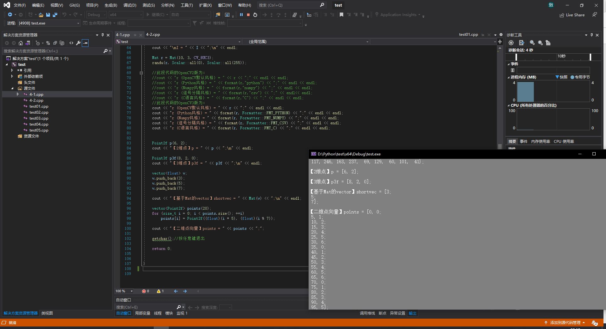
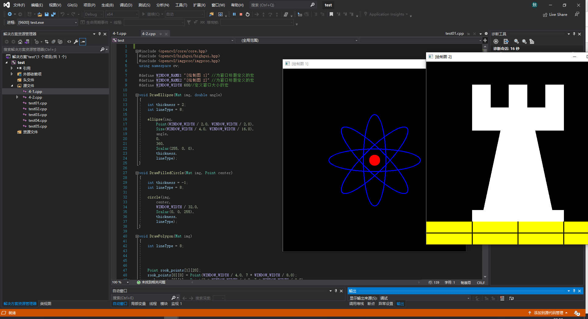
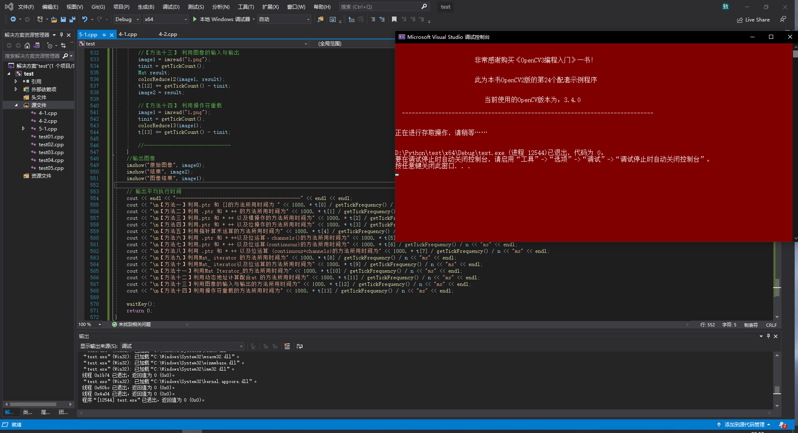
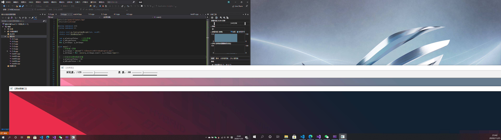
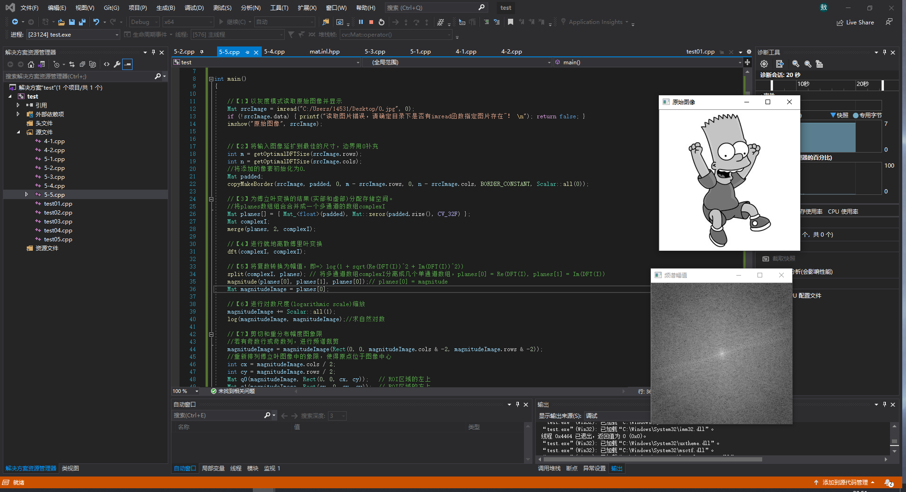

# OpenCV_CH04_05

## 第四章

### 基础图像容器 Mat

```
#include "opencv2/core/core.hpp"
#include "opencv2/highgui/highgui.hpp"
#include <iostream>
using namespace std;
using namespace cv;


//-----------------------------【ShowHelpText( )函数】--------------------------------------
//		描述：输出帮助信息
//-------------------------------------------------------------------------------------------------
static void ShowHelpText()
{
	//输出欢迎信息和OpenCV版本
	printf("\n\n\t\t\t非常感谢购买《OpenCV3编程入门》一书！\n");
	printf("\n\n\t\t\t此为本书OpenCV3版的第19个配套示例程序\n");
	printf("\n\n\t\t\t   当前使用的OpenCV版本为：" CV_VERSION);
	printf("\n\n  ----------------------------------------------------------------------------\n");

	//输出一些帮助信息
	printf("\n\n\n\t欢迎来到【基本图像容器-Mat类】示例程序~\n\n");
	printf("\n\n\t程序说明：\n\n\t此示例程序用于演示Mat类的格式化输出功能，输出风格可为：");
	printf("\n\n\n\t【1】OpenCV默认风格");
	printf("\n\n\t【2】Python风格");
	printf("\n\n\t【3】逗号分隔风格");
	printf("\n\n\t【4】Numpy风格");
	printf("\n\n\t【5】C语言风格\n\n");
	printf("\n  --------------------------------------------------------------------------\n");


}


//--------------------------------------【main( )函数】-----------------------------------------
//          描述：控制台应用程序的入口函数，我们的程序从这里开始执行
//-----------------------------------------------------------------------------------------------
int main(int, char**)
{
	//改变控制台的前景色和背景色
	system("color 8F");

	//显示帮助文字
	ShowHelpText();

	Mat I = Mat::eye(4, 4, CV_64F);
	I.at<double>(1, 1) = CV_PI;
	cout << "\nI = " << I << ";\n" << endl;

	Mat r = Mat(10, 3, CV_8UC3);
	randu(r, Scalar::all(0), Scalar::all(255));

	//此段代码的OpenCV2版为：
	//cout << "r (OpenCV默认风格) = " << r << ";" << endl << endl;
	//cout << "r (Python风格) = " << format(r,"python") << ";" << endl << endl;
	//cout << "r (Numpy风格) = " << format(r,"numpy") << ";" << endl << endl;
	//cout << "r (逗号分隔风格) = " << format(r,"csv") << ";" << endl<< endl;
	//cout << "r (C语言风格) = " << format(r,"C") << ";" << endl << endl;
	//此段代码的OpenCV3版为：
	cout << "r (OpenCV默认风格) = " << r << ";" << endl << endl;
	cout << "r (Python风格) = " << format(r, Formatter::FMT_PYTHON) << ";" << endl << endl;
	cout << "r (Numpy风格) = " << format(r, Formatter::FMT_NUMPY) << ";" << endl << endl;
	cout << "r (逗号分隔风格) = " << format(r, Formatter::FMT_CSV) << ";" << endl << endl;
	cout << "r (C语言风格) = " << format(r, Formatter::FMT_C) << ";" << endl << endl;


	Point2f p(6, 2);
	cout << "【2维点】p = " << p << ";\n" << endl;

	Point3f p3f(8, 2, 0);
	cout << "【3维点】p3f = " << p3f << ";\n" << endl;

	vector<float> v;
	v.push_back(3);
	v.push_back(5);
	v.push_back(7);

	cout << "【基于Mat的vector】shortvec = " << Mat(v) << ";\n" << endl;

	vector<Point2f> points(20);
	for (size_t i = 0; i < points.size(); ++i)
		points[i] = Point2f((float)(i * 5), (float)(i % 7));

	cout << "【二维点向量】points = " << points << ";";

	getchar();//按任意键退出

	return 0;


}
```

运行结果：


### 4-3 基本图形的绘制

```
#include <opencv2/core/core.hpp>
#include <opencv2/highgui/highgui.hpp>
#include <opencv2/imgproc/imgproc.hpp>
using namespace cv;

#define WINDOW_NAME1 "[绘制图 1]" //为窗口标题定义的宏
#define WINDOW_NAME2 "[绘制图 2]" //为窗口标题定义的宏
#define WINDOW_WIDTH 600//定义窗口大小的宏

void DrawEllipse(Mat img, double angle)
{
	int thickness = 2;
	int lineType = 8;

	ellipse(img,
		Point(WINDOW_WIDTH / 2.0, WINDOW_WIDTH / 2.0),
		Size(WINDOW_WIDTH / 4.0, WINDOW_WIDTH / 16.0),
		angle,
		0,
		360,
		Scalar(255, 0, 0),
		thickness,
		lineType);
}

void DrawFilledCircle(Mat img, Point center)
{
	int thickness = -1;
	int lineType = 8;

	circle(img,
		center,
		WINDOW_WIDTH / 32.0,
		Scalar(0, 0, 255),
		thickness,
		lineType);
}

void DrawPolygon(Mat img)
{
	int lineType = 8;

	/** 创建一些点 */

	Point rook_points[1][20];
	rook_points[0][0] = Point(WINDOW_WIDTH / 4.0, 7 * WINDOW_WIDTH / 8.0);
	rook_points[0][1] = Point(3 * WINDOW_WIDTH / 4.0, 7 * WINDOW_WIDTH / 8.0);
	rook_points[0][2] = Point(3 * WINDOW_WIDTH / 4.0, 13 * WINDOW_WIDTH / 16.0);
	rook_points[0][3] = Point(11 * WINDOW_WIDTH / 16.0, 13 * WINDOW_WIDTH / 16.0);
	rook_points[0][4] = Point(19 * WINDOW_WIDTH / 32.0, 3 * WINDOW_WIDTH / 8.0);
	rook_points[0][5] = Point(3 * WINDOW_WIDTH / 4.0, 3 * WINDOW_WIDTH / 8.0);
	rook_points[0][6] = Point(3 * WINDOW_WIDTH / 4.0, WINDOW_WIDTH / 8.0);
	rook_points[0][7] = Point(26 * WINDOW_WIDTH / 40.0, WINDOW_WIDTH / 8.0);
	rook_points[0][8] = Point(26 * WINDOW_WIDTH / 40.0, WINDOW_WIDTH / 4.0);
	rook_points[0][9] = Point(22 * WINDOW_WIDTH / 40.0, WINDOW_WIDTH / 4.0);
	rook_points[0][10] = Point(22 * WINDOW_WIDTH / 40.0, WINDOW_WIDTH / 8.0);
	rook_points[0][11] = Point(18 * WINDOW_WIDTH / 40.0, WINDOW_WIDTH / 8.0);
	rook_points[0][12] = Point(18 * WINDOW_WIDTH / 40.0, WINDOW_WIDTH / 4.0);
	rook_points[0][13] = Point(14 * WINDOW_WIDTH / 40.0, WINDOW_WIDTH / 4.0);
	rook_points[0][14] = Point(14 * WINDOW_WIDTH / 40.0, WINDOW_WIDTH / 8.0);
	rook_points[0][15] = Point(WINDOW_WIDTH / 4.0, WINDOW_WIDTH / 8.0);
	rook_points[0][16] = Point(WINDOW_WIDTH / 4.0, 3 * WINDOW_WIDTH / 8.0);
	rook_points[0][17] = Point(13 * WINDOW_WIDTH / 32.0, 3 * WINDOW_WIDTH / 8.0);
	rook_points[0][18] = Point(5 * WINDOW_WIDTH / 16.0, 13 * WINDOW_WIDTH / 16.0);
	rook_points[0][19] = Point(WINDOW_WIDTH / 4.0, 13 * WINDOW_WIDTH / 16.0);

	const Point* ppt[1] = { rook_points[0] };
	int npt[] = { 20 };

	fillPoly(img,
		ppt,
		npt,
		1,
		Scalar(255, 255, 255),
		lineType);
}

void DrawLine(Mat img, Point start, Point end)
{
	int thickness = 2;
	int lineType = 8;
	line(img,
		start,
		end,
		Scalar(0, 0, 0),
		thickness,
		lineType);
}

int main(void)
{
	//创建空白的Mat图像
	Mat atomImage = Mat::zeros(WINDOW_WIDTH, WINDOW_WIDTH, CV_8UC3);
	Mat rookImage = Mat::zeros(WINDOW_WIDTH, WINDOW_WIDTH, CV_8UC3);

	// [1.1]先绘制出椭圆
	DrawEllipse(atomImage, 90);
	DrawEllipse(atomImage, 0);
	DrawEllipse(atomImage, 45);
	DrawEllipse(atomImage, -45);

	// [1.2]再绘制圆心
	DrawFilledCircle(atomImage, Point(WINDOW_WIDTH / 2, WINDOW_WIDTH / 2));

	// [2.1]先绘制出椭圆
	DrawPolygon(rookImage);

	// [2.2]绘制矩形
	rectangle(rookImage,
		Point(0, 7 * WINDOW_WIDTH / 8),
		Point(WINDOW_WIDTH, WINDOW_WIDTH),
		Scalar(0, 255, 255),
		-1,
		8);

	// [2.3]绘制一些线段
	DrawLine(rookImage, Point(0, 15 * WINDOW_WIDTH / 16), Point(WINDOW_WIDTH, 15 * WINDOW_WIDTH / 16));

	DrawLine(rookImage, Point(WINDOW_WIDTH / 4, 7 * WINDOW_WIDTH / 8), Point(WINDOW_WIDTH / 4, WINDOW_WIDTH));

	DrawLine(rookImage, Point(WINDOW_WIDTH / 2, 7 * WINDOW_WIDTH / 8), Point(WINDOW_WIDTH / 2, WINDOW_WIDTH));

	DrawLine(rookImage, Point(3 * WINDOW_WIDTH / 4, 7 * WINDOW_WIDTH / 8), Point(3 * WINDOW_WIDTH / 4, WINDOW_WIDTH));

	imshow(WINDOW_NAME1, atomImage);

	moveWindow(WINDOW_NAME1, 0, 200);

	imshow(WINDOW_NAME2, rookImage);

	moveWindow(WINDOW_NAME2, WINDOW_WIDTH, 200);

	waitKey(0);
	return(0);
}
```

运行结果：


## 5 core组件进阶
### 5-1 访问图像中的像素

```


//---------------------------------【头文件、命名空间包含部分】-----------------------------
//		描述：包含程序所使用的头文件和命名空间
//-------------------------------------------------------------------------------------------------
#include <iostream>
#include <opencv2/core/core.hpp>
#include <opencv2/highgui/highgui.hpp>
using namespace cv;
using namespace std;


//---------------------------------【宏定义部分】---------------------------------------------
//		描述：包含程序所使用宏定义
//-------------------------------------------------------------------------------------------------
#define NTESTS 14
#define NITERATIONS 20


//----------------------------------------- 【方法一】-------------------------------------------
//		说明：利用.ptr 和 []
//-------------------------------------------------------------------------------------------------
void colorReduce0(Mat& image, int div = 64) {

	int nl = image.rows; //行数
	int nc = image.cols * image.channels(); //每行元素的总元素数量

	for (int j = 0; j < nl; j++)
	{

		uchar* data = image.ptr<uchar>(j);

		for (int i = 0; i < nc; i++)
		{

			//-------------开始处理每个像素-------------------

			data[i] = data[i] / div * div + div / 2;

			//-------------结束像素处理------------------------

		} //单行处理结束                  
	}
}

//-----------------------------------【方法二】-------------------------------------------------
//		说明：利用 .ptr 和 * ++ 
//-------------------------------------------------------------------------------------------------
void colorReduce1(Mat& image, int div = 64) {

	int nl = image.rows; //行数
	int nc = image.cols * image.channels(); //每行元素的总元素数量

	for (int j = 0; j < nl; j++)
	{

		uchar* data = image.ptr<uchar>(j);

		for (int i = 0; i < nc; i++)
		{

			//-------------开始处理每个像素-------------------

			*data++ = *data / div * div + div / 2;

			//-------------结束像素处理------------------------

		} //单行处理结束              
	}
}

//-----------------------------------------【方法三】-------------------------------------------
//		说明：利用.ptr 和 * ++ 以及模操作
//-------------------------------------------------------------------------------------------------
void colorReduce2(Mat& image, int div = 64) {

	int nl = image.rows; //行数
	int nc = image.cols * image.channels(); //每行元素的总元素数量

	for (int j = 0; j < nl; j++)
	{

		uchar* data = image.ptr<uchar>(j);

		for (int i = 0; i < nc; i++)
		{

			//-------------开始处理每个像素-------------------

			int v = *data;
			*data++ = v - v % div + div / 2;

			//-------------结束像素处理------------------------

		} //单行处理结束                   
	}
}

//----------------------------------------【方法四】---------------------------------------------
//		说明：利用.ptr 和 * ++ 以及位操作
//----------------------------------------------------------------------------------------------------
void colorReduce3(Mat& image, int div = 64) {

	int nl = image.rows; //行数
	int nc = image.cols * image.channels(); //每行元素的总元素数量
	int n = static_cast<int>(log(static_cast<double>(div)) / log(2.0));
	//掩码值
	uchar mask = 0xFF << n; // e.g. 对于 div=16, mask= 0xF0

	for (int j = 0; j < nl; j++) {

		uchar* data = image.ptr<uchar>(j);

		for (int i = 0; i < nc; i++) {

			//------------开始处理每个像素-------------------

			*data++ = *data & mask + div / 2;

			//-------------结束像素处理------------------------
		}  //单行处理结束            
	}
}


//----------------------------------------【方法五】----------------------------------------------
//		说明：利用指针算术运算
//---------------------------------------------------------------------------------------------------
void colorReduce4(Mat& image, int div = 64) {

	int nl = image.rows; //行数
	int nc = image.cols * image.channels(); //每行元素的总元素数量
	int n = static_cast<int>(log(static_cast<double>(div)) / log(2.0));
	int step = image.step; //有效宽度
	//掩码值
	uchar mask = 0xFF << n; // e.g. 对于 div=16, mask= 0xF0

	//获取指向图像缓冲区的指针
	uchar* data = image.data;

	for (int j = 0; j < nl; j++)
	{

		for (int i = 0; i < nc; i++)
		{

			//-------------开始处理每个像素-------------------

			*(data + i) = *data & mask + div / 2;

			//-------------结束像素处理------------------------

		} //单行处理结束              

		data += step;  // next line
	}
}

//---------------------------------------【方法六】----------------------------------------------
//		说明：利用 .ptr 和 * ++以及位运算、image.cols * image.channels()
//-------------------------------------------------------------------------------------------------
void colorReduce5(Mat& image, int div = 64) {

	int nl = image.rows; //行数
	int n = static_cast<int>(log(static_cast<double>(div)) / log(2.0));
	//掩码值
	uchar mask = 0xFF << n; // e.g. 例如div=16, mask= 0xF0

	for (int j = 0; j < nl; j++)
	{

		uchar* data = image.ptr<uchar>(j);

		for (int i = 0; i < image.cols * image.channels(); i++)
		{

			//-------------开始处理每个像素-------------------

			*data++ = *data & mask + div / 2;

			//-------------结束像素处理------------------------

		} //单行处理结束            
	}
}

// -------------------------------------【方法七】----------------------------------------------
//		说明：利用.ptr 和 * ++ 以及位运算(continuous)
//-------------------------------------------------------------------------------------------------
void colorReduce6(Mat& image, int div = 64) {

	int nl = image.rows; //行数
	int nc = image.cols * image.channels(); //每行元素的总元素数量

	if (image.isContinuous())
	{
		//无填充像素
		nc = nc * nl;
		nl = 1;  // 为一维数列
	}

	int n = static_cast<int>(log(static_cast<double>(div)) / log(2.0));
	//掩码值
	uchar mask = 0xFF << n; // e.g. 比如div=16, mask= 0xF0

	for (int j = 0; j < nl; j++) {

		uchar* data = image.ptr<uchar>(j);

		for (int i = 0; i < nc; i++) {

			//-------------开始处理每个像素-------------------

			*data++ = *data & mask + div / 2;

			//-------------结束像素处理------------------------

		} //单行处理结束                   
	}
}

//------------------------------------【方法八】------------------------------------------------
//		说明：利用 .ptr 和 * ++ 以及位运算 (continuous+channels)
//-------------------------------------------------------------------------------------------------
void colorReduce7(Mat& image, int div = 64) {

	int nl = image.rows; //行数
	int nc = image.cols; //列数

	if (image.isContinuous())
	{
		//无填充像素
		nc = nc * nl;
		nl = 1;  // 为一维数组
	}

	int n = static_cast<int>(log(static_cast<double>(div)) / log(2.0));
	//掩码值
	uchar mask = 0xFF << n; // e.g. 比如div=16, mask= 0xF0

	for (int j = 0; j < nl; j++) {

		uchar* data = image.ptr<uchar>(j);

		for (int i = 0; i < nc; i++) {

			//-------------开始处理每个像素-------------------

			*data++ = *data & mask + div / 2;
			*data++ = *data & mask + div / 2;
			*data++ = *data & mask + div / 2;

			//-------------结束像素处理------------------------

		} //单行处理结束                    
	}
}


// -----------------------------------【方法九】 ------------------------------------------------
//		说明：利用Mat_ iterator
//-------------------------------------------------------------------------------------------------
void colorReduce8(Mat& image, int div = 64) {

	//获取迭代器
	Mat_<Vec3b>::iterator it = image.begin<Vec3b>();
	Mat_<Vec3b>::iterator itend = image.end<Vec3b>();

	for (; it != itend; ++it) {

		//-------------开始处理每个像素-------------------

		(*it)[0] = (*it)[0] / div * div + div / 2;
		(*it)[1] = (*it)[1] / div * div + div / 2;
		(*it)[2] = (*it)[2] / div * div + div / 2;

		//-------------结束像素处理------------------------
	}//单行处理结束  
}

//-------------------------------------【方法十】-----------------------------------------------
//		说明：利用Mat_ iterator以及位运算
//-------------------------------------------------------------------------------------------------
void colorReduce9(Mat& image, int div = 64) {

	// div必须是2的幂
	int n = static_cast<int>(log(static_cast<double>(div)) / log(2.0));
	//掩码值
	uchar mask = 0xFF << n; // e.g. 比如 div=16, mask= 0xF0

	// 获取迭代器
	Mat_<Vec3b>::iterator it = image.begin<Vec3b>();
	Mat_<Vec3b>::iterator itend = image.end<Vec3b>();

	//扫描所有元素
	for (; it != itend; ++it)
	{

		//-------------开始处理每个像素-------------------

		(*it)[0] = (*it)[0] & mask + div / 2;
		(*it)[1] = (*it)[1] & mask + div / 2;
		(*it)[2] = (*it)[2] & mask + div / 2;

		//-------------结束像素处理------------------------
	}//单行处理结束  
}

//------------------------------------【方法十一】---------------------------------------------
//		说明：利用Mat Iterator_
//-------------------------------------------------------------------------------------------------
void colorReduce10(Mat& image, int div = 64) {

	//获取迭代器
	Mat_<Vec3b> cimage = image;
	Mat_<Vec3b>::iterator it = cimage.begin();
	Mat_<Vec3b>::iterator itend = cimage.end();

	for (; it != itend; it++) {

		//-------------开始处理每个像素-------------------

		(*it)[0] = (*it)[0] / div * div + div / 2;
		(*it)[1] = (*it)[1] / div * div + div / 2;
		(*it)[2] = (*it)[2] / div * div + div / 2;

		//-------------结束像素处理------------------------
	}
}

//--------------------------------------【方法十二】--------------------------------------------
//		说明：利用动态地址计算配合at
//-------------------------------------------------------------------------------------------------
void colorReduce11(Mat& image, int div = 64) {

	int nl = image.rows; //行数
	int nc = image.cols; //列数

	for (int j = 0; j < nl; j++)
	{
		for (int i = 0; i < nc; i++)
		{

			//-------------开始处理每个像素-------------------

			image.at<Vec3b>(j, i)[0] = image.at<Vec3b>(j, i)[0] / div * div + div / 2;
			image.at<Vec3b>(j, i)[1] = image.at<Vec3b>(j, i)[1] / div * div + div / 2;
			image.at<Vec3b>(j, i)[2] = image.at<Vec3b>(j, i)[2] / div * div + div / 2;

			//-------------结束像素处理------------------------

		} //单行处理结束                 
	}
}

//----------------------------------【方法十三】----------------------------------------------- 
//		说明：利用图像的输入与输出
//-------------------------------------------------------------------------------------------------
void colorReduce12(const Mat& image, //输入图像
	Mat& result,      // 输出图像
	int div = 64) {

	int nl = image.rows; //行数
	int nc = image.cols; //列数

	//准备好初始化后的Mat给输出图像
	result.create(image.rows, image.cols, image.type());

	//创建无像素填充的图像
	nc = nc * nl;
	nl = 1;  //单维数组

	int n = static_cast<int>(log(static_cast<double>(div)) / log(2.0));
	//掩码值
	uchar mask = 0xFF << n; // e.g.比如div=16, mask= 0xF0

	for (int j = 0; j < nl; j++) {

		uchar* data = result.ptr<uchar>(j);
		const uchar* idata = image.ptr<uchar>(j);

		for (int i = 0; i < nc; i++) {

			//-------------开始处理每个像素-------------------

			*data++ = (*idata++) & mask + div / 2;
			*data++ = (*idata++) & mask + div / 2;
			*data++ = (*idata++) & mask + div / 2;

			//-------------结束像素处理------------------------

		} //单行处理结束                   
	}
}

//--------------------------------------【方法十四】------------------------------------------- 
//		说明：利用操作符重载
//-------------------------------------------------------------------------------------------------
void colorReduce13(Mat& image, int div = 64) {

	int n = static_cast<int>(log(static_cast<double>(div)) / log(2.0));
	//掩码值
	uchar mask = 0xFF << n; // e.g. 比如div=16, mask= 0xF0

	//进行色彩还原
	image = (image & Scalar(mask, mask, mask)) + Scalar(div / 2, div / 2, div / 2);
}


//-----------------------------------【ShowHelpText( )函数】-----------------------------
//		描述：输出一些帮助信息
//----------------------------------------------------------------------------------------------
void ShowHelpText()
{
	//输出欢迎信息和OpenCV版本
	printf("\n\n\t\t\t非常感谢购买《OpenCV3编程入门》一书！\n");
	printf("\n\n\t\t\t此为本书OpenCV2版的第24个配套示例程序\n");
	printf("\n\n\t\t\t   当前使用的OpenCV版本为：" CV_VERSION);
	printf("\n\n  ----------------------------------------------------------------------------\n");

	printf("\n\n正在进行存取操作，请稍等……\n\n");
}


//-----------------------------------【main( )函数】--------------------------------------------
//		描述：控制台应用程序的入口函数，我们的程序从这里开始
//-------------------------------------------------------------------------------------------------
int main()
{
	int64 t[NTESTS], tinit;
	Mat image0;
	Mat image1;
	Mat image2;

	system("color 4F");

	ShowHelpText();

	image0 = imread("1.png");
	if (!image0.data)
		return 0;

	//时间值设为0
	for (int i = 0; i < NTESTS; i++)
		t[i] = 0;


	// 多次重复测试
	int n = NITERATIONS;
	for (int k = 0; k < n; k++)
	{
		cout << k << " of " << n << endl;

		image1 = imread("1.png");
		//【方法一】利用.ptr 和 []
		tinit = getTickCount();
		colorReduce0(image1);
		t[0] += getTickCount() - tinit;

		//【方法二】利用 .ptr 和 * ++ 
		image1 = imread("1.png");
		tinit = getTickCount();
		colorReduce1(image1);
		t[1] += getTickCount() - tinit;

		//【方法三】利用.ptr 和 * ++ 以及模操作
		image1 = imread("1.png");
		tinit = getTickCount();
		colorReduce2(image1);
		t[2] += getTickCount() - tinit;

		//【方法四】 利用.ptr 和 * ++ 以及位操作
		image1 = imread("1.png");
		tinit = getTickCount();
		colorReduce3(image1);
		t[3] += getTickCount() - tinit;

		//【方法五】 利用指针的算术运算
		image1 = imread("1.png");
		tinit = getTickCount();
		colorReduce4(image1);
		t[4] += getTickCount() - tinit;

		//【方法六】利用 .ptr 和 * ++以及位运算、image.cols * image.channels()
		image1 = imread("1.png");
		tinit = getTickCount();
		colorReduce5(image1);
		t[5] += getTickCount() - tinit;

		//【方法七】利用.ptr 和 * ++ 以及位运算(continuous)
		image1 = imread("1.png");
		tinit = getTickCount();
		colorReduce6(image1);
		t[6] += getTickCount() - tinit;

		//【方法八】利用 .ptr 和 * ++ 以及位运算 (continuous+channels)
		image1 = imread("1.png");
		tinit = getTickCount();
		colorReduce7(image1);
		t[7] += getTickCount() - tinit;

		//【方法九】 利用Mat_ iterator
		image1 = imread("1.png");
		tinit = getTickCount();
		colorReduce8(image1);
		t[8] += getTickCount() - tinit;

		//【方法十】 利用Mat_ iterator以及位运算
		image1 = imread("1.png");
		tinit = getTickCount();
		colorReduce9(image1);
		t[9] += getTickCount() - tinit;

		//【方法十一】利用Mat Iterator_
		image1 = imread("1.png");
		tinit = getTickCount();
		colorReduce10(image1);
		t[10] += getTickCount() - tinit;

		//【方法十二】 利用动态地址计算配合at
		image1 = imread("1.png");
		tinit = getTickCount();
		colorReduce11(image1);
		t[11] += getTickCount() - tinit;

		//【方法十三】 利用图像的输入与输出
		image1 = imread("1.png");
		tinit = getTickCount();
		Mat result;
		colorReduce12(image1, result);
		t[12] += getTickCount() - tinit;
		image2 = result;

		//【方法十四】 利用操作符重载
		image1 = imread("1.png");
		tinit = getTickCount();
		colorReduce13(image1);
		t[13] += getTickCount() - tinit;

		//------------------------------
	}
	//输出图像   
	imshow("原始图像", image0);
	imshow("结果", image2);
	imshow("图像结果", image1);

	// 输出平均执行时间
	cout << endl << "-------------------------------------------" << endl << endl;
	cout << "\n【方法一】利用.ptr 和 []的方法所用时间为 " << 1000. * t[0] / getTickFrequency() / n << "ms" << endl;
	cout << "\n【方法二】利用 .ptr 和 * ++ 的方法所用时间为" << 1000. * t[1] / getTickFrequency() / n << "ms" << endl;
	cout << "\n【方法三】利用.ptr 和 * ++ 以及模操作的方法所用时间为" << 1000. * t[2] / getTickFrequency() / n << "ms" << endl;
	cout << "\n【方法四】利用.ptr 和 * ++ 以及位操作的方法所用时间为" << 1000. * t[3] / getTickFrequency() / n << "ms" << endl;
	cout << "\n【方法五】利用指针算术运算的方法所用时间为" << 1000. * t[4] / getTickFrequency() / n << "ms" << endl;
	cout << "\n【方法六】利用 .ptr 和 * ++以及位运算、channels()的方法所用时间为" << 1000. * t[5] / getTickFrequency() / n << "ms" << endl;
	cout << "\n【方法七】利用.ptr 和 * ++ 以及位运算(continuous)的方法所用时间为" << 1000. * t[6] / getTickFrequency() / n << "ms" << endl;
	cout << "\n【方法八】利用 .ptr 和 * ++ 以及位运算 (continuous+channels)的方法所用时间为" << 1000. * t[7] / getTickFrequency() / n << "ms" << endl;
	cout << "\n【方法九】利用Mat_ iterator 的方法所用时间为" << 1000. * t[8] / getTickFrequency() / n << "ms" << endl;
	cout << "\n【方法十】利用Mat_ iterator以及位运算的方法所用时间为" << 1000. * t[9] / getTickFrequency() / n << "ms" << endl;
	cout << "\n【方法十一】利用Mat Iterator_的方法所用时间为" << 1000. * t[10] / getTickFrequency() / n << "ms" << endl;
	cout << "\n【方法十二】利用动态地址计算配合at 的方法所用时间为" << 1000. * t[11] / getTickFrequency() / n << "ms" << endl;
	cout << "\n【方法十三】利用图像的输入与输出的方法所用时间为" << 1000. * t[12] / getTickFrequency() / n << "ms" << endl;
	cout << "\n【方法十四】利用操作符重载的方法所用时间为" << 1000. * t[13] / getTickFrequency() / n << "ms" << endl;

	waitKey();
	return 0;
}
```
运行结果：


### 5-2 ROI区域图像叠加和混合
```
#include <opencv2/opencv.hpp>
using namespace std;
using namespace cv;
 
 
//-----------------------------【全局函数声明部分】------------------------------
bool ROI_AddImage();
bool LinearBlending();
bool ROI_LinearBlending();
 
 
int main() {
	system("color 5A");
	if (ROI_AddImage() && LinearBlending() && ROI_LinearBlending())
		cout << "运行成功！得出需要的图像了！:)" << endl;
	waitKey(0);
	return 0;
}
 
 
//----------------------【ROI_AddImage()函数】--------------------------
bool ROI_AddImage() {//利用感兴趣区域ROI实现图像叠加
	//读入图像
	Mat srcImage1 = imread("dota_pa.jpg");
	Mat logoImage = imread("dota_logo.jpg");
	if (!srcImage1.data) {
		cout << "读取srcImage1失败！" << endl;
		return false;
	}
	if (!logoImage.data) {
		cout << "读取logoImage失败！" << endl;
		return false;
	}
	//定义一个Mat类型并给其设定ROI区域
	Mat imageROI = srcImage1(Rect(560, 240, logoImage.cols, logoImage.rows));
	//加载掩膜（必须是灰度图）
	Mat mask = imread("logoImage.jpg", 0);
	//将掩膜复制到ROI区域
	logoImage.copyTo(imageROI, mask);
	//显示效果
	namedWindow("<1>利用ROI实现图像叠加示例窗口");
	imshow("<1>利用ROI实现图像叠加示例窗口", srcImage1);
	return true;
}
 
 
//------------------------【LinearBlending()函数】----------------------------
bool LinearBlending() {//利用cv::addWeighted()函数实现图像线性混合
	//定义一些局部变量
	double alpha = 0.5;
	double beta;
	Mat srcImage2, srcImage3, dstImage;
	//读取图像
	srcImage2 = imread("mogu.jpg");
	srcImage3 = imread("rain.jpg");
 
 
	if (!srcImage2.data) {
		cout << "读取srcImage2错误！" << endl;
		return false;
	}
	if (!srcImage3.data) {
		cout << "读取srcImage3错误！" << endl;
		return false;
	}
	
	//进行图像混合加权操作
	beta = (1.0 - alpha);
	double gamma = 0;
	addWeighted(srcImage2, alpha, srcImage3, beta, gamma, dstImage);
	
	//创建并显示原图窗口
	namedWindow("<2>线性混合示例窗口【原图】");
	imshow("<2>线性混合示例窗口【原图】", srcImage2);
 
 
	namedWindow("<3>线性混合示例窗口【效果图】");
	imshow("<3>线性混合示例窗口【效果图】",dstImage);
 
 
	return true;
}
 
 
//----------------------【ROI_LinearBlending()函数】---------------------------------
bool ROI_LinearBlending() {//指定区域线性图像混合
	//读取图像
	Mat srcImage4 = imread("dota_pa.jpg", 1);//载入三通道图像
	Mat logoImage = imread("dota_logo.jpg");//默认flags=1，载入三通道图像
 
 
	if (!srcImage4.data) {
		cout << "读入srcImage4失败！" << endl;
		return false;
	}
	if (!logoImage.data) {
		cout << "读入logoImage失败！" << endl;
		return false;
	}
 
 
	//定义一个Mat类型并给其设定ROI区域
	Mat imageROI;
	//imageROI = srcImage4(Rect(560, 240, logoImage.cols, logoImage.rows));
	imageROI = srcImage4(Range(240, 240 + logoImage.rows), Range(560, 560 + logoImage.cols));//方法二
	//注意：Range()方法是先给定上下范围，再给定左右范围！！
 
 
	//定义一些局部变量
	double alpha = 0.5, beta = 0.3, gamma = 0;
	//将logo加到原图上
	//将logo线性叠加到ROI区域并赋值给imageROI，而imageROI属于srcImage4，所以srcImage4为最终效果图
	addWeighted(imageROI, alpha, logoImage, beta, gamma, imageROI);//注意参数一三六必须尺寸相同&通道数相同
 
 
	//显示结果
	namedWindow("<4>区域线性图像混合示例窗口");
	imshow("<4>区域线性图像混合示例窗口", srcImage4);
 
 
	return true;
}
```
运行结果：


### 5-3 分离颜色通道 多通道图像混合
```
#include <iostream>
#include <opencv2/opencv.hpp>
#include <Windows.h>
#include <opencv2/highgui/highgui.hpp>
using namespace cv;
using namespace std;

bool ROI_AddImage();
bool LinearBlending();
bool ROI_LinearBlending();

//-------------ROI_AddImage----------------------------
//-----------利用感兴趣区域ROI实现图像叠加-------------
//-----------------------------------------------------
bool ROI_AddImage()
{
	Mat srcImage1 = imread("C:/Users/14531/Desktop/1.png");
	Mat logoImage = imread("C:/Users/14531/Desktop/2.jpg");

	if (!srcImage1.data)
	{
		printf("error in srcimage\n");
		return false;
	}
	if (!logoImage.data)
	{
		printf("error in logoimage\n");
		return false;
	}

	Mat imageROI = srcImage1(Rect(200, 250, logoImage.cols, logoImage.rows));

	Mat mask = imread("C:/Users/14531/Desktop/1.png", 0);

	logoImage.copyTo(imageROI, mask);

	namedWindow("<1>利用ROI实现图像叠加实列窗口");
	imshow("<1>利用ROI实现图像叠加实列窗口", srcImage1);

	return true;
}

//----------------LinearBlending函数---------------
//-------------利用cv::addWeighted() 函数
//---------------------图像线性混合----------------
bool LinearBlending()
{
	double alphaValue = 0.5;
	double betaValue;

	Mat srcImage2, srcImage3, dstImage;

	srcImage2 = imread("C:/Users/14531/Desktop/1.png");
	srcImage3 = imread("C:/Users/14531/Desktop/1.png");

	if (!srcImage2.data)
	{
		print("error in srcImage2!\n");
		return false;
	}
	if (!srcImage3.data)
	{
		print("error in srcImage3!\n");
		return false;
	}

	betaValue = 1.0 - alphaValue;
	addWeighted(srcImage2, alphaValue, srcImage3, betaValue, 0.0, dstImage);

	namedWindow("<2>线性混合窗口【原图】", 1);
	imshow("<2>线性混合示例窗口【原图】", srcImage2);

	namedWindow("<3>线性混合示例窗口【效果图】", 1);
	imshow("<3>线性混合示例窗口【效果图】", dstImage);

	return true;
}
//-----------[ROI_LinearBlending()]--------------
//------------线线性混合实现函数，指定区域线性图像混合，addWeighted()函数结合定义
//---------------感兴趣区域ROI，实现自定义区域的线性混合
bool ROI_LinearBlending()
{
	Mat srcImage4 = imread("C:/Users/14531/Desktop/1.png", 1);
	Mat logoImage = imread("C:/Users/14531/Desktop/1.png");

	if (!srcImage4.data)
	{
		printf("error in srcImage4 !\n");
		return false;
	}
	if (!logoImage.data)
	{
		printf("error in logoImage!\n");
		return false;
	}

	Mat imageROI;
	imageROI = srcImage4(Rect(200, 250, logoImage.cols, logoImage.rows));
	//imageROI = srcImage4(Range(200, 250 + logoImage.rows), Raneg(200, 200 + logoImage.cols));

	addWeighted(imageROI, 0.5, logoImage, 0.3, 0.0, imageROI);

	namedWindow("<4>区域线性混合示例窗口");
	imshow("<4>区域线性混合示例窗口", srcImage4);
}
int main(int argc, char* argv[], char** env)
{
	system("color 5E");

	if (ROI_AddImage() && LinearBlending() && ROI_LinearBlending())
	{
		printf("successful for create image\n");
	}
	waitKey(0);

	return 0;
}
```

### 5-4 图像对比度 亮度值调整

```
#include<opencv2/opencv.hpp>
#include<iostream>

using namespace std;
using namespace cv;

static void on_ContrastAndBright(int, void*);
static void ShowHelpText();

int g_nContrastValue;   //对比度值
int g_nBrightValue;    //亮度值
Mat g_srcImage, g_dstImage;

int main() {
    //读取输入图像
    g_srcImage = imread("C:\\Users\\14531\\Desktop\\1.png");
    g_dstImage = Mat::zeros(g_srcImage.size(), g_srcImage.type());

    //设定对比度和亮的初值
    g_nContrastValue = 80;
    g_nBrightValue = 80;


    //窗口
    namedWindow("【效果图】", 1);

    //创建滑块
    createTrackbar("对比度：", "【效果图】", &g_nContrastValue, 300, on_ContrastAndBright);
    createTrackbar("亮  度：", "【效果图】", &g_nBrightValue, 200, on_ContrastAndBright);

    //进行回调函数的初始化
    on_ContrastAndBright(g_nContrastValue, 0);
    on_ContrastAndBright(g_nBrightValue, 0);

    waitKey();
    return  0;
}

static void on_ContrastAndBright(int, void*) {
    //创建窗口
    namedWindow("【原始图窗口】", 1);
    //三个for循环，执行运算g_dstImage(i,j) = a*g_srcImage(i,j) +b
    for (int y = 0; y < g_srcImage.rows; y++) {
        for (int x = 0; x < g_srcImage.cols; x++) {
            for (int c = 0; c < 3; c++) {
                g_dstImage.at<Vec3b>(y, x)[c] = saturate_cast<uchar>((g_nContrastValue * 0.01) * (g_srcImage.at<Vec3b>(y, x)[c]) + g_nBrightValue);
            }
        }
    }

    //显示图像
    imshow("【原始图窗口】", g_srcImage);
    imshow("【效果图】", g_dstImage);
}
```
运行结果：



### 5-5 离散傅里叶变换

```
#include "opencv2/core/core.hpp"
#include "opencv2/imgproc/imgproc.hpp"
#include "opencv2/highgui/highgui.hpp"
#include <iostream>
using namespace cv;


int main()
{

	//【1】以灰度模式读取原始图像并显示
	Mat srcImage = imread("C:/Users/14531/Desktop/0.jpg", 0);
	if (!srcImage.data) { printf("读取图片错误，请确定目录下是否有imread函数指定图片存在~！ \n"); return false; }
	imshow("原始图像", srcImage);


	//【2】将输入图像延扩到最佳的尺寸，边界用0补充
	int m = getOptimalDFTSize(srcImage.rows);
	int n = getOptimalDFTSize(srcImage.cols);
	//将添加的像素初始化为0.
	Mat padded;
	copyMakeBorder(srcImage, padded, 0, m - srcImage.rows, 0, n - srcImage.cols, BORDER_CONSTANT, Scalar::all(0));

	//【3】为傅立叶变换的结果(实部和虚部)分配存储空间。
	//将planes数组组合合并成一个多通道的数组complexI
	Mat planes[] = { Mat_<float>(padded), Mat::zeros(padded.size(), CV_32F) };
	Mat complexI;
	merge(planes, 2, complexI);

	//【4】进行就地离散傅里叶变换
	dft(complexI, complexI);

	//【5】将复数转换为幅值，即=> log(1 + sqrt(Re(DFT(I))^2 + Im(DFT(I))^2))
	split(complexI, planes); // 将多通道数组complexI分离成几个单通道数组，planes[0] = Re(DFT(I), planes[1] = Im(DFT(I))
	magnitude(planes[0], planes[1], planes[0]);// planes[0] = magnitude  
	Mat magnitudeImage = planes[0];

	//【6】进行对数尺度(logarithmic scale)缩放
	magnitudeImage += Scalar::all(1);
	log(magnitudeImage, magnitudeImage);//求自然对数

	//【7】剪切和重分布幅度图象限
	//若有奇数行或奇数列，进行频谱裁剪      
	magnitudeImage = magnitudeImage(Rect(0, 0, magnitudeImage.cols & -2, magnitudeImage.rows & -2));
	//重新排列傅立叶图像中的象限，使得原点位于图像中心  
	int cx = magnitudeImage.cols / 2;
	int cy = magnitudeImage.rows / 2;
	Mat q0(magnitudeImage, Rect(0, 0, cx, cy));   // ROI区域的左上
	Mat q1(magnitudeImage, Rect(cx, 0, cx, cy));  // ROI区域的右上
	Mat q2(magnitudeImage, Rect(0, cy, cx, cy));  // ROI区域的左下
	Mat q3(magnitudeImage, Rect(cx, cy, cx, cy)); // ROI区域的右下
	//交换象限（左上与右下进行交换）
	Mat tmp;
	q0.copyTo(tmp);
	q3.copyTo(q0);
	tmp.copyTo(q3);
	//交换象限（右上与左下进行交换）
	q1.copyTo(tmp);
	q2.copyTo(q1);
	tmp.copyTo(q2);

	//【8】归一化，用0到1之间的浮点值将矩阵变换为可视的图像格式
	//此句代码的OpenCV2版为：
	normalize(magnitudeImage, magnitudeImage, 0, 1, CV_MINMAX); 
	//此句代码的OpenCV3版为:
	//normalize(magnitudeImage, magnitudeImage, 0, 1, NORM_MINMAX);

	//【9】显示效果图
	imshow("频谱幅值", magnitudeImage);
	waitKey();

	return 0;
}
```

运行结果：



### 5-6 输入输出XML和YAML文件

```
#include <opencv2/opencv.hpp>
#include <time.h>

using namespace cv;

int main()
{
	//初始化
	FileStorage fs("test.yaml", FileStorage::WRITE);

	//开始文件写入
	fs << "frameCount" << 5;
	time_t rawtime; time(&rawtime);
	fs << "calibrationDate" << asctime(localtime(&rawtime));

	Mat cameraMatrix = (Mat_<double>(5, 1) << 1000, 0, 320, 0, 1000);
	Mat distCoeffs = (Mat_<double>(5, 1) << 0.1, 0.01, -0.001, 0, 0);
	fs << "cameraMatrix" << cameraMatrix << "distCoeffs" << distCoeffs;

	fs << "features" << "[";
	for (int i = 0; i < 3; i++)
	{
		int x = rand() % 640;
		int y = rand() % 480;
		uchar lbp = rand() % 256;
		fs << "{:" << "x" << x << "y" << y << "lbp" << "[:";
		for (int j = 0; j < 8; j++)
		{
			fs << ((lbp >> j) & 1);
		}
		fs << "]" << "}";

	}
	fs << "]";
	fs.release();

	printf("文件读写完毕，请在工程目录下查看生成的文件~");
	getchar();
	return 0;
}

```
