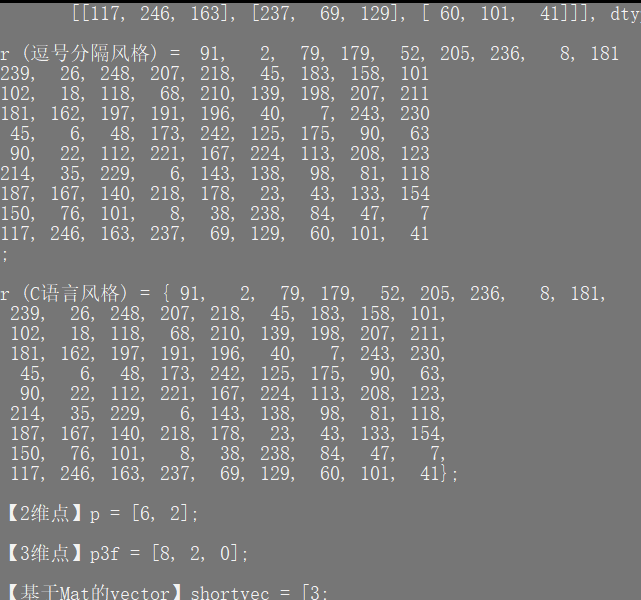
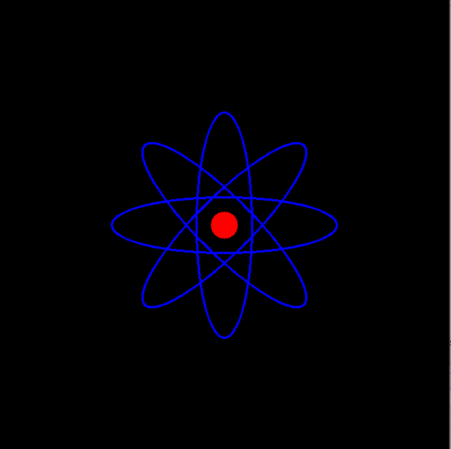
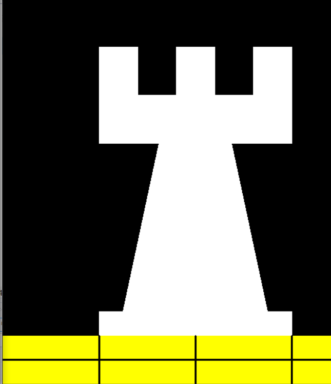
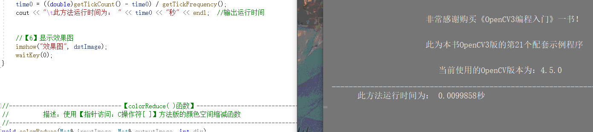
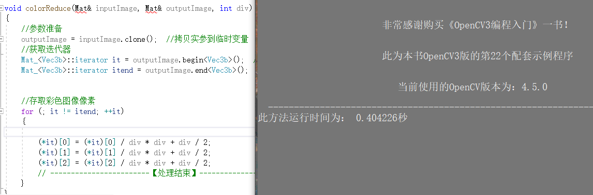
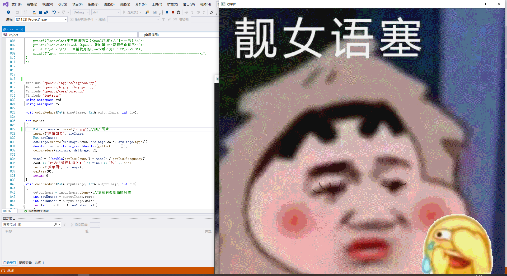
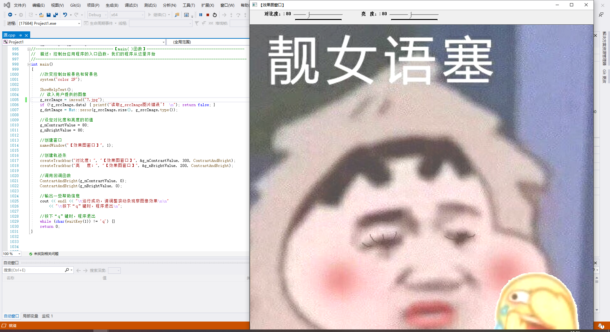
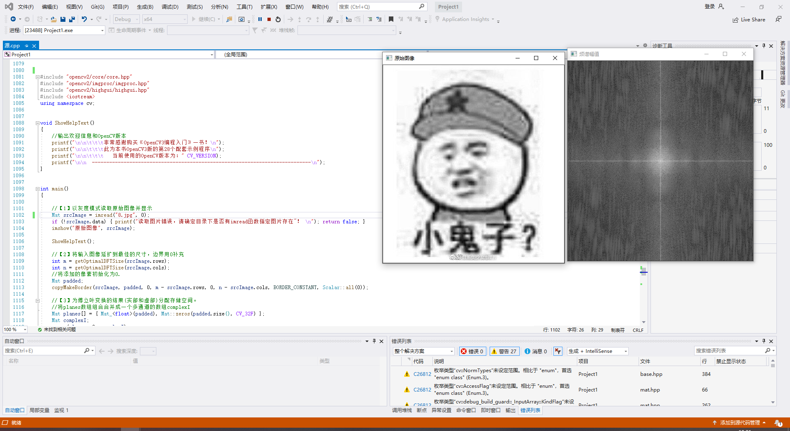
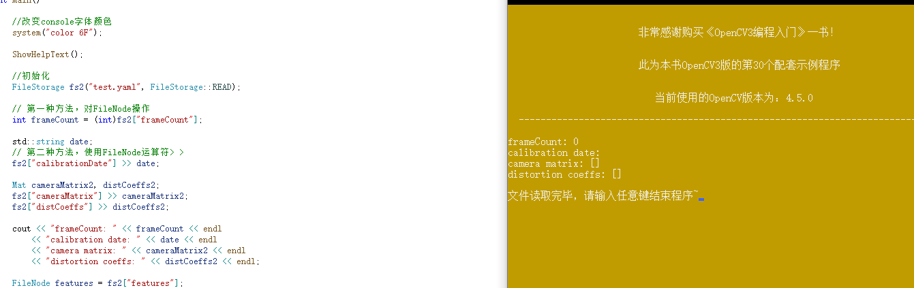

# 第二次实验 #
## 郭小凡 201809027 ##

# 4.1 基础图像容器Mat #

图像在显示屏上通常显示为可视化的图像，但在存储数字设备中，记录的是图像中的每个点的数值。
本节实验的目的就是将图像的像素点数值显示出来。

$注$
对于Mat类：
1. 不必手动为其开辟空间。
2. 不必在不需要时立刻释放空间。

$源代码$
```
#include "opencv2/core/core.hpp"
#include "opencv2/highgui/highgui.hpp"
#include <iostream>
using namespace std;
using namespace cv;


//-----------------------------【ShowHelpText( )函数】--------------------------------------
//		描述：输出帮助信息
//-------------------------------------------------------------------------------------------------
static void ShowHelpText()
{
	//输出欢迎信息和OpenCV版本
	printf("\n\n\t\t\t非常感谢购买《OpenCV3编程入门》一书！\n");
	printf("\n\n\t\t\t此为本书OpenCV3版的第19个配套示例程序\n");
	printf("\n\n\t\t\t   当前使用的OpenCV版本为：" CV_VERSION);
	printf("\n\n  ----------------------------------------------------------------------------\n");

	//输出一些帮助信息
	printf("\n\n\n\t欢迎来到【基本图像容器-Mat类】示例程序~\n\n");
	printf("\n\n\t程序说明：\n\n\t此示例程序用于演示Mat类的格式化输出功能，输出风格可为：");
	printf("\n\n\n\t【1】OpenCV默认风格");
	printf("\n\n\t【2】Python风格");
	printf("\n\n\t【3】逗号分隔风格");
	printf("\n\n\t【4】Numpy风格");
	printf("\n\n\t【5】C语言风格\n\n");
	printf("\n  --------------------------------------------------------------------------\n");

}


int main(int, char**)
{
	//改变控制台的前景色和背景色
	system("color 8F");

	//显示帮助文字
	ShowHelpText();

	Mat I = Mat::eye(4, 4, CV_64F);
	I.at<double>(1, 1) = CV_PI;
	cout << "\nI = " << I << ";\n" << endl;

	Mat r = Mat(10, 3, CV_8UC3);
	randu(r, Scalar::all(0), Scalar::all(255));

	//此段代码的OpenCV2版为：
	//cout << "r (OpenCV默认风格) = " << r << ";" << endl << endl;
	//cout << "r (Python风格) = " << format(r,"python") << ";" << endl << endl;
	//cout << "r (Numpy风格) = " << format(r,"numpy") << ";" << endl << endl;
	//cout << "r (逗号分隔风格) = " << format(r,"csv") << ";" << endl<< endl;
	//cout << "r (C语言风格) = " << format(r,"C") << ";" << endl << endl;
	//此段代码的OpenCV3版为：
	cout << "r (OpenCV默认风格) = " << r << ";" << endl << endl;
	cout << "r (Python风格) = " << format(r, Formatter::FMT_PYTHON) << ";" << endl << endl;
	cout << "r (Numpy风格) = " << format(r, Formatter::FMT_NUMPY) << ";" << endl << endl;
	cout << "r (逗号分隔风格) = " << format(r, Formatter::FMT_CSV) << ";" << endl << endl;
	cout << "r (C语言风格) = " << format(r, Formatter::FMT_C) << ";" << endl << endl;


	Point2f p(6, 2);
	cout << "【2维点】p = " << p << ";\n" << endl;

	Point3f p3f(8, 2, 0);
	cout << "【3维点】p3f = " << p3f << ";\n" << endl;

	vector<float> v;
	v.push_back(3);
	v.push_back(5);
	v.push_back(7);

	cout << "【基于Mat的vector】shortvec = " << Mat(v) << ";\n" << endl;

	vector<Point2f> points(20);
	for (size_t i = 0; i < points.size(); ++i)
		points[i] = Point2f((float)(i * 5), (float)(i % 7));

	cout << "【二维点向量】points = " << points << ";";

	getchar();//按任意键退出

	return 0;


}
```

## 实验结果 ##



# 4.2基本图形的绘制 #
本节实验实现用Point在图像中定义2D点，使用Scalar表示颜色值。

$源代码$
```
#include <opencv2/core/core.hpp>
#include <opencv2/highgui/highgui.hpp>
#include <opencv2/imgproc/imgproc.hpp>
using namespace cv;

#define WINDOW_NAME1 "[绘制图 1]" //为窗口标题定义的宏
#define WINDOW_NAME2 "[绘制图 2]" //为窗口标题定义的宏
#define WINDOW_WIDTH 600//定义窗口大小的宏

void DrawEllipse(Mat img, double angle)
{
	int thickness = 2;
	int lineType = 8;

	ellipse(img,
		Point(WINDOW_WIDTH / 2.0, WINDOW_WIDTH / 2.0),
		Size(WINDOW_WIDTH / 4.0, WINDOW_WIDTH / 16.0),
		angle,
		0,
		360,
		Scalar(255, 0, 0),
		thickness,
		lineType);
}

void DrawFilledCircle(Mat img, Point center)
{
	int thickness = -1;
	int lineType = 8;

	circle(img,
		center,
		WINDOW_WIDTH / 32.0,
		Scalar(0, 0, 255),
		thickness,
		lineType);
}

void DrawPolygon(Mat img)
{
	int lineType = 8;

	/** 创建一些点 */

	Point rook_points[1][20];
	rook_points[0][0] = Point(WINDOW_WIDTH / 4.0, 7 * WINDOW_WIDTH / 8.0);
	rook_points[0][1] = Point(3 * WINDOW_WIDTH / 4.0, 7 * WINDOW_WIDTH / 8.0);
	rook_points[0][2] = Point(3 * WINDOW_WIDTH / 4.0, 13 * WINDOW_WIDTH / 16.0);
	rook_points[0][3] = Point(11 * WINDOW_WIDTH / 16.0, 13 * WINDOW_WIDTH / 16.0);
	rook_points[0][4] = Point(19 * WINDOW_WIDTH / 32.0, 3 * WINDOW_WIDTH / 8.0);
	rook_points[0][5] = Point(3 * WINDOW_WIDTH / 4.0, 3 * WINDOW_WIDTH / 8.0);
	rook_points[0][6] = Point(3 * WINDOW_WIDTH / 4.0, WINDOW_WIDTH / 8.0);
	rook_points[0][7] = Point(26 * WINDOW_WIDTH / 40.0, WINDOW_WIDTH / 8.0);
	rook_points[0][8] = Point(26 * WINDOW_WIDTH / 40.0, WINDOW_WIDTH / 4.0);
	rook_points[0][9] = Point(22 * WINDOW_WIDTH / 40.0, WINDOW_WIDTH / 4.0);
	rook_points[0][10] = Point(22 * WINDOW_WIDTH / 40.0, WINDOW_WIDTH / 8.0);
	rook_points[0][11] = Point(18 * WINDOW_WIDTH / 40.0, WINDOW_WIDTH / 8.0);
	rook_points[0][12] = Point(18 * WINDOW_WIDTH / 40.0, WINDOW_WIDTH / 4.0);
	rook_points[0][13] = Point(14 * WINDOW_WIDTH / 40.0, WINDOW_WIDTH / 4.0);
	rook_points[0][14] = Point(14 * WINDOW_WIDTH / 40.0, WINDOW_WIDTH / 8.0);
	rook_points[0][15] = Point(WINDOW_WIDTH / 4.0, WINDOW_WIDTH / 8.0);
	rook_points[0][16] = Point(WINDOW_WIDTH / 4.0, 3 * WINDOW_WIDTH / 8.0);
	rook_points[0][17] = Point(13 * WINDOW_WIDTH / 32.0, 3 * WINDOW_WIDTH / 8.0);
	rook_points[0][18] = Point(5 * WINDOW_WIDTH / 16.0, 13 * WINDOW_WIDTH / 16.0);
	rook_points[0][19] = Point(WINDOW_WIDTH / 4.0, 13 * WINDOW_WIDTH / 16.0);

	const Point* ppt[1] = { rook_points[0] };
	int npt[] = { 20 };

	fillPoly(img,
		ppt,
		npt,
		1,
		Scalar(255, 255, 255),
		lineType);
}

void DrawLine(Mat img, Point start, Point end)
{
	int thickness = 2;
	int lineType = 8;
	line(img,
		start,
		end,
		Scalar(0, 0, 0),
		thickness,
		lineType);
}

int main(void)
{
	//创建空白的Mat图像
	Mat atomImage = Mat::zeros(WINDOW_WIDTH, WINDOW_WIDTH, CV_8UC3);
	Mat rookImage = Mat::zeros(WINDOW_WIDTH, WINDOW_WIDTH, CV_8UC3);

	// [1.1]先绘制出椭圆
	DrawEllipse(atomImage, 90);
	DrawEllipse(atomImage, 0);
	DrawEllipse(atomImage, 45);
	DrawEllipse(atomImage, -45);

	// [1.2]再绘制圆心
	DrawFilledCircle(atomImage, Point(WINDOW_WIDTH / 2, WINDOW_WIDTH / 2));

	// [2.1]先绘制出椭圆
	DrawPolygon(rookImage);

	// [2.2]绘制矩形
	rectangle(rookImage,
		Point(0, 7 * WINDOW_WIDTH / 8),
		Point(WINDOW_WIDTH, WINDOW_WIDTH),
		Scalar(0, 255, 255),
		-1,
		8);

	// [2.3]绘制一些线段
	DrawLine(rookImage, Point(0, 15 * WINDOW_WIDTH / 16), Point(WINDOW_WIDTH, 15 * WINDOW_WIDTH / 16));

	DrawLine(rookImage, Point(WINDOW_WIDTH / 4, 7 * WINDOW_WIDTH / 8), Point(WINDOW_WIDTH / 4, WINDOW_WIDTH));

	DrawLine(rookImage, Point(WINDOW_WIDTH / 2, 7 * WINDOW_WIDTH / 8), Point(WINDOW_WIDTH / 2, WINDOW_WIDTH));

	DrawLine(rookImage, Point(3 * WINDOW_WIDTH / 4, 7 * WINDOW_WIDTH / 8), Point(3 * WINDOW_WIDTH / 4, WINDOW_WIDTH));

	imshow(WINDOW_NAME1, atomImage);

	moveWindow(WINDOW_NAME1, 0, 200);

	imshow(WINDOW_NAME2, rookImage);

	moveWindow(WINDOW_NAME2, WINDOW_WIDTH, 200);

	waitKey(0);
	return(0);
}
```


## 实验结果 ##

显示结果一：



显示结果二：




# 4.3 指针访问图像中的像素 #

利用C语言中的操作符[]实现目标的指针访问像素。

$源代码$
```
#include <opencv2/core/core.hpp>  
#include <opencv2/highgui/highgui.hpp>  
#include <iostream>  
using namespace std;
using namespace cv;


void colorReduce(Mat& inputImage, Mat& outputImage, int div);
void ShowHelpText();


int main()
{
	//【1】创建原始图并显示
	Mat srcImage = imread("1.jpg");
	imshow("原始图像", srcImage);


	//【2】按原始图的参数规格来创建创建效果图
	Mat dstImage;
	dstImage.create(srcImage.rows, srcImage.cols, srcImage.type());//效果图的大小、类型与原图片相同 


	ShowHelpText();


	//【3】记录起始时间
	double time0 = static_cast<double>(getTickCount());


	//【4】调用颜色空间缩减函数
	colorReduce(srcImage, dstImage, 32);


	//【5】计算运行时间并输出
	time0 = ((double)getTickCount() - time0) / getTickFrequency();
	cout << "\t此方法运行时间为： " << time0 << "秒" << endl;  //输出运行时间


	//【6】显示效果图
	imshow("效果图", dstImage);
	waitKey(0);
}


void colorReduce(Mat& inputImage, Mat& outputImage, int div)
{
	//参数准备
	outputImage = inputImage.clone();  //拷贝实参到临时变量
	int rowNumber = outputImage.rows;  //行数
	int colNumber = outputImage.cols * outputImage.channels();  //列数 x 通道数=每一行元素的个数


	//双重循环，遍历所有的像素值
	for (int i = 0; i < rowNumber; i++)  //行循环
	{
		uchar* data = outputImage.ptr<uchar>(i);  //获取第i行的首地址
		for (int j = 0; j < colNumber; j++)   //列循环
		{
	 
			data[j] = data[j] / div * div + div / 2;
			
		} 
	}
}


void ShowHelpText()
{

	printf("\n\n\t\t\t非常感谢购买《OpenCV3编程入门》一书！\n");
	printf("\n\n\t\t\t此为本书OpenCV3版的第21个配套示例程序\n");
	printf("\n\n\t\t\t   当前使用的OpenCV版本为：" CV_VERSION);
	printf("\n\n  ----------------------------------------------------------------------------\n");
}
```


## 结果 ##



# 5.1 用迭代器操作像素 #

在迭代法中，我们仅需获得图像矩阵的begin和end，然后增加迭代，直至从begin到end。
在迭代过程中，将*操作符添加在迭代指针前，即可访问当前指向的内容。

$源代码$
```
#include <opencv2/core/core.hpp>  
#include <opencv2/highgui/highgui.hpp>  
#include <iostream>  
using namespace std;
using namespace cv;

void colorReduce(Mat& inputImage, Mat& outputImage, int div);
void ShowHelpText();


int main()
{
	//【1】创建原始图并显示
	Mat srcImage = imread("1.jpg");
	imshow("原始图像", srcImage);


	//【2】按原始图的参数规格来创建创建效果图
	Mat dstImage;
	dstImage.create(srcImage.rows, srcImage.cols, srcImage.type());//效果图的大小、类型与原图片相同 


	ShowHelpText();


	//【3】记录起始时间
	double time0 = static_cast<double>(getTickCount());


	//【4】调用颜色空间缩减函数
	colorReduce(srcImage, dstImage, 32);


	//【5】计算运行时间并输出
	time0 = ((double)getTickCount() - time0) / getTickFrequency();
	cout << "此方法运行时间为： " << time0 << "秒" << endl;  //输出运行时间


	//【6】显示效果图
	imshow("效果图", dstImage);
	waitKey(0);
}


void colorReduce(Mat& inputImage, Mat& outputImage, int div)
{
	//参数准备
	outputImage = inputImage.clone();  //拷贝实参到临时变量
	//获取迭代器
	Mat_<Vec3b>::iterator it = outputImage.begin<Vec3b>();  //初始位置的迭代器
	Mat_<Vec3b>::iterator itend = outputImage.end<Vec3b>();  //终止位置的迭代器


	//存取彩色图像像素
	for (; it != itend; ++it)
	{

		(*it)[0] = (*it)[0] / div * div + div / 2;
		(*it)[1] = (*it)[1] / div * div + div / 2;
		(*it)[2] = (*it)[2] / div * div + div / 2;
		// ------------------------【处理结束】----------------------------
	}
}


void ShowHelpText()
{

	printf("\n\n\t\t\t非常感谢购买《OpenCV3编程入门》一书！\n");
	printf("\n\n\t\t\t此为本书OpenCV3版的第22个配套示例程序\n");
	printf("\n\n\t\t\t   当前使用的OpenCV版本为：" CV_VERSION);
	printf("\n\n  ----------------------------------------------------------------------------\n");
}
```


## 实验结果 ##



# 5.2 动态地址计算 #

$源代码$
```
#include "opencv2/imgproc/imgproc.hpp"
#include "opencv2/highgui/highgui.hpp"
#include "opencv2/core/core.hpp"
#include "iostream"
using namespace std;
using namespace cv;

void colorReduce(Mat& inputImage, Mat& outputImage, int div);

int main()
{
	Mat srcImage = imread("3.jpg");//插入图片
	imshow("原始图像", srcImage);
	Mat dstImage;
	dstImage.create(srcImage.rows, srcImage.cols, srcImage.type());
	double time0 = static_cast<double>(getTickCount());
	colorReduce(srcImage, dstImage, 32);

	time0 = ((double)getTickCount() - time0) / getTickFrequency();
	cout << "此方法运行时间为：" << time0 << "秒" << endl;
	imshow("效果图", dstImage);
	waitKey(0);
	return 0;
}
void colorReduce(Mat& inputImage, Mat& outputImage, int div)
{
	outputImage = inputImage.clone();//复制实参到临时变量
	int rowNumber = outputImage.rows;
	int colNumber = outputImage.cols;
	for (int i = 0; i < rowNumber; i++)
	{
		for (int j = 0; j < colNumber; j++)
		{
			outputImage.at<Vec3b>(i, j)[0]
				= outputImage.at<Vec3b>(i, j)[0] / div * div + div / 2;//蓝色通道
			outputImage.at<Vec3b>(i, j)[1]
				= outputImage.at<Vec3b>(i, j)[1] / div * div + div / 2;//绿色通道
			outputImage.at<Vec3b>(i, j)[2]
				= outputImage.at<Vec3b>(i, j)[2] / div * div + div / 2;//红色通道
		}
	}
}
```

## 实验结果 ##


# 5.3 遍历图像中像素 #

$源代码$
```
#include <opencv2/opencv.hpp>
#include "opencv2/imgproc/imgproc.hpp"
#include <iostream>
using namespace cv;
using namespace std;

bool ROI_AddImage();
bool LinearBlending();
bool ROI_LinearBlending();

int main()
{
	system("color 5E");
	if (ROI_AddImage() && LinearBlending() && ROI_LinearBlending())
	{
		cout << endl << "运行成功，得出了你需要的图像~! : )";
	}
	waitKey(0);
	return 0;
}

bool ROI_AddImage()
{
	// [1]读入图像
	Mat srcImagel = imread("1.jpg");
	Mat logoImage = imread("3.jpg");

	if (!srcImagel.data) { printf("读取srcImagel错误~! \n"); return false; }

	if (!logoImage.data) { printf("读取logoImage错误~! \n"); return false; }

	//[2]定义一个Mat类型并给其设定ROI区域
	Mat imageROI = srcImagel(Rect(200, 250, logoImage.cols, logoImage.rows));

	// [3]加载掩模(必须是灰度图)
	Mat mask = imread("3.jpg", 0);

	// [4]将掩膜复制到ROI
	logoImage.copyTo(imageROI, mask);

	// [5]显示结果
	namedWindow("<1>利用ROI实现图像叠加示例窗口");
	imshow("<1>利用ROI实现图像叠加示例窗口", srcImagel);

	return true;
}

bool LinearBlending()
{
	//[0]定义一些局部变量
	double alphaValue = 0.5;
	double betaValue;
	Mat srcImage2, srcImage3, dstImage;

	// [1]读取图像(两幅图片需为同样的类型和尺寸)
	srcImage2 = imread("1.jpg");
	srcImage3 = imread("3.jpg");

	if (!srcImage2.data) { printf("读取srcImage2错误~! \n"); return false; }

	if (!srcImage3.data) { printf("读取srcImage3错误~! \n"); return false; }

	// [2]进行图像混合加权操作
	betaValue = (1.0 - alphaValue);
	addWeighted(srcImage2, alphaValue, srcImage3, betaValue, 0.0, dstImage);

	// [3]创建并显示原图窗口
	namedWindow("<2>线性混合示例窗口[原图]", 1);
	imshow("<2>线性混合示例窗口[原图]", srcImage2);

	namedWindow("<3>线性混合示例窗口[ 效果图] ", 1);
	imshow("<3>线性混合示例窗口[效果图] ", dstImage);

	return true;
}

bool ROI_LinearBlending()
{
	//[1]读取图像.

	Mat srcImage4 = imread("1.jpg", 1);
	Mat logoImage = imread("3.jpg");

	if (!srcImage4.data) { printf("读取srcImage4错误~! \n"); return false; }

	if (!logoImage.data) { printf("读取logoImage错误~! \n"); return false; }
	//[2]定义一个Mat类型并給其設定ROI区域
	Mat imageROI;

	//方法一
	imageROI = srcImage4(Rect(200, 250, logoImage.cols, logoImage.rows));
	//方法二
	//imageROI = srcImage4 (Range (250 , 250+logoImage . rows) , Range (200, 200+logoImage.cols));

	//[3]將logo加到原困上
	addWeighted(imageROI, 0.5, logoImage, 0.3, 0., imageROI);
	//[4]显示結果
	namedWindow("<4>区域线性图像混合示例窗口");
	imshow("<4>区域线性图像混合示例窗口", srcImage4);

	return true;
}
```

## 实验结果 ##


# 5.4 图像对比度、亮度值调整 #

使用OpenCV进行图像对比度和亮度值的动态调整。

$源代码$
```
#include <opencv2/core/core.hpp>
#include <opencv2/highgui/highgui.hpp>
#include "opencv2/imgproc/imgproc.hpp"
#include <iostream>

//-----------------------------------【命名空间声明部分】---------------------------------------
//	描述：包含程序所使用的命名空间
//-----------------------------------------------------------------------------------------------   
using namespace std;
using namespace cv;


//-----------------------------------【全局函数声明部分】--------------------------------------
//	描述：全局函数声明
//-----------------------------------------------------------------------------------------------
static void ContrastAndBright(int, void*);
void   ShowHelpText();

//-----------------------------------【全局变量声明部分】--------------------------------------
//	描述：全局变量声明
//-----------------------------------------------------------------------------------------------
int g_nContrastValue; //对比度值
int g_nBrightValue;  //亮度值
Mat g_srcImage, g_dstImage;
//-----------------------------------【main( )函数】--------------------------------------------
//	描述：控制台应用程序的入口函数，我们的程序从这里开始
//-----------------------------------------------------------------------------------------------
int main()
{
	//改变控制台前景色和背景色
	system("color 2F");

	ShowHelpText();
	// 读入用户提供的图像
	g_srcImage = imread("1.jpg");
	if (!g_srcImage.data) { printf("读取g_srcImage图片错误~！ \n"); return false; }
	g_dstImage = Mat::zeros(g_srcImage.size(), g_srcImage.type());

	//设定对比度和亮度的初值
	g_nContrastValue = 80;
	g_nBrightValue = 80;

	//创建窗口
	namedWindow("【效果图窗口】", 1);

	//创建轨迹条
	createTrackbar("对比度：", "【效果图窗口】", &g_nContrastValue, 300, ContrastAndBright);
	createTrackbar("亮   度：", "【效果图窗口】", &g_nBrightValue, 200, ContrastAndBright);

	//调用回调函数
	ContrastAndBright(g_nContrastValue, 0);
	ContrastAndBright(g_nBrightValue, 0);

	//输出一些帮助信息
	cout << endl << "\t运行成功，请调整滚动条观察图像效果\n\n"
		<< "\t按下“q”键时，程序退出\n";

	//按下“q”键时，程序退出
	while (char(waitKey(1)) != 'q') {}
	return 0;
}


//-----------------------------------【ShowHelpText( )函数】----------------------------------
//		 描述：输出一些帮助信息
//----------------------------------------------------------------------------------------------
void ShowHelpText()
{
	//输出欢迎信息和OpenCV版本
	printf("\n\n\t\t\t非常感谢购买《OpenCV3编程入门》一书！\n");
	printf("\n\n\t\t\t此为本书OpenCV3版的第27个配套示例程序\n");
	printf("\n\n\t\t\t   当前使用的OpenCV版本为：" CV_VERSION);
	printf("\n\n  ----------------------------------------------------------------------------\n");
}


//-----------------------------【ContrastAndBright( )函数】------------------------------------
//	描述：改变图像对比度和亮度值的回调函数
//-----------------------------------------------------------------------------------------------
static void ContrastAndBright(int, void*)
{

	// 创建窗口
	namedWindow("【原始图窗口】", 1);

	// 三个for循环，执行运算 g_dstImage(i,j) = a*g_srcImage(i,j) + b
	for (int y = 0; y < g_srcImage.rows; y++)
	{
		for (int x = 0; x < g_srcImage.cols; x++)
		{
			for (int c = 0; c < 3; c++)
			{
				g_dstImage.at<Vec3b>(y, x)[c] = saturate_cast<uchar>((g_nContrastValue * 0.01) * (g_srcImage.at<Vec3b>(y, x)[c]) + g_nBrightValue);
			}
		}
	}

	// 显示图像
	imshow("【原始图窗口】", g_srcImage);
	imshow("【效果图窗口】", g_dstImage);
}

```

## 实验结果 ##
原始图：



效果图：




# 5.5 离散傅里叶变换 #

离散傅里叶变换（Discrete Fourier Transform, DFT）在形式上变换时域和频域上的序列是有限长的，实际上这两组序列都应当被认为是离散周期信号的主值序列。

$源代码$
```
#include "opencv2/core/core.hpp"
#include "opencv2/imgproc/imgproc.hpp"
#include "opencv2/highgui/highgui.hpp"
#include <iostream>
using namespace cv;


void ShowHelpText()
{
	//输出欢迎信息和OpenCV版本
	printf("\n\n\t\t\t非常感谢购买《OpenCV3编程入门》一书！\n");
	printf("\n\n\t\t\t此为本书OpenCV3版的第28个配套示例程序\n");
	printf("\n\n\t\t\t   当前使用的OpenCV版本为：" CV_VERSION);
	printf("\n\n  ----------------------------------------------------------------------------\n");
}


int main()
{

	//【1】以灰度模式读取原始图像并显示
	Mat srcImage = imread("3.jpg", 0);
	if (!srcImage.data) { printf("读取图片错误，请确定目录下是否有imread函数指定图片存在~！ \n"); return false; }
	imshow("原始图像", srcImage);

	ShowHelpText();

	//【2】将输入图像延扩到最佳的尺寸，边界用0补充
	int m = getOptimalDFTSize(srcImage.rows);
	int n = getOptimalDFTSize(srcImage.cols);
	//将添加的像素初始化为0.
	Mat padded;
	copyMakeBorder(srcImage, padded, 0, m - srcImage.rows, 0, n - srcImage.cols, BORDER_CONSTANT, Scalar::all(0));

	//【3】为傅立叶变换的结果(实部和虚部)分配存储空间。
	//将planes数组组合合并成一个多通道的数组complexI
	Mat planes[] = { Mat_<float>(padded), Mat::zeros(padded.size(), CV_32F) };
	Mat complexI;
	merge(planes, 2, complexI);

	//【4】进行就地离散傅里叶变换
	dft(complexI, complexI);

	//【5】将复数转换为幅值，即=> log(1 + sqrt(Re(DFT(I))^2 + Im(DFT(I))^2))
	split(complexI, planes); // 将多通道数组complexI分离成几个单通道数组，planes[0] = Re(DFT(I), planes[1] = Im(DFT(I))
	magnitude(planes[0], planes[1], planes[0]);// planes[0] = magnitude  
	Mat magnitudeImage = planes[0];

	//【6】进行对数尺度(logarithmic scale)缩放
	magnitudeImage += Scalar::all(1);
	log(magnitudeImage, magnitudeImage);//求自然对数

	//【7】剪切和重分布幅度图象限
	//若有奇数行或奇数列，进行频谱裁剪      
	magnitudeImage = magnitudeImage(Rect(0, 0, magnitudeImage.cols & -2, magnitudeImage.rows & -2));
	//重新排列傅立叶图像中的象限，使得原点位于图像中心  
	int cx = magnitudeImage.cols / 2;
	int cy = magnitudeImage.rows / 2;
	Mat q0(magnitudeImage, Rect(0, 0, cx, cy));   // ROI区域的左上
	Mat q1(magnitudeImage, Rect(cx, 0, cx, cy));  // ROI区域的右上
	Mat q2(magnitudeImage, Rect(0, cy, cx, cy));  // ROI区域的左下
	Mat q3(magnitudeImage, Rect(cx, cy, cx, cy)); // ROI区域的右下
	//交换象限（左上与右下进行交换）
	Mat tmp;
	q0.copyTo(tmp);
	q3.copyTo(q0);
	tmp.copyTo(q3);
	//交换象限（右上与左下进行交换）
	q1.copyTo(tmp);
	q2.copyTo(q1);
	tmp.copyTo(q2);

	//【8】归一化，用0到1之间的浮点值将矩阵变换为可视的图像格式
	//此句代码的OpenCV2版为：
	//normalize(magnitudeImage, magnitudeImage, 0, 1, CV_MINMAX); 
	//此句代码的OpenCV3版为:
	normalize(magnitudeImage, magnitudeImage, 0, 1, NORM_MINMAX);

	//【9】显示效果图
	imshow("频谱幅值", magnitudeImage);
	waitKey();

	return 0;
}

```


## 实验结果 ##



# 5.6 XML和YAML文件相关操作 #

$源代码$
```
#include "opencv2/opencv.hpp"  
#include <time.h>  
using namespace cv;
using namespace std;


void ShowHelpText()
{
	//输出欢迎信息和OpenCV版本
	printf("\n\n\t\t\t非常感谢购买《OpenCV3编程入门》一书！\n");
	printf("\n\n\t\t\t此为本书OpenCV3版的第30个配套示例程序\n");
	printf("\n\n\t\t\t   当前使用的OpenCV版本为：" CV_VERSION);
	printf("\n\n  ----------------------------------------------------------------------------\n\n");
}


int main()
{
	//改变console字体颜色
	system("color 6F");

	ShowHelpText();

	//初始化
	FileStorage fs2("test.yaml", FileStorage::READ);

	// 第一种方法，对FileNode操作
	int frameCount = (int)fs2["frameCount"];

	std::string date;
	// 第二种方法，使用FileNode运算符> > 
	fs2["calibrationDate"] >> date;

	Mat cameraMatrix2, distCoeffs2;
	fs2["cameraMatrix"] >> cameraMatrix2;
	fs2["distCoeffs"] >> distCoeffs2;

	cout << "frameCount: " << frameCount << endl
		<< "calibration date: " << date << endl
		<< "camera matrix: " << cameraMatrix2 << endl
		<< "distortion coeffs: " << distCoeffs2 << endl;

	FileNode features = fs2["features"];
	FileNodeIterator it = features.begin(), it_end = features.end();
	int idx = 0;
	std::vector<uchar> lbpval;

	//使用FileNodeIterator遍历序列
	for (; it != it_end; ++it, idx++)
	{
		cout << "feature #" << idx << ": ";
		cout << "x=" << (int)(*it)["x"] << ", y=" << (int)(*it)["y"] << ", lbp: (";
		// 我们也可以使用使用filenode > > std::vector操作符很容易的读数值阵列
		(*it)["lbp"] >> lbpval;
		for (int i = 0; i < (int)lbpval.size(); i++)
			cout << " " << (int)lbpval[i];
		cout << ")" << endl;
	}
	fs2.release();

	//程序结束，输出一些帮助文字
	printf("\n文件读取完毕，请输入任意键结束程序~");
	getchar();

	return 0;
}
```


## 实验结果 ##

XML和YAML文件的读取：

