# 第四章和第五章学习笔记

## CH04 opencv数据结构与基本绘图

### 4.1基础图像容器Mat

#### 4.1.1 数字图像存储概述

借助电子设备在显示屏上看到的是真实的图像，然而转化到数字设备时，记录的是每个点的数值（像素点矩阵），因此矩阵就是图像在数码设备的表现形式。

#### 4.1.2Mat结构的使用
1. 组成：Mat是一个类，由两个数据部分组成:矩阵头（包含矩阵尺寸、存储方法、存储地址等信息）和一个指向存储所有像素值的矩阵（根据所选存储方法的不同，矩阵可以是不同的维数）的指针。矩阵头的尺寸是常数值，但矩阵本身的尺寸会依图像的不同而不同，通常比矩阵头的尺寸大数个数量级。

2. 四个要点：
- OpenCV函数中输出图像的内存分配是自动完成的(如果不特别指定的话)。
- 使用OpenCV的C++接口时不需要考虑内存释放问题。
- 赋值运算符和拷贝构造函数（构造函数)只复制信息头。
- 使用函数clone(或者copyTo(来复制一幅图像的矩阵。

#### 4.1.3像素值的存储方法
1. 存储像素值需要指定颜色空间和数据类型

- 颜色空间：针对一个给定的颜色，组合颜色元素对其进行编码 
- 灰度级空间只是处理黑色和白色，其他方式是把颜色分为三个或者四个基元素，通过组合产生所有颜色
- RGB颜色空间的基色是红色绿色和蓝色，若表明透明颜色则加入第四个元素alpha（A)
- HSV和HLS把颜色分解成色调、饱和度和亮度/明度。这是描述颜色更自然的方式，比如可以通过抛弃最后一个元素，使算法对输入图像的光照条件不敏感
- YCrCb在JPEG图像格式中广泛使用
- CIE L*a*b*是一种在感知上均匀的颜色空间，它适合用来度量两个颜色之间的距离
2. 每个组成元素都有其自己的定义域，而定义域取决于其数据类型，如何存储一个元素决定了我们在其定义域上能够控制的精度。
- 最小的数据类型是char ,占一个字节或者8位，可以是有符号型(О到255之间)或无符号型(-127到+127之间)。
- 尽管使用三个 char型元素已经可以表示1600万种可能的颜色(使用RGB颜色空间)
- 但若使用float(4字节，32位〉或double (8字节，64位）则能给出更加精细的颜色分辨能力。
- 同时，增加元素的尺寸也会增加图像所占的内存空间。

#### 4.1.4创建mat对象的七种方法
1.【方法一】使用Mat()构造函数
```
Mat M(2,2, cV_8Uc3,Scalar(0,0,255));
cout <<"M=" << endl << " "<<M<< endl << endl;
```
CV_[位数][带符号与否][类型前缀]C[通道数]
比如Cv_8UC3表示使用8位的 unsigned char型，每个像素由三个元素组成三通道。而预先定义的通道数可以多达四个。另外，Scalar是个short型的向量，能使用指定的定制化值来初始化矩阵
2.【方法二】在C\C++中通过构造函数进行初始化
```
int sz [3] - { 2,2,2 ];
Mat L(3,sz, cv_8uc,Scalar: :all(0y) ;
```
上面的例子演示了如何创建一个超过两维的矩阵:指定维数，然后传递一个指向一个数组的指针，这个数组包含每个维度的尺寸;后续的两个参数与方法一中的相同。
3.【方法三】为已存在的Ipllmage 指针创建信息头
```
IplImage* img - cvLoadImage ( "1 .jpg",1) ;Mat mtx (img) ; //转换IplImage*-> Mat
```
4.【方法四】利用Create()函数
方法四是利用Mat类中的Create()成员函数进行Mat类的初始化操作，示范代码如下。
```
M.create (4,4,cV_8UC(2);
cout<<"M= "<< endl << " " << M<< endl << endl;
```
5.【方法五】采用Matlab式的初始化方式
方法五采用Matlab形式的初始化方式: zeros()，ones()，eyes()。使用以下方式指定尺寸和数据类型:
```
Mat E= Mat : :eye (4, 4, cV__64F》;
cout <<"E = " << endl << " "<<E<< endl << endl;
Mat o - Mat : :ones(2,2, cV_32F);
cout << "O = " << endl << " "<<0 << endl << endl;
Mat z 一Mat : : zeros (3,3,CV_8UC1);
cout <<"Z = " << endl << " "<< Z<< endl << endl;
```
6.【方法六】对小矩阵使用逗号分隔式初始化函数
方法六为对小矩阵使用逗号分隔式初始化函数，示范代码如下。

```
Mat c = (Mat_<double>(3,3)<< 0，-1,0，-1，5，-1，0，-1，0);cout << "C = " <<endl << " " << c << endl << endl;
```
7.【方法七】为已存在的对象创建新信息头
方法七为使用成员函数clone)或者copyTo()为一个已存在的 Mat对象创建一个新的信息头，示范代码如下。
```
Mat RowCione - c.row ( 1 ).clone ( ) ;
cout << "RowClone - " << endl << " "<< RowClone << endl << endl;
```
4.1.5 OpencV中的格式化输出方法
首先是下面代码中将要使用的r矩阵的定义。需要注意,我们可以通过用randu()函数产生的随机值来填充矩阵，需要给定一个上限和下限来确保随机值在期望的范围内。
```Mat r = Mat ( 10，3,cv_8UC3) ;
randu (r, scalar: :all(0) , scalar: :all(255) ) ;
```
上面是初始化r矩阵

输出风格也有四种
1.【风格一】OpenCV默认风格
```
cout << "r (opencV默认风格)=" << r<<";" << endl << endl;
```
2.【风格二】Python风格
```
//此句代码的opencV2版为:
cout << "r (Python风格) ="<< format(r, "python") << ";" << endl << endl;
/此句代码的Opencv3版为:
cout << "r (Python风格〉= " <<format(r，Formatter : : FMT_PYTHON) <<";"<<endl << endl;
```
3.【风格三】逗号分隔风格(Comma separated values，csv)
```
//此句代码的Opencv2版为:
cout <<"r(逗号分隔风格) m " << format (r, "csv") <<";" << endl << endl;
//此句代码的 Opencv3版为:
cout << "r(逗号分隔风格) = " << format (r，Formatter: : FMT_csv )<< " ;"<<endl<< endl;
```
4.【风格四】Numpy 风格
```
//此句代码的opencv2版为:
cout << "r (Nurmpy 风格) = " << format (r, "numpy" )<< "; " << endl << endl;
!此句代码的opencv3版为:
cout << "r (Numpy凤格) = " <<format(r，Formatter : : FMT_NUMPY )<<";"<<endl << endl ;
```
5.【风格五】C语言风格
```
//此句代码的OpencV2版为:
cout << "r (C语言风格) 一 " << format (r, "c") << ";" << endl << endl;
//此句代码的OpencV3版为:
cout << "r (C语言风格）="<<format (r，Forrmatter : : FMT_c) <<" ; "<<endl << endl ;
```
#### 4.1.6输出其他常用数据结构

1.定义和输出二维点
```
首先看看二维点的定义和输出方法:Point2f p(6,2);
cout <<”【二维点】 p = "<< p<< "; n" << endl;
```
2.定义和输出三维点
```
以下是三维点的定义和输出方法:Point3f p3f(8,2,0 ) ;
cout <<"【三维点] p3f = " << p3f << " :in” << endl ;
```
3．定义和输出基于Mat的 std::vector
```
接着是基于Mat类的std::vector 的定义和输出方法:vector<float> v;
v.push_back (3》;v.push_back (5);v.push_back ( 7 y;
cout <<"【基于Mat的 vector ] shortvec = " << Mat (v)<< " ; in"<<endl;
```
4．定义和输出std::vector 点

最后看看如何定义和输出存放着点的vector容器,以存放二维点Point2f为例
```
vector<Point2f> points (20);
for (size_t i = 0; i < points.size ( ); ++i)
points [i] - Point2f ( (float)(i * 5),(float)(i %，7) ) ;
cout << "【二维点向量】 points = "<< points<<”; ";

```

#### 4.1.7基础图像容器mat的应用的示例程序
代码如下：
```
#include <iostream>
#include <opencv2/opencv.hpp>
using namespace std;
using namespace cv;

int main()
{
    Mat M1(3,3,CV_8UC3,Scalar(0, 0, 255));
    cout << "M1 = " << endl << " "  << M1 << endl;

    Mat M2(Size(3, 2), CV_8UC3, Scalar(1,2,3));
    cout << "M2 = " << endl << " " << M2 << endl;

    Mat M3(M2);
    cout << "M3 = " << endl << " " << M3 << endl;

    Mat M4(M2, Range(1,2), Range(1,2));
    cout << "M4 = " << endl << " " << M4 << endl;

    waitKey(0);
    return 0;
}
```
测试结果如下：


### 4.2常用数据结构和函数

#### 4.2.1 点的表示：Point类

Point类数据结构表示了二维坐标系下的点,即由其图像坐标x和y指定的2D点。用法如下:
Point point;point.x - 10;point.y - 8;或者
Point point = Point (10,8) ;

#### 4.2.2颜色的表示:Scalar类
Scalar()表示具有4个元素的数组,在 OpenCV中被大量用于传递像素值,如RGB颜色值。而RGB颜色值为三个参数，其实对于Scalar函数来说，如果用不到第四个参数，则不需要写出来;若只写三个参数，OpenCV会认为我们就想表示三个参数。
来看个例子。如果给出以下颜色参数表达式:
scalar ( a, b,c ,
那么定义的RGB颜色值:红色分量为c，绿色分量为b，蓝色分量为a。

#### 4.2.3尺寸的表示:Size类
```
//不同的构造函数定义Size_ (;
使用频率最高size_(_Tp_width,_Tp_height) ;size_(const size_& sz);
size_(const cvsize& sz〕 ;
size_(const Cvsize2D32f& sz〕:size_(const Point_<_Tp>& pt);
size_& operator =( const Size_&sZ》;//区城(width*height)
_Tp area () const;
//转化为另一种数据类型
template<typename_Tp2> operator size_<_Tp2>(  const;
/转换为旧式的opencv美型
operator cvsize[ ) const;
operator cvsize2D32f0 const;
_Tp width, height;{/宽度和高度，常用属性};
```
#### 4.2.4矩形的表示：Rect类
 ```
 Rect类的成员变量有x、y、width、height，分别为左上角点的坐标和矩形的宽和高。常用的成员函数有:Size(返回值为Size; area()返回矩形的面积;contains(Point)判断点是否在矩形内; inside(Rect)函数判断矩形是否在该矩形内;tl)返回左上角点坐标: br()返回右下角点坐标。值得注意的是,如果想求两个矩形的交集和并集，可以用如下格式:
Rect rect = rectl s rect2;Rect rect = rectl l rect2;
如果想让矩形进行平移操作和缩放操作,甚至可以这样写:
Rect rectshift - rect + point;Rect rectScale = rect + size;

```
#### 4.2.5颜色空间转换：cvtColor()函数
cvtColor)函数是OpenCV里的颜色空间转换函数，可以实现 RGB颜色向HsV、 HSI 等颜色空间的转换,也可以转换为灰度图像。
```
此向代码的opencV2版为:
cvtcolor (srcImage, dstImage，Cv_GRAY2BGR); //转换原始图为灰度图/此幻代码的Opencv3版为:
cvtColor (srcImage, dstImage，cOLOR_GRAY2BGR);//转换原始图为灰度图
```
标识符如下图所示
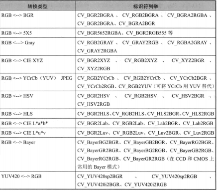
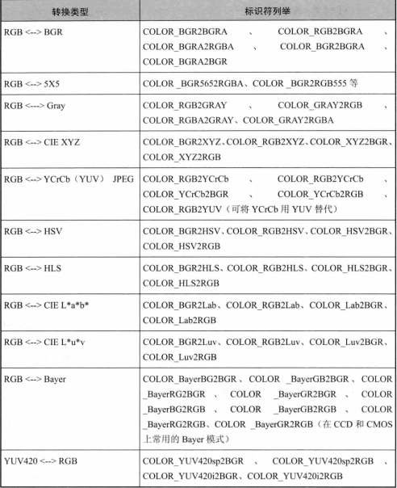

### 4.3基本图形的绘制

#### 4.3.1 DrawEllipse()函数
用于绘制椭圆
#### 4.3.2DrawFilledCircle()函数
用于绘制实心圆
#### 4.3.3 DrawPolygon（）函数
用于绘制四多边形
#### 4.3.4 DrawLine（）函数
用于绘制线条
#### 4.3.5以上结合的实例
代码过长已经省略，以下是测试代码后的结果
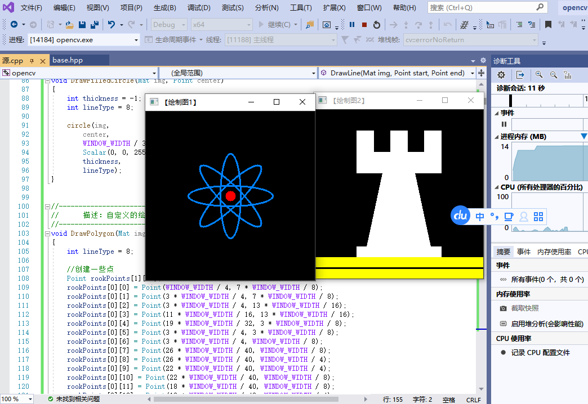

### 4.4本章小结
本章主要学习了会遇到的各种数据结构，主要是基础图像容器mat的用法和基础图形的绘画函数

## CH05 core组件进阶

### 5.1访问图像中的像素

#### 5.1.1图像在内存之中的存储方式

对多通道图像来说，矩阵中的列会包含多个子列，其子列个数与通道数相等。例如，如图5.2所示RGB颜色模型的矩阵。可以看到，OpenCV中子列的通道顺序是反过来的——BGR而不是RGB。很多情况下，因为内存足够大，可实现连续存储，因此，图像中的各行就能一行一行地连接起来，形成一个长行。连续存储有助于提升图像扫描速度，我们可以

#### 5.1.2颜色空间缩减
- 原理：它在很多应用中可以大大降低运算复杂度。颜色空间缩减的做法是:将现有颜色空间值除以某个输入值，以获得较少的颜色数。也就是“做减法”，比如颜色值0到9可取为新值0,10到19可取为10，以此类推。
- 简单算法可以由下面两步组成：
(1）遍历图像矩阵的每一个像素;
(2）对像素应用上述公式。

#### 5.1.3 LUT函数:Look up table操作
使用方法如下：
```
{/首先我们建立一个mat型用于查表Mat lookupTable(1,256,cV_8U;uchar* p=looktpTable.data;fori int i -0; i < 256;++i)
p[i] - table [i] ;
//然后我们调用函数(工是输入J是输出》:for (int i - 0; i < times; ++i)
LUT (I,lookUpTable,J);
```

#### 5.1.4计时函数

- getTickCount(函数返回CPU自某个事件(如启动电脑)以来走过的时钟周期数

- getTickFrequency(函数返回CPU一秒钟所走的时钟周期数。这样，我们就能轻松地以秒为单位对某运算计时。

#### 5.1.5 访问图像中像素的三类方法
- 方法一：指针访问:C操作符[ ]:
- 方法二：迭代器iterator;
- 方法三：动态地址计算。

#### 5.1.6 示例程序
1.用指针访问像素
代码：
```
#include<opencv2/core/core.hpp>
#include<opencv2/highgui/highgui.hpp>
#include<iostream>
using namespace std;
using namespace cv;

void colorReduce(Mat& inputImage, Mat& outputImage, int div);

int main()
{
    // 【1】创建原始图并呈示
    Mat srcImage = imread("1.jpg"); 
	imshow("原始图像",srcImage);
	//【2】按原始图的参数规格来创建创建效果图
	Mat dstImage;
	dstImage.create(srcImage.rows, srcImage.cols, srcImage.type()); //效果图的大小、类型与原图片相同
    //【 3】记录起始时间
	double time0 = static_cast<double>(getTickCount());
	//[4】调用颜色空阃缩减函数
		colorReduce(srcImage,dstImage,32);
	//【5】计算运行时间并输出
		time0 = ((double)getTickCount() - time0)/getTickFrequency(); 
        cout << "此方法运行时间为:" << time0 << "秒" << endl;//榆出运行时间
	//【6】显示效果图
		imshow("效果图", dstImage);
		waitKey(0);
}

void colorReduce(Mat& inputImage, Mat& outputImage, int div)
{
	outputImage = inputImage.clone();
	int rowNumber = outputImage.rows;
	int colNumber = outputImage.cols * outputImage.channels();
	for (int i = 0; i < rowNumber; i++)
	{
		uchar* data = outputImage.ptr<uchar>(i);
		for (int j = 0; j < colNumber; j++)
		{
			data[j] = data[j] / div * div + div / 2;

		}
	}
}
```
测试结果如下
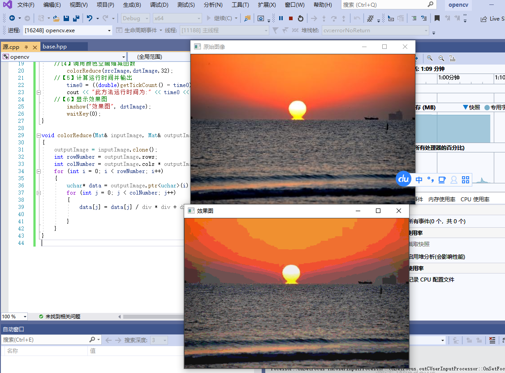

2.用迭代器操作
代码如下：
```
#include<opencv2/core/core.hpp>
#include<opencv2/highgui/highgui.hpp>
#include<iostream>
using namespace std;
using namespace cv;

void colorReduce(Mat& inputImage, Mat& outputImage, int div);

int main()
{
	// 【1】创建原始图并呈示
	Mat srcImage = imread("1.jpg");
	imshow("原始图像", srcImage);
	//【2】按原始图的参数规格来创建创建效果图
	Mat dstImage;
	dstImage.create(srcImage.rows, srcImage.cols, srcImage.type()); //效果图的大小、类型与原图片相同
	//【 3】记录起始时间
	double time0 = static_cast<double>(getTickCount());
	//[4】调用颜色空阃缩减函数
	colorReduce(srcImage, dstImage, 32);
	//【5】计算运行时间并输出
	time0 = ((double)getTickCount() - time0) / getTickFrequency();
	cout << "此方法运行时间为:" << time0 << "秒" << endl;//榆出运行时间
//【6】显示效果图
	imshow("效果图", dstImage);
	waitKey(0);
}

void colorReduce(Mat& inputImage, Mat& outputImage, int div)
{
	outputImage = inputImage.clone();
	Mat_<Vec3b>::iterator it = outputImage.begin<Vec3b>();
	Mat_<Vec3b>::iterator itend = outputImage.end<Vec3b>();
	for (; it!=itend;++it)
	{
		(*it)[0] = (*it)[0] / div * div + div / 2;
		(*it)[1] = (*it)[1] / div * div + div / 2;
		(*it)[2] = (*it)[2] / div * div + div / 2;
	}
}


```
测试结果如下
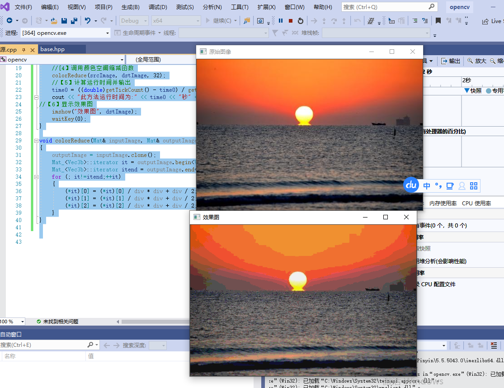
3.动态地址计算
代码省略：
测试结果如下：
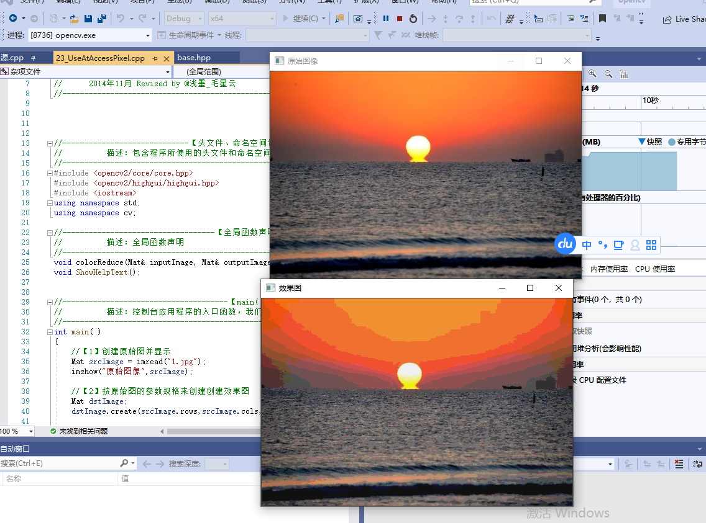
4.遍历像素的14种方法
测试结果如下：
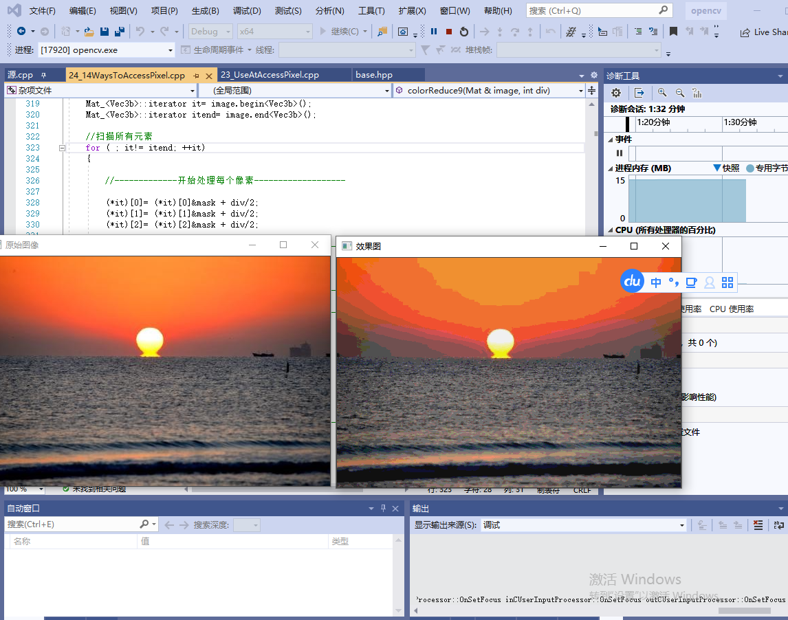


### 5.2ROI区域图像叠加&图像混合

#### 5.2.1感兴趣区域:ROI（region of interest)
- 作用：专注或者简化工作过程
- 定义方法：
1.使用表示矩形区域的Rect。它指定矩形的左上角坐标〔构造函数的前两个参数)和矩形的长宽（构造函数的后两个参数)以定义一个矩形区域。
其中，image 为已经载入好的图片。
```
//定义一个Mat类型并给其设定RO工区域Mat imageROI;
//方法一
imageROI=image (Rect [5O0,250,logo.cols,lago .rows);
```
2.另一种定义ROI的方式是指定感兴趣行或列的范围(Range)。Range是指从起始索引到终止索引（不包括终止索引)的一连段连续序列。cRange可以用来对义Range。如果使用Range来定义ROI，那么前例中定义ROI的代码可以重写为
```
//方法二
imageROI=image(Range (250,250+logoImage . rows) ,Range(200,200+1ogoImag:.cols));
```
#### 5.2.2  线性混合操作

线性混合操作是一种典型的二元（两个输入）的像素操作，它的理论公式如下:
```
g(x)=(l-a)fa(x)+ af3(x)
```
#### 5.2.3综合示例:初级图像混合
代码区
```
#include <opencv2/core/core.hpp>
#include <opencv2/highgui/highgui.hpp>
#include <iostream>

using namespace cv;
using namespace std;


//-----------------------------------【全局函数声明部分】--------------------------------------
//	描述：全局函数声明
//-----------------------------------------------------------------------------------------------
bool  ROI_AddImage();
bool  LinearBlending();
bool  ROI_LinearBlending();
void   ShowHelpText();

//-----------------------------------【main( )函数】--------------------------------------------
//	描述：控制台应用程序的入口函数，我们的程序从这里开始
//-----------------------------------------------------------------------------------------------
int main(   )
{
	system("color 6F");
 
	ShowHelpText();

	if(ROI_AddImage( )&& LinearBlending( )&&ROI_LinearBlending( ))
	{
		cout<<endl<<"\n运行成功，得出了需要的图像~! ";
	}

	waitKey(0);
	return 0;
}


//-----------------------------------【ShowHelpText( )函数】----------------------------------
//		 描述：输出一些帮助信息
//----------------------------------------------------------------------------------------------
void ShowHelpText()
{
	//输出欢迎信息和OpenCV版本
	printf("\n\n\t\t\t非常感谢购买《OpenCV3编程入门》一书！\n");
	printf("\n\n\t\t\t此为本书OpenCV2版的第25个配套示例程序\n");
	printf("\n\n\t\t\t   当前使用的OpenCV版本为：" CV_VERSION );
	printf("\n\n  ----------------------------------------------------------------------------\n");
}


//----------------------------------【ROI_AddImage( )函数】----------------------------------
// 函数名：ROI_AddImage（）
//	描述：利用感兴趣区域ROI实现图像叠加
//----------------------------------------------------------------------------------------------
bool  ROI_AddImage()
{

	// 【1】读入图像
	Mat srcImage1= imread("dota_pa.jpg");
	Mat logoImage= imread("dota_logo.jpg");
	if( !srcImage1.data ) { printf("读取srcImage1错误~！ \n"); return false; }
	if( !logoImage.data ) { printf("读取logoImage错误~！ \n"); return false; }

	// 【2】定义一个Mat类型并给其设定ROI区域
	Mat imageROI= srcImage1(Rect(200,250,logoImage.cols,logoImage.rows));

	// 【3】加载掩模（必须是灰度图）
	Mat mask= imread("dota_logo.jpg",0);

	//【4】将掩膜拷贝到ROI
	logoImage.copyTo(imageROI,mask);

	// 【5】显示结果
	namedWindow("<1>利用ROI实现图像叠加示例窗口");
	imshow("<1>利用ROI实现图像叠加示例窗口",srcImage1);

	return true;
}
 
```
测试结果如下：
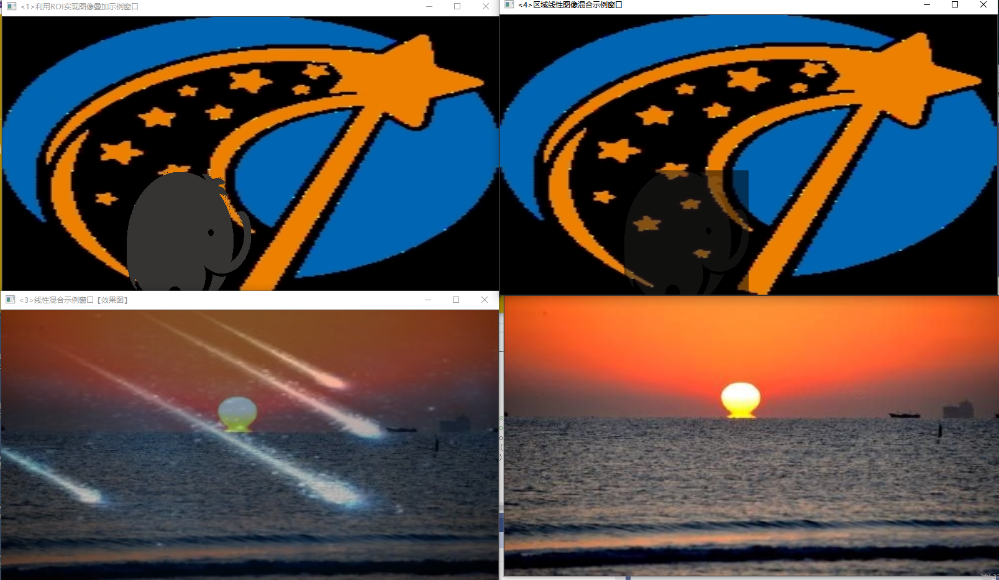

### 5.3分离颜色通道、多通道图像混合
通过OpenCV的split和 merge方法

#### 5.3.1通道分离: split(函数
这个split函数的C++版本有两个原型，分别是:. C++: void split(const Mat& src,Mat*rmvbegin);
C++: void split(InputArray m,OutputArrayOfArrays mv);变量介绍如下:
- 第一个参数，InputArray类型的m或者const Mat&类型的src，填我们需要进行分离的多通道数组。
- 第二个参数，OutputArrayOfArrays类型的mv,填函数的输出数组或者输出的vector容器。
- split函数分割多通道数组转换成独立的单通道数组，公式如下:
mv[c](I）= src(I)c.

#### 5.3.2 通道合并：merge（）函数
mergeO函数是split()函数的逆向操作——将多个数组合并成一个多通道的数组。它通过组合一些给定的单通道数组，将这些孤立的单通道数组合并成一个多通道的数组，从而创建出一个由多个单通道阵列组成的多通道阵列。它有两个基于C++的函数原型如下。
- C++: void merge(const Mat mv, size_tcount,OutputArray dst)
-  C++: void merge(InputArrayOfArrays mv,OutputArray dst)变量介绍如下。
- 第一个参数，mv。填需要被合并的输入矩阵或vector容器的阵列，这个mv参数中所有的矩阵必须有着一样的尺寸和深度。
- 第二个参数，count。当mv为一个空白的C 数组时，代表输入矩阵的个数，这个参数显然必须大于1。
- 第三个参数,dst。即输出矩阵，和mv[0]拥有一样的尺寸和深度，并且通道的数量是矩阵阵列中的通道的总数。

#### 5.3.3示例程序:多通道图像混合
测试结果如下：
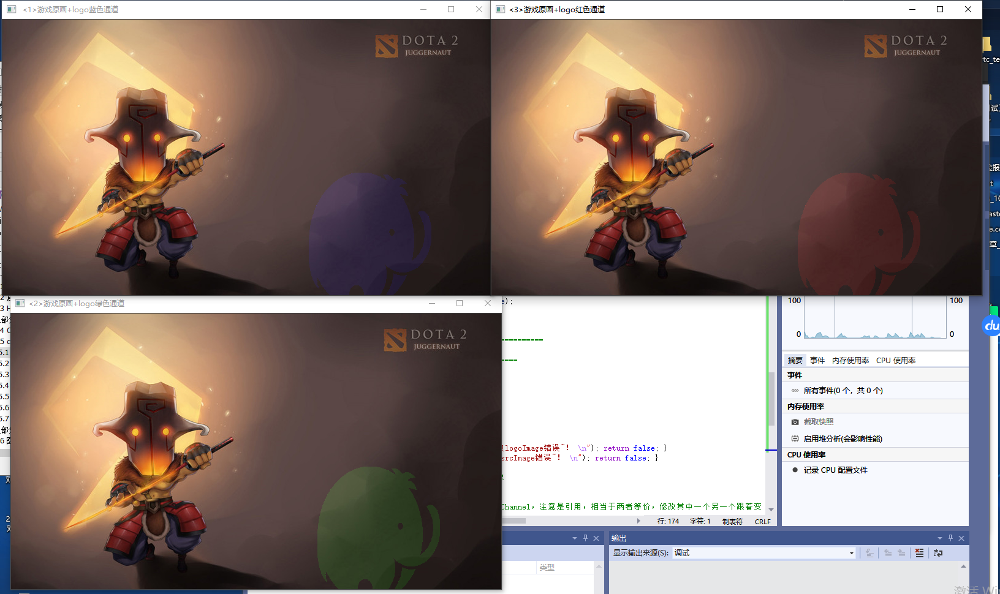

### 5.4 图像对比度和亮度值调整

#### 5.4.1 理论依据
- 本节所讲解的图像亮度和对比度的调整操作，其实属于图像处理变换中比较简单的一种——点操作( pointoperators)。点操作有一个特点:仅仅根据输入像素值(有时可加上某些全局信息或参数)，来计算相应的输出像素值。这类算子包括亮度( brightness）和对比度( contrast）调整、颜色校正( colorcorrection）和变换( transformations)。
- 两种最常用的点操作(或者说点算子）是乘上一个常数（对应对比度的调节)以及加上一个常数(对应亮度值的调节)。公式如下:
g(x)=a*f（x)+b
看到这个式子，我们关于图像亮度和对比度调整的策略就比较好理解了。其中:
·参数fx)表示源图像像素。·参数g(x)表示输出图像像素。
参数a（需要满足a>0）被称为增益( gain)，常常被用来控制图像的对比度。
·参数b通常被称为偏置（bias)，常常被用来控制图像的亮度。而更近一步，我们这样改写这个式子:
g(i,j)=a*f（i,f)+b
其中，i和j表示像素位于第﹔行和第j列，这个式子可以用来作为我们在OpenCV中控制图像的亮度和对比度的理论公式。

#### 5.4.2访问图片中的像素
```
以下是访问像素的代码片段，使用了三个for 循环。
//三个for循环，执行运算 new_image(i,j)=a*i.mage (i,j) +b
for(int y= 0; y < image .rows; y++ ){
for(int x = 0:x< image.cols;x++ ){
for(int c = 0; c< 3; c++ ){
new_image.at<vec3b> (y,x)[c]-
saturate_cast<uchar>( (g_ncontrastvalue*o.01)*(image.at<Vec3b>(y,x) [c])+ g_nBrightvalue ) ;} 
}
}
```

#### 5.4.3 示例程序:图像对比度、亮度值调整
测试结果如下：
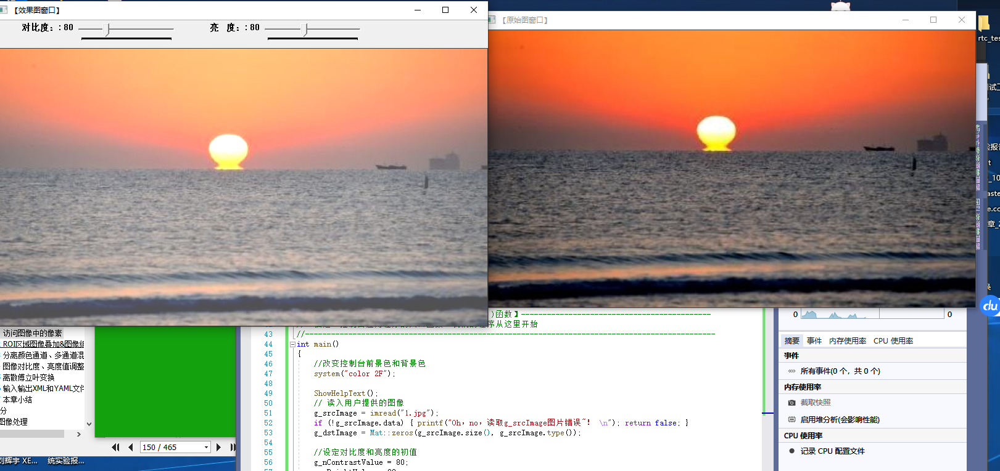


### 5.5离散傅里叶变换

#### 5.5.1 离散傅里叶原理
简单来说，对一张图像使用傅里叶变换就是将它分解成正弦和余弦两部分，也就是将图像从空间域(.spatial domain）转换到颊域( frequency domain)。
这一转换的理论基础为:任一函数都可以表示成无数个正弦和余弦函数的和的形式。傅里叶变换就是一个用来将函数分解的工具。

#### 5.5.2dft（）函数详解
- 作用：对一维或二维浮点数数组进行正向或反向离散傅里叶变换。
- 标识符取值列表
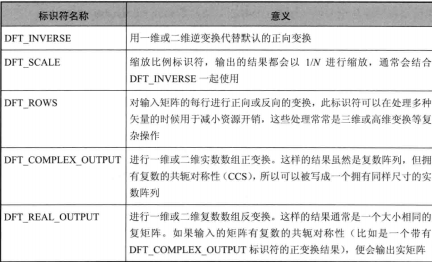

#### 5.5.3返回DFT最优尺寸大小: getOptimalDFTSizeO函数
```
getOptimalDFTSize函数返回给定向量尺寸的傅里叶最优尺寸大小。为了提高离散傅里叶变换的运行速度，需要扩充图像，而具体扩充多少，就由这个函数来计算得到。
C++: int getoptimalDFTSize[int wecsize,
此函数的唯一一个参数为int类型的 vecsize，向量尺寸,即图片的rows.cols。
```
#### 5.5.4扩充图像边界:copyMakeBorderO函数
copyMakeBorder函数的作用是扩充图像边界。

#### 5.5.5计算二维矢量的幅值: magnitude()函数
```
magnitude()函数用于计算二维失量的幅值。
C++: void magnitude (InputArray x，InputArray y,outputArray magnitude)·第一个参数，InputArray类型的x，表示矢量的浮点型X坐标值，也就是实部。
第一个参数，InputArray类型的y，表示矢量的浮点型￥坐标值，也就是虚部。
第三次参数，OutputArray类型的 magnitudc，输出的幅值，它和第一个参数x有着同样的尺寸和类型。
```
#### 5.5.6计算自然对数:log(函数·
logO函数的功能是计算每个数组元素绝对值的自然对C++; void log (InputArray src，outputArray dst)第一个参数为输入图像，第二个参数为得到的对数值

#### 5.5.7矩阵归一化:normalize()函数

normalize(的作用是进行矩阵归一化。
```
C++: void normalize(InputArray src，OutputArray dst,double alpha=1,double beta=0，int norm_type=NORM_L2,int dtype=-l，InputArray
mask=noArray () }
```
- 第一个参数，InputArray类型的src。输入图像，即源图像，填Mat类的对象即可。
- 第二个参数，OutputArray类型的 dst。函数调用后的运算结果存在这里，和源图片有一样的尺寸和类型。
- 第三个参数，double类型的alpha。归一化后的最大值，有默认值
- 第四个参数，doublc类型的beta。归一化后的最大值，有默认值0。
- 第五个参数, int类型的norm_type.归一化类型,有NORM_INF.NORM_LI、NORM_L2和 NORM_MINMAX等参数可选，有默认值NORM_L2。
- 第六个参数，int类型的dtype，有默认值-1。当此参数取负值时，输出矩阵和 src有同样的类型，否则，它和 src有同样的通道数，且此时图像深度为cV_MAT_DEPTH (dtype)。
- 第七个参数, InputArray类型的mask,可选的操作掩膜,有默认值noArray()。

#### 5.5.8 示例程序：离散傅里叶变换
测试结果如下：
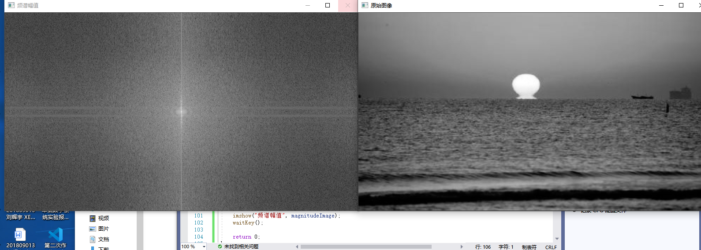

### 5.6输入输出XML和YAML文件

#### 5.6.1XML和YAML文件简介
XML定义：可扩展标识语言
YAML定义：不是一种置标语言

#### 5.6.2FileStorage类操作文件的使用引导
三个步骤：
(1）准备文件写操作
FileStorage是 OpenCV中 XML和 YAML文件的存储类，封装了所有相关的信息。它是OpenCV从文件中读数据或向文件中写数据时必须要使用的一个类。
此类的构造函数为FileStorage::FileStorage，有两个重载，如下。
```
C++:Filestorage : :Filestorage (
C++; FileStorage::FileStorage (const stringh source,int flags,conststring& encoding-string [)}
构造函数在实际使用中,方法一般有两种。
1）对于第二种带参数的构造函数，进行写操作范例如下。Filestorage fs ( "abc .xml", Filestorage : :WR工TE);
2）对于第一种不带参数的构造函数，可以使用其成员函数FileStorage::open进行数据的写操作，范例如下。
Filestorage fs;
fs.open ( "abc. xml"。Filestorage: : WRITE);(2）准备文件读操作
上面讲到的都是以FileStorage:: WRITE为标识符的写操作，而读操作，采用FileStorage::READ标识符即可，相关示例代码如下。
1)）第一种方式
Filestorage fs ("abc.xml"，Filestorage: :READ) ;2)第二种方式
Filestorage fs;
fs.open ( "abc . xml"，Filestorage : : READ);


2.【第二步】进行文件读写操作
(1)文本和数字的输入和输出
146
第5章core组件进
定义好FileStorage类对象之后，写入文件可以使用“<<”运算符，例如:fs << "iterationNr" << 100;
而读取文件，使用“>>”运算符,例如:int itN工;
fs[ "iterationNr"]>> itNr;
itNr - (int) fs [ "iterationNr""];(2)OpenCV 数据结构的输入和输出
关于 OpenCV 数据结构的输入和输出，和基本的C++形式相同，范例如下.//墅据结构的初始化
Mat R= Mat_<uchar >: :eye (3,3》 ,Mat T - Mat_<double> : : zeros(3,1);/!向Mat中写入数据
fs <<""R”<< R;fs <<""T<< T;
{/从Mat中读取数据fs[ ""R""]>>R;
fs["T""]>>T;
3.【第三步】vector (arrays）和maps 的输入和输出
对于vector结构的输入和输出，要注意在第一个元素前加上“[”，在最后一个元素前加上“]”。例如;
fs<<"strings"" <<[";1/开始读入string文本序列
fs<<"image1.jpg"<<“Awesomeness"<< "baboon.jpg";fs<<“]":l/关闭序到
而对于map 结构的操作,使用的符号是“{”和“}”,例如:fs <<Mapping" ; {1开始读入Mapping文本
fs<<”星”<<"one" << 1;
fs<<Two<< 2<<"} ";
读取这些结构的时候，会用到 FileNode和 FileNodeIterator数据结构。对FileStorage类的“[”、“]”操作符会返回FileNode数据类型;对于一连串的node,可以使用FileNodelterator结构,例如;
FileNode n - fs [ ""strings"];「/读取字符串序列以得到节点if(n.type(, !-FileNode : : SEQ
{
cerr <<"发生错误!字符串不是一个序列!“<< endl;return 1;
)
FileNodeIterator it m n.begin ( ) , it_end = n.end ( ) ://遍历节点for i; it != it_end; ++it
cout <<istring)*it<< endl;
4.【第四步】文件关闭
需要注意的是，文件关闭操作会在 FileStorage类销毁时自动进行，但我们也
可显式调用其析构函数FileStorage:.release(实现。FileStorage:.release()函数会析构
掉 FileStorage类对象，同时关闭文件。
调用过程非常简单，如下。
fs.release () ;
下面将通过实例来帮助大家将以上知识融会贯通。

```
#### 5.6.3 示例程序:XML和YAML文件的写入
测试结果如下：
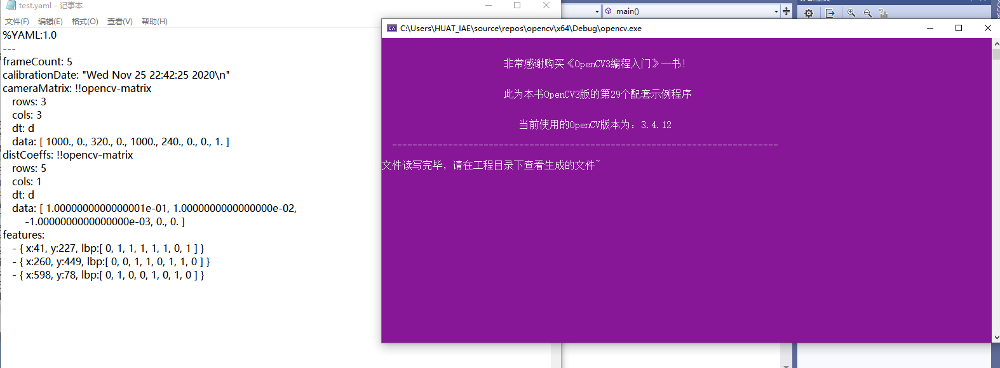

#### 5.6.4示例程序:XML和YAML文件的读取
测试结果如下：
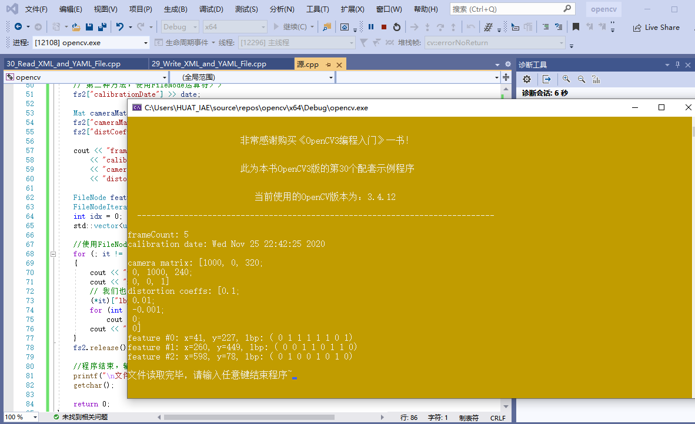

### 5.7本章小结
本节中，我们学习了core模块的一些进阶知识点——操作图像中的像素、图像混合、分离颜色通道、调节图像的对比度和亮度、进行离散傅里叶变换，以及输入输出XML和 YAML文件。


