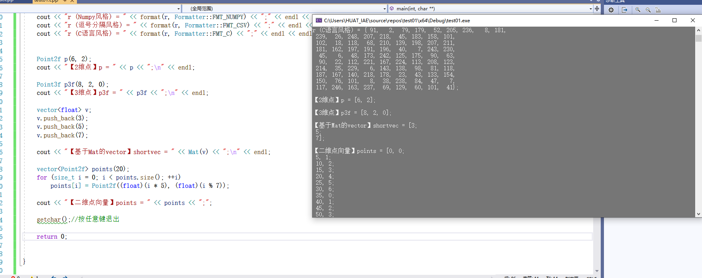
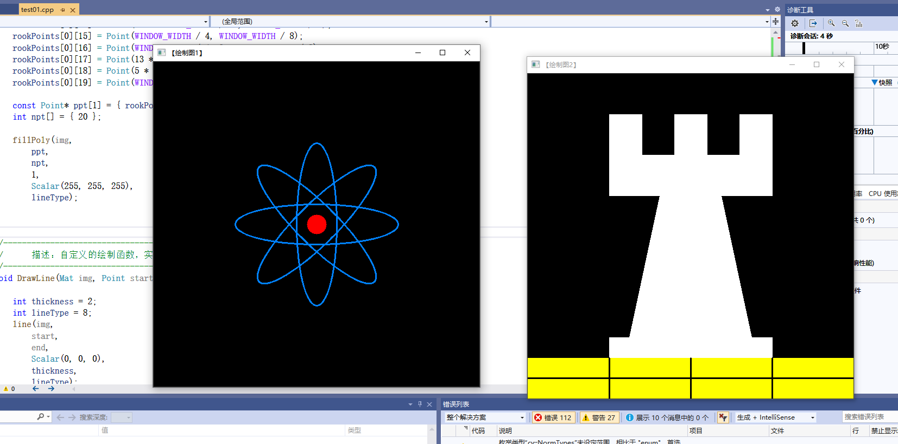
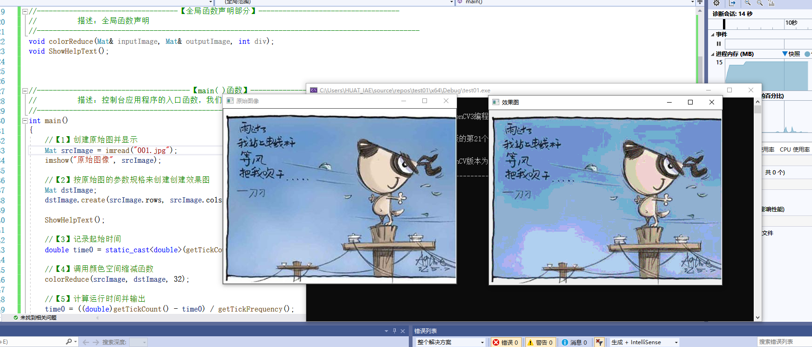
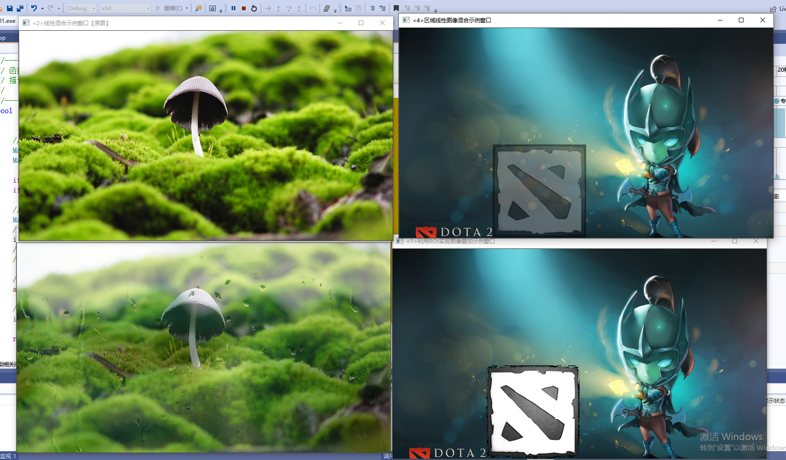
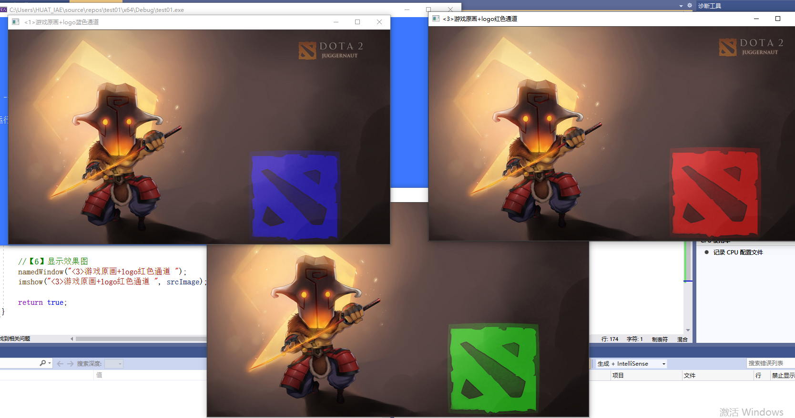
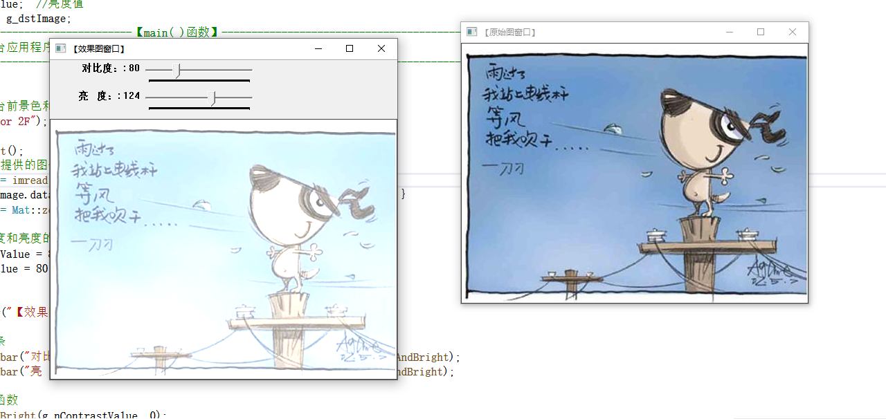
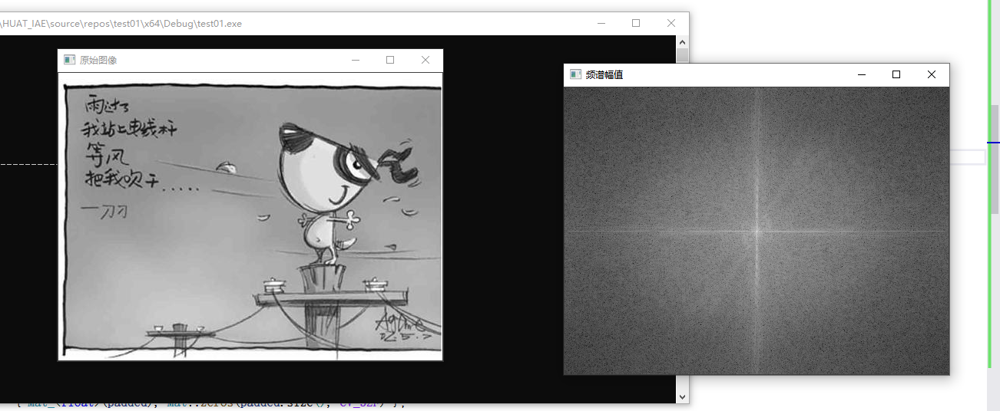

# 第二次作业
## 一、概念
### 第4章 OpenCV数据结构与基本绘图

#### 基础图像容器Mat

Mat是一个类，由两个数据部分组成:矩阵头（包含矩阵尺寸、存储方法、存储地址等信息）和一个指向存储所有像素值的矩阵（根据所选存储方法的不同，矩阵可以是不同的维数）的指针。矩阵头的尺寸是常数值，但矩阵本身的尺寸会依图像的不同而不同，通常比矩阵头的尺寸大数个数量级。因此，当在程序中传递图像并创建副本时，大的开销是由矩阵造成的，而不是信息头。

```PythonPython
Mat A,C; //仅创建信息头部分
A = imread (“1.jpg",CV_LOAD_IMAGE_COLOR);// 这里为矩阵开辟内存
Mat B(A);//使用拷贝构造函数
c = A;//赋值运算符
```
以上代码中的所有Mat对象最终都指向同一个也是唯一一个数据矩阵。虽然它们的信息头不同，但通过任何一个对象所做的改变也会影响其他对象。

- OpenCV 函数中输出图像的内存分配是自动完成的(如果不特别指定的话)。
- 使用OpenCV的C++接口时不需要考虑内存释放问题。
- 赋值运算符和拷贝构造函数（构造函数）只复制信息头。
- 使用函数clone()或者copyTo()来复制一幅图像的矩阵。

存储像素值需要指定颜色空间和数据类型。其中，颜色空间是指针对一个给定的颜色，如何组合颜色元素以对其编码。最简单的颜色空间要属灰度级空间，只处理黑色和白色，对它们进行组合便可以产生不同程度的灰色。

颜色系统有很多，它们各有优势，具体如下。
- RGB是最常见的，这是因为人眼采用相似的工作机制，它也被显示设备所采用
- HSV和 HLS把颜色分解成色调、饱和度和亮度/明度。这是描述颜色更自然的方式，比如可以通过抛弃最后一个元素，使算法对输入图像的光照条件不敏感
- YCrCb在 JPEG图像格式中广泛使用
- CIE L*a*b*是一种在感知上均匀的颜色空间，它适合用来度量两个颜色之间的距离

#### 显式创建Mat对象的七种方法
【方法一】使用Mat()构造函数
最常用的方法是直接使用Mat()构造函数,这种方法简单明了,示范代码如下。
 Mat M(2,2,cv_8Uc3, scalar (0,0,255));
 cout<<"M= " <<endl<<" "<< M<<endl <<endl;

【方法二】在C\C++中通过构造函数进行初始化
这种方法为在C\C++中通过构造函数进行初始化，示范代码如下。
int sz[ 3]={2,2,2};
Mat L( 3,sz,cV_8UC,Scalar : :all(0) ) ;

【方法三】为已存在的lpllmage指针创建信息头
方法三是为已存在的 IplImage指针创建信息头，示范代码如下。
IplImage* img =cvLoadImage ( "1.jpg",1);
Mat mtx (img) ; //转换IplImage*-> Mat

【方法四】利用Create()函数
方法四是利用Mat类中的Create()成员函数进行Mat类的初始化操作，示范代码如下。
M.create ( 4,4, cv_8UC(2) );
cout <<"M= "<<endl <<" "<<M<< endl << endl;

【方法五】采用Matlab式的初始化方式
方法五采用Matlab形式的初始化方式:zeros()，ones()，eyes()。使用以下方式指定尺寸和数据类型:
Mat E = Mat : :eye ( 4, 4, cV_64F);
cout << "E = " <<endl << " "<< E<<endl <<endl;

Mat o = Mat : :ones (2,2,cv_32F);
cout << "O = " <<endl <<" "<<0 <<endl << endl;

Mat Z = Mat: : zeros (3,3,cV_8UC1);
cout <<"Z= " <<endl <<" "<< Z <<endl << endl;

【方法六】对小矩阵使用逗号分隔式初始化函数
方法六为对小矩阵使用逗号分隔式初始化函数，示范代码如下。
Mat C = (Mat_<double>(3,3)<< 0，-1,0，-1，5，-1，0，-1，0 );
cout <<"C = " <<endl <<" "<< C<<endl << endl;

【方法七】为已存在的对象创建新信息头
方法七为使用成员函数clone()或者copyTo()为一个已存在的Mat对象创建一个新的信息头，示范代码如下。
Mat RowClone = C.row (1).clone ();
cout<<"RowClone = " << endl << " "<< RowClone << endl << endl;

#### OpenCV中的格式化输出方法
【风格一】OpenCV默认风格
风格一为OpenCV 默认风格的输出方法，如下。
cout << "r (Opencv默认风格)="<< r<<";"<< endl << endl;

【风格二】Python 风格
风格二为Python 风格的输出方法，如下。
//此句代码的Opencv2版为:
cout << "r (Python 风格) = " <<format (r, "python")<< "; " << endl << endl;

//此句代码的Opencv3版为:
cout<< "r (Python风格) = " <<format(r，Formatter: : FMT_PYTHON) << ";"<<endl << endl;

【风格三】逗号分隔风格(Comma separated values，csv)
//此句代码的Opencv2版为:
cout <<"r(逗号分隔风格) = " <<format (r, "csv")<<";" << endl << endl;

//此句代码的Opencv3版为:
cout << "r(逗号分隔风格) = " <<format (r，Formatter : : FMT_csv)<<";"<<endl<< endl;

【风格四】Numpy 风格
风格四为Numpy 风格的输出方法，如下。
//此句代码的Opencv2版为:
cout << "r (Numpy风格) = " << format (r, "numpy") << ";" << endl << endl;

//此句代码的Opencv3版为:
cout << "r (Numpy风格) =" <<format (r，Formatter : : FMT_NUMPY )<<"; "<<endl <<endl;

【风格五】C语言风格
风格五为C语言风格的输出方法，如下。
//此句代码的OpenCv2版为:
cout << "r (C语言风格)= " <<format (r,"c")<< ";" << endl << endl;

//此句代码的Opencv3版为:
cout << "r (C语言风格)= "<<format (r，Formatter : : FMT_C) << "; "<<endl <<endl;

#### 输出其他常用的数据结构

1.定义和输出二维点
二维点的定义和输出方法:
Point2f p(6，2);
cout << "【二维点】p = "<<p << "; \n" << endl;

2．定义和输出三维点
以下是三维点的定义和输出方法:
Point3f p3f(8，2，0) ;
cout << "【三维点】 p3f = " << p3f << " ; \n" <<endl;

3．定义和输出基于Mat 的std:vector
接着是基于Mat类的std::vector的定义和输出方法:
vector<float> v;
v.push_back ( 3);
v.push_back (5);
v.push_back (7 );
cout <<"【基于Mat的vector ] shortvec = " <<Mat(v)<<" ; \n"<<endl;

#### 常用数据结构和函数

点的表示:Point类
Point类数据结构表示了二维坐标系下的点,即由其图像坐标x和y指定的2D点。用法如下:
Point point;
point.x = 10;
point.y = 8;
或者
Point point = Point (10，8);


颜色的表示:Scalar类
Scalar( a,b,c )
那么定义的RGB颜色值:红色分量为c，绿色分量为b，蓝色分量为a。

尺寸的表示:Size类
使用频率最高的是下面这个构造函数:
size_(_Tp _width,_Tp _height);
另外，代码末尾定义了模板类型的宽度和高度:_Tp width，height;//宽度和高度

矩形的表示:Rect类
求两个矩形的交集和并集，可以用如下格式:
Rect rect = rect1 & rect2;
Rect rect = rect1 l rect2;
如果想让矩形进行平移操作和缩放操作，可以这样写:
Rect rectShift = rect + point;
Rect rectscale = rect + size;

颜色空间转换:cvtColor()函数
cvtColor()函数是OpenCV里的颜色空间转换函数，可以实现 RGB颜色向HSV、HSI 等颜色空间的转换，也可以转换为灰度图像。
原型如下:
C++: void cvtcolor(InputArray src，outputArray dst, int code,intdstCn=0)

OpenCV默认的图片通道存储顺序是BGR，即蓝绿红，而不是RGB。

### 第5章  core组件进阶
#### 图像在内存之中的存储方式

OpenCV中子列的通道顺序是反过来的——BGR而不是RGB。很多情况下，因为内存足够大，可实现连续存储，因此，图像中的各行就能一行一行地连接起来，形成一个长行。连续存储有助于提升图像扫描速度，可以使用isContinuous()来判断矩阵是否是连续存储的。

#### 颜色空间缩减

它在很多应用中可以大大降低运算复杂度。颜色空间缩减的做法是:将现有颜色空间值除以某个输入值，以获得较少的颜色数。也就是“做减法”，比如颜色值0到9可取为新值0，10到19可取为10，以此类推。

简单的颜色空间缩减算法就可由下面两步组成:
(1）遍历图像矩阵的每一个像素;
(2）对像素应用上述公式。

### LUT函数:Look up table操作
一个原型为operationsOnArrays:LUT()<lut>的函数:它用于批量进行图像元素查找、扫描与操作图像

### 计时函数
- getTickCount()函数返回CPU自某个事件（如启动电脑）以来走过的时钟周期数
- getTickFrequency)函数返回CPU一秒钟所走的时钟周期数。这样，就能轻松地以秒为单位对某运算计时。

### 访问图像中像素的方法
用指针访问像素：
用指针访问像素的这种方法利用的是C语言中的操作符[]。这种方法最快，但是略有点抽象。实验条件下单次运行时间为0.00665378。范例代码如下。

```PythonPython
void colorReduce (Mat& inputImage，Mat& outputImage,int div)
{
    //参数准备
    outputImage = inputImage.clone ( ); //复制实参到临时变量
    int rowNumber = outputImage .rows; //行数
    int colNumber = outputImage.cols*outputImage.channels();//列数×通道数=每一行元素的个数
    //双重循环，遍历所有的像素值
for(int i = 0;i< rowNumber ; i++) //行循环
{
    uchar* data = outputImage.ptr<uchar>(i);//获取第i行的首地址for(int j = 0;j <colNumber;j++)//列循环
    { 
    //—--------【开始处理每个像素】----
    data[j] = data[j]/div*div + div/2 ;
    // ----------【处理结束】-----------
    }//行处理结束
  }
}   
```
### ROI区域图像叠加&图像混合
定义ROI区域有两种方法:
第一种是使用表示矩形区域的Rect。它指定矩形的左上角坐标（构造函数的前两个参数）和矩形的长宽(构造函数的后两个参数)以定义一个矩形区域。
另一种定义ROI的方式是指定感兴趣行或列的范围（Range)。Range是指从起始索引到终止索引（不包括终止索引）的一连段连续序列。cRange可以用来定义Range。

### 计算数组加权和:addWeighted()函数
这个函数的作用是计算两个数组（图像阵列）的加权和。原型如下:
void (InputArray src1, double alpha,InputArray src2,double beta,doublegamma,outputArray dst, int dtype=-1) ;

### 初级图像混合：
在设定感兴趣区域ROI和使用addWeighted 函数进行图像线性混合的基础上，我们还可以将二者结合起来使用，也就是先指定ROI，再用addWeighted 函数对指定的ROI区域的图像进行混合操作。

### 分离颜色通道、多通道图像混合
为了更好地观察一些图像材料的特征,有时需要对RGB三个颜色通道的分量进行分别显示和调整。通过OpenCV的split和 merge方法可以很方便地达到目的。

### 通道分离:split()函数
split 函数用于将一个多通道数组分离成几个单通道数组。这里的 array按语境翻译为数组或者阵列。
这个split函数的C++版本有两个原型，分别是:
- C++: void split(const Mat& src, Mat*mvbegin);
- C++: void split(InputArray m,OutputArrayOfArrays mv);

### 通道合并: merge()函数
merge)函数是split()函数的逆向操作——将多个数组合并成一个多通道的数组。它通过组合一些给定的单通道数组，将这些孤立的单通道数组合并成一个多通道的数组，从而创建出一个由多个单通道阵列组成的多通道阵列。它有两个基于C++的函数原型如下。
- C++: void merge(const Mat* mv, size_tcount,OutputArray dst)
- C++: void merge(InputArrayOfArrays mv,OutputArray dst)

### 图像对比度、亮度值调整
一般的图像处理算子都是一个函数，它接受一个或多个输入图像，并产生输出图像。图像亮度和对比度的调整操作，其实属于图像处理变换中比较简单的一种——点操作( pointoperators)。点操作有一个特点:仅仅根据输入像素值（有时可加上某些全局信息或参数)，来计算相应的输出像素值。这类算子包括亮度(brightness）和对比度( contrast）调整、颜色校正(colorcorrection）和变换( transformations)。
两种最常用的点操作(或者说点算子)是乘上一个常数（对应对比度的调节)以及加上一个常数（对应亮度值的调节)。

### 访问图片中的像素
我们需要访问图像的每一个像素。因为是对GBR图像进行运算，每个像素有三个值（G、B、R)，所以我们必须分别访问它们（OpenCV中的图像存储模式为GBR）。

### 离散傅里叶变换
离散傅里叶变换(Discrete Fourier Transform，缩写为DFT)，是指傅里叶变换在时域和频域上都呈现离散的形式，将时域信号的采样变换为在离散时间傅里叶变换（DTFT）频域的采样。在形式上，变换两端（时域和频域上）的序列是有限长的，而实际上这两组序列都应当被认为是离散周期信号的主值序列。即使对有限长的离散信号做DFT，也应当对其经过周期延拓成为周期信号再进行变换。在实际应用中，通常采用快速傅里叶变换来高效计算 DFT。

原理：简单来说，对一张图像使用傅里叶变换就是将它分解成正弦和余弦两部分，也就是将图像从空间域(spatial domain）转换到频域( frequency domain)。
这一转换的理论基础为:任一函数都可以表示成无数个正弦和余弦函数的和的形式。傅里叶变换就是一个用来将函数分解的工具。

### dft（）函数
dft函数的作用是对一维或二维浮点数数组进行正向或反向离散傅里叶变换。
C++: void dft(InputArray src，outputArray dst,int flags=0，int
nonzeroRows=0)

●第一个参数，InputArray类型的src。输入矩阵，可以为实数或者虚数。
●第二个参数，OutputArray类型的 dst。函数调用后的运算结果存在这里，其尺寸和类型取决于标识符，也就是第三个参数flags。
●第三个参数，int类型的flags。转换的标识符，有默认值0。

### 返回DFT最优尺寸大小:getOptimalDFTSize(）函数
getOptimalDFTSize函数返回给定向量尺寸的傅里叶最优尺寸大小。为了提高离散傅里叶变换的运行速度，需要扩充图像，而具体扩充多少，就由这个函数来计算得到。
C++: int getOptimalDFTSize(int vecsize)
此函数的唯一一个参数为int类型的vecsize，向量尺寸，即图片的rows、colso

### 扩充图像边界:copyMakeBorder()函数
copyMakeBorder函数的作用是扩充图像边界。
C++: void copyMakeBorder (InputArray src，outputArray dst,int top, int bottom，int left, int right，int borderType,const scalar&value=Scalar () )

### 计算二维矢量的幅值: magnitude()函数
magnitude()函数用于计算二维矢量的幅值。
C++: void magnitude (InputArray x，InputArray y,outputArray magnitude)

### 计算自然对数: logO函数﹐
log(函数的功能是计算每个数组元素绝对值的自然对数。
C++: void log(InputArray src，outputArray dst)

### 矩阵归一化: normalize(函数
normalize()的作用是进行矩阵归一化。
C++: void normalize (InputArray src，outputArray dst,double alpha=1,double beta=0, int norm_type=NORM_L2，int dtype=-l,InputArray mask=noArray () )

## 二、代码即运行结果

1、基础图像容器Mat
```PythonPython
#include "opencv2/core/core.hpp"
#include "opencv2/highgui/highgui.hpp"
#include <iostream>
using namespace std;
using namespace cv;
static void ShowHelpText()
{
	//输出欢迎信息和OpenCV版本
	printf("\n\n\t\t\t非常感谢购买《OpenCV3编程入门》一书！\n");
	printf("\n\n\t\t\t此为本书OpenCV3版的第19个配套示例程序\n");
	printf("\n\n\t\t\t   当前使用的OpenCV版本为：" CV_VERSION);
	printf("\n\n  ----------------------------------------------------------------------------\n");

	//输出一些帮助信息
	printf("\n\n\n\t欢迎来到【基本图像容器-Mat类】示例程序~\n\n");
	printf("\n\n\t程序说明：\n\n\t此示例程序用于演示Mat类的格式化输出功能，输出风格可为：");
	printf("\n\n\n\t【1】OpenCV默认风格");
	printf("\n\n\t【2】Python风格");
	printf("\n\n\t【3】逗号分隔风格");
	printf("\n\n\t【4】Numpy风格");
	printf("\n\n\t【5】C语言风格\n\n");
	printf("\n  --------------------------------------------------------------------------\n");
}


//--------------------------------------【main( )函数】-----------------------------------------
//          描述：控制台应用程序的入口函数，我们的程序从这里开始执行
//-----------------------------------------------------------------------------------------------
int main(int, char**)
{
	//改变控制台的前景色和背景色
	system("color 8F");

	//显示帮助文字
	ShowHelpText();

	Mat I = Mat::eye(4, 4, CV_64F);
	I.at<double>(1, 1) = CV_PI;
	cout << "\nI = " << I << ";\n" << endl;

	Mat r = Mat(10, 3, CV_8UC3);
	randu(r, Scalar::all(0), Scalar::all(255));

	//此段代码的OpenCV2版为：
	//cout << "r (OpenCV默认风格) = " << r << ";" << endl << endl;
	//cout << "r (Python风格) = " << format(r,"python") << ";" << endl << endl;
	//cout << "r (Numpy风格) = " << format(r,"numpy") << ";" << endl << endl;
	//cout << "r (逗号分隔风格) = " << format(r,"csv") << ";" << endl<< endl;
	//cout << "r (C语言风格) = " << format(r,"C") << ";" << endl << endl;
	//此段代码的OpenCV3版为：
	cout << "r (OpenCV默认风格) = " << r << ";" << endl << endl;
	cout << "r (Python风格) = " << format(r, Formatter::FMT_PYTHON) << ";" << endl << endl;
	cout << "r (Numpy风格) = " << format(r, Formatter::FMT_NUMPY) << ";" << endl << endl;
	cout << "r (逗号分隔风格) = " << format(r, Formatter::FMT_CSV) << ";" << endl << endl;
	cout << "r (C语言风格) = " << format(r, Formatter::FMT_C) << ";" << endl << endl;


	Point2f p(6, 2);
	cout << "【2维点】p = " << p << ";\n" << endl;

	Point3f p3f(8, 2, 0);
	cout << "【3维点】p3f = " << p3f << ";\n" << endl;

	vector<float> v;
	v.push_back(3);
	v.push_back(5);
	v.push_back(7);

	cout << "【基于Mat的vector】shortvec = " << Mat(v) << ";\n" << endl;

	vector<Point2f> points(20);
	for (size_t i = 0; i < points.size(); ++i)
		points[i] = Point2f((float)(i * 5), (float)(i % 7));

	cout << "【二维点向量】points = " << points << ";";

	getchar();//按任意键退出
    return 0;
}
```

2、用opencv进行基本绘图
```PythonPython
--------------------------------------
#include <opencv2/core/core.hpp>
#include <opencv2/highgui/highgui.hpp>
using namespace cv;

//此程序对于OpenCV3版需要额外包含头文件：
#include <opencv2/imgproc/imgproc.hpp>
//-----------------------------------【宏定义部分】-------------------------------------------- 
//		描述：定义一些辅助宏 
//------------------------------------------------------------------------------------------------ 

#define WINDOW_NAME1 "【绘制图1】"        //为窗口标题定义的宏 
#define WINDOW_NAME2 "【绘制图2】"        //为窗口标题定义的宏 
#define WINDOW_WIDTH 600//定义窗口大小的宏
//--------------------------------【全局函数声明部分】-------------------------------------

//		描述：全局函数声明
//-----------------------------------------------------------------------------------------------
void DrawEllipse(Mat img, double angle);//绘制椭圆
void DrawFilledCircle(Mat img, Point center);//绘制圆
void DrawPolygon(Mat img);//绘制多边形
void DrawLine(Mat img, Point start, Point end);//绘制线段

//-----------------------------------【ShowHelpText( )函数】----------------------------------
//          描述：输出一些帮助信息
//----------------------------------------------------------------------------------------------
void ShowHelpText()
{
	//输出欢迎信息和OpenCV版本
	printf("\n\n\t\t\t非常感谢购买《OpenCV3编程入门》一书！\n");
	printf("\n\n\t\t\t此为本书OpenCV3版的第20个配套示例程序\n");
	printf("\n\n\t\t\t   当前使用的OpenCV版本为：" CV_VERSION);
	printf("\n\n  ----------------------------------------------------------------------------\n");
}

//---------------------------------------【main( )函数】--------------------------------------
//		描述：控制台应用程序的入口函数，我们的程序从这里开始执行
//-----------------------------------------------------------------------------------------------
int main(void)
{

	// 创建空白的Mat图像
	Mat atomImage = Mat::zeros(WINDOW_WIDTH, WINDOW_WIDTH, CV_8UC3);
	Mat rookImage = Mat::zeros(WINDOW_WIDTH, WINDOW_WIDTH, CV_8UC3);

	ShowHelpText();
	// ---------------------<1>绘制化学中的原子示例图------------------------

	//【1.1】先绘制出椭圆
	DrawEllipse(atomImage, 90);
	DrawEllipse(atomImage, 0);
	DrawEllipse(atomImage, 45);
	DrawEllipse(atomImage, -45);

	//【1.2】再绘制圆心
	DrawFilledCircle(atomImage, Point(WINDOW_WIDTH / 2, WINDOW_WIDTH / 2));

	// ----------------------------<2>绘制组合图-----------------------------
	//【2.1】先绘制出椭圆
	DrawPolygon(rookImage);

	// 【2.2】绘制矩形
	rectangle(rookImage,
		Point(0, 7 * WINDOW_WIDTH / 8),
		Point(WINDOW_WIDTH, WINDOW_WIDTH),
		Scalar(0, 255, 255),
		-1,
		8);

	// 【2.3】绘制一些线段
	DrawLine(rookImage, Point(0, 15 * WINDOW_WIDTH / 16), Point(WINDOW_WIDTH, 15 * WINDOW_WIDTH / 16));
	DrawLine(rookImage, Point(WINDOW_WIDTH / 4, 7 * WINDOW_WIDTH / 8), Point(WINDOW_WIDTH / 4, WINDOW_WIDTH));
	DrawLine(rookImage, Point(WINDOW_WIDTH / 2, 7 * WINDOW_WIDTH / 8), Point(WINDOW_WIDTH / 2, WINDOW_WIDTH));
	DrawLine(rookImage, Point(3 * WINDOW_WIDTH / 4, 7 * WINDOW_WIDTH / 8), Point(3 * WINDOW_WIDTH / 4, WINDOW_WIDTH));

	// ---------------------------<3>显示绘制出的图像------------------------
	imshow(WINDOW_NAME1, atomImage);
	moveWindow(WINDOW_NAME1, 0, 200);
	imshow(WINDOW_NAME2, rookImage);
	moveWindow(WINDOW_NAME2, WINDOW_WIDTH, 200);

	waitKey(0);
	return(0);
}


//-------------------------------【DrawEllipse( )函数】--------------------------------
//		描述：自定义的绘制函数，实现了绘制不同角度、相同尺寸的椭圆
//-----------------------------------------------------------------------------------------
void DrawEllipse(Mat img, double angle)
{
	int thickness = 2;
	int lineType = 8;

	ellipse(img,
		Point(WINDOW_WIDTH / 2, WINDOW_WIDTH / 2),
		Size(WINDOW_WIDTH / 4, WINDOW_WIDTH / 16),
		angle,
		0,
		360,
		Scalar(255, 129, 0),
		thickness,
		lineType);
}


//-----------------------------------【DrawFilledCircle( )函数】---------------------------
//		描述：自定义的绘制函数，实现了实心圆的绘制
//-----------------------------------------------------------------------------------------
void DrawFilledCircle(Mat img, Point center)
{
	int thickness = -1;
	int lineType = 8;

	circle(img,
		center,
		WINDOW_WIDTH / 32,
		Scalar(0, 0, 255),
		thickness,
		lineType);
}


//-----------------------------------【DrawPolygon( )函数】--------------------------
//		描述：自定义的绘制函数，实现了凹多边形的绘制
//--------------------------------------------------------------------------------------
void DrawPolygon(Mat img)
{
	int lineType = 8;

	//创建一些点
	Point rookPoints[1][20];
	rookPoints[0][0] = Point(WINDOW_WIDTH / 4, 7 * WINDOW_WIDTH / 8);
	rookPoints[0][1] = Point(3 * WINDOW_WIDTH / 4, 7 * WINDOW_WIDTH / 8);
	rookPoints[0][2] = Point(3 * WINDOW_WIDTH / 4, 13 * WINDOW_WIDTH / 16);
	rookPoints[0][3] = Point(11 * WINDOW_WIDTH / 16, 13 * WINDOW_WIDTH / 16);
	rookPoints[0][4] = Point(19 * WINDOW_WIDTH / 32, 3 * WINDOW_WIDTH / 8);
	rookPoints[0][5] = Point(3 * WINDOW_WIDTH / 4, 3 * WINDOW_WIDTH / 8);
	rookPoints[0][6] = Point(3 * WINDOW_WIDTH / 4, WINDOW_WIDTH / 8);
	rookPoints[0][7] = Point(26 * WINDOW_WIDTH / 40, WINDOW_WIDTH / 8);
	rookPoints[0][8] = Point(26 * WINDOW_WIDTH / 40, WINDOW_WIDTH / 4);
	rookPoints[0][9] = Point(22 * WINDOW_WIDTH / 40, WINDOW_WIDTH / 4);
	rookPoints[0][10] = Point(22 * WINDOW_WIDTH / 40, WINDOW_WIDTH / 8);
	rookPoints[0][11] = Point(18 * WINDOW_WIDTH / 40, WINDOW_WIDTH / 8);
	rookPoints[0][12] = Point(18 * WINDOW_WIDTH / 40, WINDOW_WIDTH / 4);
	rookPoints[0][13] = Point(14 * WINDOW_WIDTH / 40, WINDOW_WIDTH / 4);
	rookPoints[0][14] = Point(14 * WINDOW_WIDTH / 40, WINDOW_WIDTH / 8);
	rookPoints[0][15] = Point(WINDOW_WIDTH / 4, WINDOW_WIDTH / 8);
	rookPoints[0][16] = Point(WINDOW_WIDTH / 4, 3 * WINDOW_WIDTH / 8);
	rookPoints[0][17] = Point(13 * WINDOW_WIDTH / 32, 3 * WINDOW_WIDTH / 8);
	rookPoints[0][18] = Point(5 * WINDOW_WIDTH / 16, 13 * WINDOW_WIDTH / 16);
	rookPoints[0][19] = Point(WINDOW_WIDTH / 4, 13 * WINDOW_WIDTH / 16);

	const Point* ppt[1] = { rookPoints[0] };
	int npt[] = { 20 };

	fillPoly(img,
		ppt,
		npt,
		1,
		Scalar(255, 255, 255),
		lineType);
}


//-----------------------------------【DrawLine( )函数】--------------------------
//		描述：自定义的绘制函数，实现了线的绘制
//---------------------------------------------------------------------------------
void DrawLine(Mat img, Point start, Point end)
{
	int thickness = 2;
	int lineType = 8;
	line(img,
		start,
		end,
		Scalar(0, 0, 0),
		thickness,
		lineType);
}
```

3、用指针访问像素
```PythonPython
#include <opencv2/core/core.hpp>  
#include <opencv2/highgui/highgui.hpp>  
#include <iostream>  
using namespace std;
using namespace cv;

//-----------------------------------【全局函数声明部分】-----------------------------------
//          描述：全局函数声明
//-----------------------------------------------------------------------------------------------
void colorReduce(Mat& inputImage, Mat& outputImage, int div);
void ShowHelpText();


//--------------------------------------【main( )函数】---------------------------------------
//          描述：控制台应用程序的入口函数，我们的程序从这里开始执行
//-----------------------------------------------------------------------------------------------
int main()
{
	//【1】创建原始图并显示
	Mat srcImage = imread("001.jpg");
	imshow("原始图像", srcImage);

	//【2】按原始图的参数规格来创建创建效果图
	Mat dstImage;
	dstImage.create(srcImage.rows, srcImage.cols, srcImage.type());//效果图的大小、类型与原图片相同 

	ShowHelpText();

	//【3】记录起始时间
	double time0 = static_cast<double>(getTickCount());

	//【4】调用颜色空间缩减函数
	colorReduce(srcImage, dstImage, 32);

	//【5】计算运行时间并输出
	time0 = ((double)getTickCount() - time0) / getTickFrequency();
	cout << "\t此方法运行时间为： " << time0 << "秒" << endl;  //输出运行时间

	//【6】显示效果图
	imshow("效果图", dstImage);
	waitKey(0);
}


//---------------------------------【colorReduce( )函数】---------------------------------
//          描述：使用【指针访问：C操作符[ ]】方法版的颜色空间缩减函数
//----------------------------------------------------------------------------------------------
void colorReduce(Mat& inputImage, Mat& outputImage, int div)
{
	//参数准备
	outputImage = inputImage.clone();  //拷贝实参到临时变量
	int rowNumber = outputImage.rows;  //行数
	int colNumber = outputImage.cols * outputImage.channels();  //列数 x 通道数=每一行元素的个数

	//双重循环，遍历所有的像素值
	for (int i = 0; i < rowNumber; i++)  //行循环
	{
		uchar* data = outputImage.ptr<uchar>(i);  //获取第i行的首地址
		for (int j = 0; j < colNumber; j++)   //列循环
		{
			// ---------【开始处理每个像素】-------------     
			data[j] = data[j] / div * div + div / 2;
			// ----------【处理结束】---------------------
		}  //行处理结束
	}
}


//-----------------------------------【ShowHelpText( )函数】----------------------------------
//          描述：输出一些帮助信息
//----------------------------------------------------------------------------------------------
void ShowHelpText()
{
	//输出欢迎信息和OpenCV版本
	printf("\n\n\t\t\t非常感谢购买《OpenCV3编程入门》一书！\n");
	printf("\n\n\t\t\t此为本书OpenCV3版的第21个配套示例程序\n");
	printf("\n\n\t\t\t   当前使用的OpenCV版本为：" CV_VERSION);
	printf("\n\n  ----------------------------------------------------------------------------\n");
}
```

4、初级图像混合
```PythonPython                                                                    
#include <opencv2/core/core.hpp>
#include <opencv2/highgui/highgui.hpp>
#include <iostream>

using namespace cv;
using namespace std;


//-----------------------------------【全局函数声明部分】--------------------------------------
//	描述：全局函数声明
//-----------------------------------------------------------------------------------------------
bool  ROI_AddImage();
bool  LinearBlending();
bool  ROI_LinearBlending();
void   ShowHelpText();

//-----------------------------------【main( )函数】--------------------------------------------
//	描述：控制台应用程序的入口函数，我们的程序从这里开始
//-----------------------------------------------------------------------------------------------
int main()
{
	system("color 6F");

	ShowHelpText();

	if (ROI_AddImage() && LinearBlending() && ROI_LinearBlending())
	{
		cout << endl << "\n运行成功，得出了需要的图像";
	}

	waitKey(0);
	return 0;
}


//-----------------------------------【ShowHelpText( )函数】----------------------------------
//		 描述：输出一些帮助信息
//----------------------------------------------------------------------------------------------
void ShowHelpText()
{
	//输出欢迎信息和OpenCV版本
	printf("\n\n\t\t\t非常感谢购买《OpenCV3编程入门》一书！\n");
	printf("\n\n\t\t\t此为本书OpenCV3版的第25个配套示例程序\n");
	printf("\n\n\t\t\t   当前使用的OpenCV版本为：" CV_VERSION);
	printf("\n\n  ----------------------------------------------------------------------------\n");
}


//----------------------------------【ROI_AddImage( )函数】----------------------------------
// 函数名：ROI_AddImage（）
//	描述：利用感兴趣区域ROI实现图像叠加
//----------------------------------------------------------------------------------------------
bool  ROI_AddImage()
{

	// 【1】读入图像
	Mat srcImage1 = imread("dota_pa.jpg");
	Mat logoImage = imread("dota_logo.jpg");
	if (!srcImage1.data) { printf("读取srcImage1错误~！ \n"); return false; }
	if (!logoImage.data) { printf("读取logoImage错误~！ \n"); return false; }

	// 【2】定义一个Mat类型并给其设定ROI区域
	Mat imageROI = srcImage1(Rect(200, 250, logoImage.cols, logoImage.rows));

	// 【3】加载掩模（必须是灰度图）
	Mat mask = imread("dota_logo.jpg", 0);

	//【4】将掩膜拷贝到ROI
	logoImage.copyTo(imageROI, mask);

	// 【5】显示结果
	namedWindow("<1>利用ROI实现图像叠加示例窗口");
	imshow("<1>利用ROI实现图像叠加示例窗口", srcImage1);

	return true;
}


//---------------------------------【LinearBlending（）函数】-------------------------------------
// 函数名：LinearBlending（）
// 描述：利用cv::addWeighted（）函数实现图像线性混合
//--------------------------------------------------------------------------------------------
bool  LinearBlending()
{
	//【0】定义一些局部变量
	double alphaValue = 0.5;
	double betaValue;
	Mat srcImage2, srcImage3, dstImage;

	// 【1】读取图像 ( 两幅图片需为同样的类型和尺寸 )
	srcImage2 = imread("mogu.jpg");
	srcImage3 = imread("rain.jpg");

	if (!srcImage2.data) { printf("读取srcImage2错误！ \n"); return false; }
	if (!srcImage3.data) { printf("读取srcImage3错误！ \n"); return false; }

	// 【2】进行图像混合加权操作
	betaValue = (1.0 - alphaValue);
	addWeighted(srcImage2, alphaValue, srcImage3, betaValue, 0.0, dstImage);

	// 【3】显示原图窗口
	imshow("<2>线性混合示例窗口【原图】", srcImage2);
	imshow("<3>线性混合示例窗口【效果图】", dstImage);

	return true;

}

//---------------------------------【ROI_LinearBlending（）】-------------------------------------
// 函数名：ROI_LinearBlending（）
// 描述：线性混合实现函数,指定区域线性图像混合.利用cv::addWeighted（）函数结合定义
//			  感兴趣区域ROI，实现自定义区域的线性混合
//--------------------------------------------------------------------------------------------
bool  ROI_LinearBlending()
{

	//【1】读取图像
	Mat srcImage4 = imread("dota_pa.jpg", 1);
	Mat logoImage = imread("dota_logo.jpg");

	if (!srcImage4.data) { printf("读取srcImage4错误~！ \n"); return false; }
	if (!logoImage.data) { printf("读取logoImage错误~！ \n"); return false; }

	//【2】定义一个Mat类型并给其设定ROI区域
	Mat imageROI;
	//方法一
	imageROI = srcImage4(Rect(200, 250, logoImage.cols, logoImage.rows));
	//方法二
	//imageROI= srcImage4(Range(250,250+logoImage.rows),Range(200,200+logoImage.cols));

	//【3】将logo加到原图上
	addWeighted(imageROI, 0.5, logoImage, 0.3, 0., imageROI);

	//【4】显示结果
	imshow("<4>区域线性图像混合示例窗口", srcImage4);

	return true;
}
```

5、多通道图像混合
```PythonPython 
                                                                              
#include <opencv2/core/core.hpp>
#include <opencv2/highgui/highgui.hpp>
#include <iostream>

//-----------------------------------【命名空间声明部分】---------------------------------------
//	描述：包含程序所使用的命名空间
//-------------------------------------------------------------------------------------------------   
using namespace cv;
using namespace std;


//-----------------------------------【全局函数声明部分】--------------------------------------
//	描述：全局函数声明
//-----------------------------------------------------------------------------------------------
bool  MultiChannelBlending();
void ShowHelpText();


//-----------------------------------【main( )函数】------------------------------------------
//	描述：控制台应用程序的入口函数，我们的程序从这里开始
//-----------------------------------------------------------------------------------------------
int main()
{
	system("color 9F");

	ShowHelpText();

	if (MultiChannelBlending())
	{
		cout << endl << "\n运行成功，得出了需要的图像~! ";
	}

	waitKey(0);
	return 0;
}


//-----------------------------------【ShowHelpText( )函数】----------------------------------
//		 描述：输出一些帮助信息
//----------------------------------------------------------------------------------------------
void ShowHelpText()
{
	//输出欢迎信息和OpenCV版本
	printf("\n\n\t\t\t非常感谢购买《OpenCV3编程入门》一书！\n");
	printf("\n\n\t\t\t此为本书OpenCV3版的第26个配套示例程序\n");
	printf("\n\n\t\t\t   当前使用的OpenCV版本为：" CV_VERSION);
	printf("\n\n  ----------------------------------------------------------------------------\n");
}


//-----------------------------【MultiChannelBlending( )函数】--------------------------------
//	描述：多通道混合的实现函数
//-----------------------------------------------------------------------------------------------
bool  MultiChannelBlending()
{
	//【0】定义相关变量
	Mat srcImage;
	Mat logoImage;
	vector<Mat> channels;
	Mat  imageBlueChannel;

	//=================【蓝色通道部分】=================
	//	描述：多通道混合-蓝色分量部分
	//============================================

	// 【1】读入图片
	logoImage = imread("dota_logo.jpg", 0);
	srcImage = imread("dota_jugg.jpg");

	if (!logoImage.data) { printf("Oh，no，读取logoImage错误~！ \n"); return false; }
	if (!srcImage.data) { printf("Oh，no，读取srcImage错误~！ \n"); return false; }

	//【2】把一个3通道图像转换成3个单通道图像
	split(srcImage, channels);//分离色彩通道

	//【3】将原图的蓝色通道引用返回给imageBlueChannel，注意是引用，相当于两者等价，修改其中一个另一个跟着变
	imageBlueChannel = channels.at(0);
	//【4】将原图的蓝色通道的（500,250）坐标处右下方的一块区域和logo图进行加权操作，将得到的混合结果存到imageBlueChannel中
	addWeighted(imageBlueChannel(Rect(500, 250, logoImage.cols, logoImage.rows)), 1.0,
		logoImage, 0.5, 0, imageBlueChannel(Rect(500, 250, logoImage.cols, logoImage.rows)));

	//【5】将三个单通道重新合并成一个三通道
	merge(channels, srcImage);

	//【6】显示效果图
	namedWindow(" <1>游戏原画+logo蓝色通道");
	imshow(" <1>游戏原画+logo蓝色通道", srcImage);


	//=================【绿色通道部分】=================
	//	描述：多通道混合-绿色分量部分
	//============================================

	//【0】定义相关变量
	Mat  imageGreenChannel;

	//【1】重新读入图片
	logoImage = imread("dota_logo.jpg", 0);
	srcImage = imread("dota_jugg.jpg");

	if (!logoImage.data) { printf("读取logoImage错误~！ \n"); return false; }
	if (!srcImage.data) { printf("读取srcImage错误~！ \n"); return false; }

	//【2】将一个三通道图像转换成三个单通道图像
	split(srcImage, channels);//分离色彩通道

	//【3】将原图的绿色通道的引用返回给imageBlueChannel，注意是引用，相当于两者等价，修改其中一个另一个跟着变
	imageGreenChannel = channels.at(1);
	//【4】将原图的绿色通道的（500,250）坐标处右下方的一块区域和logo图进行加权操作，将得到的混合结果存到imageGreenChannel中
	addWeighted(imageGreenChannel(Rect(500, 250, logoImage.cols, logoImage.rows)), 1.0,
		logoImage, 0.5, 0., imageGreenChannel(Rect(500, 250, logoImage.cols, logoImage.rows)));

	//【5】将三个独立的单通道重新合并成一个三通道
	merge(channels, srcImage);

	//【6】显示效果图
	namedWindow("<2>游戏原画+logo绿色通道");
	imshow("<2>游戏原画+logo绿色通道", srcImage);


	//=================【红色通道部分】=================
	//	描述：多通道混合-红色分量部分
	//============================================

	//【0】定义相关变量
	Mat  imageRedChannel;

	//【1】重新读入图片
	logoImage = imread("dota_logo.jpg", 0);
	srcImage = imread("dota_jugg.jpg");

	if (!logoImage.data) { printf("Oh，no，读取logoImage错误~！ \n"); return false; }
	if (!srcImage.data) { printf("Oh，no，读取srcImage错误~！ \n"); return false; }

	//【2】将一个三通道图像转换成三个单通道图像
	split(srcImage, channels);//分离色彩通道

	//【3】将原图的红色通道引用返回给imageBlueChannel，注意是引用，相当于两者等价，修改其中一个另一个跟着变
	imageRedChannel = channels.at(2);
	//【4】将原图的红色通道的（500,250）坐标处右下方的一块区域和logo图进行加权操作，将得到的混合结果存到imageRedChannel中
	addWeighted(imageRedChannel(Rect(500, 250, logoImage.cols, logoImage.rows)), 1.0,
		logoImage, 0.5, 0., imageRedChannel(Rect(500, 250, logoImage.cols, logoImage.rows)));

	//【5】将三个独立的单通道重新合并成一个三通道
	merge(channels, srcImage);

	//【6】显示效果图
	namedWindow("<3>游戏原画+logo红色通道 ");
	imshow("<3>游戏原画+logo红色通道 ", srcImage);

	return true;
}
``` 

6、图像对比度、亮度值调整
```PythonPython 

#include <opencv2/core/core.hpp>
#include <opencv2/highgui/highgui.hpp>
#include "opencv2/imgproc/imgproc.hpp"
#include <iostream>

//-----------------------------------【命名空间声明部分】---------------------------------------
//	描述：包含程序所使用的命名空间
//-----------------------------------------------------------------------------------------------   
using namespace std;
using namespace cv;


//-----------------------------------【全局函数声明部分】--------------------------------------
//	描述：全局函数声明
//-----------------------------------------------------------------------------------------------
static void ContrastAndBright(int, void*);
void   ShowHelpText();

//-----------------------------------【全局变量声明部分】--------------------------------------
//	描述：全局变量声明
//-----------------------------------------------------------------------------------------------
int g_nContrastValue; //对比度值
int g_nBrightValue;  //亮度值
Mat g_srcImage, g_dstImage;
//-----------------------------------【main( )函数】--------------------------------------------
//	描述：控制台应用程序的入口函数，我们的程序从这里开始
//-----------------------------------------------------------------------------------------------
int main()
{
	//改变控制台前景色和背景色
	system("color 2F");

	ShowHelpText();
	// 读入用户提供的图像
	g_srcImage = imread("001.jpg");
	if (!g_srcImage.data) { printf("读取g_srcImage图片错误~！ \n"); return false; }
	g_dstImage = Mat::zeros(g_srcImage.size(), g_srcImage.type());

	//设定对比度和亮度的初值
	g_nContrastValue = 80;
	g_nBrightValue = 80;

	//创建窗口
	namedWindow("【效果图窗口】", 1);

	//创建轨迹条
	createTrackbar("对比度：", "【效果图窗口】", &g_nContrastValue, 300, ContrastAndBright);
	createTrackbar("亮   度：", "【效果图窗口】", &g_nBrightValue, 200, ContrastAndBright);

	//调用回调函数
	ContrastAndBright(g_nContrastValue, 0);
	ContrastAndBright(g_nBrightValue, 0);

	//输出一些帮助信息
	cout << endl << "\t运行成功，请调整滚动条观察图像效果\n\n"
		<< "\t按下“q”键时，程序退出\n";

	//按下“q”键时，程序退出
	while (char(waitKey(1)) != 'q') {}
	return 0;
}


//-----------------------------------【ShowHelpText( )函数】----------------------------------
//		 描述：输出一些帮助信息
//----------------------------------------------------------------------------------------------
void ShowHelpText()
{
	//输出欢迎信息和OpenCV版本
	printf("\n\n\t\t\t非常感谢购买《OpenCV3编程入门》一书！\n");
	printf("\n\n\t\t\t此为本书OpenCV3版的第27个配套示例程序\n");
	printf("\n\n\t\t\t   当前使用的OpenCV版本为：" CV_VERSION);
	printf("\n\n  ----------------------------------------------------------------------------\n");
}


//-----------------------------【ContrastAndBright( )函数】------------------------------------
//	描述：改变图像对比度和亮度值的回调函数
//-----------------------------------------------------------------------------------------------
static void ContrastAndBright(int, void*)
{

	// 创建窗口
	namedWindow("【原始图窗口】", 1);

	// 三个for循环，执行运算 g_dstImage(i,j) = a*g_srcImage(i,j) + b
	for (int y = 0; y < g_srcImage.rows; y++)
	{
		for (int x = 0; x < g_srcImage.cols; x++)
		{
			for (int c = 0; c < 3; c++)
			{
				g_dstImage.at<Vec3b>(y, x)[c] = saturate_cast<uchar>((g_nContrastValue * 0.01) * (g_srcImage.at<Vec3b>(y, x)[c]) + g_nBrightValue);
			}
		}
	}

	// 显示图像
	imshow("【原始图窗口】", g_srcImage);
	imshow("【效果图窗口】", g_dstImage);
}
```

7、离散傅里叶变换
```PythonPython 

#include "opencv2/core/core.hpp"
#include "opencv2/imgproc/imgproc.hpp"
#include "opencv2/highgui/highgui.hpp"
#include <iostream>
using namespace cv;


//-----------------------------------【ShowHelpText( )函数】----------------------------------
//		 描述：输出一些帮助信息
//----------------------------------------------------------------------------------------------
void ShowHelpText()
{
	//输出欢迎信息和OpenCV版本
	printf("\n\n\t\t\t非常感谢购买《OpenCV3编程入门》一书！\n");
	printf("\n\n\t\t\t此为本书OpenCV3版的第28个配套示例程序\n");
	printf("\n\n\t\t\t   当前使用的OpenCV版本为：" CV_VERSION);
	printf("\n\n  ----------------------------------------------------------------------------\n");
}


//--------------------------------------【main( )函数】-----------------------------------------
//          描述：控制台应用程序的入口函数，我们的程序从这里开始执行
//-------------------------------------------------------------------------------------------------
int main()
{

	//【1】以灰度模式读取原始图像并显示
	Mat srcImage = imread("001.jpg", 0);
	if (!srcImage.data) { printf("读取图片错误，请确定目录下是否有imread函数指定图片存在~！ \n"); return false; }
	imshow("原始图像", srcImage);

	ShowHelpText();

	//【2】将输入图像延扩到最佳的尺寸，边界用0补充
	int m = getOptimalDFTSize(srcImage.rows);
	int n = getOptimalDFTSize(srcImage.cols);
	//将添加的像素初始化为0.
	Mat padded;
	copyMakeBorder(srcImage, padded, 0, m - srcImage.rows, 0, n - srcImage.cols, BORDER_CONSTANT, Scalar::all(0));

	//【3】为傅立叶变换的结果(实部和虚部)分配存储空间。
	//将planes数组组合合并成一个多通道的数组complexI
	Mat planes[] = { Mat_<float>(padded), Mat::zeros(padded.size(), CV_32F) };
	Mat complexI;
	merge(planes, 2, complexI);

	//【4】进行就地离散傅里叶变换
	dft(complexI, complexI);

	//【5】将复数转换为幅值，即=> log(1 + sqrt(Re(DFT(I))^2 + Im(DFT(I))^2))
	split(complexI, planes); // 将多通道数组complexI分离成几个单通道数组，planes[0] = Re(DFT(I), planes[1] = Im(DFT(I))
	magnitude(planes[0], planes[1], planes[0]);// planes[0] = magnitude  
	Mat magnitudeImage = planes[0];

	//【6】进行对数尺度(logarithmic scale)缩放
	magnitudeImage += Scalar::all(1);
	log(magnitudeImage, magnitudeImage);//求自然对数

	//【7】剪切和重分布幅度图象限
	//若有奇数行或奇数列，进行频谱裁剪      
	magnitudeImage = magnitudeImage(Rect(0, 0, magnitudeImage.cols & -2, magnitudeImage.rows & -2));
	//重新排列傅立叶图像中的象限，使得原点位于图像中心  
	int cx = magnitudeImage.cols / 2;
	int cy = magnitudeImage.rows / 2;
	Mat q0(magnitudeImage, Rect(0, 0, cx, cy));   // ROI区域的左上
	Mat q1(magnitudeImage, Rect(cx, 0, cx, cy));  // ROI区域的右上
	Mat q2(magnitudeImage, Rect(0, cy, cx, cy));  // ROI区域的左下
	Mat q3(magnitudeImage, Rect(cx, cy, cx, cy)); // ROI区域的右下
	//交换象限（左上与右下进行交换）
	Mat tmp;
	q0.copyTo(tmp);
	q3.copyTo(q0);
	tmp.copyTo(q3);
	//交换象限（右上与左下进行交换）
	q1.copyTo(tmp);
	q2.copyTo(q1);
	tmp.copyTo(q2);

	//【8】归一化，用0到1之间的浮点值将矩阵变换为可视的图像格式
	//此句代码的OpenCV2版为：
	//normalize(magnitudeImage, magnitudeImage, 0, 1, CV_MINMAX); 
	//此句代码的OpenCV3版为:
	normalize(magnitudeImage, magnitudeImage, 0, 1, NORM_MINMAX);

	//【9】显示效果图
	imshow("频谱幅值", magnitudeImage);
	waitKey();

	return 0;
}

```
