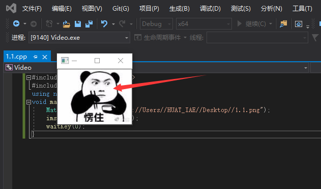
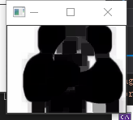
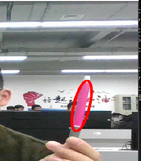

## 机器视觉第一次作业
### 时间：2020年11月24日
### 第一部分图像的识别及处理
#### 1.1软件的安装及使用
  1.1.1、软件的安装很简单只需要将安装程序下载在本地，双击程序选择安装的的地址即可。确切的说opencv并不是一个程序，而是一系列的函数集合，安装过程更像是一个解压过程。

1.1.2、在1.1.1后需要为电脑添加环境变量，在path增加对应的路径。

1.1.3、 而软件的使用更像是为每个工程指明函数的地址，所以按照网上教程在创建工程后，需要在属性设置的区域为其设定路径等。
#### 第一个程序imread()、imshow()
这俩个函数是opencv内置的方法，调用时先在头文件里面申明
整体的函数内容如下：
```c++
    #include <opencv2/opencv.hpp>
    #include <iostream>
    using namespace cv;
    void main(){
        Mat srcImage = imread("C://Users//HUAT_IAE//Desktop//1.1.png");
        imshow("step1",srcImage);
        waitKey(0);
    }
```
运行结果如下图所示：

#### 第二个程序 图像腐蚀
和第一个程序一样需要引用头文件，具体看程序如下：
```c++
#include<opencv2/highgui/highgui.hpp>
#include<opencv2/imgproc/imgproc.hpp>
using namespace cv;

int main() {
    Mat srcImage = imread("C://Users//HUAT_IAE//Desktop//1.1.png");
    imshow("原图", srcImage);

    Mat element = getStructuringElement(MORPH_RECT, Size(15, 15));
    Mat dstImage;
    erode(srcImage, dstImage, element);
    imshow("腐蚀操作",dstImage);
    waitKey(0);
    return 0;
}

```
运行结果如下图：


#### 第三个程序 
```c++
#include<opencv2/highgui/highgui.hpp>
#include<opencv2/imgproc/imgproc.hpp>
using namespace cv;

int main() {
    Mat srcImage = imread("C://Users//HUAT_IAE//Desktop//1.1.png");
    imshow("原图", srcImage);

    Mat element = getStructuringElement(MORPH_RECT, Size(15, 15));
    Mat dstImage;
    // erode(srcImage,dstImage,element);
    blur(srcImage, dstImage,Size(7, 7));
    imshow("腐蚀操作",dstImage);
    waitKey(0);
    return 0;
}
```
运行结果如下图：


#### 第四个程序 视频操作
```C++
#include <opencv2\opencv.hpp>  
using namespace cv;

int main()
{
	//【1】从摄像头读入视频
	VideoCapture capture(0);

	//【2】循环显示每一帧
	while (1)
	{
		Mat frame;  //定义一个Mat变量，用于存储每一帧的图像
		capture >> frame;  //读取当前帧
		imshow("读取视频", frame);  //显示当前帧
		waitKey(30);  //延时30ms
	}
	return 0;
}

```
执行效果如下图所示：

### 第二部分 机器认知与识别
#### 彩色追踪
部分关键代码
```c++
//鼠标事件的抓取
static void onMouse(int event, int x, int y, int, void*)
{
	if (selectObject)
	{
		selection.x = MIN(x, origin.x);
		selection.y = MIN(y, origin.y);
		selection.width = std::abs(x - origin.x);
		selection.height = std::abs(y - origin.y);

		selection &= Rect(0, 0, image.cols, image.rows);
	}

	switch (event)
	{
	case EVENT_LBUTTONDOWN:
		origin = Point(x, y);
		selection = Rect(x, y, 0, 0);
		selectObject = true;
		break;

	case EVENT_LBUTTONUP:
		selectObject = false;
		if (selection.width > 0 && selection.height > 0)
			trackObject = -1;
		break;
	}
}
//事件的追踪
	cap.open(0);

	if (!cap.isOpened())
	{
		cout << "不能初始化摄像头\n";
	}

	namedWindow("Histogram", 0);
	namedWindow("CamShift Demo", 0);
	setMouseCallback("CamShift Demo", onMouse, 0);
	createTrackbar("Vmin", "CamShift Demo", &vmin, 256, 0);
	createTrackbar("Vmax", "CamShift Demo", &vmax, 256, 0);
	createTrackbar("Smin", "CamShift Demo", &smin, 256, 0);

	Mat frame, hsv, hue, mask, hist, histimg = Mat::zeros(200, 320, CV_8UC3), backproj;
	bool paused = false;

	for (;;)
	{
		if (!paused)
		{
			cap >> frame;
			if (frame.empty())
				break;
		}

		frame.copyTo(image);

		if (!paused)
		{
			cvtColor(image, hsv, COLOR_BGR2HSV);

			if (trackObject)
			{
				int _vmin = vmin, _vmax = vmax;

				inRange(hsv, Scalar(0, smin, MIN(_vmin, _vmax)),
					Scalar(180, 256, MAX(_vmin, _vmax)), mask);
				int ch[] = { 0, 0 };
				hue.create(hsv.size(), hsv.depth());
				mixChannels(&hsv, 1, &hue, 1, ch, 1);

				if (trackObject < 0)
				{
					Mat roi(hue, selection), maskroi(mask, selection);
					calcHist(&roi, 1, 0, maskroi, hist, 1, &hsize, &phranges);
					//此句代码的OpenCV3版为：
					normalize(hist, hist, 0, 255, NORM_MINMAX);
					//此句代码的OpenCV2版为：
					//normalize(hist, hist, 0, 255, CV_MINMAX);

					trackWindow = selection;
					trackObject = 1;

					histimg = Scalar::all(0);
					int binW = histimg.cols / hsize;
					Mat buf(1, hsize, CV_8UC3);
					for (int i = 0; i < hsize; i++)
						buf.at<Vec3b>(i) = Vec3b(saturate_cast<uchar>(i * 180. / hsize), 255, 255);

					//此句代码的OpenCV3版为：
					cvtColor(buf, buf, COLOR_HSV2BGR);
					//此句代码的OpenCV2版为：
					//cvtColor(buf, buf, CV_HSV2BGR);

					for (int i = 0; i < hsize; i++)
					{
						int val = saturate_cast<int>(hist.at<float>(i) * histimg.rows / 255);
						rectangle(histimg, Point(i * binW, histimg.rows),
							Point((i + 1) * binW, histimg.rows - val),
							Scalar(buf.at<Vec3b>(i)), -1, 8);
					}
				}

				calcBackProject(&hue, 1, 0, hist, backproj, &phranges);
				backproj &= mask;
				RotatedRect trackBox = CamShift(backproj, trackWindow,

					//此句代码的OpenCV3版为：
					TermCriteria(TermCriteria::EPS | TermCriteria::COUNT, 10, 1));
				//此句代码的OpenCV2版为：
				//TermCriteria( CV_TERMCRIT_EPS | CV_TERMCRIT_ITER, 10, 1 ));

				if (trackWindow.area() <= 1)
				{
					int cols = backproj.cols, rows = backproj.rows, r = (MIN(cols, rows) + 5) / 6;
					trackWindow = Rect(trackWindow.x - r, trackWindow.y - r,
						trackWindow.x + r, trackWindow.y + r) &
						Rect(0, 0, cols, rows);
				}

				if (backprojMode)
					cvtColor(backproj, image, COLOR_GRAY2BGR);

				//此句代码的OpenCV3版为：
				ellipse(image, trackBox, Scalar(0, 0, 255), 3, LINE_AA);
				//此句代码的OpenCV2版为：
				//ellipse( image, trackBox, Scalar(0,0,255), 3, CV_AA );

			}
		}
		else if (trackObject < 0)
			paused = false;

		if (selectObject && selection.width > 0 && selection.height > 0)
		{
			Mat roi(image, selection);
			bitwise_not(roi, roi);
		}

		imshow("CamShift Demo", image);
		imshow("Histogram", histimg);

		char c = (char)waitKey(10);
		if (c == 27)
			break;
		switch (c)
		{
		case 'b':
			backprojMode = !backprojMode;
			break;
		case 'c':
			trackObject = 0;
			histimg = Scalar::all(0);
			break;
		case 'h':
			showHist = !showHist;
			if (!showHist)
				destroyWindow("Histogram");
			else
				namedWindow("Histogram", 1);
			break;
		case 'p':
			paused = !paused;
			break;
		default:
			;
		}
	}

```
运行结果如图所示：


#### 点追踪
```c++
cap.open(0);

	if (!cap.isOpened())
	{
		cout << "Could not initialize capturing...\n";
		return 0;
	}

	namedWindow("LK Demo", 1);
	setMouseCallback("LK Demo", onMouse, 0);

	Mat gray, prevGray, image;
	vector<Point2f> points[2];

	for (;;)
	{
		Mat frame;
		cap >> frame;
		if (frame.empty())
			break;

		frame.copyTo(image);
		cvtColor(image, gray, COLOR_BGR2GRAY);

		if (nightMode)
			image = Scalar::all(0);

		if (needToInit)
		{
			// 自动初始化
			//goodFeaturesToTrack(gray, points[1], MAX_COUNT, 0.01, 10, Mat(), 3, 0, 0.04);
			cornerSubPix(gray, points[1], subPixWinSize, Size(-1, -1), termcrit);
			addRemovePt = false;
		}
		else if (!points[0].empty())
		{
			vector<uchar> status;
			vector<float> err;
			if (prevGray.empty())
				gray.copyTo(prevGray);
			calcOpticalFlowPyrLK(prevGray, gray, points[0], points[1], status, err, winSize,
				3, termcrit, 0, 0.001);
			size_t i, k;
			for (i = k = 0; i < points[1].size(); i++)
			{
				if (addRemovePt)
				{
					if (norm(point - points[1][i]) <= 5)
					{
						addRemovePt = false;
						continue;
					}
				}

				if (!status[i])
					continue;

				points[1][k++] = points[1][i];
				circle(image, points[1][i], 3, Scalar(0, 255, 0), -1, 8);
			}
			points[1].resize(k);
		}

		if (addRemovePt && points[1].size() < (size_t)MAX_COUNT)
		{
			vector<Point2f> tmp;
			tmp.push_back(point);

			//此句代码的OpenCV2版为：
			//cornerSubPix( gray, tmp, winSize, cvSize(-1,-1), termcrit);
			//此句代码的OpenCV3版为：
			cornerSubPix(gray, tmp, winSize, Size(-1, -1), termcrit);
			points[1].push_back(tmp[0]);
			addRemovePt = false;
		}

		needToInit = false;
		imshow("LK Demo", image);

		char c = (char)waitKey(10);
		if (c == 27)
			break;
		switch (c)
		{
		case 'r':
			needToInit = true;
			break;
		case 'c':
			points[0].clear();
			points[1].clear();
			break;
		case 'n':
			nightMode = !nightMode;
			break;
		}

		std::swap(points[1], points[0]);
		cv::swap(prevGray, gray);
	}
```
执行后的效果如下：


### 人脸识别
```c++
#include "opencv2/objdetect.hpp"
#include "opencv2/highgui.hpp"
#include "opencv2/imgproc.hpp"
#include "opencv2/videoio.hpp"
#include <iostream>

using namespace std;
using namespace cv;

/** Function Headers */
void detectAndDisplay(Mat frame);

/** Global variables */
CascadeClassifier face_cascade;
CascadeClassifier eyes_cascade;

/** @function main */
int main(int argc, const char** argv)
{
    CommandLineParser parser(argc, argv,
        "{help h||}"
        "{face_cascade|data/haarcascades/haarcascade_frontalface_alt.xml|Path to face cascade.}"
        "{eyes_cascade|data/haarcascades/haarcascade_eye_tree_eyeglasses.xml|Path to eyes cascade.}"
        "{camera|0|Camera device number.}");

    parser.about("\nThis program demonstrates using the cv::CascadeClassifier class to detect objects (Face + eyes) in a video stream.\n"
        "You can use Haar or LBP features.\n\n");
    parser.printMessage();

    String face_cascade_name = samples::findFile(parser.get<String>("face_cascade"));
    String eyes_cascade_name = samples::findFile(parser.get<String>("eyes_cascade"));

    //-- 1. Load the cascades
    if (!face_cascade.load(face_cascade_name))
    {
        cout << "--(!)Error loading face cascade\n";
        return -1;
    };
    if (!eyes_cascade.load(eyes_cascade_name))
    {
        cout << "--(!)Error loading eyes cascade\n";
        return -1;
    };

    int camera_device = parser.get<int>("camera");
    VideoCapture capture;
    //-- 2. Read the video stream
    capture.open(camera_device);
    if (!capture.isOpened())
    {
        cout << "--(!)Error opening video capture\n";
        return -1;
    }

    Mat frame;
    while (capture.read(frame))
    {
        if (frame.empty())
        {
            cout << "--(!) No captured frame -- Break!\n";
            break;
        }

        //-- 3. Apply the classifier to the frame
        detectAndDisplay(frame);

        if (waitKey(10) == 27)
        {
            break; // escape
        }
    }
    return 0;
}

/** @function detectAndDisplay */
void detectAndDisplay(Mat frame)
{
    Mat frame_gray;
    cvtColor(frame, frame_gray, COLOR_BGR2GRAY);
    equalizeHist(frame_gray, frame_gray);

    //-- Detect faces
    std::vector<Rect> faces;
    face_cascade.detectMultiScale(frame_gray, faces);

    for (size_t i = 0; i < faces.size(); i++)
    {
        Point center(faces[i].x + faces[i].width / 2, faces[i].y + faces[i].height / 2);
        ellipse(frame, center, Size(faces[i].width / 2, faces[i].height / 2), 0, 0, 360, Scalar(255, 0, 255), 4);

        Mat faceROI = frame_gray(faces[i]);

        //-- In each face, detect eyes
        std::vector<Rect> eyes;
        eyes_cascade.detectMultiScale(faceROI, eyes);

        for (size_t j = 0; j < eyes.size(); j++)
        {
            Point eye_center(faces[i].x + eyes[j].x + eyes[j].width / 2, faces[i].y + eyes[j].y + eyes[j].height / 2);
            int radius = cvRound((eyes[j].width + eyes[j].height) * 0.25);
            circle(frame, eye_center, radius, Scalar(255, 0, 0), 4);
        }
    }

    //-- Show what you got
    imshow("Capture - Face detection", frame);
}
```

运行结果如下：


### 图像高级操作
```c++
#include <vector>
#include <stdio.h>
#include<opencv2/opencv.hpp>
using namespace cv;
using namespace std;


//--------------------------------【createAlphaMat( )函数】--------------------------------
//		描述：创建带alpha通道的Mat
//-------------------------------------------------------------------------------------------------
void createAlphaMat(Mat& mat)
{
	for (int i = 0; i < mat.rows; ++i) {
		for (int j = 0; j < mat.cols; ++j) {
			Vec4b& rgba = mat.at<Vec4b>(i, j);
			rgba[0] = UCHAR_MAX;
			rgba[1] = saturate_cast<uchar>((float(mat.cols - j)) / ((float)mat.cols) * UCHAR_MAX);
			rgba[2] = saturate_cast<uchar>((float(mat.rows - i)) / ((float)mat.rows) * UCHAR_MAX);
			rgba[3] = saturate_cast<uchar>(0.5 * (rgba[1] + rgba[2]));
		}
	}
}


//-----------------------------------【ShowHelpText( )函数】----------------------------------
//          描述：输出一些帮助信息
//----------------------------------------------------------------------------------------------
void ShowHelpText()
{
	//输出欢迎信息和OpenCV版本
	printf("\n\n\t\t\t非常感谢购买《OpenCV3编程入门》一书！\n");
	printf("\n\n\t\t\t此为本书OpenCV3版的第15个配套示例程序\n");
	printf("\n\n\t\t\t   当前使用的OpenCV版本为：" CV_VERSION);
	printf("\n\n  ----------------------------------------------------------------------------\n");
}


int main()
{
	//创建带alpha通道的Mat
	Mat mat(480, 640, CV_8UC4);
	createAlphaMat(mat);

	ShowHelpText();

	vector<int>compression_params;
	
	compression_params.push_back(IMWRITE_PNG_COMPRESSION);
	compression_params.push_back(9);

	//显示图片
	try {
		imwrite("透明Alpha值图.png", mat, compression_params);
		imshow("生成的png图", mat);
		fprintf(stdout, "PNG图片文件的alpha数据保存完毕~\n可以在工程目录下查看由imwrite函数生成的图片\n");
		waitKey(0);
	}
	catch (runtime_error& ex) {
		fprintf(stderr, "图像转换成PNG格式发生错误：%s\n", ex.what());
		return 1;
	}

	return 0;
}
```

运行结果如下图：


### 小结
本节内容从opencv的部署开始，介绍了opencv各个方法实现一系列日常生活中能遇到的机器视觉处理方式。
在使用opencv实现功能是需要将opencv拓展到Visual Studio，当然安装的Visual Studio必须安装c++的桌面开发工具。
重点要熟悉opencv的内置函数的使用，从面向对象的角度去理解方法的使用。
### 个人心得
本章的学习，内容基础时后面机器视觉开发的根基，要重点把握和规范开发项目的习惯。同时要拿起c语言的指针并理解函数回传等重点内容，增强自己的开发能力。