## 基础图像容器 Mat

在每张照片的一个点是由许多的数字组成的，是一个包含众多强度值的像素点矩阵。

#### 像素值的存储方法

· RGB 采用与人眼相似的工作机制
· HSV 和 HLS 把颜色分为色调，饱和度和亮度/明度。这是描述颜色更自然的方式
·YCrCb在JEPG中广泛使用
·CIE L*a*b是一种在感知上均匀的颜色空间，他适合用来度量两个颜色之间的距离

创造MAT()构造函数的方法
1.使用Mat()构造函数
2.在C\C++中通过狗仔函数进行初始化
3.为已存在的lpllmage指针创建信息头
4.利用Create()函数
5.采用Matlab式的初始化方式
6.对小矩阵使用都好分隔式初始化函数
7.为已存在的对象创建新信息头

OpenCV中格式化输出方法
【OpenCV默认风格】
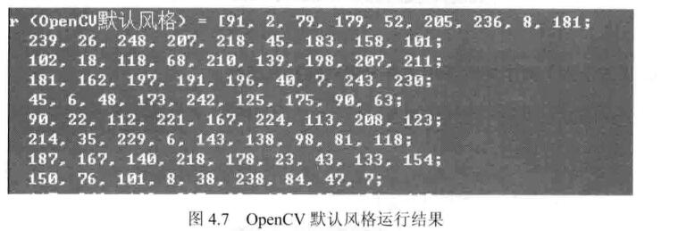
【Python风格】
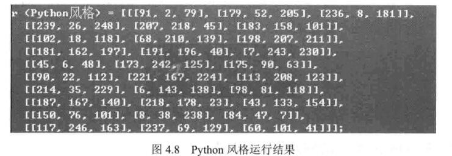
【逗号分隔风格】 
【Numpy】风格
【C语言风格】

点的表示：Poing类
用法
Point poing;
poing.x = 10;
poing.y = 8;

颜色的表示：Scalar类
Scalar(a, b, c)

尺寸的表示：Size类
typedef Size_<int> Size2i;
typedef Size2i Size;

template<typename_Tp> class Size_
{

}

矩形的表示：Rect类

颜色空间转换：cvtColor()函数

整体代码如下
```C++
#include <opencv2/core/core.hpp>
#include <opencv2/highgui/highgui.hpp>
#include <opencv2/imgproc/imgproc.hpp>
using namespace cv;


#define WINDOW_NAME1 "【绘制图1】"        //为窗口标题定义的宏 
#define WINDOW_NAME2 "【绘制图2】"        //为窗口标题定义的宏 
#define WINDOW_WIDTH 300//定义窗口大小的宏

void DrawEllipse(Mat img, double angle);//绘制椭圆
void DrawFilledCircle(Mat img, Point center);//绘制圆
void DrawPolygon(Mat img);//绘制多边形
void DrawLine(Mat img, Point start, Point end);//绘制线段

int main(void)
{

    // 创建空白的Mat图像
    Mat atomImage = Mat::zeros(WINDOW_WIDTH, WINDOW_WIDTH, CV_8UC3);
    Mat rookImage = Mat::zeros(WINDOW_WIDTH, WINDOW_WIDTH, CV_8UC3);

    // ---------------------<1>绘制化学中的原子示例图------------------------

    //【1.1】先绘制出椭圆
    DrawEllipse(atomImage, 90);
    DrawEllipse(atomImage, 0);
    DrawEllipse(atomImage, 45);
    DrawEllipse(atomImage, -45);

    //【1.2】再绘制圆心
    DrawFilledCircle(atomImage, Point(WINDOW_WIDTH / 2, WINDOW_WIDTH / 2));

    // ----------------------------<2>绘制组合图-----------------------------
    //【2.1】先绘制出椭圆
    DrawPolygon(rookImage);

    // 【2.2】绘制矩形
    rectangle(rookImage,
        Point(0, 7 * WINDOW_WIDTH / 8),
        Point(WINDOW_WIDTH, WINDOW_WIDTH),
        Scalar(0, 255, 255),
        -1,
        8);

    // 【2.3】绘制线段
    DrawLine(rookImage, Point(0, 15 * WINDOW_WIDTH / 16), Point(WINDOW_WIDTH, 15 * WINDOW_WIDTH / 16));

    // ---------------------------<3>显示绘制出的图像------------------------
    imshow(WINDOW_NAME1, atomImage);
    moveWindow(WINDOW_NAME1, 0, 200);
    imshow(WINDOW_NAME2, rookImage);
    moveWindow(WINDOW_NAME2, WINDOW_WIDTH, 200);

    waitKey(0);
    return(0);
}


//-------------------------------【DrawEllipse( )函数】--------------------------------
//		描述：自定义的绘制函数，实现了绘制不同角度、相同尺寸的椭圆
//-----------------------------------------------------------------------------------------
void DrawEllipse(Mat img, double angle)
{
    int thickness = 2;
    int lineType = 8;


    ellipse(img,
        Point(WINDOW_WIDTH / 2, WINDOW_WIDTH / 2), // 椭圆中心点
        Size(WINDOW_WIDTH / 4, WINDOW_WIDTH / 16), //大小
        angle,                                   // 旋转角度 angle
        0,
        360,                                     // 扩展弧度[0, 360]
        Scalar(255, 129, 0),                   // 颜色：蓝色
        thickness,                               // 线宽
        lineType);                              // 线型
}


//-----------------------------------【DrawFilledCircle( )函数】---------------------------
//		描述：自定义的绘制函数，实现了实心圆的绘制
//-----------------------------------------------------------------------------------------
void DrawFilledCircle(Mat img, Point center)
{
    int thickness = -1;
    int lineType = 8;

    circle(img,
        center,                                      // 圆心
        WINDOW_WIDTH / 32,                             // 半径
        Scalar(0, 0, 255),                         // 颜色：红色
        thickness,                                   // 线宽-1，因此是实心圆
        lineType);
}


//-----------------------------------【DrawPolygon( )函数】--------------------------
//		描述：自定义的绘制函数，实现了凹多边形的绘制
//--------------------------------------------------------------------------------------
void DrawPolygon(Mat img)
{
    int lineType = 8;

    //创建一些点
    Point rookPoints[1][20];
    rookPoints[0][0] = Point(WINDOW_WIDTH / 4, 7 * WINDOW_WIDTH / 8);
    rookPoints[0][1] = Point(3 * WINDOW_WIDTH / 4, 7 * WINDOW_WIDTH / 8);
    rookPoints[0][2] = Point(3 * WINDOW_WIDTH / 4, 13 * WINDOW_WIDTH / 16);
    rookPoints[0][3] = Point(11 * WINDOW_WIDTH / 16, 13 * WINDOW_WIDTH / 16);
    rookPoints[0][4] = Point(19 * WINDOW_WIDTH / 32, 3 * WINDOW_WIDTH / 8);
    rookPoints[0][5] = Point(3 * WINDOW_WIDTH / 4, 3 * WINDOW_WIDTH / 8);
    rookPoints[0][6] = Point(3 * WINDOW_WIDTH / 4, WINDOW_WIDTH / 8);
    rookPoints[0][7] = Point(26 * WINDOW_WIDTH / 40, WINDOW_WIDTH / 8);
    rookPoints[0][8] = Point(26 * WINDOW_WIDTH / 40, WINDOW_WIDTH / 4);
    rookPoints[0][9] = Point(22 * WINDOW_WIDTH / 40, WINDOW_WIDTH / 4);
    rookPoints[0][10] = Point(22 * WINDOW_WIDTH / 40, WINDOW_WIDTH / 8);
    rookPoints[0][11] = Point(18 * WINDOW_WIDTH / 40, WINDOW_WIDTH / 8);
    rookPoints[0][12] = Point(18 * WINDOW_WIDTH / 40, WINDOW_WIDTH / 4);
    rookPoints[0][13] = Point(14 * WINDOW_WIDTH / 40, WINDOW_WIDTH / 4);
    rookPoints[0][14] = Point(14 * WINDOW_WIDTH / 40, WINDOW_WIDTH / 8);
    rookPoints[0][15] = Point(WINDOW_WIDTH / 4, WINDOW_WIDTH / 8);
    rookPoints[0][16] = Point(WINDOW_WIDTH / 4, 3 * WINDOW_WIDTH / 8);
    rookPoints[0][17] = Point(13 * WINDOW_WIDTH / 32, 3 * WINDOW_WIDTH / 8);
    rookPoints[0][18] = Point(5 * WINDOW_WIDTH / 16, 13 * WINDOW_WIDTH / 16);
    rookPoints[0][19] = Point(WINDOW_WIDTH / 4, 13 * WINDOW_WIDTH / 16);

    const Point* ppt[1] = { rookPoints[0] };
    int npt[] = { 20 };

    fillPoly(img,
        ppt,                          // 多边形的顶点集
        npt,                          // 多边形顶点数目
        1,
        Scalar(255, 255, 255),      // 颜色：白色
        lineType);
}


//-----------------------------------【DrawLine( )函数】--------------------------
//		描述：自定义的绘制函数，实现了线的绘制
//---------------------------------------------------------------------------------
void DrawLine(Mat img, Point start, Point end)
{
    int thickness = 2;
    int lineType = 8;
    line(img,
        start,
        end,
        Scalar(0, 0, 0),
        thickness,
        lineType);
}

```

展示图如下
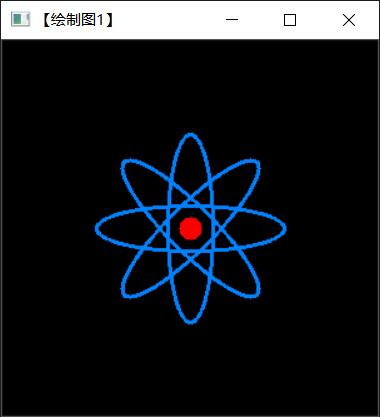
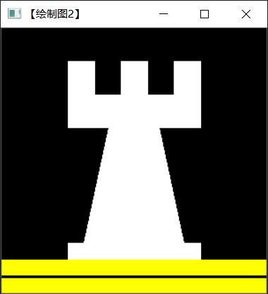

### 第五章 core组件进阶

·操作图像中的像素
·设置感兴趣区域（ROI）
·进行图像混合
·分离颜色通道
·进行多通道图像混合
·调整图像的对比度和亮度值
·调整图像的对比度和亮度值
·对图像进行离散傅里叶变换
·如何输入输出XML和YAML文件

图像在内存中的存储方式
灰度图像
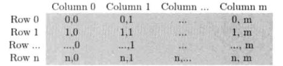
RGB颜色模型的矩阵
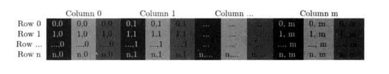

##### 颜色空间缩减
0一9范围的像素值为0;
10～19范围的像素值为10;
20～29范围的像素值为20。

##### LUT函数：Look up table操作
```C++
//建立一个mat型用于查表
Mat lookUpTable(1m 256m CV_8U);
uchar* p = lookUpTable.data;
for(int i = 0; i < 256; ++i)
    p[i] = table[i];

for(int i = 0; i<times; ++i)
    LUT(I, lookUpTable, J);
```
##### 计时函数
使用 getTickCount()和getTickFrequency()

##### 访问图像中像素的三类方法

·方法一 指针访问：C操作符[]:
·方法二 迭代器iterator:
·方法三 动态地址计算。

```C++
//--------------------------------------【程序说明】-------------------------------------------
//		程序说明：《OpenCV3编程入门》OpenCV3版书本配套示例程序21
//		程序描述：用指针访问像素
//		开发测试所用IDE版本：Visual Studio 2010
//		开发测试所用OpenCV版本：	3.0 beta
//		2014年11月 Created by @浅墨_毛星云
//		2014年12月 Revised by @浅墨_毛星云
//------------------------------------------------------------------------------------------------

//---------------------------------【头文件、命名空间包含部分】--------------------------
//		描述：包含程序所使用的头文件和命名空间
//-----------------------------------------------------------------------------------------------
#include <opencv2/core/core.hpp>  
#include <opencv2/highgui/highgui.hpp>  
#include <iostream>  
using namespace std;
using namespace cv;

//-----------------------------------【全局函数声明部分】-----------------------------------
//          描述：全局函数声明
//-----------------------------------------------------------------------------------------------
void colorReduce(Mat& inputImage, Mat& outputImage, int div);
void ShowHelpText();

int main()
{
	Mat srcImage = imread("D:\\2020\\AI\\人工智能\\1.jpg");
	imshow("原始图像", srcImage);

	//【2】按原始图的参数规格来创建创建效果图
	Mat dstImage;
	dstImage.create(srcImage.rows, srcImage.cols, srcImage.type());//效果图的大小、类型与原图片相同 

	ShowHelpText();

	//【3】记录起始时间
	double time0 = static_cast<double>(getTickCount());

	//【4】调用颜色空间缩减函数
	colorReduce(srcImage, dstImage, 32);

	//【5】计算运行时间并输出
	time0 = ((double)getTickCount() - time0) / getTickFrequency();
	cout << "\t此方法运行时间为： " << time0 << "秒" << endl;  //输出运行时间

	//【6】显示效果图
	imshow("效果图", dstImage);
	waitKey(0);
}

void colorReduce(Mat& inputImage, Mat& outputImage, int div)
{
	//参数准备
	outputImage = inputImage.clone();  //拷贝实参到临时变量
	int rowNumber = outputImage.rows;  //行数
	int colNumber = outputImage.cols * outputImage.channels();  //列数 x 通道数=每一行元素的个数

	//双重循环，遍历所有的像素值
	for (int i = 0; i < rowNumber; i++)  //行循环
	{
		uchar* data = outputImage.ptr<uchar>(i);  //获取第i行的首地址
		for (int j = 0; j < colNumber; j++)   //列循环
		{
			// ---------【开始处理每个像素】-------------     
			data[j] = data[j] / div * div + div / 2;
			// ----------【处理结束】---------------------
		}  //行处理结束
	}
}


//-----------------------------------【ShowHelpText( )函数】----------------------------------
//          描述：输出一些帮助信息
//----------------------------------------------------------------------------------------------
void ShowHelpText()
{
	//输出欢迎信息和OpenCV版本
	printf("\n\n\t\t\t非常感谢购买《OpenCV3编程入门》一书！\n");
	printf("\n\n\t\t\t此为本书OpenCV3版的第21个配套示例程序\n");
	printf("\n\n\t\t\t   当前使用的OpenCV版本为：" CV_VERSION);
	printf("\n\n  ----------------------------------------------------------------------------\n");
}
```
效果图如下
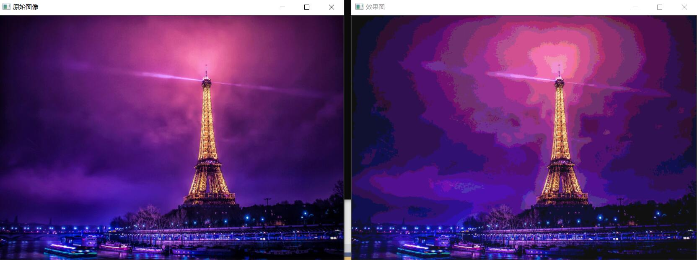

```C++

#include <opencv2/core/core.hpp>  
#include <opencv2/highgui/highgui.hpp>  
#include <iostream>  
using namespace std;
using namespace cv;


//-----------------------------------【全局函数声明部分】-----------------------------------
//		描述：全局函数声明
//-----------------------------------------------------------------------------------------------
void colorReduce(Mat& inputImage, Mat& outputImage, int div);
void ShowHelpText();


//--------------------------------------【main( )函数】--------------------------------------
//		描述：控制台应用程序的入口函数，我们的程序从这里开始执行
//-----------------------------------------------------------------------------------------------
int main()
{
	//【1】创建原始图并显示
	Mat srcImage = imread("D:\\2020\\AI\\人工智能\\1.jpg");
	imshow("原始图像", srcImage);

	//【2】按原始图的参数规格来创建创建效果图
	Mat dstImage;
	dstImage.create(srcImage.rows, srcImage.cols, srcImage.type());//效果图的大小、类型与原图片相同 

	ShowHelpText();

	//【3】记录起始时间
	double time0 = static_cast<double>(getTickCount());

	//【4】调用颜色空间缩减函数
	colorReduce(srcImage, dstImage, 32);

	//【5】计算运行时间并输出
	time0 = ((double)getTickCount() - time0) / getTickFrequency();
	cout << "此方法运行时间为： " << time0 << "秒" << endl;  //输出运行时间

	//【6】显示效果图
	imshow("效果图", dstImage);
	waitKey(0);
}

//-------------------------------------【colorReduce( )函数】-----------------------------
//		描述：使用【迭代器】方法版的颜色空间缩减函数
//----------------------------------------------------------------------------------------------
void colorReduce(Mat& inputImage, Mat& outputImage, int div)
{
	//参数准备
	outputImage = inputImage.clone();  //拷贝实参到临时变量
	//获取迭代器
	Mat_<Vec3b>::iterator it = outputImage.begin<Vec3b>();  //初始位置的迭代器
	Mat_<Vec3b>::iterator itend = outputImage.end<Vec3b>();  //终止位置的迭代器

	//存取彩色图像像素
	for (; it != itend; ++it)
	{
		// ------------------------【开始处理每个像素】--------------------
		(*it)[0] = (*it)[0] / div * div + div / 2;
		(*it)[1] = (*it)[1] / div * div + div / 2;
		(*it)[2] = (*it)[2] / div * div + div / 2;
		// ------------------------【处理结束】----------------------------
	}
}


//-----------------------------------【ShowHelpText( )函数】----------------------------------
//          描述：输出一些帮助信息
//----------------------------------------------------------------------------------------------
void ShowHelpText()
{
	//输出欢迎信息和OpenCV版本
	printf("\n\n\t\t\t非常感谢购买《OpenCV3编程入门》一书！\n");
	printf("\n\n\t\t\t此为本书OpenCV3版的第22个配套示例程序\n");
	printf("\n\n\t\t\t   当前使用的OpenCV版本为：" CV_VERSION);
	printf("\n\n  ----------------------------------------------------------------------------\n");
}
```

```C++

#include <opencv2/core/core.hpp>  
#include <opencv2/highgui/highgui.hpp>  
#include <iostream>  
using namespace std;
using namespace cv;

//-----------------------------------【全局函数声明部分】-----------------------------------
//          描述：全局函数声明
//-----------------------------------------------------------------------------------------------
void colorReduce(Mat& inputImage, Mat& outputImage, int div);
void ShowHelpText();


//--------------------------------------【main( )函数】---------------------------------------
//          描述：控制台应用程序的入口函数，我们的程序从这里开始执行
//-----------------------------------------------------------------------------------------------
int main()
{
	system("color 9F");
	//【1】创建原始图并显示
	Mat srcImage = imread("D:\\2020\\AI\\人工智能\\1.jpg");
	imshow("原始图像", srcImage);

	//【2】按原始图的参数规格来创建创建效果图
	Mat dstImage;
	dstImage.create(srcImage.rows, srcImage.cols, srcImage.type());//效果图的大小、类型与原图片相同 

	ShowHelpText();

	//【3】记录起始时间
	double time0 = static_cast<double>(getTickCount());

	//【4】调用颜色空间缩减函数
	colorReduce(srcImage, dstImage, 32);

	//【5】计算运行时间并输出
	time0 = ((double)getTickCount() - time0) / getTickFrequency();
	cout << "此方法运行时间为： " << time0 << "秒" << endl;  //输出运行时间

	//【6】显示效果图
	imshow("效果图", dstImage);
	waitKey(0);
}


//----------------------------------【colorReduce( )函数】-------------------------------
//          描述：使用【动态地址运算配合at】方法版本的颜色空间缩减函数
//----------------------------------------------------------------------------------------------
void colorReduce(Mat& inputImage, Mat& outputImage, int div)
{
	//参数准备
	outputImage = inputImage.clone();  //拷贝实参到临时变量
	int rowNumber = outputImage.rows;  //行数
	int colNumber = outputImage.cols;  //列数

	//存取彩色图像像素
	for (int i = 0; i < rowNumber; i++)
	{
		for (int j = 0; j < colNumber; j++)
		{
			// ------------------------【开始处理每个像素】--------------------
			outputImage.at<Vec3b>(i, j)[0] = outputImage.at<Vec3b>(i, j)[0] / div * div + div / 2;  //蓝色通道
			outputImage.at<Vec3b>(i, j)[1] = outputImage.at<Vec3b>(i, j)[1] / div * div + div / 2;  //绿色通道
			outputImage.at<Vec3b>(i, j)[2] = outputImage.at<Vec3b>(i, j)[2] / div * div + div / 2;  //红是通道
			// -------------------------【处理结束】----------------------------
		}  // 行处理结束     
	}
}
``` 
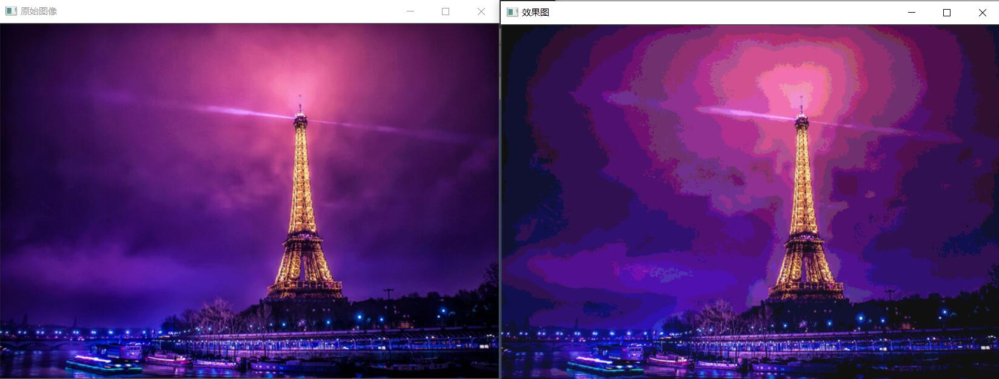

```C++

#include <iostream>
#include <opencv2/core/core.hpp>
#include <opencv2/highgui/highgui.hpp>
using namespace cv;
using namespace std;


#define NTESTS 14
#define NITERATIONS 20


void colorReduce0(Mat& image, int div = 64) {

	int nl = image.rows; //行数
	int nc = image.cols * image.channels(); //每行元素的总元素数量

	for (int j = 0; j < nl; j++)
	{

		uchar* data = image.ptr<uchar>(j);

		for (int i = 0; i < nc; i++)
		{

			data[i] = data[i] / div * div + div / 2;

		} //单行处理结束                  
	}
}

void colorReduce1(Mat& image, int div = 64) {

	int nl = image.rows; //行数
	int nc = image.cols * image.channels(); //每行元素的总元素数量

	for (int j = 0; j < nl; j++)
	{

		uchar* data = image.ptr<uchar>(j);

		for (int i = 0; i < nc; i++)
		{

			//-------------开始处理每个像素-------------------

			*data++ = *data / div * div + div / 2;

			//-------------结束像素处理------------------------

		} //单行处理结束              
	}
}

//-----------------------------------------【方法三】-------------------------------------------
//		说明：利用.ptr 和 * ++ 以及模操作
//-------------------------------------------------------------------------------------------------
void colorReduce2(Mat& image, int div = 64) {

	int nl = image.rows; //行数
	int nc = image.cols * image.channels(); //每行元素的总元素数量

	for (int j = 0; j < nl; j++)
	{

		uchar* data = image.ptr<uchar>(j);

		for (int i = 0; i < nc; i++)
		{

			//-------------开始处理每个像素-------------------

			int v = *data;
			*data++ = v - v % div + div / 2;

			//-------------结束像素处理------------------------

		} //单行处理结束                   
	}
}


void colorReduce3(Mat& image, int div = 64) {

	int nl = image.rows; //行数
	int nc = image.cols * image.channels(); //每行元素的总元素数量
	int n = static_cast<int>(log(static_cast<double>(div)) / log(2.0));
	//掩码值
	uchar mask = 0xFF << n; // e.g. 对于 div=16, mask= 0xF0

	for (int j = 0; j < nl; j++) {

		uchar* data = image.ptr<uchar>(j);

		for (int i = 0; i < nc; i++) {

			//------------开始处理每个像素-------------------

			*data++ = *data & mask + div / 2;

			//-------------结束像素处理------------------------
		}  //单行处理结束            
	}
}


//----------------------------------------【方法五】----------------------------------------------
//		说明：利用指针算术运算
//---------------------------------------------------------------------------------------------------
void colorReduce4(Mat& image, int div = 64) {

	int nl = image.rows; //行数
	int nc = image.cols * image.channels(); //每行元素的总元素数量
	int n = static_cast<int>(log(static_cast<double>(div)) / log(2.0));
	int step = image.step; //有效宽度
	//掩码值
	uchar mask = 0xFF << n; // e.g. 对于 div=16, mask= 0xF0

	//获取指向图像缓冲区的指针
	uchar* data = image.data;

	for (int j = 0; j < nl; j++)
	{

		for (int i = 0; i < nc; i++)
		{

			//-------------开始处理每个像素-------------------

			*(data + i) = *data & mask + div / 2;

			//-------------结束像素处理------------------------

		} //单行处理结束              

		data += step;  // next line
	}
}

//---------------------------------------【方法六】----------------------------------------------
//		说明：利用 .ptr 和 * ++以及位运算、image.cols * image.channels()
//-------------------------------------------------------------------------------------------------
void colorReduce5(Mat& image, int div = 64) {

	int nl = image.rows; //行数
	int n = static_cast<int>(log(static_cast<double>(div)) / log(2.0));
	//掩码值
	uchar mask = 0xFF << n; // e.g. 例如div=16, mask= 0xF0

	for (int j = 0; j < nl; j++)
	{

		uchar* data = image.ptr<uchar>(j);

		for (int i = 0; i < image.cols * image.channels(); i++)
		{

			//-------------开始处理每个像素-------------------

			*data++ = *data & mask + div / 2;

			//-------------结束像素处理------------------------

		} //单行处理结束            
	}
}

// -------------------------------------【方法七】----------------------------------------------
//		说明：利用.ptr 和 * ++ 以及位运算(continuous)
//-------------------------------------------------------------------------------------------------
void colorReduce6(Mat& image, int div = 64) {

	int nl = image.rows; //行数
	int nc = image.cols * image.channels(); //每行元素的总元素数量

	if (image.isContinuous())
	{
		//无填充像素
		nc = nc * nl;
		nl = 1;  // 为一维数列
	}

	int n = static_cast<int>(log(static_cast<double>(div)) / log(2.0));
	//掩码值
	uchar mask = 0xFF << n; // e.g. 比如div=16, mask= 0xF0

	for (int j = 0; j < nl; j++) {

		uchar* data = image.ptr<uchar>(j);

		for (int i = 0; i < nc; i++) {

			//-------------开始处理每个像素-------------------

			*data++ = *data & mask + div / 2;

			//-------------结束像素处理------------------------

		} //单行处理结束                   
	}
}

//------------------------------------【方法八】------------------------------------------------
//		说明：利用 .ptr 和 * ++ 以及位运算 (continuous+channels)
//-------------------------------------------------------------------------------------------------
void colorReduce7(Mat& image, int div = 64) {

	int nl = image.rows; //行数
	int nc = image.cols; //列数

	if (image.isContinuous())
	{
		//无填充像素
		nc = nc * nl;
		nl = 1;  // 为一维数组
	}

	int n = static_cast<int>(log(static_cast<double>(div)) / log(2.0));
	//掩码值
	uchar mask = 0xFF << n; // e.g. 比如div=16, mask= 0xF0

	for (int j = 0; j < nl; j++) {

		uchar* data = image.ptr<uchar>(j);

		for (int i = 0; i < nc; i++) {

			//-------------开始处理每个像素-------------------

			*data++ = *data & mask + div / 2;
			*data++ = *data & mask + div / 2;
			*data++ = *data & mask + div / 2;

			//-------------结束像素处理------------------------

		} //单行处理结束                    
	}
}


// -----------------------------------【方法九】 ------------------------------------------------
//		说明：利用Mat_ iterator
//-------------------------------------------------------------------------------------------------
void colorReduce8(Mat& image, int div = 64) {

	//获取迭代器
	Mat_<Vec3b>::iterator it = image.begin<Vec3b>();
	Mat_<Vec3b>::iterator itend = image.end<Vec3b>();

	for (; it != itend; ++it) {

		//-------------开始处理每个像素-------------------

		(*it)[0] = (*it)[0] / div * div + div / 2;
		(*it)[1] = (*it)[1] / div * div + div / 2;
		(*it)[2] = (*it)[2] / div * div + div / 2;

		//-------------结束像素处理------------------------
	}//单行处理结束  
}

//-------------------------------------【方法十】-----------------------------------------------
//		说明：利用Mat_ iterator以及位运算
//-------------------------------------------------------------------------------------------------
void colorReduce9(Mat& image, int div = 64) {

	// div必须是2的幂
	int n = static_cast<int>(log(static_cast<double>(div)) / log(2.0));
	//掩码值
	uchar mask = 0xFF << n; // e.g. 比如 div=16, mask= 0xF0

	// 获取迭代器
	Mat_<Vec3b>::iterator it = image.begin<Vec3b>();
	Mat_<Vec3b>::iterator itend = image.end<Vec3b>();

	//扫描所有元素
	for (; it != itend; ++it)
	{

		//-------------开始处理每个像素-------------------

		(*it)[0] = (*it)[0] & mask + div / 2;
		(*it)[1] = (*it)[1] & mask + div / 2;
		(*it)[2] = (*it)[2] & mask + div / 2;

		//-------------结束像素处理------------------------
	}//单行处理结束  
}

//------------------------------------【方法十一】---------------------------------------------
//		说明：利用Mat Iterator_
//-------------------------------------------------------------------------------------------------
void colorReduce10(Mat& image, int div = 64) {

	//获取迭代器
	Mat_<Vec3b> cimage = image;
	Mat_<Vec3b>::iterator it = cimage.begin();
	Mat_<Vec3b>::iterator itend = cimage.end();

	for (; it != itend; it++) {

		//-------------开始处理每个像素-------------------

		(*it)[0] = (*it)[0] / div * div + div / 2;
		(*it)[1] = (*it)[1] / div * div + div / 2;
		(*it)[2] = (*it)[2] / div * div + div / 2;

		//-------------结束像素处理------------------------
	}
}

//--------------------------------------【方法十二】--------------------------------------------
//		说明：利用动态地址计算配合at
//-------------------------------------------------------------------------------------------------
void colorReduce11(Mat& image, int div = 64) {

	int nl = image.rows; //行数
	int nc = image.cols; //列数

	for (int j = 0; j < nl; j++)
	{
		for (int i = 0; i < nc; i++)
		{

			//-------------开始处理每个像素-------------------

			image.at<Vec3b>(j, i)[0] = image.at<Vec3b>(j, i)[0] / div * div + div / 2;
			image.at<Vec3b>(j, i)[1] = image.at<Vec3b>(j, i)[1] / div * div + div / 2;
			image.at<Vec3b>(j, i)[2] = image.at<Vec3b>(j, i)[2] / div * div + div / 2;

			//-------------结束像素处理------------------------

		} //单行处理结束                 
	}
}

//----------------------------------【方法十三】----------------------------------------------- 
//		说明：利用图像的输入与输出
//-------------------------------------------------------------------------------------------------
void colorReduce12(const Mat& image, //输入图像
	Mat& result,      // 输出图像
	int div = 64) {

	int nl = image.rows; //行数
	int nc = image.cols; //列数

	//准备好初始化后的Mat给输出图像
	result.create(image.rows, image.cols, image.type());

	//创建无像素填充的图像
	nc = nc * nl;
	nl = 1;  //单维数组

	int n = static_cast<int>(log(static_cast<double>(div)) / log(2.0));
	//掩码值
	uchar mask = 0xFF << n; // e.g.比如div=16, mask= 0xF0

	for (int j = 0; j < nl; j++) {

		uchar* data = result.ptr<uchar>(j);
		const uchar* idata = image.ptr<uchar>(j);

		for (int i = 0; i < nc; i++) {

			//-------------开始处理每个像素-------------------

			*data++ = (*idata++) & mask + div / 2;
			*data++ = (*idata++) & mask + div / 2;
			*data++ = (*idata++) & mask + div / 2;

			//-------------结束像素处理------------------------

		} //单行处理结束                   
	}
}

//--------------------------------------【方法十四】------------------------------------------- 
//		说明：利用操作符重载
//-------------------------------------------------------------------------------------------------
void colorReduce13(Mat& image, int div = 64) {

	int n = static_cast<int>(log(static_cast<double>(div)) / log(2.0));
	//掩码值
	uchar mask = 0xFF << n; // e.g. 比如div=16, mask= 0xF0

	//进行色彩还原
	image = (image & Scalar(mask, mask, mask)) + Scalar(div / 2, div / 2, div / 2);
}


//-----------------------------------【ShowHelpText( )函数】-----------------------------
//		描述：输出一些帮助信息
//----------------------------------------------------------------------------------------------
void ShowHelpText()
{
	//输出欢迎信息和OpenCV版本
	printf("\n\n\t\t\t非常感谢购买《OpenCV3编程入门》一书！\n");
	printf("\n\n\t\t\t此为本书OpenCV3版的第24个配套示例程序\n");
	printf("\n\n\t\t\t   当前使用的OpenCV版本为：" CV_VERSION);
	printf("\n\n  ----------------------------------------------------------------------------\n");

	printf("\n\n正在进行存取操作，请稍等……\n\n");
}


//-----------------------------------【main( )函数】--------------------------------------------
//		描述：控制台应用程序的入口函数，我们的程序从这里开始
//-------------------------------------------------------------------------------------------------
int main()
{
	int64 t[NTESTS], tinit;
	Mat image0;
	Mat image1;
	Mat image2;

	system("color 4F");

	ShowHelpText();

	image0 = imread("1.png");
	if (!image0.data)
		return 0;

	//时间值设为0
	for (int i = 0; i < NTESTS; i++)
		t[i] = 0;


	// 多次重复测试
	int n = NITERATIONS;
	for (int k = 0; k < n; k++)
	{
		cout << k << " of " << n << endl;

		image1 = imread("D:\\2020\\AI\\人工智能\\1.png");
		//【方法一】利用.ptr 和 []
		tinit = getTickCount();
		colorReduce0(image1);
		t[0] += getTickCount() - tinit;

		//【方法二】利用 .ptr 和 * ++ 
		image1 = imread("1.png");
		tinit = getTickCount();
		colorReduce1(image1);
		t[1] += getTickCount() - tinit;

		//【方法三】利用.ptr 和 * ++ 以及模操作
		image1 = imread("1.png");
		tinit = getTickCount();
		colorReduce2(image1);
		t[2] += getTickCount() - tinit;

		//【方法四】 利用.ptr 和 * ++ 以及位操作
		image1 = imread("1.png");
		tinit = getTickCount();
		colorReduce3(image1);
		t[3] += getTickCount() - tinit;

		//【方法五】 利用指针的算术运算
		image1 = imread("1.png");
		tinit = getTickCount();
		colorReduce4(image1);
		t[4] += getTickCount() - tinit;

		//【方法六】利用 .ptr 和 * ++以及位运算、image.cols * image.channels()
		image1 = imread("1.png");
		tinit = getTickCount();
		colorReduce5(image1);
		t[5] += getTickCount() - tinit;

		//【方法七】利用.ptr 和 * ++ 以及位运算(continuous)
		image1 = imread("1.png");
		tinit = getTickCount();
		colorReduce6(image1);
		t[6] += getTickCount() - tinit;

		//【方法八】利用 .ptr 和 * ++ 以及位运算 (continuous+channels)
		image1 = imread("1.png");
		tinit = getTickCount();
		colorReduce7(image1);
		t[7] += getTickCount() - tinit;

		//【方法九】 利用Mat_ iterator
		image1 = imread("1.png");
		tinit = getTickCount();
		colorReduce8(image1);
		t[8] += getTickCount() - tinit;

		//【方法十】 利用Mat_ iterator以及位运算
		image1 = imread("1.png");
		tinit = getTickCount();
		colorReduce9(image1);
		t[9] += getTickCount() - tinit;

		//【方法十一】利用Mat Iterator_
		image1 = imread("1.png");
		tinit = getTickCount();
		colorReduce10(image1);
		t[10] += getTickCount() - tinit;

		//【方法十二】 利用动态地址计算配合at
		image1 = imread("1.png");
		tinit = getTickCount();
		colorReduce11(image1);
		t[11] += getTickCount() - tinit;

		//【方法十三】 利用图像的输入与输出
		image1 = imread("1.png");
		tinit = getTickCount();
		Mat result;
		colorReduce12(image1, result);
		t[12] += getTickCount() - tinit;
		image2 = result;

		//【方法十四】 利用操作符重载
		image1 = imread("1.png");
		tinit = getTickCount();
		colorReduce13(image1);
		t[13] += getTickCount() - tinit;

		//------------------------------
	}
	//输出图像   
	imshow("原始图像", image0);
	imshow("结果", image2);
	imshow("图像结果", image1);

	// 输出平均执行时间
	cout << endl << "-------------------------------------------" << endl << endl;
	cout << "\n【方法一】利用.ptr 和 []的方法所用时间为 " << 1000. * t[0] / getTickFrequency() / n << "ms" << endl;
	cout << "\n【方法二】利用 .ptr 和 * ++ 的方法所用时间为" << 1000. * t[1] / getTickFrequency() / n << "ms" << endl;
	cout << "\n【方法三】利用.ptr 和 * ++ 以及模操作的方法所用时间为" << 1000. * t[2] / getTickFrequency() / n << "ms" << endl;
	cout << "\n【方法四】利用.ptr 和 * ++ 以及位操作的方法所用时间为" << 1000. * t[3] / getTickFrequency() / n << "ms" << endl;
	cout << "\n【方法五】利用指针算术运算的方法所用时间为" << 1000. * t[4] / getTickFrequency() / n << "ms" << endl;
	cout << "\n【方法六】利用 .ptr 和 * ++以及位运算、channels()的方法所用时间为" << 1000. * t[5] / getTickFrequency() / n << "ms" << endl;
	cout << "\n【方法七】利用.ptr 和 * ++ 以及位运算(continuous)的方法所用时间为" << 1000. * t[6] / getTickFrequency() / n << "ms" << endl;
	cout << "\n【方法八】利用 .ptr 和 * ++ 以及位运算 (continuous+channels)的方法所用时间为" << 1000. * t[7] / getTickFrequency() / n << "ms" << endl;
	cout << "\n【方法九】利用Mat_ iterator 的方法所用时间为" << 1000. * t[8] / getTickFrequency() / n << "ms" << endl;
	cout << "\n【方法十】利用Mat_ iterator以及位运算的方法所用时间为" << 1000. * t[9] / getTickFrequency() / n << "ms" << endl;
	cout << "\n【方法十一】利用Mat Iterator_的方法所用时间为" << 1000. * t[10] / getTickFrequency() / n << "ms" << endl;
	cout << "\n【方法十二】利用动态地址计算配合at 的方法所用时间为" << 1000. * t[11] / getTickFrequency() / n << "ms" << endl;
	cout << "\n【方法十三】利用图像的输入与输出的方法所用时间为" << 1000. * t[12] / getTickFrequency() / n << "ms" << endl;
	cout << "\n【方法十四】利用操作符重载的方法所用时间为" << 1000. * t[13] / getTickFrequency() / n << "ms" << endl;

	waitKey();
	return 0;
}
```

```C++
                                                                            
#include <opencv2/core/core.hpp>
#include <opencv2/highgui/highgui.hpp>
#include <iostream>

using namespace cv;
using namespace std;


//-----------------------------------【全局函数声明部分】--------------------------------------
//	描述：全局函数声明
//-----------------------------------------------------------------------------------------------
bool  ROI_AddImage();
bool  LinearBlending();
bool  ROI_LinearBlending();
void   ShowHelpText();

//-----------------------------------【main( )函数】--------------------------------------------
//	描述：控制台应用程序的入口函数，我们的程序从这里开始
//-----------------------------------------------------------------------------------------------
int main()
{
	system("color 6F");

	ShowHelpText();

	if (ROI_AddImage() && LinearBlending() && ROI_LinearBlending())
	{
		cout << endl << "\n运行成功，得出了需要的图像";
	}

	waitKey(0);
	return 0;
}


//-----------------------------------【ShowHelpText( )函数】----------------------------------
//		 描述：输出一些帮助信息
//----------------------------------------------------------------------------------------------
void ShowHelpText()
{
	//输出欢迎信息和OpenCV版本
	printf("\n\n\t\t\t非常感谢购买《OpenCV3编程入门》一书！\n");
	printf("\n\n\t\t\t此为本书OpenCV3版的第25个配套示例程序\n");
	printf("\n\n\t\t\t   当前使用的OpenCV版本为：" CV_VERSION);
	printf("\n\n  ----------------------------------------------------------------------------\n");
}

bool  ROI_AddImage()
{

	// 【1】读入图像
	Mat srcImage1 = imread("D:\\2020\\AI\\人工智能\\dota_pa.jpg");
	Mat logoImage = imread("D:\\2020\\AI\\人工智能\\dota_logo.jpg");
	if (!srcImage1.data) { printf("读取srcImage1错误~！ \n"); return false; }
	if (!logoImage.data) { printf("读取logoImage错误~！ \n"); return false; }

	// 【2】定义一个Mat类型并给其设定ROI区域
	Mat imageROI = srcImage1(Rect(200, 250, logoImage.cols, logoImage.rows));

	// 【3】加载掩模（必须是灰度图）
	Mat mask = imread("D:\\2020\\AI\\人工智能\\dota_logo.jpg", 0);

	//【4】将掩膜拷贝到ROI
	logoImage.copyTo(imageROI, mask);

	// 【5】显示结果
	namedWindow("<1>利用ROI实现图像叠加示例窗口");
	imshow("<1>利用ROI实现图像叠加示例窗口", srcImage1);

	return true;
}


//---------------------------------【LinearBlending（）函数】-------------------------------------
// 函数名：LinearBlending（）
// 描述：利用cv::addWeighted（）函数实现图像线性混合
//--------------------------------------------------------------------------------------------
bool  LinearBlending()
{
	//【0】定义一些局部变量
	double alphaValue = 0.5;
	double betaValue;
	Mat srcImage2, srcImage3, dstImage;

	// 【1】读取图像 ( 两幅图片需为同样的类型和尺寸 )
	srcImage2 = imread("D:\\2020\\AI\\人工智能\\mogu.jpg");
	srcImage3 = imread("D:\\2020\\AI\\人工智能\\rain.jpg");

	if (!srcImage2.data) { printf("读取srcImage2错误！ \n"); return false; }
	if (!srcImage3.data) { printf("读取srcImage3错误！ \n"); return false; }

	// 【2】进行图像混合加权操作
	betaValue = (1.0 - alphaValue);
	addWeighted(srcImage2, alphaValue, srcImage3, betaValue, 0.0, dstImage);

	// 【3】显示原图窗口
	imshow("<2>线性混合示例窗口【原图】", srcImage2);
	imshow("<3>线性混合示例窗口【效果图】", dstImage);

	return true;

}
bool  ROI_LinearBlending()
{

	//【1】读取图像
	Mat srcImage4 = imread("D:\\2020\\AI\\人工智能\\dota_pa.jpg", 1);
	Mat logoImage = imread("D:\\2020\\AI\\人工智能\\dota_logo.jpg");

	if (!srcImage4.data) { printf("读取srcImage4错误~！ \n"); return false; }
	if (!logoImage.data) { printf("读取logoImage错误~！ \n"); return false; }

	//【2】定义一个Mat类型并给其设定ROI区域
	Mat imageROI;
	//方法一
	imageROI = srcImage4(Rect(200, 250, logoImage.cols, logoImage.rows));
	//方法二
	//imageROI= srcImage4(Range(250,250+logoImage.rows),Range(200,200+logoImage.cols));

	//【3】将logo加到原图上
	addWeighted(imageROI, 0.5, logoImage, 0.3, 0., imageROI);

	//【4】显示结果
	imshow("<4>区域线性图像混合示例窗口", srcImage4);

	return true;
}
```
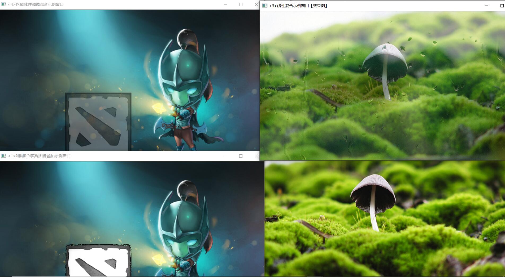


多通道图像混合
```C++
#include <opencv2/core/core.hpp>
#include <opencv2/highgui/highgui.hpp>
#include <iostream>

using namespace cv;
using namespace std;

bool  MultiChannelBlending();
void ShowHelpText();

int main(   )
{
	system("color 9F");

	ShowHelpText( );

	if(MultiChannelBlending( ))
	{
		cout<<endl<<"\n运行成功，得出了需要的图像~! ";
	}

	waitKey(0);
	return 0;
}

void ShowHelpText()
{
	//输出欢迎信息和OpenCV版本
	printf("\n\n\t\t\t非常感谢购买《OpenCV3编程入门》一书！\n");
	printf("\n\n\t\t\t此为本书OpenCV3版的第26个配套示例程序\n");
	printf("\n\n\t\t\t   当前使用的OpenCV版本为：" CV_VERSION );
	printf("\n\n  ----------------------------------------------------------------------------\n");
}

bool  MultiChannelBlending()
{
	//【0】定义相关变量
	Mat srcImage;
	Mat logoImage;
	vector<Mat> channels;
	Mat  imageBlueChannel;

	//=================【蓝色通道部分】=================
	//	描述：多通道混合-蓝色分量部分
	//============================================

	// 【1】读入图片
	logoImage= imread("D:\\2020\\AI\\人工智能\\dota_logo.jpg",0);
	srcImage= imread(""D:\\2020\\AI\\人工智能\\dota_jugg.jpg");

	if( !logoImage.data ) { printf("Oh，no，读取logoImage错误~！ \n"); return false; }
	if( !srcImage.data ) { printf("Oh，no，读取srcImage错误~！ \n"); return false; }

	//【2】把一个3通道图像转换成3个单通道图像
	split(srcImage,channels);//分离色彩通道

	//【3】将原图的蓝色通道引用返回给imageBlueChannel，注意是引用，相当于两者等价，修改其中一个另一个跟着变
	imageBlueChannel= channels.at(0);
	//【4】将原图的蓝色通道的（500,250）坐标处右下方的一块区域和logo图进行加权操作，将得到的混合结果存到imageBlueChannel中
	addWeighted(imageBlueChannel(Rect(500,250,logoImage.cols,logoImage.rows)),1.0,
		logoImage,0.5,0,imageBlueChannel(Rect(500,250,logoImage.cols,logoImage.rows)));

	//【5】将三个单通道重新合并成一个三通道
	merge(channels,srcImage);

	//【6】显示效果图
	namedWindow(" <1>游戏原画+logo蓝色通道");
	imshow(" <1>游戏原画+logo蓝色通道",srcImage);


	//=================【绿色通道部分】=================
	//	描述：多通道混合-绿色分量部分
	//============================================

	//【0】定义相关变量
	Mat  imageGreenChannel;

	//【1】重新读入图片
	logoImage= imread("D:\\2020\\AI\\人工智能\\dota_logo.jpg",0);
	srcImage= imread("D:\\2020\\AI\\人工智能\\dota_jugg.jpg");

	if( !logoImage.data ) { printf("读取logoImage错误~！ \n"); return false; }
	if( !srcImage.data ) { printf("读取srcImage错误~！ \n"); return false; }

	//【2】将一个三通道图像转换成三个单通道图像
	split(srcImage,channels);//分离色彩通道

	//【3】将原图的绿色通道的引用返回给imageBlueChannel，注意是引用，相当于两者等价，修改其中一个另一个跟着变
	imageGreenChannel= channels.at(1);
	//【4】将原图的绿色通道的（500,250）坐标处右下方的一块区域和logo图进行加权操作，将得到的混合结果存到imageGreenChannel中
	addWeighted(imageGreenChannel(Rect(500,250,logoImage.cols,logoImage.rows)),1.0,
		logoImage,0.5,0.,imageGreenChannel(Rect(500,250,logoImage.cols,logoImage.rows)));

	//【5】将三个独立的单通道重新合并成一个三通道
	merge(channels,srcImage);

	//【6】显示效果图
	namedWindow("<2>游戏原画+logo绿色通道");
	imshow("<2>游戏原画+logo绿色通道",srcImage);


	//=================【红色通道部分】=================
	//	描述：多通道混合-红色分量部分
	//============================================

	//【0】定义相关变量
	Mat  imageRedChannel;

	//【1】重新读入图片
	logoImage= imread("D:\\2020\\AI\\人工智能\\dota_logo.jpg",0);
	srcImage= imread("D:\\2020\\AI\\人工智能\\dota_jugg.jpg");

	if( !logoImage.data ) { printf("Oh，no，读取logoImage错误~！ \n"); return false; }
	if( !srcImage.data ) { printf("Oh，no，读取srcImage错误~！ \n"); return false; }

	//【2】将一个三通道图像转换成三个单通道图像
	split(srcImage,channels);//分离色彩通道

	//【3】将原图的红色通道引用返回给imageBlueChannel，注意是引用，相当于两者等价，修改其中一个另一个跟着变
	imageRedChannel= channels.at(2);
	//【4】将原图的红色通道的（500,250）坐标处右下方的一块区域和logo图进行加权操作，将得到的混合结果存到imageRedChannel中
	addWeighted(imageRedChannel(Rect(500,250,logoImage.cols,logoImage.rows)),1.0,
		logoImage,0.5,0.,imageRedChannel(Rect(500,250,logoImage.cols,logoImage.rows)));

	//【5】将三个独立的单通道重新合并成一个三通道
	merge(channels,srcImage);

	//【6】显示效果图
	namedWindow("<3>游戏原画+logo红色通道 ");
	imshow("<3>游戏原画+logo红色通道 ",srcImage);

	return true;
}
```
效果图如下所示
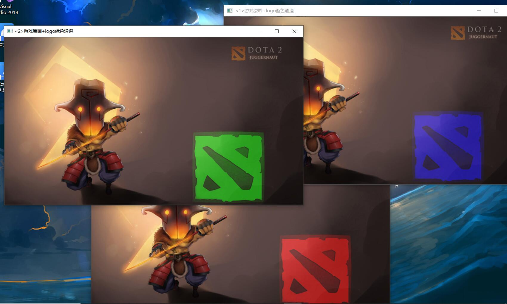

```C++

#include <opencv2/core/core.hpp>
#include <opencv2/highgui/highgui.hpp>
#include "opencv2/imgproc/imgproc.hpp"
#include <iostream>
   
using namespace std;
using namespace cv;


static void ContrastAndBright(int, void *);
void   ShowHelpText();

int g_nContrastValue; //对比度值
int g_nBrightValue;  //亮度值
Mat g_srcImage,g_dstImage;
//-----------------------------------【main( )函数】--------------------------------------------
//	描述：控制台应用程序的入口函数，我们的程序从这里开始
//-----------------------------------------------------------------------------------------------
int main(   )
{
	//改变控制台前景色和背景色
	system("color 2F");  

	ShowHelpText();
	// 读入用户提供的图像
	g_srcImage = imread( "D:\\2020\\AI\\人工智能\\1.jpg");
	if( !g_srcImage.data ) { printf("读取g_srcImage图片错误~！ \n"); return false; }
	g_dstImage = Mat::zeros( g_srcImage.size(), g_srcImage.type() );

	//设定对比度和亮度的初值
	g_nContrastValue=80;
	g_nBrightValue=80;

	//创建窗口
	namedWindow("【效果图窗口】", 1);

	//创建轨迹条
	createTrackbar("对比度：", "【效果图窗口】",&g_nContrastValue, 300,ContrastAndBright );
	createTrackbar("亮   度：", "【效果图窗口】",&g_nBrightValue, 200,ContrastAndBright );

	//调用回调函数
	ContrastAndBright(g_nContrastValue,0);
	ContrastAndBright(g_nBrightValue,0);

	//输出一些帮助信息
	cout<<endl<<"\t运行成功，请调整滚动条观察图像效果\n\n"
		<<"\t按下“q”键时，程序退出\n";

	//按下“q”键时，程序退出
	while(char(waitKey(1)) != 'q') {}
	return 0;
}

//-----------------------------------【ShowHelpText( )函数】----------------------------------
//		 描述：输出一些帮助信息
//----------------------------------------------------------------------------------------------
void ShowHelpText()
{
	//输出欢迎信息和OpenCV版本
	printf("\n\n\t\t\t非常感谢购买《OpenCV3编程入门》一书！\n");
	printf("\n\n\t\t\t此为本书OpenCV3版的第27个配套示例程序\n");
	printf("\n\n\t\t\t   当前使用的OpenCV版本为：" CV_VERSION );
	printf("\n\n  ----------------------------------------------------------------------------\n");
}


//-----------------------------【ContrastAndBright( )函数】------------------------------------
//	描述：改变图像对比度和亮度值的回调函数
//-----------------------------------------------------------------------------------------------
static void ContrastAndBright(int, void *)
{

	// 创建窗口
	namedWindow("【原始图窗口】", 1);

	// 三个for循环，执行运算 g_dstImage(i,j) = a*g_srcImage(i,j) + b
	for( int y = 0; y < g_srcImage.rows; y++ )
	{
		for( int x = 0; x < g_srcImage.cols; x++ )
		{
			for( int c = 0; c < 3; c++ )
			{
				g_dstImage.at<Vec3b>(y,x)[c] = saturate_cast<uchar>( (g_nContrastValue*0.01)*( g_srcImage.at<Vec3b>(y,x)[c] ) + g_nBrightValue );
			}
		}
	}

	// 显示图像
	imshow("【原始图窗口】", g_srcImage);
	imshow("【效果图窗口】", g_dstImage);
}
```
效果图如下所示
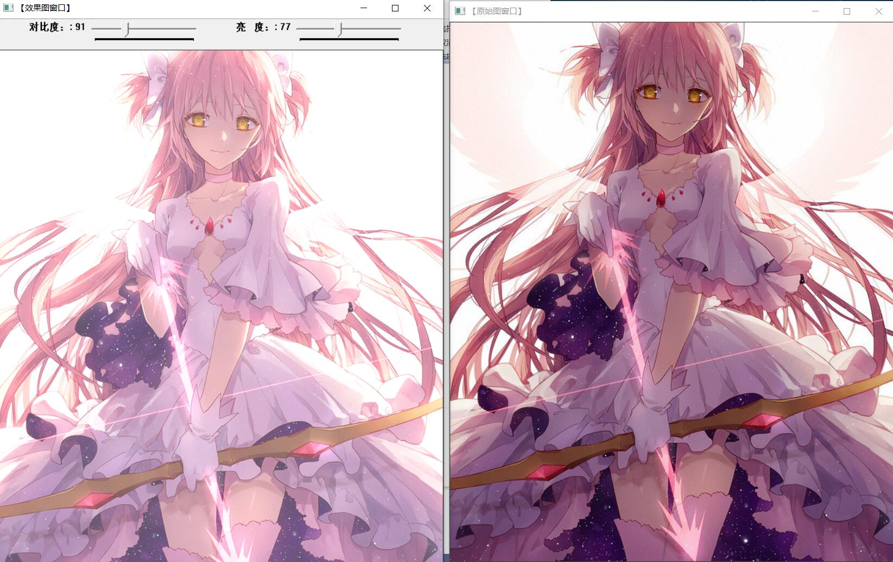


##### 离散傅里叶变换
```C++

#include "opencv2/core/core.hpp"
#include "opencv2/imgproc/imgproc.hpp"
#include "opencv2/highgui/highgui.hpp"
#include <iostream>
using namespace cv;


//-----------------------------------【ShowHelpText( )函数】----------------------------------
//		 描述：输出一些帮助信息
//----------------------------------------------------------------------------------------------
void ShowHelpText()
{
	//输出欢迎信息和OpenCV版本
	printf("\n\n\t\t\t非常感谢购买《OpenCV3编程入门》一书！\n");
	printf("\n\n\t\t\t此为本书OpenCV3版的第28个配套示例程序\n");
	printf("\n\n\t\t\t   当前使用的OpenCV版本为：" CV_VERSION );
	printf("\n\n  ----------------------------------------------------------------------------\n");
}

int main( )
{

	//【1】以灰度模式读取原始图像并显示
	Mat srcImage = imread("1.jpg", 0);
	if(!srcImage.data ) { printf("读取图片错误，请确定目录下是否有imread函数指定图片存在~！ \n"); return false; } 
	imshow("原始图像" , srcImage);   

	ShowHelpText();

	//【2】将输入图像延扩到最佳的尺寸，边界用0补充
	int m = getOptimalDFTSize( srcImage.rows );
	int n = getOptimalDFTSize( srcImage.cols ); 
	//将添加的像素初始化为0.
	Mat padded;  
	copyMakeBorder(srcImage, padded, 0, m - srcImage.rows, 0, n - srcImage.cols, BORDER_CONSTANT, Scalar::all(0));

	//【3】为傅立叶变换的结果(实部和虚部)分配存储空间。
	//将planes数组组合合并成一个多通道的数组complexI
	Mat planes[] = {Mat_<float>(padded), Mat::zeros(padded.size(), CV_32F)};
	Mat complexI;
	merge(planes, 2, complexI);         

	//【4】进行就地离散傅里叶变换
	dft(complexI, complexI);           

	//【5】将复数转换为幅值，即=> log(1 + sqrt(Re(DFT(I))^2 + Im(DFT(I))^2))
	split(complexI, planes); // 将多通道数组complexI分离成几个单通道数组，planes[0] = Re(DFT(I), planes[1] = Im(DFT(I))
	magnitude(planes[0], planes[1], planes[0]);// planes[0] = magnitude  
	Mat magnitudeImage = planes[0];

	//【6】进行对数尺度(logarithmic scale)缩放
	magnitudeImage += Scalar::all(1);
	log(magnitudeImage, magnitudeImage);//求自然对数

	//【7】剪切和重分布幅度图象限
	//若有奇数行或奇数列，进行频谱裁剪      
	magnitudeImage = magnitudeImage(Rect(0, 0, magnitudeImage.cols & -2, magnitudeImage.rows & -2));
	//重新排列傅立叶图像中的象限，使得原点位于图像中心  
	int cx = magnitudeImage.cols/2;
	int cy = magnitudeImage.rows/2;
	Mat q0(magnitudeImage, Rect(0, 0, cx, cy));   // ROI区域的左上
	Mat q1(magnitudeImage, Rect(cx, 0, cx, cy));  // ROI区域的右上
	Mat q2(magnitudeImage, Rect(0, cy, cx, cy));  // ROI区域的左下
	Mat q3(magnitudeImage, Rect(cx, cy, cx, cy)); // ROI区域的右下
	//交换象限（左上与右下进行交换）
	Mat tmp;                           
	q0.copyTo(tmp);
	q3.copyTo(q0);
	tmp.copyTo(q3);
	//交换象限（右上与左下进行交换）
	q1.copyTo(tmp);                 
	q2.copyTo(q1);
	tmp.copyTo(q2);

	//【8】归一化，用0到1之间的浮点值将矩阵变换为可视的图像格式
	//此句代码的OpenCV2版为：
	//normalize(magnitudeImage, magnitudeImage, 0, 1, CV_MINMAX); 
	//此句代码的OpenCV3版为:
	normalize(magnitudeImage, magnitudeImage, 0, 1, NORM_MINMAX); 

	//【9】显示效果图
	imshow("频谱幅值", magnitudeImage);    
	waitKey();

	return 0;
}
```
效果图
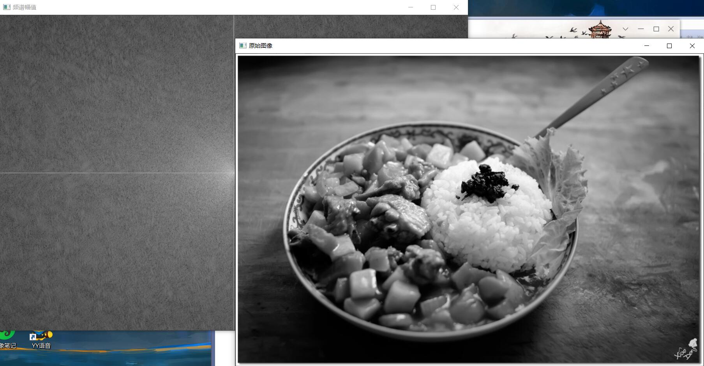

##### 而最后的输入输出XML文件和YAML文件
XML：eXtensible Markup Language
YAML：YAML Ain't a Markup language
此处附上代码
```C++
#include "opencv2/opencv.hpp"  
#include <time.h>  
using namespace cv;  

void ShowHelpText()
{
	//输出欢迎信息和OpenCV版本
	printf("\n\n\t\t\t非常感谢购买《OpenCV3编程入门》一书！\n");
	printf("\n\n\t\t\t此为本书OpenCV3版的第29个配套示例程序\n");
	printf("\n\n\t\t\t   当前使用的OpenCV版本为：" CV_VERSION );
	printf("\n\n  ----------------------------------------------------------------------------\n");
}

int main( )  
{  
	//改变console字体颜色
	system("color 5F"); 

	ShowHelpText();

	//初始化
	FileStorage fs("test.yaml", FileStorage::WRITE);  

	//开始文件写入
	fs << "frameCount" << 5;  
	time_t rawtime; time(&rawtime);  
	fs << "calibrationDate" << asctime(localtime(&rawtime));  
	Mat cameraMatrix = (Mat_<double>(3,3) << 1000, 0, 320, 0, 1000, 240, 0, 0, 1);  
	Mat distCoeffs = (Mat_<double>(5,1) << 0.1, 0.01, -0.001, 0, 0);  
	fs << "cameraMatrix" << cameraMatrix << "distCoeffs" << distCoeffs;  
	fs << "features" << "[";  
	for( int i = 0; i < 3; i++ )  
	{  
		int x = rand() % 640;  
		int y = rand() % 480;  
		uchar lbp = rand() % 256;  

		fs << "{:" << "x" << x << "y" << y << "lbp" << "[:";  
		for( int j = 0; j < 8; j++ )  
			fs << ((lbp >> j) & 1);  
		fs << "]" << "}";  
	}  
	fs << "]";  
	fs.release();  

	printf("\n文件读写完毕，请在工程目录下查看生成的文件~");
	getchar();

	return 0;  
}  
```
生成图
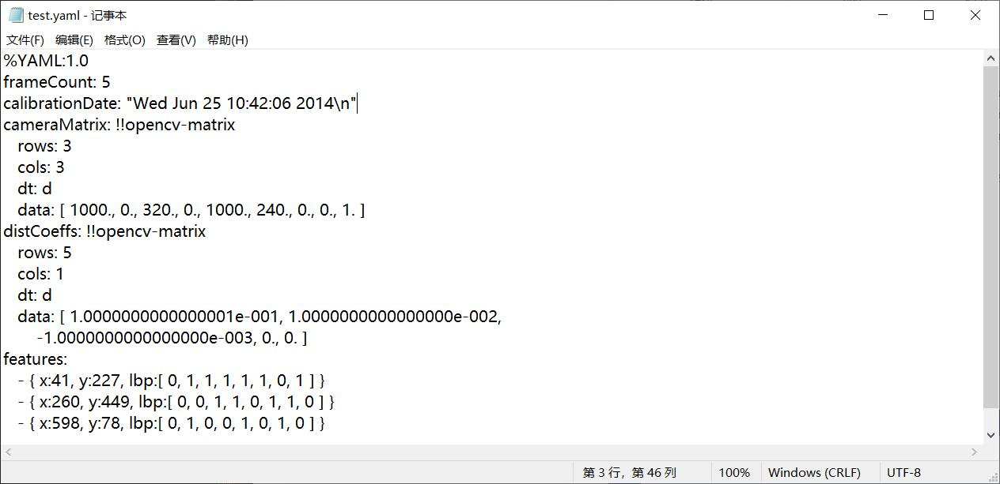
```C++
#include "opencv2/opencv.hpp"  
#include <time.h>  
using namespace cv;  
using namespace std;  

void ShowHelpText()
{
	//输出欢迎信息和OpenCV版本
	printf("\n\n\t\t\t非常感谢购买《OpenCV3编程入门》一书！\n");
	printf("\n\n\t\t\t此为本书OpenCV3版的第30个配套示例程序\n");
	printf("\n\n\t\t\t   当前使用的OpenCV版本为：" CV_VERSION );
	printf("\n\n  ----------------------------------------------------------------------------\n\n");
}

int main( )  
{  
	//改变console字体颜色
	system("color 6F"); 

	ShowHelpText();

	//初始化
	FileStorage fs2("test.yaml", FileStorage::READ);  

	// 第一种方法，对FileNode操作
	int frameCount = (int)fs2["frameCount"];  

	std::string date;  
	// 第二种方法，使用FileNode运算符> > 
	fs2["calibrationDate"] >> date;  

	Mat cameraMatrix2, distCoeffs2;  
	fs2["cameraMatrix"] >> cameraMatrix2;  
	fs2["distCoeffs"] >> distCoeffs2;  

	cout << "frameCount: " << frameCount << endl  
		<< "calibration date: " << date << endl  
		<< "camera matrix: " << cameraMatrix2 << endl  
		<< "distortion coeffs: " << distCoeffs2 << endl;  

	FileNode features = fs2["features"];  
	FileNodeIterator it = features.begin(), it_end = features.end();  
	int idx = 0;  
	std::vector<uchar> lbpval;  

	//使用FileNodeIterator遍历序列
	for( ; it != it_end; ++it, idx++ )  
	{  
		cout << "feature #" << idx << ": ";  
		cout << "x=" << (int)(*it)["x"] << ", y=" << (int)(*it)["y"] << ", lbp: (";  
		// 我们也可以使用使用filenode > > std::vector操作符很容易的读数值阵列
		(*it)["lbp"] >> lbpval;  
		for( int i = 0; i < (int)lbpval.size(); i++ )  
			cout << " " << (int)lbpval[i];  
		cout << ")" << endl;  
	}  
	fs2.release();  

	//程序结束，输出一些帮助文字
	printf("\n文件读取完毕，请输入任意键结束程序~");
	getchar();

	return 0;  
}  

```
之后他会在命令台里面读取test.yaml文件，显示其中的内容