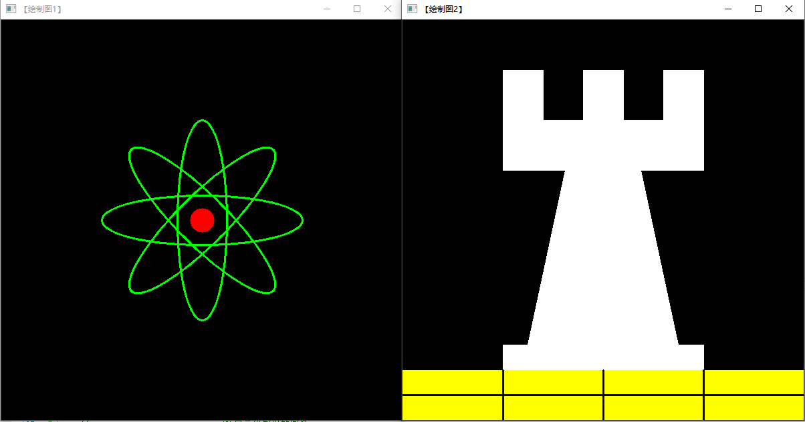
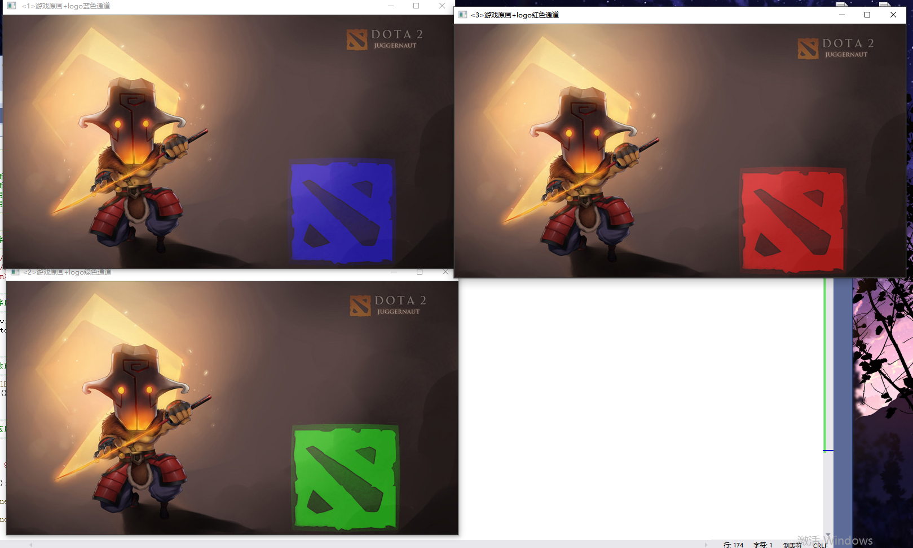
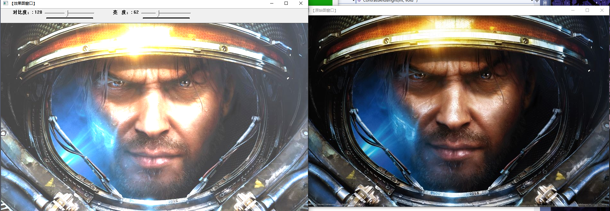
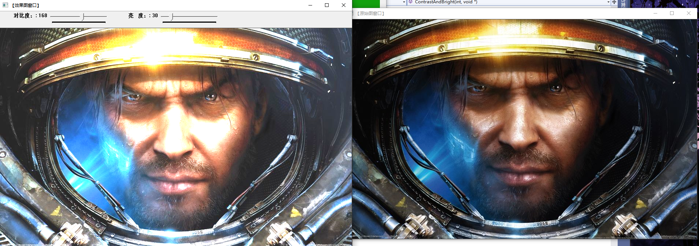
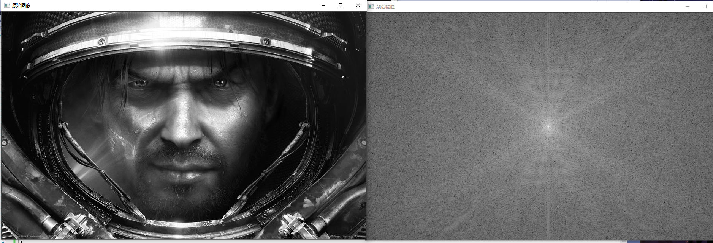

## 基础图像容器Mat
Mat 是一个类，有两个数据部分组成：矩阵头（包含矩阵尺寸，储存方法，储存地址等信息）和一个指向储存所有像素的矩阵（根据所选储存的方法的不同，矩阵也是不同维度的）的指针

使用clone()或者copyTo()可以复制一副图像的矩阵   

### 像素值储存方法
储存像素值需要指定颜色空间和数据类型

颜色系统
-  RGB
-  HSV和HLS把颜色分解成色调，饱和度，亮度，使算法对输入图像的光照条件不敏感
-  YCrCb在JPEG图像格式使用广泛
-  CIE L*a*b是在一种在感知上均匀的颜色空间，他适合用来度量两个颜色之间的距离

### 创建Mat对象的七种方式
```C++
//方法一
- Mat M(2,2,CV_8UC3，Sacalar(0,0,255));
- cout<<"M = "<<endl <<" "<< M << endl <<endl;
```
```C++
//方法二
- int sz[3] = {2,2,2};
- Mat L(3msz,CV_8UC,Scalar::all(0));
```
```C++
//方法三
- IplImage* img  = cvLoadImage("1.jpg",1);
- Mat mtx(img); //转换IplImage*->Mat
```
```C++
//方法四
- M.create(4,4,CV_8UC(2));
- cout<< "M = " << "" << M <<endl << endl;
```
```C++
//方法五 Matlab形式初始化方式
- Mat E = Mat::eye(4,4,CV_64F);
- cout<<"E = "<<endl <<" "<< E << endl <<endl;
- Mat O = Mat::ones(2,2,CV_632F);
- cout<<"O = "<<endl <<" "<< O << endl <<endl;
- Mat Z = Mat::zeros(3,3,CV_8UC1);
- cout<<"Z = "<<endl <<" "<< Z << endl <<endl;
```
```C++
//方法六
- Mat C = (Mat_<double>(3,3)<< 0,-1,0,-1,5,-1,0,-1,0); 
- cout<< "C = " << endl << "" << C <<endl << endl;
```
```C++
//方法七
- Mat RowClone = C.row(1).clone();
- cout << "RowClone = " << endl <<" "<< RowClone << endl << endl;
```
## 基本图形绘制
```C++
#include <opencv2/core/core.hpp>
#include <opencv2/highgui/highgui.hpp>
using namespace cv;

#include <opencv2/imgproc/imgproc.hpp>


#define WINDOW_NAME1 "【绘制图1】"        
#define WINDOW_NAME2 "【绘制图2】"         
#define WINDOW_NAME3 "【绘制图3】"        //为窗口标题定义的宏 
#define WINDOW_WIDTH 600
// 椭圆
void DrawEllipse(Mat img, double angle)
{
    int thickness = 2;
    int lineType = 8;

    // 
    ellipse(
        img,
        Point(WINDOW_WIDTH / 2, WINDOW_WIDTH / 2),
        Size(WINDOW_WIDTH / 4, WINDOW_WIDTH / 16),
        angle,
        0,
        360,
        Scalar(0, 255, 0),
        thickness,
        lineType);
}


// 圆
void DrawFilledCircle(Mat img, Point center)
{
    int thickness = -1;
    int lineType = 8;

    circle(
        img,
        center,
        WINDOW_WIDTH / 32,
        Scalar(0, 0, 255),
        thickness,
        lineType);
}

// 多边形
void DrawPolygon(Mat img)
{
    int lineType = 8;

    //创建一些点
    Point rookPoints[1][20];
    rookPoints[0][0] = Point(WINDOW_WIDTH / 4, 7 * WINDOW_WIDTH / 8);
    rookPoints[0][1] = Point(3 * WINDOW_WIDTH / 4, 7 * WINDOW_WIDTH / 8);
    rookPoints[0][2] = Point(3 * WINDOW_WIDTH / 4, 13 * WINDOW_WIDTH / 16);
    rookPoints[0][3] = Point(11 * WINDOW_WIDTH / 16, 13 * WINDOW_WIDTH / 16);
    rookPoints[0][4] = Point(19 * WINDOW_WIDTH / 32, 3 * WINDOW_WIDTH / 8);
    rookPoints[0][5] = Point(3 * WINDOW_WIDTH / 4, 3 * WINDOW_WIDTH / 8);
    rookPoints[0][6] = Point(3 * WINDOW_WIDTH / 4, WINDOW_WIDTH / 8);
    rookPoints[0][7] = Point(26 * WINDOW_WIDTH / 40, WINDOW_WIDTH / 8);
    rookPoints[0][8] = Point(26 * WINDOW_WIDTH / 40, WINDOW_WIDTH / 4);
    rookPoints[0][9] = Point(22 * WINDOW_WIDTH / 40, WINDOW_WIDTH / 4);
    rookPoints[0][10] = Point(22 * WINDOW_WIDTH / 40, WINDOW_WIDTH / 8);
    rookPoints[0][11] = Point(18 * WINDOW_WIDTH / 40, WINDOW_WIDTH / 8);
    rookPoints[0][12] = Point(18 * WINDOW_WIDTH / 40, WINDOW_WIDTH / 4);
    rookPoints[0][13] = Point(14 * WINDOW_WIDTH / 40, WINDOW_WIDTH / 4);
    rookPoints[0][14] = Point(14 * WINDOW_WIDTH / 40, WINDOW_WIDTH / 8);
    rookPoints[0][15] = Point(WINDOW_WIDTH / 4, WINDOW_WIDTH / 8);
    rookPoints[0][16] = Point(WINDOW_WIDTH / 4, 3 * WINDOW_WIDTH / 8);
    rookPoints[0][17] = Point(13 * WINDOW_WIDTH / 32, 3 * WINDOW_WIDTH / 8);
    rookPoints[0][18] = Point(5 * WINDOW_WIDTH / 16, 13 * WINDOW_WIDTH / 16);
    rookPoints[0][19] = Point(WINDOW_WIDTH / 4, 13 * WINDOW_WIDTH / 16);

    const Point* ppt[1] = { rookPoints[0] };
    int npt[] = { 20 };

    fillPoly(img,
        ppt,
        npt,
        1,
        Scalar(255, 255, 255),
        lineType);
}


void DrawLine(Mat img, Point start, Point end)
{
    int lineType = 8;
    int thickness = 2;
    line(img,
        start,
        end,
        Scalar(0, 0, 0),
        thickness,
        lineType);
}


int main(void)
{

    
    Mat atomImage = Mat::zeros(WINDOW_WIDTH, WINDOW_WIDTH, CV_8UC3);
    Mat rookImage = Mat::zeros(WINDOW_WIDTH, WINDOW_WIDTH, CV_8UC3);

    //绘制椭圆
    DrawEllipse(atomImage, 90);
    DrawEllipse(atomImage, 0);
    DrawEllipse(atomImage, 45);
    DrawEllipse(atomImage, -45);

    DrawFilledCircle(atomImage, Point(WINDOW_WIDTH / 2, WINDOW_WIDTH / 2));

    imshow(WINDOW_NAME1, atomImage);
    moveWindow(WINDOW_NAME1, 0, 200);


    // ----------------------------<2>绘制组合图-----------------------------
    //【2.1】多边形
    DrawPolygon(rookImage);

    // 【2.2】绘制底部矩形
    rectangle(rookImage,
        Point(0, 7 * WINDOW_WIDTH / 8),
        Point(WINDOW_WIDTH, WINDOW_WIDTH),
        Scalar(0, 255, 255),
        -1,
        8);

    // 【2.3】绘制底部线段
    DrawLine(rookImage, Point(0, 15 * WINDOW_WIDTH / 16), Point(WINDOW_WIDTH, 15 * WINDOW_WIDTH / 16));
    DrawLine(rookImage, Point(WINDOW_WIDTH / 4, 7 * WINDOW_WIDTH / 8), Point(WINDOW_WIDTH / 4, WINDOW_WIDTH));
    DrawLine(rookImage, Point(WINDOW_WIDTH / 2, 7 * WINDOW_WIDTH / 8), Point(WINDOW_WIDTH / 2, WINDOW_WIDTH));
    DrawLine(rookImage, Point(3 * WINDOW_WIDTH / 4, 7 * WINDOW_WIDTH / 8), Point(3 * WINDOW_WIDTH / 4, WINDOW_WIDTH));

    // ---------------------------<3>显示绘制出的图像------------------------
    imshow(WINDOW_NAME2, rookImage);
    moveWindow(WINDOW_NAME2, WINDOW_WIDTH, 200);


    //    imshow(WINDOW_NAME3, rookImage + atomImage);

    waitKey(0);
    return(0);
}
```
PS：本章的大部分新的函数在第一部分实验样例代码就遇到并且在MarkDown文件写过，此处不再赘述。

测试结果：


### 访问图像中像素的三种方法
- 方法1 指针访问：C操作符[];
- 方法2 迭代器iterator
- 方法3 动态地址计算

代码样例：
```C++
#include <iostream>
#include <opencv2\imgproc\types_c.h>
#include <opencv2/opencv.hpp>  
using namespace cv;
using namespace std;
 
void VisitImgByPointer(Mat &inputImg, Mat &dstImg);
void VisitContinueImgByPointer(Mat &inputImg, Mat &dstImg);
void VisitImgByIterator(Mat &inputImg, Mat &dstImg);
void VisitImgByAt(Mat &inputImg, Mat &dstImg);
 
int main()
{
    Mat srcImg = imread("pig.png"), dstImg;
    Mat grayImg;
    cvtColor(srcImg, grayImg, CV_BGR2GRAY);
    //VisitImgByPointer(srcImg,dstImg);
    //VisitContinueImgByPointer(grayImg,dstImg);
    
    //VisitImgByIterator(srcImg,dstImg);
    //VisitImgByIterator(grayImg,dstImg);
    
    //VisitImgByAt(srcImg,dstImg);
    VisitImgByAt(grayImg,dstImg);
 
    //imshow("原始图", srcImg);
    //imshow("灰度图", grayImg);
    imshow("生成图", dstImg);
 
    waitKey(0);
    return 0;
}
 
void VisitImgByPointer(Mat &inputImg, Mat &dstImg)
{
    dstImg = inputImg.clone();
    int rows = dstImg.rows;
    int cols = dstImg.cols * dstImg.channels();
 
    for(int i = 0; i < rows; i++)
    {
        uchar* data = dstImg.ptr<uchar>(i);
        for(int j = 0; j < cols; j++)
        {
            data[j] = 0;  //处理每一个像素
            //add code
        }
    } 
}
 
void VisitContinueImgByPointer(Mat &inputImg, Mat &dstImg)
{
    dstImg = inputImg.clone();
    int rows = dstImg.rows;
    int cols = dstImg.cols;
    int channels = dstImg.channels();
 
    if(dstImg.isContinuous())
    {
        cols *= rows;
        rows = 1;
        //cout << "is continuous " << endl;
    }
 
    for(int i = 0; i < rows; i++)
    {
        uchar* data = dstImg.ptr<uchar>(i);
        for(int j = 0; j < cols * channels; j++)
        {
            data[j] = 155;  //处理每一个像素
            //add code
        }
    } 
    //若存储连续，等效于一下代码
    //uchar* data = dstImg.data;
    //for(int i = 0; i < cols * rows * channels; i++)
    //    data[i] = 155;    //处理每一个像素
 
}
 
 
void VisitImgByIterator(Mat &inputImg, Mat &dstImg)
{
    dstImg = inputImg.clone();
    const int channels = dstImg.channels();
  
    switch(channels)
    {
    case 1:
        {
            Mat_<uchar>::iterator it= dstImg.begin<uchar>();
            Mat_<uchar>::iterator itend= dstImg.end<uchar>();
            for ( ; it!= itend; it++) //处理每一个像素
            {
                *it = 150;
            }
            break;
        }
    case 3:
        {
            Mat_<Vec3b>::iterator it3= dstImg.begin<Vec3b>();
            Mat_<Vec3b>::iterator itend3= dstImg.end<Vec3b>();
            for ( ; it3!= itend3; it3++) //处理每一个像素
            { 
                (*it3)[0]= 255;
                (*it3)[1]= 0;
                (*it3)[2]= 0;
            }
            break;
        }
    }
}
 
void VisitImgByAt(Mat &inputImg, Mat &dstImg)
{
    dstImg = inputImg.clone();
    int rows = dstImg.rows;
    int cols = dstImg.cols;
    int channels = dstImg.channels();
 
    switch(channels)
    {
    case 1:
        {
            for(int i = 0; i < rows; i++)
                for(int j = 0; j < cols; j++)
                    dstImg.at<uchar>(i,j) = 150;
            break;
        }
    case 3:
        {
            for(int i = 0; i < rows; i++)
                for(int j = 0; j < cols; j++)
                {
                    dstImg.at<Vec3b>(i,j)[0] =  0;
                    dstImg.at<Vec3b>(i,j)[1] =  0;
                    dstImg.at<Vec3b>(i,j)[2] = 255;
                }
            break;
        }
    }
}
```
###初级图像混合
原理：$g(x) = a f_0(x)+(1-a)f_1(x)$
代码样例：
```C++
#include <opencv2/core/core.hpp>
#include <opencv2/highgui/highgui.hpp>
#include <iostream>

using namespace cv;
using namespace std;


bool ROI_AddImage()
{

    // 【1】读入图像
    Mat srcImage1 = imread("dota_pa.jpg");
    Mat logoImage = imread("dota_logo.jpg");
    if( !srcImage1.data ) { printf("读取srcImage1错误~！ \n"); return false; }
    if( !logoImage.data ) { printf("读取logoImage错误~！ \n"); return false; }

    // 【2】定义一个Mat类型并给其设定ROI区域
    Mat imageROI = srcImage1(Rect(100, 150, logoImage.cols, logoImage.rows));

    // 【3】加载掩模（必须是灰度图）
    Mat mask = imread("dota_logo.jpg", 0);

    //【4】将掩膜拷贝到ROI
    logoImage.copyTo(imageROI, mask);

    // 【5】显示结果
    namedWindow("<1>利用ROI实现图像叠加示例窗口");
    imshow("<1>利用ROI实现图像叠加示例窗口",srcImage1);

    return true;
}


bool  LinearBlending()
{
    //【0】定义一些局部变量
    double alphaValue = 0.5;
    double betaValue;
    Mat srcImage2, srcImage3, dstImage;

    // 【1】读取图像 ( 两幅图片需为同样的类型和尺寸 )
    srcImage2 = imread("mogu.jpg");
    srcImage3 = imread("rain.jpg");

    if( !srcImage2.data ) { printf("读取srcImage2错误！ \n"); return false; }
    if( !srcImage3.data ) { printf("读取srcImage3错误！ \n"); return false; }

    // 【2】进行图像混合加权操作
    betaValue = ( 1.0 - alphaValue );
    addWeighted( srcImage2, alphaValue, srcImage3, betaValue, 0.0, dstImage);

    // 【3】显示原图窗口
    imshow( "<2>线性混合示例窗口【原图】", srcImage2 );
    imshow( "<3>线性混合示例窗口【效果图】", dstImage );

    return true;
}


bool  ROI_LinearBlending()
{

    //【1】读取图像
    Mat srcImage4 = imread("dota_pa.jpg", 1);
    Mat logoImage = imread("dota_logo.jpg");

    if( !srcImage4.data ) { printf("读取srcImage4错误~！ \n"); return false; }
    if( !logoImage.data ) { printf("读取logoImage错误~！ \n"); return false; }

    //【2】定义一个Mat类型并给其设定ROI区域
    Mat imageROI;
    //方法一
    imageROI= srcImage4(Rect(100, 150, logoImage.cols, logoImage.rows));
    //方法二
    //imageROI= srcImage4(Range(250,250+logoImage.rows),Range(200,200+logoImage.cols));

    //【3】将logo加到原图上
    addWeighted(imageROI, 0.5, logoImage, 0.3, 0., imageROI);

    //【4】显示结果
    imshow("<4>区域线性图像混合示例窗口", srcImage4);

    return true;
}


int main()
{

    if(ROI_AddImage() && LinearBlending() && ROI_LinearBlending())
    {
        cout << endl << "\n运行成功，得出了需要的图像~!";
    }

    waitKey(0);
    return 0;
}
```

## 分离颜色通道，多通道图像混合
```C++

//--------------------------------------【程序说明】-------------------------------------------
//		程序说明：《OpenCV3编程入门》OpenCV2版书本配套示例程序26
//		程序描述：分离颜色通道&多通道图像混合
//		开发测试所用IDE版本：Visual Studio 2010
//		开发测试所用OpenCV版本：	3.0 beta
//		2014年11月 Created by @浅墨_毛星云
//		2014年12月 Revised by @浅墨_毛星云
//------------------------------------------------------------------------------------------------

//-----------------------------------【头文件包含部分】---------------------------------------
//	描述：包含程序所依赖的头文件
//------------------------------------------------------------------------------------------------                                                                                     
#include <opencv2/core/core.hpp>
#include <opencv2/highgui/highgui.hpp>
#include <iostream>

//-----------------------------------【命名空间声明部分】---------------------------------------
//	描述：包含程序所使用的命名空间
//-------------------------------------------------------------------------------------------------   
using namespace cv;
using namespace std;


//-----------------------------------【全局函数声明部分】--------------------------------------
//	描述：全局函数声明
//-----------------------------------------------------------------------------------------------
bool  MultiChannelBlending();
void ShowHelpText();


//-----------------------------------【main( )函数】------------------------------------------
//	描述：控制台应用程序的入口函数，我们的程序从这里开始
//-----------------------------------------------------------------------------------------------
int main()
{
	system("color 9F");

	ShowHelpText();

	if (MultiChannelBlending())
	{
		cout << endl << "\n运行成功，得出了需要的图像~! ";
	}

	waitKey(0);
	return 0;
}


//-----------------------------------【ShowHelpText( )函数】----------------------------------
//		 描述：输出一些帮助信息
//----------------------------------------------------------------------------------------------
void ShowHelpText()
{
	//输出欢迎信息和OpenCV版本
	printf("\n\n\t\t\t非常感谢购买《OpenCV3编程入门》一书！\n");
	printf("\n\n\t\t\t此为本书OpenCV3版的第26个配套示例程序\n");
	printf("\n\n\t\t\t   当前使用的OpenCV版本为：" CV_VERSION);
	printf("\n\n  ----------------------------------------------------------------------------\n");
}


//-----------------------------【MultiChannelBlending( )函数】--------------------------------
//	描述：多通道混合的实现函数
//-----------------------------------------------------------------------------------------------
bool  MultiChannelBlending()
{
	//【0】定义相关变量
	Mat srcImage;
	Mat logoImage;
	vector<Mat> channels;
	Mat  imageBlueChannel;

	//=================【蓝色通道部分】=================
	//	描述：多通道混合-蓝色分量部分
	//============================================

	// 【1】读入图片
	logoImage = imread("dota_logo.jpg", 0);
	srcImage = imread("dota_jugg.jpg");

	if (!logoImage.data) { printf("Oh，no，读取logoImage错误~！ \n"); return false; }
	if (!srcImage.data) { printf("Oh，no，读取srcImage错误~！ \n"); return false; }

	//【2】把一个3通道图像转换成3个单通道图像
	split(srcImage, channels);//分离色彩通道

	//【3】将原图的蓝色通道引用返回给imageBlueChannel，注意是引用，相当于两者等价，修改其中一个另一个跟着变
	imageBlueChannel = channels.at(0);
	//【4】将原图的蓝色通道的（500,250）坐标处右下方的一块区域和logo图进行加权操作，将得到的混合结果存到imageBlueChannel中
	addWeighted(imageBlueChannel(Rect(500, 250, logoImage.cols, logoImage.rows)), 1.0,
		logoImage, 0.5, 0, imageBlueChannel(Rect(500, 250, logoImage.cols, logoImage.rows)));

	//【5】将三个单通道重新合并成一个三通道
	merge(channels, srcImage);

	//【6】显示效果图
	namedWindow(" <1>游戏原画+logo蓝色通道");
	imshow(" <1>游戏原画+logo蓝色通道", srcImage);


	//=================【绿色通道部分】=================
	//	描述：多通道混合-绿色分量部分
	//============================================

	//【0】定义相关变量
	Mat  imageGreenChannel;

	//【1】重新读入图片
	logoImage = imread("dota_logo.jpg", 0);
	srcImage = imread("dota_jugg.jpg");

	if (!logoImage.data) { printf("读取logoImage错误~！ \n"); return false; }
	if (!srcImage.data) { printf("读取srcImage错误~！ \n"); return false; }

	//【2】将一个三通道图像转换成三个单通道图像
	split(srcImage, channels);//分离色彩通道

	//【3】将原图的绿色通道的引用返回给imageBlueChannel，注意是引用，相当于两者等价，修改其中一个另一个跟着变
	imageGreenChannel = channels.at(1);
	//【4】将原图的绿色通道的（500,250）坐标处右下方的一块区域和logo图进行加权操作，将得到的混合结果存到imageGreenChannel中
	addWeighted(imageGreenChannel(Rect(500, 250, logoImage.cols, logoImage.rows)), 1.0,
		logoImage, 0.5, 0., imageGreenChannel(Rect(500, 250, logoImage.cols, logoImage.rows)));

	//【5】将三个独立的单通道重新合并成一个三通道
	merge(channels, srcImage);

	//【6】显示效果图
	namedWindow("<2>游戏原画+logo绿色通道");
	imshow("<2>游戏原画+logo绿色通道", srcImage);


	//=================【红色通道部分】=================
	//	描述：多通道混合-红色分量部分
	//============================================

	//【0】定义相关变量
	Mat  imageRedChannel;

	//【1】重新读入图片
	logoImage = imread("dota_logo.jpg", 0);
	srcImage = imread("dota_jugg.jpg");

	if (!logoImage.data) { printf("Oh，no，读取logoImage错误~！ \n"); return false; }
	if (!srcImage.data) { printf("Oh，no，读取srcImage错误~！ \n"); return false; }

	//【2】将一个三通道图像转换成三个单通道图像
	split(srcImage, channels);//分离色彩通道

	//【3】将原图的红色通道引用返回给imageBlueChannel，注意是引用，相当于两者等价，修改其中一个另一个跟着变
	imageRedChannel = channels.at(2);
	//【4】将原图的红色通道的（500,250）坐标处右下方的一块区域和logo图进行加权操作，将得到的混合结果存到imageRedChannel中
	addWeighted(imageRedChannel(Rect(500, 250, logoImage.cols, logoImage.rows)), 1.0,
		logoImage, 0.5, 0., imageRedChannel(Rect(500, 250, logoImage.cols, logoImage.rows)));

	//【5】将三个独立的单通道重新合并成一个三通道
	merge(channels, srcImage);

	//【6】显示效果图
	namedWindow("<3>游戏原画+logo红色通道 ");
	imshow("<3>游戏原画+logo红色通道 ", srcImage);

	return true;
}

```
代码结果：


#### 函数分析
```C++
void split(const Mat& src, Mat*mvbegin);
```
将一个多通道数组分离成几个单通道数组
```C++
void merge(const Mat* mv, size_tcount, OutputArray dst)
```
merge()函数的功能是split()函数的逆向操作，将多个数组组合合并成一个多通道的数组

#### 图像亮度、对比度调整
算子：$g(x)=a*f(x)+b$
- $f(x)$表示源图像像素
- $g(x)$表示输出图像像素
- $a$（需要满足啊$a>0$）被称为增益，常常被用来控制图像的对比度
- $b$通常被称为偏置，常常用来控制图像的亮度

```C++


//--------------------------------------【程序说明】-------------------------------------------
//		程序说明：《OpenCV3编程入门》OpenCV3版书本配套示例程序27
//		程序描述：图像对比度、亮度值调整
//		开发测试所用IDE版本：Visual Studio 2010
//		开发测试所用OpenCV版本：	3.0 beta
//		2014年11月 Created by @浅墨_毛星云
//		2014年12月 Revised by @浅墨_毛星云
//------------------------------------------------------------------------------------------------


//-----------------------------------【头文件包含部分】---------------------------------------
//	描述：包含程序所依赖的头文件
//---------------------------------------------------------------------------------------------- 
#include <opencv2/core/core.hpp>
#include <opencv2/highgui/highgui.hpp>
#include "opencv2/imgproc/imgproc.hpp"
#include <iostream>

//-----------------------------------【命名空间声明部分】---------------------------------------
//	描述：包含程序所使用的命名空间
//-----------------------------------------------------------------------------------------------   
using namespace std;
using namespace cv;


//-----------------------------------【全局函数声明部分】--------------------------------------
//	描述：全局函数声明
//-----------------------------------------------------------------------------------------------
static void ContrastAndBright(int, void*);
void   ShowHelpText();

//-----------------------------------【全局变量声明部分】--------------------------------------
//	描述：全局变量声明
//-----------------------------------------------------------------------------------------------
int g_nContrastValue; //对比度值
int g_nBrightValue;  //亮度值
Mat g_srcImage, g_dstImage;
//-----------------------------------【main( )函数】--------------------------------------------
//	描述：控制台应用程序的入口函数，我们的程序从这里开始
//-----------------------------------------------------------------------------------------------
int main()
{
	//改变控制台前景色和背景色
	system("color 2F");

	ShowHelpText();
	// 读入用户提供的图像
	g_srcImage = imread("1.jpg");
	if (!g_srcImage.data) { printf("读取g_srcImage图片错误~！ \n"); return false; }
	g_dstImage = Mat::zeros(g_srcImage.size(), g_srcImage.type());

	//设定对比度和亮度的初值
	g_nContrastValue = 80;
	g_nBrightValue = 80;

	//创建窗口
	namedWindow("【效果图窗口】", 1);

	//创建轨迹条
	createTrackbar("对比度：", "【效果图窗口】", &g_nContrastValue, 300, ContrastAndBright);
	createTrackbar("亮   度：", "【效果图窗口】", &g_nBrightValue, 200, ContrastAndBright);

	//调用回调函数
	ContrastAndBright(g_nContrastValue, 0);
	ContrastAndBright(g_nBrightValue, 0);

	//输出一些帮助信息
	cout << endl << "\t运行成功，请调整滚动条观察图像效果\n\n"
		<< "\t按下“q”键时，程序退出\n";

	//按下“q”键时，程序退出
	while (char(waitKey(1)) != 'q') {}
	return 0;
}


//-----------------------------------【ShowHelpText( )函数】----------------------------------
//		 描述：输出一些帮助信息
//----------------------------------------------------------------------------------------------
void ShowHelpText()
{
	//输出欢迎信息和OpenCV版本
	printf("\n\n\t\t\t非常感谢购买《OpenCV3编程入门》一书！\n");
	printf("\n\n\t\t\t此为本书OpenCV3版的第27个配套示例程序\n");
	printf("\n\n\t\t\t   当前使用的OpenCV版本为：" CV_VERSION);
	printf("\n\n  ----------------------------------------------------------------------------\n");
}


//-----------------------------【ContrastAndBright( )函数】------------------------------------
//	描述：改变图像对比度和亮度值的回调函数
//-----------------------------------------------------------------------------------------------
static void ContrastAndBright(int, void*)
{

	// 创建窗口
	namedWindow("【原始图窗口】", 1);

	// 三个for循环，执行运算 g_dstImage(i,j) = a*g_srcImage(i,j) + b
	for (int y = 0; y < g_srcImage.rows; y++)
	{
		for (int x = 0; x < g_srcImage.cols; x++)
		{
			for (int c = 0; c < 3; c++)
			{
				g_dstImage.at<Vec3b>(y, x)[c] = saturate_cast<uchar>((g_nContrastValue * 0.01) * (g_srcImage.at<Vec3b>(y, x)[c]) + g_nBrightValue);
			}
		}
	}

	// 显示图像
	imshow("【原始图窗口】", g_srcImage);
	imshow("【效果图窗口】", g_dstImage);
}

```
运行结果：



### 离散傅里叶变化

原理：$X(k)= ∑n={0,N-1}x(n) e^{-j2πkn/N}$

代码样例：
```C++
//--------------------------------------【程序说明】-------------------------------------------
//		程序说明：《OpenCV3编程入门》OpenCV2版书本配套示例程序28
//		程序描述：离散傅里叶变换
//		开发测试所用IDE版本：Visual Studio 2010
//		开发测试所用OpenCV版本：	3.0 beta
//		2014年11月 Created by @浅墨_毛星云
//		2014年12月 Revised by @浅墨_毛星云
//------------------------------------------------------------------------------------------------


//---------------------------------【头文件、命名空间包含部分】-----------------------------
//		描述：包含程序所使用的头文件和命名空间
//-------------------------------------------------------------------------------------------------
#include "opencv2/core/core.hpp"
#include "opencv2/imgproc/imgproc.hpp"
#include "opencv2/highgui/highgui.hpp"
#include <iostream>
using namespace cv;


//-----------------------------------【ShowHelpText( )函数】----------------------------------
//		 描述：输出一些帮助信息
//----------------------------------------------------------------------------------------------
void ShowHelpText()
{
	//输出欢迎信息和OpenCV版本
	printf("\n\n\t\t\t非常感谢购买《OpenCV3编程入门》一书！\n");
	printf("\n\n\t\t\t此为本书OpenCV3版的第28个配套示例程序\n");
	printf("\n\n\t\t\t   当前使用的OpenCV版本为：" CV_VERSION);
	printf("\n\n  ----------------------------------------------------------------------------\n");
}


//--------------------------------------【main( )函数】-----------------------------------------
//          描述：控制台应用程序的入口函数，我们的程序从这里开始执行
//-------------------------------------------------------------------------------------------------
int main()
{

	//【1】以灰度模式读取原始图像并显示
	Mat srcImage = imread("1.jpg", 0);
	if (!srcImage.data) { printf("读取图片错误，请确定目录下是否有imread函数指定图片存在~！ \n"); return false; }
	imshow("原始图像", srcImage);

	ShowHelpText();

	//【2】将输入图像延扩到最佳的尺寸，边界用0补充
	int m = getOptimalDFTSize(srcImage.rows);
	int n = getOptimalDFTSize(srcImage.cols);
	//将添加的像素初始化为0.
	Mat padded;
	copyMakeBorder(srcImage, padded, 0, m - srcImage.rows, 0, n - srcImage.cols, BORDER_CONSTANT, Scalar::all(0));

	//【3】为傅立叶变换的结果(实部和虚部)分配存储空间。
	//将planes数组组合合并成一个多通道的数组complexI
	Mat planes[] = { Mat_<float>(padded), Mat::zeros(padded.size(), CV_32F) };
	Mat complexI;
	merge(planes, 2, complexI);

	//【4】进行就地离散傅里叶变换
	dft(complexI, complexI);

	//【5】将复数转换为幅值，即=> log(1 + sqrt(Re(DFT(I))^2 + Im(DFT(I))^2))
	split(complexI, planes); // 将多通道数组complexI分离成几个单通道数组，planes[0] = Re(DFT(I), planes[1] = Im(DFT(I))
	magnitude(planes[0], planes[1], planes[0]);// planes[0] = magnitude  
	Mat magnitudeImage = planes[0];

	//【6】进行对数尺度(logarithmic scale)缩放
	magnitudeImage += Scalar::all(1);
	log(magnitudeImage, magnitudeImage);//求自然对数

	//【7】剪切和重分布幅度图象限
	//若有奇数行或奇数列，进行频谱裁剪      
	magnitudeImage = magnitudeImage(Rect(0, 0, magnitudeImage.cols & -2, magnitudeImage.rows & -2));
	//重新排列傅立叶图像中的象限，使得原点位于图像中心  
	int cx = magnitudeImage.cols / 2;
	int cy = magnitudeImage.rows / 2;
	Mat q0(magnitudeImage, Rect(0, 0, cx, cy));   // ROI区域的左上
	Mat q1(magnitudeImage, Rect(cx, 0, cx, cy));  // ROI区域的右上
	Mat q2(magnitudeImage, Rect(0, cy, cx, cy));  // ROI区域的左下
	Mat q3(magnitudeImage, Rect(cx, cy, cx, cy)); // ROI区域的右下
	//交换象限（左上与右下进行交换）
	Mat tmp;
	q0.copyTo(tmp);
	q3.copyTo(q0);
	tmp.copyTo(q3);
	//交换象限（右上与左下进行交换）
	q1.copyTo(tmp);
	q2.copyTo(q1);
	tmp.copyTo(q2);

	//【8】归一化，用0到1之间的浮点值将矩阵变换为可视的图像格式
	//此句代码的OpenCV2版为：
	//normalize(magnitudeImage, magnitudeImage, 0, 1, CV_MINMAX); 
	//此句代码的OpenCV3版为:
	normalize(magnitudeImage, magnitudeImage, 0, 1, NORM_MINMAX);

	//【9】显示效果图
	imshow("频谱幅值", magnitudeImage);
	waitKey();

	return 0;
}
```

运行结果：


函数分析：
```C++
void dft(InputArray src, OutputArray dst, int flags=0, int nonzeroRows=0)
```
    InputArray src: 输入图像，可以是实数或虚数 
    OutputArray dst: 输出图像，其大小和类型取决于第三个参数flags 
    int flags = 0: 转换的标识符，有默认值0.其可取的值如下所示： 

- DFT_INVERSE: 用一维或二维逆变换取代默认的正向变换 
- DFT_SCALE: 缩放比例标识符，根据数据元素个数平均求出其缩放结果，如有N个元素，则输出结果以1/N缩放输出，常与DFT_INVERSE搭配使用。 
- DFT_ROWS: 对输入矩阵的每行进行正向或反向的傅里叶变换；此标识符可在处理多种适量的的时候用于减小资源的开销，这些处理常常是三维或高维变换等复杂操作。 
- DFT_COMPLEX_OUTPUT: 对一维或二维的实数数组进行正向变换，这样的结果虽然是复数阵列，但拥有复数的共轭对称性（CCS），可以以一个和原数组尺寸大小相同的实数数组进行填充，这是最快的选择也是函数默认的方法。你可能想要得到一个全尺寸的复数数组（像简单光谱分析等等），通过设置标志位可以使函数生成一个全尺寸的复数输出数组。 
- DFT_REAL_OUTPUT: 对一维二维复数数组进行逆向变换，这样的结果通常是一个尺寸相同的复数矩阵，但是如果输入矩阵有复数的共轭对称性（比如是一个带有DFT_COMPLEX_OUTPUT标识符的正变换结果），便会输出实数矩阵。 

    int nonzeroRows = 0: 当这个参数不为0，函数会假设只有输入数组（没有设置DFT_INVERSE）的第一行或第一个输出数组（设置了DFT_INVERSE）包含非零值。这样的话函数就可以对其他的行进行更高效的处理节省一些时间，这项技术尤其是在采用DFT计算矩阵卷积时非常有效。

```C++
int getOptimalDFTSize(int vecsize)
```
返回给定向量尺寸经过DFT变换后结果的最优尺寸大小
```C++
void magnitude(InputArray x, InputArray y, OutputArray magnitude)
```
计算二维矢量的幅值
- InputArray x: 浮点型数组的x坐标矢量，也就是实部 
- InputArray y: 浮点型数组的y坐标矢量，必须和x尺寸相同 
- OutputArray magnitude: 与x类型和尺寸相同的输出数组 

```C++
void copyMakeBorder(InputArray src, OutputArray dst, int top, int bottom, int left, int right, int borderType, const Scalar& value=Scalar() )
```
扩充图像边界
- InputArray src: 输入图像 
- OutputArray dst: 输出图像，与src图像有相同的类型，其尺寸应为Size(src.cols+left+right, src.rows+top+bottom) 
- int类型的top、bottom、left、right: 在图像的四个方向上扩充像素的值 
- int borderType: 边界类型，由borderInterpolate()来定义，常见的取值为BORDER_CONSTANT 
- const Scalar& value = Scalar(): 如果边界类型为BORDER_CONSTANT则表示为边界值
```C++
normalize(InputArray src, OutputArray dst, double alpha=1, double beta=0, int norm_type=NORM_L2, int dtype=-1, InputArray mask=noArray() )
```
归一化就是把要处理的数据经过某种算法的处理限制在所需要的范围内。首先归一化是为了后面数据处理的方便，其次归一化能够保证程序运行时收敛加快。归一化的具体作用是归纳同意样本的统计分布性
- InputArray src: 输入图像 
- OutputArray dst: 输出图像，尺寸大小和src相同 
- double alpha = 1: range normalization模式的最小值 
- double beta = 0: range normalization模式的最大值，不用于norm normalization(范数归一化)模式 
- int norm_type = NORM_L2: 归一化的类型，主要有 

。NORM_INF: 归一化数组的C-范数（绝对值的最大值） 
。NORM_L1: 归一化数组的L1-范数（绝对值的和） 
。NORM_L2: 归一化数组的L2-范数（欧几里得） 
。NORM_MINMAX: 数组的数值被平移或缩放到一个指定的范围，线性归一化，一般较常用。 

- int dtype = -1: 当该参数为负数时，输出数组的类型与输入数组的类型相同，否则输出数组与输入数组只是通道数相同，而depth = CV_MAT_DEPTH(dtype) 

- InputArray mask = noArray(): 操作掩膜版，用于指示函数是否仅仅对指定的元素进行操作。