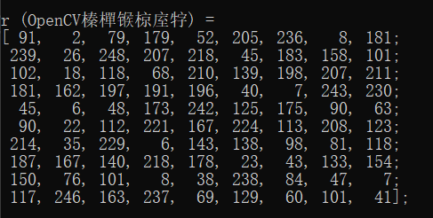
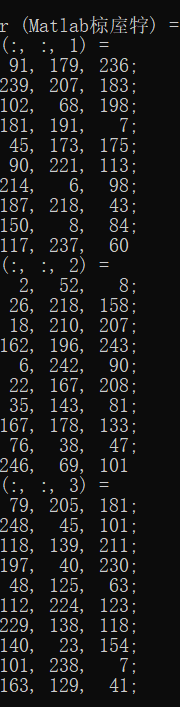
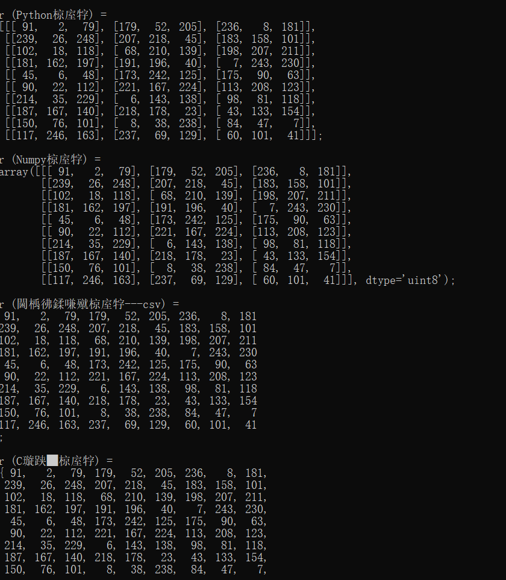
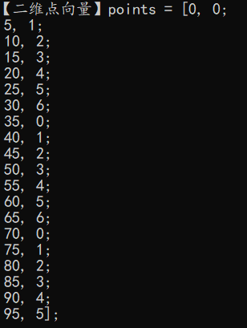
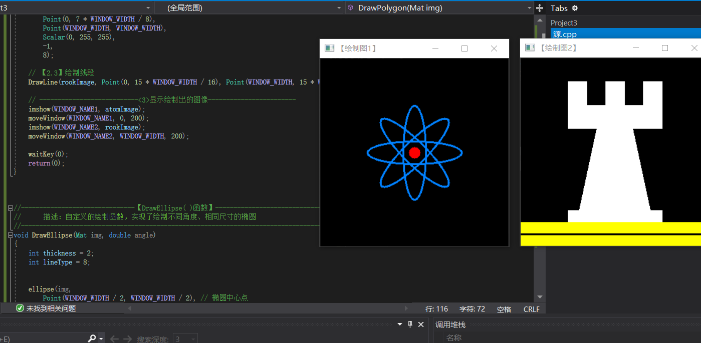

201809057 王世松 第二次作业

# 第四章 OpenCV数据结构与基本绘图

### 4.1 基础图象容器Mat&&使用

1.使用Mat()构造函数


```cpp
Mat M(2,2,CV_8UC3,Scalar(0,0,255));
cout << "M = " << endl << " " << M << endl << endl;
CV_[The number of bits per item][Signed or Unsigned][Type Prefix]C[The channel number]
即：
CV_[位数][带符号与否][类型前缀]C[通道数]
```
2.在 C\C++中通过构造函数进行初始化这种方法为在 CC+ 中通过构造函数进行初始化：
```cpp
int sz[3]={2,2,2};
Mat L(3,sz,CV_8UC,Scalar::all (0));
```
上面的例子演示了如何创建一个超过两维的矩阵∶指定维数，然后传递一个│指向一个数组的指针，这个数组包含每个维度的尺寸;后续的两个参数与方法一中的相同。

3.为已存在的 lpllmage 指针创建信息头

```cpp
IplImage* img = cvLoadImage("1.jpg",1);
Mat mtx（img）;//转换 IplImage*-> Mat
```

4.利用 Create（）函数
利用Mat 类中的 Create（成员函数进行 Mat类的初始化操作:
```cpp
M.create(4,4,CV_8UC(2));
cout << "M="<< endl <<""<< M<< endl << endl;
```
#### 测试结果：

<center>图1 create()函数</center> 

##### 注意**   此创建方法不能为矩阵设初值，只是在改变尺寸时重新为矩阵数据设定内存。

5.采用 Matlab 式的初始化方式
 zeros()，ones（），eyes（。∶
```cpp
Mat E = Mat::eye (4,4,CV_64F);
cout << "E ="<< endl <<""<<E << endl << endl;Mat O = Mat::ones(2,2,CV_32F);
cout << "O="<< endl << ""<< 0<< endl << endl;Mat 2 = Mat::zeros(3,3,CV_8UCl);
cout << " ="<< endl <<""<< z << endl << endl;
```
6.对小矩阵使用逗号分隔式初始化函数

```cpp
Mat C= (Mat_<double>(3,3)<< 0,-1,0,-1,5,-1,0,-1,0);cout << "C ="<< endl <<""<< C<< endl << endl;
```
7.为已存在的对象创建新信息头
为成员函数 clone（）或者 copyTo0）为一个已存在的 Mat 对象创建一个新的信息头:
```cpp
Mat RowClone = C.row(1).clone ();
cout<< "RowClone="<< endl <<""<< RowClone << endl << endl;
```

## 4.2 OpenCV的格式化输出

##### 实验代码：
```cpp
#include "opencv2/core.hpp"
#include <iostream>

using namespace std;
using namespace cv;

static void help(char** argv)
{
    cout
        << "\n------------------------------------------------------------------\n"
        << " This program shows the serial out capabilities of cv::Mat\n"
        << "That is, cv::Mat M(...); cout << M;  Now works.\n"
        << "Output can be formatted to OpenCV, matlab, python, numpy, csv and \n"
        << "C styles Usage:\n"
        << argv[0]
        << "\n------------------------------------------------------------------\n\n"
        << endl;
}


int main(int argc, char** argv)
{    
    cv::CommandLineParser parser(argc, argv, "{help h||}");
    if (parser.has("help"))
    {
        help(argv);
        return 0;
    }
    Mat I = Mat::eye(4, 4, CV_64F);
    I.at<double>(1, 1) = CV_PI;
    cout << "I = \n" << I << ";" << endl << endl;
    int sz[3] = { 2,2,2 };
    Mat L(3, sz, CV_8UC(2), Scalar::all(0));

    Mat r = Mat(10, 3, CV_8UC3);
    randu(r, Scalar::all(0), Scalar::all(255));

    cout << "r (OpenCV默认风格) = \n" << r << ";" << endl << endl;

    cout << "r (Matlab风格) = \n" << format(r, Formatter::FMT_MATLAB) << ";" << endl << endl;

    cout << "r (Python风格) = \n" << format(r, Formatter::FMT_PYTHON) << ";" << endl << endl;

    cout << "r (Numpy风格) = \n" << format(r, Formatter::FMT_NUMPY) << ";" << endl << endl;

    cout << "r (逗号分隔风格---csv) = \n" << format(r, Formatter::FMT_CSV) << ";" << endl << endl;

    cout << "r (C语言风格) = \n" << format(r, Formatter::FMT_C) << ";" << endl << endl;

    return 0;
}
```

<center>图2 opencv默认风格输出 </center> 


<center>图3 Matlab风格输出 </center> 


<center>图4 Python风格输出、Numpy风格输出、逗号分隔风格输出、C语言风格输出 </center> 


- 定义和输出二维点
```cpp
Point2f p(6, 2);
    cout << "【二维点】p = " << p << ";" << endl;
```

- 定义和输出三维点
```cpp
Point3f p3f(8, 2, 0);
    cout << "【三维点】p3f = " << p3f << ";" << endl;
```

- 基于Mat的vector输出
```cpp
 vector<float> v;
    v.push_back(1);
    v.push_back(2);
    v.push_back(3);

    cout << "【基于Mat的vector】shortvec = " << Mat(v) << endl;
```

- 输出二维点向量
```cpp
    vector<Point2f> points(20);
    for (size_t i = 0; i < points.size(); ++i)
        points[i] = Point2f((float)(i * 5), (float)(i % 7));

    cout << "【二维点向量】points = " << points << ";" << endl;
```

<center>图11 二维vector输出 </center> 

## 4.3 颜色空间转换---cvtColor()函数

```cpp
void cvtColor(InputArray src,OutputArray dst,int code,int dstCn=0)
```
第一个参数为输入图像，第二个参数为输出图像，第三个参数为颜色空间转换的标识符，第四个参数为目标图像的通道数，若该参数是 0，表示目标图像取源图像的通道数。下面是一个调用示例∶
//此句代码的OpenCV2 版为∶
```
cvtColor（srcImage，dstImage，CV_GRAY2BGR）;//转换原始图为灰度图
```
//此句代码的 OpenCV3 版为∶
```
cvtColor（srcImage，dstImage，COLOR_GRAY2BGR）;//转换原始图为灰度图.
```
<FONT COLOR=RED>OpenCV 默认的图片通道存储顺序是 BGR，即蓝绿红，而不是 RGB。</FONT>
```cpp
#include<iostream>
#include<opencv2/opencv.hpp>

using namespace cv;
void main() {
	//【1】载入图片
	Mat srcImage = imread("1.jpg", 1), dstImage;

	//【2】转换颜色空间
	cvtColor(srcImage, dstImage,COLOR_BGR2Lab);
    
    //【3】显示效果图
	imshow("效果图", dstImage);

    //【4】显示原图 
  	imshow("原图", srcImage);
	

	waitKey(0);
}
```


## 4.4 基本图形绘制
- 用于绘制直线的 line 函数;
- 用于绘制椭圆的 ellipse 函数;
- 用于绘制矩形的 rectangle 函数;
- 用于绘制圆的 circle 函数;
- 用于绘制填充的多边形的 fillPoly函数。
```cpp
#include <opencv2/core/core.hpp>
#include <opencv2/highgui/highgui.hpp>
#include <opencv2/imgproc/imgproc.hpp>
using namespace cv;


#define WINDOW_NAME1 "【绘制图1】"        //为窗口标题定义的宏 
#define WINDOW_NAME2 "【绘制图2】"        //为窗口标题定义的宏 
#define WINDOW_WIDTH 300//定义窗口大小的宏

void DrawEllipse(Mat img, double angle);//绘制椭圆
void DrawFilledCircle(Mat img, Point center);//绘制圆
void DrawPolygon(Mat img);//绘制多边形
void DrawLine(Mat img, Point start, Point end);//绘制线段

int main(void)
{

    // 创建空白的Mat图像
    Mat atomImage = Mat::zeros(WINDOW_WIDTH, WINDOW_WIDTH, CV_8UC3);
    Mat rookImage = Mat::zeros(WINDOW_WIDTH, WINDOW_WIDTH, CV_8UC3);

    // ---------------------<1>绘制化学中的原子示例图------------------------

    //【1.1】先绘制出椭圆
    DrawEllipse(atomImage, 90);
    DrawEllipse(atomImage, 0);
    DrawEllipse(atomImage, 45);
    DrawEllipse(atomImage, -45);

    //【1.2】再绘制圆心
    DrawFilledCircle(atomImage, Point(WINDOW_WIDTH / 2, WINDOW_WIDTH / 2));

    // ----------------------------<2>绘制组合图-----------------------------
    //【2.1】先绘制出椭圆
    DrawPolygon(rookImage);

    // 【2.2】绘制矩形
    rectangle(rookImage,
        Point(0, 7 * WINDOW_WIDTH / 8),
        Point(WINDOW_WIDTH, WINDOW_WIDTH),
        Scalar(0, 255, 255),
        -1,
        8);

    // 【2.3】绘制线段
    DrawLine(rookImage, Point(0, 15 * WINDOW_WIDTH / 16), Point(WINDOW_WIDTH, 15 * WINDOW_WIDTH / 16));

    // ---------------------------<3>显示绘制出的图像------------------------
    imshow(WINDOW_NAME1, atomImage);
    moveWindow(WINDOW_NAME1, 0, 200);
    imshow(WINDOW_NAME2, rookImage);
    moveWindow(WINDOW_NAME2, WINDOW_WIDTH, 200);

    waitKey(0);
    return(0);
}


//-------------------------------【DrawEllipse( )函数】--------------------------------
//		描述：自定义的绘制函数，实现了绘制不同角度、相同尺寸的椭圆
//-----------------------------------------------------------------------------------------
void DrawEllipse(Mat img, double angle)
{
    int thickness = 2;
    int lineType = 8;


    ellipse(img,
        Point(WINDOW_WIDTH / 2, WINDOW_WIDTH / 2), // 椭圆中心点
        Size(WINDOW_WIDTH / 4, WINDOW_WIDTH / 16), //大小
        angle,                                   // 旋转角度 angle
        0,
        360,                                     // 扩展弧度[0, 360]
        Scalar(255, 129, 0),                   // 颜色：蓝色
        thickness,                               // 线宽
        lineType);                              // 线型
}


//-----------------------------------【DrawFilledCircle( )函数】---------------------------
//		描述：自定义的绘制函数，实现了实心圆的绘制
//-----------------------------------------------------------------------------------------
void DrawFilledCircle(Mat img, Point center)
{
    int thickness = -1;
    int lineType = 8;

    circle(img,
        center,                                      // 圆心
        WINDOW_WIDTH / 32,                             // 半径
        Scalar(0, 0, 255),                         // 颜色：红色
        thickness,                                   // 线宽-1，因此是实心圆
        lineType);
}


//-----------------------------------【DrawPolygon( )函数】--------------------------
//		描述：自定义的绘制函数，实现了凹多边形的绘制
//--------------------------------------------------------------------------------------
void DrawPolygon(Mat img)
{
    int lineType = 8;

    //创建一些点
    Point rookPoints[1][20];
    rookPoints[0][0] = Point(WINDOW_WIDTH / 4, 7 * WINDOW_WIDTH / 8);
    rookPoints[0][1] = Point(3 * WINDOW_WIDTH / 4, 7 * WINDOW_WIDTH / 8);
    rookPoints[0][2] = Point(3 * WINDOW_WIDTH / 4, 13 * WINDOW_WIDTH / 16);
    rookPoints[0][3] = Point(11 * WINDOW_WIDTH / 16, 13 * WINDOW_WIDTH / 16);
    rookPoints[0][4] = Point(19 * WINDOW_WIDTH / 32, 3 * WINDOW_WIDTH / 8);
    rookPoints[0][5] = Point(3 * WINDOW_WIDTH / 4, 3 * WINDOW_WIDTH / 8);
    rookPoints[0][6] = Point(3 * WINDOW_WIDTH / 4, WINDOW_WIDTH / 8);
    rookPoints[0][7] = Point(26 * WINDOW_WIDTH / 40, WINDOW_WIDTH / 8);
    rookPoints[0][8] = Point(26 * WINDOW_WIDTH / 40, WINDOW_WIDTH / 4);
    rookPoints[0][9] = Point(22 * WINDOW_WIDTH / 40, WINDOW_WIDTH / 4);
    rookPoints[0][10] = Point(22 * WINDOW_WIDTH / 40, WINDOW_WIDTH / 8);
    rookPoints[0][11] = Point(18 * WINDOW_WIDTH / 40, WINDOW_WIDTH / 8);
    rookPoints[0][12] = Point(18 * WINDOW_WIDTH / 40, WINDOW_WIDTH / 4);
    rookPoints[0][13] = Point(14 * WINDOW_WIDTH / 40, WINDOW_WIDTH / 4);
    rookPoints[0][14] = Point(14 * WINDOW_WIDTH / 40, WINDOW_WIDTH / 8);
    rookPoints[0][15] = Point(WINDOW_WIDTH / 4, WINDOW_WIDTH / 8);
    rookPoints[0][16] = Point(WINDOW_WIDTH / 4, 3 * WINDOW_WIDTH / 8);
    rookPoints[0][17] = Point(13 * WINDOW_WIDTH / 32, 3 * WINDOW_WIDTH / 8);
    rookPoints[0][18] = Point(5 * WINDOW_WIDTH / 16, 13 * WINDOW_WIDTH / 16);
    rookPoints[0][19] = Point(WINDOW_WIDTH / 4, 13 * WINDOW_WIDTH / 16);

    const Point* ppt[1] = { rookPoints[0] };
    int npt[] = { 20 };

    fillPoly(img,
        ppt,                          // 多边形的顶点集
        npt,                          // 多边形顶点数目
        1,
        Scalar(255, 255, 255),      // 颜色：白色
        lineType);
}


//-----------------------------------【DrawLine( )函数】--------------------------
//		描述：自定义的绘制函数，实现了线的绘制
//---------------------------------------------------------------------------------
void DrawLine(Mat img, Point start, Point end)
{
    int thickness = 2;
    int lineType = 8;
    line(img,
        start,
        end,
        Scalar(0, 0, 0),
        thickness,
        lineType);
}
```

<center> 图13 构造基础图形 </center> 


-----
# 第四章总结

- Mat类的构造函数
- Mat类的成员函数
- Point类--表示点的数据结构
- Scalar类--表示颜色的数据结果
- Size类--表示尺寸的数据结果
- Rect类--表示矩形的数据结构
- CvtColor()--用于颜色空间转换

----
# 第五章 

### 5.1 颜色空间缩减

如uchar类型的三通道图像，每个通道取值可以是 0～255，于是就有256×256 个不同的值。我们可以定义∶

- 0~9像素值为0
- 10~19像素值为10
- 20~29像素值为20

$$I_{new}=(\frac {I_{old}}{10})×10$$

（1）图像在内存中的存储方式 图像矩阵的大小取决于所用的颜色模型，取决于所用通道数。如果是灰度图像，矩阵就会如图所示。 

对于多通道图像来说，矩阵中的列会包含多个子列，其子列个数与通道数相同。如图所示RGB颜色模型的矩阵。  （2）颜色空间缩减 颜色空间缩减的做法是：将现有颜色空间值除以某个输入值，以获得较少的颜色数。即做减法，比如颜色值0到9可取为新值0,10到19可取为10，以此类推。

（3）LUT函数：Look up table操作 Look up table操作使用operationsOnArrays：LUT()函数，用于批量进行图像元素查找、扫描与操作图像。

（4）计时函数 简便的计时函数：getTickCount()和get TickFrequency()。 getTickCount()函数：返回CPU自某个事件以来走过的时钟周期数 getTickFrequency()函数：返回CPU一秒钟所走的时钟周期数。

（5）访问图像中像素的三类方法

- 1、指针访问：C操作符[]；
- 2、 迭代器iterator
- 3、动态地址计算


<center> 图14 指针访问图像像素 </center>


<center> 图15 迭代器访问图像像素 </center>


<center> 图16 实时地址访问图像像素 </center>


## 5.2 ROI区域图像叠加&图像混合

（1）定义ROI区域的两种方法，1.使用cv:Rect，函数表示一个矩形区域。指定矩形的左上角坐标（构造函数的前两个参数）和矩形的长宽（构造函数的后两个参数）就可以定义一个矩形区域。
  2.指定感兴趣行或列的范围（Range）。Range是指从起始索引到终止索引（不包括终止索引）的一连段连续序列。cv::Range可以用来定义Range。

（2)初级图像混合——线性混合操作

线性混合操作是一种典型的二元（两个输入）的像素操作，它的理论公式是这样的： 我们通过在范围0到1之间改变alpha值，来对两幅图像（f0（x）和f1（x））或两段视频（同样为（f0（x）和f1（x））产生时间上的画面叠化（cross-dissolve）效果，就像幻灯片放映和电影制作中的那样。即在幻灯片翻页时设置的前后页缓慢过渡叠加效果，以及电影情节过渡时经常出现的画面叠加效果。

1）addWeighted函数
```
void addWeighted(InputArray src1, double alpha, InputArray src2, double beta, double gamma, OutputArray dst, int dtype=-1);
```
①第一个参数，InputArray类型的src1，表示需要加权的第一个数组，常常填一个Mat。

②第二个参数，alpha，表示第一个数组的权重

③第三个参数，src2，表示第二个数组，它需要和第一个数组拥有相同的尺寸和通道数。

④第四个参数，beta，表示第二个数组的权重值。

⑤第五个参数，dst，输出的数组，它和输入的两个数组拥有相同的尺寸和通道数。

⑥第六个参数，gamma，一个加到权重总和上的标量值。看下面的式子自然会理解。

⑦第七个参数，dtype，输出阵列的可选深度，有默认值-1。;当两个输入数组具有相同的深度时，这个参数设置为-1（默认值），即等同于src1.depth（）。


<center>图18 图片线性混合 </center>


<center>图19 ROI混合 </center>

## 5.3 亮度和对比度的调节

使用opencv对图片的亮度和对比度进行调节


<center>图20 图像亮度和对比度调节 </center>

## 5.4 离散傅里叶变换

使用OpenCV对图像进行离散傅里叶变换处理


<center>图21 图像傅里叶 </center>


# 第五章总结

- LUT函数：用于批量进行图像元素查找、扫描与操作图像。
- getTickCount()函数：返回CPU自某个事件以来走过的时钟周期数 
- getTickFrequency()函数：返回CPU一秒钟所走的时钟周期数。
- 访问图像中像素的三类方法

 1、指针访问：C操作符[]；
 2、 迭代器iterator
 3、动态地址计算
  
- cv:Rect，函数表示一个矩形区域。
- addWeighted函数

----