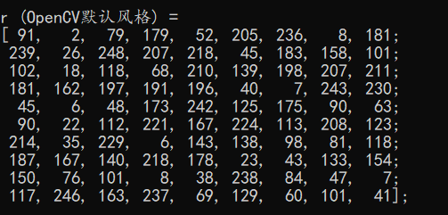
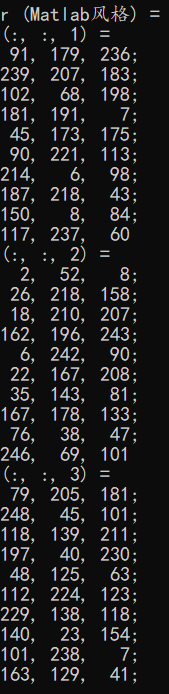
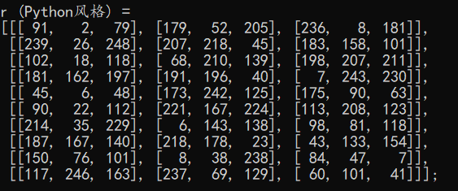
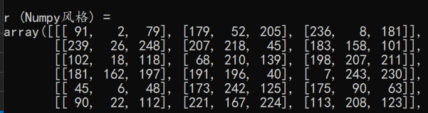
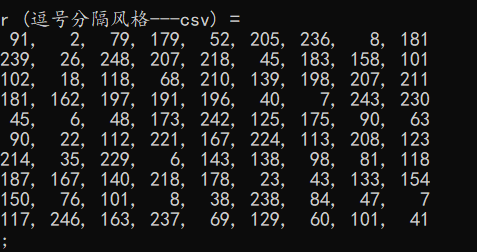
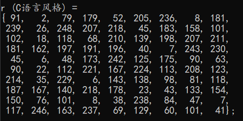
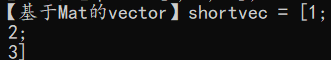
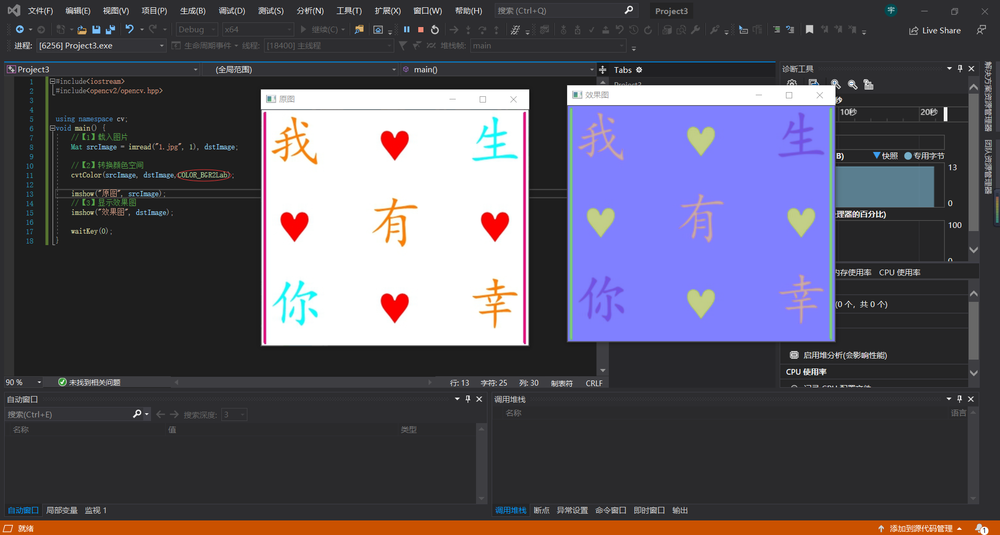

201809058  Wang Yulong  ———— Chapter4-5

<font face =楷体>

# <center> Chapter4  </center>

4.1 基础图像容器Mat

【方法一】
使用Mat()构造函数


```cpp
Mat M(2,2,CV_8UC3,Scalar(0,0,255));
cout << "M = " << endl << " " << M << endl << endl;
CV_[The number of bits per item][Signed or Unsigned][Type Prefix]C[The channel number]
即：
CV_[位数][带符号与否][类型前缀]C[通道数]
```
【方法二】在 C\C++中通过构造函数进行初始化这种方法为在 CC+ 中通过构造函数进行初始化，示范代码如下：
```cpp
int sz[3]={2,2,2};
Mat L(3,sz,CV_8UC,Scalar::all (0));
```
上面的例子演示了如何创建一个超过两维的矩阵∶指定维数，然后传递一个│指向一个数组的指针，这个数组包含每个维度的尺寸;后续的两个参数与方法一中的相同。

【方法三】为已存在的 lpllmage 指针创建信息头
方法三是为已存在的 Ipllmage 指针创建信息头，示范代码如下：
```cpp
IplImage* img = cvLoadImage("1.jpg",1);
Mat mtx（img）;//转换 IplImage*-> Mat
```

 【方法四】利用 Create（）函数
方法四是利用Mat 类中的 Create（成员函数进行 Mat类的初始化操作，示范代码如下:
```cpp
M.create(4,4,CV_8UC(2));
cout << "M="<< endl <<""<< M<< endl << endl;
```
测试图：

<center>图1 create()函数</center> 
需要注意的是，此创建方法不能为矩阵设初值，只是在改变尺寸时重新为矩阵数据开辟内存而已。

【方法五】采用 Matlab 式的初始化方式
方法五采用 Matlab形式的初始化方式∶ zeros()，ones（），eyes（。使用以下方式指定尺寸和数据类型∶
```cpp
Mat E = Mat::eye (4,4,CV_64F);
cout << "E ="<< endl <<""<<E << endl << endl;Mat O = Mat::ones(2,2,CV_32F);
cout << "O="<< endl << ""<< 0<< endl << endl;Mat 2 = Mat::zeros(3,3,CV_8UCl);
cout << " ="<< endl <<""<< z << endl << endl;
```
【方法六】对小矩阵使用逗号分隔式初始化函数
方法六为对小矩阵使用逗号分隔式初始化函数，示范代码如下:
```cpp
Mat C= (Mat_<double>(3,3)<< 0,-1,0,-1,5,-1,0,-1,0);cout << "C ="<< endl <<""<< C<< endl << endl;
```
【方法七】为已存在的对象创建新信息头
方法七为使用成员函数 clone（）或者 copyTo0）为一个已存在的 Mat 对象创建一个新的信息头，示范代码如下:
```cpp
Mat RowClone = C.row(1).clone ();
cout<< "RowClone="<< endl <<""<< RowClone << endl << endl;
```

## 4.2 OpenCV的格式化输出

代码展示
```cpp
#include "opencv2/core.hpp"
#include <iostream>

using namespace std;
using namespace cv;

static void help(char** argv)
{
    cout
        << "\n------------------------------------------------------------------\n"
        << " This program shows the serial out capabilities of cv::Mat\n"
        << "That is, cv::Mat M(...); cout << M;  Now works.\n"
        << "Output can be formatted to OpenCV, matlab, python, numpy, csv and \n"
        << "C styles Usage:\n"
        << argv[0]
        << "\n------------------------------------------------------------------\n\n"
        << endl;
}


int main(int argc, char** argv)
{    
    cv::CommandLineParser parser(argc, argv, "{help h||}");
    if (parser.has("help"))
    {
        help(argv);
        return 0;
    }
    Mat I = Mat::eye(4, 4, CV_64F);
    I.at<double>(1, 1) = CV_PI;
    cout << "I = \n" << I << ";" << endl << endl;
    int sz[3] = { 2,2,2 };
    Mat L(3, sz, CV_8UC(2), Scalar::all(0));

    Mat r = Mat(10, 3, CV_8UC3);
    randu(r, Scalar::all(0), Scalar::all(255));

    cout << "r (OpenCV默认风格) = \n" << r << ";" << endl << endl;

    cout << "r (Matlab风格) = \n" << format(r, Formatter::FMT_MATLAB) << ";" << endl << endl;

    cout << "r (Python风格) = \n" << format(r, Formatter::FMT_PYTHON) << ";" << endl << endl;

    cout << "r (Numpy风格) = \n" << format(r, Formatter::FMT_NUMPY) << ";" << endl << endl;

    cout << "r (逗号分隔风格---csv) = \n" << format(r, Formatter::FMT_CSV) << ";" << endl << endl;

    cout << "r (C语言风格) = \n" << format(r, Formatter::FMT_C) << ";" << endl << endl;

    return 0;
}
```

<center>图2 opencv默认风格输出 </center> 


<center>图3 Matlab风格输出 </center> 


<center>图4 Python风格输出 </center> 


<center>图5 Numpy风格输出 </center> 


<center>图6 逗号分隔风格输出 </center> 


<center>图7 C语言风格输出 </center> 

- 定义和输出二维点
```cpp
Point2f p(6, 2);
    cout << "【二维点】p = " << p << ";" << endl;
```

<center>图8 二维点输出 </center> 

- 定义和输出三维点
```cpp
Point3f p3f(8, 2, 0);
    cout << "【三维点】p3f = " << p3f << ";" << endl;
```

<center>图9 三维点输出 </center> 

- 基于Mat的vector输出
```cpp
 vector<float> v;
    v.push_back(1);
    v.push_back(2);
    v.push_back(3);

    cout << "【基于Mat的vector】shortvec = " << Mat(v) << endl;
```

<center>图10 基于Mat的vector输出 </center> 

- 输出二维点向量
```cpp
    vector<Point2f> points(20);
    for (size_t i = 0; i < points.size(); ++i)
        points[i] = Point2f((float)(i * 5), (float)(i % 7));

    cout << "【二维点向量】points = " << points << ";" << endl;
```

<center>图11 二维vector输出 </center> 

## 4.3 颜色空间转换---cvtColor()函数

```cpp
void cvtColor(InputArray src,OutputArray dst,int code,int dstCn=0)
```
第一个参数为输入图像，第二个参数为输出图像，第三个参数为颜色空间转换的标识符，第四个参数为目标图像的通道数，若该参数是 0，表示目标图像取源图像的通道数。下面是一个调用示例∶
//此句代码的OpenCV2 版为∶
cvtColor（srcImage，dstImage，CV_GRAY2BGR）;//转换原始图为灰度图
//此句代码的 OpenCV3 版为∶
cvtColor（srcImage，dstImage，COLOR_GRAY2BGR）;//转换原始图为灰度图.

<FONT COLOR=RED>OpenCV 默认的图片通道存储顺序是 BGR，即蓝绿红，而不是 RGB。</FONT>
```cpp
#include<iostream>
#include<opencv2/opencv.hpp>

using namespace cv;
void main() {
	//【1】载入图片
	Mat srcImage = imread("1.jpg", 1), dstImage;

	//【2】转换颜色空间
	cvtColor(srcImage, dstImage,COLOR_BGR2Lab);
    
    //【3】显示效果图
	imshow("效果图", dstImage);

    //【4】显示原图 
  	imshow("原图", srcImage);
	

	waitKey(0);
}
```

<center>图12 颜色空间转换 </center> 


## 4.4 基本图形绘制
- 用于绘制直线的 line 函数;
- 用于绘制椭圆的 ellipse 函数;
- 用于绘制矩形的 rectangle 函数;
- 用于绘制圆的 circle 函数;
- 用于绘制填充的多边形的 fillPoly函数。


-----
# <center> Sammary </center>

- Mat类的构造函数
- Mat类的成员函数
- Point类--表示点的数据结构
- Scalar类--表示颜色的数据结果
- Size类--表示尺寸的数据结果
- Rect类--表示矩形的数据结构
- CvtColor()--用于颜色空间转换

----
# <center> Chapter 5 </center>

5.1 颜色空间缩减

如uchar类型的三通道图像，每个通道取值可以是 0～255，于是就有256×256 个不同的值。我们可以定义∶

- 0~9像素值为0
- 10~19像素值为10
- 20~29像素值为20

$$I_{new}=(\frac {I_{old}}{10})×10$$


